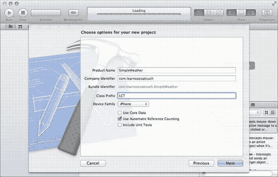
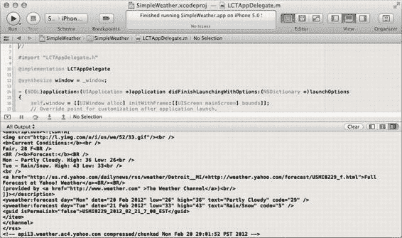

# 第 6 章：集成网络与 Web 服务

iPhone 开启了一个始终联网的应用新时代。App Store 中几乎每个 iOS 应用都会以某种方式使用网络连接，无论是加载图片、向 Game Center 排行榜提交高分，还是向开发者报告分析数据。然而，作为开发者，我们必须审慎考虑数据使用量、发送内容以及发送方式。许多用户（尤其是美国以外的用户）并未购买昂贵的无限流量套餐，因此不会欣赏一个启动时下载几百兆图片的应用。理解如何使用这些设备的网络功能，是 Cocoa Touch 开发者的基本技能。

与学习网络服务使用密不可分的，是掌握如何集成 Web 服务。仅仅从互联网读取数据是不够的，还必须解析这些数据，并让应用据此运行。Web 上的数据格式多种多样，从 XML 到 JSON 再到自定义格式，来源也各不相同，可能是静态文件，也可能是复杂的 Web 应用。此外，这些 Web 服务通常还会要求你向它们发送数据，这本身就是一系列挑战，涉及文本编码和图像表示等方面。本章将带你逐一应对这些场景，从从网络加载简单数据，到向 Web 服务上传文件和发送数据。在此过程中，我们将运用新学到的技能来创建一个 Twitter 客户端。

我们从简单的开始：将网络上的简单数据加载到应用中。

## 从网络加载数据

如果无法从网络读取数据，许多类别的应用将变得毫无用处。天气应用、电影票应用以及新闻阅读应用都将无法提供实用功能。幸运的是，我们可以在 iOS 设备上使用网络。让我们看一个使用 `NSURLConnection` 类从 Web 服务获取天气数据的快速示例。要获取天气数据，我们首先需要确定要使用的 Web 服务。市面上有各种天气服务，每个都有各自的许可协议和使用条款。在本书中，我将使用 Yahoo! Weather 服务。你可以在 [`developer.yahoo.com/weather/`](http://developer.yahoo.com/weather/) 上了解更多信息。我们实际用于获取天气数据的 URL 是 [`weather.yahooapis.com/forecastrss?p=48226`](http://weather.yahooapis.com/forecastrss?p=48226)。此例中，`48226` 是密歇根州底特律的邮政编码，作为参数传递给 URL。该过程包含三个步骤。首先，我们必须创建一个 URL 请求。

### 创建 URL 请求

`NSURLRequest` 对象封装了 `NSURLConnection` 对象执行请求所需的一切：要连接的 URL、请求的缓存设置，以及需要随请求发送的任何 HTTP 标头。要创建 `NSURLRequest` 对象，我们首先需要创建一个 `NSURL` 对象来表示 URL。创建请求的代码如下：

```objective-c
NSURL *weatherURL = [NSURL
    URLWithString:@"http://weather.yahooapis.com/forecastrss?p=48226"];
NSURLRequest *urlRequest = [NSURLRequest requestWithURL:weatherURL];
```

URL 请求的默认设置对于这个简单任务已经足够，因此我们无需进行任何进一步配置。

### 创建 URL 连接

创建请求后，我们几乎已经准备好创建连接并获取数据。我们将使用 `NSURLConnection` 类方法 `sendSynchronousRequest:returningResponse:error:`，该方法会同步地从网络加载数据。第一个参数是我们刚创建的请求，但后两个参数需要提前创建。

**注意：** 在实际开发中，使用同步 URL 连接通常是一个坏主意。它们会在等待连接完成时停止执行。如果网络连接较慢或正在加载大量数据，使用同步请求会导致应用挂起，直到连接完成。本章稍后我们将介绍异步请求，这是一种处理数据加载的更好方式，并且在第 7 章中，我们将更一般性地讨论此类性能问题。

此方法在系统头文件 `NSURLConnection.h` 中声明：

```objective-c
+ (NSData *)sendSynchronousRequest:(NSURLRequest *)request
                returningResponse:(NSURLResponse **)response
                            error:(NSError **)error;
```

如你所见，后两个参数并非指向对象的常规指针，而是指向对象指针的指针，这就是它们有两个星号的原因。这最初可能会让人困惑，但实际上这只是该方法返回指针的一种方式。你需要为每个参数创建一个指针，并将其初始化为指向 `nil`：

```objective-c
NSURLResponse *urlResponse = nil;
NSError *error = nil;
```

创建好这两个指针后，你就可以调用该方法并创建连接了。


```objc
NSData *receivedData = [NSURLConnection sendSynchronousRequest:urlRequest returningResponse:&urlResponse error:&error];
```

在`urlResponse`和`error`前添加一个取地址符（`&`），会传递指向指针的指针，而不是指针本身。当该方法执行完毕后，这些指针将指向相应的对象。通过以这种方式传递指针，我们可以从一个方法中接收多个返回值。

## 解释响应

当该方法返回时，`receivedData`对象将以`NSData`对象的形式包含我们从服务器获取的数据。就其本身而言，一个普通的`NSData`对象并不是很有用。由于我们知道该服务返回的是文本，而不是图像等其他数据，让我们将其转换为`NSString`对象：

```objc
NSString *receivedText = [[NSString alloc] initWithData:receievedData encoding:NSUTF8StringEncoding];
```

[www.it-ebooks.info](http://www.it-ebooks.info/)

**第 6 章：集成网络与 Web 服务**

**注意：** 你可能已经注意到我们使用了`NSUTF8StringEncoding`作为第二个参数。你接收到的数据的字符串编码取决于你所连接的服务器。大多数服务使用 UTF8 或 ASCII 文本编码。有关不同编码类型及其使用时机的更多信息，请查阅 Joel Spolsky 关于该主题的文章，地址为：

[www.joelonsoftware.com/articles/Unicode.html](http://www.joelonsoftware.com/articles/Unicode.html)

现在我们有了一个包含服务器对我们请求的响应的字符串。这并不能立即为我们所用，因为它是 XML 格式的，但这是一个开始。一旦你从服务器获取了数据，只需对其进行解析即可。我们还可以从`urlResponse`对象中获取一些信息。由于这是一个 HTTP 连接（我们的 URL 以`http://`开头），响应对象实际上是`NSHTTPURLResponse`的一个实例，它是`NSURLResponse`的子类。这个特定于 HTTP 的子类为你提供了额外的数据，例如响应的状态码。例如，假设你在编写一个 iOS 应用，用于与一个支持网络的咖啡壶通过 HTTP 进行交互——这是一个对该协议的明确定义的使用——并且你想要适当地响应 HTTP 状态码 418（“我是一个茶壶”，如果你意外地连接到了一个茶壶，而不是咖啡壶，就会得到这个状态码），代码可能如下所示：

```objc
if ([urlResponse isKindOfClass:[NSHTTPURLResponse class]]) {
    NSInteger statusCode = [(NSHTTPURLResponse *)urlResponse statusCode];
    if (statusCode == 418) {
        // 哎呀，这是一个茶壶！
        NSLog(@"意外地给一个茶壶发了消息。");
    }
}
```

虽然这个例子看起来相当简单，但它提供了一个讨论如何在 Objective-C 中处理棘手情况的机会。我们想要使用响应的状态码，但只有当响应是`NSHTTPURLResponse`对象时才可用；任何其他`NSURLResponse`对象都不行。我们使用`isKindOfClass:`方法来检查`urlResponse`的类。如果它是`NSHTTPURLResponse`，那么我们就知道可以检查状态码了。为了在其上调用`statusCode`方法，我们首先使用圆括号将其强制转换为`NSHTTPURLResponse`对象。这让编译器知道了我们的假设，并且在 Xcode 中会启用代码补全功能。

一般来说，大于或等于 200 且小于 300 的 HTTP 状态码被认为是“成功的”，而一些常见的错误在 400 和 500 级范围内。某些 Web 服务要求成功时状态码返回 200，你可以在针对它们进行编程时利用这一点。`NSHTTPURLResponse`上另一个有用的方法是`allHeaderFields`，它返回随响应一起发送的头部信息。例如，如果头部信息指定了返回数据的缓存信息，这会非常有用。

如果你的连接出现问题，通常在从`sendSynchronousRequest:returningResponse:error:`返回时，`error`对象会被设置为一个`NSError`。`NSError`类定义了许多有用的方法，你可以用它们来获取关于该错误的更多信息。`localizedDescription`方法返回本地化文本，用于向用户显示。`code`方法返回一个错误码，该错误码特定于由`domain`方法返回的域。最后，`userInfo`方法返回的`NSDictionary`中可能包含更多信息。在尝试排查网络连接问题时，这些错误可能是无价之宝。

## 使用接收到的数据

一旦你收到来自所连接的服务器的响应，你将得到一个`NSData`对象，其中包含响应正文。根据你所连接的服务，这可能是文本、图像、视频或专有的二进制格式。如果是文本，它可能是纯文本、逗号或制表符分隔的文本数据库、JSON 或 XML 格式的数据，或者是一种专有的文本格式。

无论是什么格式，你的应用都应该适当地处理它。我们将在本章后面介绍图像、JSON 和 XML。现在，我们不会解析这些数据，而是只使用`NSLog()`宏在控制台中显示它。首先，让我们创建一个实际的应用程序来放置我们刚刚讲到的这些代码。打开 Xcode，通过选择**File → New → Project...** 来创建一个新项目。在对话框左侧的**iOS**下选择**Application**，然后从模板列表中选择**Empty Application**。对于**Product Name**，输入`SimpleWeather`。填写**Company Identifier**和**Class Prefix**字段，从**Device Family**下拉框中选择**iPhone**，取消选中**Use Core Data**和**Include Unit Tests**，并保持**Use Automatic Reference Counting**处于选中状态。完成后的设置应与图 6-1 相符。

[www.it-ebooks.info](http://www.it-ebooks.info/)



**第 6 章：集成网络与 Web 服务**

**图 6-1.** *创建 SimpleWeather 应用的 Xcode 设置* **注意：** 当你使用 Empty Application 模板时，运行应用时会在控制台中看到以下一行：

```
Application windows are expected to have a root view controller at the end of application launch
```

到我们完成这个应用时，我们的窗口将有一个根视图控制器，所以你不会再看到这条消息了。

点击**Next**，将你的项目保存到磁盘。打开你的应用委托实现文件（对于我的类前缀`LCT`来说是`LCTAppDelegate.m`）。将我们的网络代码以粗体形式添加到`application:didFinishLaunchingWithOptions:`方法中：

```objc
- (BOOL)application:(UIApplication *)application didFinishLaunchingWithOptions:(NSDictionary *)launchOptions
{
    self.window = [[UIWindow alloc] initWithFrame:[[UIScreen mainScreen] bounds]];
    // 应用启动后的自定义覆盖点。
    self.window.backgroundColor = [UIColor whiteColor];
    [self.window makeKeyAndVisible];

    NSURL *weatherURL = [NSURL URLWithString:@"http://weather.yahooapis.com/forecastrss?p=48226"];
    NSURLRequest *urlRequest = [NSURLRequest requestWithURL:weatherURL];

    NSURLResponse *urlResponse = nil;
    NSError *error = nil;
    NSData *receivedData = [NSURLConnection sendSynchronousRequest:urlRequest returningResponse:&urlResponse error:&error];

    NSString *receivedText = [[NSString alloc] initWithData:receivedData encoding:NSUTF8StringEncoding];
    NSLog(@"%@", receivedText);

    return YES;
}
```

运行应用。你在 iPhone 模拟器窗口中看不到太多内容，但 Xcode 窗口应该会显示它接收到的数据。如果你没有看到调试区域，请选择**View → Debug Area → Activate Console**，或按下**Shift+⌘+C**。调试区域出现在屏幕底部，其中包含从你的应用发送的日志消息。图 6-2 显示了一个 Xcode 窗口，其中调试区域在底部打开到控制台，并显示来自 Yahoo 的一些响应数据！

[www.it-ebooks.info](http://www.it-ebooks.info/)



**第 6 章：集成网络与 Web 服务**

显示。


