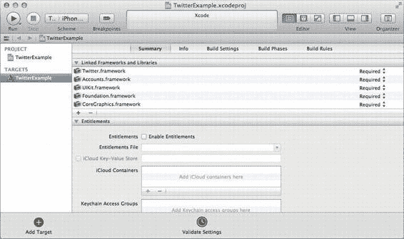

# 集成网络与 Web 服务

如果你需要创建自己的 JSON，它也内置了类似功能。以下代码片段创建了一个字符串数组，然后生成对应的 JSON 字符串：

```
NSArray *fruits = [NSArray arrayWithObjects:@"orange", @"apple", @"cherry",
    @"pear", nil];
NSError *encodingError = nil;
NSData *jsonData = [NSJSONSerialization dataWithJSONObject:fruits
    options:0
    error:&encodingError];
NSString *jsonString = [[NSString alloc] initWithData:jsonData
    encoding:NSUTF8StringEncoding];
NSLog(@"%@", jsonString);
```

这段代码中 `NSLog()` 行的输出如下：

```
["orange","apple","cherry","pear"]
```

如你所见，这是一个包含四个字符串的数组。这种方式非常适合将自定义数据上传到 Web 服务。然而 JSON 并非完美；例如，它没有内置的二进制数据类型，因此如果你想将图片上传到 Web 服务，要么将其编码为字符串，要么寻找其他上传数据的方法。

## 将 Foundation 对象解析为模型对象

通过 XML 和 JSON，我们已经学会了如何从 Web 服务获取数据，并将其解析为包含 `NSString` 和 `NSNumber` 对象的 `NSArray` 和 `NSDictionary` 对象。然而在 Objective-C 中，通常更倾向于使用原生对象。例如，在 Yahoo! Weather 示例中，我们理想的做法是创建一个 `LCTForecast` 对象来操作。现在我们直接创建它，并赋予我们想要使用的属性。在 Xcode 中，选择 **File → New → File...** 或按 **⌘+N**。在左侧栏中选择 **Cocoa Touch**，右侧选择 **Objective-C Class**。点击 **Next**，将类命名为 `LCTForecast`，作为 `NSObject` 的子类。点击 **Next**，然后点击 **Create** 按钮将文件保存到磁盘。打开新创建的头文件 `LCTForecast.h`，并添加以下加粗显示的属性：

```
#import <Foundation/Foundation.h>

@interface LCTForecast : NSObject

@property (copy) NSString *date;
@property (strong) NSNumber *low;
@property (strong) NSNumber *high;
@property (copy) NSString *text;

@end
```

接下来，切换到实现文件（`LCTForecast.m`），并在 `@implementation` 指令后添加属性的 `@synthesize` 指令：

```
@implementation LCTForecast

@synthesize date = _date;
@synthesize low = _low;
@synthesize high = _high;
@synthesize text = _text;

@end
```

现在，我们只需要一种将数据传入对象的方法。为此，我们将创建一个名为 `initWithDictionary:` 的方法，并将从 Web 服务器接收数据解析得到的字典传递给它。再次打开头文件（`LCTForecast.h`），添加一行声明该方法：

```
@interface LCTForecast : NSObject

@property (copy) NSString *date;
@property (strong) NSNumber *low;
@property (strong) NSNumber *high;
@property (copy) NSString *text;

- (id)initWithDictionary:(NSDictionary *)dictionary;

@end
```

现在，切换回实现文件（`LCTForecast.m`）并实现该方法。由于 XML 数据为每个属性返回字符串，我们需要将 `low` 和 `high` 转换为 `NSNumber` 对象。我们将通过使用它们的 `intValue` 方法获取 `int` 类型，然后从 `int` 创建 `NSNumber` 对象来实现。按以下加粗显示创建该方法：

```
@implementation LCTForecast

@synthesize date = _date;
@synthesize low = _low;
@synthesize high = _high;
@synthesize text = _text;

- (id)initWithDictionary:(NSDictionary *)dictionary
{
    self = [super init];
    if (self) {
        _date = [[dictionary objectForKey:@"date"] copy];
        _text = [[dictionary objectForKey:@"text"] copy];
        _low = [[NSNumber alloc] initWithInt:[[dictionary
            objectForKey:@"low"] intValue]];
        _high = [[NSNumber alloc] initWithInt:[[dictionary
            objectForKey:@"high"] intValue]];
    }
    return self;
}

@end
```

这个方法将从解析后的 `NSDictionary` 中提取我们要存储的值，使我们能够将 Web 服务的输出转换为原生对象。让我们回到应用程序委托并创建这些对象。打开你的应用程序委托的实现文件（`LCTAppDelegate.m`），在顶部导入 `LCTForecast` 头文件，添加如下加粗显示的行：

```
#import "LCTAppDelegate.h"
#import "LCTForecast.h"
```

接下来，修改 `parser:didStartElement:namespaceURI:qualifiedName:attributes:` 方法，通过添加加粗显示的代码并移除被删除线标记的代码，来创建 `LCTForecast` 对象并将其放入 `_forecasts` 数组：

```
- (void)parser:(NSXMLParser *)parser
    didStartElement:(NSString *)elementName
    namespaceURI:(NSString *)namespaceURI
    qualifiedName:(NSString *)qName
    attributes:(NSDictionary *)attributeDict
{
    if ([elementName isEqualToString:@"yweather:forecast"]) {
        LCTForecast *forecast = [[LCTForecast alloc]
            initWithDictionary:attributeDict];
        [_forecasts addObject:forecast];
    }
}
```

再次构建并运行应用程序，控制台输出应如下所示：

```
2012-02-25 00:55:09.876 SimpleWeather[2043:f803] (
    "<LCTForecast: 0x688be90>",
    "<LCTForecast: 0x688c0b0>"
)
```

如你所见，该数组包含两个 `LCTForecast` 对象，它们都是由我们的解析器创建的。现在，应用程序已准备好使用原生 Objective-C 范式来管理这些对象，并围绕它们构建有用的用户界面。

**注意：** 为 `LCTForecast` 对象打印的调试文本有点简略。你可以通过在任何继承自 `NSObject` 的类中实现 `description` 方法（该方法返回一个字符串）来控制控制台中打印的内容。以下是 `LCTForecast` 的 `description` 实现示例：

```
- (NSString *)description
{
    return [NSString stringWithFormat:@"%@, date: <%@>, text:
        <%@>, low: <%@>, high: <%@>",
        [super description],
        [self date],
        [self text],
        [self low],
        [self high]];
}
```

## 下载文件

到目前为止，我们已经介绍了如何处理来自服务器的文本数据，但其他类型的数据呢？你的应用程序可能需要从服务器下载图片、音乐、视频或文档。在这些情况下，最好将文件保存到设备的磁盘上。一个显而易见的解决方案是在连接加载完成时将从服务器接收的数据写入文件：

```
// 下载 Apple 网站图标
NSURL *faviconImageURL = [NSURL
    URLWithString:@"http://www.apple.com/favicon.ico"];
NSURLRequest *urlRequest = [NSURLRequest requestWithURL:faviconImageURL];
NSURLResponse *urlResponse = nil;
NSError *error = nil;
NSData *imageData = [NSURLConnection sendSynchronousRequest:urlRequest
    returningResponse:&urlResponse
    error:&error];
[imageData writeToFile:@"favicon.ico" atomically:YES];
```

这段代码下载 Apple 网站的小型浏览器图标，并将其保存到文件 `favicon.ico`。这对于小图片和文件来说效果很好——截至本文撰写时，该图标仅为 9 KB——但如果应用程序需要下载一个比设备内存容量还大的文件（比如应用程序要离线播放的视频）呢？这种方法就不行了，因为 `imageData` 变量会因过大而无法存储在内存中。在这些情况下，你需要实现 URL 连接委托方法，并仅使用传入的数据进行处理：

```
- (void)connection:(NSURLConnection *)connection didReceiveData:(NSData *)data
{
    NSFileHandle *fileHandle = [NSFileHandle
        fileHandleForWritingAtPath:@"favicon.ico"];
    [fileHandle seekToEndOfFile];
    [fileHandle writeData:data];
}
```


这里，我们使用`NSFileHandle`来管理在文件末尾写入数据。这让我们只需在内存中保留必要的数据量。但对于大文件而言，存在连接中断、用户进入隧道后失去与信号塔连接等风险。因此，你可能希望以原子方式操作：将数据写入磁盘上的临时位置，待连接无误完成后再将文件移至最终位置。上述代码示例可改写为以下原子操作形式：

```
- (void)connection:(NSURLConnection *)connection didReceiveData:(NSData *)data

{

NSString *filePath = @"favicon.ico";

NSURL *fileURL = [NSURL fileURLWithPath:filePath];

NSString *tmpFilePath = @"favicon.ico.tmp";

NSURL *tmpFileURL = [NSURL fileURLWithPath:tmpFilePath];

NSError *copyError = nil;

BOOL copySuccess = [[NSFileManager defaultManager] copyItemAtURL:fileURL

toURL:tmpFileURL

error:&copyError];

if (copySuccess == YES) {

NSFileHandle *fileHandle = [NSFileHandle

fileHandleForWritingAtPath:tmpFilePath];

[fileHandle seekToEndOfFile];

[fileHandle writeData:data];

NSError *moveError = nil;

BOOL moveSuccess =

[[NSFileManager defaultManager] replaceItemAtURL:fileURL

withItemAtURL:tmpFileURL

backupItemName:@"favicon.bak"

options:0

resultingItemURL:NULL

error:&moveError];

if (moveSuccess == NO) {

NSLog(@"Error moving item at URL %@ to URL at %@: %@",

tmpFileURL,

fileURL,

[moveError localizedDescription]);

}

}

else {

NSLog(@"Error copying item at URL %@ to URL at %@: %@",

fileURL,

tmpFileURL,

[copyError localizedDescription]);

}

}
```

### 何时缓存文件

将内容保存到磁盘时，主要有两个存储位置：`Documents`目录和`Caches`目录。两者的关键区别在于：`Caches`目录的内容不会被备份，且在 iOS 5 及以上系统中，当设备存储空间不足时，操作系统可能会清空该目录。因此，任何不易重新创建的文件（例如用户生成的内容）都应保存在`Documents`文件夹中，以防永久丢失。而能够轻松重新下载的数据（例如图片以及你所维护的 Web 服务提供的内容）则可保存在`Caches`目录中。此外还存在一种中间情况：内容可轻松重新下载，但又不希望系统立即清除。这类内容可能包括用户保存以供离线查看的数据，或用户正在使用的大文件。针对这种情况，Apple 在 iOS 5.0.1 中更新了一个标志，你可以对`Documents`目录中的文件设置该标志，以防止其被备份。

这既避免了大量易重新下载的文件占用用户 iCloud 备份的宝贵空间，又防止了 iOS 在设备存储空间不足时删除这些文件。从 iOS 5.1 开始，Apple 提供了`NSURL`级别的 API 来设置该值。假设`NSString`对象已设置为文件路径，你可以使用以下代码防止文件被备份：

```
NSURL *fileURL = [NSURL fileURLWithPath:pathString];

NSError *error = nil;

[fileURL setResourceValue:[NSNumber numberWithBool:YES]

forKey:NSURLIsExcludedFromBackupKey

error:&error];
```

### 下载图片

下载用于显示的图片时需要格外小心。展示图片库的应用会迅速膨胀，尤其是随着 Apple 设备摄像头的分辨率不断提高。因此，良好的做法是持续监控已下载图片集的大小，并在其过度膨胀前自行清理缓存图片。你可以使用`NSFileManager`类的`removeItemAtURL:error:`或`removeItemAtPath:error:`方法，在缓存过大之前删除本地保存的图片。


下载图片时还需要考虑另一个问题：通常，当你需要显示较大图片的缩略图时，你会以比原始下载尺寸更小的尺寸来显示图片。虽然`UIImageView`对象可以自动缩放图片以进行显示，但缩放后图片的质量不如你在显示前在设备上手动调整尺寸所获得的质量。此外，将原始图片放入`UIImageView`会保留整个原始图片在内存中。如果你的应用要显示 100 张 800 万像素的图片作为 10x10 的缩略图，你实际上只用了图片像素中微不足道的 0.00125%来在屏幕上显示，却将 100%的像素都保留在内存中！这当然是一个极端的例子，但可以肯定的是，在显示图片之前将其调整到所需的尺寸，可以带来实实在在的性能提升。幸运的是，有许多开源库正是为此而生；快速用 Google 搜索“`resize UIImage`”就能找到合适的库。

**通过网络发送数据**

到目前为止，我们所见的所有网络编程代码都涉及从服务器加载数据到应用中。然而，向服务器发送数据也同样重要；任何包含用户生成内容的应用都依赖于此功能。发送数据类似于接收数据：创建一个`NSURLRequest`，设置它的一些属性，然后使用`NSURLConnection`来执行这个请求。事实上，URL 连接仍然会返回一个`NSURLResponse`、一个`NSError`和一些`NSData`来表示服务器的响应，因此从这个角度来看，这个过程是相同的。关键的区别在于准备 URL 请求。你将使用`NSURLRequest`的可变子类`NSMutableURLRequest`，而不是`NSURLRequest`本身，它允许你设置 HTTP 方法、HTTP 正文以及你需要设置的任何 HTTP 头字段。以下代码示例使用`PUT` HTTP 方法将字符串`“Hello, World!”`发送到`www.example.com/service`的 URL：

```
NSString *message = @"Hello, World!";

NSData *bodyData = [message dataUsingEncoding:NSUTF8StringEncoding];

NSString *contentLength = [NSString stringWithFormat:@"%d", [bodyData length]];

NSURL *serviceURL = [NSURL URLWithString:@"http://www.example.com/service"];

NSMutableURLRequest *request = [NSURLRequest requestWithURL:serviceURL];

[request setHTTPMethod:@"PUT"];

[request setHTTPBody:bodyData];

[request setValue:contentLength forHTTPHeaderField:@"Content-Length"];

NSURLResponse *response = nil;

NSError *error = nil;

NSData *responseData = [NSURLConnection sendSynchronousRequest:request

                                                     returningResponse:&response

                                                                 error:&error];
```

在下一个示例应用——一个功能完整的 Twitter 客户端中，我们将发送大量数据。

**创建一个 Twitter 客户端**

Twitter 的爆炸性增长带来了大量针对 iOS 的 Twitter 客户端。在 App Store 中搜索“Twitter”，你会得到多得难以筛选的结果，官方的 Twitter 客户端也不例外。因此，创建一个 Twitter 客户端可以说是当今 Cocoa Touch 开发者的一种“成人礼”。这在一定程度上是合理的，因为用于发送 140 字符消息的 API 其复杂度也只能到此为止。

**注意：** 截至撰写本文时，Twitter API 的文档可在`http://dev.twitter.com`找到。

一个成功的 Twitter 客户端需要具备一些基本功能：

- 显示用户的动态
- 显示用户动态中的图片
- 发布新推文
- 搜索 Twitter 上的帖子

要做到这一点，我们自然必须先登录 Twitter。除了搜索之外，所有 API 都要求用户进行身份验证。在过去，这非常麻烦，因为 Twitter 使用 OAuth 标准进行身份验证。


```markdown
使用`OAuth`进行身份验证的服务不会直接存储用户的密码；相反，它们会保存一个“授权令牌”（`authorization token`），作为用户已登录的证明。授权令牌只是一个字符串，当您以该用户身份执行操作时，它会被传回服务器。虽然这乍听起来还不错，但细节中却隐藏着魔鬼。

要登录`OAuth`服务，应用程序首先会加载一个指向该服务登录页面的`Web View`。用户输入其登录名和密码后，`Web View`会重定向到一个成功页面。这个成功页面通常执行以下两种操作之一：打开您指定的`callback URL`，并将授权令牌作为`URL`字符串的参数传递进去；或者显示一个包含`PIN`码的第二个页面，用户需要在您的应用程序中输入该`PIN`码。随后，该`PIN`码会被用来获取授权令牌。实现这些功能耗时、低效且难以学习。更糟糕的是，每个实现`OAuth`的服务在细节上都略有不同，因此只学一次远远不够；您不仅需要学习`OAuth`，还必须了解每个网站的特殊之处。

`OAuth`拼图中的另一部分是创建`API key`。对于您想要在应用中添加`OAuth`身份验证的每个`Web`服务，您都必须向该服务的开发者注册，并接收一个`API key`，用于对您的请求进行身份验证。这些`API key`通常与服务的使用频率限制相关联，这样您的应用程序就不会发出过多的请求，从而避免拖慢所有用户使用的服务。

对于`Cocoa Touch`开发者来说幸运的是，苹果再次挺身而出。它在`iOS 5`中引入了`Accounts`框架，允许系统将用户账户的信息集中存储在设备上的一个位置，而不是让每个应用程序各自保存这些信息。截至`iOS 5.0.1`，唯一利用`Accounts`框架的服务是`Twitter`，它在操作系统中也拥有自己的`Twitter`框架。借助`Twitter`框架，您的应用无需手动对用户进行身份验证，而是可以使用用户在系统中已输入的账户，无需执行`OAuth`的繁琐流程。用户不会看到登录界面，而只会看到一个简单的警报视图，点击即可授权您的应用访问其`Twitter`账户。如果用户有多个`Twitter`账户，您需要询问他们想使用哪一个，但这基本上就是在`iOS 5`中获得`Twitter`授权的全部步骤了。

[www.it-ebooks.info](http://www.it-ebooks.info/)


# 第 6 章：集成网络与 Web 服务

让我们开始创建我们的`Twitter`应用。打开`Xcode`，选择 `File` → `New` → `New Project…` 或按下 `⌘+Shift+N`。在左侧选择 `iOS` 下的 `Application`，然后在右侧选择 `Empty Application`。点击 `Next`，然后填写您的公司标识符和类前缀（我将分别使用`com.learncocoatouch`和`LCT`）。为 `Device Family` 选择 `iPhone`，取消勾选 `Use Core Data`，勾选 `Use Automatic Reference Counting`，并取消勾选 `Include Unit Tests`。完成后的配置应如图 6-3 所示。再次点击 `Next` 并将项目保存到磁盘。

**图 6-3.** *创建我们的 Twitter 客户端的配置选项*

既然我们已经创建了项目，还需要进行一些额外的配置。我们将使用 `Accounts` 和 `Twitter` 框架，因此需要告诉 `Xcode` 在编译时将这些框架链接到我们的应用。通过选择 `View` → `Navigators` → `Show Project Navigator` 或按下 `⌘+1` 来打开文件浏览器。

选择顶部项目 `TwitterExample`（您的项目文件）。从编辑器窗格左侧的目标列表中选择 `TwitterExample`，然后打开 `Summary` 标签页。在 `Linked Frameworks and Libraries` 部分，您应该会看到一些已经链接的框架：`UIKit`、`Foundation` 和 `CoreGraphics`。点击加号按钮（`+`）以显示可添加到项目的框架列表。选择 `Accounts.framework` 并点击 `Add`，然后再次点击加号按钮。
```


[www.it-ebooks.info](http://www.it-ebooks.info/)



