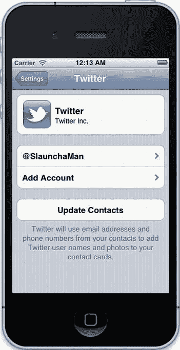

# 第 6 章：集成网络与 Web 服务

选择`Twitter.framework`。完成后，该部分应如图 6-4 所示。

**图 6-4.** *配置为链接到 Accounts 和 Twitter 框架的 TwitterExample 应用*

很好。在继续之前，你应该在 iPhone 模拟器中输入你的 Twitter 凭据进行测试。打开 iPhone 模拟器——如果你的 Dock 中没有，可以构建并运行这个空应用来启动它——然后打开“设置”应用。选择 Twitter 并输入你的用户名和密码。完成后，它应如图 6-5 所示。

[www.it-ebooks.info](http://www.it-ebooks.info/)

