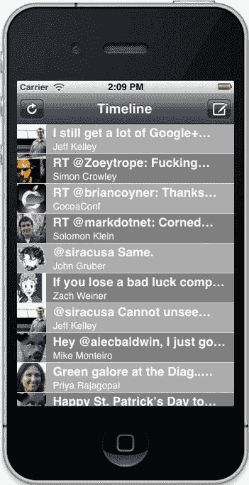

# 章节：用户界面设计

截至撰写本文时，iOS 平台上已有超过 55 万个应用可用。竞争之激烈可见一斑。你的应用将在 App Store 中与成千上万台设备的用户争夺关注度和收入。面对如此众多的产品，用户在比较应用时常常感到无所适从。

下面快速做个实验：在你的 iOS 设备或 iTunes 中打开 App Store，搜索一个应用。试试搜索"photography"或"weight loss"。你的潜在用户到底要如何在如此嘈杂的信息中找到你的应用？主要通过他们的眼睛。要打造成功的应用，最重要的事情之一就是拥有一个出色的图标。聘请一位设计师，为你的图标制作超高分辨率的图像。如果你的应用表现出色且 Apple 希望在某些位置展示它，你可能还需要提供分辨率更高的版本。如果 Apple 想要展示你的应用，你最好准备好这些图像；被 App Store 推荐比拥有出色的图标更是一种成功之道。

当用户看到你惊艳的图标，为其美丽而驻足片刻，并决定购买你的应用后，他们还得实际使用这个应用。即使你的图标只是几个简笔画人物，用户也会欣赏你在应用外观上所付出的用心。为此，本章将介绍如何通过引人注目的用户界面设计让你的应用脱颖而出。这不仅会让你的应用看起来更美观，而且会更易于使用。我们将从高级（但同样非常强大）的技巧开始讲起。


像`UIKit`这样的框架，然后我们会逐步深入到更底层的细节。在本章结束时，你将能够获取设计师给你的图片，并让你的应用看起来与设计师的作品一致。首先，我们来介绍一些`UIKit`中的基础知识。

`UIKit`是一个非常庞大的框架。它涵盖了制作 iPhone 应用所需的大部分用户界面元素，从按钮到滑块，从标签到图像视图。令人欣慰的是，无论是对按钮使用自定义图像、为标签设置颜色，还是在应用启动时添加生动的动画，`UIKit`提供的大部分内容都可以根据你的需求进行定制。让你的应用脱颖而出的最简单方法之一，就是为 UI 元素使用自定义颜色；为此，你需要使用`UIColor`类。

## 用`UIColor`为界面元素着色

在使用 Interface Builder 时，你可能已经尝试过颜色设置。如果是这样，那太好了。如果没有，也别担心，因为我们即将深入探讨。`UIColor`类的实例代表一种特定的颜色。它们遍布在`UIKit`中，但最简单的演示其工作原理的方式是，选取一个用户界面元素并为其添加颜色。为此，让我们使用我们熟悉的 Twitter 示例项目，并增添一些亮点。在 Xcode 中打开`TwitterExample`项目，并导航到应用代理的实现文件（`LCTAppDelegate.m`）。在`application:didFinishLaunchingWithOptions:`方法中添加以下粗体显示的行：

```
- (BOOL)application:(UIApplication *)application
didFinishLaunchingWithOptions:(NSDictionary *)launchOptions
{
self.window = [[UIWindow alloc] initWithFrame:[[UIScreen mainScreen]
bounds]];
// 覆盖点，用于应用启动后的自定义设置。
self.window.backgroundColor = [UIColor whiteColor];
[self.window makeKeyAndVisible];
LCTTimelineViewController *viewController =
[[LCTTimelineViewController alloc] initWithStyle:UITableViewStylePlain];
UINavigationController *navigationController =
[[UINavigationController alloc] initWithRootViewController:viewController];
UIColor *navigationBarColor = [UIColor redColor];
[[navigationController navigationBar] setTintColor:navigationBarColor];
[[self window] setRootViewController:navigationController];
return YES;
}
```

**注意：** 如果你的设备或 iOS 模拟器中的 Twitter 账户已被移除，你需要在使用 TwitterExample 应用之前重新输入。

构建并运行应用，差异应该相当明显。如图 9-1 所示，导航栏看起来已经大不相同。

**图 9-1.** *左侧为默认着色颜色的导航控制器，右侧为红色着色颜色的导航控制器*

`tintColor`属性不仅影响导航栏的颜色，还会改变显示在导航栏上的`UIBarButtonItem`对象的颜色。许多`UIKit`类都支持的着色颜色，会影响对象的颜色，但不会改变其形状或行为方式。

你可能也注意到了，我们直接使用了`UIColor`类的类方法`redColor`来获取一种颜色。这为你提供了便利，让你能快速创建常用颜色。你可以使用类方法来创建黑色、深灰色、浅灰色、灰色、白色、红色、绿色、蓝色、青色、黄色、品红色、橙色、紫色和棕色的颜色对象。你还可以使用`clearColor`便利方法创建透明颜色，这对于使视图背景透明非常有用。你可以将 Twitter 代码中的`redColor`方法替换为上述任意颜色，构建并运行应用，查看效果。请注意，对于由两个单词组成的颜色名称，这些方法采用驼峰式命名，因此对于深灰色，你需要使用`darkGrayColor`方法。


下一个显而易见的问题是：“我可以使用自己的颜色吗？”答案是肯定的，你可以使用自己的颜色。只需使用`UIColor`类方法`colorWithRed:green:blue:alpha:`即可创建颜色。你可以通过以下代码行创建一种深蓝板岩色：

```
UIColor *darkBlueSlateColor = [UIColor colorWithRed:0.129f
                                             green:0.278f
                                              blue:0.380f
                                             alpha:1.0f];
```

**注意：** 与所有显示器一样，iOS 设备显示屏上的颜色可能与其他显示屏上的同一颜色不完全匹配。请务必在真实设备上测试你的应用，以查看你所使用的颜色实际效果。

该方法的每个参数都接受 0 到 1 范围内的浮点数。对于红色、绿色和蓝色值，设计师通常习惯使用整数或十六进制值来表示颜色。为了便于后续修改，你可以通过除法运算获得 0 到 1 之间的值。前面示例中的颜色也可以通过以下两种方式编写：

```
UIColor *darkBlueSlateColor = [UIColor colorWithRed:(74.0f/255.0f)
                                             green:(82.0f/255.0f)
                                              blue:(90.0f/255.0f)
                                             alpha:1.0f];

UIColor *darkBlueSlateColor = [UIColor colorWithRed:((float)0x4A / (float)0xFF)
                                             green:((float)0x52 / (float)0xFF)
                                              blue:((float)0x5A / (float)0xFF)
                                             alpha:1.0f];
```

在第一个示例中，我们使用数值除以 255 来获得 0 到 1 之间的值；在第二个示例中，我们使用十六进制值除以`FF`来获得该值。当你的设计师给你一个特定的颜色时，你可以使用相应的方法来生成颜色。

该方法的第四个参数是颜色的 alpha 分量，它表示颜色的不透明度。在设置导航栏的色调颜色时，这个参数不会产生任何效果，但在其他使用`UIColor`对象为颜色添加透明度的场景中可以使用它。

如果你的设计师提供了色调、饱和度和亮度的值，你也可以使用这些值来创建颜色。前面示例中的颜色也可以这样创建：

```
UIColor *darkBlueSlateColor = [UIColor colorWithHue:(210.0f/359.0f)
                                       saturation:(18.0f/100.0f)
                                       brightness:(35.0f/100.0f)
                                            alpha:1.0f];
```

颜色不仅用于为 UI 元素着色，还可以用来改变`UILabel`的文本颜色或任何`UIView`的背景颜色。例如，如果你希望表格视图单元格在灰色和稍深一点的灰色之间交替显示，可以使用`UIColor`来实现。在 Xcode 中打开 TwitterExample 项目，并导航到`LCTTimelineViewController.m`文件。在`tableView:cellForRowAtIndexPath:`方法之后添加一个新的方法实现，如下所示：

```
- (void)tableView:(UITableView *)tableView
  willDisplayCell:(UITableViewCell *)cell
forRowAtIndexPath:(NSIndexPath *)indexPath
{
    NSUInteger row = [indexPath row];
    if (row % 2) {
        [cell setBackgroundColor:[UIColor grayColor]];
    }
    else {
        [cell setBackgroundColor:[UIColor lightGrayColor]];
    }
}
```

`tableView:willDisplayCell:forRowAtIndexPath:`表格视图委托方法会在单元格即将显示在屏幕上时被调用。它常用于设置表格视图单元格的背景颜色。构建并运行应用后，你会注意到在灰色单元格中，用户名文本变得不可见，因为它在灰色背景上绘制了灰色文本。为了解决这个问题，我们将文本颜色改为白色。修改`tableView:cellForRowAtIndexPath:`方法，添加以下代码：

```
- (UITableViewCell *)tableView:(UITableView *)tableView
         cellForRowAtIndexPath:(NSIndexPath *)indexPath
{
    static NSString *CellIdentifier = @"Cell";
    UITableViewCell *cell = [tableView
                             dequeueReusableCellWithIdentifier:CellIdentifier];

    if (cell == nil) {
        cell = [[UITableViewCell alloc]
                initWithStyle:UITableViewCellStyleSubtitle
                reuseIdentifier:CellIdentifier];
    }

    // 配置单元格...
    NSDictionary *tweet = [_tweets objectAtIndex:[indexPath row]];
    [[cell textLabel] setText:[tweet objectForKey:@"text"]];
```


```objectivec
[[cell detailTextLabel] setText:[[tweet objectForKey:@"user"] objectForKey:@"name"]];

NSString *profileImageURI = [[tweet objectForKey:@"user"] objectForKey:@"profile_image_url"];

NSURL *profileImageURL = [NSURL URLWithString:profileImageURI];

NSURLRequest *profileImageURLRequest = [NSURLRequest requestWithURL:profileImageURL];

dispatch_async(_profileImageQueue, ^{
    NSURLResponse *response = nil;
    NSError *error = nil;
    dispatch_semaphore_wait(_profileImageSemaphore, DISPATCH_TIME_FOREVER);
    NSData *imageData = [NSURLConnection sendSynchronousRequest:profileImageURLRequest returningResponse:&response error:&error];
    dispatch_semaphore_signal(_profileImageSemaphore);
    UIImage *image = [UIImage imageWithData:imageData];
    dispatch_async(dispatch_get_main_queue(), ^{
        [[cell imageView] setImage:image];
        [cell setNeedsLayout];
    });
});

[[cell textLabel] setTextColor:[UIColor whiteColor]];
[[cell detailTextLabel] setTextColor:[UIColor whiteColor]];
return cell;
```

再次构建并运行应用。现在文本应该可见了，您的应用看起来应该像图 9-2 所示。

[www.it-ebooks.info](http://www.it-ebooks.info/)



