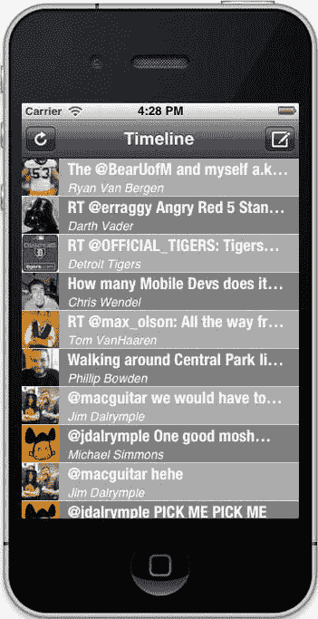
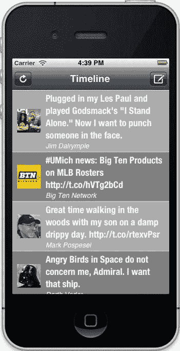
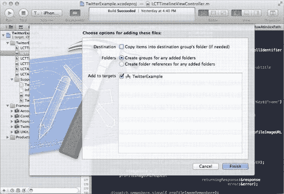

# 第九章：用户界面设计

**图 9-2.** *我们的 Twitter 客户端，带有一点颜色*

如您所见，只需添加一点点颜色——即使是灰色调——就能带来显著的不同。既然这么简单，就没有理由发布一个使用朴素默认界面的应用。不过，这个 Twitter 界面仍然需要一些改进。大多数推文都超过了一行，但它们被截断了。让我们看看能对此做些什么。

## 字体与文本大小

标签中用于显示文本的字体由 `UIFont` 类表示。我们还可以用它来确定绘制字符串需要多少空间。要设置标签的字体，您可以像这样创建一个字体：

[www.it-ebooks.info](http://www.it-ebooks.info/)

```objectivec
UIFont *myFont = [UIFont boldSystemFontOfSize:17.0f];
```

如果您想使用具有特定名称的字体，或更具体的字体变体（例如粗体和斜体），您可以使用字体的名称来创建一个 `UIFont` 对象来表示它：

```objectivec
UIFont *myFont = [UIFont fontWithName:@"Helvetica Neue" size:17.0f];
```

`UIFont` 类方法 `familyNames` 返回系统上存在的字体族名称数组。要获取特定族中字体的名称，请使用 `UIFont` 类方法 `fontNamesForFamilyName:`，它接受一个字符串（族名称）作为参数，并返回指定族中的字体名称数组。在 `fontWithName:size:` 方法中使用这些字体名称。

**注意**：要获取 iOS 内置字体的最新列表，请访问 [www.iosfonts.com.](http://www.iosfonts.com)

要使用该字体绘制标签的文本，请将其设置为标签的字体：

```objectivec
[myLabel setFont:myFont];
```

对于 TwitterExample，让我们使用自定义字体添加一些风格。在 Xcode 中打开您的 TwitterExample 项目，如果您还没有打开，请导航到 `LCTTimelineViewController.m` 文件。让我们添加两个 `UIFont` 实例变量来存储我们想要使用的字体。我们将实例变量添加到文件顶部的类扩展中。请添加以下加粗的行：

```objectivec
@interface LCTTimelineViewController () {
    NSTimer *_reloadTimer;
    NSArray *_tweets;
    dispatch_queue_t _profileImageQueue;
    dispatch_semaphore_t _profileImageSemaphore;
    UIFont *_tweetFont;
    UIFont *_usernameFont;
}
- (void)reloadButtonPressed:(id)sender;
- (void)reloadTweets:(NSTimer *)reloadTimer;
- (void)tweetButtonPressed:(id)sender;
@end
```

接下来，通过添加以下加粗的行来修改 `initWithStyle:` 方法，以初始化这些字体：

[www.it-ebooks.info](http://www.it-ebooks.info/)

```objectivec
- (id)initWithStyle:(UITableViewStyle)style
{
    self = [super initWithStyle:style];
    if (self) {
        [self setTitle:@"Timeline"];
        UIBarButtonItem *reloadButton =
        [[UIBarButtonItem alloc]
         initWithBarButtonSystemItem:UIBarButtonSystemItemRefresh
         target:self
         action:@selector(reloadButtonPressed:)];
        [[self navigationItem] setLeftBarButtonItem:reloadButton];
    }
    return self;
}
```


`UIBarButtonItem *tweetButton =`  
`[[UIBarButtonItem alloc]`  
`initWithBarButtonSystemItem:UIBarButtonSystemItemCompose`  
`target:self`  
`action:@selector(tweetButtonPressed:)];`  
`[[self navigationItem] setRightBarButtonItem:tweetButton];`

`_profileImageQueue =`  
`dispatch_queue_create("com.learncocoatouch.profileImageQueue", DISPATCH_QUEUE_CONCURRENT);`

`_profileImageSemaphore = dispatch_semaphore_create(3);`

`_tweetFont = [UIFont fontWithName:@"HelveticaNeue-CondensedBold"`  
`size:19.0f];`

`_usernameFont = [UIFont italicSystemFontOfSize:14.0f];`  
`}`  
`return self;`  
`}`

最后，我们来修改`tableView:cellForRowAtIndexPath:`方法，以使用这些字体。添加加粗部分的代码行（请注意，我使用省略号`[…]`跳过了部分代码行，而非完整复制该方法）：

```
- (UITableViewCell *)tableView:(UITableView *)tableView 
cellForRowAtIndexPath:(NSIndexPath *)indexPath 
{ 
    static NSString *CellIdentifier = @"Cell"; 
    UITableViewCell *cell = [tableView 
        dequeueReusableCellWithIdentifier:CellIdentifier]; 
    if (cell == nil) { 
        cell = [[UITableViewCell alloc] 
            initWithStyle:UITableViewCellStyleSubtitle 
            reuseIdentifier:CellIdentifier]; 

        [www.it-ebooks.info](http://www.it-ebooks.info/) 

         

        第 9 章：用户界面设计 
    } 

    ... 

    [[cell textLabel] setTextColor:[UIColor whiteColor]]; 
    [[cell textLabel] setFont:_tweetFont]; 
    [[cell detailTextLabel] setTextColor:[UIColor whiteColor]]; 
    [[cell detailTextLabel] setFont:_usernameFont]; 

    return cell; 
}
```

构建并运行应用程序。你应该会看到新字体已生效，如图 9-3 所示。

**图 9-3.** *使用自定义字体的时间线视图*

[www.it-ebooks.info](http://www.it-ebooks.info/)

**第 9 章：用户界面设计**

现在，正如我之前提到的，我们可以利用字体来帮助确定标签需要多大尺寸，才能完整绘制整个字符串而不被截断。我们可以利用这一知识，根据推文长度将表格视图单元格绘制到正确的高度。首先，让我们修改单元格，使其文本标签支持多行显示。在`tableView:cellForRowAtIndexPath:`方法中添加加粗部分的代码行（再次说明，我使用省略号省略了部分代码行）：

```
- (UITableViewCell *)tableView:(UITableView *)tableView 
cellForRowAtIndexPath:(NSIndexPath *)indexPath 
{ 
    static NSString *CellIdentifier = @"Cell"; 
    UITableViewCell *cell = [tableView 
        dequeueReusableCellWithIdentifier:CellIdentifier]; 
    if (cell == nil) { 
        cell = [[UITableViewCell alloc] 
            initWithStyle:UITableViewCellStyleSubtitle 
            reuseIdentifier:CellIdentifier]; 
    } 

    ... 

    [[cell textLabel] setLineBreakMode:UILineBreakModeWordWrap]; 
    [[cell textLabel] setNumberOfLines:0]; 
    [[cell textLabel] setTextColor:[UIColor whiteColor]]; 
    [[cell textLabel] setFont:[self tweetFont]]; 
    [[cell detailTextLabel] setTextColor:[UIColor whiteColor]]; 
    [[cell detailTextLabel] setFont:[self usernameFont]]; 

    return cell; 
}
```

我们添加的第一行代码设置了换行模式，该模式控制标签在文本过宽无法容纳于一行时的行为。接下来的一行将行数设置为`0`。该值默认是`1`。将行数设置为大于 1 的值，标签会按指定行数绘制；但设为`0`时，标签会按所需行数绘制，直到填满可用空间。完成此修改后，我们就可以开始更改行高了。紧接在`tableView:cellForRowAtIndexPath:`方法之后，添加一个新方法，其实现如下（加粗部分）：

```
- (CGFloat)tableView:(UITableView *)tableView 
heightForRowAtIndexPath:(NSIndexPath *)indexPath 
{ 
    CGFloat maxWidth = 240.0f; 
    NSDictionary *tweet = [_tweets objectAtIndex:[indexPath row]]; 
    NSString *tweetText = [tweet objectForKey:@"text"]; 

    [www.it-ebooks.info](http://www.it-ebooks.info/) 

    第 9 章：用户界面设计 

    NSString *tweetUsername = [[tweet objectForKey:@"user"] 
        objectForKey:@"name"]; 

    // 获取多行推文的高度 
    CGSize tweetSizeConstraints = CGSizeMake(maxWidth, FLT_MAX); 
    CGSize tweetSize = [tweetText sizeWithFont:[self tweetFont] 
        constrainedToSize:tweetSizeConstraints 
        lineBreakMode:UILineBreakModeWordWrap]; 
    CGFloat tweetHeight = tweetSize.height; 

    // 获取单行用户名的高度
}
```


```objc
CGSize usernameSize = [tweetUsername sizeWithFont:[self usernameFont]];
CGFloat usernameHeight = usernameSize.height;

return tweetHeight + usernameHeight + 8.0f;
```

这里的关键方法都是`NSString`的实例方法，分别是`sizeWithFont:`和`sizeWithFont:constrainedToSize:lineBreakMode:`。其中第一个方法`sizeWithFont:`会返回字符串在给定字体下单行绘制时的大小。第二个方法接受一个`CGSize`作为约束（用于定义标签的最大尺寸）和一个`UILineBreakMode`常量（决定文本多行绘制的方式）。`CGSize`是一个简单的 C 结构体，包含两个`CGFloat`值，分别用于宽度和高度。我们通过`FLT_MAX`创建了一个高度近乎无限的`CGSize`，然后将其用于约束推文文本在推文高度下的绘制。`sizeWithFont:constrainedToSize:lineBreakMode:`方法会返回另一个`CGSize`，表示在给定字体、尺寸约束和换行模式下绘制文本所需的大小。

通过将这两个高度相加，并加上 8 像素的边距，我们就可以根据内容为单元格绘制合适的高度。240 像素的最大宽度为标签两侧的边距以及图片留出了空间。为了确定这个值，我增加了表视图的高度，然后在 iPhone 模拟器中截屏，并使用图像编辑程序测量了其尺寸。虽然这不是确定最大宽度的最科学方法，但确实有效。

编译并运行应用。现在，你的表视图单元格会根据其包含的推文内容调整大小，如图 9-4 所示。

[www.it-ebooks.info](http://www.it-ebooks.info/)



第九章：用户界面设计

**图 9-4.** *我们的 TwitterExample 应用在绘制表视图单元格时，根据内容使用了正确的高度*

借助自定义颜色和字体，iOS 用户界面已经具有极高的可定制性。接下来，我们将介绍如何在应用中使用图像。

## 使用图像

我们已经在 TwitterExample 和 MyStuff 示例项目中使用了`UIImage`类来显示图像。`UIImage`类用于表示基本图像，这些图像可以从远程来源（如 Twitter）、相机或相册（如 MyStuff 中的用法）或磁盘加载。

[www.it-ebooks.info](http://www.it-ebooks.info/)



第九章：用户界面设计

要在应用中使用图像，首先需要将其添加到应用中。从 Finder 中将其拖入 Xcode 的文件列表中。你会看到一个对话框，如图 9-5 所示。

或者，你也可以选择“文件”→“将文件添加到‘MyProject’…”（其中 MyProject 是你的项目名称），或按+Option+A。弹出的对话框与拖入文件时类似，但顶部多了一个文件选择组件，用于选择要添加到项目的文件。对于任一对话框，应用名称旁边的复选框表示你希望将其添加到该应用中。勾选该复选框后，当你编译并运行应用时，图像就会被包含在内。顶部的复选框如果勾选，会将文件复制到应用目录中。通常，建议将文件复制到应用的相同目录下，以防原始文件移动或项目在磁盘上的位置发生变化。随着应用包含的图像越来越多，可以考虑在“Supporting Files”下创建一个分组来存放它们，以帮助组织应用内容。无论是图像、视频还是代码，添加任何其他文件到应用的过程都是如此。当你将其他文件添加到目标时，对于大多数文件类型，Xcode 会在构建时将其复制到应用包中，但代码会被编译到应用本身中。

**图 9-5.** *Xcode 中的添加文件对话框*

[www.it-ebooks.info](http://www.it-ebooks.info/)

第九章：用户界面设计

一旦通过将图像文件添加到 Xcode 的目标中将其包含在应用包中，你就可以使用`imageNamed:`类方法创建`UIImage`对象，如下所示：

```objc
UIImage *myImage = [UIImage imageNamed:@"myImage"];
```

你无需指定文件扩展名；对于`UIImage`支持的任何图像格式，它都会在应用包中找到该文件并正确创建图像。有关支持的图像格式的完整列表，请参阅`UIImage`类文档。要使用`UIImage`对象，可以创建一个`UIImageView`对象，它只是一个将图像绘制到屏幕上的视图。你可以这样创建`UIImageView`：

```objc
UIImageView *myImageView = [[UIImageView alloc] initWithImage:myImage];
```

你也可以在 Interface Builder 中通过从对象库拖拽到视图上来创建图像视图。

从配备 Retina 显示屏的 iPhone 4 和第三代 iPad 开始，屏幕拥有更多像素——每个方向上的像素数量是原来的两倍。

因此，当你在应用中提供图像时，应该提供两个版本：一个正常尺寸，另一个分辨率加倍。如果应用中的图像宽 37 像素、高 37 像素，则双分辨率版本应为宽 74 像素、高 74 像素。使用`UIImage`类并通过`imageNamed:`类方法创建图像，会自动为设备加载正确的图像，前提是你使用正确的命名约定：双分辨率版本的文件名应在扩展名之前附加`@2x`。例如，如果图像文件名为`blueButton.png`，则 Retina 显示屏版本应命名为`blueButton@2x.png`，且每个维度的尺寸加倍。如果你不提供更高分辨率的图像版本，系统会自动放大正常分辨率版本，但效果不佳，会损害用户体验。在介绍视图布局时，我们会进一步讨论 Retina 显示屏，但这些内容对于图像处理已经足够。

能够创建`UIImage`对象和`UIImageView`对象很重要，但将它们显示到屏幕上才能让这些知识发挥作用。由于`UIImageView`是`UIView`的子类，它可以参与应用的视图层次结构，从而显示在屏幕上。接下来，我们将讨论如何使用`UIView`类管理视图层次结构，以呈现应用的用户界面。

## 视图布局

到目前为止，你对视图的使用还相当有限。你创建的每个视图控制器都有一个视图，无论这个视图是通过 Xcode 的 Interface Builder 创建的，还是由`UITableViewController`隐式创建的。你使用的表视图本身也有子元素，但到目前为止我们还没有直接对其进行太多操作。在此之前，我们先介绍 Cocoa Touch 中视图系统的一些基本方面。

### 视图层次结构

iOS 中的视图维护着严格的层次结构。除了顶层视图外，每个视图都有一个父视图，而任何视图都可以有一个或多个子视图。这种父子关系决定了元素的显示方式。iOS 中的顶层视图是`UIWindow`类的实例，代表应用窗口。与 Mac OS X 或 Windows 等桌面操作系统不同，你的应用在特定时间只能在屏幕上显示一个窗口——尽管可以将 iOS 设备连接到其他显示器，并在该显示器的屏幕上添加一个窗口。例如，Apple TV 允许你使用 AirPlay 将电视作为应用的第二个显示器添加。要向视图添加子视图，请使用`addSubview:`方法。要将名为`myView`的视图添加到名为`myWindow`的`UIWindow`中，你需要编写以下代码：

```objc
[myWindow addSubview:myView];
```


