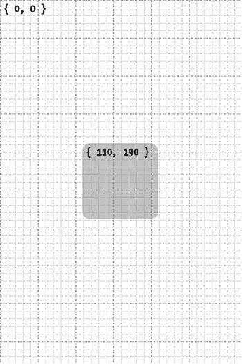

# 用户界面设计

视图的子视图按顺序排列，这让你可以控制当两个视图共享同一位置时，哪个视图将显示在顶层。你可以通过`UIView`的方法来操作此顺序，包括`bringSubviewToFront:`、`sendSubviewToBack:`、`insertSubview:atIndex:`、`insertSubview:aboveSubview:`以及`insertSubview:belowSubview:`。要交换两个子视图的顺序，你可以使用`exchangeSubviewAtIndex:withSubviewAtIndex:`方法。若要将某个视图从其父视图中移除，请调用其`removeFromSuperview`方法。

### 视图坐标系

每个视图都有自己的坐标系。坐标系的原点是视图的左上角（如果你之前曾在 Mac OS X 上编程，请注意这有所不同，因为 Mac OS X 的坐标系原点在左下角）。`CGRect`结构体用于表示视图内部的坐标系，通过`bounds`属性来体现。`CGRect`有两个成员：`origin`，它是一个`CGPoint`结构体；以及`size`，它是一个`CGSize`结构体。`CGPoint`结构体又包含两个成员：`x`和`y`，两者都是`CGFloat`值，表示坐标系中的坐标。`CGSize`结构体包含两个成员：`width`和`height`，也是`CGFloat`值。最后，`CGFloat`值就是定义为某种类型的常规浮点值。

[www.it-ebooks.info](http://www.it-ebooks.info/)

