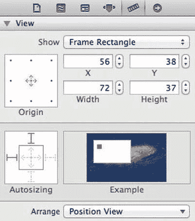

# 第 9 章：用户界面设计

### 视图自动调整大小

其他`UIView`属性则不那么直观。其中最重要的一个是`autoresizingMask`。此属性是一个位掩码（bitmask），用于控制当视图的父视图调整大小时，该视图的行为。有六个位可以设置：

- `UIViewAutoresizingFlexibleLeftMargin`
- `UIViewAutoresizingFlexibleWidth`
- `UIViewAutoresizingFlexibleRightMargin`
- `UIViewAutoresizingFlexibleTopMargin`
- `UIViewAutoresizingFlexibleHeight`
- `UIViewAutoresizingFlexibleBottomMargin`

如果设置了`UIViewAutoresizingFlexibleWidth`，视图会随着其父视图变宽而自动变宽；类似地，如果设置了`UIViewAutoresizingFlexibleHeight`，视图会随着其父视图变高而自动变高。另外四个位，当它们未被设置时，会将视图“锚定”在其父视图的对应边上；对于给定的某一边，如果对应的边距值未被设置，那么无论父视图如何变化，该视图到那一边的距离都将保持不变。最常见的自动调整大小掩码之一就是仅仅设置灵活的宽度和灵活的高度，这样无论父视图的尺寸如何变化，视图都保持与其父视图各边的距离不变，并根据需要增长以适应变化。如果你不希望视图进行任何调整大小，请使用`UIViewAutoresizingNone`，这表示所有这些位均未被设置。

如果你正在使用 Interface Builder 来布局你的视图，你可以通过可视化方式设置自动调整大小掩码。这被称为“弹簧和支柱”（springs and struts），你可以通过点击视图的虚拟映射图来设置这些值。选中该视图后，按`+Option+5`或选择`视图` → `工具` → `显示大小检查器`来显示大小检查器。图 9-7 展示了大小检查器。底部部分包含了自动调整大小掩码，位于“自动调整大小”标签上方。在框内，有两根弹簧分别代表`UIViewAutoresizingFlexibleWidth`和`UIViewAutoresizingFlexibleHeight`，表现为水平线和垂直线。

它们各自对应。点击即可切换相应的位。外侧的线是支柱（Struts），代表其他位的值，点击它们可以切换对应位。弹簧和支柱在对应位被设置时为实心红线，否则为淡色虚线红线。右侧位于“Example”标签上方有一个实时预览，当鼠标指针悬停在“Autoresizing”区域或预览本身时，该预览将演示您所选设置对持续变大缩小的视图产生的效果。

[www.it-ebooks.info](http://www.it-ebooks.info/)

