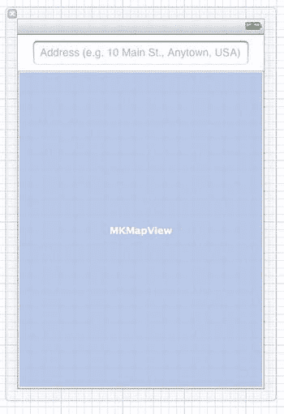

# 第 10 章：硬件 API

打开 `LCTTweetMapViewController.h`。我们将添加一个文本字段和地图视图，因此需要将它们的委托协议添加到我们的类中。对于地图视图，还需要导入 MapKit 头文件。在头文件中添加粗体显示的行：

```
#import <UIKit/UIKit.h>
#import <MapKit/MapKit.h>

@interface LCTTweetMapViewController : UIViewController <MKMapViewDelegate, UITextFieldDelegate>

@property (strong, nonatomic) IBOutlet UITextField *searchTextField;
@property (strong, nonatomic) IBOutlet MKMapView *mapView;

@end
```

保存工作成果并打开 `LCTTweetMapViewController.xib`。从**对象库**中，将一个文本字段和一个地图视图拖到用户界面上，调整它们的大小以占用视图空间，如**图 10-2** 所示。选择文本字段，然后选择**视图** ➤ **实用工具** ➤ **显示属性检查器**或按 **Option+Command+4** 组合键打开**属性检查器**。在属性检查器的**文本字段**下，输入占位文本，该文本将在用户输入搜索词之前显示。我使用了 `地址（例如：美国安尼镇主街 10 号）` 作为占位文本；其目的是告诉用户应在字段中输入什么内容。在属性检查器的下方，选择**返回键**旁边的**搜索**，这将把键盘上回车键的文本更改为**搜索**。



**图 10-2.** *Xcode 中的文本字段和地图视图，已调整大小以适应可用空间。*

接下来，在 Xcode 的编辑视图中，点击视图所在网格视图左下角带有三角形的圆圈，根据需要展开左侧部分。

左侧展开后，按住 **Control** 键并从 **File's Owner** 拖拽到文本字段。在出现的**输出口**弹出窗口中，选择 `searchTextField`。对地图视图执行相同操作，选择 `mapView` 输出口。接着，分别从搜索文本字段和地图视图按住 **Control** 键拖拽到 **File's Owner**，为每个选择**委托**输出口。现在用户界面已经设置完成，让我们添加一些搜索代码。

打开实现文件（`LCTTweetMapViewController.m`）。首先，导入 Twitter 控制器和推文头文件，并通过在文件顶部添加粗体显示的行，为已添加的属性合成访问器方法：

```
#import "LCTTweetMapViewController.h"
#import "LCTTwitterController.h"
#import "LCTTweet.h"

@interface LCTTweetMapViewController ()

@end

@implementation LCTTweetMapViewController

@synthesize searchTextField = _searchTextField;
@synthesize mapView = _mapView;
```

接下来，在 `viewDidUnload` 方法中将这些属性设置为 `nil`：

```
- (void)viewDidUnload
{
    [super viewDidUnload];
    // 释放主视图的任何保留子视图。
    // 例如 self.myOutlet = nil;
    [self setSearchTextField:nil];
    [self setMapView:nil];
}
```

是时候添加一些搜索代码了。当用户在搜索字段中输入文本并按下键盘上的**搜索**按钮时，我们将启动搜索。在 `@end` 编译器指令之前，将以下粗体显示的代码添加到 `LCTTweetMapViewController` 中：


好的，作为高级文档工程师和翻译员，我将严格遵循您提供的注意事项和示例，为您完成以下翻译任务。

---


```objc
- (BOOL)textFieldShouldReturn:(UITextField *)textField
{
    [textField resignFirstResponder];
    NSString *searchText = [textField text];
    if ([searchText length] == 0) {
        return NO;
    }
    LCTTwitterController *twitterController = [LCTTwitterController sharedInstance];
    void (^completionHandler)(NSArray *) = ^(NSArray *tweets) {
        NSArray *currentAnnotations = [[self mapView] annotations];
        [[self mapView] removeAnnotations:currentAnnotations];
        [[self mapView] addAnnotations:tweets];
        LCTTweet *tweet = [tweets objectAtIndex:0];
        CLLocationCoordinate2D coordinate = [[tweet location] coordinate];
        [[self mapView] setRegion:MKCoordinateRegionMake(coordinate,
            MKCoordinateSpanMake(0.1, 0.1))
                        animated:YES];
    };
    [twitterController getTweetsNearStreetAddress:searchText
                                    searchRadius:1000
                              completionHandler:completionHandler];
    return YES;
}
```

当用户在键盘上按下搜索键时，这段代码会触发我们的搜索。要看到它的实际效果，我们只需要将这个视图控制器显示在屏幕上。打开 `LCTAppDelegate.m`，并通过 `application:didFinishLaunchingWithOptions:` 方法修改文件的开头部分：删除划掉的代码行，并添加加粗的代码行：

```objc
#import "LCTAppDelegate.h"
#import "LCTTimelineViewController.h"
#import "LCTTweetMapViewController.h"

@implementation LCTAppDelegate
@synthesize window = _window;

- (BOOL)application:(UIApplication *)application
didFinishLaunchingWithOptions:(NSDictionary *)launchOptions
{
    self.window = [[UIWindow alloc] initWithFrame:[[UIScreen mainScreen] bounds]];
    // Override point for customization after application launch.
    self.window.backgroundColor = [UIColor whiteColor];
    [self.window makeKeyAndVisible];
    LCTTimelineViewController *viewController =
        [[LCTTimelineViewController alloc] initWithStyle:UITableViewStylePlain];
    UINavigationController *navigationController =
        [[UINavigationController alloc] initWithRootViewController:viewController];
    UIColor *darkBlueSlateColor = [UIColor colorWithRed:(74/255.0f)
                                                  green:(82/255.0f)
                                                   blue:(90/255.0f)
                                                  alpha:1.0f];
    [[navigationController navigationBar] setTintColor:darkBlueSlateColor];
    [[self window] setRootViewController:navigationController];
    LCTTweetMapViewController *viewController =
        [[LCTTweetMapViewController alloc] initWithNibName:nil bundle:nil];
    [[self window] setRootViewController:viewController];
    return YES;
}
```

构建并运行应用。在搜索框中输入地址，按下 `Search`，你应该能看到结果，如图 10-3 所示。如果点击这些图钉，会弹出一个显示推文文本和用户名的气泡。请注意，执行搜索时可能会有短暂的延迟。

**图 10-3.** *我们的推文地图，以图钉的形式在地图上显示推文*

`MapKit` 能做的事情远不止我们在这里介绍的——完全可以用一整本书来讲述 `Core Location` 和 `MapKit`——但这已经是一个很好的开始了。作为给读者的练习，可以考虑进一步修改 `TwitterExample`，将地图集成到应用的其余流程中。

## 自带设备

如果本章描述的所有传感器都无法满足您的需求，或者您需要比设备内置传感器更强大的功能，那么可以考虑创建自己的硬件设备并在应用中使用。苹果有一个名为 `MFi` 的计划，允许您许可硬件技术并通过基座连接器与 iOS 设备通信。我很想详细告诉您，但即便是获取相关文档，您也需要先申请加入该计划。如果您需要为 iOS 设备创建硬件配件，请了解一下这个计划，但预计苹果官方文档之外的资源会比较稀少。

蓝牙 4.0 为硬件设备带来了一线希望。这种新的蓝牙标准允许设备与您的应用以更小的阻碍进行通信。实现蓝牙硬件超出了本书的范围，但如果您发现需要与您的应用通信的硬件，蓝牙 4.0 可能是阻碍最小的途径。

### 在应用中指定所需设备

对于某些应用，缺少某个特定传感器会使应用变得毫无用处。例如，设备上的指南针应用需要磁力计，否则指南针就毫无用处。视频录制应用需要能够拍摄视频的摄像头，而面对面的视频聊天应用则需要前置摄像头。要指定您的应用所需的设备功能，您需要修改应用的 `Info.plist` 文件。默认情况下，该文件以您的目标命名，因此对于 `TwitterExample`，它是 `TwitterExample-Info.plist`。您需要为键 `Required device capabilities` 添加一个新行（如果它不存在的话）。

为此，在编辑器的空白区域右键单击，然后选择“添加行”（Add Row）。Xcode 在您的 Info plist 中使键名变得友好，但在文件中，这个键实际上叫做 `UIRequiredDeviceCapabilities`。该键的值可以是一个数组或一个字典；如果是数组，数组中的每个对象应该是一个描述所需设备功能的字符串。如果是字典，每个键应该是一个功能字符串，值则是一个 `BOOL`——`YES` 表示应用需要该功能，`NO` 表示设备必须不具备该功能。要更改值的类型，您首先需要告诉 Xcode 将 `Info.plist` 文件视为一个普通的属性列表：右键单击编辑器，选择“属性列表类型”（Property List Type），然后选择“无”（None）。完成后，右键单击 `UIRequiredDeviceCapabilities` 键，选择“值类型”（Value Type），然后选择“数组”（Array）或“字典”（Dictionary）。

以下是涵盖本章讨论的硬件的部分功能字符串列表：

- `still-camera`：存在摄像头
- `front-facing-camera`：存在前置摄像头
- `camera-flash`：存在摄像头闪光灯（不一定是设备上的所有摄像头都有）
- `video-camera`：存在可以录制视频的摄像头
- `accelerometer`：存在加速计
- `gyroscope`：存在陀螺仪
- `location-services`：位置服务可用
- `gps`：存在 GPS 传感器
- `magnetometer`：存在磁力计
- `bluetooth-le`：存在低功耗蓝牙芯片，用于蓝牙 4.0 设备

例如，如果您的应用需要摄像头才能工作，那么没有摄像头的设备用户将不会在 App Store 中看到您的应用列表。您可以在 iOS 文档中的苹果文档 *Information Property List Key Reference* 中找到可用键的完整列表。

## 总结

本章主要介绍了如何利用 iOS 设备的各种硬件组件。随着苹果产品线的不断增长，更新、更好的硬件组件被引入其设备中。尽管如此，当前的产品线已经相当强大了。阅读本章后，您应该能够从用户那里获取照片和视频，使用 Core Motion 确定设备的方向和加速度，使用 Core Location 确定用户的位置，并通过 MapKit 向他们显示所在的位置。这些硬件传感器使您能够在应用中构建一些非常酷的功能，如果您找不到所需的功能，您总是可以自己动手制作！

