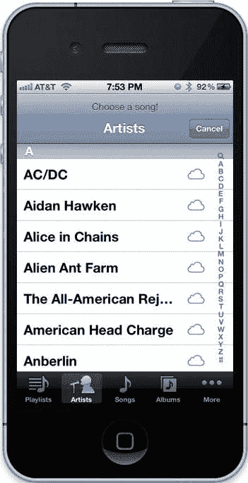

# 第 11 章：应用中的媒体：播放音频和视频


目前为止，本书已涵盖大量控制应用外观及用户交互方式的内容。从自定义用户界面设计到自定义用户交互，您所学的知识实际上一直局限于改变应用的外观。在本章中，我们将向应用引入媒体功能。通过应用播放音频和视频，您可以在另一个维度吸引用户，对他们的操作提供即时反馈，并丰富应用所能提供的内容。对于游戏而言，能够播放音效、环境噪音和音乐至关重要。由于每台 iOS 设备都能播放音乐，用户在启动任何应用时都可能正在播放音乐，因此播放媒体的应用需要考虑到这一点。

## 播放音频

就本节而言，我们将音频分为三类：独立播放的声音（例如提醒或通知音）、与音乐或其他声音一起播放的音效（例如游戏音效）以及音乐。您编写的代码将取决于您希望通过声音实现的目标。首先，我们来讨论独立播放作为提醒或通知的声音。对于这些情况，您将使用系统声音服务（System Sound Services）。

### 系统声音服务

系统声音服务是 iOS 上最基础的声音 API，它的简洁性带来了一些限制：一旦声音开始播放便无法停止，一次只能播放一个声音，无法控制音量（声音以系统当前音量级别播放），且声音长度限制为 30 秒。因此，对于游戏来说，系统声音显然不合适；但对于需要播放简短通知或提醒声音的应用来说，它非常适用。系统声音服务是一个 C 语言 API，因此您将使用一些比以往更底层的技术。它位于 `AudioToolbox` 框架中，因此您需要将此框架添加到目标构建阶段的“Link Binary With Libraries”中，并使用 `#import <AudioToolbox/AudioToolbox.h>` 导入 `AudioToolbox` 头文件。

#### 播放系统声音

要播放系统声音，首先需要创建一个声音 ID。该声音 ID 存储在 `SystemSoundID` 类型中。这并非 Objective-C 对象，而是一个由系统与您的声音关联的标识符。要创建 ID，请使用 `AudioServicesCreateSystemSoundID()` 函数，它接受两个参数：一个指向声音文件 URL 的 CoreFoundation URL 引用（`CFURLRef`），以及一个指向将填入正确 ID 的 `SystemSoundID` 变量的指针。由于 CoreFoundation 类 `CFURL` 与 `NSURL` 是“免费桥接”（toll-free-bridged）的，因此您可以将 `NSURL` 转换为 `CFURLRef`，反之亦然。这样您就可以在 Cocoa Touch 中管理该 URL 的内存，让 ARC 自动处理。转换时，请使用 `__bridge` 关键字，如下所示。

在主 bundle 中为文件 `mySound.wav` 创建系统声音的代码如下所示：

```
NSURL *soundURL = [[NSBundle mainBundle] URLForResource:@"mySound"
                                              withExtension:@"wav"];

SystemSoundID soundID;

OSStatus status = AudioServicesCreateSystemSoundID((__bridge CFURLRef)soundURL,
                                                    &soundID);
```

当 `AudioServicesCreateSystemSoundID` 函数返回时，`soundID` 变量将保存已初始化的声音 ID，而 `status` 变量将包含代表操作结果代码的函数返回值。如果成功，此代码将等于 `kAudioServicesNoError`；错误代码列在系统声音服务参考文档中。

创建声音后，您可以使用两个不同的函数来播放它。`AudioServicesPlaySystemSound()` 会在调用时立即播放声音，其唯一参数是声音 ID。在创建声音 ID 之后


使用之前的代码，你可以这样播放音效：

```
if (status == kAudioServicesNoError) {
    AudioServicesPlaySystemSound(soundID);
}
```

注意，我们首先检查了`status`的值，以确保`soundID`被成功创建。`AudioServicesPlaySystemSound()`函数是异步运行的，因此无论音频时长多久，它都会立即返回。若要在音频播放完成时执行代码，你可以使用`AudioServicesAddSystemSoundCompletion`函数为 C 函数添加回调。用于回调的函数必须匹配`AudioServices`头文件中的`AudioServicesSystemSoundCompletionProc`原型，如下所示：

```c
typedef void (*AudioServicesSystemSoundCompletionProc)(SystemSoundID ssID, void *clientData);
```

这里使用的函数指针语法与 block 声明语法类似，但使用指针（`*`）代替脱字符（`^`）。如果你想创建一个名为`MySystemSoundCallback()`的函数，需要在头文件中按如下方式声明：`void MySystemSoundCallback(SystemSoundID ssID, void *clientData);`

然后，你实现该函数：

```c
void MySystemSoundCallback(SystemSoundID ssID, void *clientData) {
    // 运行回调代码
}
```

**注意：** 你可以在 Objective-C 代码中毫无问题地使用 C 函数。只需将函数声明放在头文件的`@interface`块之外，将函数实现放在实现文件的`@implementation`块之外。在`@end`指令之后通常是放置 C 函数的好位置，无论是在头文件还是实现文件中。

如果你想将 C 函数保持为类私有，可以将其声明和实现都放在类的实现文件中，只要声明位于`@implementation`块之前即可。

创建完用作系统声音回调的 C 函数后，使用`AudioServicesAddSystemSoundCompletion()`函数添加回调。它接受五个参数：声音 ID（一个指向 CoreFoundation 运行循环的`CFRunLoopRef`引用）；`CFStringRef`（一个 Core Foundation 字符串，表示运行循环模式）；指向你函数的函数指针，类型为`AudioServicesSystemSoundCompletionProc`；以及一个`void *`指针，用于传递你希望传递给函数的任何额外数据（即之前回调函数实现中的`clientData`参数）。对于运行循环参数和客户端数据参数，你可以传递`NULL`，这将在默认模式下于默认运行循环上调用你的函数，且不传递额外数据。要使用我们的`MySystemSoundCallback`函数作为声音回调，代码如下：

```c
AudioServicesAddSystemSoundCompletion(soundID,
                                       NULL,
                                       NULL,
                                       &MySystemSoundCallback,
                                       NULL);
```

`AudioServicesAddSystemSoundCompletion()`函数返回一个`OSStatus`值作为结果码，因此如果你需要确定回调是否成功添加，可以使用返回值来判断。你应该在调用`AudioServicesPlaySystemSound()`之前调用`AudioServicesAddSystemSoundCompletion()`，以确保在音频播放完毕前回调函数已成功添加。

最后，当系统声音使用完毕后，应销毁它以回收占用的资源。这通过`AudioServicesDisposeSystemSoundID()`函数完成，该函数接受系统声音 ID 作为唯一参数并回收其资源。系统声音不像 CoreFoundation 或 Objective-C 对象那样进行引用计数，因此 ARC 无法帮助管理其内存；你必须自行调用此方法。如果你在调用`AudioServicesPlaySystemSound()`后立即调用`AudioServicesDisposeSystemSoundID()`，音频将永远不会播放。如果你需要创建系统声音、播放它，然后不再使用，可以在回调函数中销毁它。


我们现在已经有足够的代码来播放系统声音，这足以满足按钮点击音效之类的需求。以下是完整的代码：

```
NSURL *soundURL = [[NSBundle mainBundle] URLForResource:@"mySound"
                                          withExtension:@"wav"];
SystemSoundID soundID;
OSStatus status = AudioServicesCreateSystemSoundID((__bridge CFURLRef)soundURL,
                                                   &soundID);
if (status == kAudioServicesNoError) {
    AudioServicesAddSystemSoundCompletion(soundID,
                                          NULL,
                                          NULL,
                                          &MySystemSoundCallback,
                                          NULL);
    AudioServicesPlaySystemSound(soundID);
}
```

相应的回调函数应在头文件中或`@implementation`块之前声明，用于销毁声音 ID 以回收内存：

```
void MySystemSoundCallback(SystemSoundID ssID, void *clientData)
{
    NSLog(@"System sound finished!");
    AudioServicesDisposeSystemSoundID(ssID);
}
```

这种播放声音的方法简单且能满足许多需求。不过，我之前提到有两种播放系统声音的方式。我们刚刚看到了第一种。另一种是将系统声音作为警报音播放。

### 播放警报音

使用`AudioServicesPlayAlertSound()`函数可以将系统声音作为警报音播放。其过程与播放系统声音类似，但在不同设备上存在一些差异。在`iPhone`上，如果用户配置了在接听电话时同时播放声音和振动，那么警报音也会使手机振动，除非应用配置为录制音频——此时手机不会振动，以避免干扰音频。在最初的`iPod touch`上（未插入耳机时没有扬声器播放声音），播放警报音会播放一个通用的警报音。与系统声音一样，警报音的长度不能超过 30 秒，否则应用会崩溃并报错。

将我们的声音作为警报音播放非常简单：

```
NSURL *soundURL = [[NSBundle mainBundle] URLForResource:@"mySound"
                                          withExtension:@"wav"];
SystemSoundID soundID;
OSStatus status = AudioServicesCreateSystemSoundID((__bridge CFURLRef)soundURL,
                                                   &soundID);
if (status == kAudioServicesNoError) {
    AudioServicesPlayAlertSound(soundID);
}
```

你可以像处理系统声音一样添加回调。你也仍然需要在播放完毕后调用`AudioServicesDisposeSystemSoundID()`来销毁声音，通常放在`dealloc`方法中。你应该使用警报音来提示应用需要用户注意的情况，例如发生错误时。

在带有振动马达的设备上，警报音也可以用来触发振动，我们将在下一节讨论。

### 触发振动

如果你希望触发振动，可以使用`AudioServicesPlayAlertSound()`函数并传入一个表示振动的常量声音 ID：

```
AudioServicesPlayAlertSound(kSystemSoundID_Vibrate);
```

在带有振动马达的设备（如`iPhone`）上，这将触发短暂的振动。在其他设备上，此调用不会做任何事。

如你所见，系统声音服务（System Sound Services）非常适合短声音，例如按钮点击和警报音。对于超过 30 秒的声音、音乐或同时播放多个声音，我们需要使用更高级的音频 API。

### `AVAudioPlayer`

如果你需要同时播放多个声音、控制单个声音的播放音量、循环播放，但不需要精确同步两个或多个声音、不需要立体声播放，且不是从网络流播放音频，那么`AVAudioPlayer`类是苹果推荐的选择。与系统声音服务不同，`AVAudioPlayer`是用`Objective-C`编写的，因此你无需为声音做额外的内存管理，只需像对待任何其他对象一样即可。

你需要为每个要播放的声音创建一个`AVAudioPlayer`对象；它们可以同时播放各自的声音。你可以像系统声音服务一样，通过文件`URL`创建音频播放器，或者如果你在数据缓冲区中有音频字节，也可以使用`NSData`对象创建。

要通过音频播放器播放声音，只需调用其`play`方法。没有比这更简单的了！`.caf`扩展名是 iOS 原生的未压缩声音格式，也是苹果推荐用于短音效的格式。你可以使用`afconvert`命令行工具将`.wav`文件转换为`.caf`；在命令行中输入`man afconvert`查看其文档。这一步是可选的，建议执行以节省空间；`.wav`文件直接使用也能正常工作。

假设你的声音文件名为`mySound.caf`，以下是创建`AVAudioPlayer`并播放声音的方法：

```
NSURL *soundURL = [[NSBundle mainBundle] URLForResource:@"mySound"
                                          withExtension:@"caf"];
NSError *error = nil;
AVAudioPlayer *audioPlayer = [[AVAudioPlayer alloc]
                              initWithContentsOfURL:soundURL
                              error:&error];
if (audioPlayer != nil) {
    [audioPlayer play];
}
else {
    NSLog(@"Error creating audio player: %@", error);
}
```

**注意：** 由于`AVAudioPlayer`是`AVFoundation`框架的一部分，请确保将该框架添加到目标的“Link Binary With Libraries”构建阶段。

这段代码与系统声音服务的代码非常相似。然而，`AVAudioPlayer`的优势在于你可以在每个播放器上设置许多属性，包括但不限于：

- `volume`属性，一个`float`值，让你以线性方式调整播放音量，范围为`0.0`到`1.0`。
- 要循环播放声音，可以使用`numberOfLoops`属性，它是一个`NSInteger`值。将`numberOfLoops`设置为`0`会播放一次。设置为`1`会播放两次（第一次播放加一次循环）。设置为任何`n`值会播放`n + 1`次。将`numberOfLoops`设置为任何负数会无限循环播放，直到你调用音频播放器的`stop`方法。
- 从左到右调整立体声位置，设置`pan`属性，一个`float`值，范围从`-1.0`到`1.0`，其中`-1.0`表示 100%左声道，`1.0`表示 100%右声道。
- 要调整播放速率，首先将`enableRate`属性（一个`BOOL`值）设置为`YES`，然后设置`rate`属性，一个`float`值。`rate`属性的范围可以从`0.5`（半速）到`2.0`（双倍速）。
- 要调整播放时间（例如跳到声音中的特定点或实现快进/快退功能），设置`currentTime`属性，它是一个`NSTimeInterval`值，本质上是一个表示秒数的`double`。

在使用`AVAudioPlayer`时还有一些其他注意事项。当音频播放器播放时，音频会被加载到内存中，并且音频硬件会被占用。为了避免调用`play`方法和音频开始播放之间的延迟，你可以调用`prepareToPlay`，它会预加载音频缓冲区并占用音频硬件。如果你打算将`enableRate`设置为`YES`，请在调用`prepareToPlay`之前进行。要停止播放，你可以调用音频播放器的`pause`方法，这会保持缓冲区填充状态并占用音频硬件；或者调用`stop`方法，这会清空缓冲区并释放音频硬件。但是，调用`stop`不会重置播放时间，所以如果你先调用`stop`再调用`play`，音频会从上次停止的位置继续播放。要停止音频并重置播放时间，请在调用`stop`后将`currentTime`设置为`0.0`。

在使用系统声音服务时我们使用回调函数，而`AVAudioPlayer`类有一个`delegate`属性，它遵循


`AVAudioPlayerDelegate` 协议。与系统声音服务回调等效的是 `audioPlayerDidFinishPlaying:successfully:` 委托方法，该方法将音频播放器对象指针作为第一个参数，将一个指示播放是否成功的 `BOOL` 值作为第二个参数。你还可以使用 `audioPlayerDecodeErrorDidOccur:error:` 委托方法来响应播放期间发生的解码错误。

当用户接听电话或应用被其他事件中断时，你的音频播放器将停止播放，直至中断解除（例如，如果用户拒接来电）。中断开始时，会调用 `audioPlayerBeginInterruption:` 委托方法，使你能够做出反应，例如调整应用的用户界面以反映音频播放器已停止播放。一旦中断结束，将调用 `audioPlayerEndInterruption:` 委托方法，允许你恢复播放。要获取更多关于中断的信息，你可以改为实现 `audioPlayerEndInterruption:withFlags:` 委托方法，音频播放器会将包含更多信息的标志作为第二个参数传递。如果你同时实现了这两种方法，则只会调用带有标志的版本。自 iOS 5.1 起，唯一标志是 `AVAudioSessionInterruptionFlags_ShouldResume`，如果应该恢复播放，该值被设为 `1`。实现这个委托方法很简单：

```
- (void)audioPlayerEndInterruption:(AVAudioPlayer *)player
withFlags:(NSUInteger)flags
{
    if (flags == AVAudioSessionInterruptionFlags_ShouldResume) {
        [player play];
    }
}
```

这几乎涵盖了关于 `AVAudioPlayer` 你需要了解的所有内容。它还有更多特性，例如如果你想在应用的用户界面中实现音频电平显示，但这是播放声音的基本接口。你可以用它同时以不同音量播放多个音效，例如在游戏中。

### 其他声音 API

iOS 上还有其他可用的声音 API。如果你需要精确控制两个或多个声音之间的同步，或从网络缓冲区加载声音，则需要使用音频队列服务。此 API 提供一个回调方法，你可以在其中用要播放的声音填充音频缓冲区。例如，如果你正在制作一个同时播放多个音乐循环的音乐应用，则可以使用音频队列服务来管理这些循环并确保它们保持同步。

如果你需要将音效定位在 3D 空间中（这在游戏中最常见），那么你可以使用 iOS 也提供的开源 OpenAL 框架。虽然 OpenAL 是声音可以追溯到屏幕上特定位置的游戏的最佳选择，但它对于通用声音播放来说也并非一个糟糕的选择。对于诸如实时应用效果等复杂的音频工作，你可以使用 Core Audio 框架，但与其他音频框架相比，为 Core Audio 编程的相对难度相当高。OpenAL 和 Core Audio 都是相当底层的框架，因此如果你确定系统声音服务和 `AVAudioPlayer` 都无法满足你的需求，则应研究这些选项。要获得 OpenAL 的帮助，可以访问网站 OpenAL.org；对于 Core Audio，一个好的资源是 Core Audio 邮件列表，网址为 [`lists.apple.com/mailman/listinfo/coreaudio-api.`](https://lists.apple.com/mailman/listinfo/coreaudio-api)

### 示例：SoundBoard

让我们制作一个示例应用来测试播放声音。打开 Xcode，选择 **文件** → **新建** → **项目…**，或按 **+Shift+N**。在 iOS 部分的最左侧列中选择 **应用**，然后在右侧选择 **单视图应用**。点击 **下一步**，然后输入 `SoundBoard` 作为项目名称。输入你的公司标识符和类前缀（我将使用 `com.learncocoatouch` 和 `LCT`）。为设备系列选择 `iPhone`，并确保 **使用自动引用计数** 已选中，且 **使用故事板** 和 **包含单元测试** 均未选中。点击 **下一步**，然后点击 **创建** 将项目保存到磁盘。

在我们可以播放声音之前，我们需要一个可供播放的声音文件。你可以从本书的 [网站 www.learncocoatouch.com](http://www.learncocoatouch.com) 下载一个与 iOS 兼容的名为 `Trumpet.m4a` 的示例音频文件。下载文件后，在 Finder 中找到它，然后将其拖入 Xcode 的文件浏览器中。为了便于组织，让我们将其放在 **Supporting Files** 部分。勾选 **“如果需要，将项目复制到目标组的文件夹中”**，然后在 **“添加到目标”** 旁边，勾选 `SoundBoard` 以将此声音包含在该应用的 bundle 中。点击 **完成**，该声音将被添加到项目中。

此项目的目标将是一个包含按钮的视图，我们可以使用这些按钮以三种不同的方式播放此声音：作为系统声音、作为提示音以及使用 `AVAudioPlayer` 对象。首先，让我们创建这些按钮。在 Xcode 中打开主视图控制器的用户界面文件（`LCTViewController.xib`）。通过选择 **视图** → **工具** → **显示对象库** 或按 **Control+Option++3** 打开对象库。打开后，将三个 **圆角矩形按钮** 拖到你的项目视图上，将它们垂直排列成一列。双击每个按钮以设置其标题；我们将它们分别命名为 `Play System Sound`、`Play Alert Sound` 和 `Play using AVAudioPlayer`。按钮将自动调整大小以适应其文本。完成后，视图将如图 11-1 所示。

**图 11-1.** *添加三个按钮后的视图*

接下来，让我们为这些按钮添加一些插座变量和操作方法。打开视图控制器的头文件（`LCTViewController.h`），并添加粗体显示的行：

```objc
#import <UIKit/UIKit.h>

@interface LCTViewController : UIViewController

@property (strong, nonatomic) IBOutlet UIButton *systemSoundButton;
@property (strong, nonatomic) IBOutlet UIButton *alertSoundButton;
@property (strong, nonatomic) IBOutlet UIButton *audioPlayerButton;

- (IBAction)systemSoundButtonPressed:(id)sender;
- (IBAction)alertSoundButtonPressed:(id)sender;
- (IBAction)audioPlayerButtonPressed:(id)sender;

@end
```

如你所见，我们已经为每个按钮创建了一个 `IBOutlet` 和 `IBAction`。让我们将这些连接到视图中的对象。再次打开界面文件（`LCTViewController.xib`）。按住 Control 键，点击编辑窗格左侧的 **File’s Owner** 对象，拖动到标记为 `Play System Sound` 的按钮，然后从弹出菜单中选择 `systemSoundButton`。对标记为 `Play Alert Sound` 的按钮执行相同操作，选择 `alertSoundButton`；然后对标记为 `Play using AVAudioPlayer` 的按钮执行相同操作，选择 `audioPlayerButton`。

既然我们已经连接了插座变量，让我们连接操作方法。按住 Control 键，点击标记为 `Play System Sound` 的按钮并拖动到 **File’s Owner** 对象，从列表中选择 `systemSoundButtonPressed:` 方法。对标记为 `Play Alert Sound` 的按钮执行相同操作，选择 `alertSoundButtonPressed:`，对标记为 `Play using AVAudioPlayer` 的按钮执行相同操作，选择 `audioPlayerButtonPressed:`。

在实现我们的视图控制器之前，请添加 `AVFoundation` 和


将`AudioToolbox`和`AVFoundation`框架添加到你的项目中，并链接到目标。为此，在 Xcode 的文件浏览器顶部选择项目，点击`SoundBoard`目标，然后在编辑窗格中选择`Build Phases`。通过点击`Link Binary With Libraries`阶段旁边的三角形展开它，然后按下添加按钮（`+`）并选择`AVFoundation.framework`。再次点击添加按钮并选择`AudioToolbox.framework`。

现在我们已经将`AVFoundation`和`AudioToolbox`框架添加到项目中，可以开始实现这个类了。打开实现文件（`LCTViewController.m`）。首先，导入`AVFoundation`框架的头文件，为声音 ID 和音频播放器添加私有实例变量，并为我们的属性添加`@synthesize`指令。我们将实现`dealloc`方法以正确销毁声音 ID。然后在`viewDidLoad`方法中初始化声音，最后在三个`IBAction`方法中实现声音的播放。为此，通过添加粗体中的行来修改文件：

```
#import "LCTViewController.h"
#import <AVFoundation/AVFoundation.h>
#import <AudioToolbox/AudioToolbox.h>

@interface LCTViewController () {
    AVAudioPlayer *_audioPlayer;
    SystemSoundID _soundID;
}
@end

@implementation LCTViewController

@synthesize systemSoundButton;
@synthesize alertSoundButton;
@synthesize audioPlayerButton;

- (void)dealloc
{
    AudioServicesDisposeSystemSoundID(_soundID);
}

- (void)viewDidLoad
{
    [super viewDidLoad];
    // Do any additional setup after loading the view, typically from a nib.
    NSURL *soundURL = [[NSBundle mainBundle] URLForResource:@"Trumpet"
                                             withExtension:@"m4a"];
    // Create a sound ID used to play the system sound.
    OSStatus status = AudioServicesCreateSystemSoundID((__bridge CFURLRef)soundURL,
                                                       &_soundID);
    if (status != kAudioServicesNoError) {
        // An error occurred, so let's disable the buttons.
        [[self systemSoundButton] setEnabled:NO];
        [[self alertSoundButton] setEnabled:NO];
    }
    // Initialize the AVAudioPlayer
    NSError *error = nil;
    _audioPlayer = [[AVAudioPlayer alloc] initWithContentsOfURL:soundURL
                                                         error:&error];
    if (_audioPlayer == nil) {
        // An error occured, so let's disable the button and log the error.
        NSLog(@"%@", error);
        [[self audioPlayerButton] setEnabled:NO];
    }
    else {
        [_audioPlayer prepareToPlay];
    }
}

- (void)viewDidUnload
{
    [super viewDidUnload];
    // Release any retained subviews of the main view.
}

- (BOOL)shouldAutorotateToInterfaceOrientation:(UIInterfaceOrientation)interfaceOrientation
{
    return (interfaceOrientation != UIInterfaceOrientationPortraitUpsideDown);
}

- (IBAction)systemSoundButtonPressed:(id)sender
{
    AudioServicesPlaySystemSound(_soundID);
}

- (IBAction)alertSoundButtonPressed:(id)sender
{
    AudioServicesPlayAlertSound(_soundID);
}

- (IBAction)audioPlayerButtonPressed:(id)sender
{
    [_audioPlayer play];
}

@end
```

如你在`viewDidLoad`方法中所见，我们使用同一个`NSURL`对象（代表声音文件的路径）来创建声音 ID 和音频播放器。如果创建时遇到任何错误，我们将禁用相关按钮。最后，在`IBAction`方法中，我们使用适当的方法或函数播放声音。现在我们已经完成了，构建并运行应用。你应该可以通过点击任一按钮来播放声音。就这样，我们开始播放声音了！接下来，我们来讨论另一种音频：音乐。

## 播放音乐

每个 iOS 设备都支持在其库中维护音乐、视频、播客、电视节目等的库。尽管 iPhone 和 iPad 有这个库，但在文档中仍被称为 iPod 库。你的应用能够搜索用户的 iPod 库、播放其中的项目，甚至控制设备内置的音乐播放器。最常见的用途之一是允许用户在使用应用时选择一些歌曲来播放。为此，你将使用`MPMediaPickerController`类为用户提供一个界面来选择媒体。

### 使用`MPMediaPickerController`

与允许用户选择图像在应用中使用的`UIImagePickerController`类非常相似，`MPMediaPickerController`允许用户从 iPod 库中选择媒体在应用中使用，这些媒体由`MPMediaItem`类表示。

**注意：** iPhone 模拟器上没有 iPod 库，因此使用`MPMediaPickerController`类仅限于实际设备。

要使用`MPMediaPickerController`，你需要将`MediaPlayer`框架添加到项目中，链接到目标，然后导入`MediaPlayer`框架的头文件，如下所示：

```
#import <MediaPlayer/MediaPlayer.h>
```

正如我们稍后将讨论的，你需要一个媒体选择器控制器的委托对象，通常是显示媒体选择器控制器的视图控制器，该控制器需遵循`MPMediaPickerControllerDelegate`协议。要显示`MPMediaPickerController`，创建一个并像其他视图控制器一样展示它：

```
MPMediaPickerController *mediaPickerController =
    [[MPMediaPickerController alloc] initWithMediaTypes:MPMediaTypeAnyAudio];
[mediaPickerController setDelegate:self];
[mediaPickerController setPrompt:@"Choose a song!"];
[self presentModalViewController:mediaPickerController animated:YES];
```



在初始化方法中，我们指定了要查找的媒体类型；在本例中，是任何音频。其他媒体类型包括播客、iTunes U、音乐视频、有声读物等特定类型的媒体。`MPMediaPickerController`有一个委托协议，你大概能猜到它的名字：`MPMediaPickerControllerDelegate`。媒体选择器控制器还有一个`prompt`属性，我们可以用它来在选择器控制器的视图顶部显示自定义字符串。图 11-2 展示了媒体选择器控制器视图的外观，带有自定义提示“Choose a song!”。

**图 11-2.** *媒体选择器控制器的视图。右侧的云图标表示这些艺术家在 iTunes Match 中。带有向下箭头的云图标表示该歌曲在用户的 iTunes Match 账户中可用但不在设备上；点击此图标将下载该歌曲。*

与`UIImagePickerController`类似，`MPMediaPickerController`通过其委托返回选中的项目或项目，在本例中使用`MPMediaPickerControllerDelegate`协议。该协议有两个方法：`mediaPickerDidCancel:`和`mediaPicker:didPickMediaItems:`。如果用户取消并未选择任何媒体项目，则调用第一个方法；而第二个方法在用户选择一个或多个媒体项目时被调用。要允许用户选择多个项目，将`MPMediaPickerController`的`allowsPickingMultipleItems`属性设置为`YES`。然而，与类似的委托方法不同，选中的项目不会在`NSArray`对象中返回；相反，它们会在`MPMediaItemCollection`对象中返回。媒体项目集合的行为类似于媒体项目的数组，但具有一些额外功能。其`mediaTypes`属性包含集合中每种媒体类型的标志。单个媒体项目（`MPMediaItem`类的实例）可以通过`items`属性访问，该属性返回一个包含这些项目的`NSArray`。


