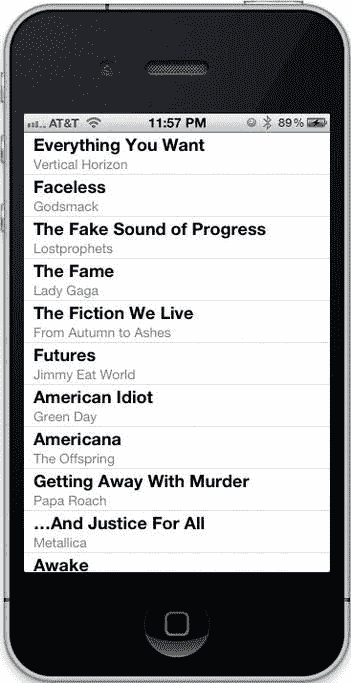

# 当所有项目具有共同特征时

当所有项目具有共同特征时——例如，当你按特定艺术家选择专辑时——`representativeItem` 属性会返回一个设置了通用属性的 `MPMediaItem` 对象，这些属性包括艺术家名称、专辑名称、发行年份以及其他常见元数据。

访问媒体项目的这些属性并非直接通过属性访问，而是通过它继承自 `MPMediaEntity` 的 `valueForProperty:` 方法来实现。`MPMediaEntity` 是一个位于 `MPMediaItem` 和 `MPMediaItemCollection` 之上的抽象类。要访问 `MPMediaPickerController` 中所有选中媒体项目的艺术家名称和标题，你可以按如下方式实现委托方法 `mediaPicker:didPickMediaItems:`：

```objc
- (void)mediaPicker:(MPMediaPickerController *)mediaPicker
  didPickMediaItems:(MPMediaItemCollection *)mediaItemCollection
{
    // 打印每个项目的艺术家和标题
    for (MPMediaItem *mediaItem in [mediaItemCollection items]) {
        NSString *artist = [mediaItem
            valueForProperty:MPMediaItemPropertyArtist];
        NSString *title = [mediaItem valueForProperty:MPMediaItemPropertyTitle];
        NSLog(@"Artist: %@ Title: %@", artist, title);
    }
}
```

### 使用 MPMusicPlayerController

一旦你有了 `MPMediaItemCollection`，你很可能想要播放音乐！为此，你需要使用 `MPMusicPlayerController` 类。不是直接创建音乐播放器控制器，而是使用两个类方法之一来访问两个单例播放器之一：`applicationMusicPlayer` 或 `iPodMusicPlayer`。

虽然这两个播放器一次只能有一个在播放，但你会将它们用于不同的场景。应用程序音乐播放器是特定于你的应用程序的；当用户离开你的应用时，音乐会停止播放。而 iPod 音乐播放器则是设备级别的音乐播放器。当你的应用启动时，它可能已经在播放音乐，而当你的应用退出时，音乐会继续播放。

当你的应用启动时，最好先判断用户是否已经在听音乐。首先，与之前讨论的 `MPMediaPickerController` 类一样，你需要将 `MediaPlayer` 框架添加到项目中，将其与目标关联，并导入其头文件。完成这些步骤后，你可以按如下方式判断用户当前是否在听音乐：

```objc
BOOL isAlreadyPlaying;
MPMusicPlayerController *iPodPlayer = [MPMusicPlayerController iPodMusicPlayer];
if ([iPodPlayer playbackState] == MPMusicPlaybackStatePlaying) {
    isAlreadyPlaying = YES;
}
else {
    isAlreadyPlaying = NO;
}
```

这段代码通过访问 iPod 音乐播放器控制器的 `playbackState` 属性，如果用户已经在听音乐，则将 `isAlreadyPlaying` 设置为 `YES`。

与 `AVAudioPlayer` 类似，`MPMusicPlayerController` 类也有 `play`、`pause` 和 `stop` 方法，不过你无需在播放前准备它。要加载用户通过媒体选择器控制器选中的媒体项目，请使用 `setQueueWithItemCollection:` 方法。以下代码会立即播放用户选中的项目。（注意，与 `UIImagePickerController` 一样，你需要负责关闭媒体选择器控制器展示的模态视图控制器，因为它不会自动关闭。）

```objc
- (void)mediaPicker:(MPMediaPickerController *)mediaPicker
  didPickMediaItems:(MPMediaItemCollection *)mediaItemCollection
{
    MPMusicPlayerController *iPodPlayer = [MPMusicPlayerController
        iPodMusicPlayer];
    [iPodPlayer setQueueWithItemCollection:mediaItemCollection];
    [iPodPlayer play];
    [self dismissModalViewControllerAnimated:YES];
}
```

如果你按下设备的 Home 键并关闭应用，通过 iPod 播放器播放的音乐会继续播放。

有时你可能需要对播放哪些媒体项目进行更精细的控制。假设你想构建一个自定义用户界面来浏览用户的媒体库，或执行高级搜索功能。这时你可以使用 `MPMediaQuery` 类，它允许你以编程方式搜索媒体库，提供比用户在 `MPMediaPickerController` 中使用搜索栏更精细的控制。

### 媒体查询

要搜索媒体库，你需要使用 `MPMediaQuery` 的几个便捷构造器之一来创建实例，这些构造器是 `MPMediaQuery` 的类方法：

- `albumsQuery`
- `artistsQuery`
- `songsQuery`
- `playlistsQuery`
- `podcastsQuery`
- `audiobooksQuery`
- `compilationsQuery`
- `composersQuery`
- `genresQuery`

媒体查询可以有一个分组类型，通过 `groupingType` 属性来表示。前面列出的每个便捷构造器都会应用一个分组类型；例如，`albumsQuery` 方法返回的查询的分组类型为 `MPMediaGroupingAlbum`。查询的 `collections` 属性会根据分组类型返回媒体项目集合；对于专辑查询，`collections` 属性会为用户库中的每张专辑返回一个单独的 `MPMediaItemCollection` 对象，并按专辑标题排序。你可以使用 `items` 属性返回查询返回的所有项目。

假设你想查找用户的所有歌曲中标题包含 "Friday" 的歌曲。为此，你需要为媒体项目查询创建一个过滤器。这个过滤器将是一个 `MPMediaPropertyPredicate` 类的谓词。首先，你需要创建一个匹配用户所有歌曲的查询：

```objc
MPMediaQuery *query = [MPMediaQuery songsQuery];
```

然后，通过按标题过滤来构造谓词。在此之前，你应该检查要用于过滤媒体项目的属性是否可以作为谓词使用。过滤查询的步骤如下：

```objc
if ([MPMediaItem canFilterByProperty:MPMediaItemPropertyTitle]) {
    MPMediaPropertyPredicate *titlePredicate =
        [MPMediaPropertyPredicate predicateWithValue:@"Friday"
            forProperty:MPMediaItemPropertyTitle
            comparisonType:MPMediaPredicateComparisonContains];
    [query addFilterPredicate:titlePredicate];
}
```

你可以组合多个过滤谓词来精确定位所需的媒体项目。借助这些查询，你可以构建自己的搜索界面，发现用户媒体库的详细信息，并构建出能够播放用户音乐、播客等内容的出色应用。

通过音乐播放器控制器和媒体库，我们探讨了将音频集成到应用中的几种方法。无论是播放按钮点击声、游戏音效，还是播放音乐，iOS 中总有一个适合你的框架。让我们在一个示例应用中实践一下。

### 示例：TitularSongs

这个示例应用的目标很简单：在 iTunes 库中查找所有名称与其所属专辑同名的歌曲。打开 Xcode，选择 File → New → Project…，或按 `+Shift+N`。在 iOS 部分最左侧的列中选择 `Application`，然后在右侧选择 `Single View Application`。点击 Next，然后输入 `TitularSongs` 作为项目名称。输入公司标识符和类前缀（我将使用 `com.learncocoatouch` 和 `LCT`），选择 `iPhone` 作为设备系列，并确保选中 `Use Automatic Reference Counting`，且同时取消选中 `Use Storyboards` 和 `Include Unit Tests`。点击 Next，然后点击 `Create` 将项目保存到磁盘。


首先，我们来添加用户界面。这款应用将非常简单：只有一个表格视图。在 Xcode 中打开主视图控制器的界面文件（`LCTViewController.xib`）。依次选择**视图 ▸ 工具 ▸ 显示对象库**或按 **Control+Option++3** 组合键来打开对象库。打开后，从对象库中拖出一个表格视图并将其放置在视图上。它应该会自动调整大小以适配视图；如果没有，请手动调整使其完全贴合视图，效果如图 11-3 所示。接下来，按住 **Control** 键并从表格视图拖拽到 Xcode 编辑面板左侧的 **File’s Owner** 对象上，以将你的视图控制器设置为表格视图的代理和数据源。重复此操作两次，分别在弹出菜单中选择 `dataSource` 和 `delegate`。

**图 11-3.** *我们的视图控制器用户界面*

接下来，打开视图控制器的头文件（`LCTViewController.h`）。由于我们已将其设为表格视图的数据源和代理，因此需要遵循 `UITableViewDataSource` 和 `UITableViewDelegate` 协议。添加以下粗体显示的代码：

```objectivec
#import <UIKit/UIKit.h>

@interface LCTViewController : UIViewController <UITableViewDataSource, UITableViewDelegate>

@end
```

将这些协议添加到类声明后，Xcode 中可能会出现一些警告。暂时忽略这些警告是没问题的；它们只是提示我们尚未实现这些协议中的必需方法，这正是我们下一步要做的。在实现此视图控制器之前，请先将 `MediaLibrary` 框架添加到你的项目并链接到目标。为此，在 Xcode 的文件浏览器顶部选择项目，点击 `TitularSongs` 目标，然后在编辑面板中选择 **构建阶段**。点击 **Link Binary With Libraries** 旁边的三角形展开该阶段，然后按 **添加** 按钮（+），最后选择 `MediaPlayer.framework`。

现在已将 `MediaPlayer` 框架添加到项目中，让我们来实现视图控制器。打开视图控制器的实现文件（`LCTViewController.m`）。在文件顶部添加以下粗体行来导入 `MediaPlayer` 头文件：

```objectivec
#import "LCTViewController.h"
#import <MediaPlayer/MediaPlayer.h>
```

为了存储所有符合条件歌曲的列表，我们将使用一个 `NSArray` 对象。通过以下粗体代码将其作为私有实例变量添加到类扩展中：

```objectivec
@interface LCTViewController () {
    NSArray *_songs;
}
@end
```

我们将在 `viewDidLoad` 方法中搜索媒体库。添加以下粗体行的搜索代码（稍后我们将对其进行分析）：

```objectivec
- (void)viewDidLoad
{
    [super viewDidLoad];
    // 加载视图后的其他设置，通常来自 nib 文件

    MPMediaQuery *mediaQuery = [MPMediaQuery songsQuery];

    // 遍历歌曲，判断它们是否与专辑共享标题。如果是，则添加到数组中。
    NSMutableArray *matchingSongs = [[NSMutableArray alloc] init];

    // 创建针对每个项目调用的块；如果项目符合条件，则将其添加到数组中。
    void (^songBlock)(id, NSUInteger, BOOL *) = ^(id obj, NSUInteger idx,
                                                  BOOL *stop) {
        MPMediaItem *song = (MPMediaItem *)obj;
        NSString *songTitle = [song
                               valueForProperty:MPMediaItemPropertyTitle];
        NSString *albumTitle = [song
                                valueForProperty:MPMediaItemPropertyAlbumTitle];
        if ([songTitle isEqualToString:albumTitle]) {
            @synchronized(matchingSongs) {
                [matchingSongs addObject:song];
            }
        }
    };

    // 遍历查询中的项目，对每个项目调用 songBlock。
    [[mediaQuery items] enumerateObjectsWithOptions:NSEnumerationConcurrent usingBlock:songBlock];

    // 获取数据后，将其存储在 _songs 变量中。
    _songs = [NSArray arrayWithArray:matchingSongs];
}
```


这段代码首先通过`songsQuery`方法获取设备上所有歌曲的列表，并将其存储在`mediaQuery`变量中。然后，我们创建一个可变数组，用于在找到歌曲时添加它们。接下来，我们创建一个名为`songBlock`的块，用于枚举歌曲。在该块中，我们将从歌曲中获取歌曲标题和专辑标题；如果两者相等，则将它们添加到`matchingSongs`数组中。我们使用`@synchronized`指令确保不会同时从多个线程修改该数组。下一行明确说明了这一点的重要性：我们使用`NSEnumerationConcurrent`选项枚举查询的`items`方法返回的数组中的对象，这会导致该块在多个线程上并发运行。最后，枚举完歌曲后，我们会将每个匹配的歌曲存储在`_songs`数组中。

既然我们已经找到了所需的歌曲，接下来实现表格视图方法来显示结果。在视图控制器实现中的`@end`编译器指令之前，添加加粗显示的方法：

```objectivec
@implementation LCTViewController

...

- (NSInteger)numberOfSectionsInTableView:(UITableView *)tableView
{
    return 1;
}

- (NSInteger)tableView:(UITableView *)tableView 
numberOfRowsInSection:(NSInteger)section
{
    return [_songs count];
}

- (UITableViewCell *)tableView:(UITableView *)tableView 
cellForRowAtIndexPath:(NSIndexPath *)indexPath
{
    NSString *cellIdentifier = @"songCell";
    UITableViewCell *cell = [tableView 
        dequeueReusableCellWithIdentifier:cellIdentifier];
    
    if (cell == nil) {
        cell = [[UITableViewCell alloc] 
            initWithStyle:UITableViewCellStyleSubtitle 
            reuseIdentifier:cellIdentifier];
    }
    
    MPMediaItem *song = [_songs objectAtIndex:[indexPath row]];
    [[cell textLabel] setText:[song 
        valueForProperty:MPMediaItemPropertyTitle]];
    [[cell detailTextLabel] setText:[song 
        valueForProperty:MPMediaItemPropertyArtist]];
    
    MPMediaItemArtwork *albumArt = [song 
        valueForProperty:MPMediaItemPropertyArtwork];
    CGSize imageSize = CGSizeMake([tableView rowHeight], [tableView 
        rowHeight]);
    [[cell imageView] setImage:[albumArt imageWithSize:imageSize]];
    
    return cell;
}

@end
```

我们的表格视图只有一个分区，其行数与匹配的歌曲数量相同。在`tableView:cellForRowAtIndexPath:`方法中，我们将创建（或重用）一个具有`UITableViewCellStyleSubtitle`样式的单元格，然后用歌曲标题（由于我们搜索的歌曲，它也是专辑标题）和艺术家名称填充它。接下来，我们获取一个代表歌曲专辑封面的`MPMediaItemArtwork`对象，然后用它来填充单元格的图像视图。在 iOS 设备上构建并运行该应用程序，您的媒体库中符合我们条件的歌曲将出现在表格视图中。图 11-4 显示了该应用在我的 iPhone 上运行的情况，展示了我媒体库中符合此条件的歌曲。请注意，并非所有专辑都有专辑封面，尤其是 iTunes Match 中的专辑。



**图 11-4.** *TitularSongs 示例应用*

到目前为止一切顺利。让我们为此应用再添加一个功能：播放歌曲。在`@end`指令之前的实现文件中添加委托方法`tableView:didSelectRowAtIndexPath:`。使用加粗显示的行创建它：

```objectivec
- (void)tableView:(UITableView *)tableView 
didSelectRowAtIndexPath:(NSIndexPath *)indexPath
{
    [tableView deselectRowAtIndexPath:indexPath animated:YES];
    
    MPMediaItem *song = [_songs objectAtIndex:[indexPath row]];
    NSArray *items = [NSArray arrayWithObject:song];
    MPMediaItemCollection *itemCollection = 
        [MPMediaItemCollection collectionWithItems:items];
    
    [[MPMusicPlayerController iPodMusicPlayer] 
        setQueueWithItemCollection:itemCollection];
    [[MPMusicPlayerController iPodMusicPlayer] play];
}
```

这段代码从一个仅包含所选歌曲的数组中创建一个`MPMediaItemCollection`，然后指示系统范围的 iPod 音乐播放器播放它。构建并运行该应用，然后点击其中一首歌曲；它将开始播放。由于我们未在此应用中内置任何播放控制，您需要使用设备上的“音乐”应用来停止音频。我们在应用中使用了 iPod 音乐播放器，因此在 Xcode 中单击“停止”来停止执行是不够的，因为音频控制已移交给内置的 iPod 播放器。

如您所见，`MediaPlayer`框架允许我们操作用户的 iTunes 库，以执行任意搜索并随意播放内容。接下来，我们将了解如何为您的应用添加另一种媒体类型：视频。

## 播放视频

与播放音频一样，在 iOS 上有多种播放视频的方式。使用哪种方式取决于您的需求。有些应用只需为用户提供视频供其随意观看，而其他应用则可能希望在屏幕的特定部分播放无控件的视频。在高级层面上，您可以使用`MPMoviePlayerController`类来播放视频，但如果您需要更精细的控制，则可以使用`AVFoundation`框架。让我们先讨论`MPMoviePlayerController`类。

### 使用 MPMoviePlayerController

如果您有一个本地视频文件，可以使用以下代码创建一个`MPMoviePlayerController`：

```objectivec
NSURL *movieURL = [[NSBundle mainBundle] URLForResource:@"myMovie" 
                                          withExtension:@"mov"];
MPMoviePlayerController *moviePlayerController = 
    [[MPMoviePlayerController alloc] initWithContentURL:movieURL];
```

也可以通过网络流播放视频；我们稍后会介绍。

与`AVAudioPlayer`类类似，`MPMoviePlayerController`类维护缓冲区并调用硬件；为此，您可以调用其实例方法`prepareToPlay`来缓冲视频，从而避免在调用其`play`方法时出现延迟。然而，与`AVAudioPlayer`类不同，调用`play`后工作并未结束；因为这里讨论的是视频，所以必然涉及用户界面，您需要一个位置来放置显示给用户的视频。

**注意：** 默认情况下，电影播放控制器会同时播放电影中的音频和您应用中的音频。如果您想更改此行为，确保电影的音频不与应用中的其他音频混合，请将电影播放控制器的`useApplicationAudioSession`属性设置为`NO`。

### 使用 MPMoviePlayerViewController

播放视频最简单的方法是完全不使用`MPMoviePlayerController`，而是使用另一个使用它的类，即`MPMoviePlayerViewController`类。这个类是一种自包含的方式，用于呈现全屏视图控制器并播放电影。它包含显示电影控件的自有逻辑，但其他方面与普通视图控制器类似。使用它就像创建电影播放控制器一样简单：

```objectivec
NSURL *movieURL = [[NSBundle mainBundle] URLForResource:@"myMovie" 
                                          withExtension:@"mov"];
MPMoviePlayerViewController *moviePlayerViewController = 
    [[MPMoviePlayerViewController alloc] initWithContentURL:movieURL];
```

您可以通过访问其`moviePlayer`属性来访问电影播放视图控制器在幕后使用的电影播放控制器。这允许您配置播放所需的`MPMoviePlayerController`属性——我们稍后会介绍这些。当您想要呈现电影播放器时，您将使用...而不是`presentModalViewController:animated:`。


