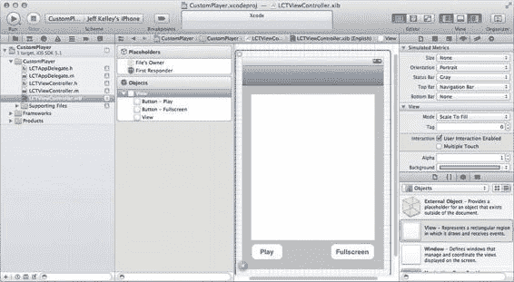

# 应用中的媒体：播放音频与视频

### 使用 `presentMoviePlayerViewControllerAnimated:`

`presentMoviePlayerViewControllerAnimated:` 是一个专为此用途设计的类似方法（在 `MediaPlayer` 框架中作为 `UIViewController` 的一个类别定义），它将以模态方式显示电影播放器视图控制器。该方法的唯一参数是电影播放器视图控制器；它总是以动画形式显示。当你的视频播放完毕后，调用 `dismissMoviePlayerViewControllerAnimated` 来关闭它。但如何知道视频已经播放完毕？为此，你需要使用 `MPMoviePlayerViewController` 的 `moviePlayer` 属性中的 `MPMoviePlayerController`。

你使用 `MPMoviePlayerController` 可以做的事情之一，是在电影播放过程中的不同节点注册它发布的通知。在这种情况下，当视频播放完毕时（无论是完整播放完毕还是因错误结束），会发布 `MPMoviePlayerPlaybackDidFinishNotification` 通知。如果是 `MPMoviePlayerViewController` 的情况，你可以在其视频播放完毕后关闭该视图控制器。如果用户按下“完成”按钮停止观看视频，则不会发送 `MPMoviePlayerPlaybackDidFinishNotification` 通知；在这种情况下，电影播放器控制器会发布 `MPMoviePlayerDidExitFullscreenNotification` 通知。不过，如果你不使用电影播放器视图控制器，而仅使用电影播放器控制器，就可以对视频进行更多有趣的操作。

### 使用 `MPMoviePlayerController` 的视图

`MPMoviePlayerController` 的属性之一是 `view` 属性。这是一个标准的 `UIView`，可以放置在你视图层次结构中的任何位置。当它出现时，会包含一个系统绘制的播放按钮。在 iPhone 或 iPod touch 上，由于屏幕尺寸有限，视频会自动以全屏模式播放。在 iPad 上，视频默认会在电影播放器控制器视图所在的位置内联播放。当然，你也可以在 iPhone 或 iPod touch 上不进行全屏播放，或在 iPad 上进行全屏播放。

无论视频当前是否正在播放，无论你使用何种设备，都可以调用电影播放器控制器的 `setFullscreen:animated:` 方法来进入或退出全屏播放。这会生成一个你可以监听的通知，即 `MPMoviePlayerDidEnterFullscreenNotification` 或 `MPMoviePlayerDidExitFullscreenNotification`。当视频以全屏模式播放时，系统会自动提供一个“完成”按钮，用户可以按下该按钮退出全屏模式。

电影控件——包括播放、暂停、快退和快进按钮等——是电影播放器控制器视图上的标准配置。如果你想提供自己的控件（可能为了使用你应用的 UI 风格），可以使用电影播放器控制器的 `controlStyle` 属性。将其设置为 `MPMovieControlStyleNone` 常量以移除内置控件，然后将你自己的控件作为子视图添加到电影播放器控制器的视图中。当使用你的自定义控件时，只需适当地调用 `play`、`pause`、`stop` 等方法即可。

### 播放网络视频

`MPMoviePlayerController` 类的初始化方法是 `initWithContentURL:`。虽然你可以使用文件 URL 访问应用包或文件系统中其他位置的本地文件，但也可以使用远程 URL 从服务器播放电影。如果视频的 URL 是 `http://www.example.com/myMovie.mp4`，创建电影播放器控制器的代码如下：

```
NSURL *movieURL = [NSURL URLWithString:@"http://www.example.com/myMovie.mp4"];
MPMoviePlayerController *moviePlayerController =
    [[MPMoviePlayerController alloc] initWithContentURL:movieURL];
```

如果这样做，有一些注意事项需要牢记。由于远程电影的部分数据（如时长）是元数据，你可能无法立即访问它们。如果电影播放器控制器无法确定其电影的时长，其 `duration` 属性将返回 `0.0`。如果发生这种情况，你可以通过注册 `MPMovieDurationAvailableNotification` 通知的观察者，在时长已知时得到通知。假设你有一个名为 `durationLabel` 的标签，以下是如何使用电影时长对其进行初始化的代码：

```
MPMoviePlayerController *moviePlayerController =
    [[MPMoviePlayerController alloc] initWithContentURL:movieURL];
NSTimeInterval duration = [moviePlayerController duration];

if (duration > 0.0) {
    NSString *durationString =
        [NSString stringWithFormat:@"%f", duration];
    [durationLabel setText:durationString];
}
else {
    [durationLabel setText:nil];
    NSNotificationCenter *notificationCenter = [NSNotificationCenter
        defaultCenter];
    [notificationCenter addObserverForName:MPMovieDurationAvailableNotification
                                    object:moviePlayerController
                                     queue:[NSOperationQueue mainQueue]
                                usingBlock:^(NSNotification *note) {
                                    NSString *durationString =
                                        [NSString stringWithFormat:@"%f", duration];
                                    [durationLabel setText:durationString];
                                }];
}
```

请注意，我们只为这个特定的电影播放器控制器注册了该通知；你可能同时有多个电影播放器控制器处于活动状态，因此要确保从正确的控制器获取时长。

### 获取视频缩略图

通过网络播放视频时，另一个无法立即获取的内容是缩略图。通常，你可以使用 `thumbnailImageAtTime:timeOption:` 方法从电影播放器控制器中检索缩略图。该方法的第一个参数是一个 `NSTimeInterval` 值，表示你在电影中想要缩略图的时间点（从电影开始算起的秒数），这在例如构建一个在电影多个章节间导航的 UI 时非常有用。第二个参数是一个 `MPMovieTimeOption` 常量，可以是 `MPMovieTimeOptionNearestKeyFrame` 或 `MPMovieTimeOptionExact`。前者不尝试在指定的精确时间获取缩略图，而是选择最近的 keyframe，这可以提供更好的性能；而后者则使缩略图来自视频中指定的精确时间。取决于用于压缩视频的视频压缩编解码器，这可能导致电影播放器控制器将压缩视频的多个帧合成在一起，以创建所需的缩略图。

使用 `thumbnailImageAtTime:timeOption:` 方法的问题在于它是同步运行的。对于网络视频，如果你调用此方法并请求接近末尾的缩略图，可能会导致该方法阻塞当前线程相当长的时间。为了解决这个问题，并同时提供分别异步请求多个缩略图的能力，`MPMoviePlayerController` 类提供了 `requestThumbnailImagesAtTimes:timeOption:` 方法。第一个参数是一个包含 `NSNumber` 对象的 `NSArray`，这些对象表示从视频开始算起的 `NSTimeInterval` 值（以秒为单位）；第二个参数与之前相同，是 `MPMovieTimeOption` 值。在创建用于此数组的 `NSNumber` 对象时，务必使用 `NSNumber` 的 `numberWithDouble:` 类方法，因为使用 `numberWithInt:` 或其他使用整数的方法会导致错误。电影播放器控制器期望的是一个定义为 `double` 类型的 `NSTimeInterval` 值。一旦缩略图可用，电影播放器控制器会发布一个名为...


```markdown

`MPMoviePlayerThumbnailImageRequestDidFinishNotification`。该通知的`userInfo`字典中包含两个对象：一个`NSNumber`对象，表示你请求缩略图的时间点（以秒为单位，从视频开头算起），该对象与键`MPMoviePlayerThumbnailTimeKey`关联；另一个对象是缩略图图像（由`UIImage`对象表示）或错误（由`NSError`对象表示），根据操作是否成功，分别与键`MPMoviePlayerThumbnailImageKey`或`MPMoviePlayerThumbnailErrorKey`关联。

[www.it-ebooks.info](http://www.it-ebooks.info/)

**第 11 章：应用中的媒体：播放音频和视频** 338

最后，如果你需要取消缩略图请求——例如，当用户离开原本要显示缩略图图像的视图控制器时——你可以调用电影播放器控制器的`cancelAllThumbnailImageRequests`方法，顾名思义，该方法会取消当前所有待处理的缩略图请求。

**AirPlay**

`AirPlay`是苹果公司用于通过本地网络流式传输音频和视频的技术。如果你家里有`Apple TV`和无线网络，就可以用它来接收来自`iOS`设备的音频和视频。默认情况下，`MPMoviePlayerController`不允许其视频通过`AirPlay`流式传输到其他设备；若要允许，需将电影播放器控制器的`allowsAirPlay`属性设置为`YES`。设置完成后，`MPMoviePlayerController`视图中的控件将包含一个按钮，用于将当前正在播放的视频发送到其他设备。

我们已经涵盖了使用`MPMoviePlayerController`类播放视频的大部分内容。你也可以使用`AVFoundation`框架来播放视频——特别是在需要同时播放多个视频时——但对于绝大多数需求，`MPMoviePlayerController`和`MPMoviePlayerViewController`足以处理视频播放。让我们编写一个示例应用来实践这些知识。

**示例：CustomPlayer**

这个示例应用将非常简单。我们的目标是获取一个视频（我们将使用`UIImagePickerController`来实现），然后使用自定义控件显示该视频。打开`Xcode`，选择`File` → `New` → `Project…`，或按`⌘+Shift+N`。

在`iOS`部分下的最左列选择`Application`，然后在右侧选择`Single View Application`。点击`Next`，然后将项目名称设置为`CustomPlayer`。输入你的公司标识符和类前缀（我将使用`com.learncocoatouch`和`LCT`），选择`iPhone`作为`Device Family`，并确保勾选了`Use Automatic Reference Counting`，同时取消勾选`Use Storyboards`和`Include Unit Tests`。点击`Next`，然后点击`Create`将项目保存到磁盘。

首先，添加用户界面。这个应用将非常简单：一个单一的表格视图。在`Xcode`中打开主视图控制器的用户界面文件（`LCTViewController.xib`）。由于我们将把这个视图控制器嵌入到导航控制器中，请选择该视图，然后通过选择`View` → `Utilities` → `Show Attribute Inspector`或按`⌥+⌘+4`打开属性检查器。在`Simulated Metrics`下，为`Top Bar`设置选择`Navigation Bar`。你应该会看到

[www.it-ebooks.info](http://www.it-ebooks.info/)



**第 11 章：应用中的媒体：播放音频和视频**

出现一个导航栏，表明它将占用的屏幕区域。通过选择`View` → `Utilities` → `Show Object Library`或按`Control+⌥+⌘+3`打开对象库。打开后，将两个`Round Rect Buttons`拖入你的视图中。双击它们以更改标题；将其中一个按钮的标题设置为`Play`，另一个设置为`Fullscreen`。将它们拖到用户界面的底部（会出现一条蓝色参考线，显示与底部的合适距离）。接下来，从对象库中将一个新的`View`对象拖入你的视图，并将其大小调整为填充按钮上方的空间，使用蓝色参考线进行对齐。完成后，它应该看起来像图 11-5。

**图 11-5.** *我们的自定义视频播放器 UI*

由于这个应用将支持旋转，我们需要为这些视图设置适当的自动调整掩码。我们希望`Play`按钮保持在左下角，`Fullscreen`按钮保持在右下角，并且它们上方的视图随着视图的增长而增长。通过选择`View` → `Utilities` → `Show Size Inspector`或按`⌥+⌘+5`打开尺寸检查器。

单击选中`Play`按钮。在尺寸检查器中，调整`Autosizing`标签上方的区域，以修改自动调整掩码，使得底部和左侧的支撑（内框外部的线条）被选中（以实红线表示），而其他支撑以及两个弹簧（内框内部的箭头）不被选中（以虚线红线表示）。接下来，选择`Fullscreen`按钮，并将其设置为`Play`按钮的镜像；唯一选中的弹簧或支撑应该是底部和右侧的支撑。然后，对于

[www.it-ebooks.info](http://www.it-ebooks.info/)

**第 11 章：应用中的媒体：播放音频和视频** 340

两个按钮上方的视图，设置自动调整掩码，使得所有四个支撑和两个弹簧都被选中；这将允许它随视图调整大小。

我们的用户界面已设置好，现在为这些对象定义一些`outlet`，以及为按钮定义一些`action`。我们还需要表明这个视图控制器符合几个委托协议：一个用于操作表，一个用于导航控制器，一个用于图像选择器控制器。打开视图控制器的头文件（`LCTViewController.h`），并添加粗体显示的代码：

```
#import <UIKit/UIKit.h>

@interface LCTViewController : UIViewController <UIActionSheetDelegate, UIImagePickerControllerDelegate, UINavigationControllerDelegate>

@property (strong, nonatomic) IBOutlet UIView *movieHostingView;

@property (strong, nonatomic) IBOutlet UIButton *playPauseButton;

@property (strong, nonatomic) IBOutlet UIButton *fullscreenButton;

- (IBAction)playPauseButtonPressed:(id)sender;

- (IBAction)fullscreenButtonPressed:(id)sender;

@end
```

接下来，将我们的视图对象连接到这些`outlet`和`action`。再次打开用户界面文件（`LCTViewController.xib`）。按住`Control`键，从`Xcode`编辑面板左侧的`File’s Owner`拖动到按钮上方的视图，在出现的`Outlets`弹出菜单中选择`movieHostingView`。对按钮执行相同操作，为标记为`Play`的按钮选择`playPauseButton` outlet，为标记为`Fullscreen`的按钮选择`fullscreenButton` outlet。现在连接`action`；按住`Control`键，从标记为`Play`的按钮拖动到`File’s Owner`对象，在出现的`Sent Events`弹出菜单中选择`playPauseButtonPressed:` action。对标记为`Fullscreen`的按钮执行相同操作，改为从弹出菜单中选择`fullscreenButtonPressed:` action。这样，我们的用户界面设置就完成了；让我们进入实现部分。

由于我们要将视图控制器嵌入到导航控制器中，我们需要修改应用委托的实现。打开其实现文件（`LCTAppDelegate.m`），并通过添加粗体显示的行并删除被划掉的行来修改`application:didFinishLaunchingWithOptions:`方法：
```


- (BOOL)`application:(UIApplication *)application`
`didFinishLaunchingWithOptions:(NSDictionary *)launchOptions`
{
`self.window = [[UIWindow alloc] initWithFrame:[[UIScreen mainScreen] bounds]];`
// 在应用启动后自定义的覆盖点。
[www.it-ebooks.info](http://www.it-ebooks.info/)
第 11 章：应用中的媒体：播放音频与视频 341
`self.viewController = [[LCTViewController alloc] initWithNibName:@"LCTViewController" bundle:nil];`
`UINavigationController *navigationController = [[UINavigationController alloc] initWithRootViewController:[self viewController]];`
`self.window.rootViewController = self.viewController;`
`self.window.rootViewController = navigationController;`
`[self.window makeKeyAndVisible];`
`return YES;`
}

在实现视图控制器之前，请先将`MediaPlayer`和`MobileCoreServices`框架添加到项目中，并将其链接到目标。为此，在 Xcode 的文件浏览器顶部选择项目，点击`CustomPlayer`目标，然后在编辑窗格中选择`Build Phases`。点击`Link Binary With Libraries`阶段旁的三角形将其展开，然后点击`Add`按钮（`+`）并选择`MediaPlayer.framework`。再次点击`Add`按钮并选择`MobileCoreServices.framework`。

现在我们已经将`MediaPlayer`和`MobileCoreServices`框架添加到项目中，接下来实现视图控制器。打开视图控制器的实现文件（`LCTViewController.m`）。通过在该文件顶部添加粗体行来导入`MediaPlayer`和`MobileCoreServices`头文件：

```
#import "LCTViewController.h"
#import <MediaPlayer/MediaPlayer.h>
#import <MobileCoreServices/MobileCoreServices.h>
```

接下来，我们将添加一个私有实例变量，用于存储指向`MPMoviePlayerController`的指针。我们还将添加一个方法，该方法将由导航栏上的按钮调用，以显示图像选择控制器，并添加一个方法来显示该图像选择控制器。通过添加以下粗体代码来修改类扩展：

```
@interface LCTViewController () {
    MPMoviePlayerController *_moviePlayerController;
}
- (void)selectVideoButtonPressed:(id)sender;
- (void)showImagePickerForSourceType:(UIImagePickerControllerSourceType)sourceType;
@end
```

[www.it-ebooks.info](http://www.it-ebooks.info/)
第 11 章：应用中的媒体：播放音频与视频 342

现在我们可以实现视图控制器了。首先要做的是为属性添加`@synthesize`指令。其次，我们将实现`initWithNibName:bundle:`方法，以在视图控制器创建时进行一些额外的设置。要执行这些任务，请添加粗体行：

```
@implementation LCTViewController
@synthesize movieHostingView;
@synthesize playPauseButton;
@synthesize fullscreenButton;
- (id)initWithNibName:(NSString *)nibNameOrNil bundle:(NSBundle *)nibBundleOrNil
{
    self = [super initWithNibName:nibNameOrNil bundle:nibBundleOrNil];
    if (self) {
        [self setTitle:@"CustomPlayer"];
        SEL selectVideoSelector = @selector(selectVideoButtonPressed:);
        UIBarButtonItem *selectVideoButton = [[UIBarButtonItem alloc]
            initWithBarButtonSystemItem:UIBarButtonSystemItemCamera
            target:self
            action:selectVideoSelector];
        [[self navigationItem] setRightBarButtonItem:selectVideoButton];
    }
    return self;
}
```

我们在这里创建的按钮将用于调出图像选择控制器。首先，我们将确定是否可以使用相机、照片库或两者来获取视频。根据我们的发现，我们将显示图像选择控制器或操作表，以询问用户使用哪种源类型。我们将首先实现`selectVideoButtonPressed:`方法。在模板中的视图控制器方法之后，`@end`编译器指令之前，添加粗体行：

```
- (void)selectVideoButtonPressed:(id)sender
{
    // 确定我们可以通过图像选择控制器获取视频的途径。
    BOOL canUseCamera = NO;
    if ([UIImagePickerController
        isSourceTypeAvailable:UIImagePickerControllerSourceTypeCamera] &&
        [www.it-ebooks.info](http://www.it-ebooks.info/)
```


