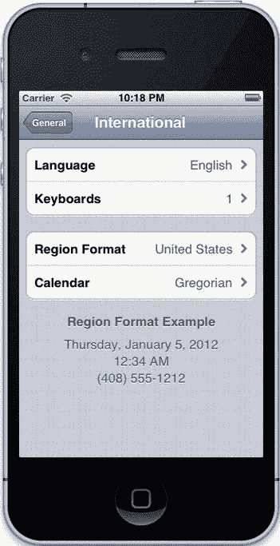
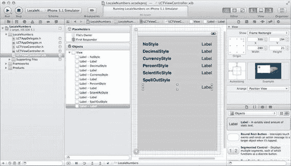
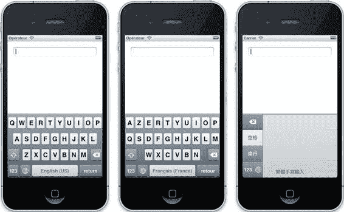

# 第 12 章：本地化与国际化

在本书接近尾声之际，我们理应探讨一下应用程序的国际化与本地化流程。在开发应用时，你很可能使用的是母语。你可能已经在考虑支持应用的多语言功能，但事实上这只是其中一部分。这些流程还包括在开发应用时考虑用户的首选语言、货币、数字格式、日期格式以及文化习惯。在本章中，我们将介绍本地化和国际化的不同方法，以及在进行相关工作时需要考虑的一些关键因素。不过，首先让我们探讨一个更重要的问题：为什么？

许多开发者用英语创建应用，然后在全球的 App Store 上发布。对大多数人而言，这种做法效果不错；英语在美国以外的许多国家也广泛使用，因此在这些国家也能获得销量，但大部分销量仍来自英语国家。截至目前，App Store 已在超过 120 个国家上线，iOS 支持超过 50 种语言。决定忽略 49 种语言并在 119 个国家销量不佳，固然能节省时间，但最终可能会让你损失金钱。对应用进行本地化能立即产生影响，甚至在应用被下载之前就已显现——因为你可以本地化 App Store 中的应用描述。如果用户能在 App Store 中读懂你的应用描述，他们就更有可能下载它。因此，遵循本章的指导原则，可以提升销量，并在全球范围内赢得更满意的用户基础。

[www.it-ebooks.info](http://www.it-ebooks.info/)

## 国际化

本章首先介绍的是国际化。你可能已经熟悉本地化的概念——将应用翻译成另一种语言——但国际化比这更复杂一些。它涵盖应用中的细节：例如数字、日期和货币的表示方式。iOS 通过语言区域（locales）来支持国际化的实现，这些语言区域将区域习惯封装在 `NSLocale` 类中。系统会跟踪用户选择的语言区域，而不是让用户在运行时选择——或者更糟，让你的应用自动检测。你可以使用 `currentLocale` 类方法来获取用户的 `NSLocale` 对象。出于测试目的，你可以在 iOS 设备或 iOS 模拟器上更改所选的语言区域。请注意，这不会影响当前正在运行的应用；若要测试更改语言区域的效果，请务必在更改前退出应用。打开“设置”应用，选择“通用”，然后点击“国际”。你将看到类似图 12-1 的界面。语言区域可以通过点击“区域格式”行来更改，此处设置为“美国”。更改区域格式不会自动更改设备的语言，更改语言需要点击“语言”行。我们将在讨论本地化时再讨论语言更改。

[www.it-ebooks.info](http://www.it-ebooks.info/)



**图 12-1.** *“通用”设置中的“国际”部分*

既然我们已经了解了如何更改区域格式，下面我们来看看在呈现数据时如何使用用户的设置。

### 使用数字

不同地区数字的表示方式也不同。在美国表示为 1,000.42 的数字，在法国表示为 1 000,42。对于不使用阿拉伯数字的国家，同一个数字的表示方式可能完全不同。与其自行编写代码来处理这些差异，结果却可能在某些国家完全错误从而激怒用户，不如使用 `NSNumberFormatter` 类，在向用户显示数字和数字字符串（例如一百二十三）时，自动考虑用户所选的语言区域。

让我们来看看如何使用 `NSNumberFormatter`。如果你查阅文档，会发现有几十个实例方法；你可以随心所欲地定制数字格式化程序的输出，但我们这里更关心的是获取语言区域的默认行为，而不是定义自定义的数字格式。要使用内置的格式化功能，只需在 `NSNumberFormatter` 对象上调用 `setNumberStyle:` 方法即可。可选值包括 `NSNumberFormatterDecimalStyle`、`NSNumberFormatterCurrencyStyle`、`NSNumberFormatterPercentStyle`、`NSNumberFormatterScientificStyle`、`NSNumberFormatterNoStyle` 和 `NSNumberFormatterSpellOutStyle`。要使用十进制样式，可以像下面这样创建一个数字格式化程序：

```
NSNumber *number = [NSNumber numberWithDouble:1000.42];
NSNumberFormatter *numberFormatter = [[NSNumberFormatter alloc] init];
[numberFormatter setNumberStyle:NSNumberFormatterDecimalStyle];
NSString *formattedString = [numberFormatter stringFromNumber:number];
```

当语言区域设置为美国时，`formattedString` 为 "1,000.42"。设置为法国法语时，结果为 1 000,42；而设置为德国德语时，结果为 1.000,42。在国际化应用中，只要向用户显示数字，你都应该使用数字格式化程序。通过使用数字格式化程序，你的用户会感受到你对应用国际版本的用心，并对此表示赞赏。

[www.it-ebooks.info](http://www.it-ebooks.info/)


## 排版后的内容

仅以适当格式显示数字还不够。如果你的应用使用了计量单位（例如重量、长度或体积），你应该使用用户习惯的单位制。为此，你可以查询 `NSLocale` 对象，以确定该区域设置是否使用公制：

```
NSLocale *locale = [NSLocale currentLocale];

NSNumber *usesMetricNumber = [locale objectForKey:NSLocaleUsesMetricSystem];
BOOL usesMetric = [usesMetricNumber boolValue];
```

一旦能确定是否应使用公制，你就应该（如有必要）将数值转换为用户所处的度量系统。这看似一步之遥，却能显著提升用户对应用的好感。为了演示这一点，我们来创建一个使用区域设置的示例应用。

#### 示例：LocaleNumbers

在这个示例应用中，我们将使用当前区域设置，以用户习惯的方式正确书写数字。打开 Xcode 并选择 `File` → `New` → `Project…`，或按下 `+Shift+N`。在 iOS 部分的最左侧列中选择 `Application`，然后在右侧选择 `Single View Application`。点击 `Next`，然后输入 `LocaleNumbers` 作为项目名称。输入你的公司标识和类前缀（我会使用 `com.learncocoatouch` 和 `LCT`），在 Device Family 中选择 `iPhone`，确保勾选了 `Use Automatic Reference Counting`，并取消勾选 `Use Storyboards` 和 `Include Unit Tests`。点击 `Next`，然后点击 `Create` 将项目保存到磁盘。

该项目的用户界面将相当简单：只包含少量标签。在 Xcode 中打开主视图控制器的用户界面文件（`LCTViewController.xib`）。通过选择 `View` → `Utilities` → `Show Object Library` 或按下 `Control+Option+` +3 打开对象库。打开后，我们将为六种内置的 `NSNumberFormatter` 样式各添加两个标签，总共 12 个。将它们排列成六行，每行两列。为了简化操作，你可以将两个标签并排放置，按住 `Option` 并拖拽以复制标签，这样每次可以创建两个，而非一个。双击左侧列中的标签以更改其文本；从上到下，将标签分别设置为 `NoStyle`、`DecimalStyle`、`CurrencyStyle`、`PercentStyle`、`ScientificStyle` 和 `SpellOutStyle`。让我们将这些标签设为粗体。为方便起见，你可以一次性选中它们；在视图中的标签下方点击，然后拖拽形成一个矩形，选中其中包含的所有视图。或者，你也可以在点击标签时按住 `Shift` 或 以选择多个标签。选中全部六个标签后，通过选择 `View` → `Utilities` → `Show Attribute Inspector` 或按下 `Option+` +4 打开属性检查器。点击字体文本框右侧带有 T 的图标以调整标签字体；在弹出的菜单中，将 `System` 改为 `System Bold`。请注意，操作后文本的大小会增加。当你输入文本时，标签会自动调整大小。为了自动调整大小以适应新的尺寸，请在选择一个或多个标签后按下 `+=`。对于另外六个标签，我们需要做两件事：首先，选中它们全部并打开属性检查器。在 Alignment 旁边，选择对齐按钮最右侧的部分，将标签文本设置为右对齐。其次，通过选择 `View` → `Utilities` → `Show Size Inspector` 或按下 `Option+` +5 打开尺寸检查器。在 Origin 上方，有一个包含九个点的方形。点击右上角的点，这样在改变标签大小时，标签将锚定在其框架的该角落。将 Width 上方的文本字段值改为 75，这将把标签扩展为 75 点宽。这将为它们提供足够的空间来显示内容，但最后一个对应“拼写”样式的标签除外。对于这个标签，将其拖到左侧标签的下方，并水平扩展以填充视图；这应能提供足够空间。完成后，视图应如图 12-2 所示。



**图 12-2.** *我们的示例项目的用户界面*

让我们为这些标签定义一些输出口。我们只会更改右侧的标签，因此只需要六个输出口。打开视图控制器的头文件（`LCTViewController.h`），并添加粗体显示的行：

```
#import <UIKit/UIKit.h>

@interface LCTViewController : UIViewController

@property (weak, nonatomic) IBOutlet UILabel *noStyleLabel;
@property (weak, nonatomic) IBOutlet UILabel *decimalStyleLabel;
@property (weak, nonatomic) IBOutlet UILabel *currencyStyleLabel;
@property (weak, nonatomic) IBOutlet UILabel *percentStyleLabel;
@property (weak, nonatomic) IBOutlet UILabel *scientificStyleLabel;
@property (weak, nonatomic) IBOutlet UILabel *spellOutStyleLabel;

@end
```

接下来，切换回用户界面（`LCTViewController.xib`）并连接输出口：按住 `Control` 并从 File’s Owner 对象拖拽到 Xcode 编辑器窗格左侧，依次连接到右侧的每个标签，为每个标签选择与左侧标签匹配的输出口。如果出错，移除输出口连接很容易。点击你出错的标签，通过选择 `View` → `Utilities` → `Show Connections Inspector` 或按下 `Option+` +6 打开连接检查器。在 Xcode 窗口右侧的实用工具窗格中，你将看到所选对象所有已连接输出口的列表。点击某个输出口中的 X 即可断开连接。所有标签正确连接后，让我们切换到实现文件（`LCTViewController.m`）。在 `@implementation` 指令之后添加粗体显示的行，以合成为我们属性生成的访问器：

```
@implementation LCTViewController

@synthesize noStyleLabel;
@synthesize decimalStyleLabel;
@synthesize currencyStyleLabel;
@synthesize percentStyleLabel;
@synthesize scientificStyleLabel;
@synthesize spellOutStyleLabel;
```

接下来，我们将修改 `viewDidLoad` 方法以填充这些标签。在 `viewDidLoad` 方法中添加以下粗体显示的行：

```
- (void)viewDidLoad
{
    [super viewDidLoad];
    // Do any additional setup after loading the view, typically from a nib.

    NSNumber *number = [NSNumber numberWithDouble:1000.42];
    NSNumberFormatter *numberFormatter = [[NSNumberFormatter alloc] init];
    [numberFormatter setNumberStyle:NSNumberFormatterNoStyle];
    [[self noStyleLabel] setText:[numberFormatter
        stringFromNumber:number]];
```


```objectivec
[numberFormatter setNumberStyle:NSNumberFormatterDecimalStyle];

[[self decimalStyleLabel] setText:[numberFormatter stringFromNumber:number]];

[numberFormatter setNumberStyle:NSNumberFormatterCurrencyStyle];

[[self currencyStyleLabel] setText:[numberFormatter stringFromNumber:number]];

[numberFormatter setNumberStyle:NSNumberFormatterPercentStyle];

[[self percentStyleLabel] setText:[numberFormatter stringFromNumber:number]];

[numberFormatter setNumberStyle:NSNumberFormatterScientificStyle];

[[self scientificStyleLabel] setText:[numberFormatter stringFromNumber:number]];

[numberFormatter setNumberStyle:NSNumberFormatterSpellOutStyle];

[[self spellOutStyleLabel] setText:[numberFormatter stringFromNumber:number]];
```

如您所见，对于每个标签，我们都将数字格式化器的样式设置为相应的样式常量，并将标签的值设置为同一个数字，并按相应样式进行格式化。构建并运行应用。您应该会看到根据您区域设置格式化后的数字。点击 Xcode 中的“停止”按钮退出应用，然后切换回 iOS 模拟器，打开“设置”，依次选择“通用”→“国际”→“区域格式”，并选择一个不同的区域。再次构建并运行应用，您将看到根据所选区域格式化后的数字。对于美国、法语（法国）和中文（中国）这三种区域设置，应用应如图 12-3 所示。

**图 12-3.** 我们的示例应用在美国区域设置（左）、法语（法国）区域设置（中）和中文（中国）区域设置（右）下的运行效果

如您所见，不同的数字格式化器样式对此应用中显示的数字会产生不同的效果。然而，无需编写任何特定于区域的代码，您就可以使用这些样式以用户本地格式显示数字。接下来，我们将讨论一个类似的问题及其类似的解决方案：显示日期。

### 使用日期

正如我们使用 `NSNumberFormatter` 从表示数字的 `NSNumber` 对象生成字符串一样，我们使用 `NSDateFormatter` 对象从表示日期的 `NSDate` 对象生成字符串。使用 `NSDateFormatter` 的方式与 `NSNumberFormatter` 类似：

```objectivec
NSDateFormatter *dateFormatter = [[NSDateFormatter alloc] init];
[dateFormatter setDateStyle:NSDateFormatterFullStyle];
NSString *formattedDate = [dateFormatter stringFromDate:[NSDate date]];
```

在美国区域设置下，假设当前日期为 2012 年 4 月 4 日，则 `formattedDate` 等于 "Wednesday, April 4, 2012"。由于 `NSDate` 对象同样表示时间和日期，我们可以使用 `NSDateFormatter` 的 `setTimeStyle:` 实例方法来定义时间的显示方式：

```objectivec
NSDateFormatter *dateFormatter = [[NSDateFormatter alloc] init];
[dateFormatter setDateStyle:NSDateFormatterFullStyle];
[dateFormatter setTimeStyle:NSDateFormatterFullStyle];
NSString *formattedDate = [dateFormatter stringFromDate:[NSDate date]];
```

在美国区域设置下，`formattedDate` 现在将等于 "Monday, April 16, 2012 12:24:50 AM Eastern Daylight Time"，当然，其中的值会根据当前日期和时间变化，并包含基于时区的夏令时调整。同样的代码，在法国区域设置下，`formattedDate` 会变成 "lundi 16 avril 2012 00:24:50 heure avancée de l'Est"。而在爱尔兰（爱尔兰语）区域设置下，`formattedDate` 则是 "Dé Luain 16 Aibreán 2012 00:26:23 GMT-04:00"。虽然我不会说爱尔兰语，也从未去过爱尔兰，但我可以自信地说，如果我要构建一个向用户显示日期的应用，无论用户身在何处（只要设备支持该区域设置），我都能做到。

格式化日期时，您可以使用的日期格式化器样式非常丰富。您可以独立设置日期和时间的样式，从而获得所需的格式。表 12-1 列出了最常用的样式，以及它们在美国区域设置下的示例结果。


***表 12-1.** 使用 `NSDateFormatter` 可用的日期和时间格式化样式*

**日期格式化样式**

**格式化后的日期和时间**

`NSDateFormatterShortStyle`

4/4/12 11:55 PM

`NSDateFormatterMediumStyle`

2012 年 4 月 4 日 11:55:00 PM

**日期格式化样式**

**格式化后的日期和时间**

`NSDateFormatterLongStyle`

2012 年 4 月 4 日 11:56:10 PM EDT

`NSDateFormatterFullStyle`

2012 年 4 月 4 日星期三 11:56:46 PM 美国东部夏令时间

你也可以对日期或时间样式使用 `NSDateFormatterNoStyle`，以省略日期的相应部分。你还可以混合搭配样式；如果你想要长日期但短时间，可以相应地设置样式，最终格式化日期为“2012 年 4 月 4 日 11:55 PM”。

使用日期格式化器比尝试自行编写日期解析器要容易得多。与数字格式化器类似，它们允许你支持设备支持的任何语言环境。随着 iOS 设备在更多国家上市，Apple 的国际化和本地化团队会为操作系统添加更多语言环境和语言，让你的应用程序能够自动利用它们。

**日历、日期组件和时区**

使用 `NSDate` 对象时可能遇到的一个潜在问题是，它表示的是时间上的一个单一时刻。它包含日、月、年，但也包含一天中的具体时间。

如果你试图表示特定的日历日，这可能会成为问题；某个时区的午夜在另一个时区可能是前一天。为了解决这个问题，你可以使用 `NSCalendar` 类从日期中提取组件，或从组件创建日期。如果你想表示当前日期但不包含当前时间，可以使用以下代码从日期中提取月、日和年：

```
NSDate *currentDate = [NSDate date];
NSCalendar *currentCalendar = [NSCalendar currentCalendar];
NSDateComponents *dateComponents =
[currentCalendar components:(NSYearCalendarUnit |
NSMonthCalendarUnit |
NSDayCalendarUnit)
fromDate:currentDate];
```

在此示例中，`dateComponents` 对象将由 `currentCalendar` 对象创建，该对象会从 `currentDate` 设置其年、月和日值。一旦从日期获得日期组件，你就可以修改这些单独的值来创建新日期。例如，要创建一个比 `currentDate` 晚五年的 `NSDate`，你可以执行以下操作：

```
NSDateComponents *nextDateComponents = [dateComponents copy];
[nextDateComponents setYear:[dateComponents year] + 5];
NSDate *nextDate = [currentCalendar dateFromComponents:nextDateComponents];
```

再次强调，正是 `currentCalendar` 对象将日期组件中月、日、年值所指定的日期数值表示形式转换成了 `NSDate` 对象。关于此示例需要注意的一点是，它并未保留当前日期的时间；新日期将在午夜创建。对于大多数用户而言，`NSCalendar` 的 `currentCalendar` 类方法将返回公历，但 iOS 也支持其他日历。截至 iOS 5.1，日本历和佛教历可用作系统日历，尽管其他日历也可以创建为 `NSCalendar` 对象并用于日期计算。通过使用 `currentCalendar` 方法，你可以确保日历计算（例如在当前日期上增加一个月）会按照用户的预期行为进行。你也可以使用 `NSDate` 的 `dateByAddingTimeInterval:` 方法，通过向现有日期添加适当的秒数来计算新日期，但如果你对用户的日历做出假设，可能会很快让他们感到困惑。

处理数字、日期等内容都是为了帮助你根据用户所在位置，向用户显示与他们相关的信息。然而，同样关键的是要考虑你从用户那里获取的数据。

**处理用户输入**


`iOS`用户通常希望以他们阅读的语言进行书写，这看似显而易见。`iOS`设备软件键盘的一个关键优势是支持任何书面语言，甚至包括由复杂亚洲字符组成的语言。图 12-4 展示了可供用户使用的几种不同键盘。

[www.it-ebooks.info](http://www.it-ebooks.info/)



