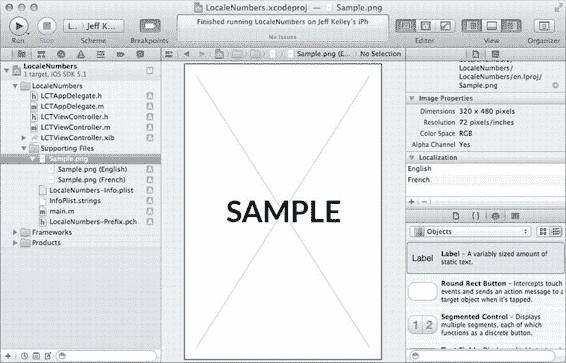

# 第 12 章：本地化与国际化

## 本地化

国际化与本地化的关键区别在于：国际化使应用更具通用性，能够支持用户手机设置的任何语言环境；而本地化则在于为用户选择的语言提供替代内容。您可以为任意数量（或多或少的）语言提供内容。任何应用资源——图片、视频、文本、音频等——都可以被本地化。然而，如果您本地化了一个资源，并不意味着需要本地化所有资源。因此，如果您拥有一个在所有语言中均保持相同的公司徽标，则无需做任何额外操作来保持其一致性。

当应用包中的任何文件被本地化时，系统会将其移动到当前所在位置的一个子文件夹中，该子文件夹以应用的开发语言命名。在本章中，我们假设开发语言为英文。要将文件标记为可本地化，请在`Xcode`的**项目导航器**中选择该文件，然后通过选择**视图** → **实用工具** → **显示文件检查器**或按下`⌘+Option+1`打开**文件检查器**。

如有需要，滚动到右侧**文件检查器**中的**本地化**分组。

默认情况下，根据您使用的应用模板，它要么为空，要么列有一种语言。图 12-5 显示了一个具有两种本地化（英文和法文）的示例图片。要将文件标记为可本地化，请点击本地化列表下方的加号（`+`）；这将自动将其移动到当前文件夹的一个子文件夹中（对于英文，该文件夹将命名为`en.lproj`）。在`Xcode`的**项目导航器**文件列表中，您不会看到此文件夹，但它确实存在，并作为包含现已本地化文件的文件夹的子文件夹被创建。

[www.it-ebooks.info](http://www.it-ebooks.info/)

