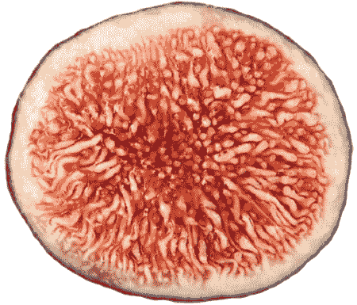

# 学习 cocos2D 2

**Steffen Itterheim**

**Andreas Löw**

**学习 cocos2D 2**

版权所有 © 2012 Steffen Itterheim 与 Andreas Löw

保留所有权利。未经版权所有者及出版商事先书面许可，本作品的任何部分均不得以任何形式或通过任何手段（电子或机械，包括影印、录制或任何信息存储检索系统）进行复制或传播。

ISBN-13（平装）：978-1-4302-4416-5
ISBN-13（电子版）：978-1-4302-4417-2

本书中可能出现商标名称、标识和图像。对于商标名称、标识或图像的每次出现，我们并未使用商标符号，而是仅以编辑性方式使用这些名称、标识和图像，以利于商标所有者，且无意侵犯商标权。

本出版物中使用的商品名称、商标、服务标记及类似术语，即使未被标识为如此，也不应被视为对其是否受专有权利保护的意见表达。

总裁与出版人：Paul Manning
首席编辑：Steve Anglin
开发编辑：Tom Welsh
技术审校：Boon Chew 与 Tony Hillerson
编委会：Steve Anglin, Mark Beckner, Ewan Buckingham, Gary Cornell, Morgan Ertel, Jonathan Gennick, Jonathan Hassell, Robert Hutchinson, Michelle Lowman, James Markham, Matthew Moodie, Jeff Olson, Jeffrey Pepper, Douglas Pundick, Ben Renow-Clarke, Dominic Shakeshaft, Gwenan Spearing, Matt Wade, Tom Welsh
协调编辑：Brigid Duffy
文字编辑：Corbin Collins
排版：SPi Global
索引编制：SPi Global
插图设计：SPi Global
封面设计：Anna Ishchenko

本书通过 Springer Science+Business Media, LLC. 在全球图书贸易中发行，地址：233 Spring Street, 6th Floor, New York, NY 10013。电话：1-800-SPRINGER，传真：(201) 348-4505，电子邮件：`orders-ny@springer-sbm.com`，或访问 `www.springeronline.com`。

如需翻译相关信息，请发送电子邮件至 `rights@apress.com`，或访问 `www.apress.com`。

Apress 与 friends of ED 的书籍可批量采购用于学术、企业或促销用途。大多数图书也提供电子书版本及许可。更多信息，请参考我们的特别批量销售——电子书许可网页：`www.apress.com/info/bulksales`。

本书中的信息按“原样”提供，不作任何保证。尽管在编写本作品时已采取一切预防措施，但作者和 Apress 均不对因本作品所含信息直接或间接导致的任何损失或损害，对任何个人或实体承担责任。

本书的源代码可供读者在 `www.apress.com` 和 `www.learn-cocos2d.com/store/book-learn-cocos2d` 获取。

献给 Gabi，独一无二的空间蚂蚁。
时而古怪，常常焦躁，始终被爱。
——Steffen

献给 Saskia 与 Renate，是你们让我得以
将时间花在我最热爱的事情上。
——Andreas

## 目录一览

关于作者
关于技术审校
致谢
前言
第 1 章：引言
第 2 章：入门
第 3 章：基础
第 4 章：你的第一个游戏
第 5 章：游戏构建模块
第 6 章：`深入了解精灵`
第 7 章：愉快地滚动
第 8 章：射击游戏

第 9 章：粒子效果

第 10 章：使用瓦片地图

第 11 章：等角瓦片地图

第 12 章：物理引擎

第 13 章：弹珠游戏

第 14 章：Game Center

第 15 章：Cocos2d 与 UIKit 视图

第 16 章：Kobold2D 简介

第 17 章：超越常规

索引

