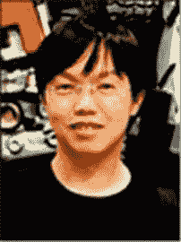

# 索引

## 关于作者

**斯特芬·伊特海姆**自 20 世纪 90 年代初起便是一位游戏开发爱好者。他在《毁灭战士》和《毁灭公爵 3D》社区的工作让他获得了第一份自由职业，担任 3D Realms 的测试员。他拥有超过十年的专业游戏开发经验，职业生涯大部分时间在 Electronic Arts Phenomic 担任游戏玩法与工具程序员。他于 2009 年首次接触`cocos2d`，当时他与人共同创立了一家名为 Fun Armada 的 iOS 游戏初创公司。他热爱教导并赋能其他游戏开发者，帮助他们更聪明地工作，而非更辛苦。有时，你会发现他白天在家附近郁郁葱葱的葡萄园中漫步，夜晚则在内华达沙漠中收集瓶盖。

**安德烈亚斯·勒夫**自 10 岁拥有第一台 Commodore C16 电脑起，便成了一名计算机狂人。他自学编写游戏，并于 1994 年用纯汇编语言为 Commodore Amiga 发布了人生第一款电脑游戏《Gamma Zone》。在获得电气工程学位后，他任职于哈曼国际，负责为汽车行业开发带语音识别的导航与信息娱乐系统。他发明了自己的编程语言和开发工具，这些工具被全球每辆配备语音识别技术的汽车所使用。

凭借 iPhone，他回归初心，开始开发一款名为《TurtleTrigger》的游戏。他意识到`cocos2d`社区对优质工具有巨大需求。凭借在游戏和工具开发方面的知识，他的产品 TexturePacker 和 PhysicsEditor 迅速成为所有`cocos2d`用户的必备开发工具。

## 关于技术审校者

**博恩·邱**是 Nanaimo Studio 的董事总经理，这是一家专注于网页和手机游戏的工作室，位于西雅图和上海。他在游戏开发和互动媒体领域拥有丰富经验，此前曾任职于威望迪环球、亚马逊、微软等公司以及多家游戏工作室和广告公司。他的热情在于打造产品并与优秀的人共事。您可通过`boon@nanaimostudio.com`联系博恩。

**托尼·希勒森**是一名移动开发者，也是 Tack Mobile 的联合创始人。他毕业于大使大学，获得管理信息系统学士学位。在日常工作中，他可能使用 Objective-C、Java、Ruby、CoffeeScript、JavaScript、HTML 或 Shell 脚本。托尼曾在 RailsConf、AnDevCon 和 360|Flex 大会上发表演讲。他是广受欢迎的 O'Reilly Android 截屏视频的创作者。

在空闲时间，托尼喜欢弹奏贝斯和 Warr 吉他，并制作电子音乐。托尼与妻子洛莉、儿子泰特斯和林肯居住在科罗拉多州丹佛市郊。

## 致谢

这是书中让我略感焦虑的部分。我不想忘记任何在这本书创作过程中发挥关键作用、提供帮助的人，但我知道无法一一提及。如果你未在此处被提及，这绝不代表我不感谢你的贡献！给我一支笔，我会在这本书你的那一本上写下你的名字，并对我最初未在此处提及你而诚挚道歉。

首先，我要感谢你，亲爱的读者。没有你，这本书就毫无意义。如果不知道你可能会阅读并享受本书，并希望能从中学习，我可能根本就不会考虑写这本书。在本书撰写过程中，我从博客读者以及其他与我相遇或通信的人那里获得了宝贵的见解和请求。谢谢你们所有人！

首先要感谢杰克·纳廷，是他最初将写一本关于`cocos2d`的书的想法植入我的脑海。我很感激他没有粉饰写书的工作量，让我对此有了充分准备。

我要感谢克莱·安德斯，他是个如此友善的人，对我章节提案的评论既宝贵又切中要害。他帮助我形成了这本书应该成为什么样子的想法，而且与他交谈总体上是件愉快的事。克莱，希望那场暴风雨没有淹到你的房子。

非常感谢协调编辑凯莉·莫里茨、科尔宾·柯林斯和布里吉德·达菲。当混乱发生时，是他们把一切恢复秩序并使之顺利进行。

我从布莱恩·麦克唐纳和克里斯·尼尔森（本书的编辑）以及博恩·邱（技术审校）那里收到了大量反馈和建议。他们促使我更上一层楼。布莱恩帮助我理解了写书的许多精妙之处，而博恩指出了许多技术上的不准确之处以及需要补充解释的地方。非常感谢你们二位。克里斯在第二版中给予了巨大帮助；他指出了许多微小但关键的改进。他将永远被称为 CCCC：代码延续字符克里斯。

非常感谢文字编辑金·温普塞特。用程序员的话来说，没有你，这本书的文字将充满语法错误和编译器警告。

我还要感谢伯尼·沃特金斯，他负责 Alpha Book 的反馈和我的合同。也感谢克里斯·吉勒博，他是一位出色的励志博主和榜样。

当然，我的朋友们和家人都在这本书的写作中出了一份力，无论是通过反馈，还是对我写作狂热的单纯忍耐。谢谢你们！

## 前言

2009 年 5 月，我初次接触。那是我人生第一次接触 Mac OS 平台，并开始学习 Xcode、Objective-C 和`cocos2d`。即使对我和同事们这样的经验开发者来说，这也是一场挣扎。就在那时，我意识到`cocos2d`很好，但缺少文档、教程和操作指南——尤其是与我当时正在学习的其他技术相比。

时间快进到 2010 年 5 月。我完成了四个`cocos2d`项目。我的 Objective-C 和`cocos2d`技能已经变得熟练。看到其他开发者仍在为同样的基本问题挣扎，并重蹈我大约一年前犯下的同样误解，我感到痛心。`cocos2d`的文档仍然严重匮乏。

我看到其他`cocos2d`开发者通过撰写教程和分享他们所知道的`cocos2d`知识，成功吸引大量读者访问他们的博客。迄今为止，大部分`cocos2d`文档都是由其他开发者以去中心化的方式积极创建的。我看到了创建一个网站来整合分散在众多网站上的所有信息的需求。

我创建了`www.learn-cocos2d.com`网站，分享我所了解的`cocos2d`和游戏开发知识，撰写教程和常见问题解答，并将对`cocos2d`感兴趣的读者引导至所有重要的信息来源。作为回报，我将销售与`cocos2d`相关的产品，希望有一天能让我接近实现财务独立的最终目标。我知道我能让这个网站成为对所有人都有利的平台。

然后，就在网站上线 24 小时内，杰克·纳廷问我是否考虑过写一本关于`cocos2d`的书。接下来的事便顺理成章，结果就是你正在读的这本书。

我把为网站设想的一切都放进了这本书里。但仅凭这些，可能最多只占本书内容的四分之一。我希望我在 2010 年全职写作这本书所花费的五个月时间，能通过提供关于`cocos2d`如何运作以及如何与之合作的空前细节而物有所值。

