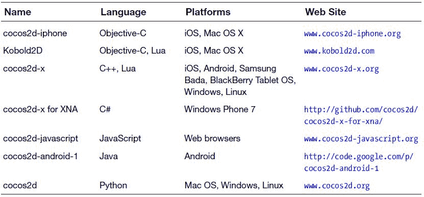

# 第 1 章：引言

你是否曾想象过自己编写一款电脑游戏并通过销售它来赚钱？借助苹果的 `iTunes App Store` 以及配套的移动设备 `iPhone`、`iPod touch` 和 `iPad`，现在做到这一点比以往任何时候都更容易。当然，这并不意味着它简单——关于游戏开发和编程，仍然有很多东西需要学习。但你正在阅读这本书，所以我相信你已经下定决心踏上这段旅程。而且你选择了最有趣的游戏引擎之一：用于 iOS 的 `cocos2d`。

使用 `cocos2d` 的开发者背景各异。有些人，比如我，已经从事专业游戏开发多年甚至数十年。另一些人则刚刚开始学习为 iOS 设备编程，或是初次涉足激动人心的游戏开发领域。无论你的背景如何，我相信你都能从这本书中获得收获。

有两件事将所有 `cocos2d` 开发者团结在一起：我们热爱游戏，我们热爱创造和编写游戏。这本书正是向此致敬，同时也没有忘记那些有助于简化开发过程的工具。最重要的是，你将在此过程中制作出有意义的游戏，并看到这些知识如何应用于实际的游戏开发。

你看，我会对那些整本书都在教我如何用某个特定的游戏编程 API（应用程序编程接口）来制作又一个无聊的“小行星”克隆版的书籍感到厌倦。我认为更重要的是游戏编程的概念和工具——即使 API 或你个人的编程偏好发生变化，这些也是你可以随身带走的。在 20 多年的时间里，我积累了数百本编程和游戏开发的书籍。至今我仍最珍视那些超越技术本身、教会我为什么某些东西会以特定方式设计和编程的书籍。这本书不仅会关注能工作的游戏代码，还会解释它为什么能工作以及需要考虑哪些权衡取舍。

我希望你能学会编写有意义的游戏——那些在 App Store 上受欢迎并且对玩家有吸引力的游戏。我将在这本书中带你了解这些游戏背后的想法和技术概念，当然，还有 `cocos2d` 和 `Objective-C` 是如何让这些游戏运转起来的。你会发现随书附带的源代码中包含了大量注释，这应该能帮助你导航并理解代码的每一个角落和细节。

学习他人的源代码并借助指南专注于重点内容，是我在学习新东西时最有效的方法——而且我认为这对你也会非常有效。因为你可以基于书中的源代码来开发自己的游戏，我期待在不久的将来能玩到你制作的游戏！别忘了告诉我你的作品！

你可以在 `Cocos2D Central`（`www.cocos2d-central.com`）上分享你的项目并提出问题，也可以通过 `steffen@learn-cocos2d.com` 联系我。你一定还要访问本书的配套网站 `www.learn-cocos2d.com`。从本书第一版开始，我就通过 `Kobold2D` 项目来改进 `cocos2d`，你在阅读本书时也可以使用它。你可以访问 `www.kobold2d.com` 来了解更多关于 `Kobold2D` 的信息。

## 第三版的新内容有哪些？

第三版是一次彻底的更新，旨在让本书跟上最新的发展，包括但不限于 iOS 6 和 Xcode 4.4。

首先，`cocos2d 2.0` 是全新发布的。所有源代码和描述都已适配最新的 `cocos2d` 和 `OpenGL ES 2.0` 版本。虽然你无法在第一代和第二代设备上部署 `cocos2d 2.0` 应用，但在 2012 年 3 月，这些设备仅占迄今为止所有已售出 iOS 设备的约 16%。毫无疑问，当你阅读这本书时，这个数字将下降到 10% 左右，并且随着新型号设备的持续热销，这一比例还会不断下降。

我还收到了许多读者的大量问题，他们都想知道同一件事：这本书是否也能与 `Kobold2D` 一起使用？以前我不得不回答“可以，但有少数地方略有不同。” 第三版将我的回答改为响亮的“当然可以，完全没问题！” 每当 `Kobold2D` 有不同之处时，我都会提及。我还特别说明了在使用 `Kobold2D` 时哪些步骤不再需要执行，因为这就是 `Kobold2D` 的全部意义所在：让 `cocos2d` 更容易使用。

如果你错过了第二版，这里快速回顾一下第二版中的新内容以及为本版所做的进一步调整。首先，Andreas Löw 作为合著者加入了本书，他提供了宝贵的帮助，通过对他开发的 `Texture Packer` 和 `Physics Editor` 工具的说明来改进本书。我们一起重做了大量的图形，并通过添加代码和新功能显著改进了几个章节。还增加了两章：一章是关于将 `cocos2d` 集成到 `UIKit` 应用中，另一章是对（当时新发布的）`Kobold2D` 的介绍。

## 关于 ARC

接下来是 ARC。什么？ARC？是的，自动引用计数（ARC）是苹果公司用来简化 `Objective-C` 应用内存管理的新技术，并已得到验证。本质上，它废除了手动引用计数，这意味着你不再需要操心自己或其它代码保留了某个对象多少次，从而必须精确地释放相同次数。自动释放对象则使问题更加复杂。如果你没有为每个对象每次都 100% 正确匹配 `retain`、`release` 和 `autorelease`，那么要么是内存泄漏，要么是应用容易崩溃。

同样值得了解的是，ARC 并非垃圾回收。它完全以确定性方式工作，这意味着如果你每次都以完全相同的过程运行同一个程序，它的行为将完全一致。ARC 也不是一个运行时组件——它是一个编译器，在你需要时会自动为你插入 `retain`、`release` 和 `autorelease` 语句。ARC 遵循一套简单的规则，而这些规则正是每个 `Objective-C` 程序员之前为了避免内存泄漏和崩溃所必须遵循的。你可以想象，如果由人来完成这项工作，会有更多的错误悄然而入，而 ARC 不仅能毫无差错地完成这项工作，还会在此过程中优化你的代码。例如，在手动引用计数中，你可以多次 `retain` 对象。然而，ARC 能够识别出何时额外的 retain 是不必要的，并将其省略。

好的，作为一名高级文档工程师和翻译员，我将严格遵循您提供的格式和注意事项，对给定的英文文本进行翻译。

现在，编译器已经接管了内存中保留和释放对象的繁琐工作，本书中的所有源代码都已转换为使用 `ARC`。这意味着需要编写的代码行数更少，潜在的致命药物……呃，错误也更少。

Objective-C 程序员对 `ARC` 最大的两个担忧是失去控制和学习新的编程范式。这两者都是反对使用 `ARC` 的糟糕理由。我打个比方：将 `ARC` 想象成汽车中的自动变速箱，而手动引用则像手动换挡。如果你离开了离合器和变速杆的世界，你真的放弃控制了吗？是的，但这并非你真正需要的控制。你需要学习新东西吗？不需要，你只需要忘记一些东西，而且实际上你需要做的事情更少了。

使用手动变速箱，即使开了多年车，你也可能轻易挂错挡，可能损坏发动机。这就好比过度释放或过度保留一个对象。你也可能时不时地用离合器熄火。这就好比由于悬空（过度释放）指针而导致应用崩溃。而使用自动变速箱，发动机总能在最佳速率下换挡，通常能将油耗降低到与手动挡汽车（和普通驾驶员）相当的水平。浪费汽油就好比内存泄漏。

总而言之：`ARC` 并没有剥夺你的控制权。你仍然可以控制对你的应用至关重要的一切。不存在需要比 `ARC` 提供的内存管理控制更多的代码。失去控制的问题纯粹是心理上的，并且可能基于对 `ARC` 工作方式的误解。这就引出了学习方面的问题：是的，有一些关于 `ARC` 的事情你可以并且应该学习。但这与程序员每天学习的东西相比微不足道，而且如果你刚接触 Objective-C，这比学会（更不用说掌握）手动引用计数要容易得多。你只需要阅读苹果相对简短的 `Transitioning to ARC Release Notes summary`: `http://developer.apple.com/library/ios/#releasenotes/ObjectiveC/RN-TransitioningToARC/Introduction/Introduction.html`。你可能还想阅读我的博客文章，其中涵盖了你需要了解的关于自动引用计数的所有知识：`www.learn-cocos2d.com/2011/11/everything-know-about-arc`。

## 为什么要在 iOS 上使用 cocos2d？

当游戏开发者寻找一款游戏引擎时，他们首先会评估自己的选择。我认为 `cocos2d` 对很多开发者来说都是一个绝佳的选择，原因有很多。

### 它是免费的

首先，它是免费的。使用它不需要花你一分钱。你可以用它创建免费和商用的 iPhone、iPod 以及 iPad 应用。你也可以用它创建 Mac OS X 应用。你无需支付任何版税。说真的，没有任何附加条件。

### 它是开源的

使用 `cocos2d` 的另一个好理由是它是开源的。这意味着没有黑盒阻止你从游戏引擎代码中学习或在必要时对其进行修改。这使得 `cocos2d` 既可扩展又灵活。

### 它用的是 Objective-C，懂了吗？

`Cocos2d` 是用 Objective-C 编写的，这是苹果用于编写 iOS 应用的原生编程语言。它与 iOS SDK 使用的语言相同，这使得理解苹果文档和实现 iOS SDK 功能变得容易。

许多其他有用的 API，例如 `Facebook Connect` 和 `OpenFeint`，也是用 Objective-C 编写的，这也使得集成这些 API 变得容易。

**注意：** 我建议学习 Objective-C，即使你更喜欢其他语言。我有很强的 C++ 和 C# 背景，Objective-C 的语法乍一看非常奇怪。对于学习一种据称已经过时且老旧的编程语言的前景，我并不感到高兴。毫不奇怪，我挣扎了一段时间才掌握一种要求我放弃旧习惯和期望的编程语言的编写诀窍。

不过，不要让用 Objective-C 编程的想法分散你的注意力。它确实需要一些时间来适应，但很快就会得到回报，仅凭其可用的海量文档就足够了。我保证你不会后悔！

### 它是 2D 的

当然，`cocos2d` 这个名称中包含 2D 是有原因的。它专注于帮助你创建 2D 游戏。这是目前少数其他 iOS 游戏引擎提供的一项专业化功能。

它并不妨碍你加载和显示 3D 对象。事实上，一个恰如其名的附加产品 `cocos3d` 已经作为一个开源项目被创建出来，旨在为 `cocos2d` 添加 3D 渲染支持。不幸的是，`cocos3d` 目前与 `cocos2d 2.0` 不兼容，因为 `cocos3d` 仍在使用 `OpenGL ES 1.1`。

我不得不说，iOS 设备是制作出色 2D 游戏的理想平台。即使在今天，iTunes App Store 上发布的大部分新游戏仍然是纯 2D 游戏，而且从玩法上来说，很多 3D 游戏本质上也是 2D 游戏。2D 游戏通常更容易开发，并且 2D 游戏中的算法更容易理解和实现，使其成为初学者的理想选择。在几乎所有情况下，2D 游戏对硬件的要求都更低，从而允许你创建更生动、更精细的图形。

### 它有物理引擎

你还可以从两个已经集成到 `cocos2d` 中的物理引擎中进行选择。一个是 `Chipmunk`，另一个是 `Box2D`。这两个物理引擎表面上的区别仅在于它们编写的语言：`Chipmunk` 是用 C 语言编写的，而 `Box2D` 是用 C++ 编写的。这两个产品的功能集几乎相同。如果你正在寻找差异，你可能会找到一些，但这需要你对物理引擎的工作原理有很好的理解，才能基于这些差异做出选择。一般来说，你应该简单地选择你认为更容易理解且文档更完善的物理引擎。对大多数开发者而言，这往往是 `Box2D`。另一方面，`Chipmunk` 有一个商业 Pro 版本，除其他功能外，它还为其 API 提供了原生的 Objective-C 接口。

### 它不那么技术化

游戏开发者喜欢 `cocos2d` 的最大一点是它如何隐藏底层的 `OpenGL ES` 代码。大多数图形都是使用从图像文件创建的简单精灵类来绘制的。精灵是一种纹理，只需更改 `CCSprite` 类相应的 Objective-C 属性，即可对其应用缩放、旋转和颜色。你不必关心如何使用 `OpenGL ES` 代码来实现这一点，这是一件好事。

同时，`cocos2d` 为你提供了灵活性，允许你随时为任何需要它的游戏对象添加自己的 `OpenGL ES` 代码，包括顶点和片段着色器。着色器是一种对图形硬件进行编程的方式，超出了本书的讨论范围。如果你正在考虑添加一些 Cocoa Touch 用户界面元素，你会很高兴地知道这些元素也可以混合进来。

而且 `cocos2d` 不仅让你免受 `OpenGL ES` 复杂性的困扰；它还提供了对常见任务的高级抽象，其中一些任务原本需要广泛的 iOS SDK 知识。但如果你确实需要更底层的访问或想利用 iOS SDK 的功能，`cocos2d` 也不会限制你。

### 它仍然是编程

总的来说，你可以说 `cocos2d` 让 iOS 游戏编程变得更简单，同时仍然首先需要真正卓越的编程技能。其他 iOS 游戏引擎，如 `Unity`、`Unreal`、`iTorque 2D` 和 `Shiva`，则专注于提供工具集和工作流程，以减少所需的编程知识。作为回报，你放弃了一些技术自由——以及金钱。使用 `cocos2d`，你需要多付出一点努力，但你可以尽可能接近游戏编程的核心，而无需真正处理核心。

### 它有一个很棒的社区

## cocos2d 社区

`cocos2d` 社区里总有热心人能够快速回答问题，开发者们也普遍乐于分享知识信息。你可以通过官方论坛（`www.cocos2d-iphone.org/forum`）或我个人的论坛 `Cocos2D Central`（`http://cocos2d-central.com`）与社区取得联系。`Cocos2D Central` 是直接找到我的最佳途径。

新的教程和示例源代码几乎每天都在发布，而且大部分是免费的。互联网上散落着大量其他资源，供你学习和汲取灵感。

**提示** 要随时了解 `cocos2d` 社区的最新动态，我建议在 Twitter 上关注 `cocos2d`：`http://twitter.com/cocos2d`。

既然你在关注，不妨也关注一下我和 `Kobold2D`：`http://twitter.com/gaminghorror`

`http://twitter.com/kobold2d`

接下来，在 Twitter 搜索框中输入 `cocos2d`，然后点击“保存此搜索”链接。这样，你就可以通过一次点击定期查看关于 `cocos2d` 的新帖。很多时候，你都会发现一些本来可能会错过的有用的 `cocos2d` 相关信息。而且，你一定能结识也在使用 `cocos2d` 的同行开发者。

一旦你的游戏完成并发布到 App Store，你甚至可以在 `cocos2d` 网站上推广它。至少，你会引起其他开发者的注意，并有可能获得宝贵的反馈。

## 为什么用 `Kobold2D` 而不用 `cocos2d-iphone`？

首先，如果你从一开始就使用 `Kobold2D`，入手 `cocos2d-iphone` 开发会容易得多。你只需要运行 `Kobold2D` 安装程序就能获得所需的一切：源代码、附加的实用源代码库、模板项目、文档、工具等等。你可以立即开始一个新项目。

你将获得 15 个模板项目，而不仅仅是 3 个，并且所有项目都启用了 ARC。你会发现大多数模板项目都是你将在本书中创建项目的变体，所以你会感到非常熟悉。

最常用的源代码库也已集成并可直接使用，包括 `cocos2d-iphone-extensions` 项目、`Lua` 脚本语言、`ObjectAL`、`iSimulate`、`SneakyInput` 等等。

`Kobold2D` 拥有一些 `cocos2d-iphone` 不具备的额外便利功能。它包含用于 Game Center、广告横幅、手势识别器、像素完美碰撞检测的辅助代码，以及简化的用户输入处理。`KKInput` 为你提供了一个易于使用、平台无关的包装器，用于访问手势识别器、陀螺仪、键盘和鼠标。

此外，大多数 `Kobold2D` 项目同时包含 iOS 和 Mac OS X 的目标。因此，如果你计划将游戏发布到两个 App Store，`Kobold2D` 能让这种双平台开发更加顺畅，并在底层提供其他增强功能，例如针对每个平台优化的构建设置。

还有 `KoboldScript`。它是一个现代、强大而又简单的 Lua 接口，由 `Kobold2D` 支持，用于开发 iOS 和 Mac OS X 应用程序。在撰写本文时，它仍在开发中，请访问 `www.koboldscript.com` 获取最新消息和更新。

最后，我自己每天都在工作中使用 `Kobold2D`。我持续对其进行调整和改进，并确保它与最新发展保持同步，无论是新的 iOS 设备、新的 Xcode 版本，还是仅仅是 `cocos2d` 及 `Kobold2D` 提供的其他库的新版本。你将及时获得更新，并且只需一次点击就能安全地将你的项目升级到更新的 `Kobold2D` 版本。

## 其他 `cocos2d` 游戏引擎

你可能已经注意到，`cocos2d` 有适用于多种平台的版本，包括 Windows、JavaScript 和 Android。甚至还有一个名为 `cocos2d-x` 的 C++ 版本，它支持多种移动平台，包括 iOS 和 Android。

这些 `cocos2d` 分支共享相同的名称和设计理念，但由不同的作者使用不同的语言编写，并且通常与 iOS 版的 `cocos2d` 有很大不同。例如，Android 版的 `cocos2d` 是用 Java 编写的，这是 Android 设备开发的原生语言。

如果你有兴趣将游戏移植到其他平台，你应该知道各种 `cocos2d` 游戏引擎之间存在很大差异。例如，将你的 `cocos2d-iphone` 游戏移植到 Android 并非易事。首先是语言障碍——你所有的 Objective-C 代码都必须用 Java 重写。完成后，你还需要进行大量修改，以适应 `cocos2d` API 的众多变化，或者处理分支或目标平台中可能不支持的功能。最后，每个分支都可能有自己的 bug，每个平台也有自己的技术限制和挑战。

总的来说，将用 `cocos2d` 编写的 iOS 游戏移植到同样拥有 `cocos2d` 游戏引擎的其他平台，几乎等同于使用其他游戏引擎为目标平台重写游戏的工作量。这意味着没有一键切换的神奇按钮。跨平台的各种 `cocos2d` 引擎的相似性仅在于名称和理念。如果跨平台开发是你的目标，你应该看看 `cocos2d-x`，它拥有 `cocos2d-iphone` 的大部分功能，得到了中国联通的经济支持，并且以惊人的速度持续更新改进。

无论如何，我认为你还是应该了解一下最流行的 `cocos2d` 游戏引擎。表 1-1 列出了那些经常更新且足够稳定可供生产使用的 `cocos2d` 游戏引擎。我没有在这个列表中包含那些严重过时、数月甚至数年未更新的 `cocos2d` 分支。其中包括已废弃的 Windows 版 `cocos2d` 项目（其唯一版本发布于 2010 年 5 月）以及早已过时的 `ShinyCocos`（一个基于 `cocos2d-iphone` v0.8.2 的 Ruby 包装器）。

表 1-1. 最受欢迎的 `cocos2d` 游戏引擎分支

## 这本书适合你

我想象你拿起这本书是因为它的标题引起了你的兴趣。我猜你想为 iPhone、iPod touch 和 iPad 制作 2D 游戏，并且你选择的游戏引擎是 iOS 版的 `cocos2d`。或者，你可能不太在意游戏引擎，但总体上想为 iOS 设备制作 2D 游戏。也许你正在寻找关于 `cocos2d` 的深入讨论，因为你已经使用了一段时间。无论你选择这本书的理由是什么，我相信你都会从中受益匪浅。

## 先决条件

与每一本编程书一样，有些先决条件是最好具备的，有些则几乎是必须的。

### 编程经验

这本书唯一必须要求的是具备一定程度的编程经验，所以我们先把这个说清楚。你应该理解循环、函数、类等编程概念。如果你以前编写过计算机程序，最好是使用面向对象编程语言，那么你应该没问题。

还在听我说吗？很好。

### Objective-C

那么，你确实有编程经验，但你可能从未用那种被称为 `Objective-C` 的晦涩语言编写过任何东西。

你不需要掌握 `Objective-C` 才能阅读本书，但了解该语言的基础知识会很有帮助。如果你已经熟悉至少一门其他面向对象编程语言，比如 `C++`、`C#` 或 `Java`，你可能能够边学边用。但老实说，即便我有大约 15 年使用 `C++`、`C#` 和各种脚本语言的编程经验，我也发现自己很难做到这一点。总有一些你无法立即理解的细枝末节令人困扰，它们往往会分散你的注意力。在这种情况下，手头有一本参考资料，当你想了解 `Objective-C` 的某个知识点时随时查阅，会非常方便。

`Objective-C` 的方括号可能看起来很吓人，你也可能听说过关于它的内存管理以及在 iOS 设备上没有垃圾回收的恐怖故事。别担心。

首先，`Objective-C` 只是换了一套不同的外壳。它看起来很陌生，但底层的编程概念，如循环、类、继承和函数调用，仍然与其他编程语言的工作方式相同。只是术语可能有所不同；例如，`Objective-C` 开发者所说的*发送消息*本质上与*调用方法*是一样的。至于内存管理，有了 `ARC`，你实际上不再需要担心内存管理问题了。书中解释了一些极少数例外情况，这些情况大多只是通过添加一个听起来很神奇的关键词来告诉编译器你所做的操作是故意的，而不是错误。

我曾从一本宝贵的 `Objective-C` 书籍中获益，我全心全意地推荐它作为配套书籍，以防你想了解更多关于 `Objective-C` 和 `Xcode` 的知识：*《在 Mac 上学习 Objective-C》*，作者是 Mark Dalrymple 和 Scott Knaster，由 Apress 出版。

苹果公司的“Objective-C 编程语言简介”也是一份有价值的在线参考资料，可在此处获取：`http://developer.apple.com/mac/library/DOCUMENTATION/Cocoa/Conceptual/ObjectiveC/Introduction/introObjectiveC.html`。

## 你将学到什么

我将分享大量我的游戏开发经验，向你展示交互式游戏是如何制作的。我相信学习编程根本不是要死记硬背 `API` 方法，但过去二十年我读过的许多游戏开发书籍都遵循那种“参考手册”的方式。但这正是 `API` 文档的用途。大约 20 年前，当我刚开始编程时，我认为仅仅通过阅读一大堆厚厚的编译器参考手册和指南，我永远学不会编程。那时，编译器手册仍然是印刷版的，又厚又重，而且显然没有完全可搜索的在线版本。万维网还处于起步阶段。所有这些信息堆在我桌上大约有 15 英寸高，试图学习其中任何一点都显得非常艰巨，更不用说全部学懂了。

如今，我无法凭记忆回想出大多数方法和 API，并且我总是忘记那些我曾经知道的东西。我一遍又一遍地查找它们。经过 20 年的编程，我确实知道什么才是真正重要的：概念、什么行得通什么行不通、需要学习时去哪里查找信息，以及为什么学习和遵循最佳实践很重要。优秀的编程概念和最佳实践能够长久适用，并且有助于用任何语言进行编程。学习概念的最佳方法是理解设计、构建和编写源代码时做出选择背后的原理。这正是我最关注的。

### iOS 游戏开发初学者将学到什么

我还将带你轻松了解 `cocos2d` 和 `Kobold2D` 最重要的方面。我重点介绍那些你应该能凭记忆回想起来的类、方法和概念，仅仅因为它们对于使用 `cocos2d` 编程是如此基础。

你还将了解支持 `cocos2d` 或被 `cocos2d` 支持的基本工具。没有这些工具，你只能算半个 `cocos2d` 程序员。你将使用诸如 `TexturePacker` 和 `ParticleDesigner` 之类的工具来创建开发起来越来越复杂且具有挑战性的游戏。由于本书篇幅有限，这些游戏并非完整精良的成品游戏，我也无法详细讨论每一行代码。相反，我会在代码中加入许多有用的注释，以便于你理解和跟进。

我把改进这些游戏骨架项目的任务留给你，我很期待看到你的成果。我认为，给你多个起点来在此基础上进行创作，比整本书都在带你一步步玩典型的 `Asteroids` 游戏效果要好。

我根据 `App Store` 上的受欢迎程度以及与游戏开发者的相关性为本书选择了这些游戏项目，开发者们经常询问如何解决这些游戏所呈现的特定问题。例如，画线游戏类型深受 `cocos2d` 游戏开发者的喜爱，然而画线游戏要求你克服看似简单实则复杂的挑战。

我还看过不少其他开发者的 `cocos2d` 代码，并关注了关于代码设计、结构和风格的讨论。我的代码示例基于一个依赖组合而非继承的框架，并解释了为什么这样更可取。另一个与代码设计相关的常见问题是不同对象之间应该如何相互通信。每种代码设计和结构方法都有有趣的利弊，我想传达这些概念，因为它们能帮助你编写更稳定、错误更少、性能更好的代码。

### iOS 应用开发者将学到什么

那么，你是一名 iOS 应用开发者，并且之前用过 `iOS SDK`？完美。那么你最感兴趣的可能是在没有 `Interface Builder` 的世界里如何制作游戏。实际上，你将使用其他工具。它们可能不像苹果的工具那样光鲜亮丽，但同样有用。

编程方面的考量也会发生变化。在游戏编程中，你通常不会发送和接收大量事件，而是让更多的对象来决定如何处理一个事件。出于性能考虑以及为了减少用户输入延迟，游戏引擎系统通常彼此之间连接得更紧密。大量工作是在循环和更新方法中完成的，这些方法在每一帧或在特定时间点被调用。界面驱动的应用程序大部分时间都在等待用户输入，而游戏则不断地在幕后推送大量数据和像素，即使玩家什么也没做。因此，有更多的事情在发生，并且出于性能方面的考虑，游戏代码往往更加精简高效。

### Cocos2d 开发者将学到什么

你已经熟悉 `cocos2d` 了？你可能想知道是否还能从本书中学到新东西。我说是可以的。也许你想跳过前几章，但你肯定会被书中提供的游戏示例源代码所吸引。你将学习我是如何组织代码的，以及其背后的原理。阅读关于各种游戏以及我如何实现它们的介绍，你可能会找到灵感。你还可以从大量技巧中受益，并了解 `Kobold2D` 如何帮助你更快地开发游戏。

最重要的是，这本书不是由某个你从未听说过、今后也不会再听到的极客写的，作者也没有提供电子邮件地址或网站供你提出后续问题。相反，这本书是由一个你可能没听说过但肯定会在你身边的极客写的。我积极与 `cocos2d` 社区互动，在本书的配套博客 `www.learn-cocos2d.com` 上，我将继续改进这本书，并改进我们使用 `Kobold2D` 和 `KoboldScript` 编写 App Store 游戏的方式。

## 本书内容

## 书籍概览

以下是本书各章节的简要介绍。第二版新增了两个完整章节：第 15 章讨论如何将`UIKit`视图与`cocos2d`集成，第 16 章介绍了我个人开发的`Kobold2D`——一个增加了额外便利功能的`cocos2d`开发环境。第三版将所有章节更新至`Cocos2D v2.0`，并确保与`Kobold2D v2.0`兼容，所有源代码均采用 ARC。

**第 2 章，“入门”**  
本章介绍如何搭建`cocos2d`开发环境、安装项目模板以及创建第一个“Hello World”项目。你将学习到`cocos2d`的基础知识，例如场景和节点。

**第 3 章，“核心要素”**  
本章将讲解你最常用到的核心`cocos2d`类，例如精灵、过渡和动作。当然，你还会学会如何使用它们。

**第 4 章，“你的第一款游戏”**  
敌人从屏幕上方落下，你需要通过倾斜设备来躲避它们。这将是我们第一款使用加速计控制的简单游戏。

**第 5 章，“游戏构建模块”**  
现在，请为制作一个更大型的游戏做好准备，这需要更好的代码结构。你将学习场景和节点如何分层，以及游戏对象交换信息的各种方式。

**第 6 章，“精灵深入解析”**  
你将了解什么是纹理图集，为何要在下一个游戏中用到它，以及如何使用`TexturePacker`工具创建纹理图集。

**第 7 章，“滚动与操控”**  
准备好了纹理图集，你将学习如何实现一款由触摸输入控制的视差滚动射击游戏。

**第 8 章，“射击类游戏”**  
没有敌人，我们的射击游戏就没什么可打的了，对吧？我将向你展示如何添加游戏逻辑代码，来实现释放、移动、击中以及动画化敌人群体。

**第 9 章，“粒子效果”**  
通过使用`ParticleDesigner`工具，你将为本作的横向卷轴游戏添加一些粒子效果。

**第 10 章，“使用瓦片地图”**  
你将不断向上跳跃，把从横向卷轴游戏中学到的知识应用到竖屏模式中，从而创建另一款流行的 iOS 游戏类型。

**第 11 章，“等距瓦片地图”**  
由于`cocos2d`支持 TMX 文件格式，你将了解如何使用`Tiled`编辑器创建基于瓦片的游戏。

**第 12 章，“物理引擎”**  
本章是使用`Chipmunk`和`Box2D`物理引擎的入门指南——以及你能用它们实现的那些奇妙功能。

**第 13 章，“弹球游戏”**  
在本章中，你将使用`Box2D`物理引擎创建一个基本的弹球台。碰撞形状将借助`PhysicsEditor`工具来创建。

**第 14 章，“游戏中心”**  
学习如何将第 11 章的等距瓦片地图游戏转变为一款双人多人游戏，并加入排行榜和成就系统。

**第 15 章，“Cocos2d 与 UIKit 视图”**  
本章深入讲解如何将`cocos2d`与常规的 Cocoa Touch（特别是`UIKit`视图）混合使用。你将学习如何向`cocos2d`游戏中添加`UIKit`视图，反之亦然：如何将`cocos2d`集成到现有的`UIKit`应用中。

**第 16 章，“Kobold2D 简介”**  
`Kobold2D`是我对`cocos2d`游戏引擎的改进，旨在使其更易于使用，同时增加了如 ARC 兼容性和 Lua 脚本等功能。在本章中，你将学习如何设置新的`Kobold2D`项目，以及`Kobold2D`的特殊之处。

**第 17 章，“结论”**  
这里是本书的终点，也是你旅程的延续。你将获得大量关于未来学习方向的灵感和思考素材。

## 如何获取本书源代码

本书第一版发布后，最常见的问题之一是如何获取本书的源代码。我添加了这个简短的部分来回答这个问题。

你可以在 Apress 网站的书籍页面（`www.apress.com`）上获取本书的源代码。该源代码可在“源代码/下载”选项卡中找到。

或者，你也可以从 Learn Cocos2D 网站的下载部分获取源代码：`www.learn-cocos2d.com/store/book-learn-cocos2d`。

当然，如果你愿意，也可以直接从书中输入代码。但拥有现成的代码可能会很方便，以防你需要将自己输入的代码与预期的代码进行对比。我还会持续更新 Learn Cocos2D 上的可下载源代码，以修复与新版 Xcode 或 iOS 版本相关的问题。

最重要的是，源代码下载包中包含了本书源代码所使用的确切版本的`cocos2d`和`Kobold2D`。由于这两个项目都在不断改进，因此，从网站下载的最新版本可能无法与本书的描述和源代码 100%兼容。因此，我建议你在阅读本书时，安装并使用源代码包中附带的版本。

## 问题与反馈

我衷心地希望，在引导你入门`cocos2d`和 iOS 游戏开发的同时，也能用高级游戏编程概念对你提出挑战，找到两者之间的恰当平衡。

如果我在任何时刻未能做到这一点，让你感到困惑，请随时在 Cocos2D Central（`www.cocos2d-central.com`）上提出你的问题。我也会继续在 Learn Cocos2D 的配套网站（`www.learn-cocos2d.com`）上，频繁地发布关于`cocos2d`新闻和开发的帖子。你的反馈总是受欢迎的！

