# 第 2 章：入门

我将尽快让你掌握开发`cocos2d`游戏的要点。在本章结束时，你将能够基于提供的 Xcode 项目模板创建新的`cocos2d`项目。我还会介绍在游戏开发过程中需要牢记的一些重要知识点。

并且，由于自动引用计数（ARC）一直是困扰很多人的问题，我会解释如何在`cocos2d`项目中启用它。在本章末尾，你将让一个基于某个`cocos2d`项目模板创建的第一个`cocos2d`项目成功运行起来。

## 入门所需准备

在本节中，我将快速介绍开始游戏开发所需的条件和必要步骤。关于注册成为 iOS 开发者以及创建必要的配置文件，Apple 已经提供了非常优秀的文档说明，因此我在这里就不再赘述细节了。

### 系统要求

以下是开发 iOS 应用程序的最低硬件和软件要求：

*   基于 Intel 处理器的 Mac 电脑
*   Mac OS X 10.6（Snow Leopard）或更新版本；对于 iOS 5.1 特性，需要 Mac OS X 10.7（Lion）或更新版本。
*   任意一款 iOS 设备

对于开发来说，任何基于 Intel 处理器的 Mac 电脑都足够了。即使是 Mac mini 和 MacBook Air，也完全能够胜任 iOS 应用和游戏的开发工作。安装至少 2GB 的内存会让你的电脑运行更流畅，尤其因为游戏开发工具通常比大多数其他软件需要更多的内存。你将处理大量的图像、音频文件和程序代码，并且很可能同时运行所有这些工具。

请注意，Apple 通常只支持当前和上一版本的 Mac OS X 进行 iOS 和 Mac OS X 开发。目前这些版本是 Mac OS X 10.7 Lion 和 Mac OS X 10.8 Mountain Lion，虽然在 Mac OS X 10.6 Snow Leopard 上进行开发仍然是一个选项（但无法使用最新特性）。请准备好频繁（通常每 12 到 24 个月一次）将你的 Mac 更新到更新的 Mac OS X 版本。请注意，如果由于某些原因你不希望或无法更新你的 Mac 操作系统，你始终可以选择将 Mac OS X 单独安装到外部硬盘上。


如果你使用的是较老的 Mac 电脑，请查阅 Mac OS X 技术规格网站（`www.apple.com/macosx/specs.html`），以了解你的 Mac 是否满足系统要求，以及如何购买并升级到最新的 Mac OS X 版本。

## 注册成为 iOS 开发者

如果尚未注册，你可能需要考虑向苹果注册成为 iOS 开发者。加入 iOS 开发者计划的费用为每年 `$99`。如果你计划将 Mac OS X 应用提交到 Mac App Store，还需要额外支付每年 `$99` 的费用注册为 Mac OS X 开发者。

你可以通过 `http://developer.apple.com/programs/ios` 注册成为 iOS 开发者。

若要注册成为 Mac OS X 开发者，请访问 `http://developer.apple.com/programs/mac`。

严格来说，你不需要立即注册成为开发者。你也可以免费下载 Xcode，并使用 iOS 模拟器迈出第一步。

但作为注册开发者，你将获得额外的好处。例如，你可以访问 iOS 开发者门户，在那里设置你的开发设备和配置文件，以便将应用部署到一台或多台 iOS 设备上。你还可以访问 iTunes Connect，管理合同、管理并提交应用，以及查看财务报告。

此外，你还将获得苹果软件的 Beta 版本（有时也称为预览版本）。不过，你通常应避免使用苹果的 Beta 版软件。我知道能使用它很酷，而且作为独家俱乐部的一员使用最新软件也很有诱惑力。但请相信我：你很容易遇到没人能帮忙解决的兼容性问题，因为苹果的 Beta 版软件不能公开讨论。我严格避免使用苹果的 Beta 版，因为即使是微小的不兼容也可能严重拖累生产力。

**提示** 如果你确实想试用苹果的 Beta 版软件，请务必单独安装，以便随时切换回官方版本。如果你计划安装 Mac OS X 的 Beta 版本，这一点尤为重要，因为你所用的 `cocos2d` 或其他工具和库很可能与 Beta 版操作系统存在严重的兼容性问题。不要让 Beta 版操作系统永久替换你当前的操作系统，否则你将独自面对可能遇到的任何问题，陷入困境。请将 Mac OS 的 Beta 版本安装到单独的（外部）硬盘上，然后使用“系统偏好设置”中的“启动磁盘”工具在启动磁盘之间切换。

## 证书和配置文件

最终，你会希望将正在构建的游戏部署到你的 iOS 设备上。为此，你必须创建一个 iOS 开发证书，注册你的 iOS 设备，并为其启用开发功能。你可以通过 Xcode 的 Organizer 完成这一设置，在那里你可以下载并安装开发和分发配置文件。

iOS 配置门户对这些步骤有详细的说明。苹果在配置门户每个部分的“如何操作”标签页中对这些步骤做了出色的记录。已注册的 iOS 开发者可以访问 iOS 配置门户：`http://developer.apple.com/ios/manage/overview/index.action`。

## 下载并安装 Xcode 和 iOS SDK

你可以从 Xcode 网站（`https://developer.apple.com/xcode`）下载包含 iOS SDK 的最新版 Xcode。这个 1.5GB 的下载文件可能需要一些时间才能完成下载和安装，所以你可能需要立即开始下载。

安装好 Xcode 后，你就具备了开发 iOS 应用所需的一切。如果你以前从未使用过 Xcode，我建议你通过阅读《Xcode 4 用户指南》（`https://developer.apple.com/library/ios/documentation/ToolsLanguages/Conceptual/Xcode4UserGuide/index.html`）来熟悉它。

具体来说，你应该了解如图 2-1 所示的 Xcode 窗口的四个主要区域的名称：导航区（左侧）、编辑器区（中央）、工具区（右侧）和调试区（底部）。除了编辑器区，你可以通过 Xcode 的“视图”菜单来显示或隐藏这些区域。

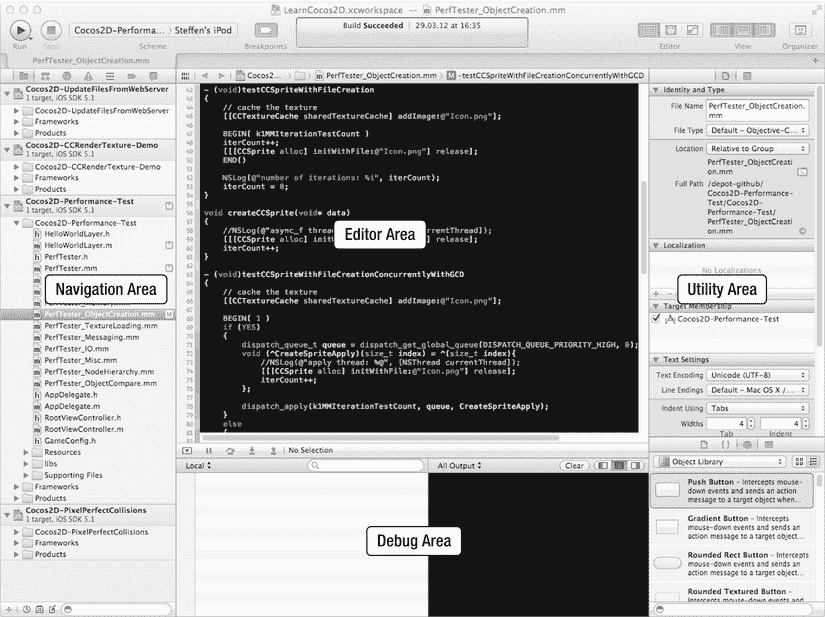

图 2-1 . Xcode 4 窗口及其四个主要区域：导航区、编辑器区、工具区和调试区

## 下载 cocos2d 或 Kobold2D

下一步是下载 `cocos2d-iphone` 或 `Kobold2D`。如果你下载了本书的源代码（请参见第 1 章），你会找到本书源代码所使用的精确 `cocos2d` 和 `Kobold2D` 版本。从网上下载的最新版本可能与本书并非 100% 兼容，因为它们会不断改进。除非你不介意偶尔偏离本书的源代码，否则你应该坚持使用本书提供的 `cocos2d` 和 `Kobold2D` 版本。

你可以从学习 Cocos2D 图书商店页面的“下载”部分下载本书的源代码，包括相应的 `cocos2d` 和 `Kobold2D` 版本：`www.learn-cocos2d.com/store/book-learn-cocos2d`。

从 `www.cocos2d-iphone.org/download` 下载最新的 `cocos2d` 版本。最新的 `Kobold2D` 安装包可从 `www.kobold2d.com/display/KKSITE/Kobold2D+Download` 获取。

## 安装 Kobold2D

`Kobold2D` 用户只需运行安装包即可。这样做还会安装 `Kobold2D` 模板项目和 `cocos2d-iphone`、`Box2D`、`Chipmunk` 及其他库的 Xcode 文档。

安装成功后，你会在你的主目录下的 `∼/Kobold2D` 中找到 `Kobold2D` 文件。你可以根据需要安全地将 `∼/Kobold2D` 文件夹移动到硬盘上的任何其他位置，但我建议暂时保持原样。

每个新版本的 `Kobold2D` 都会安装到 `∼/Kobold2D` 的一个子文件夹中，通常根据版本号命名为 `Kobold2D-2.0.0` 或类似名称。你针对此特定 `Kobold2D` 版本的 `Kobold2D` 项目，以及 `Kobold2D Project Starter` 和 `Project Upgrader` 工具都位于该文件夹中。

**注意** 要卸载 `Kobold2D`，只需删除 `Kobold2D` 文件夹即可。请记住，你的项目也位于该文件夹中，因此在删除前请备份你的项目。你可能还需要删除 Xcode 的 `Kobold2D` 文档，方法是删除 `∼/Library/Developer/Shared/Documentation/DocSets` 文件夹中以 `com.kobold2d` 开头的文件。

## 创建一个 Kobold2D 项目

`Kobold2D` 项目是通过 `Kobold2D Project Starter.app` 创建的，你可以在每个有版本号的 `Kobold2D` 子文件夹中找到它——例如，在 `∼/Kobold2D/Kobold2D-2.0.0` 中。运行此应用会显示一个对话框，如图 2-2 所示。

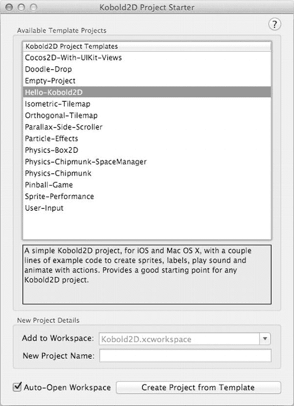

图 2-2 . `Kobold2D Project Starter` 工具

你可以选择一个模板项目用于你的项目。如果你想从头开始，`Hello-Kobold2D` 和 `Empty-Project` 模板是理想的选择，物理模板也是如此。所有其他模板或多或少都是完整的游戏，或者用于说明 `Kobold2D` 或 `cocos2d` 的某些方面。所有模板项目都已启用 ARC。

默认情况下，新项目会添加到 `Kobold2D.xcworkspace` 中，但你可以通过输入工作区名称来覆盖此设置。将密切相关的项目放在同一个工作区中会很有帮助。

为你的项目输入一个名称，然后点击“从模板创建项目”。如果选中“自动打开工作区”，Xcode 将自动打开包含你新创建项目的工作区。你可以立即开始工作，并且你的项目会自动启用 ARC。


**注意** Kobold2D 让创建和分享项目模板变得非常简单。您可以更改现有项目的名称、提供描述文件，并开始与其他用户共享该模板。此过程记录在 `www.kobold2d.com/x/TgUO`。要创建新的 Kobold2D 项目，您将专门使用 Kobold2D 项目启动器应用程序。您无法在 Xcode 内部创建新的 Kobold2D 项目，但作为回报，您有更多的项目可供选择，并且可以轻松创建自己的项目模板。

点击 `Run` 按钮，您应该会看到 iPhone 模拟器启动，如图 2-3 所示。

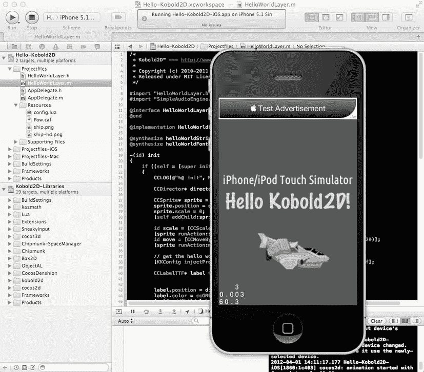

图 2-3. `Hello Kobold2D` 项目

**警告** 由于 Xcode 的一个错误，您不应同时打开多个相同 Kobold2D 版本的 Kobold2D 工作区。Xcode 只会为一个工作区加载 `Kobold2D-Libraries` 项目，导致其他 Kobold2D 工作区暂时无法正常工作，通常会引发一个难以描述的“退出代码为 1 的失败”类型的错误。要解决此问题，请关闭所有打开的 Xcode 窗口，然后重新打开您想要处理的工作区。如果您打开的是 Kobold2D 项目的 `.xcodeproj` 文件而不是 `.xcworkspace`，构建也会失败，因为会缺少 `Kobold2D-Libraries` 项目引用。Kobold2D 常见问题解答解释了所有这些密切相关的问题、如何识别它们并提供了解决方案：`www.kobold2d.com/x/IQkO`。

## 安装 cocos2d 及其 Xcode 项目模板

**提示** 如果您已经安装了 Kobold2D 并计划使用它，可以直接跳到“cocos2d 和 Kobold2D 应用程序结构”部分。如果尚未安装，请记住，对于 cocos2d，您需要按照即将到来的“如何在 cocos2d 项目中启用 ARC”部分的说明，在每个 cocos2d 项目中单独启用 ARC。或者，下载本书的源代码并使用提供的已启用 ARC 的 cocos2d 模板项目。无论如何，您可以安全地同时安装 cocos2d 和 Kobold2D，它们之间不会有冲突。

要使用 cocos2d，您需要双击解压下载的文件。这将创建一个名为 `cocos2d-iphone-2.0` 或类似的文件夹，具体取决于确切的版本号和其他后缀。您可以根据需要移动或重命名此文件夹。

要安装 cocos2d Xcode 模板，请打开终端应用程序（在 Finder 中“应用程序”下的“实用工具”文件夹中——或者只需在 Spotlight 中搜索 `Terminal.app` 即可找到）。cocos2d Xcode 项目模板的安装过程由一个 shell 脚本驱动，您需要从命令行程序终端运行该脚本。

首先，切换到 cocos2d 所在的目录。例如，如果您在“下载”文件夹中下载并解压了 cocos2d，那么您将有一个名为 `cocos2d-iphone-2.0` 或类似的文件夹。如果 cocos2d-iphone 的路径在您的系统上有所不同，请确保使用正确的路径。在此示例中，您需要输入以下内容：

```
./Downloads/cocos2d-iphone-2.0/install-templates.sh –f
```

按回车键运行模板安装脚本。如果一切顺利，您应该会在终端窗口中看到打印出多行信息。其中大部分将开头为“. . .复制中”。如果是这样，则说明模板已安装成功。

请注意，路径前面的点是必不可少的——没有它，您很可能会收到“没有那个文件或目录”的错误。

模板被复制到用户的 Developer 目录，即 `~/Library/Developer/Xcode/Templates`。如果您以后想删除 cocos2d Xcode 模板，可以在此目录中通过 Finder 进行浏览。`-f` 开关强制脚本替换任何现有的 cocos2d 模板文件，这样如果您之前安装过 cocos2d Xcode 模板，就不会出现任何错误。

请记住，每次下载新版本的 cocos2d 以将 Xcode 项目模板升级到最新版本时，您都需要运行此脚本。

**注意** 要卸载 cocos2d，只需删除 `cocos2d-iphone-2.0` 文件夹以及您不再需要的任何 cocos2d 项目。要删除 cocos2d Xcode 模板，请删除 `~/Library/Developer/Xcode/Templates` 和 `~/Library/Developer/Xcode/Templates/File Templates` 中以 `cocos2d` 开头的两个文件夹。

## 如何创建 cocos2d 项目

安装 cocos2d 项目模板后，打开 Xcode 并选择“文件”“新建项目”。点击左侧的 `cocos2d v2.x` 条目，应显示图 2-4 中所示的三个 cocos2d 图标。如果您看到的不是这样，请返回上一节并确认安装 cocos2d Xcode 项目模板已成功且没有错误。

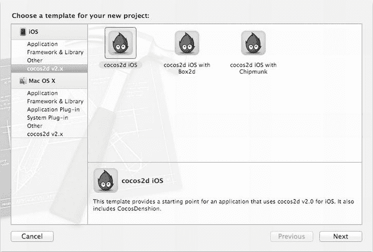

图 2-4. cocos2d Xcode 项目模板

**注意** 我将在第 13 章中讨论 Box2D 和 Chipmunk 应用程序模板。如果您现在想用物理引擎找点乐子，可以随意尝试它们。

选择 cocos2d iOS 模板，点击“下一步”，为其命名，并将其保存到您计算机上的任何位置。

**提示** 好的做法是不要在 Xcode 项目名称中使用空格字符。Xcode 不介意，但您使用的某些工具可能会介意。这是一种防御性措施，以避免任何潜在的问题。即使在今天，与文件名中的空格和特殊字符相关的问题偶尔也会发生。我始终将自己限制在仅使用字母、数字、短横线和下划线字符来命名任何与代码相关的内容——无论是项目、源文件还是资源。请注意，应用程序的名称（如 iTunes 或设备上显示的那样）默认为项目名称。您可以在 `Info.plist` 文件中，通过在“Bundle Display Name”条目中输入应用程序的真实名称来更改它。

Xcode 将根据所选模板创建 cocos2d 项目。一个类似于图 2-5 所示的 Xcode 项目窗口将会打开。

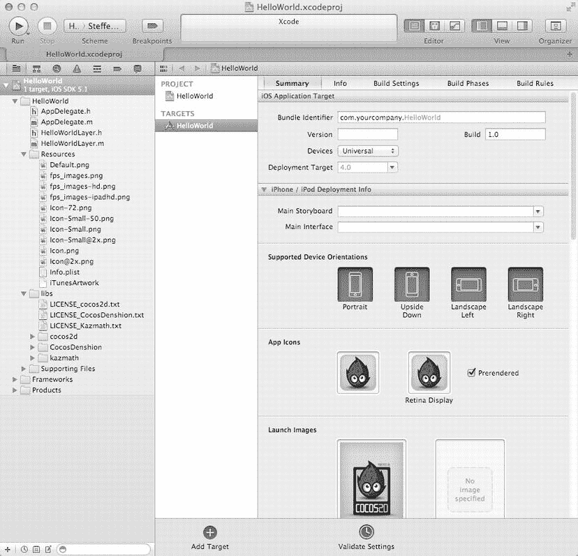

图 2-5. Xcode 4 中新创建的 `HelloWorld` 项目

当您点击 `Run` 时，项目将构建并在 iOS 模拟器中运行。结果应类似于图 2-6。

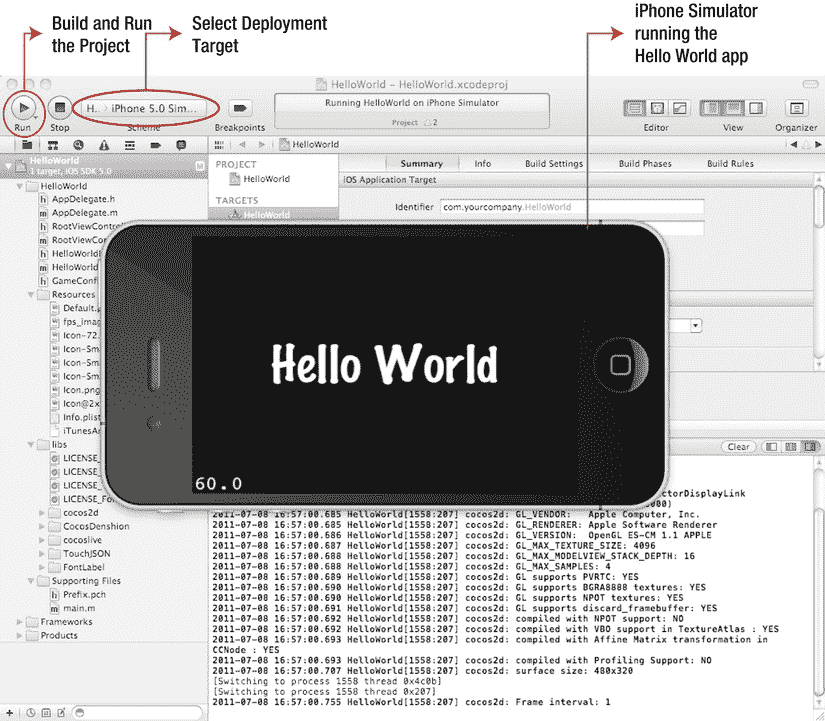

图 2-6. 模板项目运行成功，并在 iPhone 模拟器中显示一个“Hello World”标签

## 如何在 cocos2d 项目中启用 ARC

尽管所有 Kobold2D 项目都已自动启用 ARC，但 cocos2d 项目并非如此。而且，这不仅仅是简单翻转一个开关。要在一个新创建的 cocos2d 项目中启用 ARC，您需要执行本节概述的步骤（Kobold2D 用户可以跳过整个本节）。

### 将 cocos2d 代码构建为静态库

Cocos2d 可能与 ARC 兼容，但 cocos2d 源代码本身并不符合 ARC 规范。这意味着，如果您想在一个已启用 ARC 的项目中使用它，您必须在构建 cocos2d 源代码时禁用 ARC。目前最好的方法是将 cocos2d 代码构建为一个静态库，从而允许在不使用 ARC 的情况下构建该代码。然后，您可以安全地将 cocos2d 静态库与已启用 ARC 的应用程序目标进行链接。

首先，在导航区域中找到并删除 `libs` 组。当图 2-7 中的确认对话框弹出时，点击“移除引用”。不要将这些文件移到废纸篓，因为稍后您还会用到它们。

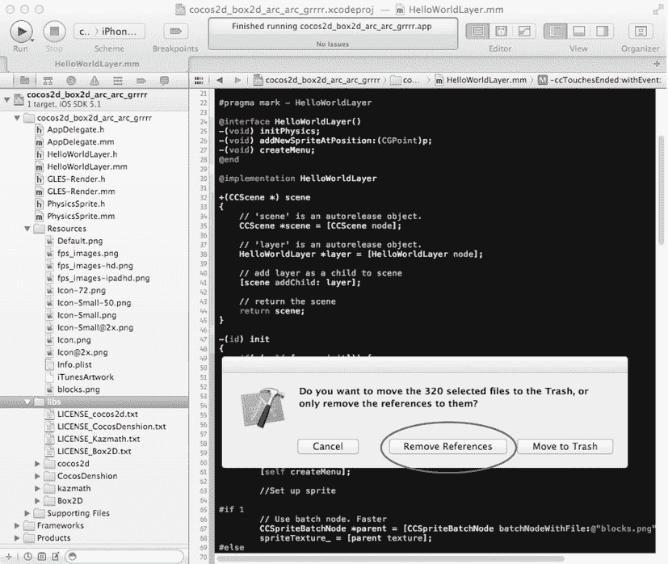

图 2-7. 从项目中移除 `libs` 组，但不要将其移入废纸篓


在导航区域中选择项目本身，如图 2-8 所示。项目始终是第一个条目，并带有一个蓝色文档图标。然后点击底部的“添加目标”（`Add Target`）按钮。

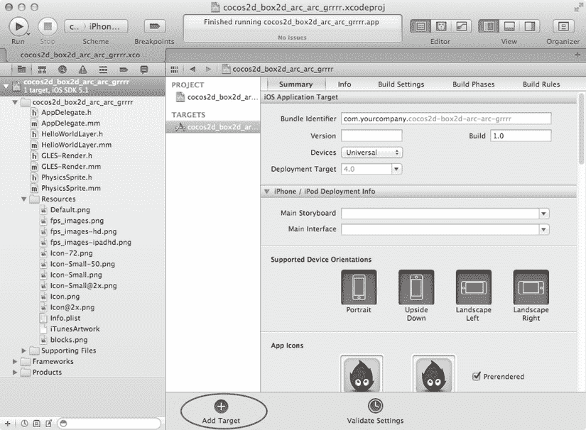

图 2-8 . 向项目添加新目标

在如图 2-9 所示的“添加目标模板”对话框中，导航到“框架与库”（`Framework & Library`）组，并选择“可可触控静态库”（`Cocoa Touch Static Library`）。然后点击“下一步”（`Next`）。

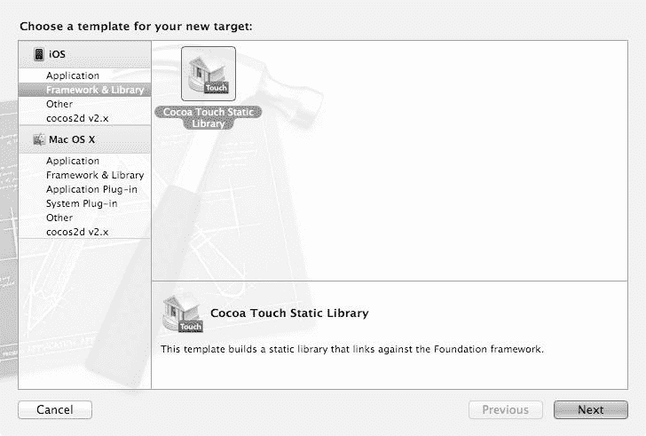

图 2-9 . 选择“可可触控静态库”模板

为静态库指定一个合适的名称——例如，`cocos2d-library` 会是一个好名字。确保同时取消选中“包含单元测试”（`Include Unit Tests`）和“使用自动引用计数”（`Use Automatic Reference Counting`）。设置应与图 2-10 中的一致。然后点击“完成”（`Finish`）以将静态库目标添加到你的项目。

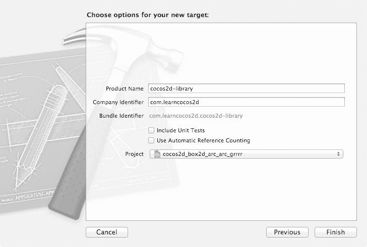

图 2-10 . 命名静态库并取消选中两个复选框

创建 `cocos2d-library` 目标后，选中它，将显示“构建设置”（`Build Settings`）面板。你需要浏览“构建设置”以在“搜索路径”（`Search Paths`）部分进行两处更改。找到它们的最简单方法是在“构建设置”面板右上角的搜索过滤文本框中输入`search`（参见图 2-11）。将“始终搜索用户路径”（`Always Search User Paths`）设置为`Yes`，并将“用户头文件搜索路径”（`User Header Search Paths`）设置为略显神秘的`./**`字符串。

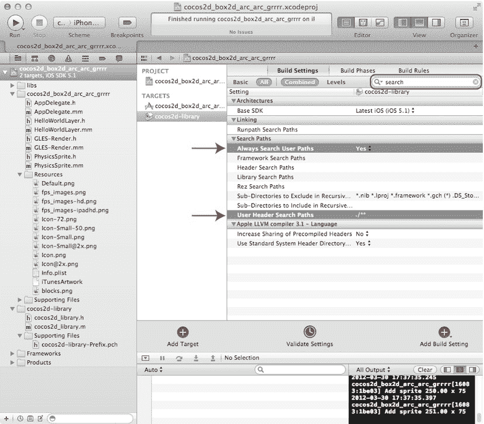

图 2-11 . 将“始终搜索用户路径”设置为`Yes`，将“用户头文件搜索路径”设置为`./**`

**注意**  你可以通过两种方式编辑“用户头文件搜索路径”（`User Header Search Paths`）设置：通过两次单击它，并在两次单击之间有一定延迟——这允许你直接输入文本；或者通过双击该字段，这会弹出一个带有不起眼复选框的附加对话框。在这种情况下，要么只输入一个点（`.`）并点击复选框，要么输入完整的字符串`./**`但不勾选该复选框。否则，你最终可能会得到字符串`./**/**`，这会导致编译器错误。确保在编辑对话框关闭后验证该字符串是正确的。

现在选择项目的另一个目标。这是你创建项目时已经存在的那个目标。选择“构建阶段”（`Build Phases`）选项卡，并展开“将二进制文件与库链接”（`Link Binary With Libraries`）列表，如图 2-12 所示。

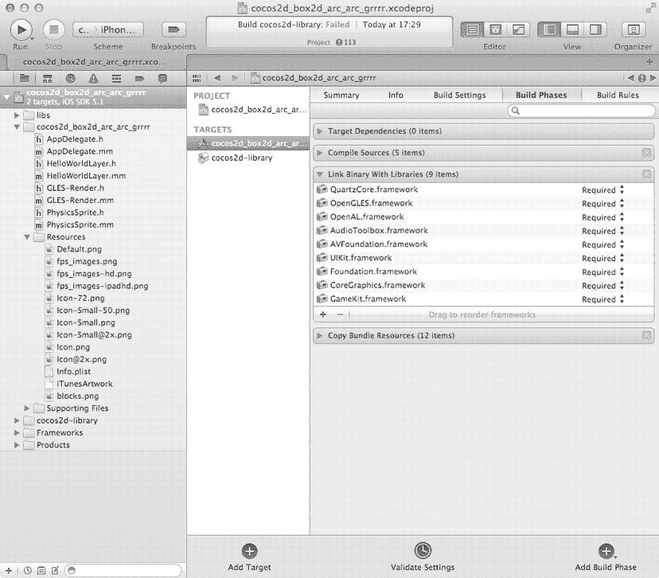

图 2-12 . 选择原始目标并展开“将二进制文件与库链接”列表

点击列表下方的小`+`按钮，调出如图 2-13 所示的选择对话框。从中选择`libcocos2d-library.a`条目并点击“添加”（`Add`）。

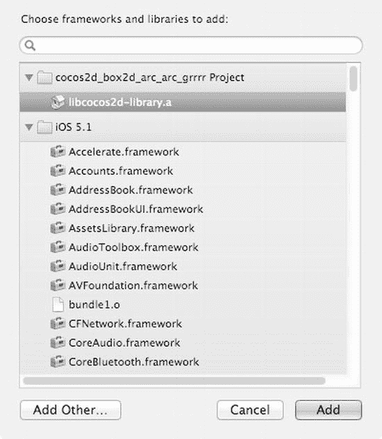

图 2-13 . 选择原始目标并展开“将二进制文件与库链接”列表

最后一步是将`cocos2d`文件重新添加到静态库目标。点击文件（`File`） “将文件添加到”项目名称“（`Add Files to “name-of-project”`），调出如图 2-14 所示的文件对话框。导航到你的项目文件夹，然后找到并选择`libs`文件夹。确保未选中“如果需要，将项目复制到目标组文件夹中”（`Copy items into destination group’s folder (if needed)`）复选框，并且选中“为任何添加的文件夹创建组”（`Create groups for any added folders`）单选按钮。最后，在点击“添加”（`Add`）按钮之前，验证只有`cocos2d-library`目标的复选框被选中。如有疑问，请与图 2-14 中的设置进行比较。

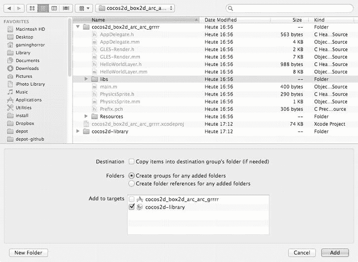

图 2-14 . 选择`libs`文件夹并将其添加到`cocos2d-library`目标

现在构建并运行项目以验证一切正常。`cocos2d`代码以及`cocos2d`提供的任何其他库源代码现在都将作为静态库构建，并与应用程序目标链接。

**提示**  `cocos2d-library`项目创建了项目中不需要的额外文件。在导航区域中找到`cocos2d-library.h`和`cocos2d-library.m`文件并删除它们。这只是一个空的存根类，是`Xcode`在添加静态库目标时始终会创建的。

## 重构项目的源代码以使用 ARC

随着`cocos2d`源代码作为禁用了 ARC 的静态库构建，下一步是为项目的源代码启用 ARC。幸运的是，`Xcode`提供了一个便捷函数来将现有代码转换为 ARC。

从`Xcode`菜单中，选择编辑（`Edit`） 重构（`Refactor`） 转换为 Objective-C ARC（`Convert to Objective-C ARC.. .`）。这将调出如图 2-15 所示的对话框，你可以在其中选择要转换的目标。仅选择你的应用程序目标，而不是`cocos2d-library`目标。然后点击检查（`Check`）。

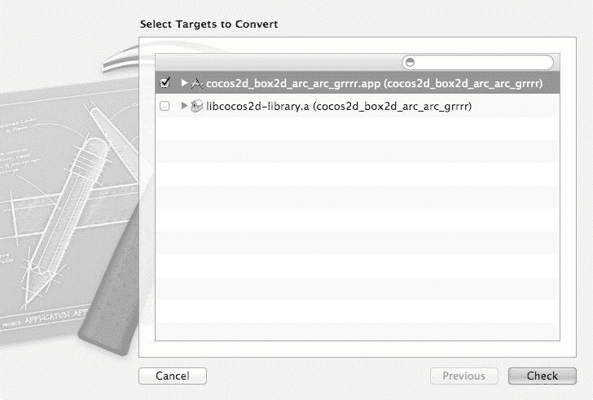

图 2-15 . 仅转换你的项目目标，而不是`cocos2d-library`目标

`Xcode`首先尝试在启用 ARC 的情况下构建你的代码，以确定它需要做出的更改。这仅需几秒钟。完成后，会有一个介绍对话框说明下一步。阅读文本并点击“下一步”（`Next`）。如图 2-16 所示的对话框允许你预览即将做出的更改。你可以通过点击“保存”（`Save`）安全地接受所有更改。

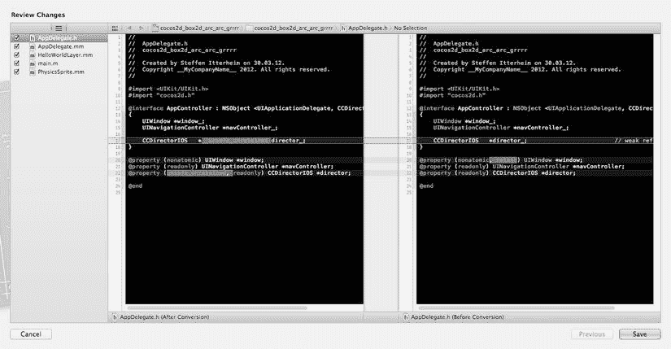

图 2-16 . 预览`Xcode`如何更改代码以使其符合 ARC 要求

之后，`Xcode`也会为转换后的目标启用“Objective-C 自动引用计数”（`Objective-C Automatic Reference Counting`）构建设置。代码应该能够在启用 ARC 的情况下构建和运行，所以现在就去试试吧。

## cocos2d 和 Kobold2D 应用程序的剖析

你现在已经知道如何创建启用 ARC 的`cocos2d`和`Kobold2D`项目了。完美。无需多言。

但你现在想知道它是如何工作的，对吧？好吧，我没想到你会这么轻易地放过我。而且有某种感觉告诉我，无论我在本书中深入探讨多少细节，你都会想知道更多。就是这么个精神！

让我们来看看各自的“Hello World”项目中有什么，看看它们是如何协同工作的，这样你就对事物的连接方式有了一个大致的了解。请随意摆弄这个“Hello World”项目。如果有什么东西坏了，你可以通过基于其中一种项目模板创建新项目来重新开始。

图 2-17 显示了`Kobold2D`和`cocos2d`项目的项目导航器（`Project Navigator`）区域。你会注意到，就源代码而言，它们几乎完全相同。由于`Kobold2D`使用`Xcode`工作区，你还会看到一个名为`Kobold2D-Libraries`的附加项目。那里你可以访问所有库的源代码。在`cocos2d`项目中，这些文件位于`libs`组中。

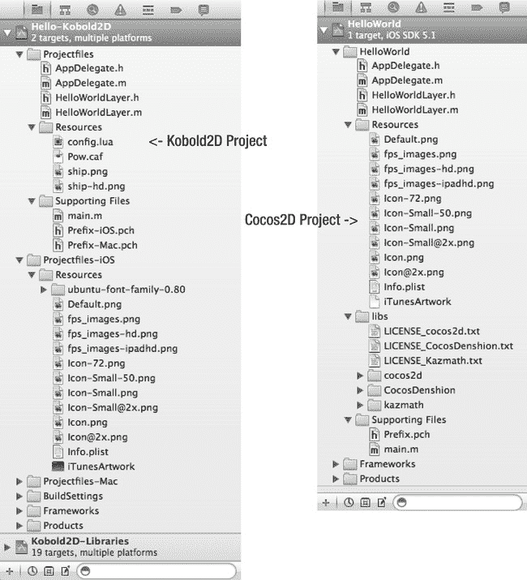

图 2-17 . Xcode 的项目导航器——Kobold2D 和 cocos2d 项目的示例


### 注意事项

Xcode 的项目导航面板看起来很像 Finder 中的文件夹和文件。但带有黄色图标的文件夹实际上被称为*群组*，它们类似于虚拟文件夹。群组允许你以逻辑方式排列文件，而不会影响它们在 Finder 中的实际文件夹位置。你可以在群组间移动文件或重命名群组，但文件在 Finder 中的位置保持不变。同样，如果你在 Finder 中移动文件或重命名包含文件的文件夹，Xcode 不会自动更新项目中的文件，而是将该文件显示为红色，表明无法定位到该文件。

cocos2d 和 Kobold2D 项目本质上都引用两种类型的文件：源代码文件和资源文件（例如，图片和属性列表）。随着本书内容的深入，我会逐步讲解资源文件，所以这里先集中讨论最重要的几个。

`Default.png`文件是 iOS 加载应用时显示的图片，而`Icon.png`显然是应用的图标。根据设备的不同，可能会使用这些文件的多个变体。例如，Retina 设备会加载带有`@2x`后缀的图片文件。有关应用图标、启动图片等的完整图片尺寸和格式列表，请参考苹果公司的《自定义图标和图片创建指南》：`http://developer.apple.com/library/ios/#documentation/userexperience/conceptual/mobilehig/IconsImages/IconsImages.html`。

Cocos2d 使用`fps_images.png`文件来显示帧率；你不应移除或修改它们。

在`Info.plist`文件中，你可以找到应用的许多设置。你只需要在接近发布应用时对这里进行更改。如果你选择项目的目标，也可以更方便地更改最重要的`Info.plist`设置，例如支持的设备方向（参见图 2-5）。

### 支持文件群组

如果你熟悉 C 或类似语言的编程，你可能会认出支持文件群组中的`main.m`是应用的入口点。该群组中唯一的另一个文件是预编译头文件`Prefix.pch`，在 Kobold2D 项目中则分别是`Prefix-iOS.pch`和`Prefix-Mac.pch`。

### main 函数

从`main`函数到`AppDelegate`类之间发生的一切，都是 iOS SDK 幕后机制的一部分，你对此没有控制权。因为你实际上永远不需要更改`main.m`，所以可以放心地忽略其内容。不过，查看一下也并无坏处。

`main`函数创建一个`@autoreleasepool`，然后调用`UIApplicationMain`来启动应用，并使用`AppController`作为实现`UIApplicationDelegate`协议的类。你可以在名为`AppDelegate`的文件中找到`AppController`类的实现。以下是启用了 ARC 的 cocos2d 应用中 main 函数的样子：

```
int main(int argc, char *argv[])
{
    @autoreleasepool
    {
     int retVal = UIApplicationMain(argc, argv, nil, @"AppController");
     return retVal;
    }
}
```

从中唯一值得注意的一点是，每个 iOS 应用都使用一个`@autoreleasepool`，ARC 需要它来管理内存。

在 Kobold2D 应用中，`main`函数仅调用`KKMain`，后者执行上述操作并最终也使用`AppDelegate`类。但`KKMain`还会初始化 Lua、加载`config.lua`文件，并根据操作系统（iOS 或 Mac OS）调用相应的启动函数。

```
int main(int argc, char *argv[])
{
    // 将 main 转发至 Kobold2D™ 提供的默认实现。
    return KKMain(argc, argv, NULL);
}
```

### 前缀头文件

如果你想知道`Prefix.pch`头文件是做什么用的，它们是用来加速编译的特殊头文件。PCH 是预编译头文件（Pre-Compiled Header）的缩写。你应该将那些很少改变或从不改变的框架头文件添加到前缀头文件中。这会使框架代码被预先编译，并可供你所有的类使用。不幸的是，它也有一个缺点：如果添加到前缀头文件中的某个头文件发生了变化，你的所有代码都必须重新编译——这就是为什么你应该只添加那些很少改变或从不改变的头文件。

例如，`cocos2d.h`头文件就是添加到 cocos2d 项目前缀头文件中的理想候选，如列表 2-1 所示。然而，要想显著缩短编译时间，你的项目需要相当复杂才行，所以现在还没到需要掏出秒表的时候。不过，将`cocos2d.h`立即添加为前缀头文件是一个好习惯，哪怕只是为了以后再也不必在任何一个源文件中写`#import "cocos2d.h"`。

**列表 2-1.** 将 `cocos2d.h` 头文件添加到前缀头文件

```
#ifdef __OBJC__

#import <Foundation/Foundation.h>

#import <UIKit/UIKit.h>

#import "cocos2d.h"

#endif
```

**注意**  Kobold2D 项目中的前缀头文件已经添加了`cocos2d.h`，以及其他一些合理的头文件。

## AppDelegate 类

每个 iOS 应用都有一个实现`UIApplicationDelegate`协议的`AppDelegate`类。在我们的 HelloWorld 项目中，它被简称为`AppDelegate`。

`AppDelegate`是每个 iOS 应用中都存在的一个全局概念。它通过在特定时间点接收来自 iOS 的消息来跟踪应用的状态变化。例如，它允许你判断用户何时接到电话，或何时应用内存不足。Cocos2d 通常在`applicationDidFinishLaunching`方法中初始化。

Kobold2D 项目中的`AppDelegate`类是 Kobold2D 提供的`KKAppDelegate`类的子类。与`AppController`类一样，它子类化`NSObject`并实现`UIApplicationDelegate`协议。`KKAppDelegate`在后台做了大量工作，只留给你三个可能用也可能不用的回调函数。例如，`initializationComplete`方法由 Kobold2D 在运行第一个场景之前调用。你应该在这里添加任何需要在第一个场景初始化之前运行的代码。其他所有你通常需要修改`AppDelegate`类源代码的设置，都可以更方便地在 Kobold2D 项目的`config.lua`文件中更改。

要了解更多关于`AppDelegate`的各种方法、它们的作用以及 iOS SDK 何时发送这些消息，你可以查阅苹果公司关于`UIApplicationDelegate`协议的参考文档，网址为`http://developer.apple.com/iphone/library/documentation/uikit/reference/UIApplicationDelegate_Protocol`。

**注意**  我正在讨论应用的启动，所以不妨也谈谈应用的关闭。你最终可能会注意到`AppDelegate`的`dealloc`方法的一个异常行为：它永远不会被调用！在`AppDelegate`的`dealloc`方法中设置的任何断点都不会被触发！

这是正常行为。当 iOS 终止一个应用时，它只是简单地清空内存以加快关闭过程。这就是为什么`AppDelegate`类中`dealloc`方法内的代码永远不会被执行。由于手动调用`dealloc`是非常糟糕的做法，因此在 ARC 下禁止调用`dealloc`和`[super dealloc]`，因为 ARC 会为你处理这些。如果你需要在应用终止前在`AppDelegate`中运行代码，请在`applicationWillTerminate`方法中执行。


