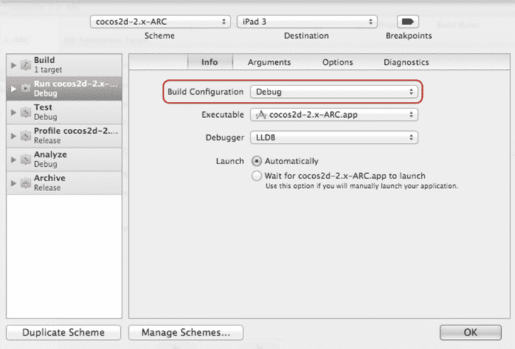

# 在纯 cocos2d 项目中，`AppDelegate` 类中最常修改的代码行是：

```
[director_ setDisplayStats:YES];
[director_ setAnimationInterval:1.0/60];
```

在 Kobold2D 应用中，你可以通过修改 `config.lua` 文件中的以下两行来调整这些及其他设置：

```
DisplayFPS = YES,
MaxFrameRate = 60,
```

### 显示统计信息

`setDisplayStats` 方法用于启用屏幕左下角显示的数字。示例请参见 图 2-3。这些数字分三行堆叠显示。从上到下，第一行表示**绘制调用**的次数。你需要尽可能保持这个数字较低，因为绘制调用是一项开销高昂的操作（后续会详细说明）。第二行是更新帧所花费的时间，它告诉你帧率开始下降前还有多少余量。最下面一行是当前帧率。

**注意** 在 iOS 模拟器上运行应用时，除了绘制调用次数外，你必须完全忽略帧时间和帧率数字。模拟器的性能毫无参考价值，因为它可能比实际 iOS 设备快几倍或慢几倍。这就好比试图在玉米地里开跑车来测量其性能：虽说能开，甚至可能很有趣，但你仍然无法知道它在公路上的表现如何。然而，这才是唯一重要的事情。

如果你需要调整 FPS 显示的响应速度，可以通过修改 `ccConfig.h` 中的 `CC_DIRECTOR_STATS_INTERVAL` 行来实现。默认值为 0.1，意味着帧率显示每秒更新十次。如果你增大这个值，每秒帧数（FPS）显示将在一段更长时间内取平均值。不过，你将无法观察到任何突然的、短暂的帧率下降，尽管这种下降仍可能被感知到。

### 动画间隔

动画间隔决定了 cocos2d 更新屏幕的频率。实际上，这会影响你的游戏能达到的最高帧率。不过，动画间隔并非以每秒帧数给出。它实际上是帧率的倒数，因为它决定了 cocos2d 更新屏幕的频率。这就是为什么参数是 1 除以 60，因为这样得到的是 0.0167 秒。如果你的应用更新游戏逻辑和渲染屏幕所需时间超过这个值，帧率就会下降到 60 FPS 以下。保持游戏以高帧率运行是你的责任。别担心，我将在本书中解释提高性能的技巧。

在某些情况下，将帧率锁定为每秒 30 帧可能更合适。这对于那些你清楚无法稳定达到 60 FPS，且帧率在 30 到 60 FPS 之间波动的复杂游戏可能会有所帮助。在这种情况下，通常最好将帧率锁定到最低的公约数，因为对玩家而言，较低但稳定的帧率比即使实际平均帧率可能更高但容易剧烈波动的帧率更流畅。人类的感知是件很微妙的事情。

> **注意：** 在 iOS 设备上，你无法渲染超过 60 FPS。设备的显示屏锁定以每秒 60 帧（Hz）更新，强制 cocos2d 每秒渲染超过 60 帧，充其量是毫无作用，最坏情况下反而会降低你的帧率。如果你想以最快速度运行 cocos2d，请坚持使用 `1.0/60` 的 `animationInterval`。

## `HelloWorldLayer`

`HelloWorldLayer` 类是 cocos2d 代码施展魔法，显示“Hello World”标签的地方。在深入探讨之前，你应该理解 cocos2d 使用 `CCNode` 对象的层级结构来决定显示什么以及显示在哪里。

所有节点的基类是 `CCNode` 类，它包含位置属性但没有可视化表现。它是所有其他节点类的父类，包括两个最基本的类：`CCScene` 和 `CCLayer`。

`CCScene` 是一个抽象概念，它唯一的作用就是根据对象的像素坐标，允许对象在场景中正确放置。因此，`CCScene` 节点始终用作每个 cocos2d 场景层级结构的父对象。在任何时候，你只能有一个正在运行的场景。

`CCLayer` 类本身做的事情很少，除了支持触摸和加速度计输入。通常你会将它作为添加到 `CCScene` 的第一个类使用，仅仅因为大多数游戏都至少使用简单的触摸输入。严格来说，`CCLayer` 并非分层对象的必需品——你可以使用 `CCNode` 或任何其他派生自 `CCNode` 的类达到同样的效果。

如果你打开 `HelloWorldLayer.h` 头文件，你会看到 `HelloWorldLayer` 类派生自 `CCLayer`。那么 `CCScene` 类又是在哪里起作用的呢？

因为 `CCScene` 仅仅是一个抽象概念，所以在 cocos2d 中设置场景的默认方式一直是在你的类中使用一个静态初始化方法 `+(id) scene`。此方法创建一个常规的 `CCScene` 对象，然后将一个 `HelloWorldLayer` 类的实例添加到该场景中。几乎在所有情况下，这是唯一创建和使用 `CCScene` 的地方。以下是 `+(id) scene` 方法的一个通用示例：

```
+(id) scene
{
    CCScene *scene = [CCScene node];
    id layer = [HelloWorldLayer node];
    [scene addChild:layer];

    return scene;
}
```

首先，使用 `CCScene` 类的类方法 `+(id) node` 创建一个 `CCScene` 对象。接着，使用相同的 `+(id) node` 方法创建 `HelloWorldLayer` 类，然后将其添加到场景中。最后，该场景被返回给调用者。

在 Kobold2D 项目中，你可能会注意到 `+(id) scene` 方法不存在。你可以使用 `config.lua` 设置 `FirstSceneClassName` 来指示 Kobold2D 将此类作为第一个场景运行：

```
FirstSceneClassName = "HelloWorldLayer",
```

如果这个特定类并非派生自 `CCScene`，Kobold2D 会在后台自动创建 `CCScene` 对象。

接下来看 `HelloWorldLayer` 类的 `-(id) init` 方法，这里就是 cocos2d、Kobold2D 以及各个项目模板的代码开始出现差异的地方。不过，还是存在一些共性的。代码清单 2-2 展示了一个“Hello World”应用的最小化 `init` 代码。实际项目中的代码会有所不同，但你一定会在之前创建的项目中看到添加了一个 `CCLabelTTF`。

注意一个可能看起来奇怪的地方：在调用 `self = [super init]` 时，`self` 被赋值为发送给 `super` 对象的 `init` 消息的返回值。如果你有 C++ 背景，看到这个可能会感到不适。别太纠结，这完全没问题。这仅仅意味着在 Objective-C 中，你必须手动调用父类的 `init` 方法。没有对父类的自动调用。而且你必须将 `[super init]` 消息的返回值赋给 `self`，因为它可能返回 `nil`。

**代码清单 2-2.** `init` 方法创建并添加一个“Hello World”标签

```
-(id) init
{
    if ((self = [super init]))
    {
        // 创建并初始化一个标签
        CCLabelTTF* label = [CCLabelTTF labelWithString:@"Hello World"
                                               fontName:@"Marker Felt"
                                               fontSize:64];

        // 从 CCDirector 获取窗口（屏幕）尺寸
        CGSize size = [[CCDirector sharedDirector] winSize];

        // 将标签定位在屏幕中心
        label.position = CGPointMake(size.width / 2, size.height / 2);

        // 将此标签作为子节点添加到当前图层
        [self addChild:label];
    }
    return self;
}
```

`CCLabelTTF` 类使用 TrueType 字体在屏幕上绘制文本。


如果你对 Objective-C 程序员编写 `[super init]` 调用的方式深感担忧，这里有一个替代方案或许能让你安心，尽管它在 cocos2d 开发者中并不常见。它本质上是一样的，苹果也使用这种风格：

```
-(id) init
{
    self = [super init];
    if (self != nil)
    {
     // 在这里进行初始化操作 . . .
    }
    return self;
}
```

现在让我解释一下标签是如何添加到场景中的。如果你再次查看清单 2-2 中的 `init` 方法，你会发现一个 `CCLabelTTF` 对象是使用 `init` 的静态初始化方法之一创建的。它会返回 `CCLabelTTF` 类的一个新实例。为了不让它在控制权离开 `init` 方法后释放内存，你必须使用 `[self addChild:label]` 消息将标签作为子节点添加到 `self` 中。本质上，持有一个对象的引用可以让该对象保持活跃。在这种情况下，cocos2d 会接管该对象的内存管理，直到你将其从场景中移除或切换场景。

在创建和添加标签之间，标签被分配了一个位于屏幕中心的位置。请注意，在调用 `addChild` 之前或之后分配位置并不重要。

### 使用 ARC 的内存管理

如果你以前从未做过任何 Objective-C 编程，那太好了！你会逐渐认为符合你预期的内存管理是理所当然的。只要你持有对一个对象的引用，它就会保持活跃。你完全不需要担心分配或释放内存的问题。

如果你以前使用 Objective-C 编程过，你可能需要克服“就此放手”的不安感。ARC 不是魔法，但可以信赖它 100% 做正确的事情。你可能想在这里阅读苹果的《过渡到 ARC 发布说明》：`http://developer.apple.com/library/ios/#releasenotes/ObjectiveC/RN-TransitioningToARC/Introduction/Introduction.html`。

举个例子，这两行代码在 ARC 中是相同的：

```
CCSprite* sprite = [CCSprite spriteWithFile:@"file.png"];
CCSprite* sprite = [[CCSprite alloc] initWithFile:@"file.png"];
```

在 ARC 之前，你实际上必须区分分配一个自动释放对象（第一行）和一个常规初始化对象（第二行）。使用 ARC 时，如果可用，你应该首选第一个版本，因为它更易读并且在 ARC 下更快。但两者都可以，并且都会创建一个对象，当 `sprite` 变量超出作用域时，其内存会被释放。就是这么简单。

唯一不因 ARC 而改变的是，你必须向一个类发送 `alloc` 消息来创建该类的实例。这也会分配并初始化对象的内存。

### 改变世界

如果我不让你至少稍微摆弄一下，像 HelloWorld 这样的模板项目还有什么意义？我会让你通过触摸来改变世界！这开头怎么样？

首先，你将对 `init` 方法进行两处修改，以启用触摸输入并在稍后使用标签值来检索标签。这些修改在清单 2-3 中突出显示。

***清单 2-3***。 启用触摸并获取对标签对象的访问

```
-(id) init
{
if ((self = [super init]))
{
// 创建并初始化一个标签
CCLabelTTF* label = [CCLabelTTF labelWithString:@"Hello World"
fontName:@"Marker Felt"
fontSize:64];
// 从 CCDirector 获取窗口（屏幕）大小
CGSize size = [[CCDirector sharedDirector] winSize];
// 将标签放置在屏幕中央
label.position = CGPointMake(size.width / 2, size.height / 2);
// 将标签作为子节点添加到此 Layer
[self addChild: label];
// 我们的标签需要一个标签值，以便我们稍后能找到它
// 你可以选择任意数字
label.tag = 13;
// 必须启用，如果你想接收触摸事件！
self.isTouchEnabled = YES;
}
return self;
}
```

`label` 对象的 `tag` 属性被赋值为 13。你为什么要这么做？我知道，是我让你这么做的，但我一定是有原因的，对吧？在上一节中，我解释了这就是你稍后如何访问类的子对象的方法——你可以通过它的标签来引用它。标签数字完全是任意的，只是它必须是一个正数，并且每个对象应该有自己的标签数字，这样就不会有两个对象具有相同的数字，否则你无法分辨你要检索的是哪一个。

**提示** 与其使用像 13 这样的魔数作为标签值，你应该养成定义常量来使用标签的习惯。相比之下，记住标签数字 13 代表什么会很困难，而编写一个有意义的变量名如 `kTagForLabel` 就容易得多。我会在第 5 章中讨论这个问题。

此外，`self.isTouchEnabled` 被设置为 `YES`。`CCLayer` 类的这个属性告诉它你想要接收触摸消息。只有这样，`ccTouchesBegan` 方法才会被调用：

```
-(void) ccTouchesBegan:(NSSet*)touches withEvent:(UIEvent*)event
{
    CCLabelTTF* label = (CCLabelTTF*)[self getChildByTag:13];
    label.scale = CCRANDOM_0_1();
}
```

通过使用 `[self getChildByTag:13]`，你可以访问 `CCLabelTTF` 对象，通过你之前在 `init` 方法中赋值的 `tag` 属性。然后你可以像往常一样使用该标签。在这个例子中，我们使用 cocos2d 方便的 `CCRANDOM_0_1()` 宏来将标签的 `scale` 属性改为一个介于 0 和 1 之间的值。这会在你每次触摸屏幕时改变标签的大小。

因为 `getChildByTag` 总是会返回标签，你可以安全地将其强制转换为一个 `(CCLabelTTF*)` 对象。但是，请注意，如果检索到的对象由于某种原因不是从 `CCLabelTTF` 类派生的，这样做会使你的游戏崩溃。如果你不小心给了另一个对象相同的标签数字 13，这很容易发生。因此，使用防御性编程风格并验证你正在处理的对象正是你所期望的是个好习惯。防御性编程使用断言来验证所做的假设是否为真。为此，你应该使用 `NSAssert` 方法：

```
-(void) ccTouchesBegan:(NSSet*)touches withEvent:(UIEvent*)event;
{
    CCNode* node = [self getChildByTag:13];
    // 防御性编程：验证返回的节点是一个 CCLabelTTF
    NSAssert([node isKindOfClass:[CCLabelTTF class]], ↩
     @"节点不是 CCLabelTTF！");
    CCLabelTTF* label = (CCLabelTTF*)node;
    label.scale = CCRANDOM_0_1();
}
```

在这种情况下，你期望 `getChildByTag` 返回的节点是一个从 `CCLabelTTF` 派生的对象，但你永远不能确定，这就是为什么添加一个 `NSAssert` 来验证事实有助于在错误导致崩溃之前发现它们。

请注意，这增加了两行代码，但在性能方面保持不变。对 `NSAssert` 的调用在 Release 构建中会被完全移除，而强制转换 `CCLabelTTF* label = (CCLabelTTF*)node;` 正是你之前已经做过的，只是写在同一行。本质上，两个版本执行效果完全相同，但在第二种情况下，当没有获得预期的 `CCLabelTTF` 对象时，你会收到通知，而不是因 `EXC_BAD_ACCESS` 错误而崩溃，这让你受益。

### 你还应该知道什么

因为这是“入门”章节，我认为有必要借此机会向你介绍一些 iOS 游戏开发中至关重要但经常被忽视的方面。我希望你意识到各种 iOS 设备之间的细微差别。特别是，可用内存常常被错误地考虑，因为你只能安全地使用每台设备内存的一小部分。


我还想让你知道，iOS 模拟器是测试游戏的好工具，但它不能用来评估性能、内存使用情况和其他特性。在模拟器上的体验可能与在真实 iOS 设备上运行游戏有很大差异。不要陷入根据游戏在 iOS 模拟器中的表现来做评估的陷阱。只有真机才作数。

## iOS 设备

当你为 iOS 设备进行开发时，需要考虑它们之间的差异。大多数独立游戏开发者或业余游戏开发者无力购买每一款略有不同的 iOS 设备——在撰写本文时已有八种型号，并且每年大约还会推出两款。至少，你需要明白它们之间存在重要差异。

你可能需要查阅 Apple 的规格表来熟悉 iOS 设备的技术规格。以下链接分别列出了 iPhone、iPod touch 和 iPad 的设备规格：

- `http://support.apple.com/specs/#iphone`
- `http://support.apple.com/specs/#ipodtouch`
- `http://support.apple.com/specs/#ipad`

表 2-1 总结了与游戏开发者关系最密切的硬件差异。iPhone 和 iPod touch 型号按代次列出，并在方括号中注明对应的 iPhone 型号后缀。如果处理器速度或内存有两个数字，第一个数字代表 iPhone 型号，第二个数字代表 iPod touch 型号。

**表 2-1: iOS 硬件差异**

| 设备 | 处理器 | 图形芯片 | 分辨率 | 内存（RAM） |
| --- | --- | --- | --- | --- |
| 第一代 | 412 MHz | PowerVR MBX | 480×320 | 128MB |
| 第二代（3G） | 412/533 MHz | PowerVR MBX | 480×320 | 128MB |
| 第三代（3GS） | 600 MHz | PowerVR SGX535 | 480×320 | 256MB |
| 第四代（4） | 800 MHz | PowerVR SGX535 | 960×640 | 512/256MB |
| iPhone 4S | 2x 800 MHz | PowerVR SGX535 Dual | 960×640 | 512MB |
| iPad 第一代 | 1 GHz | PowerVR SGX535 | 1024×768 | 256MB |
| iPad 第二代 | 2x 1 GHz | PowerVR SGX543 Dual | 1024×768 | 512MB |
| iPad 第三代 | 2x 1 GHz | PowerVR SGX543 Quad | 2048×1536 | 1GB |

如你所见，每一代新 iOS 设备通常都拥有更快的 CPU、更强大的图形芯片，以及更大的内存和屏幕分辨率。这一趋势将持续下去，新设备将变得越来越强大。

使用 `cocos2d 2.0` 时，你无法将第一代和第二代设备作为目标，这些设备在 iOS 市场中所占份额越来越小。这意味着在你所能支持的最老设备上，至少也有 256MB 内存。然而，从 256MB 到 1024MB 内存，以及从 600 MHz CPU 到第三代 iPad 上 2x 1 GHz 的双核 CPU，这之间仍然存在巨大的性能跨度。

通常，游戏开发者在查看硬件特性时，会倾向于关注 CPU 速度和图形芯片，以评估技术上的可能性。然而，作为移动设备，iOS 设备（直到最新的 iPhone 4）主要受到可用内存量的限制。这一点也常常被新开发者低估。例如，一个 1000x1000 的瓦片地图很容易消耗数百兆字节的内存，这还不算纹理内存。而一个 2048x2048 的 32 位色深纹理已经消耗了 16MB 内存，因此你不能同时在内存中加载太多这样的纹理。

**注意：** 不要将 RAM 与存储 MP3、视频、应用和照片的闪存存储混淆，即使是最小的 iOS 设备也有 8GB 闪存。闪存存储相当于桌面电脑的硬盘。RAM 是你的应用程序在运行时用于存储代码、数据和纹理的内存。当我谈到内存时，我指的是 RAM。

## 关于内存使用

当前 iOS 设备搭载的内存介于 256MB 到 1GB 之间。然而，这并非应用可用的内存量。iOS 系统会持续占用很大一部分内存，而 iOS 4 引入的多任务功能更加剧了这种情况。

随着时间的推移，iOS 开发者已经能够接近一个应用在被迫关闭前可以使用的理论最大 RAM 量。表 2-2 显示了您可以预期的可用内存情况。

**表 2–2: 安装的内存并非可用内存**

| 安装的内存 | 可用内存 | 内存警告阈值 |
| --- | --- | --- |
| 128MB | 大约 30MB | 大约 20MB |
| 256MB | 大约 90MB | 大约 70MB |
| 512MB | 大约 300MB | 大约 250MB（估计值） |

理想情况下，你应该始终保持内存使用量低于“内存警告阈值”一栏中的数字。接近这个数值时，你的应用可能会开始收到内存警告通知。你可以忽略一级内存警告，但如果应用继续使用更多内存，你可能会收到二级内存警告消息，这时操作系统基本上会威胁说，如果你不立即释放一些内存，就会关闭你的应用。这就像你妈妈威胁说，如果你不马上收拾房间，就不给你买新电脑一样！请务必照做。

`Cocos2d` 和 `Kobold2D` 会在 `AppDelegate` 类收到 `applicationDidReceiveMemoryWarning` 消息时，自动调用 `purgeCachedData()` 方法来释放内存。

如果你在拥有 512MB 或更大内存的设备上进行开发，请记住，大量 iOS 设备仍是只有 256MB 内存的型号。最好手头有一台你所支持的最老一代设备。你可以考虑购买一台便宜的老式第三代设备，主要用于在这台设备上测试游戏，以便在开发早期就发现内存警告和性能问题。那时修复这些问题仍然容易且成本低廉，尤其是当问题需要改变游戏设计时。一般来说，建议使用你手头硬件能力最弱的设备进行开发。

你可以使用 Instruments 应用来测量应用的内存使用情况，该应用在 Apple 的《Instruments 用户指南》中有详细说明：`https://developer.apple.com/library/ios/#documentation/DeveloperTools/Conceptual/InstrumentsUserGuide/Introduction/Introduction.html`。

## iOS 模拟器

Apple 的 iOS SDK 允许你在 Mac 上使用 iOS 模拟器运行和测试 iPhone 及 iPad 应用程序。iOS 模拟器的主要目的是让你能够更快速地测试应用，因为随着你的游戏变得越来越大，部署到 iOS 设备上所需的时间也越来越长。尤其是游戏会使用大量需要传输的图片和其他资源，这会拖慢部署速度。

然而，使用 iOS 模拟器有几个注意事项。以下部分将揭示 iOS 模拟器所不能做到的事情。基于所有这些原因，我建议你尽早并频繁地在真机上测试你的游戏。至少在每次重大更改之后，或者接近一天工作结束时，你应该在 iOS 设备上运行一次测试，以确认游戏的行为完全符合预期。

### 无法评估性能


### iOS 模拟器的性能注意事项

在 iOS 模拟器中运行游戏的性能完全取决于电脑的 CPU。图形渲染过程甚至不会利用 Mac 图形芯片的硬件加速能力。这就是为什么游戏在模拟器中的帧率完全没有意义。你甚至无法确定，对比修改前后的帧率是否能在真机设备上得出相同的结果。请务必在真机设备上使用 `Release` 构建配置进行性能测试。

### 无法评估内存使用情况

iOS 模拟器可以使用电脑上的所有内存，因此模拟器可用内存远多于真机设备。这意味着你不会收到内存警告通知，游戏在 iOS 模拟器上能正常运行，但当你首次在 iOS 真机设备上运行游戏时，可能会遭遇意外（崩溃）。

不过，你可以通过 iOS 模拟器和 Instruments 来评估游戏当前使用的内存量。你也可以通过 iOS 模拟器的 `Hardware` → `Simulate Memory Warning` 菜单，向应用发送一条模拟内存警告消息。

### 无法使用所有 iOS 设备功能

某些功能（例如设备方向）可以通过菜单项或键盘快捷键进行模拟，但这远不及真实设备的体验。部分硬件功能（例如多点触控输入、加速计、振动或获取位置信息）完全无法在 iOS 模拟器上进行测试，因为电脑的硬件无法模拟这些功能。不，摇晃你的 Mac 或触摸它的屏幕是没用的。不信你可以试试。

**提示** `iSimulate` 应用（`www.vimov.com/isimulate`）是一个极具价值的开发工具，它允许 iOS 设备将加速计、GPS、指南针和多点触控事件发送到在 iOS 模拟器中运行的应用。

### 运行时行为可能存在差异

有时你可能会遇到棘手的情况：游戏在 iOS 模拟器上运行正常，但在真机设备上却崩溃，或者游戏莫名其妙地变慢。也可能出现仅在 iOS 模拟器或仅在真机设备上才会显示的图形故障。如果存有疑问，并且在花费大量时间排查问题之前，当你在 iOS 模拟器上遇到问题时，始终先尝试在真机设备上运行游戏，反之亦然。有时问题可能就此消失，但如果没有消失，你或许能得到一些关于问题所在的线索。

不要费心去解决那些只发生在模拟器上的问题。同样，也不要忽视那些只在真机上出现但在模拟器中运行正常的问题。

## 关于性能与日志记录

默认情况下，Xcode 项目会使用 `Debug` 构建配置，为了调试目的关闭了代码优化，并为了相同目的开启了日志记录。

一个放错位置的 `NSLog` 或 `CCLOG` 可能会向调试器控制台输出大量日志消息，导致运行缓慢和卡顿。日志记录非常慢，持续向调试器控制台输出日志消息可能会将游戏性能拖慢至爬行状态。如果你怀疑游戏在 Debug 构建中性能特别慢，请务必检查调试器控制台中是否存在过多的日志活动。在 Xcode 中，点击 `Run` → `Console` 即可显示调试器控制台窗口。

排除日志记录以及通常更好的代码优化设置，是应该只使用 `Release` 构建来测试游戏性能的主要原因。你可以通过从 Xcode 菜单中选择 `Product` → `Manage Schemes...` 来临时将项目设置为使用 `Release` 构建配置。然后选择你的应用目标并进行编辑。选择左侧的 `Run` 配置，如 图 2-18 所示。然后将 `Build Configuration` 改为 `Release`。



图 2-18 . 更改构建方案的 `Build Configuration`

你也可以创建该方案的副本，并将一个设置为使用 `Debug` 构建配置，另一个设置为使用 `Release`。这样你可以在不同的构建配置之间快速切换，而无需通过 `Manage Schemes` 菜单。请注意，你不需要对 `cocos2d-library` 方案进行同样操作——它会自动使用与应用相同的构建配置。

## 总结

哇，对于一个“入门”章节来说，内容可真不少！在本章的第一部分，你学会了下载并设置所有必要的工具，直至成功运行你的第一个 cocos2d 和 Kobold2D 模板项目。你还学会了如何在 cocos2d 项目中启用 `ARC`。

接着，我带你了解了模板项目的基础知识，让你快速掌握 iOS cocos2d 应用在原理上以及部分细节上的工作方式。我对于正确的内存管理有些执念，这也是我详细介绍这些细节的原因。我认为这很重要，因为内存管理很容易被误解甚至完全忽视，那样的话，你可能会在非常不牢固的基础上构建你的游戏。

我设法穿插了一个简短的“动手实践”部分，至少向你展示了如何在 cocos2d 中处理触摸输入，以及如何存储和检索 cocos2d 对象。

最后，我认为向你详细介绍各种 iOS 设备及其可用内存范围非常重要。我还讨论了 iOS 模拟器及其在测试游戏方面与在真机设备上测试的差异。

在下一章中，你将学习 cocos2d 的所有基本特性，这将使你离制作一个完整的 cocos2d 游戏更进一步。

