# 第 3 章：基础

本章将向你介绍 cocos2d 游戏引擎的基本构建块。在创建每个游戏时，你都会用到这些类中的大部分，因此了解它们的功能以及这些类如何协同工作，将有助于你编写出更好的游戏。掌握了这些知识，你会发现开始使用 cocos2d 要容易得多。

与本章配套的是一个名为 `Essentials` 的 Xcode 项目，其中包含了我在这里讨论的所有内容以及更多示例。源代码中充满了注释。

本章首先从高层概述 cocos2d 游戏引擎的架构。由于每个游戏引擎在游戏对象的管理和屏幕呈现方式上各不相同，最好从理解各个元素是什么以及它们如何组合在一起开始。

## cocos2d 场景图

场景图有时被称为场景层级结构，它是当前所有活动 cocos2d 节点的层级体系。

cocos2d 节点是任何派生自 `CCNode` 类的对象。大多数节点（如 `CCSprite` 和 `CCLabelTTF`）会显示在屏幕上，但也有一些节点没有视觉表现，包括 `CCNode`、`CCScene` 和 `CCLayer`。不过它们同样重要，并且经常让 cocos2d 新手感到困惑。

在接下来的章节中，我将更详细地介绍这些类，并解释它们的用途。目前，请将重点放在高层概念上，你只需知道 `CCSprite` 可以在屏幕上显示纹理，`CCLabelTTF` 可以打印任意文本，而 `CCNode`、`CCScene` 和 `CCLayer` 主要用于对节点进行分组。

图 3-1 描绘了你将在第 6 章中开始创建的射击游戏，并说明了哪些是游戏玩家不易察觉但对游戏开发者至关重要的内容。

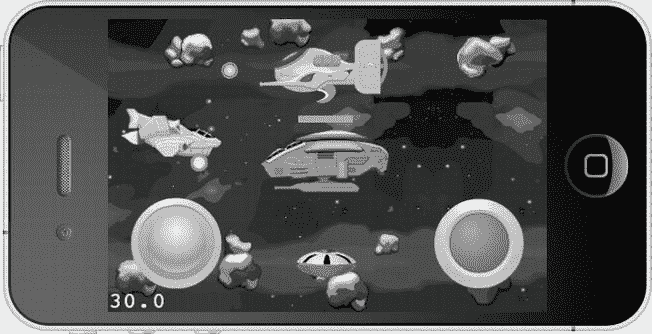

图 3-1 . 一款射击游戏


图 3-1 中的场景完全由`CCSprite`对象构成。至少这是你所能看到的。你看不到的是如何使用`CCScene`和`CCLayer`类来分组和排列各种精灵——包括多个背景层、玩家飞船、敌人、子弹以及虚拟摇杆和按钮。为了说明该场景各元素的层次关系，图 3-2 展示了该场景的分解视图。

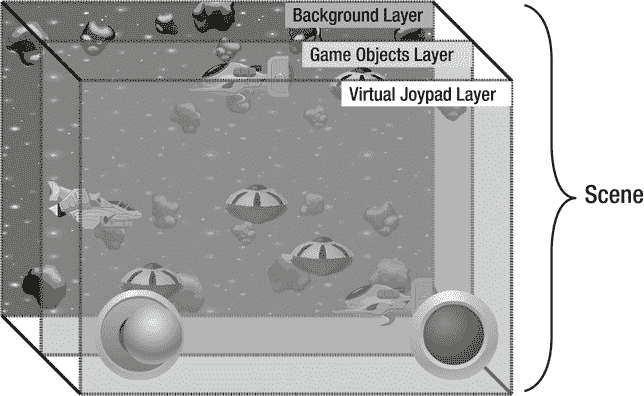

图 3-2 . 展示典型 cocos2d 游戏场景布局的分解视图

在此特定案例中，三个层有助于维持精灵之间正确的绘制顺序：背景层、游戏对象层和虚拟摇杆层。如果你想要隐藏某个层的所有节点、移动该层（从而移动其包含的所有节点），或重新排序图层以使该层的节点绘制在另一层节点的上方或后方，在场景中使用多个层也很有帮助。你甚至可以旋转和缩放一个层，这也会旋转和缩放该层包含的所有节点。这使得使用图层成为一个强大的概念。

从这个角度来看，游戏场景的建模方式就像你在 Photoshop、Seashore 或 GIMP 等图像编辑程序中编辑图像时使用图层一样。然而，每个图层中的节点（笔触）并非静态的，而是保持为独立的元素。

实际的`Scene`对象只是所有图层的容器（可以理解为实际的图像），就像图层是其他节点的容器一样。根据你组织代码的方式，其中的每个节点都可以运行自定义的游戏逻辑，包括场景、图层、单个节点、精灵、标签等等。

任何节点都可以将任何其他节点作为子节点，并且层级结构中的每个节点——除了场景本身——都有一个父对象，即该节点是其子节点的那个对象。如果你从场景图中移除了该节点，或者尚未添加它，那么它将没有父对象。请注意，节点的这种父子关系不要与面向对象编程中的继承混淆。换句话说，父节点并非节点的`super`类！

这种可以创建的树状节点层级结构被称为*场景图*，我有时也会称之为*节点层级结构*。对于熟悉编程设计模式的人来说，你会识别出这种层级结构就是组合设计模式。图 3-3 以树状结构展示了此场景的简化节点层级结构。

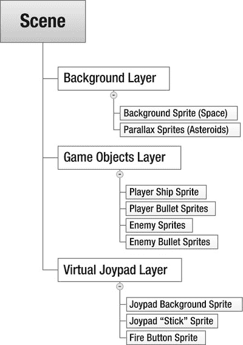

图 3-3 . 图 3-2 所示场景的节点层级结构

请注意，这种特定的场景/图层/节点结构并非 cocos2d 强制要求的，只是场景图总是有一个`CCScene`类对象作为其根节点。但除此之外，你可以使用任何`CCNode`类来代替`CCLayer`创建你的“图层”。你甚至可以将所有节点直接添加到场景自身；如果你的项目只有少量节点，这种做法完全合理。

我通常更喜欢使用普通的`CCNode`类而不是`CCLayer`来进行分层和分组对象；在大多数情况下，`CCLayer`类会带来不必要的开销，因为它包含用于在 iOS 应用中接收触摸和加速计输入，以及在 Mac OS X 应用中处理键盘和鼠标输入的代码。剥离对输入处理的支持后，`CCLayer`类实际上就只是一个`CCNode`类。`CCScene`也是如此，它本质上也只是一个抽象概念，用以强制使用一个公共的根节点类。除此之外，`CCScene`类实际上与`CCNode`类相同。

**警告** 在 cocos2d 节点层级结构中，节点是相对于其父节点进行定位的。子节点会从父节点继承某些属性，例如`scale`和`rotation`，但不会继承`color`和`opacity`。这在初次接触时可能会令人困惑。

例如，如果一个`CCLabelTTF`节点的父节点是一个非绘制节点（如`CCNode`、`CCScene`或`CCLayer`节点），并且这些父节点本身又是其他非绘制节点的唯一子节点，那么该标签的位置将相对于视图的左下角。所以，一切正常且符合预期。但是，如果你再添加另一个`CCLabelTTF`作为此标签的子节点，那么该子标签的位置将相对于父标签。你可能会认为子标签会居中于父标签的位置。然而，情况并非如此，如图 3-4 所示。你会发现子标签反而会居中于父标签纹理的左下角，这是 cocos2d 设计中的一个不幸的怪异之处。要正确定位此类节点并使其居中于父节点，你必须使用父节点的`contentSize.width / 2`和`contentSize.height / 2`作为子节点的`position.x`和`position.y`。

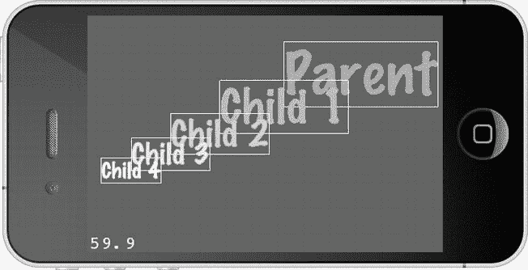

图 3-4 . 警告：子节点的默认位置会意外地偏离其父节点的位置

我创建了 NodeHierarchy 项目，旨在为你提供父子关系中节点相对定位和旋转的示例，并帮助你熟悉 cocos2d 节点层级结构。你可以将其视为自己进行试验的测试平台。

## `CCNode` 类层级结构

现在，你可能想知道哪些类派生自`CCNode`。图 3-5 展示了`CCNode`类的层级结构。你最常使用的节点类已被高亮显示，仅凭这些类你就可以制作出相当令人印象深刻的游戏。我将很快解释最重要的几个类，随着本书内容的展开，你甚至会深入了解那些较为冷门的类。

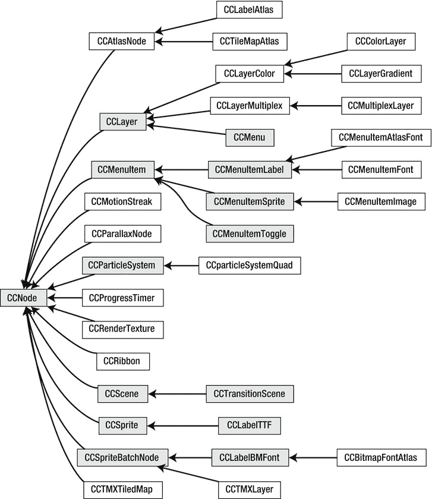

图 3-5 . `CCNode` 类层级结构

### `CCNode`

`CCNode`是所有节点的基类。它是一个没有可视化表示的抽象类，定义了所有节点共有的属性和方法。

### 使用节点

`CCNode`类实现了所有添加、获取和移除子节点的方法。以下是一些使用子节点的方法：

*   你可以创建一个新节点：
    `CCNode* childNode = [CCNode node];`

*   你可以将新节点添加为子节点：
    `[myNode addChild:childNode z:0 tag:123];`

*   你可以检索子节点：
    `CCNode* retrievedNode = [myNode getChildByTag:123];`

*   你可以通过标签移除子节点；`cleanup`也会停止任何正在运行的动作：
    `[myNode removeChildByTag:123 cleanup:YES];`

*   如果你有指向该节点的指针，可以移除它：
    `[myNode removeChild:retrievedNode];`

*   你可以移除该节点的所有子节点：
    `[myNode removeAllChildrenWithCleanup:YES];`

*   你可以将`myNode`从其父节点中移除：
    `[myNode removeFromParentAndCleanup:YES];`

`addChild`中的`z`参数决定了节点的绘制顺序。`z`值最低的节点最先绘制；`z`值最高的节点最后绘制。如果多个节点具有相同的`z`值，它们将简单地按照添加的顺序绘制。当然，这仅适用于具有可视化表示的节点，例如精灵。

`tag`参数允许你在之后使用`getChildByTag`方法识别和获取特定的节点。

**注意** 如果有几个节点的标签号相同，`getChildByTag`将返回具有该标签号的第一个节点。其余节点将无法访问。请确保为你的节点使用唯一的标签号。


注意，操作（actions）也可以有标签。节点标签和操作标签不会冲突，因此一个操作和一个节点可以使用相同的标签编号而没有任何问题。

## 使用操作

节点也可以运行动作。稍后我会更详细地介绍动作。现在，你只需要知道动作可以移动、旋转和缩放节点，并且可以随着时间的推移对节点执行其他操作。

*   这是一个动作声明：
    `CCAction* action = [CCBlink actionWithDuration:10 blinks:20]; action.tag = 234;`

*   运行动作会使节点闪烁：
    `[myNode runAction:action];`

如果你稍后需要访问该动作，可以通过其标签获取：
    `CCAction* retrievedAction = [myNode getActionByTag:234];`

*   你可以通过标签停止动作：
    `[myNode stopActionByTag:234];`

*   或者你可以通过指针停止它：
    `[myNode stopAction:action];`

*   或者你可以停止该节点上的所有动作：
    `[myNode stopAllActions];`

## 调度消息

节点可以调度消息，这是 Objective-C 中用于调用方法的术语。在许多情况下，你希望节点上运行一个特定的更新方法以执行某些处理，例如检查碰撞。让特定更新方法每帧都被调用的最简单方法如下，通常写在节点的`init`方法中：

```
[self scheduleUpdate];
```

如果一个节点已调度了`update`方法，它将每帧向你的类发送`update`消息。你必须在你的节点类中实现此特定方法：

```
-(void) update:(ccTime)delta
{
    // 此方法每帧被调用
}
```

非常简单，不是吗？请注意，`update`方法有一个固定的签名，意味着它总是以这种方式定义。`delta`参数是自上次调用该方法以来经过的时间。这是调度每帧都应发生的更新的首选方式，但也有一些原因让你使用其他更灵活的更新方法。

如果你想运行一个不同的方法，或者你不想让该方法每帧都被调用，而是每十分之一秒调用一次，你应该使用这个方法：

```
[self schedule:@selector(updateTenTimesPerSecond:) interval:0.1f];
```

这将每秒向你的节点类发送十次`updateTenTimesPerSecond`消息：

```
-(void) updateTenTimesPerSecond:(ccTime)delta
{
    // 此方法根据其间隔被调用，每秒十次
}
```

请注意，如果`interval`为 0，你应该使用`scheduleUpdate`方法，因为它稍微快一点。它更快是因为`cocos2d`对通过`scheduleUpdate`调度的常见更新选择器进行了优化，而所有其他已调度的选择器会带来额外的开销，因为它们存储在列表中并相互排序。

该方法的签名仍然相同：它接收一个增量时间作为其唯一参数。但这次方法可以任意命名，并且它仅每十分之一秒被调用一次。这在检查胜利条件时可能很有用，特别是当它们非常复杂以至于你不想每帧都运行时。或者，如果你希望某事在 10 分钟后发生，你可以调度一个间隔为 600 的选择器。

每个选择器每个对象只能被调度一次。如果你为同一个对象第二次调度同一个选择器，`cocos2d`会打印出警告，告诉你该选择器已被调度，并且其间隔已更新。

**注意**  `@selector(...)`语法可能看起来很奇怪。这是 Objective-C 中按名称引用特定方法的方式。这里关键的是不要忽略末尾的冒号。它告诉 Objective-C 查找具有给定名称且恰好有一个参数的方法。如果你忘记在末尾添加冒号，程序仍然会编译，但稍后会崩溃。在调试器控制台中，错误日志将显示“unrecognized selector sent to instance...”。

`@selector(...)`中的冒号数量必须始终与方法参数的数量和名称匹配。对于以下方法：`-(void) example:(ccTime)delta sender:(id)sender flag:(bool)aBool`，相应的`@selector`应该写成：`@selector(example:sender:flag:)`

调度你自己的选择器以及使用`@selector(...)`关键字有一个主要的陷阱。默认情况下，如果方法名不存在，编译器根本不会报错。相反，你的应用程序会直接崩溃，并显示“unrecognized selector sent to instance”错误。因为消息是由`cocos2d`内部发送的，你会发现很难找出问题的原因。幸运的是，你可以启用一个编译器警告。图 3-6 显示了为 NodeHierarchy 项目启用了“Undeclared Selector”警告，本章的`Essentials` Xcode 项目也启用了该警告。


图 3-6. 激活构建设置以警告未声明的选择器

剩下的就是展示如何停止这些已调度的方法被调用。你可以通过取消调度来实现：

*   你可以停止节点的所有已调度选择器：
    `[self unscheduleAllSelectors];`
*   你可以取消默认的`update`方法调度：
    `[self unscheduleUpdate];`
*   你可以停止一个特定的选择器，在本例中是`updateTenTimesPerSecond`方法：
    `[self unschedule:@selector(updateTenTimesPerSecond:)];`

还有一个调度和取消调度选择器的有用技巧。你经常会发现，在已调度的方法中，你希望某个特定方法不再被调用，而无需复制确切的方法名和参数数量，因为它们可能会改变。以下是你如何运行一个已调度的选择器并在第一次调用时停止它的方法：

```
[self scheduleOnce:@selector(tenMinutesElapsed:) delay:600];
```

这与照常调度选择器是相同的：

```
[self schedule:@selector(tenMinutesElapsed:) interval:600];
```

然后在已调度的方法内部使用`_cmd`变量作为选择器来取消调度：

```
-(void) tenMinutesElapsed:(ccTime)delta
{
    // 使用 _cmd 关键字取消当前方法的调度
    [self unschedule:_cmd];
}
```

隐藏变量`_cmd`在所有 Objective-C 方法中都是可用的。它是当前方法的选择器。在前面的代码示例中，`_cmd`等同于写`@selector(tenMinutesElapsed:)`。取消调度`_cmd`有效地阻止了`tenMinutesElapsed`方法再次被调用。如果你想在当前方法被重新调度的情况下，你也可以一开始就使用`_cmd`来调度选择器。假设你需要一个以不同时间间隔调用的方法，并且每次调用该方法时这个间隔都会改变。在这种情况下，你的代码可以像这样使用`_cmd`：

```
-(void) scheduleUpdates
{
    // 像往常一样调度第一次更新
    [self schedule:@selector(irregularUpdate:) interval:1];
}
```

```
-(void) irregularUpdate:(ccTime)delta
{
    // 首先取消该方法的调度，这样 cocos2d 就不会报错
    [self unschedule:_cmd];
```

```
    // 我假设你会使用某种逻辑（而不是随机）来确定
    // 下次调用该方法的时间
    float nextUpdate = CCRANDOM_0_1() * 10;
```

```
    // 然后使用 _cmd 作为选择器以新的间隔重新调度它
    [self schedule:_cmd interval:nextUpdate];
}
```

从长远来看，使用`_cmd`关键字会为你节省很多麻烦，因为它避免了调度或取消调度错误选择器这个棘手的问题，并将代码与了解其所使用方法的名字解耦。

我将提及最后一个调度问题，那就是更新优先级。看一下下面的代码：

```
// 在节点 A 中
[self scheduleUpdate];
```

```
// 在节点 B 中
[self scheduleUpdateWithPriority:1];
```


```c
// 在节点 C 中
[self scheduleUpdateWithPriority:-1];
```

这可能需要一点时间来理解。所有节点仍然在调用各自的 `–(void) update:(ccTime)delta` 方法。然而，通过优先级来调度更新方法，会使得节点 C 的方法优先执行。接着调用节点 A 的方法，因为默认情况下`scheduleUpdate`使用的优先级为 0。节点 B 的更新方法最后被调用，因为它拥有最大的优先级数值。更新方法按优先级从低到高的顺序被调用。

你可能会疑惑这有什么用处。老实说，这种情况很少用到，但在某些场景下，能够对更新进行优先级排序非常有用，例如在物理模拟更新之前或之后对物理对象施加力，或者确保只有在所有游戏对象都运行完其`update`方法后才检查游戏结束条件。有时候，通常是在项目后期，你可能会发现一个奇怪的 bug，结果发现是时序问题，这迫使你将玩家的更新方法放在所有其他对象更新完之后再执行。

在你需要借助优先级更新来解决特定问题之前，可以放心地忽略它们。此外，请记住，每个按优先级排序的更新方法调用都会增加一些额外开销，因为这些方法需要按特定顺序调用。一种相当常见的优先级更新实现方式是：设置一个中心对象，通过按所需顺序将更新方法转发给其他对象，来驱动其他对象的游戏更新。这样，你也能在代码中清晰地看到哪个对象在何时被调用：

```objectivec
-(void) update:(ccTime)delta
{
   [inputHandler update:delta];
   [player update:delta];
   [enemies update:delta];
   [physics update:delta];
   [networkData update:delta];
   [userInterface update:delta];
}
```

这种方法的一个好处是，它可以更轻松地选择性地暂停某些对象。如何暂停游戏，同时允许在暂停菜单上进行用户输入，这是一个经常被问及的问题。解决方案是分别更新你的各个层，如果游戏暂停，则除了显示暂停菜单的层之外，不向其他层转发更新消息。

## 导演、场景和层

与`CCNode`类似，`CCScene`和`CCLayer`类没有可视化的表现，它们内部作为抽象概念使用，是场景图的起点，这个起点始终是一个`CCScene`派生类对象。`CCScene`类是场景中所有其他节点的容器。而`CCLayer`通常用于将节点分组，特别是为了在多个层之间维持正确的绘制顺序。同时，它也在 iOS 上接收触摸和加速计输入，在 Mac OS X 上接收鼠标和键盘输入。

不过，我以`CCDirector`类开始本节内容，因为它除了其他功能外，还允许你运行和替换场景。

### 导演

`CCDirector`类，或简称为导演，是 cocos2d 游戏引擎的核心。如果你还记得第 2 章中的“Hello World”应用，就会想起许多 cocos2d 初始化过程都涉及对`[CCDirector sharedDirector]`的调用。

`CCDirector`类是一个单例，这意味着任何时候都只能存在一个`CCDirector`类的实例，并且可以通过调用类方法`sharedDirector`全局访问它。目前，这就是你需要了解的单例的全部内容。在本章稍后的“关于 cocos2d 中单例的说明”部分，我会解释什么是单例以及 cocos2d 还使用了哪些其他单例类。

`CCDirector`类存储了 cocos2d 的全局配置设置，同时也管理着 cocos2d 的场景。`CCDirector`类的主要职责包括以下内容：

*   提供对当前运行场景的访问
*   切换场景
*   提供对 cocos2d 配置细节的访问
*   提供对 cocos2d 的 OpenGL 视图和窗口的访问
*   修改某些 OpenGL 投影并启用深度测试
*   转换 UIKit 和 OpenGL 坐标
*   暂停、恢复和结束游戏
*   显示调试统计信息
*   统计已渲染的总帧数

在早期的 cocos2d 版本中，你还可以在几种导演类型之间进行选择。但在 cocos2d 2.0 中情况已不再如此。`CCDirector`现在专门使用苹果的`CADisplayLink`类来使屏幕更新与显示器的刷新率同步。

### CCScene

`CCScene`对象始终是场景图中的第一个节点。在 cocos2d 中，场景是一个抽象概念，`CCScene`类与`CCNode`相比几乎不包含额外的代码。但`CCDirector`需要一个`CCScene`派生类，才能通过`CCDirector`的`runWithScene`、`replaceScene`和`pushScene`方法来更改当前活跃的场景图。你也可以将一个`CCScene`类包装到一个派生自`CCSceneTransition`的类中，以便在当前运行场景和新场景之间添加过渡动画。

通常，`CCScene`的唯一子节点是那些派生自`CCLayer`的节点，而`CCLayer`又包含着各个游戏对象，尽管 cocos2d 并不强制要求遵循这一惯例。由于场景对象本身在大多数情况下不包含任何游戏特定的代码，并且很少被子类化，因此它通常是在`CCLayer`对象内部的一个静态方法`+(id) scene`中创建的。我在第 2 章中提到过这个方法，但这里再次提出来以唤起你的记忆：

```objectivec
+(id) scene
{
   CCScene *scene = [CCScene node];
   CCLayer* layer = [HelloWorld node];
   [scene addChild:layer];

   return scene;
}
```

你第一次创建场景的地方是在应用委托的`applicationDidFinishLaunching`方法末尾。你通过 Director 使用`runWithScene`方法来启动第一个场景：

```objectivec
// 仅用于运行第一个场景
[[CCDirector sharedDirector] runWithScene:[HelloWorld scene]];
```

对于所有后续的场景切换，你必须使用名称贴切的`replaceScene`方法来替换现有场景：

```objectivec
// 使用 replaceScene 切换所有后续场景
[[CCDirector sharedDirector] replaceScene:[HelloWorld scene]];
```

正如你将在接下来的章节中学到的，你还可以在替换场景时使用过渡效果。下面是一个例子，使用`CCTransitionShrinkGrow`类作为管理过渡动画的中间场景：

```objectivec
CCScene* scene = [HelloWorld scene];
CCSceneTransition* tran = [CCTransitionShrinkGrow transitionWithDuration:2 scene:scene];
[[CCDirector sharedDirector] replaceScene:tran];
```

**警告** 如果在`HelloWorld scene`中运行上述代码，它将会正常工作，创建一个新的`HelloWorld`实例并替换掉旧的实例，从而有效地重新加载场景。但是，不要试图通过将`self`作为参数传递给`replaceScene`来重新加载当前场景。这会导致游戏卡死或崩溃！

### 场景与内存

请记住，当你用一个场景替换另一个场景时，新场景会在旧场景内存被释放之前加载到内存中。这会造成内存使用的短暂峰值。替换场景始终是一个关键点，你可能会在此遇到内存警告，或者直接因可用内存不足而崩溃。当你的应用占用大量内存时，你应该尽早并经常测试场景切换。

**注** 当你用一个场景替换另一个场景时，cocos2d 在清理自身内存方面做得很好。它会移除所有节点、停止所有动作并取消调度所有选择器。你无需执行任何额外工作。我提到这一点是因为有时我会看到一些代码显式调用了 cocos2d 的`removeAll`和`cleanup`方法。请记住，如有疑问，请相信 cocos2d 的内存管理。


当你开始使用转场时，这个问题会变得更加明显。使用转场时，新的场景会被创建，转场开始运行，只有当转场完成其工作后，旧的场景才会从内存中移除。一个好的做法是在你的场景或创建场景的层中添加日志语句：

```objective-c
-(id) init
{
   self = [super init];
   if (self)
   {
     CCLOG(@"%@: %@", NSStringFromSelector(_cmd), self);
   }
}
```

```objective-c
-(void) dealloc
{
   CCLOG(@"%@: %@", NSStringFromSelector(_cmd), self);
}
```

密切关注这些日志信息。如果你注意到当你从一个场景切换到另一个场景时，`dealloc`日志信息从未被发送过，那是一个巨大的警告信号。在这种情况下，你泄漏了整个场景，并没有释放其内存。在使用 ARC 时，这种情况极其罕见，但仍有可能发生——例如，如果你将场景赋值给一个自定义类的属性，比如视图控制器或单例，其生命周期不与 cocos2d 场景绑定。在这种情况下，场景可能被替换但并未从内存中移除，因为自定义类仍然持有对场景的引用。你最容易遇到这个问题的情况是将节点对象作为 UIKit 类的代理（delegate）时，例如 Game Center。在替换场景之前，务必格外小心地将任何代理设置为`nil`。

有一件事你绝对不应该做，那就是将一个节点添加为场景图的子节点，然后将此节点传递给另一个节点，而后者又持有对它的引用。循环引用——对象 A 持有对象 B，而对象 B 本身又持有对对象 A 的引用——在 ARC 下仍然是可能的。在这些情况下，两个对象互不释放，导致它们一直驻留在内存中，直到应用被关闭。

请改用 cocos2d 的方法来访问节点对象。只要你让 cocos2d 来管理节点的内存，就不会有问题。

## 压入和弹出场景

关于场景切换，`Director`的`pushScene`和`popScene`方法可以成为有用的工具。它们运行新场景，但不将旧场景从内存中移除。如果你把你的场景想象成一张张纸，压入场景意味着在当前可见的那张纸上面添加一张新的纸。与替换场景不同，下面的那张纸会保持在原位并留在内存中。对于每个压入的场景，你随后需要调用`popScene`（就像移除最上面的那张纸），直到只剩下最初的场景。

其理念是让场景切换更快。但这里有一个难题：如果你的场景足够轻量级以便于彼此共享内存，那么它们无论如何加载都会很快。而如果它们很复杂，因此加载缓慢，它们很可能会占用彼此宝贵的内存——内存使用量可能会迅速攀升至临界水平。

`pushScene`和`popScene`最大的问题在于，你需要跟踪压入了多少个场景，以便弹出确切的数量。如果你对管理压入和弹出操作不太小心，最终可能会忘记一次弹出，或者多弹出了一个场景。此外，所有这些场景都必须共享同一块内存。

在某些情况下，`pushScene`和`popScene`非常方便。一种情况是，你有一个在许多地方都会用到的通用场景，例如可以更改音乐和音量的“设置”屏幕。你可以压入“设置”场景来显示它，而它的“返回”按钮只需调用`popScene`；游戏将回到之前的状态。无论你是从主菜单、游戏中还是其他地方打开“设置”菜单，这种技术都适用良好，并且可以避免你跟踪“设置”菜单是从哪里打开的。

另一种`pushScene`和`popScene`非常有用的场景是，你想要保留初始场景的状态，而无需依赖保存和加载该场景的状态。例如，你可以压入一个用于显示多人游戏中当前排行榜的场景，然后将其弹出，而无需保存和加载游戏状态，因为游戏场景仍在内存中。而且，当玩家查看排行榜时，游戏并未继续推进，因为当排行榜场景可见时，游戏场景会自动暂停。

然而，你需要确保在任何可能压入场景的时刻，对于被压入的场景，始终有足够多的额外可用内存，这很难测试。因此，任何你想要压入的场景都应当非常轻量级，消耗很少的内存，并且只应弹出自（`pop`）自身，而绝不应压入其他场景，甚至调用`replaceScene`。

例如，要从任何地方在当前场景之上显示一个“设置”场景，请使用以下代码：

```objective-c
[[CCDirector sharedDirector] pushScene:[Settings scene]];
```

现在，在“设置”场景内部，当你想要返回到仍在内存中的上一个场景时，你需要调用`popScene`：

```objective-c
[[CCDirector sharedDirector] popScene];
```

**注意** 你只能使用`CCSceneTransition`为`pushScene`添加动画，而不能为`popScene`添加动画。这是压入和弹出场景的一个缺点，你应该了解。

## CCTransitionScene

转场，即任何派生自`CCTransitionScene`的类，可以让你的游戏看起来非常专业。图 3-7 为你展示了`CCTransitionScene`类的层次结构以及可用的转场类。图 3-7 也补充了图 3-5 中的`CCNode`类层次结构，在图 3-5 中，为了清晰起见，没有包含`CCTransitionScene`的子类。

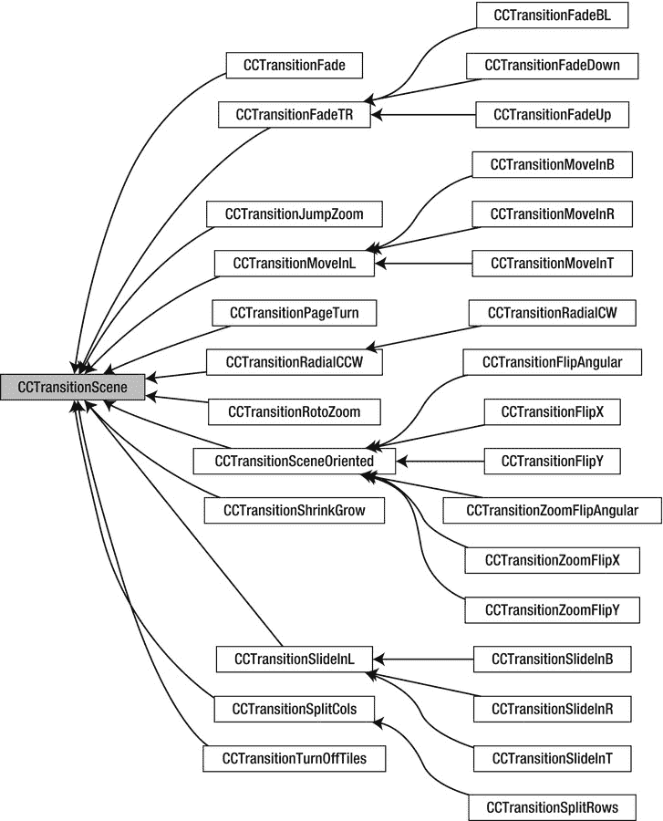

图 3-7. CCTransitionScene 类层次结构

**注意** 并非所有转场在游戏中都真正有用，尽管它们看起来都很不错。玩家最关心的是转场的速度。即使等待两秒才能与下一个场景交互，也是一种很大的折磨；我倾向于在一秒或更短时间内完成场景转场，或者如果情况合适，就完全避免使用转场。

你绝对应该避免的是在替换场景时随机选择转场。玩家不关心这个，而游戏开发者知道，你只是对转场有多酷感到有点过于兴奋了。如果你不知道某个特定的场景切换应该使用哪种转场，那就什么也别用。换句话说，仅仅因为你能够做到，并不意味着你应该去做。

转场只为替换场景增加了一行代码，尽管不可否认，考虑到转场的名称有多长，以及它们经常需要的参数数量使名称变得更长，那一行代码可能会很长。下面是一个非常流行的淡入淡出转场的例子；它会在一秒内淡出到白色：

```objective-c
// 使用我们接下来想要显示的场景来初始化一个转场场景
CCTransitionFade* tran = [CCTransitionFade transitionWithDuration:1
            scene:[HelloWorld scene]
            withColor:ccWHITE];
// 使用转场场景对象，而不是 HelloWorld
[[CCDirector sharedDirector] replaceScene:tran];
```

你可以将`CCTransitionScene`与`replaceScene`和`pushScene`一起使用，但如前所述，你不能将转场与`popScene`一起使用（至少目前不能——这在未来版本的 cocos2d 中可能会得到改进）。

目前有多种可用的转场，尽管大多数只是方向上的变化——例如，转场移动到哪个方向或从哪一侧开始。以下是当前可用转场的列表，并附有简短描述：


- `CCTransitionFade`: 淡出到特定颜色并返回。此外还有`CCTransitionCrossFade`变体。
- `CCTransitionFadeTR`（另有三种变体）：瓦片翻转以显示新场景。
- `CCTransitionJumpZoom`：场景弹跳并缩小；新场景则以相反的动作出现。
- `CCTransitionMoveInL`（另有三种变体）：当前场景移出，新场景同时从左侧、右侧、顶部或底部移入。
- `CCTransitionSceneOriented`（六种变体）：多种围绕场景轴翻转并可选择缩放整个场景的过渡效果。
- `CCTransitionPageTurn`：类似翻书页的效果。
- `CCTransitionProgress`（六种变体）：如同雷达屏幕，通过径向或轴对齐的擦除动画揭示新场景。
- `CCTransitionRotoZoom`：场景旋转并缩小；新场景则以相反的动作出现。
- `CCTransitionShrinkGrow`：当前场景缩小，新场景在其上方放大。
- `CCTransitionSlideInL`（另有三种变体）：新场景从左侧、右侧、顶部或底部滑入到当前场景之上。
- `CCTransitionSplitCols`（一种变体）：场景的列向上或向下移动以显示新场景。
- `CCTransitionTurnOffTiles`：瓦片被新场景的瓦片随机替换。

## `CCLayer`

有时你需要在一个场景中包含多个层。在这种情况下，你可以将更多的`CCLayer`对象添加到你的场景中。一种方法是直接在`scene`方法中执行：

```
+(id) scene
{
   CCScene* scene = [CCScene node];
```

```
   CCLayer* backgroundLayer = [HelloWorldBackground node];
   [scene addChild: backgroundLayer];
```

```
   CCLayer* layer = [HelloWorld node];
   [scene addChild:layer];
```

```
   CCLayer* userInterfaceLayer = [HelloWorldUserInterface node];
   [scene addChild: userInterfaceLayer];
```

```
   return scene;
}
```

现在这个场景拥有了三个不同的层：`backgroundLayer`、常规的游戏对象`layer`，以及位于其上的`userInterfaceLayer`。由于层是按创建顺序添加到场景中的，因此添加到`backgroundLayer`的任何节点都会被绘制在其他层的后面。同样，添加到`userInterfaceLayer`的节点将始终绘制在`layer`和`backgroundLayer`中任何节点的上方。

**提示** 同样，严格来说，一个层并非必须派生自`CCLayer`类；它也可以是一个简单的`CCNode`。当你只需要该层来组合节点并且不需要它处理用户输入时，这通常是更可取的做法。

你可能需要为每个场景使用多个层的一种情况是，当你有一个滚动的背景和一个包围背景的静态框架，可能还包括用户界面元素时。使用两个独立的层，只需调整层的位置即可轻松移动背景层，而前景层则保持不动。此外，同一层上的所有对象将始终位于另一层对象的前面或后面，具体取决于层的`z`顺序。当然，不使用层也能达到相同的效果，但这需要单独移动背景中的每个独立对象。这样做效率低下，因此应尽量避免。

与场景一样，层具有与`cocos2d` OpenGL 视图相同的尺寸。对于 iOS 设备，这几乎总是屏幕的尺寸；在 Mac OS X 上，则是窗口的尺寸。

层主要是一个分组概念。例如，你可以对层使用任何动作，该动作将影响该层上的所有对象。这意味着你可以统一地移动层上的所有对象，或者同时旋转和缩放它们。一般来说，如果你需要一组对象执行相同的动作和行为，请使用层。移动所有对象以滚动它们就是这样一个例子；有时你可能需要旋转它们或重新排序它们，以便它们绘制在其他对象之上。如果所有这些对象都是一个层的子对象，你可以简单地更改层的属性或在层上运行动作，从而影响其所有子节点。

**注意** 许多人建议不要在单个场景中使用太多`CCLayer`对象。这个建议经常被误解。你可以使用任意数量的层，而不会比使用任何其他节点对性能造成更多影响。但是，如果该层也接受输入，情况就不同了，因为触摸或加速计事件是开销很大的任务。不要同时使用多个接收触摸或加速计输入的层——一个就够了。理想情况下，一个层负责接收和处理输入，并在必要时通过将事件转发给已注册的对象来通知其他节点或类。通常，你可以通过`performSelector`方法来实现，该方法会调用一个具有已定义方法签名的方法。有关示例实现，请参阅`cocos2d`的`CCScheduler`类。

### 接收触摸事件

`CCLayer`类被设计为接收触摸输入，但前提是你显式地启用它。要启用接收触摸事件，请将`isTouchEnabled`属性设置为`YES`：

```
self.isTouchEnabled = YES;
```

这最好在类的`init`方法中完成，但你可以在任何时候更改它。

一旦设置了`isTouchEnabled`属性，一系列用于接收触摸输入的方法将被调用。这些是在新触摸开始时、手指在触摸屏上移动时以及用户将手指从屏幕上抬起时接收到的事件。取消触摸的情况很少见，在大多数情况下你可以安全地忽略此方法，或者简单地将其转发给`ccTouchesEnded`方法。

-   当手指刚开始触摸屏幕时调用：
    `-(void) ccTouchesBegan:(NSSet *)touches withEvent:(UIEvent *)event`

-   每当手指在屏幕上移动时调用：
    `-(void) ccTouchesMoved:(NSSet *)touches withEvent:(UIEvent *)event`

-   当手指从屏幕抬起时调用：
    `-(void) ccTouchesEnded:(NSSet *)touches withEvent:(UIEvent *)event`

-   在取消触摸时调用：
    `-(void) ccTouchesCancelled:(NSSet *)touches withEvent:(UIEvent *)event`

取消事件很少见，在大多数情况下其行为应类似于触摸结束。

在很多情况下，你需要知道触摸发生的位置。由于触摸事件是由 Cocoa Touch API 接收的，因此必须将该位置转换为 OpenGL 坐标。以下方法可以为你完成此操作：

```
-(CGPoint) locationFromTouches:(NSSet *)touches
{
   UITouch *touch = touches.anyObject;
   CGPoint touchLocation = [touch locationInView:touch.view];
   return [[CCDirector sharedDirector] convertToGL:touchLocation];
}
```

此方法仅适用于单点触摸，因为它使用了`[touches anyObject]`。要跟踪多点触摸的位置，你必须单独跟踪每个触摸。

默认情况下，该层接收与 Apple 的`UIResponder`类相同的事件。`Cocos2d`也支持目标触摸处理器。区别在于，目标触摸处理器一次只接收一个触摸，而`UIResponder`触摸事件总是接收一组触摸。目标触摸处理器只是将这些触摸拆分为单独的事件，根据游戏的需求，这可能更容易处理。更重要的是，目标触摸处理器允许你从事件队列中移除某些触摸，表示你已经处理了这个触摸，并且不希望它被转发给其他层。这使得判断触摸是否在屏幕的特定区域内变得容易；如果是，你将触摸标记为已处理，所有其他层则无需再次执行此区域检查。

要启用目标触摸处理器，请将以下方法添加到你的层类中：

```
-(void) registerWithTouchDispatcher
{
   [[CCDirector sharedDirector].touchDispatcher addTargetedDelegate:self
            priority:INT_MIN+1
            swallowsTouches:YES];
}
```


**注意**：如果留空 `registerWithTouchDispatcher` 方法，你将完全无法接收任何触摸事件！若想保留该方法但同时使用默认处理器，则必须在此方法中调用 `[super registerWithTouchDispatcher]`。值得注意的是，`registerWithTouchDispatcher` 方法仅在 `CCLayer` 类中被调用。你也可以将非 `CCLayer` 节点添加为触摸委托，但此时必须在后续适时调用 `[[CCDirector sharedDirector].touchDispatcher removeDelegate:self]`。

现在，你使用了一组与默认触摸输入方法略有区别的方法。它们几乎等价，区别在于第一个参数接收的是 `(UITouch*) touch` 而非 `(NSSet*) touches`：

```
-(BOOL) ccTouchBegan:(UITouch *)touch withEvent:(UIEvent *)event {}
-(void) ccTouchMoved:(UITouch *)touch withEvent:(UIEvent *)event {}
-(void) ccTouchEnded:(UITouch *)touch withEvent:(UIEvent *)event {}
-(void) ccTouchCancelled:(UITouch *)touch withEvent:(UIEvent *)event {}
```

此处需注意：`ccTouchBegan` 返回一个 `BOOL` 值。若在该方法中返回 `YES`，则表示你不希望此特定触摸事件传播给优先级更低的其他目标触摸处理器——即有效“吞没”了该触摸。

**注意**：Cocos2d 未内置手势识别支持，但 Kobold2D 通过 `KKInput` 类支持所有手势识别器类型，只需编写 `[KKInput sharedInput].gesturePanEnabled = YES`，即可随时检查手势的状态和属性。对于 cocos2d，此论坛帖子是手势识别器实现的良好起点：`www.cocos2d-iphone.org/forum/topic/8929`。

### 接收加速计事件

与触摸输入类似，必须专门启用加速计才能接收加速计事件：

```
self.isAccelerometerEnabled = YES;
```

再次，你需在图层中添加一个特定方法来接收加速计事件：

```
-(void) accelerometer:(UIAccelerometer *)accelerometer
            didAccelerate:(UIAcceleration *)acceleration
{
    CCLOG(@"acceleration:x:%f/y:%f/z:%f", ←
     acceleration.x, acceleration.y, acceleration.z);
}
```

你可以使用 `acceleration` 参数来确定任意三个方向上的加速度。

**提示**：Kobold2D 中的 `KKInput` 类不仅处理加速计输入，还提供了陀螺仪的简单接口。对于加速计和陀螺仪，你可以通过属性访问高通和低通滤波后的值。

### 接收键盘事件

如果你正在开发 Mac OS X 应用，则需要能够处理键盘按键。首先必须启用键盘事件：

```
self.isKeyboardEnabled = YES;
```

接收键盘事件的回调方法定义在 `CCKeyboardEventDelegate` 协议中，如下所示：

```
-(BOOL) ccKeyDown:(NSEvent*)event
{
   CCLOG(@"key pressed: %@", event.characters);
}
```

```
-(BOOL) ccKeyUp:(NSEvent*)event
{
   CCLOG(@"key released: %@", event.characters);
}
```

```
-(BOOL) ccFlagsChanged:(NSEvent*)event
{
   CCLOG(@"flags changed: %@", event.characters);
}
```

当用户按下或释放修饰键时，无论是否同时按下其他键，都会收到标志改变事件。你可以利用它实现直接分配给修饰键的控制方式。

一个非常简单的键盘事件检查（用于响应 D 键的按下或释放）大致如下：

```
NSString* key = event.charactersIgnoringModifiers;
if ([key caseInsensitiveCompare:@"d"] == NSOrderedSame)
{
    CCLOG(@"D key");
}
```

这种方法的问题在于：根据用户的区域设置，按键可能位于键盘的不同位置，甚至可能需要同时按下 Option 键。此外，在亚洲、俄罗斯或中东等许多地区，用户可能无法（轻松地）在键盘上生成 D 键。

因此，Kobold2D 支持基于键码的独立于区域设置的键盘输入。你可以这样检查 D 键是否在 Kobold2D 中被按下：

```
[[KKInput sharedInput] isKeyDownThisFrame:KKKeyCode_D];
```

无论用户是否按下了 Shift 键，此方法均有效。若要同时检查 Shift 键，只需编写：

```
KKInput* input = [KKInput sharedInput];
[input isKeyDownThisFrame:KKKeyCode_D modifierFlags:KKModifierShiftKeyMask];
```

Kobold2D 用户无需深入研究此主题，因为 Kobold2D 已提供了可靠且文档完善的键盘和鼠标输入实现：`www.kobold2d.com/display/KKDOC/Processing+User+Input`。但 cocos2d 用户可以在本论坛帖子中了解有关键盘事件处理的更多信息：`www.cocos2d-iphone.org/forum/topic/11725`。Apple 关于处理键事件的文档也很有帮助：`http://developer.apple.com/library/mac/#documentation/cocoa/conceptual/EventOverview/HandlingKeyEvents/HandlingKeyEvents.html`。

### 接收鼠标事件

与所有其他输入方法类似，首先必须通过以下方式启用鼠标输入：

```
self.isMouseEnabled = YES;
```

之后，你的图层将开始接收 `CCMouseEventDelegate` 协议消息，这些消息相当丰富：

```
// 当鼠标移动且未按下任何按钮时触发
-(BOOL) ccMouseMoved:(NSEvent*)event {}
```

```
// 当鼠标移动且对应按钮被按住时触发
-(BOOL) ccMouseDragged:(NSEvent*)event {}
-(BOOL) ccRightMouseDragged:(NSEvent*)event {}
-(BOOL) ccOtherMouseDragged:(NSEvent*)event {}
```

```
// 当相应鼠标按钮被按下时触发（左键、右键、其他）
-(BOOL) ccMouseDown:(NSEvent*)event {}
-(BOOL) ccRightMouseDown:(NSEvent*)event {}
-(BOOL) ccOtherMouseDown:(NSEvent*)event {}
```

```
// 当相应鼠标按钮被释放时触发（左键、右键、其他）
-(BOOL) ccMouseUp:(NSEvent*)event {}
-(BOOL) ccRightMouseUp:(NSEvent*)event {}
-(BOOL) ccOtherMouseUp:(NSEvent*)event {}
```

```
// 当滚轮转动时触发
-(BOOL) ccScrollWheel:(NSEvent*)event {}
```

由于你能获得每个鼠标按钮的特定事件，因此主要使用 `NSEvent` 对象获取当前鼠标光标位置。你需要通过 Director 的 `convertEventToGL` 方法将该位置转换为 cocos2d 坐标：

```
CGPoint mousePos = [[CCDirector sharedDirector] convertEventToGL:event];
```

Kobold2D 用户无需进行此类转换。你可以随时检查鼠标按钮是否被按下：

```
[[KKInput sharedInput] isMouseButtonDown:KKMouseButtonLeft];
```

鼠标位置也已准备好并转换为 cocos2d 坐标，因此你可以在定期调用的方法中直接编写以下代码，将精灵用作鼠标光标：

```
sprite.position = [KKInput sharedInput].mouseLocation;
```

若要了解更多关于处理鼠标事件的内容，Apple 有一份出色的教程：`http://developer.apple.com/library/mac/#documentation/Cocoa/Conceptual/EventOverview/HandlingMouseEvents/HandlingMouseEvents.html`。

## CCSprite

`CCSprite` 无疑是最常用的类，它使用图像在屏幕上显示精灵。创建精灵的最简单方式是从文件加载，该文件会载入到 `CCTexture2D` 纹理中并分配给精灵。你需将图像文件添加到 Xcode 的 Resources 组中；否则，应用将无法找到该文件：

```
CCSprite* sprite = [CCSprite spriteWithFile:@"Default.png"];
[self addChild:sprite];
```


我来问你一个问题：你觉得这个精灵会出现在屏幕的什么位置？与其他游戏引擎不同的是，纹理将居中显示在精灵的位置上。刚刚初始化的精灵会位于 `0,0` 坐标处，因此它被放置在屏幕的左下角。由于精灵的纹理是居中于其位置的，所以纹理只能部分可见。假设图片尺寸为 80×30 像素，你需要将精灵移动到 `40,15` 的位置，才能使纹理完美对齐屏幕左下角并完全可见。

虽然乍看之下有些反常，但将纹理居中于精灵上确实有巨大的优势。一旦你开始使用精灵的旋转或缩放属性，精灵将始终保持在其位置中心。

`Warning` 在 iOS 设备上，文件名是区分大小写的。在模拟器上，文件名的大小写无关紧要，但当你在设备上进行测试时，如果文件名实际上是像 `@"default.PNG"`（来自之前的示例）这样的大小写，则很可能会导致崩溃。这种大小写敏感性已经让许多开发者头疼不已，这也是你应该经常在设备上测试的另一个原因。给文件名制定一套命名方案并坚持使用也是一个好主意。就我个人而言，我会保持文件名全小写，并在需要时用连字符来分隔单词。

## 揭秘锚点

每个节点都有一个锚点，但只有当节点包含纹理（比如 `CCSprite` 或 `CCLabelTTF`）时，它才真正发挥作用。默认情况下，`anchorPoint` 属性位于 `0.5,0.5`，换句话说，就是纹理的中心点（纹理宽度和高度乘以 `0.5`）。

锚点与节点的位置无关，尽管修改 `anchorPoint` 会改变纹理在屏幕上的渲染位置。通过修改 `anchorPoint`，你只是改变了节点纹理相对于节点位置的绘制位置。但这也会引发一个问题：为什么你想要修改 `anchorPoint`，这样做又能实现什么效果呢？

例如，将 `anchorPoint` 设置为 `0,0`，实际上会将纹理移动，使其左下角与节点的位置对齐。如果你将 `anchorPoint` 设置为 `1,1`，那么纹理的右上角将与节点的位置对齐。有时，这对于将纹理与屏幕边框或其他元素对齐很有用；具体来说，它作为一种方法，可用于实现 `CCLabel` 类的文本右对齐或顶部对齐。

通常，除非你有充分的理由，否则不要修改 `anchorPoint`，因为它可能产生广泛影响，例如使基于位置的碰撞检测发生偏移。它还会影响旋转和缩放，因为纹理将不再围绕其中心点进行旋转或缩放。

我知道有三种情况下修改锚点可能是有帮助的：

1.  更轻松地将节点与屏幕窗口边框对齐。
2.  使标签、按钮或图片实现右/左/上/下对齐。
3.  在无需修改精灵位置的情况下，对齐尺寸已更改的图片。

在所有其他情况下，请使用节点的 `position` 属性。

在下面的示例代码中，精灵图片会整齐地与屏幕左下角对齐，因为它的 `anchorPoint` 被设置为 `0,0`，这导致纹理的左下角与精灵默认的 `position`（也是 `0,0`）对齐：

```objc
CCSprite* sprite = [CCSprite spriteWithFile:@"Default.png"];
sprite.anchorPoint = CGPointMake(0, 0);
[self addChild:sprite];
```

## CCLabelTTF

在屏幕上显示文本时，`CCLabelTTF` 是最简单的选择。以下是创建一个 `CCLabelTTF` 对象来显示一些文本的方法：

```objc
CCLabelTTF* label = [CCLabelTTF labelWithString:@"text"
            fontName:@"AppleGothic"
            fontSize:32];
[self addChild:label];
```

如果你想知道 iOS 设备上有哪些可用的 TrueType 字体，可以在本章的 `Essentials` 项目中找到字体列表。

在内部，系统会使用给定的 TrueType 字体将文本渲染到一个 `CCTexture2D` 纹理上。因为每次文本改变时都会发生这个过程，所以你不应该在每一帧都执行此操作。重新创建 `CCLabelTTF` 的纹理非常慢，并且每次修改标签的字符串时都会执行：

```objc
[label setString:@"new text"];
```

另外要注意，增加或减少标签文本的长度会使文本表现为相对于标签位置居中对齐。以下句子通过居中对齐来演示这种效果：

```
Hello World!
Hello World Once Again!
Hello Our World and all the other Worlds out there!
```

居中对齐是由于锚点及其默认位置 `0.5,0.5` 导致的，这使得纹理的中心（此例中标签的文本就是纹理）相对于标签位置居中对齐。在许多情况下，你可能希望将标签左对齐、右对齐、向上或向下对齐，你可以通过使用 `anchorPoint` 属性轻松实现。以下代码展示了如何通过简单地修改 `anchorPoint` 属性来对齐标签：

```objc
// 将标签向右对齐
label.anchorPoint = CGPointMake(1, 0.5f);
// 将标签向左对齐
label.anchorPoint = CGPointMake(0, 0.5f);
// 将标签向顶部对齐
label.anchorPoint = CGPointMake(0.5f, 1);
// 将标签向底部对齐
label.anchorPoint = CGPointMake(0.5f, 0);
// 使用场景：将标签放置在屏幕的右上角
// 标签的文本向左和向下延伸，并且始终完全显示在屏幕上
CGSize size = [[CCDirector sharedDirector] winSize];
label.position = CGPointMake(size.width, size.height);
label.anchorPoint = CGPointMake(1, 1);
```

## 菜单

你很快就会需要某种按钮，用户可以通过点击它来执行一个动作，比如进入另一个场景或打开/关闭音乐。这就是 `CCMenu` 类发挥作用的地方。`CCMenu` 是 `CCLayer` 的子类，并且只接受 `CCMenuItem` 节点作为子节点。为清晰起见，你可以在图 3-5 和图 3-8 中查看 `CCMenuItem` 的类层次结构。

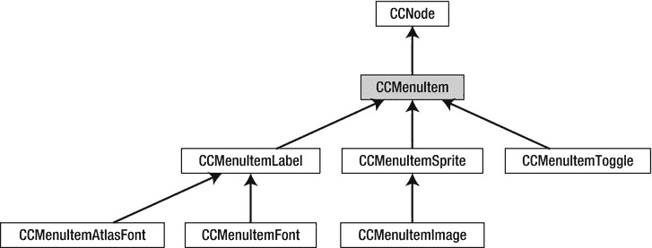

图 3-8. `CCMenuItem` 类层次结构

代码清单 3-1 显示了设置菜单的代码。你可以在 `Essentials` 项目的 `MenuScene` 类中找到该菜单代码。

**代码清单 3-1.** 在 cocos2d 中使用文本和图片菜单项创建菜单

```objc
CGSize size = [CCDirector sharedDirector].winSize;

// 设置 CCMenuItemFont 的默认属性
[CCMenuItemFont setFontName:@"Helvetica-BoldOblique"];
[CCMenuItemFont setFontSize:26];

// 创建几个带文本和选择器的标签
CCMenuItemFont* item1 = [CCMenuItemFont itemWithString:@"Go Back!"
                        target:self
                      selector:@selector(menuItem1Touched:)];

// 使用现有的精灵创建一个菜单项
CCSprite* normal = [CCSprite spriteWithFile:@"Icon.png"];
normal.color = ccRED;
CCSprite* selected = [CCSprite spriteWithFile:@"Icon.png"];
selected.color = ccGREEN;
CCMenuItemSprite* item2 = [CCMenuItemSprite
                      itemWithNormalSprite:normal
                          selectedSprite:selected
                               target:self
                             selector:@selector(menuItem2Touched:)];
```


```objective-c
// 使用另外两个菜单项创建一个开关项（开关也支持图片）
[CCMenuItemFont setFontName:@"STHeitiJ-Light"];
[CCMenuItemFont setFontSize:18];
CCMenuItemFont* toggleOn = [CCMenuItemFont itemWithString:@"我开启了！"];
CCMenuItemFont* toggleOff = [CCMenuItemFont itemWithString:@"我关闭了！"];
CCMenuItemToggle* item3 = [CCMenuItemToggle itemWithTarget:self
                           selector:@selector(menuItem3Touched:)
                             items:toggleOn, toggleOff, nil];
                             
// 使用这些菜单项创建菜单
CCMenu* menu = [CCMenu menuWithItems:item1, item2, item3, nil];
menu.position = CGPointMake(size.width/2, size.height/2);
[self addChild:menu];

// 对齐很重要，这样菜单项才不会占据同一位置
[menu alignItemsVerticallyWithPadding:40];
```

**警告** 菜单项列表必须以 `nil` 作为最后一个参数结束。这是一个技术要求。如果你忘记在最后添加 `nil`，你的应用会在那一行崩溃。

设置一个菜单需要相当多的代码。第一个菜单项基于 `CCMenuItemFont`，它只是显示一个字符串。当菜单项被触摸时，它会调用 `menuItem1Touched` 方法。在内部，`CCMenuItemFont` 只是创建了一个 `CCLabel`。如果你已经有一个 `CCLabel`，你可以改用 `CCMenuItemLabel` 类。

同样地，还有两个用于图片的菜单项类：一个是 `CCMenuItemImage`，它从文件创建图片并在内部使用 `CCSprite`；另一个是我在这里用到的 `CCMenuItemSprite`。这个类接受现有的精灵作为输入，我认为这更方便，因为你可以使用同一张图片，只需通过调节其颜色来实现触摸时的高亮效果。

`CCMenuItemToggle` 恰好接受两个继承自 `CCMenuItem` 的对象，并且在被触摸时会在两个项目之间切换。你可以对 `CCMenuItemToggle` 使用文本标签或图片。

最后，`CCMenu` 本身被创建并定位。因为菜单项都是 `CCMenu` 的子节点，所以它们相对于菜单进行定位。为了防止它们相互堆叠，你必须调用 `CCMenu` 的对齐方法之一，例如 `alignItemsVerticallyWithPadding`，如列表 3-1 末尾所示。

由于 `CCMenu` 是一个包含所有菜单项的节点，你可以对菜单使用动作，让它滚动进入或退出。这会让你的菜单界面看起来不那么静态，这通常是一件好事。请参阅 `Essentials` 项目中的示例。同时，看一下图 3-9，了解你当前菜单的样子。

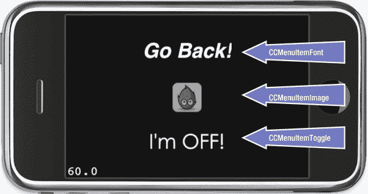

图 3-9 这是由列表 3-1 中的代码生成的菜单

## 使用块的菜单项

除了指定目标和选择器，菜单项也可以使用块。这又是什么？

块类似于 C 函数，但有一个重要的区别：块代码可以访问声明块所在作用域中的变量。你可以在其他函数内部编写块，将其存储在变量中，并将其作为参数传递。块还可以访问声明它们所在作用域中的变量。这使得块成为一个非常强大的概念，但由于语法有些令人困惑，所以未得到充分利用。显然，苹果也意识到了这一点，因为他们将《Blocks 编程指南》的标题改为了《Blocks 简短实用指南》，你可以在这里找到它：`http://developer.apple.com/library/ios/#featuredarticles/Short_Practical_Guide_Blocks/_index.html`。

在不深入理论的情况下，块最好通过示例来解释。让我们看看使用块的菜单项是什么样子：

```objective-c
NSArray* items = [NSArray arrayWithObjects:toggleBlockOn, toggleBlockOff, nil];
CCMenuItemToggle* item4 = [CCMenuItemToggle itemWithItems:items
            block:^(id sender) {
    // sender 是 CCMenuItemToggle
    CCMenuItemToggle* toggleItem = (CCMenuItemToggle*)sender;
    int index = toggleItem.selectedIndex;
    CCLOG(@"item 4 touched with block: %@ - selected index: %i", sender, index);
}];
```

现在再看同一个块，但这次你利用了块可以访问声明块所在作用域中的变量这一特性。在这种情况，你可以直接引用 `item4` 变量，而不是使用 `sender`（它是 `CCMenuItemToggle`）。这被称为*捕获状态*。即使在声明块之后立即将不同的对象赋值给 `item4`，块仍然会引用在创建块时存储在 `item4` 变量中的对象。

```objective-c
NSArray* items = [NSArray arrayWithObjects:toggleBlockOn, toggleBlockOff, nil];
CCMenuItemToggle* item4 = [CCMenuItemToggle itemWithItems:items
            block:^(id sender) {
    int index = item4.selectedIndex;
    CCLOG(@"item 4 touched with block: %@ - selected index: %i", item4, index);
}];
item4 = nil; // 在块内部，item4 仍然是菜单项对象
```

这个特定的菜单项初始化器接受一个块作为参数。不幸的是，cocos2d 没有记录块函数应该具有哪种签名，因此你必须从任何接受块的 cocos2d 方法中挖掘这些信息。查阅实现了 `CCMenuItemToggle` 的 `CCMenuItem.m` 文件，你可以看到该块返回 `void`（无返回值）并将一个 `id sender` 对象传递给函数：

```objective-c
block:(void(^)(id sender))block
```

因此，你需要实现的块需要具有以下签名：

```objective-c
^(id sender) {
  // 你的代码在这里 . . .
}
```

到现在为止，你可能会注意到那个位置奇怪的插入符号（`^`）。它告诉编译器接下来的代码是一个块。在插入符号之后，你首先在括号中声明参数列表，然后在大括号中是你的代码。所以这非常简单。

你可能注意到的一点是，块没有声明返回类型。对于 `void` 和 `int` 参数，这是可选的，因为如果块内部没有使用 `return` 语句，编译器会假定返回类型是 `void`。如果有一条返回值的 `return` 语句，则默认返回 `int`。因为当你想返回一个不同于 `int` 的值时，这会导致编译器错误，所以我认为即使不是必须指定返回类型，也应该养成指定它的好习惯。返回类型始终跟在插入符号之后：

```objective-c
^void(id sender) {
  // 你的代码在这里 . . .
}
```

现在你可能想知道，既然可以直接使用目标和选择器，为什么还要费心去用语法古怪的块呢？原因之一是，它允许你在定义菜单项的地方直接编写菜单项处理代码。此外，块可以访问局部变量。在这个例子中，可以在块内部使用 `message` `NSString`：

```objective-c
NSString* message = @"某种字符串";
NSArray* items = [NSArray arrayWithObjects:toggleBlockOn, toggleBlockOff, nil];
CCMenuItemToggle* item4 = [CCMenuItemToggle itemWithItems:items
            block:^void(id sender) {
  CCLOG(@"消息是:%@", message);
}];
```

更重要的是，你可以通过将块赋值给一个变量，为多个菜单项重复使用同一个块。为了清晰起见，我在这个例子中省略了 `NSArray* items` 的声明。


```objective-c
NSString* message = @"some kind of string";
void (^toggleBlock)(id sender) = ^void(id sender) {
   CCLOG(@"message is: %@ ", message);
};
CCMenuItemToggle* item6 = [CCMenuItemToggle itemWithItems:items
            block:toggleBlock];
CCMenuItemToggle* item7 = [CCMenuItemToggle itemWithItems:items
            block:toggleBlock];
message = @"a different string";
CCMenuItemToggle* item8 = [CCMenuItemToggle itemWithItems:items
            block:toggleBlock];
```

实际上，你拥有一个可处理三个菜单项的代码块。由于 `item8` 之前 `message` 字符串已被更改，这个特定的菜单项每次切换时都会打印出不同的字符串。

开始使用代码块时面临的一个问题是，其实现和变量声明在细微但重要的方面存在差异。在实现中（等号右侧），你需要在插入符之后指定返回类型。然而，在变量声明中（等式左侧），返回类型放在首位且**永远不能省略**。即使可以在右侧省略它，你也必须指定 `void`——这是另一个建议在右侧也始终使用返回类型的原因。

此外，变量名位于插入符之后，并且必须将它们写在括号中以避免编译器错误。比较左侧的变量声明和右侧的代码块实现：

```objective-c
void (^toggleBlock)(id sender) = ^void(id sender) { /* 此处为代码块代码 */ };
```

这些关于声明和实现的细微差别可能是代码块语法最令人不适的地方。但一旦你见过几个使用示例，你就会习惯它，最终它会变得得心应手。注意，一旦它被声明为变量，你就可以传递代码块变量，甚至可以像调用 C 函数一样调用它：

```objective-c
toggleBlock(nil);
```

**提示**  在 Essentials 项目中，我添加了一个名为 `-(void) moreBlocksExamples` 的方法，其中包含许多如何编写代码块的示例。还有一个使用 `typedef` 和预处理宏的示例，可以让您以较少语法困扰的方式编写代码块。这个示例声明了一个代码块变量，其声明和实现都被赋予了可读的名称：`NegateBlock Negate = NegateBlockImp{ return !input; }; CCLOG(@"Negate returned: %@", Negate(YES) ? @"YES" : @"NO");`

代码块有广泛的用途。例如，它们被用作 Game Center 类的回调机制，并且对于使用 Grand Central Dispatch 和其他 Cocoa 技术的多线程应用至关重要。在内部，cocos2d 也会将所有 target/selector 菜单项转换为带代码块的调用。尽管语法有些怪异，但我还是鼓励您使用代码块，因为您可能很快就需要理解和运用它们。而且，您也能更早地解锁它们强大的秘密。

## 动作

动作是轻量级的一次性类，用于在节点上执行某些特定的操作。它们允许您移动、旋转、缩放、着色、淡入淡出，并对节点执行许多其他操作。由于动作适用于每个节点，您可以在精灵、标签甚至菜单或整个场景上使用它们！这就是它们如此强大的原因。

在 图 3-10 中，您可以看到 `CCAction` 类层次结构，其中省略了 `CCActionInterval` 和 `CCActionInstant` 的许多子类。（您将在 图 3-11 和 图 3-16 中看到它们的类层次结构。）

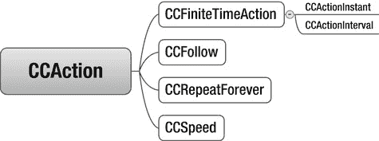

图 3-10 .  `CCAction` 类层次结构（省略了 `CCActionInstant` 和 `CCActionInterval` 的子类）

只有三个动作直接派生自 `CCAction`：

*   `CCFollow`（允许一个节点跟随另一个节点）
*   `CCRepeatForever`（无限重复一个动作）
*   `CCSpeed`（在动作运行时改变其更新频率）

使用 `CCFollow` 动作，您可以指示一个节点跟随另一个节点。例如，要让一个标签跟随玩家角色精灵，代码可能如下所示：

```objective-c
[label runAction:[CCFollow actionWithTarget:playerSprite]];
```

您还可以使用 `CCRepeatForever` 让一个动作甚至整个动作序列无限重复（循环）。例如，您可以这样创建无限循环的动画。这段代码让一个节点像永不停歇的旋转轮一样无限旋转：

```objective-c
CCRotateBy* rotateBy = [CCRotateBy actionWithDuration:2 angle:360];
CCRepeatForever* repeat = [CCRepeatForever actionWithAction:rotateBy];
[myNode runAction:repeat];
```

您可以使用 `CCSpeed` 动作来影响正在运行的动作的速度。让我们以之前的旋转示例为例，将其包装在 `CCSpeed` 动作中：

```objective-c
CCRotateBy* rotateBy = [CCRotateBy actionWithDuration:2 angle:360];
CCRepeatForever* repeat = [CCRepeatForever actionWithAction:rotateBy];
CCSpeed* speedAction = [CCSpeed actionWithAction:repeat speed:0.5f];
speedAction.tag = 1;
[myNode runAction:speedAction];
```

现在节点完成一次完整旋转所需的时间增加了一倍，因为 `CCSpeed` 动作的 `speed` 属性被设置为 `0.5f`。您之后可以更改 `CCSpeed` 动作的 `speed` 属性，以影响正在运行的被包装动作的速度。如果没有 `CCSpeed`，您就必须创建新的 `CCRotateBy` 和 `CCRepeatForever` 动作来实现速度变化。这不仅会浪费宝贵的 CPU 时间，还可能导致旋转动画出现卡顿或跳跃。

要让节点突然旋转得更快，您只需获取速度动作并修改其 `speed` 属性：

```objective-c
CCSpeed* speedAction = (CCSpeed*)[myNode getActionByTag:1];
speedAction.speed = 2;
```

**注意**  您不能将 `CCSpeed` 动作添加到 `CCSequence` 动作中，因为序列中只能使用派生自 `CCFiniteTimeAction` 的动作。

## 区间动作

由于大多数动作都是随时间发生的，例如旋转三秒钟，您通常需要编写一个更新方法并添加变量来存储中间结果。如 图 3-11 所示的 `CCActionInterval` 动作为您封装了这类逻辑，并将其转化为简单的参数化方法：

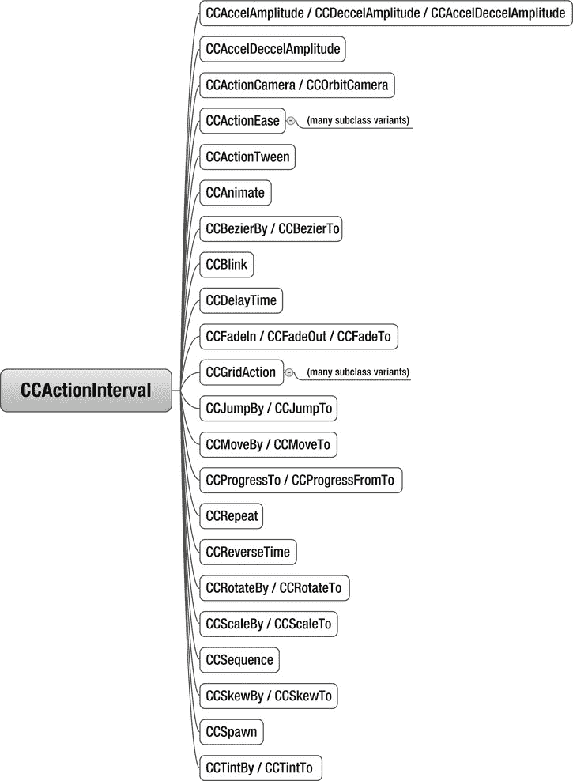

图 3-11 .  `CCActionInterval` 类层次结构（省略了 `CCActionEase` 和 `CCGridAction` 的子类）

```objective-c
// 让 myNode 移动到 100, 200 并在 3 秒内到达
CCMoveTo* move = [CCMoveTo actionWithDuration:3 position:CGPointMake(100, 200)];
[myNode runAction:move];
```

一旦开始使用这段特定的代码，您会注意到，根据 `myNode` 需要移动的距离，其速度会不同。这个非常常见的问题有一个简单的解决方案：计算从当前位置到目标位置的距离，然后除以您希望节点移动的速度。结果是让节点以相同速度移动到目标位置所需的正确持续时间，无论节点和目标位置在哪里。

```objective-c
// 让 myNode 以固定速度移动到任何位置
CGPoint targetPos = CGPointMake(100, 200);
float speed = 10; // 单位为像素每秒
float duration = ccpDistance(myNode.position, targetPos) / speed;

CCMoveTo* move = [CCMoveTo actionWithDuration:duration position:targetPos];
[myNode runAction:move];
```


### Cocos2d 中的动作管理

### 动作生命周期与可重用性

顺便一提，你无需手动移除动作。一旦动作完成任务，它会自动从节点上移除自身并释放占用的内存。不幸的是，这也是动作最大的弱点：你无法重复使用它们。如果后续需要相同的动作或动作序列，你必须创建新的动作类实例。

**警告** Cocos2d 官方文档中曾有一条建议：只需向动作重新发送适当的 `initWith...` 消息来“重新初始化”即可。但这是危险的，可能导致内存泄漏甚至崩溃，因为并非所有动作类都能安全地重新初始化。而且对于某些动作，这种方式根本不会产生期望的效果。

如果你保留了动作的引用，试图稍后重用它，并在多次调用 `runAction` 时使用它，你会发现动作要么无效，要么节点行为异常。触发此问题的最简单方式是在两个不同节点上使用同一个动作，例如：

```
CCMoveTo* move = [CCMoveTo actionWithDuration:duration position:targetPos];
[myNode runAction:move]; // 这个节点将保持不动
[otherNode runAction:move]; // 这个节点会移动
```

只有 `otherNode` 会执行该动作，因为它是最后一个使用该动作的节点。动作只能作用于单个节点，因此 `myNode` 完全不会移动。如果你希望两个节点都移动，就必须创建两个 `CCMoveTo` 类实例。这确实别无他法。

### 动作序列

当你向同一节点添加多个动作时，它们会同时执行各自的任务。例如，你可以通过添加相应动作让一个对象同时旋转并淡出。但如果你希望动作依次执行呢？

有时将动作*序列化*会更有用，即一个动作完成后，下一个动作才开始执行。这时就要用到 `CCSequence` 了。它功能强大且使用频繁，值得专门一提。你可以在序列中使用任意数量和类型的动作，这样就能轻松让节点移动到目标位置，到达后旋转一周，再淡出，每个动作依次进行，直到序列完成。

以下示例展示了如何让标签颜色循环变化：从红色到蓝色再到绿色，并在红、蓝色动作结束后各等待 1 秒：

```
CCTintTo* tint1 = [CCTintTo actionWithDuration:4 red:255 green:0 blue:0];
CCDelayTime* wait1 = [CCDelayTime actionWithDuration:1];
CCTintTo* tint2 = [CCTintTo actionWithDuration:4 red:0 green:0 blue:255];
CCDelayTime* wait2 = [CCDelayTime actionWithDuration:1];
CCTintTo* tint3 = [CCTintTo actionWithDuration:4 red:0 green:255 blue:0];
CCSequence* sequence = [CCSequence actions:tint1, wait1, tint2, wait2, tint3, nil];
[label runAction:sequence];
```

你也可以对序列使用 `CCRepeatForever` 动作：

```
CCSequence* sequence = [CCSequence actions:tint1, tint2, tint3, nil];
CCRepeatForever* repeat = [CCRepeatForever actionWithAction:sequence];
[label runAction:repeat];
```

能够修改整个重复序列的速度也很实用：

```
CCSequence* sequence = [CCSequence actions:tint1, tint2, tint3, nil];
CCRepeatForever* repeat = [CCRepeatForever actionWithAction:sequence];
CCSpeed* speedAction = [CCSpeed actionWithAction:repeat speed:0.75f];
[label runAction:speedAction];
```

**注意** 与菜单项类似，动作列表总是以 `nil` 结尾。如果忘记将 `nil` 作为最后一个参数，创建 `CCSequence` 的这行代码就会崩溃！

### 缓动动作

当使用基于 `CCActionEase` 类的动作时，动作会变得更加强大。缓动动作允许你随时间改变动作的效果。例如，如果你对节点使用 `CCMoveTo` 动作，节点会以恒定速度移动整个距离直到到达。使用 `CCActionEase`，你可以让节点先慢后快地接近目标，反之亦然；或者让节点略微越过目标位置再反弹回来。想亲眼看看缓动效果，可以查看这个在网页浏览器中运行的演示应用：`www.robertpenner.com/easing/easing_demo.html`。

缓动动作能创建非常动态的动画，而这些动画通常实现起来非常耗时。以下代码展示了如何使用缓动动作来修改常规动作的行为。`rate` 参数决定了缓动效果的显著程度，必须大于 1 才能看到效果。

```
// 我希望 myNode 在 3 秒内移动到 (100, 200) 位置
CCMoveTo* move = [CCMoveTo actionWithDuration:3 position:CGPointMake(100, 200)];
// 这次节点在移动过程中应该先加速再减速
CCEaseInOut* ease = [CCEaseInOut actionWithAction:move rate:4];
[myNode runAction:ease];
```

**注意** 在上例中，缓动动作是在节点上执行的，而非移动动作。在处理动作时，很容易忘记修改 `runAction` 这一行——即使是经验最丰富的 cocos2d 开发者也会犯这个常见错误。如果你发现动作没有按预期工作或完全不工作，请仔细检查是否在运行正确的动作。如果使用的动作是正确的，但仍然没有看到期望的结果，请验证是否在正确的节点上运行该动作。这是另一个常见错误。

Cocos2d 实现了以下 `CCActionEase` 类：

* `CCEaseBackIn`, `CCEaseBackInOut`, `CCEaseBackOut`
* `CCEaseBounceIn`, `CCEaseBounceInOut`, `CCEaseBounceOut`
* `CCEaseElasticIn`, `CCEaseElasticInOut`, `CCEaseElasticOut`
* `CCEaseExponentialIn`, `CCEaseExponentialInOut`, `CCEaseExponentialOut`
* `CCEaseIn`, `CCEaseInOut`, `CCEaseOut`
* `CCEaseSineIn`, `CCEaseSineInOut`, `CCEaseSineOut`

在第 4 章中，你将在 DoodleDrop 项目中使用其中多个缓动动作，以便观察它们的效果。`CCActionEase` 类的层次结构如图 3-12 所示。

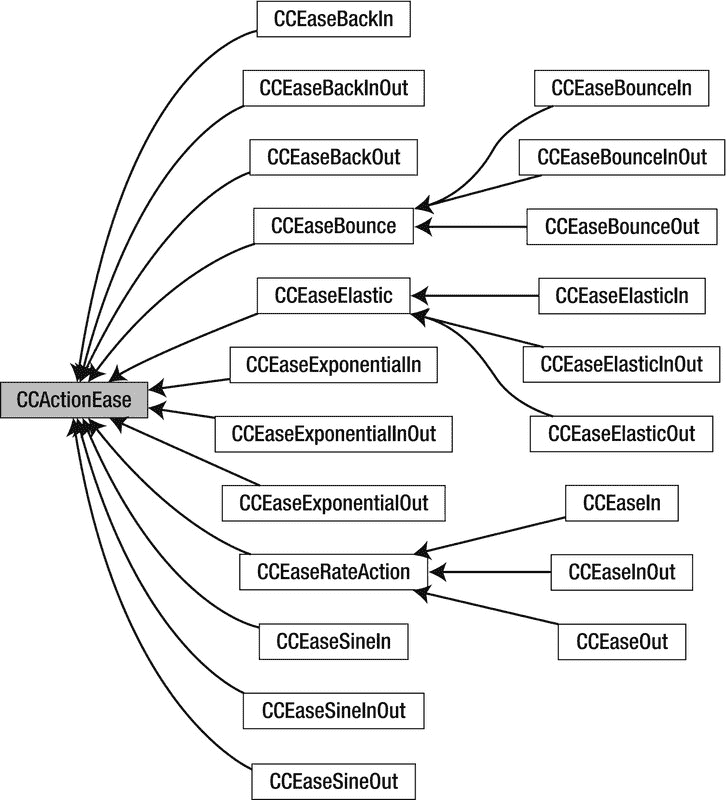

图 3-12 . `CCActionEase` 类层次结构

### 网格动作

网格动作是纯粹的视觉动作，它们派生自 `CCGridAction` 及其两个子类 `CCGrid3DAction` 和 `CCTiledGrid3DAction`。其类层次结构如图 3-13 和 3-14 所示。

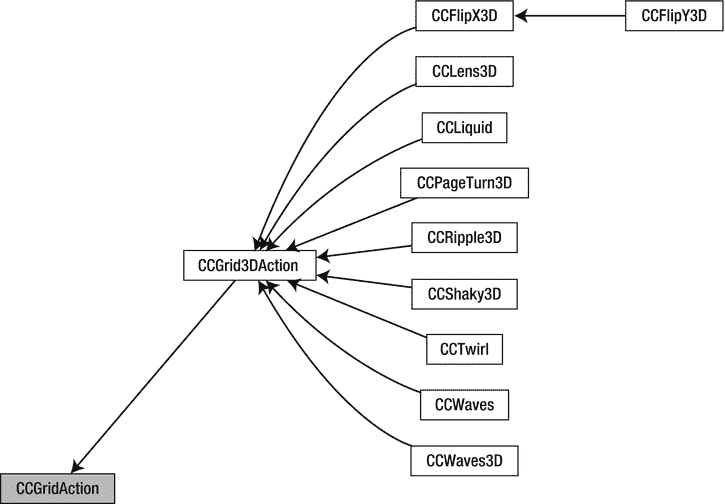

图 3-13 . `CCGrid3DAction` 类层次结构

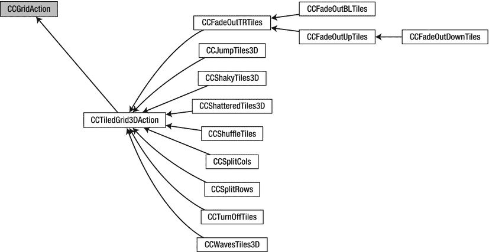

图 3-14 . `CCTiledGrid3DAction` 类层次结构

网格动作的特点是三维效果，例如翻页（`CCPageTurn3D`，见图 3-15）或模拟波浪和液体（`CCWaves`、`CCLiquid`）。其缺点是，除非启用深度缓冲，否则 3D 效果可能出现视觉瑕疵，而启用深度缓冲会消耗更多内存并对渲染性能产生负面影响。

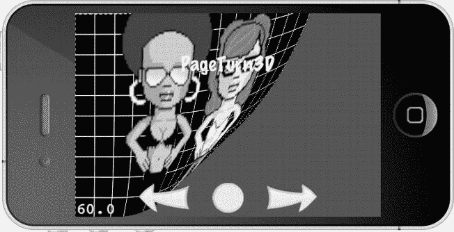

图 3-15 . `CCPageTurn3D` 动作的效果演示


为了在 cocos2d 应用程序中启用深度缓冲，您必须修改项目`AppDelegate.m`文件中初始化`EAGLView`的那一行。您需要将`depthFormat`参数从默认值 0 改为`GL_DEPTH_COMPONENT16_OES`（用于 16 位深度缓冲）或`GL_DEPTH_COMPONENT24_OES`（用于 24 位深度缓冲）：

```
CCGLView *glView = [CCGLView viewWithFrame:[window_ bounds]
            pixelFormat:kEAGLColorFormatRGB565
            depthFormat:GL_DEPTH_COMPONENT16_OES
            preserveBackbuffer:NO
            sharegroup:nil
            multiSampling:NO
            numberOfSamples:0];
```

Kobold2D 用户可以在`config.lua`文件中修改`GLViewDepthFormat`参数来进行此更改，方法如下：

```
GLViewDepthFormat = GLViewDepthFormat.Depth16Bit,
```

理想情况下，您应该首先尝试使用 16 位深度缓冲；它使用的内存更少，但在少数情况下，如果使用 3D 动作时仍然出现视觉伪影，则可能需要 24 位深度缓冲。

### 即时动作

您可能会好奇，既然可以直接更改节点的属性来达到同样的效果，为什么还要存在基于`CCInstantAction`类的即时动作（请参见 图 3-16 的类层次结构）。例如，有一些即时动作用于翻转节点、将其放置在特定位置或切换其可见性属性。

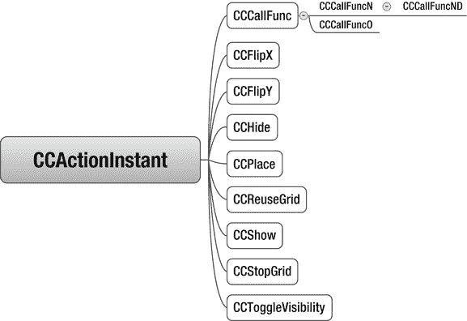

图 3-16 .  `CCActionInstant`类层次结构

即时动作存在的主要原因在于它们在动作序列中非常有用。有时在动作序列中，您需要更改节点的某个属性（例如可见性或位置），然后继续执行序列。即时动作使这成为可能。诚然，它们很少被使用——`CCCallFunc`及其变体是一个显著的例外。

### CCCallFunc 动作

在使用动作序列时，您可能希望在某些时刻得到通知，例如当序列结束时，然后立即启动另一个序列。为此，您可以使用`CCCallFunc`动作的多个版本，这些版本会在轮到它们执行时发送消息。让我们重写颜色循环序列，以便在每个`CCTintTo`动作完成其工作时调用一个方法：

```
// 使用此签名的选择器向目标发送消息：
// –(void) onCallFunc;
CCCallFunc* func = [CCCallFunc actionWithTarget:self
            selector:@selector(onCallFunc)];
```

```
// 使用此签名的选择器向目标发送消息：
// -(void) onCallFuncN:(id)sender;
CCCallFuncN* funcN = [CCCallFuncN actionWithTarget:self
            selector:@selector(onCallFuncN:)];
```

```
// 注意：由于 ARC 问题，请避免使用此方法。
// 使用此签名的选择器向目标发送消息：
// -(void) onCallFuncND:(id)sender data:(void*)data;
CCCallFuncO* funcO = [CCCallFuncO actionWithTarget:self
            selector:@selector(onCallFuncO:)
            object:self];
```

```
// 使用此签名的选择器向目标发送消息：
// -(void) onCallFuncO:(id)object;
void* someDataPointer = nil;
CCCallFuncND* funcND = [CCCallFuncND actionWithTarget:self
             selector:@selector(onCallFuncND:data:)
            data:someDataPointer];
```

```
CCSequence* seq = [CCSequence actions: ←
  tint1, func, tint2, funcN, tint3, funcO, funcND, nil];
[label runAction:seq];
```

这些`CCCallFunc`变体之间的区别在于它们调用的选择器不同，因此它们所调用的方法可用的上下文也不同。例如，当`CCCallFunc`调用`onCallFunc`方法时，您无法知道是谁调用了该方法或为何调用。没有上下文，但在许多情况下，这种上下文并不是必需的。

**注意**  `CCCallFuncND`的`data`参数绝对不要使用 Objective-C 类（任何`id`类型）。这样做有内存泄漏或在启用了 ARC 的项目中使应用程序崩溃的风险。对于`id`类型，请始终使用`CCCallFuncO`动作，或考虑使用本节稍后介绍的`CCCallBlock`动作，因为 block 可以使用声明 block 时作用域内的任何变量。

动作序列`seq`将依次调用以下代码中的方法。`sender`参数始终源自`CCNode`——它是正在运行动作的节点。您可以以任何方式使用`data`参数，包括传递值、结构体或其他指针。您只需要正确地转换数据指针即可。

```
-(void) onCallFunc
{
     CCLOG(@"end of tint1!");
}
```

```
-(void) onCallFuncN:(id)sender
{
     CCLOG(@"end of tint2! sender: %@", sender);
}
```

```
-(void) onCallFuncO:(id)object
{
   // object 是您传递给 CCCallFuncO 的对象
   CCLOG(@"call func with object %@", object);
}
```

```
-(void) onCallFuncND:(id)sender data:(void*)data
{
     CCLOG(@"end of sequence! sender: %@ - data: %p", sender, data);
}
```

当然，`CCCallFunc`动作也可以与`CCRepeatForever`序列配合使用。您的方法将在适当的时间被重复调用。

### CCCallBlock 动作

在大多数情况下，您可以使用`CCCallBlock`动作来替代`CCCallFunc`动作。Block 动作唯一不允许的是传递任意的`void*`指针——主要是因为这样做与 ARC 冲突（请参见前面的“注意”框）。

`CCCallBlock`、`CCCallBlockN`和`CCCallBlockO`类的初始化和使用方式如下：

```
CCCallBlock* blockA = [CCCallBlock actionWithBlock:^void(){
  CCLOG(@"action with block got called");
}];
```

```
CCCallBlock* blockB = [CCCallBlock actionWithBlock:^{
  CCLOG(@"action with block got called");
}];
```

```
CCCallBlockN* blockN = [CCCallBlockN actionWithBlock:^void(CCNode* node){
  CCLOG(@"action with block got called with node %@", node);
}];
```

```
CCCallBlockO* blockO = [CCCallBlockO actionWithBlock:^void(id object){
  CCLOG(@"action with block got called with object %@", object);
}
            object:background];
```

```
CCSequence* sequence = [CCSequence actions:block, blockN, blockO, nil];
[label runAction:sequence];
```

`CCCallBlock`类的`blockA`和`blockB`实例仅在 block 的声明方式上有所不同。因为该特定的 block 没有返回值，所以您可以省略`void`。又因为它不接受参数，您也可以省略括号。这意味着`^void(){ .. }`和`^{ .. }`声明了完全相同的 block 类型，后者只是前者的一种简写形式。

用于`CCCallBlockN`类的 block 必须接受一个类型为`CCNode*`的参数。`node`是正在运行`CCCallBlockN`动作的节点。`CCCallBlockO`使用的 block 需要一个类型为`id`的参数。这是作为第二个参数传递给`CCCallBlockO`的对象。不幸的是，这很容易被忽略，因为对象参数跟在 block 参数之后，这会导致一些语法上的尴尬，因为它要么挂在 block 的末尾，要么在看似空行之后独自漂浮。

如果您将 block 赋值给一个变量并像这样重写`CCCallBlockO`的初始化，语法会更清晰，也更容易阅读：

```
void (^callBlock)(id object) = ^void(id object){
   CCLOG(@"action with block got called with object %@", object);
   [label setString:@"label string changed by block"];
};
CCCallBlockO* blockO2 = [CCCallBlockO actionWithBlock:callBlock
            object:background];
```

这提醒了我：您可以将 block 赋值给变量——以及这看起来是什么样子。我希望现在，在阅读了几页之后，blocks 开始让您有所领悟。如果没有，别担心。在本书接下来的内容中，我还会再提到它们几次。


如果你错过了可能很有用的`CCCallBlockNO`类（其 block 会同时将发送节点和用户提供的对象作为参数），请记住 block 可以访问局部作用域。实际上，大多数情况下你甚至不需要使用`CCCallBlockN`或`CCCallBlockO`，因为你可以直接从 block 内部访问变量`label`和`background`，而无需将它们作为 block 参数传入：

```
// assuming label and background are already declared & initialized at this point . . .
CCCallBlock* block = [CCCallBlock actionWithBlock:^void(){
  CCLOG(@"label: %@ -- background object: %@", label, background);
}];
```

作家的瓶颈可能是坏事，但程序员的瓶颈却是再好不过！

## 方向、单例、测试和 API 参考

本节总结了 cocos2d 中三个未得到应有关注的方面——或者就单例模式而言，也许它们受到了过多的关注。单例经常被指责为不良实践，有些开发者甚至断言任何项目都不应使用它们。但像我这样的实用主义者，还没见过哪个游戏引擎或游戏项目不使用单例，而且这样做也合情合理。

此外还有 cocos2d 测试用例和 API 参考，这两个资源都能帮助你解答问题——只要你找对地方。但我想先解释一下如何将你的应用锁定在特定的设备方向上。

### 设备方向教程

通常情况下，你会希望将应用锁定为仅支持四种设备方向中的一种，或者至少仅支持横向或纵向模式。

我先从 Kobold2D 开始，因为它与其他 Cocoa Touch 应用一样工作。Kobold2D 遵循目标的“支持设备方向”设置。选择项目目标，进入“摘要”选项卡，你会在“iPhone / iPad 部署信息”标题下找到“支持设备方向”设置。默认情况下，所有四种设备方向都被支持。要将应用限制为仅支持横向，只需取消选择纵向方向，如图 3-17 所示。你只需要这样做。

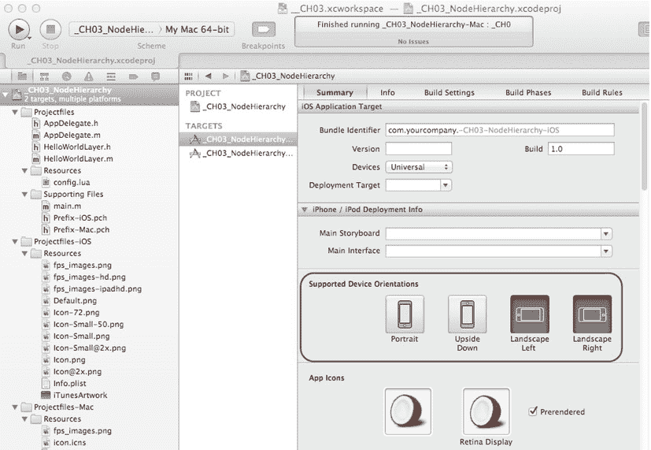

图 3-17 .  Kobold2D 能识别 Xcode 中的“支持设备方向”设置

如果你看不到设备方向设置，请确保你选择了 iOS 目标。毕竟，几乎所有的 Kobold2D 项目也包含一个 Mac 构建目标。

在纯 cocos2d 应用中，你需要打开`AppDelegate.m`并找到`shouldAutorotateToInterfaceOrientation`方法。Kobold2D 用户也可以将这个方法添加到`AppDelegate`类中，以在应用运行时改变支持的方向。默认实现允许自动旋转到两个横向方向，与下面这个类似，只是我将方法参数从`interfaceOrientation`改为`orientation`，以使书中的源代码更易读：

```
-(BOOL)shouldAutorotateToInterfaceOrientation:(UIInterfaceOrientation)orientation
{
    return UIInterfaceOrientationIsLandscape(orientation);
}
```

系统会频繁查询此方法，以确定是否允许应用自动旋转到某个特定的界面方向。如果应用支持传入的方向，该方法应返回`YES`，否则返回`NO`。你应该至少为一个界面方向返回`YES`——否则 iOS 会默认使用纵向模式。

iOS SDK 提供了两个宏来测试界面方向是两种纵向模式之一还是两种横向模式之一：

```
BOOL isLandscape = UIInterfaceOrientationIsLandscape(orientation);
BOOL isPortrait = UIInterfaceOrientationIsPortrait(orientation);
```

建议让你的应用旋转到两个横向或两个纵向方向，因为有些用户偏好 Home 键在左侧，有些在右侧，还有些用户只是希望应用能适应当前握持设备的方向。因此，在可能的情况下，这个决定应该留给用户来做。

然而，有时也有理由将你的应用限制在一种特定的设备方向上。例如，如果你的应用是通过加速度计控制的（如流行的《Labyrinth》游戏），设备向一个方向倾斜太远可能会意外触发自动旋转。这可能会使游戏无法进行。要强制你的应用只使用一种特定方向，可以将`orientation`参数与四种`UIInterfaceOrientation`类型之一进行比较。在这个例子中，只允许横向左方向：

```
-(BOOL)shouldAutorotateToInterfaceOrientation:(UIInterfaceOrientation)orientation
{
    return interfaceOrientation == UIInterfaceOrientationLandscapeLeft;
}
```

**注意** `UIInterfaceOrientationLandscapeLeft`方向就是图 3-17 中“横向左”图标所描绘的方向。这意味着 Home 键在左侧。这一点很重要，特别是如果你之前使用过更早的 cocos2d 版本，那时使用的是设备方向而不是界面方向。以前设备方向设置为`UIDeviceOrientationLandscapeRight`，现在你必须使用`UIInterfaceOrientationLandscapeLeft`；而以前使用`UIDeviceOrientationLandscapeLeft`的地方，现在你必须使用`UIInterfaceOrientationLandscapeRight`。

在极少数情况下，如果你想支持所有四种方向，只需在`shouldAutorotateToInterfaceOrientation`方法中返回`YES`即可。

## cocos2d 中的单例

Cocos2d 很好地利用了单例设计模式，这是一个经常被激烈争论的话题。原则上，单例是一个常规类，在应用程序的整个生命周期中只被实例化一次。为了确保这一点，你使用一个静态方法来创建和访问该对象的实例。因此，不是使用`alloc`/`init`或静态自动释放初始化器，而是通过以`shared`开头的方法来获取单例对象。cocos2d 中最著名的单例类是`CCDirector`类：

```
CCDirector* director = [CCDirector sharedDirector];
```

导演本身还托管着其他单例类，在 cocos2d v1.x 中这些是独立的类。从 cocos2d v2.0 开始，你可以通过`CCDirector`类的属性访问`CCScheduler`、`CCActionManager`和`CCTouchDispatcher`。

```
CCDirector* director = [CCDirector sharedDirector];
CCScheduler* scheduler = director.scheduler;
CCActionManager* actionManager = director.actionManager;
// only when building for iOS
CCTouchDispatcher* touchDispatcher = director.touchDispatcher;
// only when building for Mac OS X
CCEventDispatcher* eventDispatcher = director.eventDispatcher;
```

cocos2d 中的四个缓存类也实现为单例类：

```
CCAnimationCache* animCache = [CCAnimationCache sharedAnimationCache];
CCShaderCache* shaderCache = [CCShaderCach sharedShaderCache];
CCSpriteFrameCache* sfCache = [CCSpriteFrameCache sharedSpriteFrameCache];
CCTextureCache* textureCache = [CCTextureCache sharedTextureCache];
```

这些类各自缓存特定的资源。这里的“缓存”意味着加载的资源即使不再使用也会保存在内存中。这避免了必须从相对较慢的闪存中重新加载资源。但缓存也防止你重复加载相同的资源。无论你是创建一个精灵还是使用同一纹理创建一千个精灵，该纹理只会被加载并存储在内存中一次。

cocos2d 中还有几个（但很少使用的）单例类：

```
CCConfiguration* config = [CCConfiguration sharedConfiguration];
CCProfiler* profiler = [CCProfiler sharedProfiler];
```


为了完成列表，CocosDenshion 音频引擎还提供了两个单例类：`CDAudioManager` 及其更易用的同类 `SimpleAudioEngine`：

```
CDAudioManager* sharedManager = [CDAudioManager sharedManager];
SimpleAudioEngine* sharedEngine = [SimpleAudioEngine sharedEngine];
```

单例的优点在于，它可以被任何类在任何时间、任何地点使用。它几乎像一个全局类，非常类似于全局变量。如果你有一组需要在许多不同地方使用的数据和方法的组合，单例会非常有用。

缓存和音频就是很好的例子，因为你的任何类（无论是玩家、敌人、菜单按钮还是过场动画）都可能想要播放音效或更改背景音乐。因此，使用单例来播放音频是非常合理的。同样，如果你有全局游戏统计数据（例如玩家的军队规模和每个排的部队数量），你可能希望将这些信息存储在单例中，以便从一个关卡带到另一个关卡。

实现单例很简单，如代码清单 3-2 所示。这段代码以最少的代码将类 `MyManager` 实现为一个单例。静态方法 `sharedManager` 提供了对 `MyManager` 单一实例的访问。当 `sharedManager` 方法首次运行时，`sharedManager` 实例被分配和初始化；之后，则返回已有的实例。

**代码清单 3-2. 将示例类 `MyManager` 实现为单例**

```
static MyManager *sharedManager = nil;

+(MyManager*) sharedManager
{
   static dispatch_once_t once;
   static MyManager* sharedManager;
   dispatch_once(&once, ^{ sharedManager = [[self alloc] init]; });
   return sharedManager;
}
```

**注意** 代码清单 3-2 不仅是 Apple 推荐的单例编写方式，而且它仅用四行代码就实现了最快、最安全的写法。然而，单例有着悠久的历史，你一定会遇到许多解决方案，其中大部分本质上功能相同，但存在细微差别。问答网站 Stackoverflow.com 上有一个关于 Objective-C 单例的精彩讨论，其中讨论了各种实现方案及其优缺点：`http://stackoverflow.com/questions/145154/what-does-your-objective-c-singleton-look-like`

单例也有其丑陋的一面。由于它们易于使用和实现，并且可以从任何其他类访问，因此存在过度使用它们的倾向。它们就像全局变量，而大多数程序员都认为应该谨慎、明智地使用全局变量。

例如，你可能认为只有一个玩家对象，那么为什么不把玩家类做成单例呢？起初一切似乎都很好，直到你意识到，当玩家从一个关卡前进到另一个关卡时，单例不仅保留了玩家的得分，还保留了他的最后一帧动画、生命值以及他拾取的所有物品。甚至，他可能会以狂暴模式开始新关卡，因为离开前一关卡时该模式是激活的。

为了解决这个问题，你添加了另一个方法来在切换关卡时重置某些变量。到目前为止，一切顺利。但是随着你为游戏添加更多功能，最终在切换关卡时不得不添加和维护越来越多的变量。更糟的是，假设有一天你的朋友建议为 iPad 版本添加一个双人模式。但是，等等，你的玩家是一个单例；任何时候你都只能有一个玩家！这会让你非常头疼：要么重构大量代码，要么放弃酷炫的双人模式。

或者，为什么不把第二个玩家也做成单例呢？每当第二个玩家需要知道第一个玩家的某些信息时，它就直接使用那个单例。这样一来，它们之间互相持有引用，这意味着你无法在不初始化其他玩家的情况下进行单人游戏。这是类之间强烈依赖的一种副作用，也称为*紧耦合*。类之间耦合得越紧密，就越难对你的代码的任何部分进行更改。这就像混合水泥，它慢慢变干，直到硬得让你觉得与其改进代码，不如直接粗暴修改来得更容易。到了这个地步，错误似乎会随机地、毫无预兆地在任何地方出现，与最近的更改毫无关联。简而言之：令人沮丧。

你越是依赖单例，这类问题就越可能出现。在创建单例类之前，始终要考虑你是否真的只需要这个类及其数据的一个实例，以及这种情况将来是否会改变。

我理解，对于初学者来说，判断何时何地使用单例很困难，特别是如果你没有太多面向对象编程经验的话。问答网站 Stackoverflow.com 上有相关的讨论，并提供了更多链接，阐述了关于单例设计模式的争议，并提供了一些值得思考的内容：`http://stackoverflow.com/questions/137975/what-is-so-bad-about-singletons`。

我的建议是研究单例的常见用法。在 cocos2d 游戏引擎中，将单例用于资源管理是完全可以的，因为它简化了游戏引擎的整体设计。大多数其他游戏引擎也出于类似目的使用单例，我很少听到有人对此抱怨。你甚至会在 iOS SDK 中发现单例。单例通常并不像有些人说得那么糟糕，尽管它们确实容易因引入强依赖性而产生很多问题，而且这些问题会随着代码库的规模呈指数级增长。

**Cocos2d 测试用例**

你知道 cocos2d 附带了很多示例代码吗？在你的 `cocos2d-iphone` 文件夹中，你会发现一个名为 `cocos2d-ios.xcodeproj` 的项目，其中包含许多你可以构建和运行的测试目标。你可以查看它们的工作原理，然后检查代码以了解它是如何实现的。

但是，我有些犹豫是否推荐这些测试用例，因为你会看到很多非标准的代码。有些测试甚至可以说是相当潦草。毕竟，这些代码仅仅是为了测试代码是否正常工作而编写的，并非为了教授最佳编程实践。因此，对于你在测试用例中看到的一切，都请持保留态度。

尽管如此，测试用例几乎记录了 cocos2d 的每一项功能。将每个测试用例运行一遍（至少运行那些你感兴趣的）以了解其内容，这没什么坏处。例如，测试用例展示了 cocos2d 支持的所有动作，包括带有波纹、波浪或翻页效果的 3D 动作。

**Cocos2d API 参考**

cocos2d API 参考描述了 cocos2d 中的每一个类、每一个方法、每一个属性。例如，了解一个类支持哪些初始化方法的变体，或者它有哪些属性，是非常有用的。这些宝贵的信息可以帮助你提前规划代码，并且当你偶然发现一些以前不知道的方法和参数时，可以更深入地了解 cocos2d API。

每当你遇到诸如“我能用这个类 `y` 做 `x` 吗？”这样的问题时，你应该查阅 API 参考，查找类 `y`，并查看它提供了哪些属性和方法给你使用。例如，这里是 `CCNode` 类的参考链接：`www.learn-cocos2d.com/api-ref/latest/cocos2d-iphone/html/interface_c_c_node.html`。当你大致浏览时，可能会注意到它读起来就像是本章 CCNode 部分的精简版。API 参考不会告诉你原因和方式，但它会告诉你有哪些功能可用。


## 官方 cocos2d API 参考文档

官方 cocos2d API 参考文档托管在：`www.cocos2d-iphone.org/api-ref`。请务必选择与你使用的 cocos2d 版本对应的 API 参考文档，因为 cocos2d 的每个次要版本至少有一个 API 参考文档。遗憾的是，官方 cocos2d API 参考文档并不完整，缺失了多个类、方法和属性。尤其是，大部分 Mac OS X 功能均未收录。

## Kobold2D API 参考文档

在 Learn Cocos2D 网站上，我托管了 Kobold2D 所用全部库的 API 参考文档，包括 cocos2d-iphone、cocos2d-iphone-extensions 项目、Box2D 和 Chipmunk。我网站上的 cocos2d API 参考文档是官方 API 参考文档的净化版，收录了官方 API 参考文档中未记载的类、方法和属性。cocos2d API 参考文档及其他许多参考文档还分为 iOS 版和 Mac OS X 版，这样你就不会被目标平台不支持的代码引用所困扰。

此外，我发现 Kobold2D API 参考文档更易于浏览，因为它们使用了树状类索引，并且默认隐藏了相对较大的类协作与继承图。你可以在 `www.learn-cocos2d.com/api-ref` 或直接从 Kobold2D 网站找到 Kobold2D API 参考文档：`www.kobold2d.com/x/xgMO`。同样，请使用对应版本的链接，本书对应的版本是 Kobold2D 2.0。

## Xcode 及其他环境中的 API 参考文档

如果你通过安装包安装了 Kobold2D，它也会将 Kobold2D 所用全部库（当然包括 cocos2d）的 API 参考文档作为文档集一并安装。这些所谓的 docset 可以在 Xcode 中使用。选择 **帮助 > Xcode 帮助** 来浏览可用的文档集。即使你不打算使用 Kobold2D，也应该仅仅因为这个原因而安装它。

对于 cocos2d 用户来说，另一种选择（实际上也是通常推荐的做法）是从 Mac App Store 安装 Dash（Docs & Snippets）应用。Dash 驻留在后台，等待你按下键盘快捷键，将其窗口调到前台。然后只需输入你要搜索的任何函数、属性或类名，它就会显示结果，不仅包括 Xcode 文档，还包括其他许多文档集，如 PHP、HTML、Java 等。

我提及 Dash 是作为一种备选方案，因为其中一个可选的下载文档集就是针对 cocos2d 的。只需进入 Dash 的偏好设置界面，如果你想获取离线版本，就下载 cocos2d docset。不过，Kobold2D 用户不应这样做，因为你已经拥有 cocos2d docset。

你可以通过以下链接从 Mac App Store 下载 Dash（Docs & Snippets）：

`http://itunes.apple.com/app/dash-docs-snippets/id458034879`

## 总结

哇！内容还真不少！我不指望你一下子记住本章的所有内容。欢迎随时回来重新查阅 cocos2d 的场景图以及如何使用各种 `CCNode` 类。我撰写本章的目的是让它在你需要时成为一个很好的参考文档，配套的 NodeHierarchy 和 Essentials Xcode 项目也是如此。

掌握了本章的知识，再加上你自身相当的积极性，你现在就可以开始编写自己的游戏了。

你知道吗，让我们一起来做这件事吧。继续阅读下一章，我将带你完成你的第一个完整游戏项目！

---

