# 第 4 章：你的第一个游戏

在本章中，你将构建你的第一个完整游戏。它不会赢得任何奖项，但你会学到如何让 cocos2d 的核心元素协同工作，并且这个游戏可以轻松地修改适配。事实上，本书先前版本的读者已经向 App Store 发布了该游戏的几个变体。

这个游戏是著名的 Doodle Jump 游戏的反转版本，恰如其分地命名为 DoodleDrop。玩家的目标是通过旋转设备来移动玩家精灵，尽可能长时间地避开下落的障碍物。看看图 4-1 中的最终版本，了解一下本章将创建的内容。

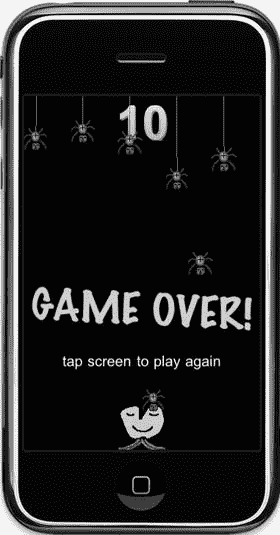

图 4-1 . DoodleDrop 游戏的最终版本

## 创建 DoodleDrop 项目

在第 2 章中，你学习了如何创建一个启用了 ARC 的 Kobold2D 和 cocos2d 项目。

Kobold2D 用户应运行 Kobold2D 项目启动器应用，并选择 Empty-Project 模板（参见第 2 章中的图 2-2）以从头开始。使用 DoodleDrop 作为项目名称，一切就绪。剩下唯一要做的事情是选择应用的目标，并在 **支持的设备方向** 下选择竖屏模式图标，如第 3 章中的图 3-17 所示。横屏图标应取消选择，因为 DoodleDrop 被设计为在竖屏模式下运行。

下一节仅针对 cocos2d 用户——Kobold2D 用户可以跳过。

### 从一个启用 ARC 的 cocos2d 项目开始

Cocos2d 用户应遵循第 2 章中的说明创建一个启用 ARC 的 cocos2d 项目。如果你已经这样做了，那么只需复制你创建的项目即可。这里有一个重要的省时技巧：保留一份此类原始 cocos2d 项目模板的未经修改且已转换为启用 ARC 的版本，这样你就可以轻松快速地创建新项目。

**提示**：在本节的源代码中，你可以在 `Cocos2D_ARC_Template_Projects` 文件夹中找到启用 ARC 的 cocos2d 模板项目。

按照第 2 章中的说明操作后，你将拥有一个启用 ARC 的 cocos2d 项目。我的项目命名为 `cocos2d-2.x-ARC-iOS`。只需在 Xcode 中打开之前，复制包含 `.xcodeproj` 文件的文件夹。但是，不要重命名 `.xcodeproj` 文件本身，因为这样做会导致其无法使用。

现在你可以在 Xcode 中重命名项目，这也会重命名 `.xcodeproj` 文件。在项目导航器中，选择 `cocos2d-2.x-ARC-iOS` 项目（第一个条目，参见第 2 章中的图 2-5），然后通过延迟双击进行编辑。这意味着先单击一次选中它，等待一两秒，然后再次单击，项目名称将变得可编辑。输入 *DoodleDrop* 作为项目名称。

按 Enter 确认更改后，Xcode 会要求你确认重命名几个项目，如图 4-2 所示。你应该通过单击 **重命名** 来确认。如果你单击 **不要重命名**，Xcode 仍然会重命名项目，但所有其他项目则不会。所以，即使你发现拼写错误或不喜欢该名称，也要单击 **重命名**。重命名后，你可能还会看到一条关于 `Prefix.pch` 文件的警告：“文件的新名称不能相同”。你可以安全地忽略该警告。

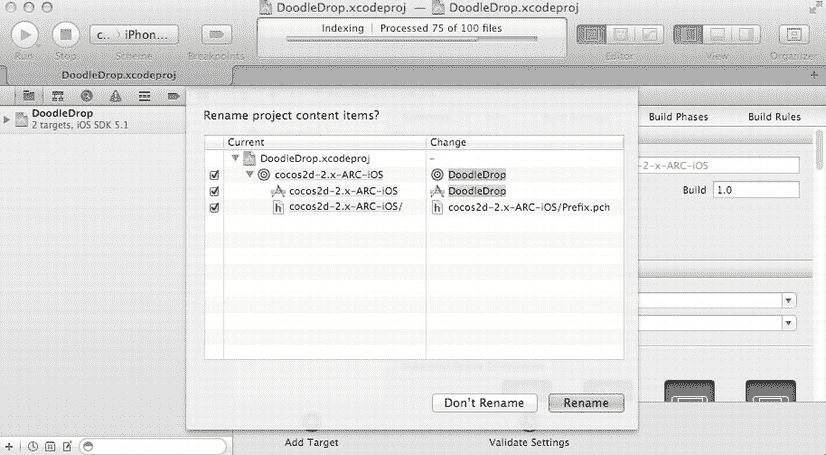

图 4-2 . 确认重命名项目及相关文件

还有最后一项需要你手动重命名：应用的方案。它将仍然命名为 `cocos2d-2.x-ARC-iOS`，或者你给启用 ARC 的 cocos2d 项目起的任何名称。选择 **产品**  **管理方案…** 来查看方案列表。通过延迟单击选中并编辑方案名称，使其名称可编辑，然后将其重命名为 **DoodleDrop**。完成后，关闭方案列表。

因为 DoodleDrop 将是一个竖屏模式的应用，你必须编辑 `AppDelegate.m` 文件，并将 `shouldAutorotateToInterfaceOrientation` 方法修改为仅对竖屏模式返回 `YES`：


```return UIInterfaceOrientationIsPortrait(interfaceOrientation);
```

现在，从“运行”和“停止”按钮右侧的下拉菜单中选择 DoodleDrop 方案，然后运行它，以验证一切是否正常工作。

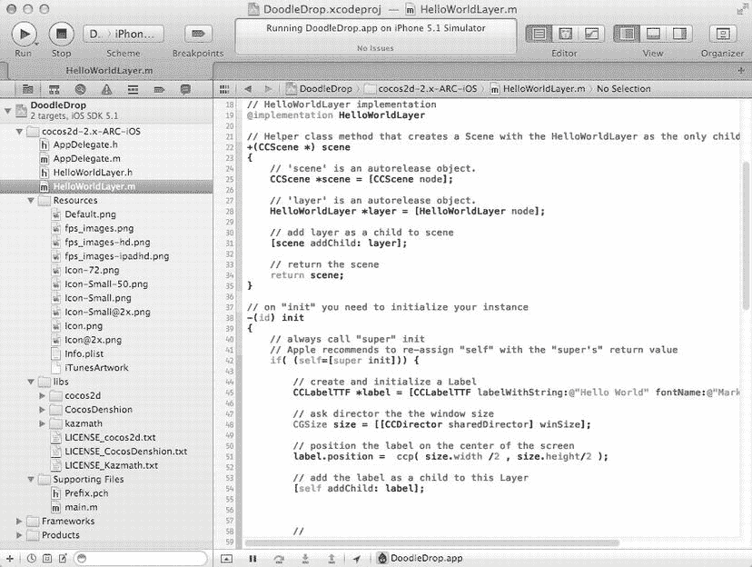

**图 4-3.** 游戏开始吧！此处的 DoodleDrop 项目基于第 2 章的 cocos2d ARC 项目，但 Kobold2D 空项目模板与之差别不大。

## 创建 DoodleDrop 场景

接下来，你需要面对一个决策：是直接使用已有的 `HelloWorldLayer` 开始工作（可能稍后会重命名它），还是通过额外步骤创建自己的场景来替换 `HelloWorldLayer`？我选择了后者，因为最终你总是需要添加新场景，所以现在趁早学习基本操作，从一个干净的起点开始是个好主意。

确保选中了你要添加新场景类的组，然后选择文件  新建  新建文件…，或者在项目导航树中右键点击合适位置，选择新建文件…，打开图 4-4 所示的新建文件对话框。

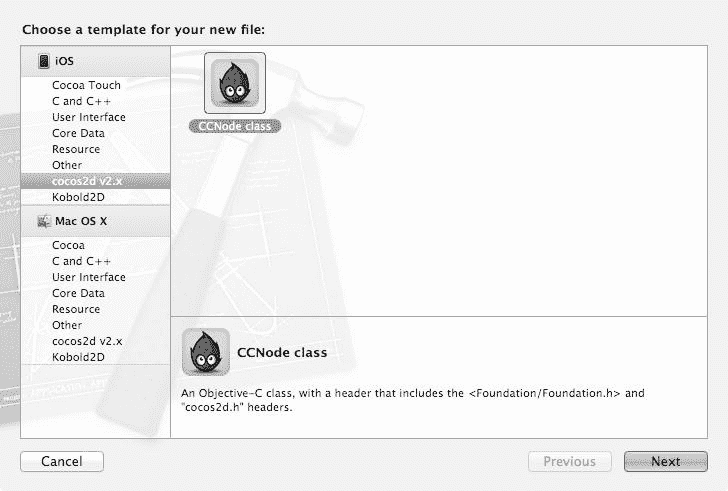

**图 4-4.** 添加新的 `CCNode` 派生类的最佳方式是使用 cocos2d 或 Kobold2D 提供的类模板。在这种情况下，你需要将 `CCNode` 类设置为 `CCLayer` 的子类，因为你正在建立一个新的场景和层。

由于 Cocos2d 和 Kobold2D 为最重要的节点和类提供了类模板，不使用它们实在可惜。另一方面，Xcode 自带的 Objective-C 类模板对于新类来说也是一个很好的模板——你只需要手动将基类从 `NSObject` 改为 `CCLayer`。从 cocos2d v2.x 模板部分选择 `CCNode` 类，点击下一步，并在再次点击下一步之前确保其子类设置为 `CCLayer`，以调出图 4-5 中的保存文件对话框。

我将把新文件命名为 `GameLayer.m`。它将是 DoodleDrop 所有游戏逻辑所在的类，因此这个名字很合适。请确保 DoodleDrop 目标的复选框已勾选（参见图 4-5）。

**注意：** 不检查目标复选框可能会错误地将新添加的文件分配到错误的目标。这可能导致各种问题——编译错误或“找不到文件”错误是典型后果。有时，当某个文件未添加到应用程序目标时，游戏可能会在运行期间崩溃。或者，你可能仅仅因为将文件添加到不需要它们的目标而浪费空间。

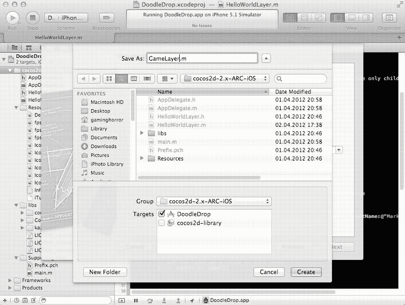

**图 4-5.** 为新场景命名，并确保将其添加到适当的组和目标中。

此时，`GameLayer` 类是空的，将其设置为场景的第一步是添加 `+ (id) scene` 方法。要插入的代码与第 3 章基本相同，仅更改了层的类名。在任何类中几乎总是需要 `–(id) init` 方法。添加 `–(void) dealloc` 方法也无妨，哪怕只是为了能够记录对象是否已被正确释放。监控 `dealloc` 方法可以作为检测内存泄漏的有效早期预警系统。

我也是一个非常谨慎的程序员，决定添加第 3 章中介绍的日志记录语句。生成的 `GameLayer.h` 如代码清单 4-1 所示，`GameLayer.m` 如代码清单 4-2 所示。

***代码清单 4-1.*** *包含场景方法的 GameLayer.h*

```
#import < Foundation/Foundation.h>
#import "cocos2d.h"

@interface GameLayer : CCLayer
{
}

+(id) scene;

@end
```

***代码清单 4-2.*** *包含场景方法、标准方法以及日志记录的 GameLayer.m*

```
#import "GameLayer.h"

@implementation GameLayer

+(id) scene
{
  CCScene *scene = [CCScene node];
  CCLayer* layer = [GameLayer node];
  [scene addChild:layer];
  return scene;
}

-(id) init
{
  if ((self = [super init]))
  {
  CCLOG(@"%@: %@", NSStringFromSelector(_cmd), self);
  }

return self;
}

-(void) dealloc
{
  CCLOG(@"%@: %@", NSStringFromSelector(_cmd), self);
}

@end
```

现在，你可以安全地删除 `HelloWorldLayer` 类了。当被询问时，选择“移至废纸篓”选项，从硬盘上移除该文件，而不仅仅是 Xcode 项目。同时选中两个 `HelloWorldLayer` 文件，然后选择编辑  删除，或者右键点击文件并从上下文菜单中选择删除。

Kobold2D 用户现在只需打开 Resources 组中的 `config.lua` 文件，并将 `FirstSceneClassName` 条目修改为：

```
FirstSceneClassName = "GameLayer",
```

仅此而已。但在纯 cocos2d 应用程序中，你必须修改 `AppDelegate.m`，并将所有对 `HelloWorldLayer` 的引用替换为 `GameLayer`。代码清单 4-3 突出了如果你不使用 Kobold2D，需要对 `#import` 和 `pushScene` 语句所做的必要更改。

***代码清单 4-3.*** *修改 AppDelegate.m 文件，使用 GameLayer 类代替 HelloWorldLayer*

```
// 将这一行 #import "HelloWorldLayer.h" 替换为：
#import "GameLayer.h"

- (BOOL)application:(UIApplication *)application ← didFinishLaunchingWithOptions:(NSDictionary *)launchOptions
{
  . . .

// 将 HelloWorldLayer 替换为 GameLayer
  [director_ pushScene:[GameLayer scene]];
}
```

编译并运行，你应该会得到一个……空白的场景。成功了！如果遇到任何问题，请将你的项目与本书附带的 DoodleDrop01 项目进行比较。

**提示：** 应用程序构建成功但无法运行？请记住，一个 Xcode 项目中可能有多个目标，甚至一个目标可能有多个方案。检查位于 Xcode 工具栏中“运行”和“停止”按钮旁边的方案选择/部署目标下拉菜单（参见图 2-6）。该下拉菜单的左半部分允许你选择活动方案。请确保选择的是名称中包含 DoodleDrop 的方案。其他大多数方案（如 cocos2d-library）将是静态库。你只能构建静态库，但无法运行它们。不幸的是，删除、隐藏或选择方案是每个用户的设置，必须由每个用户单独完成。若非如此，我本可以为你清理这些项目的。

## 添加玩家精灵

接下来，你将添加玩家精灵，并使用加速度计来控制玩家的动作。要添加玩家图像，请在 Xcode 中选择 Resources 组，然后选择文件  将文件添加到“DoodleDrop”…，或者右键点击并从上下文菜单中选择将文件添加到“DoodleDrop”…，以打开文件选择器对话框。如果你不小心将文件添加到了错误的组，你也可以在项目导航器中拖动文件。Resources 组也没有什么特别之处——它只是按定义应该包含非源代码的文件。


玩家图像`alien.png`和`alien-hd.png`位于本书附带的`DoodleDrop`项目的`Resources`文件夹中。您也可以选择自己的图像，只要其尺寸为 64x64 像素，而高清（HD）格式的尺寸为 128x128 像素，且文件名带有`-hd`后缀。在配备视网膜显示屏（Retina display）的 iPhone 和 iPod touch 设备上，`cocos2d`会自动使用高清文件；而普通标清（SD）文件仅在 iPhone 3GS 上使用。`Cocos2d`还能识别另外两种文件后缀：`-ipad`（适用于 iPad 和 iPad 2）以及`-ipadhd`（适用于第三代及更新配备视网膜显示屏的 iPad）。

`-hd`、`-ipad`和`-ipadhd`这些扩展名是`cocos2d`用于视网膜显示屏和 iPad 专用资源的默认文件扩展名。这些文件扩展名不用于普通的 iOS 应用。此类应用必须使用苹果的`@2x`文件扩展名来表示高分辨率图像。虽然`@2x`扩展名在`cocos2d`应用中也能工作，但`cocos2d`文档警告用户不要使用`@2x`文件扩展名。

**提示** 一个非常常见的问题是，是否可以在非视网膜设备上直接缩小高清图像。答案是不可以，这主要有两个原因。其一是内存限制。非视网膜设备的内存仅为最早期的视网膜设备的一半（或更少）。要求非视网膜设备加载高清图像将消耗四倍于已缩小并打包的标清图像的内存。其二，加载视网膜图像所需的时间明显更长，尤其是在像无视网膜显示屏的旧款和较慢设备上。

另一种方案是全程使用标准分辨率的资源，但这同样不理想。您将无法利用视网膜分辨率，并且您的应用的图像质量在视网膜设备上永远无法达到应有的高清晰度。没有任何缩放和巧妙的图像处理算法能通过标清图像在视网膜设备上生成清晰锐利的显示效果。这就是为什么您应该以高分辨率设计所有游戏资源，然后在必要时将其缩小。唯一需要注意的一点是，要使用能被二整除且没有余数的尺寸。

`Xcode`会询问您如何以及在哪里添加文件，如图 Figure 4-6 所示。请确保为每个将要使用这些文件的目标勾选“Add To Targets”复选框，图中仅勾选了`DoodleDrop`目标，但在`Kobold2D`中，您可能还需要将该文件添加到 Mac OS X 目标中。如果文件尚未位于项目文件夹中，则应该勾选“Copy items into destination group’s folder (if needed)”复选框。如有疑问，请确保已勾选此项，最坏情况是您会有重复的文件版本。如果不勾选，最坏情况是当您将项目添加到源代码控制或压缩并共享项目时，文件可能会丢失。

**提示** iOS 游戏的首选图像格式是 PNG（便携式网络图形）。它是一种压缩文件格式，但与 JPG 不同，其压缩是无损的，能完整保留原始图像的所有像素。虽然您也可以保存无压缩的 JPEG 文件，但相同图像的 PNG 格式通常比未压缩的 JPEG 文件更小。这仅影响应用包大小，而不影响纹理的内存（RAM）占用。不使用 JPEG 文件的另一个原因是，它们在 iOS 设备上使用`cocos2d`加载时特别慢——根据我上次的测量，速度大约比 PNG 慢 8 倍。在第 6 章中，您还将了解`TexturePacker`，这是一个为您管理图像的工具。它允许您将图像转换为多种压缩格式，或通过抖动和其他技术降低色深，同时保留尽可能好的图像质量。

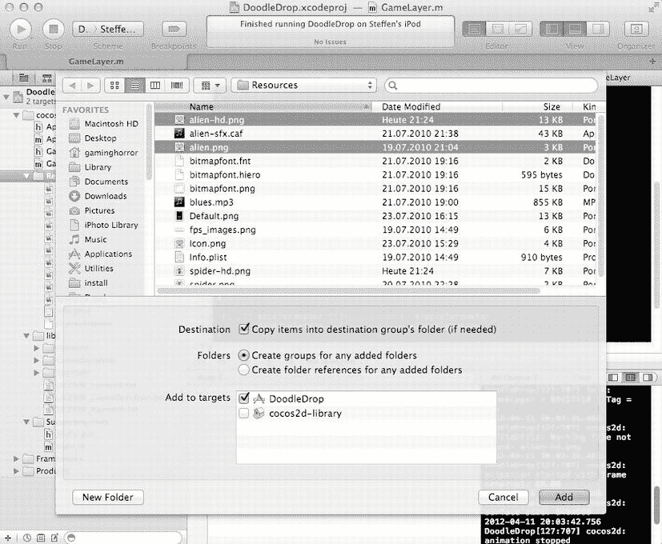

Figure 4-6 . 每当您添加资源文件时，都会看到此对话框。在大多数情况下，您应使用这些默认设置。

现在，将玩家精灵添加到游戏场景中。我决定将其作为`CCSprite*`成员变量添加到`GameLayer`类中。这样做目前更简单，而且游戏足够简单，所有内容都可以放在同一个类中。通常，这不是推荐的做法，所以后续章节中的项目将为了良好的代码设计，为各个游戏组件创建独立的类。

清单 4-4 展示了向`GameLayer`头文件中添加`CCSprite*`成员的过程。

***Listing 4-4.*** *将`CCSprite*` `Player*`作为成员变量添加到`GameLayer`类中*

```
#import < Foundation/Foundation.h>
#import "cocos2d.h"

@interface GameLayer : CCLayer
{
  CCSprite* player;
}

+(id) scene;

@end
```

清单 4-5 包含了我添加到`init`方法中的代码，用于初始化精灵、将其赋值给成员变量，并将其定位在屏幕底部中央。我还启用了加速度计输入。

***Listing 4-5.*** *启用加速度计输入并创建和定位玩家精灵*

```
-(id) init
{
  if ((self = [super init]))
  {
  CCLOG(@"%@: %@", NSStringFromSelector(_cmd), self);

self.isAccelerometerEnabled = YES;

player = [CCSprite spriteWithFile:@"alien.png"];
  [self addChild:player z:0 tag:1];

CGSize screenSize = [CCDirector sharedDirector].winSize;
  float imageHeight = player.texture.contentSize.height;
  player.position = CGPointMake(screenSize.width / 2, imageHeight / 2);
  }

return self;
}
```

玩家精灵以标签(tag)为 1 的方式作为子节点添加，稍后将用于识别并将玩家精灵与其他所有精灵区分开来。对于文件名，这里使用了标准分辨率图像文件名，即`alien.png`。`Cocos2d`将会在视网膜设备上自动加载`alien-hd.png`。如果没有相应的`-hd`文件，`cocos2d`将直接加载标准分辨率图像。在这种情况下，图像在视网膜设备上看起来会比非视网膜设备更小。为所有图像资源提供`-hd`变体是一种良好的实践。

**注意** iOS 设备上的文件名是区分大小写的。如果您尝试加载`Alien.png`或`ALIEN.PNG`，在模拟器中可以工作，但在任何 iOS 设备上都不行，因为实际名称是全小写的`alien.png`。这就是为什么坚持使用一致的命名约定（如始终使用全小写文件名）是个好主意。为什么是小写？因为全大写的文件名通常更难阅读，并且显得很突兀。

您通过将 x 位置设置为屏幕宽度的一半来使玩家精灵在水平方向上居中。在垂直方向上，您希望玩家精灵纹理的底部与屏幕底部对齐。如果您还记得第 3 章的内容，您就知道精灵纹理是围绕节点的位置居中的。将精灵垂直定位在 0 处会导致精灵纹理的下半部分位于屏幕之外。这不是您想要的效果——您需要将其向上移动半个纹理高度。


您可以通过调用`player.texture.contentSize.height`来获取精灵纹理的内容大小。具体来说，`contentSize`属性返回的是原始图像的尺寸。在第 3 章中提到，iOS 设备的纹理尺寸必须是 2 的幂次方，但实际图像尺寸可能小于纹理尺寸——例如图像为 100×100 像素，而纹理必须为 128×128 像素的情况。此时，`contentSize`属性会返回原始图像 100×100 像素的尺寸。大多数情况下，您应该使用`contentSize`而非纹理尺寸，即使图像尺寸本身是 2 的幂次方，也应使用`contentSize`，因为纹理可能来自包含多个图像的纹理图集（texture atlas）。纹理图集将在第 6 章中介绍。

通过取图像高度的一半并设置为 Y 轴位置，精灵图像将与屏幕底部完美对齐。

**提示**：尽可能避免使用固定位置是一种良好的编程实践。如果您简单地将玩家位置设置为`160, 32`，则意味着做出了两个应避免的假设：第一，假设屏幕宽度为 320 像素，但这并非适用于所有 iOS 设备；第二，假设图像高度为 64 像素，但这同样可能发生变化。一旦开始做出此类假设，代码的灵活性就会降低，后续修改也将耗费更多时间。

我编写定位代码的方式虽然需要多打一些字，但从长远来看收益巨大。您可以将其部署到不同设备上而无需修改，也可以使用不同尺寸的图像而无需调整。无需再修改这段特定代码。程序员面临的最耗时的任务之一就是修改基于假设的代码。

## 简单的加速度计输入

最后一步，完成让玩家精灵倾斜移动的功能。正如在第 3 章中演示的，您需要在接收加速度计输入的图层中添加加速度计方法。这里使用`acceleration.x`参数并将其添加到玩家位置，乘以 10 是为了加快玩家移动速度。

```objective-c
-(void) accelerometer:(UIAccelerometer *)accelerometer
  didAccelerate:(UIAcceleration *)acceleration
{
  CGPoint pos = player.position;
  pos.x + = acceleration.x * 10;
  player.position = pos;
}
```

是否发现有些异常？我写了三行代码，而看似一行就够了：

```objective-c
// 错误：左值需要作为赋值操作的左操作数
player.position.x + = acceleration.x * 10;
```

与其他编程语言（如 Java、C++、C#）不同，在 Objective-C 属性中，直接编写`player.position.x += value`是无效的。`position`属性是一个`CGPoint`类型，而`CGPoint`是普通的 C 结构体数据类型。Objective-C 属性无法直接对结构体中的字段进行赋值。问题源于 Objective-C 中属性的工作方式，以及作为其基础的 C 语言中赋值操作的机制。

语句`player.position.x`实际上是对位置 getter 方法`[player position]`的调用，这意味着您获取的是一个临时位置，然后尝试修改这个临时`CGPoint`的`x`成员。但随后这个临时`CGPoint`会被丢弃。位置 setter 方法`[player setPosition]`并不会自动被调用。您只能直接对`player.position`属性进行赋值——即赋给一个新的`CGPoint`。在 Objective-C 中，您必须接受这个不幸的问题——如果您有 Java、C++或 C#背景，可能需要改变编程习惯。

这就是为什么前面的代码必须先创建一个临时的`CGPoint`对象，修改该对象的`x`字段，然后将这个临时`CGPoint`赋值给`player.position`。不幸的是，在 Objective-C 中，您必须这样做。

## 首次测试运行

您的项目现在应该与本章提供的代码中`DoodleDrop02`文件夹里的项目处于同一水平。现在试运行一下。请确保选择在设备上运行应用程序，因为模拟器无法提供加速度计输入。测试此版本中加速度计输入的表现。

如果您尚未在 Xcode 中为此特定项目安装开发配置文件，将会遇到“代码签名”错误。在 iOS 设备上运行应用程序需要进行代码签名。请参考 Apple 文档，了解如何创建和安装必要的开发配置文件（`http://developer.apple.com/ios/manage/provisioningprofiles/howto.action`）。

## 玩家速度

注意到加速度计输入不太对劲吗？反应迟缓，运动不流畅。这是因为玩家精灵没有体验到真正的加速和减速。现在让我们来解决这个问题。您可以在`DoodleDrop03`项目中找到相应的代码变更。

实现加速和减速的概念不是直接改变玩家位置，而是使用一个独立的`CGPoint`变量作为速度向量。每次接收到加速度计事件时，速度变量会累加来自加速度计的输入。当然，这意味着您还必须将速度限制在一个任意最大值内；否则减速将花费太长时间。然后，无论是否接收到加速度计输入，每帧都会将速度加到玩家位置上。

**注意**：为什么不用动作（actions）来移动玩家精灵呢？当您需要频繁改变对象的速度或方向时（例如每秒多次），移动动作是一个糟糕的选择。动作被设计为相对长时间存活的一次性对象；频繁创建新动作会带来额外的内存分配和释放开销，这会迅速拖累游戏性能。

更糟糕的是，如果您不给动作留出执行时间，它们根本不起作用。这就是为什么每帧添加一个新动作来替换前一个动作不会产生任何效果的原因。许多 cocos2d 开发者都曾偶然遇到过这种看似奇怪的行为。

例如，每帧停止所有动作，然后为对象添加一个新的`MoveBy`动作，根本不会让它移动！`MoveBy`动作只会在下一帧改变对象的位置。但那时您已经停止了所有动作，并添加了另一个新的`MoveBy`动作。如此无限重复，对象将根本不会移动。这就像那个老套的比喻：过度驱使驴子，它会变得固执不动。

让我们来看看代码变更。在头文件中添加`playerVelocity`变量：

```objective-c
@interface GameLayer : CCLayer
{
  CCSprite* player;
  CGPoint playerVelocity;
}
```

如果您想知道我为什么使用`CGPoint`而不是`float`，谁说得准您将来是否想让玩家稍微向上或向下加速呢？因此，为未来的扩展做好准备总没有坏处。

Listing 4-6 展示了加速度计代码，我已将其修改为使用速度而非直接更新玩家位置。代码引入了三个新的设计参数：减速度（deceleration）、加速度计灵敏度（sensitivity）和最大速度（maximum velocity）。这些值没有绝对的最优解；您需要调整它们，找到最适合游戏设计的设置（因此它们被称为*设计参数*）。

减速度的工作原理是在将新的加速度计值乘以灵敏度并相加之前，先降低当前速度。减速度值越低，玩家改变外星人方向的速度越快。灵敏度越高，玩家对加速度计输入的响应越快。这些值会相互影响，因为它们作用于同一个变量，因此请确保一次只调整一个值。


### GameLayer 实现获得 `playerVelocity`

```
-(void) accelerometer:(UIAccelerometer *)accelerometer
  didAccelerate:(UIAcceleration *)acceleration
{
  // 控制速度衰减的快慢（数值越小，方向变化越快）
  float deceleration = 0.4f;
  // 决定加速度计的灵敏度（数值越高越灵敏）
  float sensitivity = 6.0f;
  // 最大速度限制
  float maxVelocity = 100;

  // 根据当前加速度计数值调整速度
  playerVelocity.x = playerVelocity.x * deceleration + acceleration.x * sensitivity;

  // 必须限制玩家精灵的最大速度，正反方向均需处理
  if (playerVelocity.x > maxVelocity)
  {
    playerVelocity.x = maxVelocity;
  }
  else if (playerVelocity.x < -maxVelocity)
  {
    playerVelocity.x = -maxVelocity;
  }
}
```

现在 `playerVelocity` 会发生变化，但如何将速度应用到玩家的位置上呢？通过在 `GameLayer init` 方法中调度 `update` 方法，并添加以下代码行：

```
// 调度 –(void) update:(ccTime)delta 方法使其在每一帧被调用
[self scheduleUpdate];
```

还需要添加 `–(void) update:(ccTime)delta` 方法，如代码清单 4-7 所示。被调度的 update 方法在每一帧都会被调用，在这里将速度应用到玩家的位置上。通过这种方式，无论加速度计输入的频率如何，都能在任意方向上实现平滑的恒定移动。

### 使用当前速度更新玩家位置

```
-(void) update:(ccTime)delta
{
  // 持续将 playerVelocity 累加到玩家的位置
  CGPoint pos = player.position;
  pos.x += playerVelocity.x;

  // 还需防止玩家移出屏幕
  CGSize screenSize = [CCDirector sharedDirector].winSize;
  float imageWidthHalved = player.texture.contentSize.width * 0.5f;
  float leftBorderLimit = imageWidthHalved;
  float rightBorderLimit = screenSize.width - imageWidthHalved;

  // 防止玩家精灵移出屏幕
  if (pos.x < leftBorderLimit)
  {
    pos.x = leftBorderLimit;
    playerVelocity = CGPointZero;
  }
  else if (pos.x > rightBorderLimit)
  {
    pos.x = rightBorderLimit;
    playerVelocity = CGPointZero;
  }

  // 将修改后的位置重新赋值
  player.position = pos;
}
```

边界检查用于防止玩家精灵离开屏幕。同样，需要考虑到玩家纹理的 `contentSize`，因为玩家位置位于精灵图像的中心，但你不希望图像的任一侧超出屏幕。为此，计算 `imageWidthHalved`，然后用它来检查新更新的玩家位置是否在左右边界范围内。这段代码可能略显冗长，但这样更容易理解。现在构建并运行项目，看看操控玩家的效果如何。

**提示** 你会注意到，这种直接的加速度计控制实现并不能带来像《Tilt to Live》这类游戏中的动态手感。原因在于，流畅的动态加速度计控制需要经过加速度计滤波。Kobold2D 中的 `KKInput` 类允许你以属性的方式获取高通（瞬时）和低通（平滑）滤波后的加速度计值，例如：`float smoothed = [KKInput sharedInput].acceleration.smoothedX;`。通常，采用加速度计控制的游戏会使用低通滤波器；*低通*意味着滤除加速度的突然、剧烈变化，从而使结果值更加平滑。以下是一个低通滤波器，它从加速度计输入值（`rawX`/`rawY`）和介于 0.0 到 1.0 之间的常量 `filterFactor` 生成新的 `smoothedX`/`smoothedY` 值（实例变量）。一个好的滤波因子是 0.1，这意味着只有 10% 的当前原始加速度值被计入新的平滑值：`smoothedX = (rawX * filterFactor) + (smoothedX * (1.0 - filterFactor));` `smoothedY = (rawY * filterFactor) + (smoothedY * (1.0 - filterFactor));`

## 添加障碍物

只有为游戏添加玩家需要躲避的物体，游戏才算完整。让我们引入一种自然界的怪物：一只六条腿的人面蜘蛛。谁不想躲开它呢？

与玩家精灵一样，你需要将 `spider.png` 和 `spider-hd.png` 文件添加到 Resources 组。然后在 `GameLayer.h` 文件的接口中添加三个新的成员变量：`spiders NSMutableArray`（其类引用如代码清单 4-9 所示），以及 `spiderMoveDuration` 和 `numSpidersMoved`（这两个变量在代码清单 4-12 中使用）：

```
@interface GameLayer : CCLayer
{
  CCSprite* player;
  CGPoint playerVelocity;

  NSMutableArray* spiders;
  float spiderMoveDuration;
  int numSpidersMoved;
}
```

**注意** 请避免在自己的代码中使用 `CCArray`。`CCArray` 是 `NSArray` 和 `NSMutableArray` 的更快替代品。但它的速度优势微乎其微，在绝大多数情况下几乎不会影响帧率。某些方法（如 `insertAtIndex` 或 `removeObjects`）甚至比 `NSMutableArray` 的对应方法慢得多。`CCArray` 最大的问题在于，过去已被证实存在严重缺陷，包括 ARC 兼容性问题。它也不支持 `NSArray`/`NSMutableArray` 的所有功能。例如，无法对 `CCArray` 使用 blocks 枚举，这使得它不适合并发处理（例如通过 Grand Central Dispatch）。总体而言，`CCArray` 在可靠性、兼容性或无缺陷方面远不如 `NSMutableArray`。我随时愿意为可靠性牺牲性能。Cocos2d 内部使用了 `CCArray`，并且对于内部用途，`CCArray` 已经过充分验证和测试。我建议你到此为止，不要在自己代码中使用它。

然后在 `GameLayer init` 方法中，紧接着 `scheduleUpdate` 之后，添加对接下来要讨论的 `initSpiders` 方法的调用：

```
-(id) init
{
  if ((self = [super init]))
  {
    ...

    [self scheduleUpdate];
    [self initSpiders];
  }
  return self;
}
```

之后，在 `GameLayer` 类中添加相当多的代码，首先是在代码清单 4-8 中创建蜘蛛精灵的 `initSpiders` 方法。

### 为方便访问，将蜘蛛精灵初始化并添加到 CCArray 中

```
-(void) initSpiders
{
  CGSize screenSize = [CCDirector sharedDirector].winSize;

  // 使用临时蜘蛛精灵是获取图片大小的最简单方法
  CCSprite* tempSpider = [CCSprite spriteWithFile:@"spider.png"];

  float imageWidth = tempSpider.texture.contentSize.width;

  // 使用尽可能多的蜘蛛，使它们能在整个屏幕宽度上并排放置。
  int numSpiders = screenSize.width / imageWidth;

  // 使用 alloc 初始化蜘蛛数组。
  spiders = [NSMutableArray arrayWithCapacity:numSpiders];

  for (int i = 0; i < numSpiders; i++)
  {
    CCSprite* spider = [CCSprite spriteWithFile:@"spider.png"];
    [self addChild:spider z:0 tag:2];

    // 同时将蜘蛛添加到蜘蛛数组中。
    [spiders addObject:spider];
  }

  // 调用方法重新定位所有蜘蛛
  [self resetSpiders];
}
```


好的，作为一名高级文档工程师和翻译员，我将严格按照您提供的注意事项和示例，将给定的英文文本翻译成符合要求的中文文档。


这里需要注意几点。你创建了一个临时`tempSpider CCSprite`，只是为了获取该精灵的图片宽度，然后根据这个宽度来决定一行能放置多少个蜘蛛精灵。获取图片尺寸最简单的方法是直接创建一个临时的`CCSprite`。请注意，你并没有将`tempSpider`作为子节点添加到任何其他节点，也没有将其赋值给实例变量。这意味着一旦执行离开`initSpiders`方法，ARC 会识别出`tempSpider`对象已不再使用，并自动释放其内存。

这与用来持有蜘蛛精灵引用的`spiders`数组形成对比。该数组被赋值给了实例变量`spiders`；因此，在`GameLayer`对象本身被释放之前，ARC 不会释放该对象。在 ARC 下，你无需以任何方式释放`spiders`数组。

在列表 4-8 的末尾，调用了`[self resetSpiders]`方法；此方法如列表 4-9 所示。将精灵的初始化与定位分开的原因是，游戏最终会结束，结束后需要重置游戏。最高效的方式是将所有游戏对象移回初始位置。然而，当游戏场景达到一定复杂度后，这种方式可能不再可行。最终，以让玩家等待场景重新加载为代价，直接重新加载整个场景可能会更简单。

**注意** 说到重新加载场景，你可能会想写`[[CCDirector sharedDirector] replaceScene:self];`来重新加载同一个场景。这会导致崩溃，因为`self`是当前正在运行的场景，而试图用一个正在运行的场景自身替换它是 cocos2d 不允许的，会导致应用崩溃。相反，你必须创建一个`GameLayer`类的新实例：`[[CCDirector sharedDirector] replaceScene:[GameLayer scene]];`。

***列表 4-9.*** *重置蜘蛛精灵的位置*

```
-(void) resetSpiders
{
  CGSize screenSize = [CCDirector sharedDirector].winSize;

// 获取任意一个蜘蛛精灵来得到它的图片宽度
  CCSprite* tempSpider = [spiders lastObject];
  CGSize size = tempSpider.texture.contentSize;

int numSpiders = [spiders count];
  for (int i = 0; i < numSpiders; i++)
  {
  // 将每个蜘蛛精灵放到屏幕外指定的位置
  CCSprite* spider = [spiders objectAtIndex:i];
  spider.position = CGPointMake(size.width * i + size.width * 0.5f,←
  screenSize.height + size.height);

[spider stopAllActions];
  }

// 安排蜘蛛更新逻辑按指定间隔运行。
  [self schedule:@selector(spidersUpdate:) interval:0.7f];

// 重置已移动蜘蛛计数器和蜘蛛移动持续时间（影响速度）
  numSpidersMoved = 0;
  spiderMoveDuration = 4.0f;
}
```

你再次临时获取一个现有蜘蛛的引用，通过其纹理的`contentSize`属性来获取图片大小。这里不需要创建新的精灵，因为已经有相同类型的精灵存在，并且所有蜘蛛都使用相同尺寸的同一张图片，你甚至不必关心获取的是哪个精灵。所以，直接简单地从数组中获取最后一个蜘蛛即可。

接着你修改每个蜘蛛的位置，使它们一起横跨整个屏幕宽度。你增加了半个图片宽度——再次重申，这是因为精灵的纹理以节点位置为中心。至于高度，你将每个精灵设置在屏幕上边界之上一个图片高度的位置。这个距离是任意的，只要图片不可见即可，这也是你唯一想要达到的效果。因为重置发生时蜘蛛可能仍在移动，所以此时你也停止了它的所有动作。

**提示** 为节省一些 CPU 周期，好的实践是，如果不是绝对必要，不要在`for`循环或其他循环的条件块中使用方法调用。在这个例子中，我创建了一个变量`numSpiders`来持有`[spiders count]`的结果，并在`for`循环的条件检查中使用它。在`for`循环的迭代过程中数组的元素个数保持不变，因为循环内并未修改数组本身。这就是为什么我可以缓存这个值，避免在`for`循环的每次迭代中重复调用`[spiders count]`。

我还安排了`spidersUpdate:`选择器每 0.7 秒运行一次，这决定了每隔多久会有一个新的蜘蛛从屏幕顶端掉落。如果该选择器已经被安排，cocos2d 会记录一条日志消息，你可以忽略它。cocos2d 不会再次安排该选择器，而只是更新已安排选择器的间隔时间。`spidersUpdate:`方法如列表 4-10 所示，它会随机选择一个现有的蜘蛛，检查其是否空闲，然后通过一系列动作让它从屏幕上掉落。

***列表 4-10.*** *spidersUpdate: 方法经常让一个蜘蛛掉落*

```
-(void) spidersUpdate:(ccTime)delta
{
  // 尝试找到一个当前不在移动的蜘蛛。
  for (int i = 0; i < 10; i++)
  {
  int randomSpiderIndex = CCRANDOM_0_1() * spiders.count;
  CCSprite* spider = [spiders objectAtIndex:randomSpiderIndex];

// 如果蜘蛛没有在移动，它就不会有任何正在运行的动作。
  if (spider.numberOfRunningActions == 0)
  {
  // 这是控制蜘蛛移动的动作序列
  [self runSpiderMoveSequence:spider];

// 一次只应有一个蜘蛛开始移动。
  break;
  }
  }
}
```

我不会让任何一个列表毫无亮点地通过，是吧？在这里，你可能会好奇为什么要精确地迭代十次来获取一个随机的蜘蛛。原因是，你不知道随机生成的索引是否会指向一个当前没在移动的蜘蛛，所以你需要有相当的把握最终能选到一个空闲的蜘蛛。如果经过十次尝试（这个数字是任意的）后，你仍没有运气随机选到一个空闲的蜘蛛，那就简单地跳过本次更新，等待下一次。

你可以使用一种蛮力方法，用一个`do/while`循环不断尝试寻找空闲蜘蛛。然而，有可能所有蜘蛛在同一时间都在移动，因为这取决于设计参数，比如新蜘蛛掉落的频率。在这种情况下，游戏会直接卡住，无限循环地试图寻找空闲蜘蛛。而且，我并不倾向于过于执着；对于这个游戏来说，如果在几秒钟内无法再让一个蜘蛛掉落，实际上影响并不大。也就是说，如果你查看`DoodleDrop03`项目，你会发现我添加了一条日志语句，它会打印出找到一个空闲蜘蛛需要重试多少次。

因为移动序列是蜘蛛执行的唯一动作，你只需检查蜘蛛是否正在运行任何动作，如果没有，就假定它是空闲的。这就引出了列表 4-11 中的`runSpiderMoveSequence`。

***列表 4-11.*** *蜘蛛的移动由一个动作序列处理*

```
-(void) runSpiderMoveSequence:(CCSprite*)spider
{
  // 随着时间的推移缓慢增加蜘蛛速度。
  numSpidersMoved++;
  if (numSpidersMoved % 8 == 0 && spiderMoveDuration > 2.0f)
  {
  spiderMoveDuration - = 0.1f;
  }

// 这是控制蜘蛛移动的动作序列。
  CGPoint belowScreenPosition = CGPointMake(spider.position.x,←
  -spider.texture.contentSize.height);
  CCMoveTo* move = [CCMoveTo actionWithDuration:spiderMoveDuration
  position:belowScreenPosition];


`CCCallBlock* callDidDrop = [CCCallBlock actionWithBlock:^void(){
  // 将掉落的蜘蛛移回屏幕顶部上方
  CGPoint pos = spider.position;
  CGSize screenSize = [CCDirector sharedDirector].winSize;
  pos.y = screenSize.height + spider.texture.contentSize.height;
  spider.position = pos;
  }];

CCSequence* sequence = [CCSequence actions:move, callDidDrop, nil];
  [spider runAction:sequence];
}`

`runSpiderMoveSequence`方法跟踪掉落蜘蛛的数量。每第八只蜘蛛，`spiderMoveDuration`会减小，因此任何蜘蛛的速度都会增加。如果你好奇`%`运算符，它被称为取模运算符。结果是除法运算的余数，这意味着如果`numSpidersMoved`能被 8 整除，取模运算的结果将为 0。

动作序列仅包含一个`CCMoveTo`动作和一个`CCCallBlock`动作。你可以改进它，让蜘蛛先下落一点，等待片刻，然后完全落下，就像邪恶的六腿人形蜘蛛通常做的那样。我将这个改进留给你，你可以在最终的 DoodleDrop 项目中找到示例实现。

目前，重要的是知道，我选择在传递给`CCCallBlock`动作的块函数中重置蜘蛛的位置。块函数可以直接使用传递给`runSpiderMoveSequence`方法的同一个`spider`变量。块在蜘蛛移动完成后被调用，意味着它已经落过了玩家角色。多亏了这个块，你无需费尽周折去寻找正确的蜘蛛。然后，蜘蛛的位置被重置到屏幕顶部正上方。列表 4-12 单独展示了与列表 4-11 相同的块。

***列表 4-12.***  *重置蜘蛛位置以便它能再次落下，这在`CCCallBlock`块中完成*

```
CCCallBlock* callDidDrop = [CCCallBlock actionWithBlock:^void(){
  // 将掉落的蜘蛛移回屏幕顶部上方
  CGPoint pos = spider.position;
  CGSize screenSize = [CCDirector sharedDirector].winSize;
  pos.y = screenSize.height + spider.texture.contentSize.height;
  spider.position = pos;
}];
```

到目前为止，一切顺利。你现在可能想构建并运行游戏，玩一会儿。我想你会很快发现还缺少什么。提示：阅读下一个标题。

**碰撞检测**

你可能会惊讶地发现，碰撞检测可以像列表 4-13 那样简单。诚然，这仅检查玩家和所有蜘蛛之间的距离，这使得这种碰撞检测成为*径向检测*。对于这类游戏来说，这已经足够了。将`[self checkForCollision]`的调用添加到`–(void) update:(ccTime)delta`方法的末尾，同时添加`resetGame`方法，用于重置蜘蛛。

***列表 4-13.***  *简单的范围检测或径向碰撞检测已足够*

```
-(void) checkForCollision
{
  // 假设：玩家和蜘蛛图像均为方形。
  float playerImageSize = player.texture.contentSize.width;
  CCSprite* spider = [spiders lastObject];
  float spiderImageSize = spider.texture.contentSize.width;
  float playerCollisionRadius = playerImageSize * 0.4f;
  float spiderCollisionRadius = spiderImageSize * 0.4f;

// 此碰撞距离将大致等于图像形状。
  float maxCollisionDistance = playerCollisionRadius + spiderCollisionRadius;

int numSpiders = spiders.count;
  for (int i = 0; i < numSpiders; i++)
  {
     spider = [spiders objectAtIndex:i];

if (spider.numberOfRunningActions == 0)
      {
      // 这只蜘蛛甚至没有移动，因此我们可以跳过检查。
      continue;
      }

// 获取玩家与蜘蛛之间的距离。
      float actualDistance =     ccpDistance(player.position, spider.position);

// 两个物体是否比允许的更接近？
      if (actualDistance <     maxCollisionDistance)
      {
      // 游戏结束（目前只需重新开始游戏）
  [self resetGame];
      break;
    }
  }
}

-(void) resetGame
{
  [self resetSpiders];
}
```

玩家和蜘蛛的图像尺寸被用作碰撞半径的参考。对于这个游戏来说，这种近似已经足够好了。如果你查看 DoodleDrop03 项目，你还会注意到我添加了一个调试绘制方法（见列表 4-14），用于渲染每个精灵的碰撞半径。

你遍历所有蜘蛛，但忽略那些当前不移动的蜘蛛，因为它们肯定在范围之外。`ccpDistance`方法计算当前蜘蛛和玩家之间的距离。这是另一个没有文档记录但完全受支持的 cocos2d 方法。你可以在 Xcode 项目的`cocos2d/Support`组中的`CGPointExtension`文件以及 Learn Cocos2D 网站`www.learn-cocos2d.com/api-ref`上托管的修订版 cocos2d API 参考中找到这些及其他有用的数学函数。

得到的距离然后与玩家的碰撞半径和蜘蛛的碰撞半径之和进行比较。如果实际距离小于该和，则发生碰撞。由于你尚未实现游戏结束，你可以只重置所有蜘蛛来重新开始游戏。

***列表 4-14.***  *在调试构建中绘制碰撞半径*

```
#if DEBUG
-(void) draw
{
    [super draw];

// 遍历层的所有节点。
    for (CCNode* node in [self children])
    {
       // 确保节点是 CCSprite 并具有正确的标签。
       if ([node isKindOfClass:[CCSprite class]] && (node.tag == 1 || node.tag == 2))
       {
       // 精灵的碰撞半径是其图像宽度的百分比。
       // checkForCollision 方法中使用相同的系数。
       CCSprite* sprite =    (CCSprite*)node;
       float radius = sprite.texture.contentSize.width * 0.4f;
       float angle =    0;
       int numSegments = 10;
       bool drawLineToCenter = NO;
       ccDrawCircle(sprite.position, radius, angle, numSegments, drawLineToCenter);
      }
    }
}
#endif
```

**标签和位图字体**

标签是 cocos2d 游戏中仅次于精灵的第二重要的图形元素。`CCLabelTTF`类似乎是最简单且最灵活的解决方案，但如果你需要频繁更改显示的文本，其性能会很差。替代方案是`CCLabelBMFont`类，它渲染位图字体而非 TrueType 字体。除此之外，我还将向你介绍 Glyph Designer，这是一个优雅的工具，用于将 TrueType 字体转换为位图字体，并通过阴影、渐变等效果对其进行增强。

**添加分数标签**

游戏需要某种计分机制。我们添加一个简单的时间流逝计数器作为分数。首先在`GameLayer`类的`init`方法中添加分数的`Label`：

```
scoreLabel = [CCLabelTTF labelWithString:@"0" fontName:@"Arial" fontSize:48];
scoreLabel.position = CGPointMake(screenSize.width / 2, screenSize.height);

// 调整标签的 anchorPoint 的 y 位置，使其与顶部对齐。
scoreLabel.anchorPoint = CGPointMake(0.5f, 1.0f);

// 将分数标签的 z 值设为-1，以便它绘制在其他所有内容下方。
[self addChild:scoreLabel z:-1];
```


# 排版后的内容

你还需要在 `GameLayer.h` 文件中声明 `score` 和 `scoreLabel` 实例变量。不过，这里不使用 `CCLabelTTF` 对象，而是采用一个实现了 `CCLabelProtocol` 的 `CCNode` 对象。这样，日后你可以将实现方式从 `CCLabelTTF` 切换为 `CCLabelBMFont`，而无需修改实例变量的声明。使用协议而非具体类是**基于接口编程**的一个实例，它能让程序更易于修改和维护。现在，`scoreLabel` 无需关心它究竟是 `CCLabelTTF` 还是 `CCLabelBMFont` 对象。

```
@interface GameLayer : CCLayer
{
    CCSprite* player;
    CGPoint playerVelocity;

    NSMutableArray* spiders;
    float spiderMoveDuration;
    int numSpidersMoved;

    int score;

    CCNode < CCLabelProtocol > * scoreLabel;
}
```

目前我刻意选择了 `CCLabelTTF` 对象，因为对于大多数初学 cocos2d 的开发者来说，这很可能是首选。而这也正是情况可能迅速变得棘手的地方。在第 3 章中，我曾提到更新 `CCLabelTTF` 的文本内容速度很慢。整个纹理是用 iOS 字体渲染方法重新创建的，除了分配新纹理和释放旧纹理外，这些方法本身也很耗时。在当前一代设备上，如果只有一个标签，你可能察觉不到。但如果在 iPhone 3GS 上运行游戏，且同时使用多个频繁更新的设备，你或许会注意到帧率严重下降。

但请记住，`CCLabelTTF` 仅在频繁更改其字符串时才会变慢。如果你在场景开始时创建一次 `CCLabelTTF`，之后从不或极少更改它，那么它的性能与任何相同尺寸的 `CCSprite` 一样快。

你还应该更新 `resetGame` 方法，以便重置 `score` 和 `scoreLabel` 变量：

```
-(void) resetGame
{
    [self resetSpiders];

    score = 0;

    [scoreLabel setString:@"0"];
}
```

为了方便测试频繁更改标签，你可以在 `update` 方法中添加以下代码行。它会简单地打印到目前为止已渲染的总帧数：

```
score = [CCDirector sharedDirector].totalFrames;
[scoreLabel setString:[NSString stringWithFormat:@"%i", score]];
```

## 介绍 CCLabelBMFont

以消耗更多内存为代价实现快速更新的标签，是 `CCLabelBMFont` 类的专长，它与其他 `CCSprite` 类似。我已在 DoodleDrop04 中将 `CCLabelTTF` 替换为 `CCLabelBMFont`。代码修改相对简单；你需要更改 `init` 方法中的那一行，如下所示：

```
scoreLabel = [CCLabelBMFont labelWithString:@"0" fntFile:@"bitmapfont.fnt"];
```

**注意** 位图字体是游戏的上佳选择，因为它们速度快，但有一个缺点：任何位图字体的大小都是固定的。如果你需要相同字体但尺寸更大或更小，可以对 `CCLabelBMFont` 进行缩放——但放大时图像质量会下降，而缩小时又会浪费内存。另一种选择是使用新尺寸创建单独的字体文件，但这会占用更多内存，因为每个位图字体的变体都会使用自己的纹理。

你还需要添加 `bitmapfont.fnt` 和 `bitmapfont-hd.fnt` 文件，以及配套的 `bitmapfont.png` 和 `bitmapfont-hd.png`，这些文件都在 DoodleDrop04 项目的 `Resources` 文件夹中。不过，不要添加 `.GlyphProject` 文件——这些文件仅供 Glyph Designer 工具使用，也仅对该工具有用。

过去，创建位图字体的工具是 Hiero，但时至今日，如果你真的不想花一分钱，Hiero 才仍然是唯一的选择。Hiero 由 Kevin James Glass 编写，是一个免费的 Java Web 应用程序，可从 `http://slick.cokeandcode.com/demos/hiero.jnlp` 获取。

其缺点在于，它是一个免费的 Java Web 应用程序。由于缺少安全证书，它要求你信任该应用程序。另一方面，许多开发人员都在使用这个工具，到目前为止还没有证据表明该应用程序不可信。Hiero 还具有几个诡异且令人厌烦的 bug，其中包括一个恼人的 bug，会导致生成的图像文件上下颠倒。如果你在应用中看到的只是乱码而不是位图字体的文本，你可能需要用图像编辑程序将位图字体 PNG 图像上下颠倒。我在我的 Hiero 教程中记录了这些问题及解决方法：`www.learn-cocos2d.com/knowledge-base/tutorial-bitmap-fonts-hiero`。

还有一些开发人员极力推荐 BMFont。但作为一款 Windows 程序，它需要一台 Windows 电脑，或者在 Mac 的虚拟机中安装 Windows。这就是它在 Mac 开发者社区中未被更广泛使用的原因。你可以从 `www.angelcode.com/products/bmfont` 下载 BMFont。

对于其他所有人来说，还有 Glyph Designer。

## 使用 Glyph Designer 创建位图字体

`www.71squared.com` 的团队发布了名为 Glyph Designer 的 Hiero 替代工具。虽然它不是免费的，但每一分钱都物有所值。

你可以从 `http://glyphdesigner.71squared.com` 下载试用版，如果你已熟悉 Hiero，你会注意到它们在功能上惊人的相似性，尽管用户界面更加易于使用，且鼓励尝试。Mike Daley 还在 Cocos2D 播客的一集（可从 `http://cocos2dpodcast.wordpress.com` 获取）中提到，Glyph Designer 将增加一项新功能，允许你与该工具的其他用户共享字体设计。

图 4-7 展示了 Glyph Designer 的实际操作。创建位图字体的过程相对轻松愉快，随意调整各种旋钮、按钮和颜色也无妨。我仅为你概述基本的编辑区域。

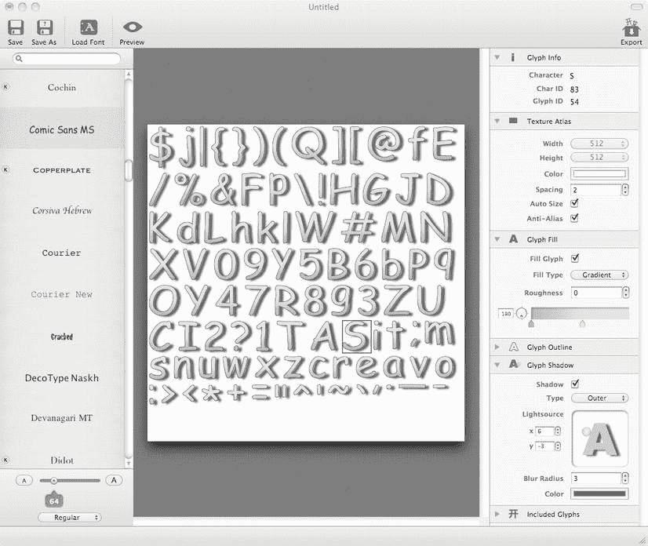

图 4-7 Glyph Designer 允许你从任何 TrueType 字体创建位图字体，并能导出与 cocos2d 的 `CCLabelBMFont` 类兼容的 FNT 和 PNG 文件

在左侧，你有 TrueType 字体列表，如果这些还不够，你可以使用加载字体图标来加载任何 TTF 文件。在列表下方，你可以使用滑块更改字体大小，还可以切换为粗体、斜体和其他字体样式。

**提示** 创建支持 Retina 的位图字体很容易。照常创建你的字体并导出。这将是你非 Retina 或 SD 字体。然后在 Glyph Designer 中将字体大小改为正常大小的两倍；例如，将滑块从字体大小 30 移到字体大小 60。然后使用相同的名称但加上 `-hd` 后缀重新导出字体。现在，你就有了普通/SD 和 Retina/HD 两种尺寸的相同字体。

如果启用了 Retina 支持，并且游戏在 Retina 设备上运行，Cocos2d 将自动识别并使用带有 `-hd` 后缀的字体。

在屏幕中央，你会看到用于当前字体设置生成的纹理图集。请注意，当你修改字体设置时，纹理图集的大小和字形顺序会频繁变化。你也可以选择一个字形，在右侧窗格的“字形信息”下查看其信息。

再往下，在右侧窗格中，你可以更改纹理图集设置，虽然大多数情况下你无需这样做。Glyph Designer 会确保纹理图集的大小始终足够容纳单个纹理中的所有字形。

使用字形填充设置，你可以更改颜色和字形的填充方式，包括渐变设置。除此之外，你还可以选择更改字形轮廓（每个字形周围的黑色细线）和字形阴影，这可以让你为字体创建一种 3D 效果的外观。


在右侧窗格的最底部，你会看到“包含的字形”部分。你可以从中选择一个预定义的字形集，将其包含在纹理图集中。如果你完全确定不需要某些字符，也可以输入自定义的字符列表来减小纹理尺寸。这对于得分字符串尤其有用，因为其中可能只需要数字和极少数额外字符。例如，`DoodleDrop`项目中使用的位图字体仅包含字母，以最小化字体的内存占用。

对位图字体感到满意后，你可以保存整个项目，以便日后恢复之前的设置。要将字体保存为`cocos2d`可用的格式，需要通过 `File`  `Export` 将其导出为`.fnt`（`Cocos2d Text`）格式。然后，你可以将`Glyph Designer`创建的`FNT`和`PNG`文件添加到`Xcode`项目中，并使用`CCLabelBMFont`类来加载`FNT`文件。

**注意** 如果尝试使用`CCLabelBMFont`显示`.fnt`文件中不存在的字符，这些字符将被跳过且不会显示。例如，执行`[label setString:@"Hello, World!"]`时，如果位图字体仅包含小写字母而没有标点符号，则显示的字符串将为`ello orld`。

## 简单播放音频

我添加了一些音频文件来完成这个游戏。在`DoodleDrop04`项目的`Resources`文件夹中，你可以找到名为`blues.mp3`和`alien-sfx.caf`的音频文件，可将其添加到项目中。在`cocos2d`中播放音频文件的首选且最简单的方法是使用`SimpleAudioEngine`。音频支持并非`cocos2d`的核心部分，而是属于`CocosDenshion`的领域——这是`cocos2d`的一个第三方扩展，幸运的是它与`cocos2d`一起分发。

**提示** 如果你在寻找替代的声音引擎，我推荐`ObjectAL`，可从`http://kstenerud.github.com/ObjectAL-for-iPhone`获取，它已集成在`Kobold2D`中（参见第 16 章）。`ObjectAL`拥有简洁的 API 和出色的文档，但仅兼容`iOS`。

由于`CocosDenshion`被视为与`cocos2d`独立的代码，因此每次使用`CocosDenshion`音频功能时，都需要添加相应的头文件，如下所示：

```
#import "GameLayer.h"
#import "SimpleAudioEngine.h"
```

你会发现使用`SimpleAudioEngine`播放音乐和音频非常直接，如下所示：

```
[[SimpleAudioEngine sharedEngine] playBackgroundMusic:@"blues.mp3" loop:YES];
[[SimpleAudioEngine sharedEngine] playEffect:@"alien-sfx.caf"];
```

你可能希望在游戏启动时预加载音效，以避免首次播放每个音效时出现微小延迟。这也很容易实现：

```
[[SimpleAudioEngine sharedEngine] preloadEffect:@"alien-sfx.caf"];
```

对于音乐和较长的语音文件，播放`MP3`文件是首选。请注意，同一时间只能播放一个`MP3`文件作为背景音乐。从技术上讲，可以同时播放两个或多个`MP3`文件，但只有一个能在硬件中解码。额外的 CPU 负担对游戏来说是不理想的，因此除非应用设计需要，否则应避免同时播放多个`MP3`文件或仅对两个音轨进行交叉淡入淡出。

这也意味着短促的音效不应使用`MP3`格式。对于这些音效，我在`WAV`或`CAF`文件格式的 16 位`PCM`（未压缩）音频方面有良好体验。对于大多数游戏音效，采样率可以是 22.5 kHz，除非你需要或想要水晶般清晰的音质，在这种情况下则使用 44.1 kHz。

`Mac OS X`上一个出色且完整的音频编辑工具是`Audacity`，你可以从`http://audacity.sourceforge.net`免费下载。如果你只需快速将音频文件从一种格式转换为另一种格式，并可能更改采样率等基本设置，我推荐`Steve Dekorte`开发的`SoundConverter`。该工具可免费用于大小不超过 500KB 的文件，而无需限制地使用`SoundConverter`的许可证仅需 15 美元。你可以从`http://dekorte.com/projects/shareware/SoundConverter/`下载`SoundConverter`。

`SoundConverter`的一个免费替代品是命令行工具`afconvert`。建议熟悉`Terminal`。你可以用`afconvert`做很多事，但作为一个命令行工具，你也不得不输入很多内容。要获取`afconvert`的帮助，请打开`Terminal`应用并输入以下内容：

```
afconvert -h
```

根据苹果的音频编码操作指南，`iOS`设备的首选音频格式是 16 位、小端、线性`PCM`，打包为`CAF`文件（苹果`CAF`音频格式代码：`LEI16`）。该指南包含了对音频编程普遍有用的建议：`http://developer.apple.com/library/ios/#codinghowtos/AudioAndVideo/_index.html`。

要将`afconvert`支持的任何音频文件转换为首选的`iOS`音频格式，请按如下方式运行`afconvert`命令：

```
afconvert -f caff -d LEI16 myInputFile.mp3 myOutputFile.caf
```

`-f`（或`-file`）开关指定文件格式，对于`CAF`文件是`caff`。使用`-d`开关，你可以指定音频数据格式，这里为`LEI16`。你可以通过运行`afconvert -hf`来获取`afconvert`支持的音频数据格式列表。

**注意** 如果你遇到音频文件无法播放或发出混乱噪音的情况，很可能不是你的代码或设备出了问题。有无数音频应用程序和音频编解码器，它们都会创建各自格式的变体。有些文件在`iOS`设备上无法播放，但在其他设备上却正常。特别是`WAV`文件似乎容易受到影响，这就是为什么我更倾向于使用苹果更原生的音频容器格式`CAF`。通常，修复损坏音频文件的方法是，在一个你知道能够保存`iOS`兼容音频文件的音频编辑程序中打开该文件，然后重新保存。你可以用恰如其名的`SoundConverter`或你选择的音频应用程序来完成此操作。通常，在重新保存后，该文件就能在`iOS`设备上正常播放了。同时，声音问题在`iOS`模拟器中也很常见。如果问题仅出现在模拟器中，你可以忽略它，或者尝试重启电脑来修复。

## iPad 相关注意事项

由于所有坐标都考虑了屏幕尺寸，游戏在`iPad`更大的屏幕上运行时应该能无缝缩放。事实也确实如此，就这么简单。相比之下，如果你使用了固定坐标，就会面临游戏的大规模返工。

你可以通过将`DoodleDrop`项目部署到`iPad`设备上，或从方案下拉菜单中选择`iPad`模拟器来尝试这一点。

## 支持 Retina iPad

第三代`iPad`配备了`Retina`显示屏，其像素数量是前代产品的四倍。但如果按原样运行`DoodleDrop`项目，你可能会注意到图像在`Retina iPad`上显得太小。

在`iPad`上运行应用时，`cocos2d`会尝试加载带有后缀`–ipad`和`–ipadhd`的资源。如果这些资源不存在，`cocos2d`会回退到加载不带后缀的标准分辨率资源。在这种情况下，`Retina iPad`将找不到任何资源的`–ipadhd`版本，并显示较小的`SD`资源。


您可以为您的资产提供`–ipad`和`–ipadhd`两种变体，或者更改`cocos2d`应查找的后缀类型。对于`DoodleDrop`项目，在 Retina iPad 上使用常规 Retina 资产就足够了。通过将 iPad 和 iPad Retina 后缀分别更改为空字符串和`–hd`来实现这一点：

```
[CCFileUtils setiPadSuffix:@""];
[CCFileUtils setiPadRetinaDisplaySuffix:@"-hd"];
```

请尽早运行此代码——例如，在第一个场景的`init`方法中或直接在`AppDelegate`类中运行。此后，第一代和第二代 iPad 将加载无后缀的资产，而 Retina iPad 将加载`–hd`资产。

## 一个通用应用还是两个独立应用？

在将应用移植到 iPad 时，通常需要决定应用在 App Store 上是作为单个（通用）应用发布，还是应作为两个独立的应用发布。这两种方案各有利弊。一般来说，通用应用对客户更好、更公平，而独立应用可能对开发者更有利。

通用应用包含适用于 iPhone/iPod touch 和 iPad 设备的代码和资产。缺点是所有资产都被添加到同一个 Xcode 目标中，这会增加应用的体积——可能超过（目前）50 MB 的 OTA 下载限制。这是技术上的缺点，在性能方面没有损失。

使用通用应用时，您无法为 iPhone/iPod touch 和 iPad 版本设定不同的价格。考虑到 iPad 用户通常更愿意为应用支付更高的价格，这可能是最大的遗憾。此外，您也无法知道下载的购买中有多少百分比来自 iPad 用户。您需要让应用进行数据回传才能确定这一点。

尽管如此，通用应用在 App Store 排行榜中仍会按设备分别排名。如果用户在 iPhone 或 iPod touch 设备上下载或购买了应用，它将被计入 iPhone 排名。在 iPad 上的下载/购买同理，会增加应用在 iPad 排行榜中的排名。这引出了一个问题：iTunes 下载/购买是如何计算的？它们仅被计入 iPhone 排名。这使得您即使添加了分析跟踪代码，也无法估算有多少用户是 iPad 用户。

将应用拆分为 iPhone/iPod touch 和 iPad 两个独立应用，可以让您将游戏资产分开。但最大的缺点是，如果 iOS 用户同时想要 iPhone 和 iPad 版本，他们必须购买两次。这对您有利，但对客户不利。有些用户会毫不犹豫地因此给您的应用打差评。

由于您的应用在 App Store 中被视为两个完全独立的应用，至少客户评论和意见将是针对特定应用版本的。您还可以针对目标平台优化每个应用的描述和截图，并分别更新每个版本。如果您的应用已经在 App Store 上架一段时间，拆分应用也是一个不错的选择，因为在通用应用中添加对新设备的支持不会使您的应用出现在 App Store 的“新内容”部分。

## 限制设备支持

默认情况下，所有`cocos2d`项目都被设置为通用应用，可在 iPhone、iPod touch 和 iPad 设备上原生运行。但您可以将应用更改为仅适用于 iPhone 和 iPod touch，或仅适用于 iPad。

首先，在项目导航器中选择`DoodleDrop`项目。这会显示目标列表，您在其中选择`DoodleDrop`目标，然后选择摘要选项卡。在 iOS 应用程序目标部分下，有一个标有“设备”（Devices）的下拉控件，它提供了三个选项：iPhone、iPad 和通用。

在图 4-8 中，目标被设置为构建通用应用。将此设置更改为 iPhone 或 iPad 将限制您的应用仅适用于该设备的用户。当然，iPad 用户仍然可以购买和下载 iPhone 应用，但这些应用在 iPad 上会以 iPhone 屏幕大小的应用显示，iPad 用户可以选择使用 2x 按钮放大。

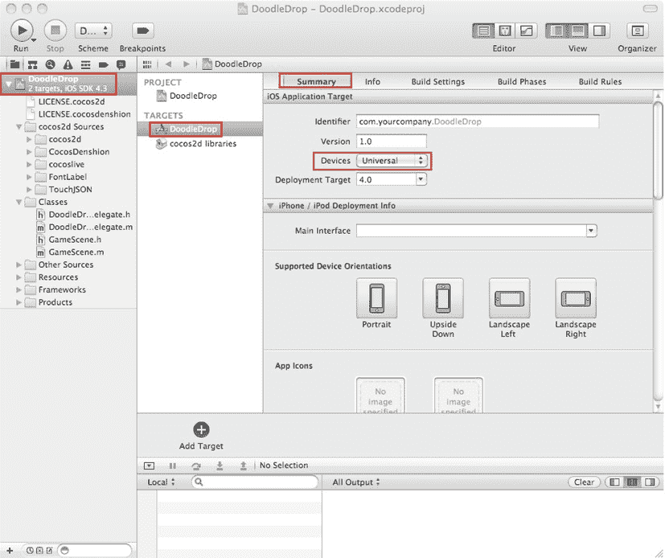

图 4-8 . 更改应用程序目标以构建通用应用，或构建仅限于 iPhone/iPod touch 或 iPad 的应用

现在您可能会想，如果我想要 iPhone 和 iPad 的两个独立目标呢？这可用于为 iPhone 和 iPad 版本设置不同的价格，或者只是为了减小任一版本的下载体积。

在这种情况下，您需要做的就是选择目标（此处为`DoodleDrop`），然后选择编辑 复制。或者直接右键点击目标并选择复制。这将创建一个目标的副本，允许您将一个目标的“设备”设置设为 iPhone，将另一个目标的“设备”设置设为 iPad。现在您为每种设备类型都拥有了一个单独的目标，您可能需要重命名这两个目标及其方案以避免混淆。

## 总结

我希望您在构建这第一个游戏时感到愉快。虽然内容很多，但我宁愿提供过多的信息，也不愿信息不足。

至此，您已经学会了如何创建自己的游戏层类以及如何使用精灵。您已经使用加速度计来控制玩家，并添加了速度以允许玩家精灵加速和减速，使其具有更动态的感觉。

我们还讨论了使用来自同样未记录的`CGPointExtensions`的距离检查方法进行的简单径向碰撞检测。作为甜点，您了解了标签、位图字体和 Glyph Designer 工具，并辅以一些音频编程。

还剩下什么？也许可以看看本章的源代码。我已经添加了一个最终版本的此游戏，包含一些游戏玩法的改进、一个启动菜单和一个游戏结束信息。

关于`DoodleDrop`项目，我还没有提到一件事：它所有的代码都在一个类中。对于一个小项目来说，这或许足够了，但随着您实现更多功能，它会很快变得混乱。您需要为代码设计增加一些结构。下一章将为您提供`cocos2d`编程最佳实践，向您展示如何布局代码，并讨论当对象不再位于同一个类时，如何在它们之间传递信息的各种方法。

同时，您可能想看看`DoodleDrop05`游戏，我增加了一个游戏结束界面和额外的视觉效果进行了改进。

# 第 5 章 游戏构建模块

第 4 章中的游戏`DoodleDrop`的编写是为了让`cocos2d`新手易于理解。然而，如果您是经验更丰富的开发者，您可能会注意到代码没有分离——所有内容都在一个文件中。显然，这是不可扩展的。如果您要制作比`DoodleDrop`更大、更刺激的游戏，您必须找到一种合适的方法来组织代码。否则，您最终可能会得到一个类来驱动游戏逻辑。代码量可能会迅速增长到数千行，使得导航变得困难，并容易从任何地方修改任何内容，这非常可能引入细微且难以发现的错误。

每个新项目都要求有其自身的代码设计。在本章中，我将向您介绍一些用于编写更复杂的`cocos2d`游戏的构建模块。然后，您可以使用本章奠定的代码基础，来创建您将在接下来的几章中构建的横版射击游戏。


## 处理多场景

由于本章包含大量参考资料，我将专注于相关代码，并省略创建新 cocos2d 类的细节（如前几章所示）。此时你可能想下载本书的源代码，以查看本章项目的实际运行效果。你可以从 `www.apress.com` 的本书页面或 Learn Cocos2D 网站 `www.learn-cocos2d.com/store/book-learn-cocos2d` 下载本书的源代码。

`DoodleDrop` 游戏只有一个场景和一个层。更复杂的游戏需要多个场景和多个层。如何以及何时使用它们将成为你的本能。让我们看看具体涉及哪些内容。

### 添加更多场景

在上一章的代码清单 4-1 和 4-2 中，我概述了创建场景所需的基本代码。这些基础知识仍然适用。添加更多场景就是基于相同的基本代码添加更多类。当你需要在场景间转换时，事情会变得更有趣。当你通过 `CCDirector replaceScene` 方法替换场景时，`CCNode` 中有一组三个方法会被发送给当前场景层级中的每个节点对象（如精灵、标签、菜单项等）。你可以用这些方法来响应场景变化、释放一些内存或在新场景中加载额外资源。

`onEnter` 和 `onExit` 方法会在场景切换的特定时间被调用，具体取决于是否使用了 `CCTransitionScene`。你必须始终调用这些方法的 `super` 实现，以避免输入问题和内存泄漏。请看代码清单 5-1，注意所有这些方法都调用了 `super` 实现。

**代码清单 5-1.** `onEnter` 和 `onExit` 方法

```
-(void) onEnter
{
    // 在新场景的 init 方法运行后立即发送。
    // 如果使用了 CCTransitionScene：在过渡开始时发送。

[super onEnter];
}

-(void) onEnterTransitionDidFinish
{
    // 在 onEnter 之后立即发送给新场景。
    // 如果使用了 CCTransitionScene：在过渡结束时发送。

[super onEnterTransitionDidFinish];
}

-(void) onExit
{
    // 在前一个场景的 dealloc 方法运行前发送。
    // 如果使用了 CCTransitionScene：在过渡结束时发送。

[super onExit];
}

-(void) onExitTransitionDidStart
{
    // 仅在使用 CCTransitionScene 时发送给前一个场景。
    // 在过渡开始时发送，与新场景的 onEnter 方法同时运行。

[super onExitTransitionDidStart];
}
```

**注意：** 如果你在 `onEnter` 方法中不调用 `super` 实现，你的新场景将无法响应触摸或加速度计输入。如果你在 `onExit` 中不调用 `super`，当前场景将无法从内存中释放。如果不调用另外两个方法的 `super` 实现，也可能会出现类似问题。由于这很容易被遗忘，且由此产生的行为不会让你意识到可能与这些方法有关，因此强调这一点非常重要。

当你需要在任何节点（`CCNode`、`CCLayer`、`CCScene`、`CCSprite`、`CCLabelTTF` 等）中，在场景更改之前或之后立即执行某些操作时，这些方法非常有用。与简单地在节点的 `init` 或 `dealloc` 方法中编写相同代码的区别在于：在 `onEnter` 期间场景已经完全设置好，而在 `onExit` 期间场景仍然包含所有节点。

这可能很重要。例如，如果你执行过渡来更改场景，你可能希望暂停某些动画或隐藏用户界面元素，直到过渡完成。以下是使用从 `FirstLayer` 到 `SecondLayer` 的场景过渡时，这些方法被调用的顺序，基于 `ScenesAndLayers01` 项目的日志信息：

1. `scene: SecondLayer`
2. `init: SecondLayer`
3. `onExitTransitionDidStart`: `FirstLayer`
4. `onEnter: SecondLayer`
5. `// 此处过渡运行几秒钟...`
6. `onExit: FirstLayer`
7. `onEnterTransitionDidFinish: SecondLayer`
8. `dealloc: FirstLayer`

首先，调用 `SecondLayer` 的 `+ (id) scene` 方法来初始化一个 `CCScene`。这也会向场景添加一个 `CCLayer`。然后调用 `SecondLayer` 的 `init` 方法，紧接着在第 4 行调用 `onEnter` 方法。在此之前，`FirstLayer` 中的所有节点会收到 `onExitTransitionDidStart` 消息，作为场景已开始过渡到另一个场景的提示。

在第 5 行，过渡正在为新场景播放动画。当过渡完成时，`FirstLayer` 及其所有节点会收到 `onExit` 消息，随后在第 8 行释放 `FirstLayer`。同时，`SecondLayer` 在第 7 行收到 `onEnterTransitionDidFinish` 消息。

如果你不使用场景过渡来更改场景，过程会略有变化。最值得注意的是，`FirstLayer` 及其节点会立即收到 `onExit` 消息，并在 `onExit` 之后立即被释放。`SecondLayer` 及其节点会连续收到 `onEnter` 和 `onEnterTransitionDidFinish` 消息，使它们可以互换。在这种情况下收到 `onEnterTransitionDidFinish` 方法是多余的；我认为这是一个 bug，不建议依赖这种行为。

以下是在不使用过渡的情况下，场景更改期间按顺序发送给 `FirstLayer` 和 `SecondLayer` 的消息序列：

1. `scene: SecondLayer`
2. `init: SecondLayer`
3. `onExit`: `FirstLayer`
4. `dealloc`: `FirstLayer`
5. `onEnter: SecondLayer`
6. `onEnterTransitionDidFinish: SecondLayer`

请注意，`FirstScene dealloc` 方法总是在另一个场景初始化之后才被调用。这意味着在过渡期间，前一个场景会一直保留在内存中，直到过渡结束。

如果你想确保前一个场景释放后才分配内存密集型节点，你必须安排一个选择器，等待至少一帧后再进行内存分配，以确保前一个场景的内存已被释放。你可以通过将 `delay` 参数设置为 0 来调度一个方法，该方法保证在下一帧被调用：

```
[self scheduleOnce:@selector(waitOneFrame:) delay:0.0f];
```

这个解决方案的缺点是，在延迟之后添加的所有节点在一帧内以及在整个过渡期间都不会被看到。因此，最好将此方法用于初始时位于可视区域之外的资源或通用内存分配，例如数组、碰撞地图或其他游戏数据。

### 正在加载下一段，请稍候

**迟早**你会遇到场景过渡期间明显的加载时间问题。随着你添加更多内容，加载时间也会相应增加。正如我刚才解释的，新场景在场景过渡开始之前就被分配了。如果你在新场景的 `init` 或 `onEnter` 方法中有非常复杂的代码或加载大量资源，那么在过渡开始之前就会出现明显的延迟。如果新场景加载时间超过几分之一秒，并且用户通过点击按钮发起了场景更改，这个问题尤其严重。用户可能会觉得游戏卡住或死机了。缓解这个问题的方法是在两者之间添加另一个场景：即**加载场景**。你可以在 `ScenesAndLayers01` 项目中找到 `LoadingScene` 类的示例实现。


实际上，`LoadingScene` 类充当了一个中间场景的角色。它派生自 cocos2d 的 `CCScene` 类。你无需为每次场景切换都创建一个新的 `LoadingScene`；你可以只使用一个场景，然后简单地指定你想要加载的目标场景。`enum` 在此用途上效果最佳；它定义在如代码清单 5-2 所示的 `LoadingScene` 头文件中。

***代码清单 5-2.*** `LoadingScene.h`

```
typedef enum
{
    TargetSceneINVALID = 0,
    TargetSceneFirst,
    TargetSceneSecond,
    TargetSceneMAX,
} TargetSceneTypes;

// LoadingScene 直接从 Scene 派生。此场景不需要 CCLayer。
@interface LoadingScene : CCScene
{
    TargetSceneTypes targetScene;
}

+(id) sceneWithTargetScene:(TargetSceneTypes)sceneType;
-(id) initWithTargetScene:(TargetSceneTypes)sceneType;
```

**提示** 好的实践是将 `enum` 的第一个值设置为 `INVALID`，除非你打算让第一个值作为默认值。除非你指定了不同的值，否则 Objective-C 中的变量会自动初始化为 0。

如果你打算遍历每个 `enum` 值，你也可以在 `enum` 的末尾添加一个 `MAX` 或 `NUM` 条目，例如：

`for (int i = TargetSceneINVALID + 1; i < TargetScenesMAX; i++) { .. }`

就 `LoadingScene` 而言，这并不是必需的，但我即使不需要，也倾向于仅仅出于习惯添加这些条目。

接下来我们看代码清单 5-3 中 `ScenesAndLayers01` 项目的 `LoadingScene` 类实现。你会注意到场景的初始化方式不同，并且它使用了 `scheduleUpdate` 来延迟用实际的目标场景替换 `LoadingScene`。

***代码清单 5-3.*** `LoadingScene` 类使用 Switch 来判断是否加载目标场景

```
+(id) sceneWithTargetScene:(TargetSceneTypes)sceneType;
{
    return [[self alloc] initWithTargetScene:sceneType];
}

-(id) initWithTargetScene:(TargetSceneTypes)sceneType
{
    if ((self = [super init]))
    {
     targetScene = sceneType;

CCLabelTTF* label = [CCLabelTTF labelWithString:@"正在加载 . . ."
                          fontName:@"Marker Felt"
                          fontSize:64];
     CGSize size = [CCDirector sharedDirector].winSize;
     label.position = CGPointMake(size.width / 2, size.height / 2);
     [self addChild:label];

// 必须等待一帧才能加载目标场景！
     [self scheduleOnce:@selector(loadScene:) delay:0.0f];
    }

return self;
}
-(void) loadScene:(ccTime)delta
{
    // 根据 TargetScenes 枚举决定加载哪个场景。
    switch (targetScene)
    {
        case TargetSceneFirstScene:
          [[CCDirector sharedDirector] replaceScene:[FirstLayer scene]];
          break;
        case TargetSceneOtherScene:
          [[CCDirector sharedDirector] replaceScene:[SecondLayer scene]];
          break;

default:
          // 如果使用了未指定的枚举值，总是发出警告
         NSAssert2(nil, @"%@: 不支持的 TargetScene %i", ←
          NSStringFromSelector(_cmd), targetScene);
         break;
    }
}
```

由于 `LoadingScene` 派生自 `CCScene` 并且需要向它传递一个新参数，因此仅仅调用 `[CCScene node]` 已不再足够。`sceneWithTargetScene` 方法首先分配 `self`，调用 `initWithTargetScene` 方法，然后返回新的实例。`sceneWithTargetScene` 类方法并非严格必需，但这是良好的风格。它使调用代码更简短，因为你可以避免调用 `alloc`。此外，大多数 cocos2d 和 Cocoa 类都有这类初始化的类方法，许多开发者期望类能提供它们。

`LoadingScene` 类的 `init` 方法简单地将目标场景存储在一个成员变量中，创建“正在加载…”标签，并以 `0.0f` 的延迟调用 `scheduleOnce`，以确保 `loadScene` 方法在 `init` 之后的一帧被调用。

**注意** 为什么不在 `init` 方法内部直接调用 `replaceScene` 呢？有两个原因。原因 1：永远不要在节点的 `init` 方法中调用 `CCDirector` 的 `replaceScene`。这会导致崩溃。`Director` 无法处理从一个正在初始化中的节点替换场景的操作。原因 2：你需要给 `LoadingScene` 类留出绘制自身的时间——否则它将不可见，看起来就像前一个场景卡住了一样。

然后，`update` 方法基于提供的 `TargetSceneTypes enum` 使用一个简单的 `switch` 语句来决定替换哪个场景。`switch` 的 `default` 分支包含一个 `NSAssert`，当执行到 default 分支时总会触发。这是一种良好的实践，因为你会多次编辑和扩展这个列表，如果你忘记用新的 case 更新 `switch` 语句，你会得到通知。

这是一个非常简单的 `LoadingScene` 实现，你可以在自己的游戏中使用。只需用更多的目标场景扩展 `enum` 和 `switch` 语句，或者多次使用同一个目标场景但配合不同的过渡效果。但正如我提到的，不要仅仅因为过渡效果看起来很酷就过度使用它。

使用 `LoadingScene` 对内存有重要影响。因为你用轻量级的 `LoadingScene` 替换了现有场景，然后再用实际的目标场景替换 `LoadingScene`，这就给了前一个场景足够的时间从内存中释放。实际上，两个可能都很耗内存的场景不再有任何重叠时段，从而降低了场景切换时内存使用的峰值。

## 使用多个图层

项目 `ScenesAndLayers02` 演示了如何使用多个图层来滚动游戏对象层的内容，同时用户界面层的内容（例如“这里显示你的游戏分数”，见图 5-1）保持静止。你将学习多个图层如何协作并仅响应它们自己的触摸输入，以及如何从任何节点访问各个图层。

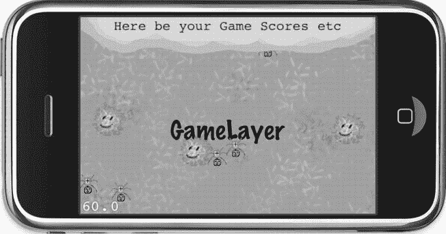

图 5-1 `ScenesAndLayers04` 项目。目前为止，一切正常。

首先，在 `init` 方法中组装 `MultiLayerScene`。如果你快速浏览一下代码清单 5-4 中的代码，你几乎不会注意到与我们之前所做的工作有何不同。

***代码清单 5-4.*** 初始化 `MultiLayerScene`

```
-(id) init
{
    if ((self = [super init]))
    {
        sharedMultiLayerScene = self;
        // GameLayer 将被独立移动、旋转和缩放
        GameLayer* gameLayer = [GameLayer node];
        [self addChild:gameLayer z:1 tag:LayerTagGameLayer];
        gameLayerPosition = gameLayer.position;

// UserInterfaceLayer 保持静止，并相对于屏幕区域。
        UserInterfaceLayer* uiLayer = [UserInterfaceLayer node];
        [self addChild:uiLayer z:2 tag:LayerTagUserInterfaceLayer];
    }
    return self;
}
```

**提示** 值得一提的是，我开始为标签使用 `enum` 值，例如 `LayerTagGameLayer`。这样做优于使用数字，因为你可以直观地读出它代表谁，而不必记住标签 7 分配给了哪个图层。这也表明实际的标签值并不重要——重要的是对于同一个节点始终使用相同的值。使用人类可读的标签使这个任务更容易且不易出错。动作标签当然也是如此。


您可能已经注意到了 `multiLayerSceneInstance` 变量，并且它被赋值为 `self`。这有些奇怪，不是吗？这有什么用呢？回顾一下第 3 章如何创建单例类。在这里，我将通过让其他类能够通过类方法访问当前实例，将 `MultiLayerScene` 类转换为单例。请参阅清单 5-5，如果需要，可以将其与清单 3-1 进行比较，以找出差异。在这种情况下，该类已经被初始化——而不是在 `sharedLayer` 方法中按需初始化。

**清单 5-5. 将 MultiLayerScene 转换为半单例对象**

```
static MultiLayerScene* sharedMultiLayerScene;

+(MultiLayerScene*) sharedLayer
{
  NSAssert(sharedMultiLayerScene! = nil, @"MultiLayerScene not available!");
  return sharedMultiLayerScene;
}

-(void) dealloc
{
  // MultiLayerScene will be deallocated now, you must set it to nil manually
  sharedMultiLayerScene = nil;
}
```

简而言之，`sharedMultiLayerScene` 是一个 `static` 全局变量，它将在 `MultiLayerScene` 对象生命周期内持有该对象。`static` 关键字表示 `sharedMultiLayerScene` 变量只能在定义它的实现文件内部访问。同时，它不是一个实例变量；它存在于任何类的范围之外。这就是为什么它在任何方法之外定义，并且可以在 `sharedLayer` 等类方法中访问。

当图层被释放时，`sharedMultiLayerScene` 变量被设置回 `nil` 以避免崩溃，因为在 `dealloc` 方法运行后，`sharedMultiLayerScene` 变量将指向一个已释放的对象。声明为 `static` 的变量在类被释放后仍然存在。使用 `static` 变量存储指向动态分配类的指针需要非常小心，以确保 `static` 变量始终指向一个有效的对象，否则为 `nil`。

这种半单例的原因是您将使用多个图层，每个图层都有自己的子节点，但您仍然需要以某种方式访问主图层。这是一种非常方便的方式，可以让当前场景的其他图层和节点访问主图层。

**注意** 这种半单例仅在任意时刻只分配一个 `MultiLayerScene` 实例时有效。与常规的单例类不同，它也不能用于初始化 `MultiLayerScene`。

为了便于使用，您通过属性 getter 方法授予对 `GameLayer` 和 `UserInterfaceLayer` 的访问权限。属性在清单 5-6 中定义，该清单显示了 `MultiLayerScene.h` 中的相关部分。

**清单 5-6. 用于访问 GameLayer 和 UserInterfaceLayer 的属性定义**

```
@property (readonly) GameLayer* gameLayer;
@property (readonly) UserInterfaceLayer* uiLayer;
```

这些属性被定义为 `readonly`，因为我们只想检索这些图层，而从不希望通过属性设置它们。它们在清单 5-7 中的实现是对 `getChildByTag` 方法的直接包装，但它们也执行安全检查，以防万一，验证检索到的对象是否属于正确的类。

**清单 5-7. 属性 Getter 的实现**

```
-(GameLayer*) gameLayer
{
  CCNode* layer = [self getChildByTag:LayerTagGameLayer];
  NSAssert([layer isKindOfClass:[GameLayer class]], @"%@: not a GameLayer!", ←
     NSStringFromSelector(_cmd));
  return (GameLayer*)layer;
}

-(UserInterfaceLayer*) uiLayer
{
  CCNode* layer = [[MultiLayerScene sharedLayer] getChildByTag:LayerTagUILayer];
  NSAssert([layer isKindOfClass:[UserInterfaceLayer class]], @"%@: not a UILayer!", ←
     NSStringFromSelector(_cmd));
  return (UserInterfaceLayer*)layer;
}
```

这使得从 `MultiLayerScene` 的任何节点访问各个图层变得容易。

*   您可以访问 `MultiLayerScene` 的“场景”图层：

`MultiLayerScene* sceneLayer = [MultiLayerScene sharedLayer];`

*   您可以通过场景图层访问其他图层：

`GameLayer* gameLayer = [sceneLayer gameLayer];`

`UserInterfaceLayer* uiLayer = [sceneLayer uiLayer];`

*   或者，由于 `@property` 定义，您也可以使用点访问器。选择哪种方式取决于您，只要您始终如一地坚持使用。从技术和性能角度来看，绝对没有区别。

`GameLayer* gameLayer = sceneLayer.gameLayer;`
`UserInterfaceLayer* uiLayer = sceneLayer.uiLayer;`

`UserInterfaceLayer` 和 `GameLayer` 类都处理触摸输入，但彼此独立。为了获得正确的结果，您需要使用 `TargetedTouchHandlers`，并且通过使用 `priority` 参数，您可以确保 `UserInterfaceLayer` 在 `GameLayer` 之前查看触摸事件。`UserInterfaceLayer` 使用 `isTouchForMe` 方法来确定是否应该处理该触摸，如果它确实处理了该触摸，则从 `ccTouchBegan` 方法返回 `YES`。这会阻止其他目标触摸处理程序接收此触摸。清单 5-8 说明了 `UserInterfaceLayer` 的触摸事件代码的重要部分。

**清单 5-8. 使用 TargetedTouchDelegate 处理触摸输入**

```
// Register TargetedTouch handler with higher priority than GameLayer
-(void) registerWithTouchDispatcher
{
    [[CCDirector sharedDirector].touchDispatcher addTargetedDelegate:self
                                      priority:-1
                                   swallowsTouches:YES];
}

// Checks if the touch location was in an area that this layer wants to handle as input.
-(BOOL) isTouchForMe:(CGPoint)touchLocation
{
    CCNode* node = [self getChildByTag:UILayerTagFrameSprite];
    return CGRectContainsPoint([node boundingBox], touchLocation);
}

-(BOOL) ccTouchBegan:(UITouch*)touch withEvent:(UIEvent *)event
{
    CGPoint location = [MultiLayerScene locationFromTouch:touch];
    BOOL isTouchHandled = [self isTouchForMe:location];
    if (isTouchHandled)
    {
        CCNode* node = [self getChildByTag:UILayerTagFrameSprite];
        NSAssert([node isKindOfClass:[CCSprite class]], @"node is not a CCSprite");

// Highlight the UI layer's sprite for the duration of the touch
        ((CCSprite*)node).color = ccRED;

// Access the GameLayer via MultiLayerScene.
        GameLayer* gameLayer = [MultiLayerScene sharedLayer].gameLayer;

// Run Actions on GameLayer ... (code removed for clarity)
    }

return isTouchHandled;
}

-(void) ccTouchEnded:(UITouch*)touch withEvent:(UIEvent *)event
{
  CCNode* node = [self getChildByTag:UILayerTagFrameSprite];
  NSAssert([node isKindOfClass:[CCSprite class]], @"node is not a CCSprite");
  ((CCSprite*)node).color = ccWHITE;
}
```

在 `registerWithTouchDispatcher` 中，`UserInterfaceLayer` 将自身注册为优先级为 -1 的目标触摸处理程序。因为 `GameLayer` 使用相同的代码但优先级为 0，所以 `UserInterfaceLayer` 是第一个接收触摸输入的图层。

在 `ccTouchBegan` 中，首先要做的是检查此触摸是否与 `UserInterfaceLayer` 相关。`isTouchForMe` 方法通过 `CGRectContainsPoint` 实现了一个简单的“点在 boundingBox 中”检查，以查看触摸是否在 `uiframe` 精灵上开始。`CGGeometry` 中提供了更多有用的方法来测试交集、包含点或相等性。请参阅 Apple 的文档以了解更多关于 `CGGeometry` 方法的信息（`http://developer.apple.com/mac/library/documentation/GraphicsImaging/Reference/CGGeometry/Reference/reference.html`）。


如果触摸位置检查确定触摸在精灵上，`ccTouchBegan`返回`YES`，表示此触摸事件已被使用，不应由具有较低优先级目标触摸委托的其他层处理。

只有当`isTouchForMe`检查失败时，`GameLayer`才会接收触摸输入，并在用户在屏幕上移动手指时使用它来滚动自身。您可以在清单 5-9 中比较`GameLayer`的输入处理代码。

***清单 5-9.***  `GameLayer`接收剩余的触摸事件并使用它们来滚动自身

```
-(void) registerWithTouchDispatcher
{
  [[CCDirector sharedDirector].touchDispatcher addTargetedDelegate:self
                                    priority:0
                                 swallowsTouches:YES];
}

-(BOOL) ccTouchBegan:(UITouch*)touch withEvent:(UIEvent *)event
{
  lastTouchLocation = [MultiLayerScene locationFromTouch:touch];

// 停止移动动作，以免干扰用户滚动。
  [self stopActionByTag:ActionTagGameLayerMovesBack];

// 始终吞下触摸，GameLayer 是最后一个接收触摸的层。
  return YES;
}

-(void) ccTouchMoved:(UITouch*)touch withEvent:(UIEvent *)event
{
  CGPoint currentTouchLocation = [MultiLayerScene locationFromTouch:touch];

// 计算当前触摸位置与上一个触摸位置的差值。
  CGPoint moveTo = ccpSub(lastTouchLocation, currentTouchLocation);

// 然后反转方向，以模拟移动背景的效果
  moveTo = ccpMult(moveTo, -1);

lastTouchLocation = currentTouchLocation;

// 相应地调整层的位置，其所有子节点也会随之移动。
  self.position = ccpAdd(self.position, moveTo);
}

-(void) ccTouchEnded:(UITouch*)touch withEvent:(UIEvent *)event
{
  // 将游戏层移回其指定位置。
  CCMoveTo* move = [CCMoveTo actionWithDuration:1 position:gameLayerPosition];
  CCEaseIn* ease = [CCEaseIn actionWithAction:move rate:0.5f];
  ease.tag = ActionTagGameLayerMovesBack;
  [self runAction:ease];
}
```

由于`GameLayer`是最后一个接收输入的层，它不需要执行任何`isTouchForMe`检查，只需吞下所有触摸。

**提示** 与其在多个层中处理用户输入，不如考虑让一个层专门负责所有输入处理。它可以决定做什么，将触摸转发到其他层，并调用其他节点上的方法。这样做的好处是输入处理代码更短、更不易出错，因为所有决策都在一个类中做出，而不是分散到各种类中。

`ccTouchMoved`事件计算前一个和当前触摸位置之间的差值。然后通过乘以-1 将其反转，从而将效果从移动相机掠过背景变为在相机下移动背景。如果您很难想象我所说的意思，请尝试`ScenesAndLayers02`项目，然后再试一次，注释掉`moveTo = ccpMult(moveTo, -1);`这一行。您会注意到第二次尝试时，每次手指移动都会使层朝相反方向移动。

当用户将手指从屏幕上抬起时，`ccTouchEnded`会自动将层移回其中心位置。图 5-2 展示了此项目在`GameLayer`被旋转和缩小时的运行情况。`GameLayer`上的每个游戏对象都会自动遵循`GameLayer`的每次移动、旋转和缩放，而`UserInterfaceLayer`始终保持不变。

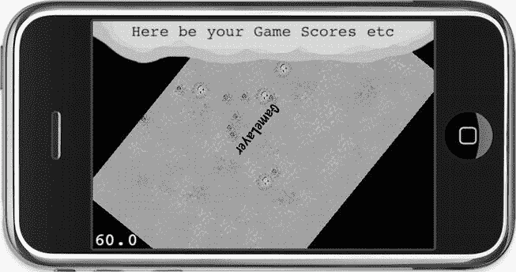

图 5-2 .  `GameLayer`被缩小并旋转时，其所有节点都遵循层的行为，而上方的`UserInterfaceLayer`保持原位不受影响，多层级的实用性便一目了然。

## 如何最好地实现关卡

到目前为止，您已经研究了多个场景和多个层。现在您要涵盖什么——关卡？


## 游戏关卡的设计策略

游戏中的关卡概念很常见，因此无需赘述。真正困难的是，如何选择最适合关卡制游戏的设计方案。在`cocos2d`中，可以采用两种方式：为每个关卡创建新场景，或使用单独层来管理多个关卡。两者各有用途，选择哪种主要取决于关卡在游戏中的功能定位。

### 场景作为关卡

最直接的方式是将每个关卡作为独立场景运行。你可以为每个关卡创建新的`Scene`类，或者初始化一个通用的`LevelScene`类，并传入关卡编号或其他必要信息来加载正确的关卡数据。

如果关卡之间界限清晰，且关卡内的绝大部分内容在玩家通关后不再需要保留，那么这种方法最为合适。或许你需要保留玩家的分数和剩余生命数，但仅此而已。用户界面通常极简、无交互、仅用于信息展示，除了暂停按钮外不应有其他交互元素。

这种设计特别适合快节奏的动作类游戏关卡。

### 层作为关卡

在同一个场景中使用不同的层来加载和显示关卡，适合那些在关卡切换时不应重置复杂用户界面的情况。甚至可能希望在切换关卡时，保持玩家及其他游戏对象的位置和状态不变。

你可能有多个变量用于维护当前游戏状态和用户界面设置（例如物品栏）。保存并恢复这些游戏设置、重置所有视觉元素的工作量，远大于在同一个场景中切换不同的层。

这可能是解谜或冒险类游戏的理想方案，尤其是当你需要在房间之间移动，并希望用户界面下方使用动画来切换关卡内容时。

`CCLayerMultiplex`类可能是实现这种方案的理想选择。它可以包含多个节点，但同一时间只有一个节点处于激活状态。清单 5-10 展示了如何使用`CCLayerMultiplex`类。唯一的缺点是层之间无法进行过渡动画——同一时间只能显示一个层，因此无法实现任何过渡效果。

**清单 5-10.**  使用`CCMultiplexLayer`类在多个层之间切换

```
CCLayer* layer1 = [CCLayer node];
CCLayer* layer2 = [CCLayer node];
CCLayerMultiplex* mpLayer = [CCLayerMultiplex layerWithLayers:layer1, layer2, nil];

// 切换到 layer2，但保留 layer1 作为 mpLayer 的子节点
[mpLayer switchTo:1];

// 切换到 layer1，从 mpLayer 中移除 layer2 并释放其内存
// 此调用后，不能再切换回 layer2（索引：1）！
[mpLayer switchToAndReleaseMe:0];
```

## `CCLayerColor`与`CCLayerGradient`

在`ScenesAndLayers`项目中，背景目前只是黑屏。你可以通过滚动到草地背景图片的边缘，或点击“用户界面”让`GameLayer`缩小来看到它。要改变背景颜色，`cocos2d`提供了`CCLayerColor`，在`ScenesAndLayers02`项目中添加了它，使用方法如下：

```
// 将背景颜色设置为洋红色。这是最不显眼的颜色。
CCLayerColor* colorLayer = [CCLayerColor layerWithColor:ccc4(255, 0, 255, 255)];
[self addChild:colorLayer];
```

同样，你可以使用`CCLayerGradient`创建更生动的背景。它允许你指定两种颜色，`cocos2d`会在它们之间平滑插值。你还可以调整渐变的方向。

```
CCLayerGradient* gradient = [CCLayerGradient layerWithColor:ccc4(0, 150, 255, 255)
                              fadingTo:ccc4(255, 150, 50, 255)
                             alongVector:CGPointMake(1.0f, 1.0f)];
[self addChild:gradient];
```


好的，这是根据您的要求翻译后的 Markdown 文档。


梯度方向由一个向量表示。在此例中，该向量指向右方一个单位和上方一个单位，梯度因此旋转了完美的 45° 角。该向量指向 `fadingTo` 颜色的方向，这意味着偏蓝的颜色在左下方，而偏橙的颜色更靠近右上方。要反转颜色的方向，您可以交换颜色，或者简单地反转向量的符号。

请注意，您也可以更改 `CCLayerColor` 和 `CCLayerGradient` 的宽度和高度，从而更改它们用颜色填充的区域：

```
[gradientLayer changeWidth:400 height:200];
```

## 从 CCSprite 派生子类化游戏对象

通常情况下，您的游戏对象会实现自己的逻辑。为每种类型的游戏对象创建一个独立的类是合理的。这可以是您的玩家角色、各种敌人类型、子弹、导弹、平台，以及几乎所有可以单独放置在游戏场景中并需要运行自己逻辑的对象。

那么问题来了，应该从哪个类派生子类呢？

许多开发者选择了看起来显而易见的途径：从 `CCSprite` 派生子类。我认为这不是一个好主意。子类化的关系是“是一个”的关系。仔细想想：您的玩家角色是 `CCSprite` 吗？您所有的敌人角色都是 `CCSprite` 吗？

起初，答案似乎合乎逻辑：它们当然是精灵！它们就是用来显示自身的。但是等一下。就我们所知，游戏角色在字面意义上也可以是字符。在 Roguelike 游戏中，您的玩家角色是一个 `@` 符号。那么，这个角色会是一个 `CCLabelTTF` 吗？

我认为困惑源于 `CCSprite` 是在屏幕上显示任何内容时使用最广泛的类。但您的游戏角色与 `CCNode` 类之间的真正关系是“有一个”的关系。您的玩家类“有一个”用于显示自身的 `CCSprite`，它甚至可能需要使用多个精灵来表示武器、盔甲等等——可能还需要粒子效果来显示高速奔跑、血条，以及在多人模式下显示玩家名称的标签。

当您思考通常为什么要对 `CCSprite` 类进行子类化时，这种区别就变得更加清晰：通常是为了给 `CCSprite` 类添加新特性——例如，创建一个使用 `CCRenderTexture` 来根据屏幕下方内容修改其显示方式的 `CCSprite` 类。本质上，您想要子类化 `CCSprite` 是为了改变 `CCSprite` 类本身的行为以及精灵的显示方式——而不是为了向它添加游戏逻辑代码。

输入处理、玩家动画、碰撞检测、物理——总的来说，就是游戏逻辑。这些内容都不属于 `CCSprite` 类，因为这段代码是关于对象如何行为以及您如何与之交互的，而不是关于精灵如何绘制在屏幕上的。另一种看待这个问题的角度是，考虑您向子类化的 `CCSprite` 添加的哪些代码是通用且可以被所有精灵使用的。大多数游戏代码对于单个游戏对象来说都是非常特定的，无论是玩家、Boss 怪物还是可收集物品。

考虑这样一种情况：您希望您的玩家拥有多个视觉表现，并且能够无缝切换。如果玩家需要使用 `FadeIn`/`FadeOut` 动作从一个精灵变形到另一个，您将不得不使用两个精灵——或者如果您希望您的游戏对象同时出现在屏幕的不同部分，就像在《Asteroids》这样的游戏中，离开屏幕顶部的行星也应当部分显示在屏幕底部。您需要两个精灵来实现这一点，这仅仅是组合（或聚合）优于子类化（或继承）的一个原因。继承会导致类之间的紧密耦合，对父类的更改可能会在子类中引入错误和异常。类层次结构越深，驻留在基类中的代码就越多，这会使问题放大。

另一个很好的理由是游戏对象封装了它的视觉表示。如果逻辑是自包含的，那么只有游戏对象本身才应该更改任何 `CCNode` 属性，例如位置、缩放、旋转，甚至运行和停止动作。许多游戏开发者迟早会遇到的一个核心问题是，他们的游戏对象受到外部影响的直接操作。例如，您可能会无意中创建这样的情况：场景层、用户界面和玩家对象本身都更改了玩家精灵的位置。这是不可取的。您希望所有其他系统都通知玩家对象去更改其位置，将最终解释权——是应用、修改还是忽略这些命令——交给玩家对象本身。

## 使用 CCSprite 组合游戏对象

让我们试试这个。与其从 `CCSprite` 类创建一个新类，不如从 cocos2d 的基类 `CCNode` 创建它。尽管您也可以将您的类基于 Objective-C 基类 `NSObject`，但坚持使用 `CCNode` 会更容易，因为在 cocos2d 中使用 `CCNode` 作为基类通常会更加方便。否则，您将无法使用诸如 `CCNode` 的调度方法之类的便利功能。

我决定将 ScenesAndLayers02 项目中的蜘蛛转换成一个独立的类。这个类简单地称为 `Spider`。清单 5-11 展示了 `Spider` 类的头文件。

**清单 5-11.**  Spider 类接口

```
#import "cocos2d.h"

@interface Spider : CCNode
{
    CCSprite* spiderSprite;
    int numUpdates;
}

+(id) spiderWithParentNode:(CCNode*)parentNode;
-(id) initWithParentNode:(CCNode*)parentNode;

@end
```

您可以看到 `CCSprite` 作为成员变量被添加到该类中，并命名为 `spiderSprite`。这被称为*组合*，因为您使用一个用于显示自身的 `CCSprite` 来组合 `Spider` 类，稍后还可能组合其他对象（包括额外的 `CCSprite` 类）和变量。

清单 5-12 中的 `Spider` 类有一个 `spiderWithParentNode` 类方法来创建 `Spider` 类的实例。我添加的另一个便利特性是将 `parentNode` 作为参数传递给 `initWithParentNode` 方法。通过这样做，`Spider` 类可以通过调用 `[parentNode addChild:self]` 将自身添加到节点层次结构中，这使得在 `GameLayer.m` 中创建 `Spider` 类的实例成为一行代码，因为您只需编写 `[Spider spiderWithParentNode:self]`。

另一方面，`spiderSprite` 应该是自包含的，因为它是由 `Spider` 类创建和管理的。`spiderSprite` 通过 `[self addChild:spiderSprite]` 添加到 `Spider` 类，而不是 `parentNode`。虽然您可以那么做，但我不推荐，因为它破坏了封装。一方面，`parentNode` 代码可能会从它的层次结构中移除 `spiderSprite`，并且移动 `Spider` 对象将不再移动 `spiderSprite`。

**清单 5-12.**  Spider 类实现

```
#import "Spider.h"

@implementation Spider

// 静态初始化器，模仿 cocos2d 的内存分配方案。
+(id) spiderWithParentNode:(CCNode*)parentNode
{
    return [[self alloc] initWithParentNode:parentNode];
}

-(id) initWithParentNode:(CCNode*)parentNode
{
    if ((self = [super init]))
    {
        [parentNode addChild:self];

        CGSize screenSize = [CCDirector sharedDirector].winSize;

        spiderSprite = [CCSprite spriteWithFile:@"spider.png"];
        spiderSprite.position = CGPointMake(CCRANDOM_0_1() * screenSize.width, ←
            CCRANDOM_0_1() * screenSize.height);
        [self addChild:spiderSprite];

        [self scheduleUpdate];
    }

    return self;
}

-(void) update:(ccTime)delta
{
    numUpdates++;
    if (numUpdates > 60)
    {
        numUpdates = 0;
        [spiderSprite stopAllActions];
    }
}
```


```objc
// 让蜘蛛随机移动。
CGPoint moveTo = CGPointMake(CCRANDOM_0_1() * 200–100, ←
  CCRANDOM_0_1() * 100–50);
CCMoveBy* move = [CCMoveBy actionWithDuration:1 position:moveTo];
[spiderSprite runAction:move];
}
}
@end
```

现在，`Spider` 类已通过自身的游戏逻辑在屏幕上移动蜘蛛。诚然，它不可能在今年的人工智能研讨会上获奖；这仅仅是一个示例。

到目前为止，你已经知道可以通过 `CCLayer` 节点接收触摸输入，但实际上，任何类都可以通过直接使用 `CCTouchDispatcher` 类来接收触摸输入。你的类只需要实现 `CCStandardTouchDelegate` 或 `CCTargetedTouchDelegate` 协议。你需要在 `@interface` 定义中，将相应的协议定义添加到父类之后的尖括号中，如代码清单 5-13 所示。

**代码清单 5-13.**  `CCTargetedTouchDelegate` 协议

```objc
@interface Spider : CCNode < CCTargetedTouchDelegate>
{
 ...
}
```

代码清单 5-14 中的实现突出了对 `Spider` 类的改动。现在，`Spider` 类会对目标触摸输入做出反应。每当你点击一只蜘蛛，它就会迅速从你的手指处移开。（与普遍认知相反，蜘蛛通常比人类更害怕人类，尽管也有例外。）

`Spider` 类已在 `CCTouchDispatcher` 中注册，作为触摸委托接收输入，但必须在 `cleanup` 方法中移除这个委托关联。否则，即使 `Spider` 类已从内存中释放，调度器或触摸分发器仍会持有对它的引用，这很可能会导致后续程序崩溃。而且，必须在 `cleanup` 方法中执行此操作，而不是 `dealloc`，原因很简单：触摸分发器持有（保留）了对你的类的引用。如果你不指示触摸分发器移除你的类，它将永远不会被释放。

**代码清单 5-14.** 经过修改的 `Spider` 类

```objc
-(id) initWithParentNode:(CCNode*)parentNode
{
    if ((self = [super init]))
    {
     ...

// 手动将此类添加为目标触摸事件的接收者。
     [[CCDirector sharedDirector].touchDispatcher addTargetedDelegate:self
                                       priority:-1
                                    swallowsTouches:YES];
    }

return self;
}

-(void) cleanup
{
  // 必须手动将此类移除出触摸输入接收者！
  [[CCTouchDispatcher sharedDispatcher] removeDelegate:self];

[super cleanup];
}

// 将通用逻辑提取到接受参数的方法中。
-(void) moveAway:(float)duration position:(CGPoint)moveTo
{
  [spiderSprite stopAllActions];
  CCMoveBy* move = [CCMoveBy actionWithDuration:duration position:moveTo];
  [spiderSprite runAction:move];
}

-(void) update:(ccTime)delta
{
  numUpdates++;
  if (numUpdates  > 50)
  {
     numUpdates = 0;

// 以正常速度移动。
     CGPoint moveTo = CGPointMake(CCRANDOM_0_1() * 200–100, ←
     CCRANDOM_0_1() * 100–50);
     [self moveAway:2 position:moveTo];
  }
}
-(BOOL) ccTouchBegan:(UITouch *)touch withEvent:(UIEvent *)event
{
    // 检查此次触摸是否在蜘蛛的精灵上。
    CGPoint touchLocation = [MultiLayerScene locationFromTouch:touch];
    BOOL isTouchHandled = CGRectContainsPoint([spiderSprite boundingBox], ←
     touchLocation);
    if (isTouchHandled)
    {
        // 重置移动计数器。
        numUpdates = 0;

// 从触摸位置快速移开。
        CGPoint moveTo;
        float moveDistance = 40;
        float rand = CCRANDOM_0_1();

// 随机选择四个角落之一移向。
        if (rand < 0.25f)
            moveTo = CGPointMake(moveDistance, moveDistance);
        else if (rand < 0.5f)
            moveTo = CGPointMake(−moveDistance, moveDistance);
        else if (rand < 0.75f)
            moveTo = CGPointMake(moveDistance, -moveDistance);
        else
            moveTo = CGPointMake(−moveDistance, -moveDistance);

// 快速移动：
        [self moveAway:0.1f position:moveTo];
    }

return isTouchHandled;
}
```

我决定通过将功能提取到单独的方法中来改进移动逻辑。直接的方式是从 `update` 方法中复制现有代码到 `ccTouchBegan` 方法。然而，复制-粘贴是万恶之源。如果你加入了编程邪教，请注意，复制现有代码被视为一种致命罪行。

**警告**  使用复制-粘贴非常容易，而且众所周知，这使其极具诱惑力。但是，只要你复制代码，你就会为将来修改这些代码付出双倍的努力。考虑一下，如果你将同一系列动作复制了十次，然后需要更改动作序列的持续时间。你不能只修改一次；你必须修改十次，更重要的是，你必须测试十次修改，因为你可能忘记在十个地方之一应用此修改。更多的代码也意味着引入错误的机会更多，并且由于这个错误可能只出现在十个案例之一中，因此查找起来也会更加困难。我曾有幸参与一个项目，其中有 30,000 行代码几乎都是通过复制粘贴数百次得到的。所有代码都在一个文件中。不要这样做，否则我会诅咒你！为了避免复制-粘贴式编程，我建议牢记 `DRY` 原则。`DRY` 代表“不要重复自己”，该原则在 `http://c2.com/cgi/wiki?DontRepeatYourself` 中有描述。

使用方法提取通用功能，并将需要灵活变通的部分暴露为参数，这是一项非常简单的任务。我希望代码清单 5-14 中的 `moveAway` 方法能很好地说明我的观点。它没有包含太多代码，但即使是最少量的重复代码也会增加你维护它所花费的时间。

`ccTouchBegan` 方法获取触摸位置，并通过 `CGRectContainsPoint` 检查触摸位置是否在蜘蛛精灵的 `boundingBox` 内部。如果是，则处理该触摸并运行让蜘蛛迅速向四个方向之一移开的代码。

总之，使用 `CCNode` 作为游戏对象的基类，乍看之下会使一些事情变得不便。然而，当你开始构建更大的项目时，比如处理超过十几个游戏对象类时，其优势就会显现出来。如果你现在更喜欢继承 `CCSprite`，那也没关系。但当你变得更熟练、更有抱负时，请回到本章尝试这种方法。它会引导你走向更好的代码结构，以及更清晰分离的单个游戏元素的边界和职责。

## 奇妙的 `CCNode` 类

请坐稳，我将介绍更多从 `CCNode` 派生的类，它们具有非常特定的用途。它们是 `CCProgressTimer`、`CCParallaxNode` 和 `CCMotionStreak`。

### `CCProgressTimer`

在 `ScenesAndLayers07` 项目中，我向 `UserInterfaceLayer` 类添加了一个 `CCProgressTimer` 节点。你可以在图 5-3 中看到它如何以放射状方式从精灵中切除一部分。

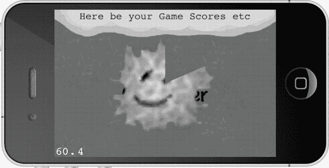

**图 5-3.**  运行中的 `CCProgressTimer`。我会说现在大约是 12 点过 10 分。


进度计时器类适用于任何类型的进度显示，比如加载条或图标再次可用所需的倒计时。想象一下《魔兽世界》中的动作按钮及其冷却计时器。进度计时器接收一个精灵，并根据百分比仅显示其部分内容，以此在游戏中可视化某种进度。清单 5-15 展示了如何初始化 `CCProgressTimer` 节点。

**清单 5-15.** 初始化 CCProgressTimer 节点

```
// 进度计时器是一个仅部分显示的精灵，
// 用于可视化某种进度。
CCSprite* fireSprite = [CCSprite spriteWithFile:@"firething.png"];
CCProgressTimer* timer = [CCProgressTimer progressWithSprite:fireSprite];
timer.type = kCCProgressTimerTypeRadial;
timer.percentage = 0;
[self addChild:timer z:1 tag:UILayerTagProgressTimer];

// 进度计时器需要更新。
[self scheduleUpdate];
```

`timer` 类型来自 `CCProgressTimer.h` 中定义的 `CCProgressTimerType` `enum`。你可以选择径向或矩形进度计时器——后者需要将计时器类型设置为 `kCCProgressTimerTypeBar`。需要注意一点：计时器不会自动更新。你必须频繁更改计时器的百分比值来更新进度。这就是为什么我在清单 5-15 中调用了 `scheduleUpdate` 方法。清单 5-16 展示了实现实际进度更新的 `update` 方法。

**清单 5-16.** update 方法的实现

```
-(void) update:(ccTime)delta
{
  CCNode* node = [self getChildByTag:UILayerTagProgressTimer];
  NSAssert([node isKindOfClass:[CCProgressTimer class]], @"node is not a ←
     CCProgressTimer");

// 更新进度计时器
  CCProgressTimer* timer = (CCProgressTimer*)node;
  timer.percentage + = delta * 10;
  if (timer.percentage > = 100)
  {
     timer.percentage = 0;
  }
}
```

你必须根据需要频繁更新 `CCProgressTimer` 节点的百分比属性——它不会自动推进。这里的进度仅仅是时间的流逝。游戏不就是这样吗？

## CCParallaxNode

视差效果是一种在 2D 游戏中用于营造深度感的特效，它通过使用以不同速率移动的分层图像来实现。前景中的图像相对于背景中的图像移动得更快。虽然无法在静态图像中看到视差效果，但图 5-4 至少能让你对由多个独立图层组成的背景有个初步印象。云彩在最远处；山脉在云彩前面，但在（难看的）树木后面。最底层是道路，你通常会在那里添加一个玩家角色，沿着这个场景左右移动。

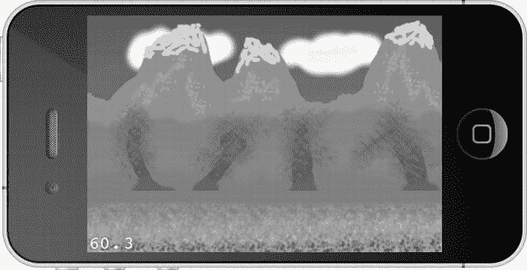

图 5-4 . `CCParallaxNode` 让你能够创造出深度感的错觉

**注意** 为什么视差效果能创造出深度感的错觉？因为我们的思维已经习惯了这种效果。想象一下你正高速驾车，看着侧窗外的景色。你会注意到路边的树木（离你最近）飞驰而过，快得几乎无法聚焦于任何一棵。再远一点，你会看到田野以看似慢得多的速度掠过。然后看向地平线上的山脉，你几乎注意不到自己正在经过它们。这就是三维世界中的视差效果，其中存在无数个视差层。在 2D 游戏中，我们必须（非常粗略地）用大约两到八个视差层来模拟相同的效果。每一层都试图欺骗你的大脑，让你觉得它离你的视点有一定距离，仅仅因为它相对于其他层以特定速度移动。效果出奇地好。

Cocos2d 有一个专门的节点，你可以用它来创建这种效果。清单 5-17 中创建 `CCParallaxNode` 的代码来自 Parallax01 项目。

**清单 5-17.** CCParallaxNode 需要大量设置工作，但结果值得付出

```
// 为每个视差层加载精灵，从背景到前景。
CCSprite* para1 = [CCSprite spriteWithFile:@"parallax1.png"];
CCSprite* para2 = [CCSprite spriteWithFile:@"parallax2.png"];
CCSprite* para3 = [CCSprite spriteWithFile:@"parallax3.png"];
CCSprite* para4 = [CCSprite spriteWithFile:@"parallax4.png"];

// 根据屏幕和图像大小设置正确的偏移量。
para1.anchorPoint = CGPointMake(0, 1);
para2.anchorPoint = CGPointMake(0, 1);
para3.anchorPoint = CGPointMake(0, 0.6f);
para4.anchorPoint = CGPointMake(0, 0);

CGPoint topOffset = CGPointMake(0, screenSize.height);
CGPoint midOffset = CGPointMake(0, screenSize.height / 2);
CGPoint downOffset = CGPointZero;
// 创建一个视差节点并将精灵添加到其中。
CCParallaxNode* paraNode = [CCParallaxNode node];
[paraNode addChild:para1
          z:1
     parallaxRatio:CGPointMake(0.5f, 0)
    positionOffset:topOffset];

[paraNode addChild:para2 z:2 parallaxRatio:CGPointMake(1, 0) positionOffset:topOffset];
[paraNode addChild:para3 z:4 parallaxRatio:CGPointMake(2, 0) positionOffset:midOffset];
[paraNode addChild:para4 z:3 parallaxRatio:CGPointMake(3, 0) positionOffset:downOffset];
[self addChild:paraNode z:0 tag:ParallaxSceneTagParallaxNode];

// 移动视差节点以展示视差效果。
CCMoveBy* move1 = [CCMoveBy actionWithDuration:5 position:CGPointMake(−160, 0)];
CCMoveBy* move2 = [CCMoveBy actionWithDuration:15 position:CGPointMake(160, 0)];
CCSequence* sequence = [CCSequence actions:move1, move2, nil];
CCRepeatForever* repeat = [CCRepeatForever actionWithAction:sequence];
[paraNode runAction:repeat];
```

要创建一个 `CCParallaxNode`，首先创建构成各个视差图像的所需 `CCSprite` 节点，然后你必须将它们正确定位在屏幕上。在这个例子中，我选择修改它们的锚点，因为这样更容易将精灵与屏幕边界对齐。你像创建任何其他节点一样创建 `CCParallaxNode`，但需要使用一个特殊的初始化方法添加其子节点。通过该初始化方法，你可以指定 `parallaxRatio`，这是一个 `CGPoint`，用作 `CCParallaxNode` 任何移动的乘数。在这个例子中，`CCSprite para1` 将以半速移动，`para2` 以正常速度移动，`para3` 以 `CCParallaxNode` 两倍的速度移动，以此类推。

通过一系列 `CCMoveBy` 动作，`CCParallaxNode` 被从左向右移动，然后再返回。请注意背景中的云彩移动得最慢，而前景中的树木和碎石滚动得最快。这便营造出了深度感的错觉。


**注意** 一旦将子节点添加到`CCParallaxNode`中，就无法再修改它们的位置。你只能滚动到最大且移动速度最快的图像所能达到的范围，否则背景就会透显出来。如果你修改`CCMoveBy`动作使其滚动更远距离，就能看到这种效果。你可以通过添加更多带有适当偏移量的相同精灵来增加滚动距离。但如果需要一个或两个方向上无休止的滚动，则必须自己实现视差系统。事实上，这正是你将在第 7 章中要做的事情。

## `CCMotionStreak`

`CCMotionStreak`本质上是`CCRibbon`的一个封装器。它会使`CCRibbon`元素在绘制后或多或少地缓慢淡出并消失。在`ScenesAndLayers10`项目中尝试一下，并查看图 5-5，了解淡出效果可能呈现的样子。

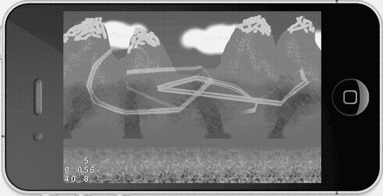

图 5-5。`CCMotionStreak`类允许你绘制一条缓慢淡出的线条

如代码清单 5-18 所示，你可以使用`CCMotionStreak`绘制一条缓慢淡出的线条，其中纹理会被拉伸到线条的整个长度。例如，你可以用这个来创建高速子弹，使其移动越快拉伸得越长。代码清单 5-19 展示了创建`CCMotionStreak`节点并将其移动到触摸位置的代码。在`Parallax01`项目中，你可以触摸屏幕来绘制一条运动轨迹线。

**代码清单 5-18.** `CCMotionStreak`创建线条描边效果

```
-(void) resetMotionStreak
{
  // 移除 CCMotionStreak 并创建一个新的。
  [self removeChildByTag:ParallaxSceneTagMotionStreak cleanup:YES];
  CCMotionStreak* streak = [CCMotionStreak streakWithFade:0.99f
                             minSeg:8
                              width:32
                              color:ccc3(255, 0, 255)
                        textureFilename:@"spider.png"];
  [self addChild:streak z:5 tag:ParallaxSceneTagMotionStreak];

  streak.blendFunc = (ccBlendFunc){GL_ONE, GL_ONE};
}

-(CCMotionStreak*) getMotionStreak
{
  CCNode* node = [self getChildByTag:ParallaxSceneTagMotionStreak];
  NSAssert([node isKindOfClass:[CCMotionStreak class]], @"不是一个 CCMotionStreak");

  return (CCMotionStreak*)node;
}

-(CGPoint) locationFromTouch:(UITouch*)touch
{
  CGPoint touchLocation = [touch locationInView: [touch view]];
  return [[CCDirector sharedDirector] convertToGL:touchLocation];
}

-(void) moveMotionStreakToTouch:(UITouch*)touch
{
  CCMotionStreak* streak = [self getMotionStreak];
  streak.position = [self locationFromTouch:touch];
}

-(BOOL) ccTouchBegan:(UITouch*)touch withEvent:(UIEvent *)event
{
  [self moveMotionStreakToTouch:touch];
  // 始终接收触摸事件。
  return YES;
}

-(void) ccTouchMoved:(UITouch*)touch withEvent:(UIEvent *)event
{
  [self moveMotionStreakToTouch:touch];
}
```

`CCMotionStreak`的`fade`参数决定带状元素淡出的速度——数值越小，它们消失得越快，线条也越短。`minSeg`参数明显用于修改线条最少由多少段组成。然而，它几乎没有明显的效果，不过该值不应过低，以防出现图形故障（如轨迹中的间隙），也不应过高（几十或更多），以免导致性能问题。颜色用于给纹理着色。

**提示** 如果你对创建类似于《飞行控制》或《海港大师》这样的画线游戏感兴趣，那么`CCMotionStreak`无法帮助你绘制线条——当然，这里说的是字面意义上的线条。问题在于运动轨迹线会很快消失。你应该看看我出售的画线游戏入门套件：`www.learn-cocos2d.com/store/line-drawing-game-starterkit`。它包含了用你的手指绘制路径、使用 OpenGL 绘制线条以及让对象沿着线条移动等所有必要代码。

## 总结

在本章中，你学习了更多关于场景和层的内容——它们的使用方式、时机以及用途。我解释了为什么通常不建议直接从`CCSprite`继承游戏对象，并展示了如何创建完全自包含的游戏对象类，该类转而从`CCNode`派生并包含一个精灵。这样，如果对象需要多个精灵、粒子效果或其他内容，扩展起来会更容易。

最后，你学习了如何使用一些更专门的`CCNode`类，例如`CCProgressTimer`、`CCParallaxNode`和`CCMotionStreak`。

现在，关于 cocos2d 你已有足够的知识来开始创建更复杂的游戏，比如我正为你准备的横向卷轴射击游戏。而复杂的游戏带来复杂的图形，包括动画。如何高效地处理所有这些精灵（无论是在内存方面还是性能方面）将是下一章的主题。

# 第 6 章 精灵深入解析

在本章中，我将专注于处理精灵的方法。你可以通过多种方式从单个图像文件和纹理图集创建精灵。我还将解释如何创建和播放精灵动画。

*纹理图集*是一种包含多个图像的常规纹理。通常它被用来将一个角色的所有动画帧存储在一个纹理中，但其用途不仅限于此——实际上，你可以将任何图像放入纹理图集中。目标是将尽可能多的图像放入每个纹理图集中。为了帮助创建纹理图集，有一个名为 TexturePacker 的出色工具可供依赖，本章也将介绍它。

*精灵批处理*是一种加速精灵绘制速度的技术。顾名思义，批处理精灵允许 GPU 一次性渲染所有精灵（用技术术语来说，就是一次绘制调用）。它可以加速相同精灵的绘制，但在使用纹理图集时效果最为显著。如果你将纹理图集与精灵批处理一起使用，就能在一次绘制调用中绘制该纹理图集中的所有图像。

*绘制调用*是将必要信息传输到图形硬件以渲染纹理或其部分的过程。例如，当你使用`spriteFromFile`方法创建`CCSprite`节点时，该节点会产生一次绘制调用。每次绘制调用带来的 CPU 开销可能会累积到降低帧率的程度，尤其是当你想要显示更多精灵时。

`CCSpriteBatchNode`就像一个额外的层，只要所有精灵节点使用相同的纹理，你就可以将精灵节点添加到其中。从此以后，`CCSpriteBatchNode`的所有精灵子节点都会通过一次绘制调用完成绘制。实际上，CPU 告诉 GPU 应该从哪个纹理绘制，但同时也会向 GPU 传递一长串帧和位置信息，以便 GPU 能够独立地从该纹理渲染大量精灵。

总结一下：精灵批处理可以加速使用相同纹理的相同精灵的绘制，并且在使用 TexturePacker 创建的纹理图集时效果最佳。你在屏幕上显示的精灵越多，精灵越大（特别是当它们也被旋转和缩放时），使用精灵批处理带来的好处就越大。

你在本章学到的知识将成为第 7 章和第 8 章中视差滚动射击游戏的基础。

## 视网膜显示屏


### 新款 iPhone 机型与 Retina 显示屏

从 iPhone 4 开始的新款 iPhone 机型采用了名为 Retina 显示屏的高分辨率屏幕。其分辨率为 960×640 像素，每个方向上的像素数量都翻了一番（上一代设备为 480×320 像素）。第三代 iPad 也配备了 Retina 显示屏，将之前 iPad 的分辨率从 1024×768 像素提升至 2048×1536 像素。

为区分两者，Retina 显示屏的图形通常被称为高清（HD）图形，而非 Retina 显示屏的图形则被称为标清（SD）图形。高清不仅限于图像文件。Cocos2d 还支持粒子效果、位图字体和瓦片地图的高清分辨率版本。对于这些资源，应先创建高清版本，再将其缩小为标清分辨率。

表 6-1 概述了 iOS 设备的技术规格。如果您还记得第 2 章的内容，cocos2d 2.0 不支持第一代和第二代设备，但表中仍列出它们以作对比。需要记住的一点是：iPad 2 的最大纹理尺寸已提升至 4096×4096，但前提是设备运行 iOS 5.1 或更高版本。

表 6-1. iOS 设备技术规格

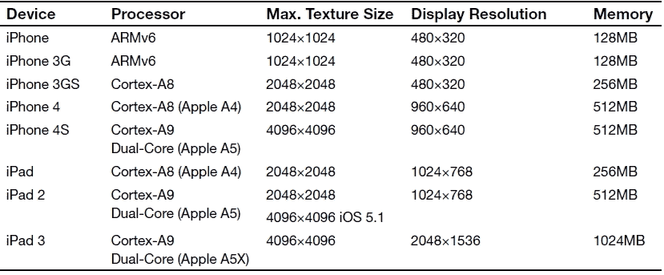

Cocos2d 使用与分辨率无关的坐标系，以点（points）而非像素（pixels）为单位。在标清设备上，一个点恰好对应一个像素；而在 Retina 显示屏设备上，一个点对应两个像素。通过使用点来编写所有位置坐标，坐标值在两种设备上保持一致！在 Retina iPhone 上，像素分辨率为 960×640，但点分辨率仍为 480×320，这使得开发同时适配 Retina 和非 Retina 设备的应用变得容易得多。

**提示** 若要在 Retina 设备上将对象设置到精确像素位置，请用分数表示点坐标。例如，坐标点 100.5,99.5 会在 Retina 设备上将对象设置到像素坐标 201,200。然而，这在非 Retina 设备上也会将像素位置设为 100.5,99.5，这被称为*亚像素*渲染。由于图像未处于精确像素位置，可能会发生一些混合现象，导致对象无法正确对齐或留下空隙。通常建议避免此类情况。

Cocos2d 在加载图像时非常智能。如果您的代码启用了 Retina 支持，并且应用运行在配备 Retina 显示屏的 iPhone 或 iPod touch 设备上，cocos2d 会首先尝试加载带有`-hd`后缀的精灵。当应用运行在 Retina iPad 上时，cocos2d 会转而查找带有`-ipadhd`后缀的精灵。这些后缀并非固定不变，可以通过`CCFileUtils`单例类进行更改，尽管我建议坚持使用默认后缀，因为它们能获得第三方工具最广泛的支持。您可以在新创建的 cocos2d 项目的`AppDelegate.m`文件中找到带有解释的代码：

```
// 如果第一个后缀未找到，且启用了回退机制，则会搜索回退后缀。
// 如果仍未找到回退文件，则会尝试不带任何后缀的文件。
// 在 iPad Retina 上： "-ipadhd"，回退： "-ipad"，二级回退： "-hd"
// 在 iPad 上： "-ipad"，回退： "-hd"
// 在 iPhone Retina 上： "-hd"

CCFileUtils *sharedFileUtils = [CCFileUtils sharedFileUtils];
[sharedFileUtils setEnableFallbackSuffixes:NO];
[sharedFileUtils setiPhoneRetinaDisplaySuffix:@"-hd"];
[sharedFileUtils setiPadSuffix:@"-ipad"];
[sharedFileUtils setiPadRetinaDisplaySuffix:@"-ipadhd"];
```

因此，如果您在代码中指定加载名为`ship.png`的文件，那么在 Retina 显示屏设备上，它会首先尝试加载`ship-hd.png`；如果该文件不存在或设备非 Retina 显示屏，则加载标清图像`ship.png`。在 iPad 上，它会尝试加载`ship-ipad.png`文件；如果启用了回退，还会在尝试加载`ship.png`之前尝试加载`ship-hd.png`。在 Retina iPad 上，cocos2d 会先查找`ship-ipadhd.png`；如果启用了回退，还会依次尝试`ship-ipad.png`和`ship-hd.png`，最后才回退到加载`ship.png`。

由于这些回退机制可能相当复杂，难以完全掌握，我强烈建议您为所有变体提供资源。对于 iPhone 和 iPod touch 应用，您需要无后缀的标准分辨率文件和带有`-hd`后缀的 Retina 分辨率文件。对于 iPad 应用，您需要提供`-ipad`和`-ipadhd`资源。对于通用应用，您确实应该提供全部四种变体。

当然，这仅在所有高清图像的分辨率恰好是标清图像的两倍时才有意义。否则，您会发现，那些分辨率并非严格两倍的高清图像在应用中显示时多少会出现偏移。通常，您应避免使用像素分辨率无法被二整除的高清图像。如果您确实支持 Retina 显示屏，应首先以高清分辨率创建所有图像，然后将其缩小 50%并保存为标清图像。将标清图像放大并不能为 Retina 显示屏带来具有更多图像细节的质量——这事只有《*CSI*》里的电脑专家才能做到。编程界普遍对他们如何做到这一点感到困惑。

cocos2d 高清图像支持的一个优点在于，您的游戏甚至无需知道是否运行在 Retina 设备上。代码是完全相同的。您唯一需要关心的是，您需要两张图像而不是一张，或者如果您创建通用应用，则需要四张。

理论上，也可以只使用高清图形，然后在运行时通过精灵的`scale`属性将其缩小以匹配显示分辨率。但这有一个重大缺点：内存占用！假设使用 32 位色彩质量，图 6-1 中的高清图像占用 128 KB 纹理内存。标清版本仅消耗 32 KB 内存。非 Retina 设备的内存通常只有 Retina 设备的一半（或更少），当您让它们加载占用四倍所需内存的纹理时，内存很快就会耗尽。

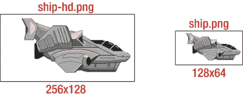

图 6-1 . 高清（Retina）和标清（非 Retina）显示的两种分辨率精灵

显示图像的缩小版本也会导致性能损失，因为每帧需要处理四倍多的像素来显示图像的缩小版本。另一方面，为 Retina 设备放大标清分辨率图像根本无法带来视觉改善，因此您完全可以禁用 cocos2d 中的 Retina 模式，只提供标清资源。

要在 cocos2d 中启用对 Retina 显示屏分辨率的支持，您必须调用`CCDirector`方法`enableRetinaDisplay`。通常这已作为`AppDelegate`初始化代码的一部分完成，因此您只需在绝对不计划在应用中使用 Retina 资源并希望禁用 Retina 模式时才更改此设置。

```
if (![director enableRetinaDisplay:YES])
{
  CCLOG(@"Retina Display Not supported");
}
```


**注意** 如果启用 Retina 显示屏支持，你应该为所有精灵、位图字体、粒子效果等提供高清图像。否则，最终效果将是你的应用在标准分辨率设备上显示正常，但所有没有高清版本的视觉元素在 Retina 显示屏上只会以一半大小呈现。请务必在标准分辨率和 Retina 分辨率设备上测试你的应用。如果你两者都没有，也可以通过硬件  设备菜单将 iOS 模拟器切换为 Retina 设备模式。需要注意的是，设置为 Retina 设备模式的 iOS 模拟器运行速度会比平时慢很多。而且如果 2048x1536 的窗口无法完整显示在你的屏幕上，iPad Retina 模拟器甚至可能无法流畅运行。

## `CCSpriteBatchNode`

每次在屏幕上绘制纹理时，图形硬件都需要准备渲染、执行渲染并在渲染后进行清理。单个纹理的渲染起止过程会带来固有开销。你可以通过让图形硬件知道有一组精灵应该使用同一纹理进行渲染来缓解这个问题。在这种情况下，图形硬件只需对一组精灵执行一次准备和清理步骤。

图 6-2 展示了这种批量渲染的示例。你可以看到屏幕上数百个相同的子弹。如果逐个渲染它们，帧率至少会下降 15%，如果子弹纹理更大，精灵还经过旋转和缩放，帧率下降会更多。使用 `CCSpriteBatchNode`，你可以让应用以最高速度运行。要测试精灵批处理的效果，可以尝试名为 Sprite-Performance 的 Kobold2D 模板项目，并阅读我关于精灵批处理性能的博客文章：`www.learn-cocos2d.com/2011/09/cocos2d-spritebatch-performance-test`。

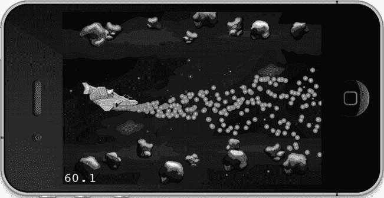

图 6-2 当多个 `CCSprite` 节点使用相同纹理并添加到 `CCSpriteBatchNode` 时，绘制效率更高。

作为复习，以下是正常创建 `CCSprite` 的方法：

```
CCSprite* sprite = [CCSprite spriteWithFile:@"bullet.png"];
[self addChild:sprite];
]

代码清单 6-1 将同一 `CCSprite` 的创建改为使用 `CCSpriteBatchNode`。当然，只添加一个 `CCSprite` 不会带来任何好处，因此我会将多个使用同一纹理的精灵添加到 `CCSpriteBatchNode` 中。

**代码清单 6-1.** 创建多个 `CCSprite` 并将其添加到 `CCSpriteBatchNode` 以实现更快的渲染

```
CCSpriteBatchNode* batch = [CCSpriteBatchNode batchNodeWithFile:@"bullet.png"];
[self addChild:batch];

for (int i = 0; i < 100; i++)
{
  CCSprite* bullet = [CCSprite spriteWithFile:@"bullet.png"];
  [batch addChild:bullet];
}
```

请注意，在代码清单 6-1 中，`CCSpriteBatchNode` 接受一个文件作为参数，尽管 `CCSpriteBatchNode` 本身并不显示。在这方面它更像 `CCLayer`，只不过你只能向其中添加 `CCSprite` 节点。它接受图像文件作为参数的原因是，所有添加到 `CCSpriteBatchNode` 的 `CCSprite` 节点必须使用相同的纹理。如果你意外添加了使用不同纹理的精灵或非精灵节点，将在调试控制台中看到以下两个错误消息之一：

```
'NSInternalInconsistencyException', reason: 'CCSprite is not using the same texture id'
'NSInternalInconsistencyException', reason: 'CCSpriteBatchNode only supports CCSprites as children'
```

## 何时使用 `CCSpriteBatchNode`

当你显示两个或更多同类 `CCSprite` 时，就可以使用 `CCSpriteBatchNode`。你能分组的 `CCSprite` 越多，使用 `CCSpriteBatchNode` 的好处就越大。

不过也存在限制。由于所有 `CCSprite` 节点都添加到 `CCSpriteBatchNode` 中，所有添加的 `CCSprite` 节点将以相同的 z 顺序（深度）绘制。如果你的游戏需要子弹在敌人前后飞行，你就必须使用两个 `CCSpriteBatchNode` 分别对较低和较高 z 顺序的子弹精灵进行分组。

另一个缺点是，所有添加到 `CCSpriteBatchNode` 的 `CCSprite` 必须使用相同的纹理。但这同时也意味着，当你使用纹理图集时，`CCSpriteBatchNode` 变得最为重要。使用纹理图集，你不再局限于只绘制一个图像；相反，你可以将多个不同的图像添加到同一纹理图集中，并使用同一个 `CCSpriteBatchNode` 绘制所有图像——从而加速同一纹理图集中所有图像的渲染。

如果你游戏中的所有图像都能放入同一个纹理图集，那么你几乎可以用一个 `CCSpriteBatchNode` 来构建整个游戏（尽管这种情况极为罕见）。

可以将 `CCSpriteBatchNode` 视为类似于 `CCLayer`，只是它只接受使用相同纹理的 `CCSprite` 节点。牢记这点，我相信你能找到使用 `CCSpriteBatchNode` 的最佳时机。

## Sprites01 演示项目

该项目演示了如何使用 `CCSpriteBatchNode`。让我们迈出第一步，逐步构建第 7 章和第 8 章中的滚动射击游戏。由于开发者通常先使用 `CCSprite` 节点，然后再改进代码以支持 `CCSpriteBatchNode`，我发现准确展示这一过程以及代码如何随之变化是很有趣的。

该项目使用了两个类——`Ship` 和 `Bullet`，两者都派生自 `CCSprite`——来说明如何将项目从使用常规 `CCSprite` 对象改为使用 `CCSpriteBatchNode`。

### 一个常见且致命的错误

在开始之前，我想让你了解一个 Objective-C 新手容易陷入的常见陷阱。这个错误很容易犯，但很难找出原因和解决方法。我自己也曾掉入这个陷阱。请看代码清单 6-2；你能看出这段代码有什么问题吗？

**代码清单 6-2.** 子类化 `CCSprite`（或其他类）时常见且易犯的致命错误

```
-(id) init
{
  if ((self = [super initWithFile:@"ship.png"]))
  {
      [self scheduleUpdate];
  }
  return self;
}
```

不，问题不在于 `scheduleUpdate`；那只是为了误导你。问题在于 `-(id) init` 方法是默认初始化方法，其他像 `initWithFile` 这样的专门初始化方法最终都会调用它。现在你能想象代码的问题所在了吗？

实际上，`initWithFile` 最终会调用默认初始化方法 `-(id) init`。然后，由于这个类的实现重写了 `init` 方法，它又会调用 `[super initWithFile: ..]`。如此循环往复，无穷无尽。

解决方案非常简单。如代码清单 6-3 所示，只需给初始化方法取一个不同的名称——即不使用 `-(id) init`。

**代码清单 6-3.** 修复代码清单 6-2 中代码引起的无限循环

```
-(id) initWithShipImage
{
  if ((self = [super initWithFile:@"ship.png"]))
  {
      [self scheduleUpdate];
  }
  return self;
}
```

## 不使用 SpriteBatch 的子弹

Sprites01 项目为每个 `Bullet` 创建一个新的 `CCSprite`。请注意，在代码清单 6-4 中，飞船精灵是将子弹添加到其父节点中。它并没有将子弹添加到自己身上——否则所有飞行的子弹都将相对于飞船定位，并模仿飞船的移动。

**代码清单 6-4.** 飞船发射子弹


```objectivec
-(void) update:(ccTime)delta
{
  // 持续创建新的子弹
  Bullet* bullet = [Bullet bulletWithShip:self];
  // 将子弹添加到飞船的父节点
  CCNode* gameScene = [self parent];
  [gameScene addChild:bullet z:0 tag:GameSceneNodeTagBullet];
}
```

将 `Bullet` 精灵添加到飞船的父节点，原因很简单：如果将它们添加到飞船节点，所有飞行的子弹都会相对于飞船产生偏移。这意味着一旦飞船移动——如果它不移动，这游戏就太无聊了——所有飞行中的子弹都会相对飞船改变位置，仿佛被某种方式附着在飞船上。

**提示** 所有子弹均以相同的 Z 轴顺序（0）添加。使用相同 Z 轴顺序的所有节点将按照它们添加到场景层级中的顺序绘制，这意味着最后添加的节点会绘制在之前所有使用相同 Z 顺序的节点前方。

此外，所有子弹使用相同的标签。标签不需要唯一，有时用一个标签标识节点的分组会很有帮助。之后你可以遍历某个节点的所有子节点，并根据节点标签执行不同的代码逻辑。

子弹还使用 `update` 方法来更新自身位置并在适当时移除自身。虽然精灵在屏幕之外时不会被绘制，但它们仍会占用内存和 CPU 资源，因此定期移除离开屏幕区域的游离对象是一种良好的实践。在此例中，你只需检查子弹位置是否超出屏幕右侧边界，如代码清单 6-5 所示。

**代码清单 6-5. 移动并移除子弹**

```objectivec
-(void) update:(ccTime)delta
{
  // 更新子弹位置
  // 将速度乘以上次更新以来的时间增量
  // 这能确保即使帧率下降，子弹速度也保持一致
  self.position = ccpAdd(self.position, ccpMult(velocity, delta));

  // 如果子弹离开屏幕则删除
  if (self.position.x > outsideScreen)
  {
      [self removeFromParentAndCleanup:YES];
  }
}
```

子弹位置通过将其速度（由 `CGPoint` 表示的方向和速率）乘以时间增量，然后与当前位置相加进行更新。速度决定了每秒在每个方向上移动的像素数。将速度乘以时间即可得到子弹移动的距离。在更新位置时使用增量时间的原因在于，这能使子弹的运动与帧率解耦。如果不对所有移动对象做此处理，游戏速度会随着帧率下降而按比例减慢——例如，在 Boss 战且屏幕上出现大量精灵时。

在这种情况下，使用名为 `update` 的更新方法来计算移动，比使用 `CCMoveTo` 或 `CCMoveBy` 动作高效得多。这能避免额外开销以及动作在指定持续时间内运行的问题。如果飞船向屏幕右侧靠近，移动动作会导致子弹移动变慢，因为它们在相同时间内需要移动的距离变短了。

**提示** 你可以让 `CCMoveTo` 和 `CCMoveBy` 动作以固定速度将节点移动到任何位置。要实现这一点，首先需要使用 `ccpDistance` 方法计算节点当前位置与目标位置之间的距离，然后将距离除以期望速度（以每帧像素为单位）。这种方法效果尚可，但缺点是 `ccpDistance` 调用了 `sqrtf`（平方根）方法，计算开销较大。应避免频繁使用。对于像每帧更新节点位置这样简单的任务，对于持续移动的节点，应避免使用移动动作。

## 引入 CCSpriteBatchNode

在 Sprites01 项目中，我决定将用于子弹的 `CCSpriteBatchNode` 添加到 `GameScene` 自身，因为子弹不应添加到 `Ship` 类中。由于 `Ship` 类无法访问 `GameScene`，我还需要添加单例访问器 `sharedGameLayer`，以便飞船能获取到 `CCSpriteBatchNode`，如代码清单 6-6 所示。

**代码清单 6-6. GameScene 为子弹添加 CCSpriteBatchNode 并为 Ship 类提供访问器**

```objectivec
static GameScene* sharedGameLayer;
+(GameScene*) sharedGameLayer
{
    NSAssert(sharedGameLayer != nil, @" 实例尚未初始化！");
    return sharedGameLayer;
}
-(id) init
{
 if ((self = [super init]))
  {
     sharedGameLayer = self;
     ...
     CCSpriteBatchNode* batch = [CCSpriteBatchNode batchNodeWithFile:@"bullet.png"];
     [self addChild:batch z:1 tag:GameSceneNodeTagBulletSpriteBatch];
  }
 return self;
}

-(void) dealloc
{
    sharedGameLayer = nil;
}

-(CCSpriteBatchNode*) bulletSpriteBatch
{
    CCNode* node = [self getChildByTag:GameSceneNodeTagBulletSpriteBatch];
    NSAssert([node isKindOfClass:[CCSpriteBatchNode class]], @"不是 SpriteBatch");
    return (CCSpriteBatchNode*)node;
}
```

**注意** 我知道这个单例以及额外的访问器方法 `bulletSpriteBatch` 可能并非人人喜欢。为什么不直接在初始化方法或通过属性将 `CCSpriteBatchNode` 作为指针传递给 `Ship` 类呢？

原因之一是 `Ship` 并不拥有子弹精灵批次，因此它不应持有对它的引用。此外，如果 `Ship` 类也持有精灵批次的引用，稍不注意就可能导致整个场景无法正确释放。节点永远不应持有对非自身子节点或孙节点的引用。

一个节点如果持有对其父节点或任何祖先节点的引用，会导致父节点无法被释放。而子节点只有在父节点被释放后才能被释放。这意味着节点持有对其父节点的强引用会形成所谓的循环引用。这种恶性循环会导致内存泄漏，并可能因为某些节点残留在内存中而产生奇怪的副作用。因此，监控场景 `dealloc` 方法的执行是一种良好实践。如果在切换场景时该方法未被调用，就应调查原因。

现在，`Ship` 类可以通过 `sharedGameLayer` 和 `bulletSpriteBatch` 访问器直接将子弹添加到精灵批次中，如代码清单 6-7 所示。

**代码清单 6-7. GameScene 为子弹添加 CCSpriteBatchNode 并为 Ship 类提供访问器**

```objectivec
-(void) update:(ccTime)delta
{
  Bullet* bullet = [Bullet bulletWithShip:self];
  [[[GameLayer sharedGameLayer] bulletSpriteBatch] addChild:bullet
                                                          z:0
                                                        tag:GameSceneNodeTagBullet];
}
```

## 优化

在优化这段代码时，何不顺便消除 `Bullet` 类带来的不必要内存分配与释放呢？内存分配与释放是一种开销很大的操作，应尽量在游戏运行过程中减少。常见的解决方案是在游戏启动时实例化固定数量的对象，然后根据需要简单地启用/禁用或隐藏这些对象。这被称为*对象池化*。


由于你可以安全地定义屏幕上同时存在的子弹数量上限，因此子弹是对象池化的绝佳候选，这样可以避免在游戏过程中分配和释放子弹。由于子弹共享相同的纹理，让更多子弹始终驻留在内存中所增加的额外内存开销是可以忽略不计的。清单 6-8 展示了 Sprites01 项目中`GameScene`的`init`方法所做的修改。

**清单 6-8.** 预先创建合理数量的子弹精灵可避免游戏过程中的不必要内存分配

```
CCSpriteBatchNode* batch = [CCSpriteBatchNode batchNodeWithFile:@"bullet.png"];
[self addChild:batch z:0 tag:GameSceneNodeTagBulletSpriteBatch];

// 预先创建一批子弹，并在需要时重复使用它们。
for (int i = 0; i < 400; i++)
{
    Bullet* bullet = [Bullet bullet];
    bullet.visible = NO;
    [batch addChild:bullet];
}
```

所有子弹都设为不可见，因为您暂时还不会使用它们。`GameScene`类在清单 6-9 中获得了一个新方法，该方法通过按顺序重新激活非活动子弹，允许飞船发射子弹。这个过程通常被称为**对象池化**。现在，射击操作通过`GameScene`重新路由，因为它包含了用于子弹的`CCSpriteBatchNode`。一旦选定一颗非活动子弹，它就会被指示自行发射。

**清单 6-9.** 射击操作现已重新路由

```
-(void) shootBulletFromShip:(Ship*)ship
{
    CCArray* bullets = [self.bulletSpriteBatch children];

    CCNode* node = [bullets objectAtIndex:nextInactiveBullet];
    NSAssert([node isKindOfClass:[Bullet class]], @"不是子弹！");

    Bullet* bullet = (Bullet*)node;
    [bullet shootBulletFromShip:ship];

    nextInactiveBullet++;
    if (nextInactiveBullet >= bullets.count)
    {
        nextInactiveBullet = 0;
    }
}
```

通过维护引用计数器`nextInactiveBullet`，每次射击都使用该索引处的精灵批处理子弹。一旦所有子弹都被射击过一次，索引就会重置。只要对象池中的子弹数量始终大于屏幕上的最大子弹数量，这种方法就能正常工作。

清单 6-10 中`Bullet`类的`shoot`方法只执行重新初始化子弹的必要步骤，包括通过先取消更新选择器的调度（以防它已在运行），来重新调度其更新选择器。最重要的是，`Bullet`被重新设置为可见。它的位置和速度也会被重置。`Bullet`类的`shoot`方法只是重置相关变量（如位置和速度），然后将子弹设置为可见。一旦子弹生命周期结束，它就会被简单地重新设置为不可见。

**清单 6-10.** 子弹类的发射方法重新初始化子弹

```
-(void) shootBulletFromShip:(Ship*)ship
{
    float spread = (CCRANDOM_0_1() - 0.5f) * 0.5f;
    velocity = CGPointMake(1, spread);

    outsideScreen = [CCDirector sharedDirector].winSize.width;
    self.position = CGPointMake(ship.position.x + ship.contentSize.width * 0.5f, ←
         ship.position.y);
    self.visible = YES;

    [self scheduleUpdate];
}
-(void) update:(ccTime)delta
{
    self.position = ccpAdd(self.position, velocity);
    if (self.position.x > outsideScreen)
    {
         self.visible = NO;
         [self unscheduleUpdate];
    }
}
```

## 精灵动画的硬实现

现在请做好准备。我想向你展示精灵动画是如何工作的。图 6-3 展示了飞船的动画帧。记住，你拥有整个动画的高清和标清两种分辨率。

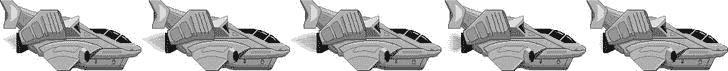

图 6-3. 飞船的动画——五帧带有不同火焰

精灵动画是使用`CCSpriteBatchNode`的另一个好理由，因为你可以将所有动画帧放入同一个纹理中以节省内存。实际上，这需要相当多的代码，正如你在清单 6-11 和 Sprites01 项目中看到的。之后，我将向你展示如何使用纹理图集创建相同的动画，这可以减少你需要编写的代码量。

**清单 6-11.** 在不使用纹理图集的情况下为飞船添加动画需要相当多的代码

```
// 将飞船的动画帧作为纹理加载，并创建一个精灵帧
NSMutableArray* frames = [NSMutableArray arrayWithCapacity:5];
for (int i = 0; i < 5; i++)
{
    // 为动画帧创建纹理
    NSString* file = [NSString stringWithFormat:@"ship-anim%i.png", i];
    CCTexture2D* texture = [[CCTextureCache sharedTextureCache] addImage:file];

    // 整张图像应作为动画帧使用
    CGSize texSize = texture.contentSize;
    CGRect texRect = CGRectMake(0, 0, texSize.width, texSize.height);

    // 从纹理创建精灵帧
    CCSpriteFrame* frame = [CCSpriteFrame frameWithTexture:texture rect:texRect];
    [frames addObject:frame];
}
// 从所有精灵动画帧创建动画对象
CCAnimation* anim = [CCAnimation animationWithSpriteFrames:frames delay:0.08f];

// 通过使用 CCAnimate 动作运行动画，并用 CCRepeatForever 使其循环
CCAnimate* animate = [CCAnimate actionWithAnimation:anim];
CCRepeatForever* repeat = [CCRepeatForever actionWithAction:animate];
[self runAction:repeat];
```

所有这些只是为了创建一个包含五帧的精灵动画？恐怕是的。这次我将倒序讲解代码，这可能会更好地解释其设置。最后，你使用`CCAnimate`动作来播放动画。在这个例子中，你还使用了`CCRepeatForever`动作来循环播放动画。

`CCAnimate`动作使用一个`CCAnimation`对象（它是动画帧的容器），该对象定义了每帧之间的延迟。在许多情况下，你之后会希望引用之前创建的动画。为此，cocos2d 提供了一个`CCAnimationCache`类，它按名称存储`CCAnimation`实例，如清单 6-12 所示。使用`CCAnimationCache`，你可以稍后按名称访问特定的动画。

**清单 6-12.** CCAnimationCache 类可以为你存储动画，并通过名称检索

```
CCAnimation* anim = [CCAnimation animationWithSpriteFrames:frames delay:1];

// 将动画存储在 CCAnimationCache 中
[[CCAnimationCache sharedAnimationCache] addAnimation:anim name:@"move"];

// 稍后：从 CCAnimationCache 中检索 move 动画
CCAnimation* move = [[CCAnimationCache sharedAnimationCache] animationByName:@"move"];
```

回到清单 6-11，注意`for`循环。这就是复杂之处。`CCAnimation`类必须用一个包含`CCSpriteFrame`对象的`NSArray`进行初始化。一个**精灵帧**仅包含对纹理的引用以及一个定义纹理中应绘制区域的矩形。该纹理矩形等于纹理的`contentSize`属性——换句话说，就是纹理中包含的实际图像的大小。请记住，纹理可能比它包含的图像更大，因为纹理的尺寸只能是 2 的幂。


现在，不幸的是，`CCSpriteFrame`不接受图像文件名作为输入；它只接受已有的`CCTexture2D`对象。你需要使用`CCTextureCache`单例的`addImage`方法来创建纹理，该方法通常用于将图像作为纹理预加载到内存中，而无需创建`CCSprite`或其他对象。你可以使用`NSString`的`stringWithFormat`方法来构建文件名，该方法允许你将循环变量`i`附加到文件名中，而不需要写出所有五个文件名。

回顾一下，从上到下，创建并运行动画序列的步骤如下：

1.  创建`NSMutableArray`。
2.  对于每个动画帧：
    a.  为每个图像创建`CCTexture2D`。
    b.  使用`CCTexture2D`创建`CCSpriteFrame`。
    c.  将每个`CCSpriteFrame`添加到`NSMutableArray`中。
3.  使用`NSMutableArray`中的帧创建`CCAnimation`。
4.  可选地，将`CCAnimation`添加一个名称后存入`CCAnimationCache`。
5.  使用`CCAnimate`动作来播放动画。

嘘，冷静点——没必要吃安定片。如果你将动画帧打包到一个纹理图集中，事情会变得稍微简单且更高效。更有帮助的是，将所有这些代码封装到一个辅助方法中，并为你的动画文件坚持使用一种命名约定。

### 动画辅助类别

因为创建动画帧和动画的代码对所有动画都是通用的，你应该考虑将其封装到一个辅助方法中。我通过将`CCAnimationHelper`类添加到`Sprite01`项目中来实现这一点。我没有使用静态方法，而是利用 Objective-C 的一个称为*类别*的特性来扩展`CCAnimation`类。类别提供了一种在不修改原始类的情况下向现有类添加方法的方式。唯一的缺点是，使用类别时不能向类中添加成员变量；你只能添加方法。以下是`CCAnimation`类别的`@interface`，我非正式地将其命名为`Helper`：

```
@interface CCAnimation (Helper)
+(CCAnimation*) animationWithFile:(NSString*)name
                       frameCount:(int)frameCount
                            delay:(float)delay;
@end
```

Objective-C 类别的`@interface`使用与其扩展的类相同的名称，并在括号内添加一个类别名称。类别名称类似于变量名，因此不能包含空格或不能在变量中使用的其他字符（例如标点符号）。`@interface`也不能包含花括号，因为向类别中添加成员变量是不可能的或不允许的。

`CCAnimation`类别的实际`@implementation`使用了与`@interface`相同的模式，即在类名后的括号内附加类别名称。其他一切都像编写常规的类方法一样；在这种情况下，我的扩展方法命名为`animationWithFile`，它接受文件名、帧数和动画延迟作为输入：

```
@implementation CCAnimation (Helper)

// Creates an animation from single files
+(CCAnimation*) animationWithFile:(NSString*)name
                       frameCount:(int)frameCount
                            delay:(float)delay
{
  // Load the animation frames as textures and create the sprite frames
  NSMutableArray* frames = [NSMutableArray arrayWithCapacity:frameCount];
  for (int i = 0; i < frameCount; i++)
  {
      // Assuming all animation files are named "nameX.png"
      NSString* file = [NSString stringWithFormat:@"%@%i.png", name, i];
      CCTexture2D* texture = [[CCTextureCache sharedTextureCache] addImage:file];

      // Assuming that image file animations always use the whole image
      CGSize texSize = texture.contentSize;
      CGRect texRect = CGRectMake(0, 0, texSize.width, texSize.height);
      CCSpriteFrame* frame = [CCSpriteFrame frameWithTexture:texture rect:texRect];
      [frames addObject:frame];
  }
  // Return a CCAnimation object using all the sprite animation frames
  return [CCAnimation animationWithSpriteFrames:frames delay:delay];
}

@end
```

这就是命名约定的用武之地。`Ship`的动画具有基本名称`ship-anim`，后跟一个从`0`开始并以`.png`文件扩展名结尾的连续数字。例如，`Ship`动画的文件名被命名为`ship-anim0.png`到`ship-anim4.png`。如果你使用该命名方案创建所有动画，就可以对所有动画使用上述`CCAnimation`扩展方法。

**提示** 我不禁注意到，许多开发者和艺术家习惯使用固定位数的数字来连续命名文件，必要时会添加前导零。例如，你可能倾向于将文件命名为`my-anim0001`到`my-anim0024`。我认为这种习惯可以追溯到那些不支持自然排序的古老计算机操作系统，它们会错误地对带有连续数字的文件名进行排序，导致`file1`之后是`file10`，然后是`file2`。那个时代早已过去，而且如果你这样命名文件，程序员在`for`循环中加载它们时反而会更麻烦，因为他们必须考虑应该补足多少个前导零。有一个很好的格式化快捷方式`%03i`可以补零，使得数字始终至少为三位。然而，我认为在我们现代世界里，最好还是直接连续命名文件名，而不添加任何前导零。这样你能获得一点简单和安心。

这极大地简化了从单个文件创建动画的代码：

```
// 整个过程现在被封装到一个类别扩展方法中
CCAnimation* anim = [CCAnimation animationWithFile:@"ship-anim"
                    frameCount:5
                    delay:0.08f];
```

本质上，这将对代码行数从九行减少到这一行。至于文件名，你只需传递动画的基本名称——在本例中是`ship-anim`。辅助方法会根据`frameCount`参数添加连续的数字，并附加`.png`文件扩展名。你也可以使用动画的基本名称作为其添加到`CCAnimationCache`时的名称，这样你就不必记住同一动画的其他名称。之前我将飞船动画命名为`move`，现在它被称为`ship-anim`，与文件名保持一致。你可以通过使用其基本名称从`CCAnimationCache`中存储和访问动画，如下所示：

```
NSString* shipAnimName = @"ship-anim";

CCAnimation* anim = [CCAnimation animationWithFile:shipAnimName
                     frameCount:5
                     delay:0.08f];
[[CCAnimationCache sharedAnimationCache] addAnimation:anim name:shipAnimName];

// 稍后的某个时候：
CCAnimation* shipAnim = [shipSprite animationByName:shipAnimName];
```

`animationWithFile`辅助方法做了两个假设：动画图像文件名从`0`开始连续编号，并且文件必须具有`.png`文件扩展名。是否坚持使用这个确切的命名约定，或者修改它以适应你自己的需求，完全取决于你。例如，你可能发现从`1`而不是`0`开始编号动画更方便。在这种情况下，你需要修改`for`循环，使得名称字符串格式化为`i + 1`。重要的是，你应坚持所选择的任何命名约定，以使你的生活（和你的代码）更轻松。

从这节内容中，你应该收获三件事：


*   通过定义你自己的方法来封装常用代码。
*   使用 Objective-C 的分类为现有类添加方法。
*   定义资源文件命名约定以支持你的代码。

## 使用纹理图集

纹理图集有助于节省宝贵的内存并加速精灵的渲染。由于纹理图集本质上就是一张大纹理，你可以使用 `CCSpriteBatchNode` 渲染其中包含的所有图像，从而减少绘制调用的开销。使用纹理图集对于内存使用率和性能来说都是双赢的。

### 什么是纹理图集？

到目前为止，对于所有使用的精灵，我只是简单地加载它们需要显示的图像文件。在内部，这个图像会成为精灵的纹理，其中包含了图像，但纹理的宽度和高度必须始终是 2 的幂——例如，1024×128 或 256×512。纹理尺寸会自动增加以符合此规则，这可能会占用比图像尺寸所暗示的更多的内存。例如，一个尺寸为 140×600 的图像在内存中会变成尺寸为 256×1024 的纹理。这种纹理浪费了大量宝贵的内存，如果你有几张这样的图像并将它们各自加载到单独的纹理中，浪费的内存量就会变得非常可观。

这就是纹理图集的用武之地。它本质上是一张已经对齐到 2 的幂尺寸的图像，并且包含多个图像。纹理图集中包含的每个图像都有一个精灵帧，该帧定义了图像在纹理图集内的矩形区域。换句话说，精灵帧是一个 `CGRect` 结构，它定义了纹理图集的哪一部分应被用作精灵的图像。这些精灵帧保存在一个单独的 `.plist` 文件中，以便 cocos2d 可以从一个大的纹理图集纹理中渲染非常具体的图像。

### 介绍 TexturePacker

将图像打包到纹理图集并记录它们所占的矩形精灵帧，如果没有 TexturePacker，这将是一项艰巨的任务。TexturePacker 是一个 2D 精灵打包工具（如图 6-4 所示）。TexturePacker 应用程序有免费版和付费版，可以从 `www.texturepacker.com` 下载。

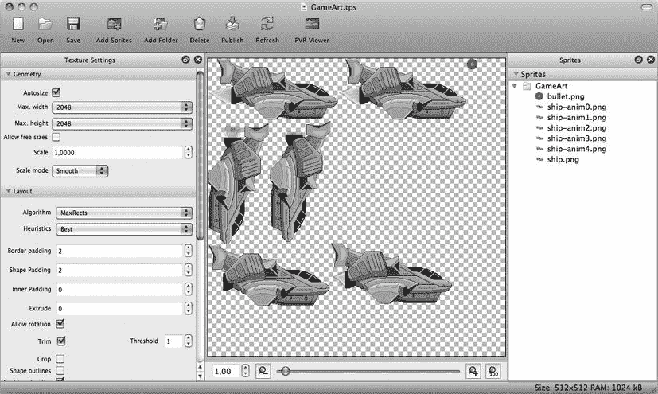

图 6-4 . 已将飞船动画帧打包到纹理图集中的 TexturePacker

免费版 TexturePacker Essential 足以满足基本需求，你可以使用它来创建商业应用程序。它没有专业版更高级的功能，例如保存用于 Retina 显示屏的高分辨率数据、即时为非 Retina 显示屏缩小图像，或优化图形以节省内存。专业版需要付费许可，价格相当合理。

你也可以通过终端应用程序将 TexturePacker 作为命令行工具运行，从而将其集成到你的 Xcode 构建过程中。你可以在 TexturePacker 网站上找到关于 TexturePacker 命令行工具及其用法的更多信息。

在本章中，我使用 TexturePacker Pro，因为它还能导出到 PVR 图像格式，这是 iPhone 的 PowerVR 图形芯片的原生图像格式。专业版还能方便地创建 SD 和 HD 纹理，你需要这些纹理才能在 iPhone 的所有变体上运行项目。

## 为 TexturePacker 准备项目

要使用 TexturePacker，项目 Sprites02 需要稍微重新组织一下。目前，HD 和 SD 版本的所有图像都在 `Resources` 文件夹中。因为你将使用一个包含所有图像在一个纹理中的纹理图集，所以不再需要将单个图像复制到设备上。

首先创建一个名为 `Assets` 的新文件夹，用于存放所有源图像和纹理图集的保存文件。你不再需要每个图像的 HD 和 SD 版本，因为 TexturePacker 会为你缩小图像。因此，使用 TexturePacker 你只需处理 HD 版本，图像文件也无需再带有 `-hd` 后缀。图 6-5 显示了 Sprites02 项目中的 `Assets` 文件夹。

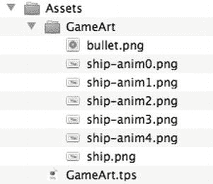

图 6-5 . Assets 文件夹的内容

另一个使处理图像文件更简单的技巧是，将所有应打包到同一个纹理图集的图像文件放在同一个子文件夹中。以 Sprites02 项目为例，`Assets` 文件夹有一个名为 `GameArt` 的子文件夹，其中包含了所有被打包到游戏美术纹理图集中的图像文件。

当你在 TexturePacker 中刷新纹理图集时，TexturePacker 会简单地将该文件夹中的新图像文件添加进去，因此你不再需要手动添加单个图像。TexturePacker 会为每个文件夹创建一个 `.tps`（TexturePacker 保存）文件。

**注意** 如果你有一个名为 `bullet.png` 的独立图像文件，HD 版本必须命名为 `bullet-hd.png`，并且在 cocos2d 中你必须使用字符串 `@"bullet.png"` 来加载该文件。

从单个图像迁移到纹理图集时，一个常见的错误是向纹理图集中添加文件名带有 `–hd` 前缀的图像。在这种情况下，生成的 SD 和 HD 版本纹理图集可能被命名为 `bulletatlas.pvr.czz` 和 `bulletatlas-hd.pvr.czz`。但纹理图集内部包含的图像（现在称为精灵帧）即使在 SD 纹理图集中也会全部命名为 `bullet-hd.png`。因此，你将不得不更改 cocos2d 中所有从 `@"bullet.png"` 到 `@"bullet-hd.png"` 的引用。为避免此问题，我建议在为纹理图集创建图像时，使用不带 `–hd` 后缀的 HD 版本图像文件名。

更糟糕的做法是手动创建两个纹理图集：一个用于仅包含不带 `–hd` 后缀图像文件的 SD 图像，另一个用于仅包含带 `–hd` 后缀图像文件的 HD 图像。如果你随后在 cocos2d 中加载 `@"bullet.png"`，它将无法在 Retina 设备上找到 `–hd` 图像。如果你加载 `@"bullet-hd.png"`，SD 图像将无法加载。这是因为 SD 和 HD 的区分是在纹理图集级别完成的；你将有一个带 `–hd` 后缀的纹理图集和一个不带此后缀的纹理图集。纹理图集内部的精灵帧名称对于 SD 和 HD 纹理图集必须完全相同。

## 使用 TexturePacker 创建纹理图集

使用 TexturePacker 非常直接，只需几个步骤，如图 6-6 所示。在大多数情况下，使用默认设置就可以了。

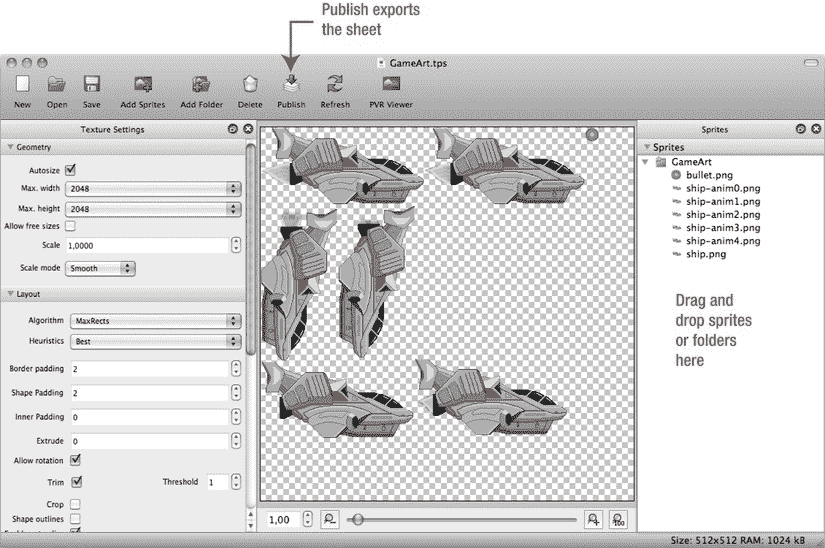

图 6-6 . 使用 TexturePacker 的过程非常直接

首先，添加你想要加入纹理图集的图像。你可以在以后随时添加更多图像或移除现有图像。点击“添加精灵”或“添加文件夹”按钮，或者直接将精灵或文件夹拖放到右侧面板中。TexturePacker 可以加载最常见图形格式的图像。在此案例中，你添加所有飞船图像和动画帧，以及子弹图像。你可以在 Sprites02 示例的 `Assets` 文件夹中找到它们。

只需将 `GameArt` 文件夹拖放到右侧面板。完成后，精灵会立即出现在中间面板中，这是我们纹理图集的实时预览。当你更改任何设置（包括图像优化和图像布局）时，它会立即更新。


在状态栏右下角，你可以看到生成的纹理大小以及在设备上将占用多少内存。在本例中，纹理图集的大小为`1024×1024`像素，将占用`4MB`的纹理内存。此信息适用于高清纹理。标清纹理大小约为`512×512`像素，消耗的内存为高清纹理的四分之一，即`512KB`。请注意，标清纹理图集的宽度和高度不一定正好是高清图集的一半。这是因为某些布局特性（如内边距）在创建标清纹理时不会缩放。

**警告** 除非你专门为最新一代设备开发游戏，否则不应使用超过`2048`像素的纹理宽度或高度。`cocos2d 2.0`支持的所有设备都支持`2048×2048`像素的纹理尺寸——只有`iPhone 4S`、`iPad 2`及更新设备支持`4096×4096`像素的纹理尺寸。你可以在左侧窗格的`Geometry`部分限制`TexturePacker`生成的最大纹理尺寸。

`TexturePacker`使用多种技巧来优化纹理空间，以达到最佳打包率。首先，它会裁剪每张图像的透明边框像素。`cocos2d`通过在绘制精灵时将被裁剪区域作为偏移量添加到精灵位置来补偿此操作。这有两个优点：它减少了纹理尺寸并加快了精灵的渲染速度。

你可能还会注意到有些图像被旋转了。`TexturePacker`旋转它们以优化纹理图集空间的使用。同样，`cocos2d`通过在将图像加载到内存时恢复原始方向来进行补偿。如果你添加了两个或多个完全相同的图像，`TexturePacker`将只添加一张图像以进一步节省纹理图集空间。如果这些图像由不同的文件名引用，则你可以使用任意图像的源文件名在`cocos2d`中加载该图像。当纹理图集中的图像具有多个包含相同图像的源文件时，`TexturePacker`会在中央窗格的图像上绘制一个小的叠加图标（一叠纸张）。

你可能想知道`Border Padding`和`Shape Padding`设置的作用，它们决定了所有图像之间以及图像与图集边框之间留有多少像素的空间。默认的`2`像素可确保纹理图集中的所有图像在绘制时不会产生任何瑕疵。如果内边距较小，图像在游戏中显示时，其边框周围可能会出现杂散像素。这些杂散像素的数量和颜色取决于纹理图集中其他图像周围的像素。这是一个技术问题，与图形硬件对纹理进行过滤的方式有关，唯一的解决方法是在纹理图集中的所有图像之间留出一定量的内边距。

在保存纹理图集之前，你需要调整`TexturePacker`的输出设置，如图 6-7 所示。

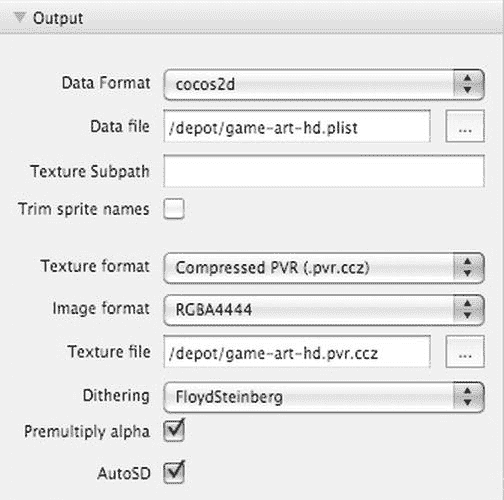

图 6-7. `TexturePacker`输出设置

首先，确保数据格式设置为`cocos2d`，因为`TexturePacker`也可以与其他游戏引擎一起使用。

对于数据文件，指定一个位于项目`Resources`文件夹中的文件。确保文件名包含`-hd`后缀。在`Sprites02`项目中，文件名为`game-art-hd.plist`。`TexturePacker`会将高清纹理保存到给定的文件名，但会在标清版本中省略`-hd`后缀，这正是`cocos2d`所需要的数据格式。要让`TexturePacker`自动创建纹理图集的标清版本，你还需要勾选底部的`AutoSD`复选框。

最后，为导出的纹理图集选择纹理格式和图像格式。推荐的纹理格式设置为`Compressed PVR (.pvr.ccz)`，这是 iPhone 原生`PVR`格式的压缩版本。这种格式通常比`PNG`加载速度快得多，并且如果你的图像是`16`位色深，压缩的`PVR`格式将生成比`PNG`更小的文件。无论图像的实际颜色位深如何，`PNG`文件格式始终存储`32`位颜色值。

**注意** 颜色深度、位深或每像素位数是指用于表示像素颜色信息的位数。`4`位的颜色深度允许图像中的每个像素具有`16`种可能的颜色之一。使用`16`位颜色深度，图像的像素可以显示`65,536`种颜色范围。而`24`位颜色深度则可以拥有数百万种颜色——数量如此之多，以至于`24`位颜色深度的图像有时被称为真彩色图像。为什么这种格式通常被称为`32`位？因为在最常见的文件格式中，额外的`8`位用于存储每个像素的不透明度。

我鼓励你阅读维基百科上关于颜色深度 (`http://en.wikipedia.org/wiki/Color_depth`) 和`RGB`颜色模型 (`http://en.wikipedia.org/wiki/RGB`) 的文章，以了解更多关于计算设备如何显示颜色的信息。

使用`PVR`格式时，你还应该启用`Premultiply alpha`复选框，以避免在某些情况下精灵周围出现暗色边框。在你的项目应用委托中，在`cocos2d`初始化之后、运行第一个场景之前，你应该告知`cocos2d`你的`PVR`图像使用了预乘 alpha。在`cocos2d`项目模板中，这已在`AppDelegate.m`文件中设置。

```
// Enable pre multiplied alpha for PVR textures to avoid artifacts
[CCTexture2D PVRImagesHavePremultipliedAlpha:YES];
```

对于图像格式设置，你有多种选择。默认格式是`RGBA8888`，它能提供最佳视觉效果。它提供`24`位颜色深度和`8`位 Alpha 通道。缺点是它的渲染速度最慢，尤其是在第一代和第二代设备上，建议回退到低质量的图像格式并优先考虑渲染速度。然而，提供设备特定的纹理图集变体操作起来很繁琐。你可能只想在旧设备上减少渲染的精灵数量，或者甚至完全放弃对这些设备的支持。

在质量、内存使用和渲染速度之间最佳折衷方案是`RGBA4444`格式。它为每种颜色使用`4`位，为 Alpha 通道使用`4`位。这是精灵最常用的图像格式。

如果透明度对你来说不重要，并且你希望有更多颜色变化，则应使用`RGB5551`格式，它为每种颜色提供`5`位，仅为 Alpha 通道提供`1`位。Alpha 通道的`1`位只能设置为开或关，这意味着你的图像只能有完全透明或完全不透明的像素。换句话说，`RGB5551`格式的精灵无法与背景像素进行混合。

如果你完全不需要透明度（例如背景图像），可以使用`RGB565`格式，它使用`5`位表示红色、`6`位表示绿色、`5`位表示蓝色通道。它不使用 Alpha 通道。绿色通道有`6`位而其他两个颜色通道只有`5`位，这与我们狩猎采集者的背景有关。我们的视网膜更擅长区分不同的绿色色调，因此在绿色通道中多提供一位，因为我们在该通道中更容易察觉到“缺失的颜色位”。


  
