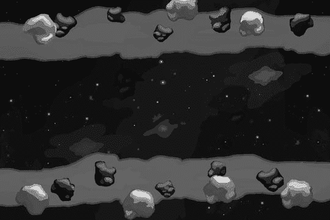
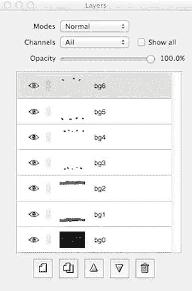
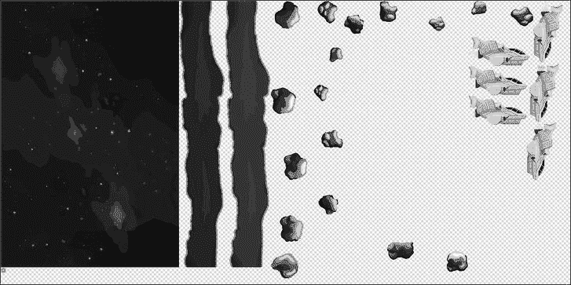
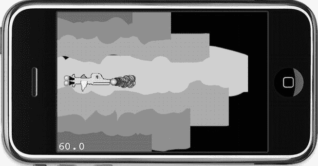

# 欢乐滚动

继续第 6 章中的游戏初稿，你现在将把它变成一个真正像样的射击游戏。首先要做的是让玩家的飞船可控。在这种情况下，加速度计控制并不合适；虚拟游戏手柄会更合适。但与其重新发明轮子，不如使用一个名为 SneakyInput 的酷炫源代码包，为这个 cocos2d 游戏添加虚拟游戏手柄。

移动玩家的飞船是一回事。你还希望背景滚动，以产生向某个方向移动的印象。为了实现这一点，你将实现自己的视差滚动解决方案，因为 `CCParallaxNode` 太有限了——它不允许无限滚动的视差背景。

此外，在本章中，我将说明你在第 6 章中学到的关于纹理图集和精灵批处理的知识。这里有一个包含所有游戏图形的纹理图集，因为在使用纹理图集时不需要单独分组图像。

## 高级视差滚动

因为 `CCParallaxNode` 不允许无限滚动，所以对于这款射击游戏，你将添加一个 `ParallaxBackground` 节点来实现此功能。此外，它还使用 `CCSpriteBatchNode` 来加速背景图像的渲染。

### 创建条带状背景

首先，我想说明我是如何制作这些将产生视差效果的背景条纹的。这对于理解纹理图集 TexturePacker 如何帮助你节省内存和性能，以及节省定位各个条纹的时间至关重要。图 7-1 将背景层显示为由各个视差层组成的 Seashore 图像。该图像也在 `ScrollingWithJoy01` 项目的 `Assets` 文件夹中，文件名为 `background-parallax.xcf`。




图 7-1. 视差滚动背景的源图像

在图像编辑程序 Seashore 中，每个条纹都处于独立的图层中。在图 7-2 中，你可以看到各个图层，而 `Assets` 文件夹中存储了名为 `bg0.png` 至 `bg6.png` 的图像文件，它们对应于构成背景的七个独立条纹。

我之所以推荐用这种方式创建视差背景图像，有几个原因。你可以将图像作为一个整体创建，但能够将每个图层保存到单独的文件中。所有这些文件的大小都是 960 × 640 像素，乍看之下可能有些浪费，但你并不会将这些单独的图像直接添加到游戏中，而是将它们添加到纹理图集中。由于 TexturePacker 会移除每张图像周围透明的空间，它将各个条纹缩减到了最小尺寸。这一点可以在图 7-3 中看到。



图 7-2. 背景的每个条纹都位于独立的图层上。这有助于创建独立的图像并将它们定位在游戏中



图 7-3. 背景条纹在纹理图集中的显示效果

将条纹分割成独立的图像，不仅有助于按正确的 z 轴顺序绘制图像。严格来说，图像 `bg5.png` 和 `bg6.png` 可以处于相同的 z 轴顺序，因为它们互不重叠，但我还是选择将它们保存为独立的文件。在图 7-3 中，你可以看到这两个文件是顶部的两个条纹。注意它们在纹理图集中实际占用的空间有多么小；这是因为 TexturePacker 移除了这些图像周围大部分透明的部分。

现在，假设我将这两个条纹都留在同一张 960 × 640 的图像中——一个在图像顶部，另一个在底部，中间会有一个巨大的透明空洞。TexturePacker 无法移除这两个精灵之间的透明部分，因此它们会以 960 × 640 的图像尺寸保留在纹理图集中，这比它们作为独立图像所占用的空间要多得多。

将条纹分割成独立的图像也有助于维持高帧率。iOS 设备的填充率（即每帧能绘制的像素数）非常有限。由于图像经常相互重叠，iOS 设备常常需要在每帧多次绘制同一个像素。最极端的情况是一张全屏图像覆盖在另一张全屏图像之上。你只能看到两张图像中的一张，但设备实际上必须绘制两者。此现象的技术术语称为“过度绘制”。将背景分离成尽可能少重叠的独立条纹，可以减少需要绘制的像素数量。

**提示** 通过使用 16 位纹理（RGB565、RGBA5551 和 RGBA4444）甚至 PVR 压缩纹理，你可以提高游戏的渲染性能。当然，这也会损失一些图像质量，但在许多情况下，在 iPhone 屏幕上几乎察觉不到，即使你在电脑屏幕上看到了一些伪影。TexturePacker 允许你降低图像的色彩深度，同时通过抖动技术保留大部分图像质量。如果你遇到加载时间过长的问题，尝试将图像保存为压缩的 `pvr.czz` 格式是值得的，因为这种特定的图像文件格式的加载速度明显快于其他格式。

## 在代码中重新创建背景

到现在为止，你可能想知道如何在不花费大量时间正确定位这些精简图像的情况下，在源代码中将这些图像重新组合起来。答案是：你不需要这样做。因为这些图像都是以全屏图像保存的，所以 TexturePacker 会存储图像偏移量，而 cocos2d 在渲染精灵时会使用这些偏移量。你真正需要做的只是将每张图像在屏幕上居中放置，它们便会出现在正确的位置。

查看 `ScrollingWithJoy01` 项目中新增的 `ParallaxBackground` 节点的代码。头文件非常直接：

```
@interface ParallaxBackground : CCNode
{
    CCSpriteBatchNode* spriteBatch;
    int numSprites;
}
@end
```

我只保留了对 `CCSpriteBatchNode` 的引用，因为我将在代码中频繁访问它。将节点存储为实例变量比通过 `getNodeByTag` 方法向 cocos2d 请求节点要快，并且节点的子节点越多，这种差异就越明显。通过将节点存储为实例变量来保留对它的引用，可以为你节省几个 CPU 周期。这虽然不是什么巨大的性能提升，当然也不值得为此保留数百个成员变量，但在你需要频繁访问特定节点的情况下，这非常方便。

在 `ParallaxBackground` 类的 `init` 方法中，创建了 `CCSpriteBatchNode`，并从纹理图集中添加了全部七张背景图像，如代码清单 7-1 所示。

***代码清单 7-1*** 加载背景图像

```
-(id) init
{
    if ((self = [super init]))
    {
        CGSize screenSize = [CCDirector sharedDirector].winSize;

// 通过将游戏纹理添加至缓存来获取它
     CCTexture2D* gameArtTexture = [[CCTextureCache sharedTextureCache] ←
         addImage:@"game-art.pvr.ccz"];

// 创建背景 spritebatch
     spriteBatch = [CCSpriteBatchNode batchNodeWithTexture:gameArtTexture];
     [self addChild:spriteBatch];

// 添加 6 个不同的层对象并将其定位在屏幕上
     for (int i = 0; i < 7; i++)
     {
     NSString* frameName = [NSString stringWithFormat:@"bg%i.png", i];
     CCSprite* sprite = [CCSprite spriteWithSpriteFrameName:frameName];
     sprite.position = CGPointMake(screenSize.width / 2, ←
         screenSize.height / 2);
     [spriteBatch addChild:sprite z:i];
     }

scrollSpeed = 1.0f;
     [self scheduleUpdate];
    }
    return self;
}
```

首先，你从 `CCTextureCache` 中获取 `game-art.pvr.czz` 纹理。通常你会使用 `textureForKey` 方法来访问已加载的纹理。但如果你不确定该纹理是否已在缓存中，你也可以使用 `addImage` 方法代替 `textureForKey`。如果纹理未缓存，`addImage` 会加载它；否则 `addImage` 只会返回已缓存的纹理。只要该图像包含在应用程序的 bundle 中，`addImage` 保证会返回一个有效的纹理。

创建并设置好 `CCSpriteBatchNode` 后，下一步是加载七张独立的背景图像。我特意将它们从 0 到 6 编号，以便你可以使用 `stringWithFormat` 以一种非常高效的方式将文件名创建为字符串：

```
NSString* frameName = [NSString stringWithFormat:@"bg%i.png", i];
```

使用这个精灵的 `frameName`，像往常一样创建一个 `CCSprite`，然后将其定位在屏幕中心：

```
sprite.position = CGPointMake(screenSize.width / 2, screenSize.height / 2);
```

当然，一旦你创建了这个项目的 iPad 版本，这些图像将不再完美适配，因为它们是为 960 × 640 分辨率的屏幕设计的。要创建 iPad 版本，请遵循完全相同的步骤，但将原始图像大小设为 1024 × 768，如果你还想支持 Retina iPad 分辨率，甚至可以设为该尺寸的两倍。然后，你可以通过裁剪边框，轻松地从更高分辨率的图像中缩小出 960 × 640 的图像。


**提示**  在 cocos2d 中从单个精灵帧重新创建源图像出奇地省力，这完全归功于`TexturePacker`帮你保存了图像偏移量。这也是创建游戏屏幕布局的好方法。你可以让美工使用原生屏幕分辨率（iPhone 为 960×640，iPad 为 2048×1536）将每个屏幕设计成独立的图层，需要多少层就设计多少层。然后导出每个图层，作为独立的带透明度的全屏文件。接着从这些文件中创建一个纹理图集，你就能在 cocos2d 中获得美工所构想的屏幕设计，无需费力定位各个文件，也不会浪费内存。如果需要，`TexturePacker`会自动将图像缩放至标准分辨率。

由于`ParallaxBackground`类派生自`CCNode`，你只需在精灵帧加载完成后，在`GameLayer init`方法中添加`ParallaxBackground`到游戏中，如下所示：

```
-(id) init
{
    if ((self = [super init]))
    {
        sharedGameLayer = self;

// 如果背景透出，我们希望它能被看到！
        glClearColor(1, 1, 1, 1);

// 预加载所有游戏素材。
        CCSpriteFrameCache* frameCache = [CCSpriteFrameCache sharedSpriteFrameCache];
        [frameCache addSpriteFramesWithFile:@"game-art.plist"];

CGSize screenSize = [CCDirector sharedDirector].winSize;

ParallaxBackground* background = [ParallaxBackground node];
        [self addChild:background z:-1];

/*
        // 添加背景图像
        CCSprite* background = [CCSprite spriteWithSpriteFrameName:@"background.png"];
        background.position = CGPointMake(screenSize.width / 2, screenSize.height / 2);
        [self addChild:background];
        */

...
```

你还需要在`GameLayer.m`文件的顶部导入`ParallaxBackground.h`头文件：

```
#import "ParallaxBackground.h"
```

视差背景替换了`CCLayerColor`和背景`CCSprite`（这些是第 6 章中的占位符），因此你还需要删除或注释掉所有对背景精灵或`CCLayerColor`的引用。此外，我将 OpenGL 清除颜色设置为白色——稍后这将帮助你发现在视差滚动代码早期版本中出现的一个视觉伪影。

## 移动视差背景

在`ScrollingWithJoy01`项目中，我还添加了一个快速而粗糙的背景条纹滚动效果。它确实显示出了视差效果，尽管图像很快移出屏幕，露出了它们背后的空白背景。图 7-4 并非我最初设想的效果，但我正在逐步接近目标。



图 7-4. 背景条纹在移动，但同时也在永远离开屏幕

**注意**  你还会注意到图 7-4 看起来完全不像图 7-1 或游戏项目。图 7-4 使用了虚拟图形来更好地说明视差图像“离开”屏幕的效果。使用星空背景条纹时，这种效果更难察觉。在动态中你会更明显地感受到这种效果。在图像中你能看到的是，各个条纹以不同的速率移动，这正是视差滚动的核心所在。

代码清单 7-2 显示，如果你暂时忽略图 7-4 中看到的缺陷，使背景滚动的代码出奇地简单。

**代码清单 7-2.**  移动背景条纹

```
-(void) update:(ccTime)delta
{
    for (CCSprite* sprite in spriteBatch.children)
    {
         CGPoint pos = sprite.position;
         pos.x - = (scrollSpeed + sprite.zOrder) * (delta * 20);
         sprite.position = pos;
    }
}
```

每一帧中，每个背景图像的`x`位置都会减去一个值，从而使图像从右向左滚动。图像移动多少取决于预定义的`scrollSpeed`加上精灵的`zOrder`。delta 乘数用于使滚动速度独立于帧率，然后再乘以 20 以使滚动速度足够快。离屏幕更近的图像滚动得更快。然而，使用`zOrder`属性会导致本应处于相同视觉深度的条纹以不同的速度滚动。

位置还会乘以*delta 时间*，以使滚动速度独立于帧率。delta 时间本身只是一个微小的时间片段——它是两次调用`update`方法之间的时间间隔。在恰好 60 帧每秒（FPS）的情况下，它是 1/60 秒，即 0.167 秒的 delta 时间。因此，我将 delta 乘以 20 只是为了获得一个足够快的滚动速度；否则图像移动得太慢。

## 视差速度因子

同一颜色的条纹需要以相同的速度滚动，并且条纹应该重复，这样背景才不会显露出来。我对这些问题的解决方案在`ScrollingWithJoy02`项目中。

第一个改变与滚动速度有关。我决定使用一个`NSMutableArray`来存储各个条纹移动的速度因子。还有其他解决方案可用，但这让我能够说明`NSMutableArray`以及实际上所有 iOS SDK 集合类的一个关键问题：它们只能存储对象，而不能存储整数和浮点数等值。

解决这个问题的方法是将数值装箱成`NSNumber`对象。以下代码是新添加的`NSMutableArray* speedFactors`，用于存储浮点值。该数组在`ParallaxBackground`类的头文件中定义：

```
@interface ParallaxBackground : CCNode
{
    CCSpriteBatchNode* spriteBatch;
    int numStripes;

NSMutableArray* speedFactors;
    float scrollSpeed;
}
@end
```

然后在`ParallaxBackground`类的`init`方法中填入这些因子。注意`NSNumber numberWithFloat`是如何用于在数组中存储浮点值的。我将在下一节解释添加额外背景精灵的代码。我在`init`方法中的`scheduleUpdate`行之前添加了以下代码：

**代码清单 7-3.**  修改后的`ParallaxBackground`类`init`方法

```
...
numStripes = 7;

// 添加 7 个更多条纹，翻转它们并将它们放置在相邻条纹旁边
for (int i = 0; i < numStripes; i++)
{
    NSString* frameName = [NSString stringWithFormat:@"bg%i.png", i];
    CCSprite* sprite = [CCSprite spriteWithSpriteFrameName:frameName];

// 将新精灵定位在屏幕宽度右侧一个屏幕的位置
    sprite.position = CGPointMake(screenSize.width + screenSize.width / 2, ←
     screenSize.height / 2);

// 翻转精灵，使其与相邻精灵完美对齐
    sprite.flipX = YES;

// 使用偏移 numStripes 的相同标签添加精灵
    [spriteBatch addChild:sprite z:i tag:i + numStripes];
}

// 初始化包含各个条纹滚动因子的数组。
speedFactors = [NSMutableArray arrayWithCapacity:numStripes];
[speedFactors addObject:[NSNumber numberWithFloat:0.3f]];
[speedFactors addObject:[NSNumber numberWithFloat:0.5f]];
[speedFactors addObject:[NSNumber numberWithFloat:0.5f]];
[speedFactors addObject:[NSNumber numberWithFloat:0.8f]];
[speedFactors addObject:[NSNumber numberWithFloat:0.8f]];
[speedFactors addObject:[NSNumber numberWithFloat:1.2f]];
[speedFactors addObject:[NSNumber numberWithFloat:1.2f]];
NSAssert(speedFactors.count == numStripes, ←
    @"speedFactors count does not match numStripes!");

scrollSpeed = 1.0f;
[self scheduleUpdate];
```


