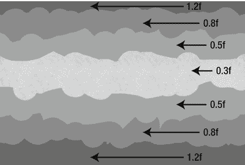
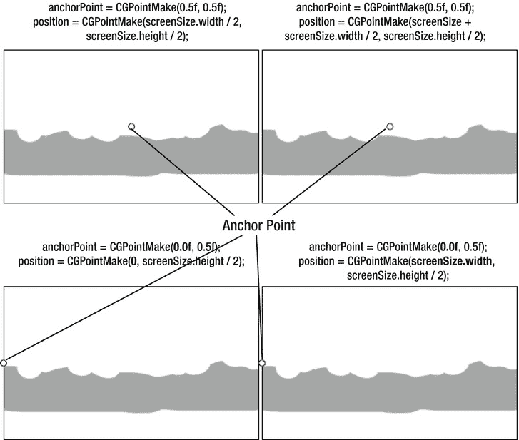
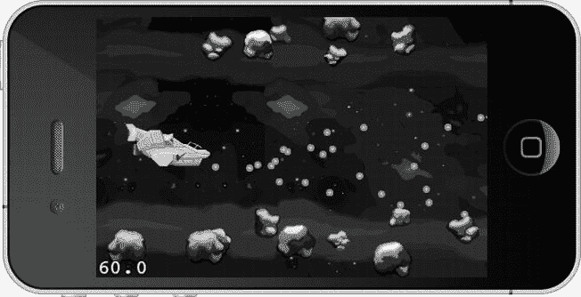
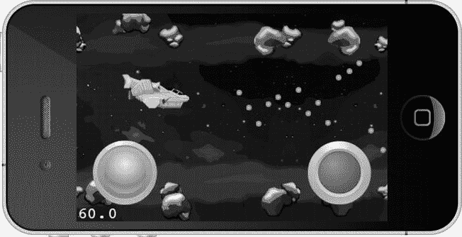
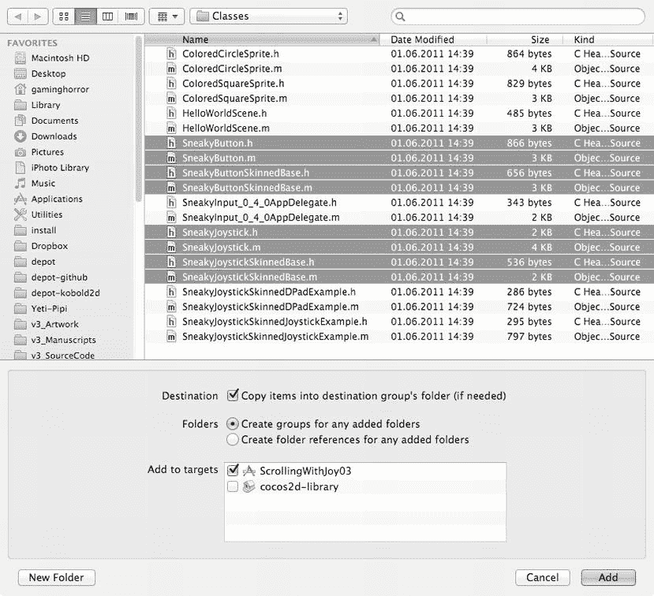

# 排版后的文档

最后的断言仅仅是为了防止人为失误的安全检查。设想一下，你可能因为某种原因在背景中添加或移除条纹，但忘记调整要添加到 `speedFactors` 数组中的数值数量。如果你忘记修改 `speedFactors` 的初始化，断言会提醒你这一点，而不是在之后某个时间点随机地让游戏崩溃。

在图 7-5 中，你可以看到哪个速度因子应用于哪条条纹。速度因子较高的条纹比速度因子较低的条纹移动得更快，这就产生了视差效果。我再次使用了占位图形，以便让每条单独的条纹清晰可见。



图 7-5. 应用于每条背景条纹的速度因子

要使用新引入的速度因子，请将 `update` 方法修改为：

```
-(void) update:(ccTime)delta
{
    for (CCSprite* sprite in spriteBatch.children)
    {
        NSNumber* factor = [speedFactors objectAtIndex:sprite.zOrder];

        CGPoint pos = sprite.position;
        pos.x - = (scrollSpeed * factor.floatValue) * (delta * 50);
        sprite.position = pos;
    }
}
```

根据精灵的 `zOrder` 属性，从 `speedFactors` 数组中获取一个 `NSNumber` 类型的速度因子。该因子乘以 `scrollSpeed` 以加快或减慢单条条纹的移动速度。你不能直接对 `NSNumber` 对象进行乘法运算，因为它是一个包装类，存储了类似 `float`、`int`、`char` 等基本数据类型。`NSNumber` 有一个 `floatValue` 属性，可以返回其中存储的浮点数值，同时它还有许多其他属性用于检索不同的数据类型。你也可以使用 `intValue`，即使这个 `NSNumber` 存储的是浮点值。这本质上与将 `float` 强制转换为 `int` 相同。同样地，`delta` 时间也被考虑在内，以使滚动速度独立于帧率。

通过使用 `speedFactors` 数组，并为相同颜色的条纹赋予相同的因子，背景条纹现在将按预期移动。但无限滚动的问题仍然存在。

## 滚向无限远

在 `ScrollingWithJoy02` 中，也迈出了实现无限滚动的第一步。你将在代码清单 7-4 中找到，该清单重复了代码清单 7-3 中首次引入的代码片段，但为 `CCSpriteBatchNode` 额外添加了七个背景条纹，且设置略有不同。

**代码清单 7-4.** 添加屏幕外的背景图像

```
// 添加七个额外的条纹，翻转它们，并将其定位在相邻条纹旁边
for (int i = 0; i < numStripes; i++)
{
    NSString* frameName = [NSString stringWithFormat:@"bg%i.png", i];
    CCSprite* sprite = [CCSprite spriteWithSpriteFrameName:frameName];

    // 将新精灵定位在右侧一个屏幕宽度处
    sprite.position = CGPointMake(screenSize.width + screenSize.width / 2, ←
        screenSize.height / 2);

    // 翻转精灵，使其与相邻条纹完美对齐
    sprite.flipX = YES;

    // 使用相同的标签添加精灵，偏移量为 numStripes
    [spriteBatch addChild:sprite z:i tag:i + numStripes];
}
```

其思想是为每种类型各添加一个额外的条纹。它们的位置经过调整，使其与原始条纹位置的右端对齐。实际上，这使背景条纹的总宽度增加了一倍，足以实现无限滚动效果。但稍后我会详细说明。

首先，我需要指出，新相邻图像的 x 坐标被翻转了（沿 y 轴镜像），以便图像在视觉上对齐，避免出现任何明显的接缝。新图像还获得了不同的标签编号，该编号偏移了正在使用的条纹数量。这样，通过在标签编号上加上或减去 `numStripes`，就能轻松访问到相邻的条纹。

现在，背景图像在显示图像后面的空白画布之前，会稍微多滚动一会儿。但你不会止步于此；相反，你将完成这项工作，添加无缝的无限滚动。

首先，修改原始条纹的 `anchorPoint` 属性，使事情更简单一些。`x` 位置设置为 0，并且条纹左对齐，同时 `anchorPoint` 的 x 坐标也设置为 0。对于额外添加的、已翻转的条纹也是如此，现在它们只需要偏移屏幕宽度，就能与原始条纹对齐。代码清单 7-5 中突出显示了 `ParallaxBackground` 类的 `init` 方法的更改。

**代码清单 7-5.** 添加屏幕外的背景图像

```
numStripes = 7;

// 添加 7 个不同的条纹并将其定位在屏幕上
for (int i = 0; i < numStripes; i++)
{
    NSString* frameName = [NSString stringWithFormat:@"bg%i.png", i];
    CCSprite* sprite = [CCSprite spriteWithSpriteFrameName:frameName];
    sprite.anchorPoint = CGPointMake(0, 0.5f);
    sprite.position = CGPointMake(0, screenSize.height / 2);
    [spriteBatch addChild:sprite z:i tag:i];
}

// 添加 7 个额外的条纹，翻转它们，并将其定位在相邻条纹旁边
for (int i = 0; i < numStripes; i++)
{
    NSString* frameName = [NSString stringWithFormat:@"bg%i.png", i];
    CCSprite* sprite = [CCSprite spriteWithSpriteFrameName:frameName];

    // 将新精灵定位在右侧一个屏幕宽度处
    sprite.anchorPoint = CGPointMake(0, 0.5f);
    sprite.position = CGPointMake(screenSize.width, screenSize.height / 2);

    // 翻转精灵，使其与相邻条纹完美对齐
    sprite.flipX = YES;

    // 使用相同的标签添加精灵，偏移量为 numStripes
    [spriteBatch addChild:sprite z:i tag:i + numStripes];
}
```

条纹的 `anchorPoint` 从其默认值 `(0.5f, 0.5f)` 更改为 `(0, 0.5f)`，使其左对齐。这样做使得处理视差精灵更加容易，因为在这种特定情况下，你不希望必须考虑纹理原点与精灵的 `x` 位置不在同一位置的问题。图 7-6 展示了这如何简化 `x` 位置的计算。



图 7-6. 为简化起见，将锚点移至左侧

你可以在代码清单 7-6 中看到这对修改后的 `update` 方法有何帮助，该方法现在为我们提供了无限滚动效果。

**代码清单 7-6.** 实现图像对的无缝移动

```
-(void) update:(ccTime)delta
{
    for (CCSprite* sprite in spriteBatch.children)
    {
        NSNumber* factor = [speedFactors objectAtIndex:sprite.zOrder];

        CGPoint pos = sprite.position;
        pos.x - = (scrollSpeed * factor.floatValue) * (delta * 50);

        // 当条纹超出边界时重新定位
        CGSize screenSize = [CCDirector sharedDirector].winSize;
        if (pos.x < -screenSize.width)
        {
            pos.x += screenSize.width * 2;
        }

        sprite.position = pos;
    }
}
```

现在，只需要检查条纹的 `x` 位置是否小于负的屏幕宽度，如果是，则将其增加两倍的屏幕宽度。本质上，这将刚刚离开屏幕左侧的精灵移动到右侧，刚好位于屏幕之外。这个过程会使用相同的两个精灵无限重复，从而实现无限滚动的效果。


**提示** 请注意屏幕背景在滚动，但飞船保持原地不动。缺乏经验的游戏开发者常会误以为屏幕上所有元素都需要滚动，才能实现游戏物体随角色在游戏世界中前进时从角色旁经过的效果。实际上，你只需移动背景层而让玩家角色固定不动，就能更轻松地营造出物体在屏幕上移动的错觉。《超级涡轮猪》（Super Turbo Action Pig）、《逃脱》（Canabalt）、《超级爆炸》（Super Blast）、《涂鸦跳跃》（DoodleJump）和《僵尸村》（Zombieville USA）等热门游戏均采用了这种视觉错觉。通常情况下，滚动进入视野的游戏对象会在出现前随机生成，离开屏幕后则从游戏中移除。第 11 章也使用了相同的效果：玩家角色保持在屏幕中央，只有其脚下的游戏世界实际移动，从而给人以角色在世界中四处移动的印象。

## 修复闪烁

目前一切顺利，只剩一个问题。如果仔细观察，你会发现两个背景条纹交汇处出现了一条垂直的闪烁线。这正是它们对齐的位置。这条线是由于位置舍入误差与子像素渲染共同导致的。有时一个 1 像素宽的缝隙只出现几分之一秒，可能每隔一帧出现一次，也可能只是偶尔出现，具体取决于滚动速度。但它仍然可见，并且商业级游戏应该消除这种问题。

最简单的解决方案是将两个条纹重叠 1 像素。在 `ScrollingWithJoy02` 项目中，修改 `init` 方法中翻转背景条纹的初始位置，将 `x` 坐标减去 1 像素：

```
sprite.position = CGPointMake(screenSize.width - 1, screenSize.height / 2);
```

这还需要更新 `update` 方法中的条纹重新定位代码，使条纹向左多移动 2 像素：

```
// 当条纹越界时重新定位
if (pos.x < −screenSize.width)
{
    pos.x + = (screenSize.width * 2) - 2;
}
```

为什么是 2 像素？因为翻转条纹的初始位置已向左移动了 1 像素，所以每次翻转时，必须将所有条纹再向左移动 2 像素，以保持相同的间距和 1 像素的重叠。

另一种解决方案是只更新当前最左侧精灵的位置，然后找到与其右对齐的精灵，并将其偏移恰好一个屏幕宽度。这样也能避免舍入误差。图 7-7 展示了最终效果图。



图 7-7 效果：无限滚动的视差背景

## 重复、重复、再重复

还有一个巧妙技巧值得一提。你可以让任何纹理在特定的矩形区域内重复显示。如果将该区域设置得足够大，纹理几乎可以无限重复。这样至少可以覆盖数千像素或几十个屏幕区域，且不会增加内存开销。

该技巧的核心是使用 OpenGL 支持的 `GL_REPEAT` 纹理参数，但它仅适用于尺寸恰好为 2 的幂次方的方形图片，例如 32 × 32 或 512 × 512 像素。代码清单 7-7 展示了相关代码。

***代码清单 7-7*** 使用 GL_REPEAT 实现重复背景

```
CGRect repeatRect = CGRectMake(−5000, -5000, 5000, 5000);
CCSprite* sprite = [CCSprite spriteWithFile:@"square.png" rect:repeatRect];
ccTexParams params =
{
    GL_LINEAR, // 纹理缩小函数
    GL_LINEAR, // 纹理放大函数
    GL_REPEAT, // 纹理沿 X 坐标的环绕方式
    GL_REPEAT  // 纹理沿 Y 坐标的环绕方式
};
[sprite.texture setTexParameters:&params];
```

在此例中，必须使用一个 `rect` 初始化精灵，该 `rect` 决定了精灵将占据的区域。`ccTexParams` 结构体被初始化，其纹理坐标的环绕参数设置为 `GL_REPEAT`。如果这让你感到困惑，不必担心。这些 OpenGL 参数随后通过 `CCTexture2D` 的 `setTexParameters` 方法应用到精灵的纹理上。

最终效果是一个平铺区域，不断重复显示同一张 `square.png` 图片。如果移动精灵，`repeatRect` 覆盖的整个区域也会随之移动。你可以利用这个技巧移除最底部的背景条纹，替换成一张更小的图片，让它简单地重复即可。我将此留作你的练习。

## 虚拟手柄

由于 iOS 设备均使用触摸屏作为输入，没有传统移动游戏设备的十字键或模拟摇杆，因此你需要一种称为*虚拟手柄*的输入方式。它通过允许你触摸屏幕上显示的十字键或摇杆区域，并移动手指来控制屏幕上的动作，从而模拟数字或模拟摇杆的行为。按钮也是触摸屏上的指定区域，你可以点击或按住它们来触发屏幕上的动作。图 7-8 展示了一个正在工作的虚拟手柄。



图 7-8 使用 SneakyInput 创建的带皮肤模拟摇杆和开火按钮

**警告** 虚拟手柄在外观上模仿了手柄控制器，但在手感上却完全不同。用户仍然在触摸平坦的表面，手指无法感知虚拟摇杆移动了多远，也无法确定虚拟按钮是否已被按下或错过。许多玩家对使用虚拟手柄控制游戏感到不适。目前普遍认为，虚拟手柄的控制器元素不应超过两到三个，通常是一个摇杆/十字键（有时仅限于两个方向）和一或两个按钮。添加更多元素可能会使游戏操作难度呈指数级增长。同时，请考虑通常可以用加速计输入替代方向键的至少一个轴向，这样用户可以通过倾斜设备向左或向右移动，而无需按住相应的虚拟按钮。

### 初识 SneakyInput

长期以来，许多开发者都面临实现虚拟手柄的问题。实现方法有很多，失败的方式更多。但既然有现成的解决方案，为何还要浪费时间呢？

这通常是一个明智的建议。在开始编写任何看似通用、且他人可能已经研究过的东西之前，请务必检查是否有可以直接使用的通用解决方案，而无需花费大量时间自行创建。在这个案例中，SneakyInput 实在优秀得不容忽视。

SneakyInput 由 Nick Pannuto 创建，CJ Hanson 提供了皮肤示例。SneakyInput 是开源软件，可免费下载，但如果您喜欢此产品，请考虑在此处向 Nick Pannuto 捐赠：`http://pledgie.com/campaigns/9124`。

Kobold2D 用户无需操心，因为 SneakyInput 已包含在 Kobold2D 发行版中。Kobold2D 用户可以跳过接下来的两节。

### 下载 SneakyInput

SneakyInput 的源代码托管在 GitHub 这个社交编程网站上：`http://github.com/sneakyness/SneakyInput`。


从 GitHub 下载源代码的具体步骤可能不是显而易见的。当你点击一个文件时，会在浏览器中看到实际的源代码。但你想要的是完整的源代码项目，而不是单个文件。你需要做的是，在网站右上角下方找到“Downloads”选项卡，或者页面左侧位于“Clone in Mac”和“HTTP|Git Read-Only”按钮之间的“ZIP”按钮。然后将文件保存到你的电脑并解压。

由于 `SneakyInput` 附带了一个集成了 `cocos2d` 的示例项目，该演示项目所使用的 `cocos2d` 版本很可能不是最新的，甚至可能无法编译。这对本章的剩余部分没有影响，因为我将挑选出能与 `cocos2d 2.0` 配合使用的代码。

### 集成 SneakyInput

你已经有了一个可用的项目，并且不想使用 `SneakyInput` 提供的项目。那么，如何让它与你的项目协同工作呢？

这个问题并不仅限于 `SneakyInput`，对于任何下载后自带其特有版本 `cocos2d` 的源代码项目都可能存在。在大多数情况下，只要这些源代码的编程语言是 Objective-C，你只需弄清楚项目中的哪些文件是必要的，并将它们添加到你的项目中。然而，这并没有明确的指南，因为每个项目都是不同的。

不过，我可以告诉你需要为你的项目添加哪些与 `SneakyInput` 相关的文件。其核心由四个类组成：

*   `SneakyButton` 和 `SneakyButtonSkinnedBase`
*   `SneakyJoystick` 和 `SneakyJoystickSkinnedBase`

其余的文件并非必需，但可以作为参考，除了 `ColoredCircleSprite` 和 `ColoredSquareSprite` 类，它们与 `cocos2d 2.0` 不兼容。图 7-9 显示了“Add Files To ...”对话框中的选项。



图 7-9. 你需要这些文件才能使 `SneakyInput` 在你的项目中正常工作；其他文件仅用于示例代码

`HelloWorldScene` 类由 `cocos2d` 项目模板创建，并且很可能只包含示例代码。当然，我的项目中已经有一个 `AppDelegate`，所以我不需要添加 `SneakyInput` 的 `AppDelegate` 类——它可能与现有的 `AppDelegate` 冲突。还有两个类明确使用了 `Example` 后缀，这表明这些文件并非 `SneakyInput` 的核心类，而是更多的示例代码。

添加了 `SneakyInput` 按钮和摇杆类后，你的项目将无法编译。这是因为 `SneakyInput` 类尚未转换为 ARC。现在你应该从 Xcode 的菜单中选择 Edit  Refactor  Convert to Objective-C ARC ... 来执行转换。确保在运行 ARC 转换检查之前，只选中了 `ScrollingWithJoy03` 项目。当 Xcode 完成检查后，你将看到一个预览；点击“Save”接受所有更改。

**提示** 如果你遇到无法重构为 ARC 的第三方代码，可以采取以下两种方法之一。一种是将该代码编译为一个禁用 ARC 的独立静态库，并将该库链接到你的应用中，就像你在第 2 章中对 `cocos2d` 所做的那样。另一种方法是，为每个需要在没有 ARC 的情况下编译的文件添加编译器标志 `–fobjc-no-arc`。要添加该标志，在目标的“Build Phases”选项卡中展开“Compile Sources”部分，然后在右侧的“Compiler Flags”列中输入该标志。请注意，需要采用这两种方法之一的代码可能通常与 ARC 不兼容。请咨询代码的作者或其他用户，以确认该代码是否可以在 ARC 下安全使用。

现在代码可以编译了，但会出现四个关于 `sharedDispatcher` 已弃用的警告。你可以选择忽略这些警告，但最终你还是需要修复它们，所以不妨现在就做。有问题的代码行都以 `[CCTouchDispatcher sharedDispatcher]` 开头，例如：

```
[[CCTouchDispatcher sharedDispatcher] removeDelegate:self];
```

要修复此警告，请修改这些行，使其改用由 `CCDirector` 提供的触摸派发器：

```
[[CCDirector sharedDirector].touchDispatcher removeDelegate:self];
```

### 触摸按钮以射击

让我们来尝试一下。将 `SneakyInput` 源代码添加到项目 `ScrollingWithJoy03` 后，第一个目标是添加一个按钮，允许玩家从飞船发射子弹。你需要通过添加一个 Objective-C 类模板文件，并确保它继承自 `CCLayer`，从而向项目添加一个单独的 `InputLayer` 类。将 `InputLayer` 类实例添加到 `GameLayer` 类中。代码清单 7-8 更新了 `scene` 方法，以将新的 `InputLayer` 添加到其中，并且两个层都获得了标签，以防你需要稍后识别它们。

***代码清单 7-8.***  将 InputLayer 添加到 GameScene

```
#import "InputLayer.h"
...

+(id) scene
{
    CCScene* scene = [CCScene node];
    GameScene* layer = [GameScene node];
    [scene addChild:layer z:0 tag:GameSceneLayerTagGame];
    InputLayer* inputLayer = [InputLayer node];
    [scene addChild:inputLayer z:1 tag:GameSceneLayerTagInput];
    return scene;
}
```

新的标签在 `GameLayer` 头文件中定义，位于现有的 `GameSceneNodeTags` 枚举之上，如下所示：

```
typedef enum
{
    GameSceneLayerTagGame = 1,
    GameSceneLayerTagInput,
} GameSceneLayerTags;
```

`InputLayer` 就位后，下一步是将你想要使用的 `SneakyInput` 文件的头文件添加到 `InputLayer.h` 头文件中。我不挑剔，你可能会用到大部分类，所以只需添加所有 `SneakyInput` 头文件：

```
#import <Foundation/Foundation.h>
#import "cocos2d.h"
#import "GameLayer.h"
#import "Ship.h"

// SneakyInput headers
#import "SneakyButton.h"
#import "SneakyButtonSkinnedBase.h"
#import "SneakyJoystick.h"
#import "SneakyJoystickSkinnedBase.h"

@interface InputLayer : CCLayer
{
    SneakyButton* fireButton;
    SneakyJoystick* joystick;

ccTime totalTime;
    ccTime nextShotTime;
}
@end
```

此外，你还想添加一个 `SneakyButton` 成员变量，以便更方便地访问你将创建的按钮。`addFireButton` 方法在代码清单 7-9 中实现了这一点。我会在后面解释 `totalTime`、`nextShotTime` 变量以及 `SneakyJoystick`。

***代码清单 7-9.***  创建一个 SneakyButton

```
-(id) init
{
    if ((self = [super init]))
    {
       [self addFireButton];
       [self scheduleUpdate];
    }
    return self;
}

-(void) addFireButton
{
    float buttonRadius = 80;
    CGSize screenSize = [CCDirector sharedDirector].winSize;

fireButton = [[SneakyButton alloc] initWithRect:CGRectZero];
    fireButton.radius = buttonRadius;
    fireButton.position = CGPointMake(screenSize.width - buttonRadius, buttonRadius);
    [self addChild:fireButton];
}
```

`SneakyButton` 并未使用按钮 `initWithRect` 方法的 `CGRect` 参数，这就是你直接传递 `CGRectZero` 的原因。实际的触摸代码使用 `radius` 属性来判断按钮是否应对触摸做出反应。在此例中，按钮应整齐地置于右下角。从屏幕宽度中减去 `buttonRadius` 并将其高度设置为 `buttonRadius`，即可将其精确定位在所需位置。


**提示**  使用`buttonRadius`变量可以让你在单个位置修改按钮的圆角半径。否则，你不得不在多个位置更新多个数值。这不仅增加了重复劳动（尤其当你想反复调整以达到理想效果时），还可能引入隐蔽的 bug——因为人类总会遗忘，比如漏掉某处的数值修改。这会导致按钮位置偏移，甚至更糟：输入区域与按钮位置错位。

`InputLayer`类同时调度了`update`方法。目前，该方法仅用于记录开火按钮是否被触摸：

```
-(void) update:(ccTime)delta
{
    if (fireButton.active)
    {
        CCLOG(@"FIRE!!!");
    }
}
```

暂不实现子弹发射功能，保持简单并仅记录按钮按压成功。如果现在运行`ScrollingWithJoy03`项目，你会发现屏幕上没有任何按钮被绘制。然而，当你触摸屏幕右下角时，调试控制台窗口会显示“FIRE!!!”信息。这说明一切运行正常，唯一问题是按钮不可见——这正是需要修复的。

## 为按钮添加皮肤

别想歪了！这并非你理解的那个意思。计算机图形学中的*皮肤（Skinning）*指为光滑表面的对象添加纹理或改变外观。在本例中，由于需要实际看到按钮，因此需要为其准备图片。

我创建了四个尺寸为 100×100 像素的按钮图片，是最终按钮半径（50）的两倍。按钮图片包含四种状态：默认、按下、激活和禁用。默认状态是按钮未被按下时的外观，与之对比即可明确按压状态。激活状态仅适用于开关按钮，表示按钮处于*激活*或*开启*状态。禁用图片用于按钮当前无功能时，例如飞船武器过热无法射击的数秒内，可禁用按钮并显示禁用图片。

对于射击按钮，你只需默认和按下状态的图片。代码清单 7-11 展示了`InputLayer`类中更新后的`addFireButton`方法。

***代码清单 7-11.***  用带皮肤按钮替换代码清单 7-9

```
float buttonRadius = 50;
CGSize screenSize = [CCDirector sharedDirector].winSize;

CCSprite* idle = [CCSprite spriteWithSpriteFrameName:@"fire-button-idle.png"];
CCSprite* press = [CCSprite spriteWithSpriteFrameName:@"fire-button-pressed.png"];

fireButton = [[SneakyButton alloc] initWithRect:CGRectZero];
fireButton.isHoldable = YES;

SneakyButtonSkinnedBase* skinFireButton = [[SneakyButtonSkinnedBase alloc] init];
skinFireButton.button = fireButton;
skinFireButton.defaultSprite = idle;
skinFireButton.pressSprite = press;
skinFireButton.position = CGPointMake(screenSize.width - buttonRadius, buttonRadius);
[self addChild:skinFireButton];
```

代码照常初始化了`fireButton`，只是将其设置为可按住状态（`isHoldable`），意味着你可以持续按住以实现连续发射子弹。同时不再设置`radius`属性，因为`SneakyButtonSkinnedBase`类的图片将决定按钮半径。随后将`fireButton`赋值给`skinFireButton.button`属性，使两者协同工作。

现在由带皮肤按钮决定屏幕上的按钮位置，而非直接定位`fireButton`；`SneakyButtonSkinnedBase`类会自动更新实际`fireButton`的位置。

此时编写射击代码也顺理成章。代码清单 7-12 展示了更新后的`update`方法，它现在向`GameScene`类发送开火消息。这里同样用到了`totalTime`和`nextShotTime`变量。

***代码清单 7-12.***  当开火按钮激活时发射子弹

```
-(void) update:(ccTime)delta
{
    totalTime + = delta;

GameLayer* game = [GameLayer sharedGameLayer];
    Ship* ship = [game defaultShip];

if (fireButton.active && totalTime > nextShotTime)
    {
        nextShotTime = totalTime + 0.5f;
        [game shootBulletFromShip:ship];
    }

// 快速点击开火按钮可实现更快的射击速度
    if (fireButton.active == NO)
    {
        nextShotTime = 0;
    }
}
```

两个`ccTime`变量（`totalTime`和`nextShotTime`）用于限制飞船每秒最多发射两发子弹。当开火按钮未激活（未被按下）时，`nextShotTime`被设为 0，确保下次按下按钮时必定开火。通过快速点击按钮，你可以实现比连续按住更快的射速。

为了让飞船在按下开火按钮时发射子弹，需要做几处小修改。在`GameLayer`接口中添加`defaultShip`方法的声明以及`GameSceneNodeTagShip`枚举：

```
typedef enum
{
        GameSceneNodeTagBullet = 1,
        GameSceneNodeTagBulletSpriteBatch,
        GameSceneNodeTagShip,

} GameSceneNodeTags;

@interface GameLayer : CCLayer
{
    NSUInteger nextInactiveBullet;
}

+(id) scene;
+(GameLayer*) sharedGameLayer;
-(CCSpriteBatchNode*) bulletSpriteBatch;
-(void) shootBulletFromShip:(Ship*)ship;
-(Ship*) defaultShip;
@end
```

在`GameLayer`的实现文件中，找到`init`方法中创建飞船类的代码行，为飞船分配`GameSceneNodeTagShip`标签以便后续轻松访问。你也可以使用实例变量来存储对飞船对象的引用。

```
// 添加飞船
Ship* ship = [Ship ship];
ship.position = CGPointMake(80, screenSize.height / 2);
ship.tag = GameSceneNodeTagShip;
[self addChild:ship z:10];
```

然后在`GameLayer`类的`@implementation`部分任意位置添加新的`defaultShip`方法。

```
-(Ship*) defaultShip
{
    CCNode* node = [self getChildByTag:GameSceneNodeTagShip];
    NSAssert([node isKindOfClass:[Ship class]], @"节点不是 Ship 类型！");
    return (Ship*)node;
}
```

最后一步是阻止飞船自动持续发射子弹。为此，打开飞船的实现文件，注释或删除`update`方法中的`shootBulletFromShip`行：

```
-(void) update:(ccTime)delta
{
    // 射击功能已委托给游戏场景
    //[[GameLayer sharedGameLayer] shootBulletFromShip:self];
}
```

现在，你可以在按下或按住开火按钮时按需发射子弹。如果快速连续点击按钮，你将能实现更快的射击速度。

## 控制操作

没有输入设备，飞船就无法飞行。这正是`SneakyJoystick`大显身手的地方——准确说是提供一个虚拟摇杆。对于摇杆，请直接在代码清单 7-13 的`addJoystick`方法中创建一个带皮肤的摇杆。该方法应添加到`InputLayer`类中。

***代码清单 7-13.***  添加带皮肤摇杆

```
-(void) addJoystick
{
    float stickRadius = 50;

joystick = [[SneakyJoystick alloc] initWithRect: ←
        CGRectMake(0, 0, stickRadius, stickRadius)];
    joystick.autoCenter = YES;
    joystick.hasDeadzone = YES;
    joystick.deadRadius = 10;

CCSprite* back = [CCSprite spriteWithSpriteFrameName:@"joystick-back.png"];
    CCSprite* thumb = [CCSprite spriteWithSpriteFrameName:@"joystick-stick.png"];
```


```objc
SneakyJoystickSkinnedBase* skinStick = [[SneakyJoystickSkinnedBase alloc] init];
    skinStick.joystick = joystick;
    skinStick.backgroundSprite.color = ccYELLOW;
    skinStick.backgroundSprite = back;
    skinStick.thumbSprite = thumb;
    skinStick.position = CGPointMake(stickRadius * 1.5f, stickRadius * 1.5f);
    [self addChild:skinStick];
}
```

`SneakyJoystick` 通过一个 `CGRect` 进行初始化，与 `SneakyButton` 相反，这里的 `CGRect` 实际上用于确定摇杆的半径。我将摇杆设置为 `autoCenter`，这样拇指控制器会弹回到中心位置，就像大多数真实游戏手柄一样。同时还启用了死区；这是由 `deadRadius` 定义的一个小区域，在该区域内移动拇指控制器不会产生任何效果。这为用户提供了一个可以保持拇指控制器居中的活动范围。如果没有死区，手动将拇指控制器居中几乎是不可能的。

`SneakyJoystickSkinnedBase` 被放置在距离屏幕边缘稍远的位置。按钮的位置和尺寸可能并非游戏的最佳选择，但它能更好地演示控制方式。如果你将拇指控制器与屏幕边缘对齐，很容易无意中将手指移出触摸屏，从而失去对飞船的控制。

在测试摇杆之前，你还需要向 `InputLayer` 类发送 `addJoystick` 消息。只需在 `init` 方法中的 `addFireButton` 旁添加以下代码：

```objc
-(id) init
{
    if ((self = [super init]))
    {
       [self addFireButton];
       [self addJoystick];
       [self scheduleUpdate];
    }
    return self;
}
```

**提示** 灰色区域非常有用！我的意思是像 `joystick-back.png` 这样的灰色图片。通过只使用灰度颜色，你可以利用精灵的 `color` 属性为图像着色（上色）。你可以创建同一张图片的红色、绿色、黄色、蓝色、品红色等不同彩色版本，从而节省下载容量和游戏内内存。唯一的缺点是其颜色是纯色的，也就是说，你的图像中的灰色阴影变成了红色阴影。这个技巧最适合那些本应是单一颜色渐变的图像。

你当然希望屏幕上的拇指摇杆用来控制飞船。通常，`update` 方法会处理输入，如列表 7-14 所示。你可以在该方法的末尾添加改动。

***列表 7-14*** 基于摇杆输入移动飞船

```objc
-(void) update:(ccTime)delta
{
    ...
    // 速度必须按合适的比例放大
    CGPoint velocity = ccpMult(joystick.velocity, 7000 * delta);
    ship.position = CGPointMake(ship.position.x + velocity.x * delta,←
        ship.position.y + velocity.y * delta);
}
```

你使用摇杆的 `velocity` 属性来改变飞船的位置，但必须对其进行缩放。`velocity` 的值只是像素的极小一部分，因此你需要使用 cocos2d 的 `ccpMult` 方法将速度乘以一个因子，这个方法接收一个 `CGPoint` 和一个浮点因子，这样摇杆速度才能产生明显效果。缩放因子是任意设定的；它只是对这个游戏而言感觉合适的数值。

为了确保即使 `update` 方法被调用的间隔不均匀时也能实现平滑移动，还需考虑 `update` 方法的 `delta` 参数。`delta` 参数由 cocos2d 传递，包含自上次调用 `update` 方法以来经过的时间。这并非严格必要，但这是一个良好的编程实践。如果不这样做，当帧率低于 60 帧每秒时，飞船移动速度可能会变慢。这类细微问题可能让玩家相当恼火，而作为游戏开发者，你的目标恰恰是避免惹恼玩家。

此时，飞船仍然可能移出屏幕区域。我敢肯定，你和我一样希望飞船能一直停留在屏幕上。你可能会想直接将限制飞船位置的代码添加到 `InputLayer` 层中。但这引出了一个问题：你是只想防止摇杆输入将飞船移出屏幕，还是希望无论什么原因改变了飞船位置，都阻止飞船移出屏幕？后者是更通用的解决方案，在本例中也更为可取。要实现这一点，你只需在 `Ship` 类中重写 `setPosition` 方法，将列表 7-15 中的代码添加到 Ship 类中。

***列表 7-15*** 重写飞船的 setPosition 方法

```objc
// 重写 setPosition 以保持飞船在边界内
-(void) setPosition:(CGPoint)pos
{
    CGSize screenSize = [CCDirector sharedDirector].winSize;
    float halfWidth = contentSize_.width * 0.5f;
    float halfHeight = contentSize_.height * 0.5f;

// 限制位置，使飞船精灵保持在屏幕上
    if (pos.x < halfWidth)
    {   pos.x = halfWidth;
    }
    else if (pos.x > (screenSize.width - halfWidth))
    {
        pos.x = screenSize.width - halfWidth;
    }

if (pos.y < halfHeight)
    {
        pos.y = halfHeight;
    }
    else if (pos.y > (screenSize.height - halfHeight))
    {
        pos.y = screenSize.height - halfHeight;
    }

// 必须使用新位置调用父类方法
    [super setPosition:pos];
}
```

每当飞船的位置属性发生变化时，上述代码都会检查飞船的精灵是否仍在屏幕边界内。如果不在，则将 x 或 y 坐标设置为距离相应屏幕边界半个 `contentSize` 的位置。这可以防止玩家飞船精灵的任何部分离开屏幕。

因为 `position` 是一个属性，`setPosition` 方法会被以下代码调用：

```objc
ship.position = CGPointMake(200, 100);
```

你可以用这种方式重写基类的其他方法，来改变游戏对象的行为。例如，如果一个对象只允许在 0 到 180 度之间旋转，你可以重写 `setRotation:(float)rotation` 方法，并添加限制旋转范围的代码。

## 数字控制器

你也可以将 `SneakyJoystick` 类变成数字控制器，通常被称为 *方向键*。所需的代码改动非常小：

```objc
joystick = [SneakyJoystick joystickWithRect:CGRectMake(0, 0, stickRadius, stickRadius)];
joystick.autoCenter = YES;

// 现在方向更少
joystick.isDPad = YES;
joystick.numberOfDirections = 8;
```

死区属性可以移除——数字控制器不需要它们。通过将 `isDPad` 属性设置为 `YES`，摇杆就被设置为数字控制模式。

你还可以定义方向的数量。虽然方向键通常有四个方向，但在许多游戏中，你可以同时按下两个方向键，让角色沿对角线移动。为了达到同样的效果，将 `numberOfDirections` 属性设置为 8。`SneakyJoystick` 会自动确保这些方向均匀分布在拇指摇杆上。当然，如果你将方向数设置为 6，会得到奇怪的结果，但话说回来，也许这正是你在六边形地图块上移动时所需要的。

## 总结

在本章中，你学习了几种制作有效视差滚动背景的技巧。你不仅可以无限制地滚动背景且边缘无闪烁，还学会了如何正确分离视差层，以便 TexturePacker 能够减少不必要的透明区域，同时保留图像的偏移量，这样你就不必费力调整视差层的位置了。


