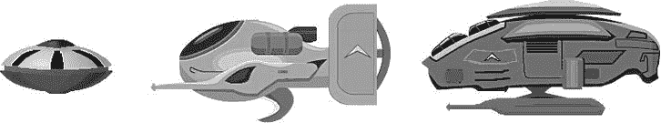

# 第 8 章：纵情射击

这类游戏最需要什么？可以击毁的目标和需要闪避的子弹。在本章中，你将为游戏添加敌人，甚至还有一个 Boss 怪物。

敌人和玩家都将使用新的 `BulletCache` 类，从同一个对象池中发射各种子弹。缓存类会重用非活跃的子弹，避免在内存中反复分配和释放子弹。同样，敌人也会使用自己的 `EnemyCache` 类，因为它们也会在屏幕上大量出现。

显然，玩家将能够射击这些敌人。我还引入了基于组件编程的概念，这让你能够以模块化的方式扩展游戏中的角色。除了射击和移动组件之外，你还会为 Boss 怪物创建一个生命条组件。毕竟，Boss 怪物不应该被一枪秒杀，而是需要命中多次才能被摧毁。

## 添加 `BulletCache` 类

`BulletCache` 类是在 `ShootEmUp01` 项目中创建新子弹的一站式服务。以前所有这些代码都在 `GameLayer` 类中，但管理和创建新子弹不应该是 `GameLayer` 的职责。代码清单 8-1 展示了新的 `BulletCache` 头文件，它现在包含了 `CCSpriteBatchNode` 和非活跃子弹计数器。

**代码清单 8-1.**  `BulletCache` 类的 `@interface`

```
#import <Foundation/Foundation.h>
#import "cocos2d.h"

@interface BulletCache : CCNode
{
    CCSpriteBatchNode* batch;
    NSUInteger nextInactiveBullet;
}

-(void) shootBulletFrom:(CGPoint)startPosition
                velocity:(CGPoint)velocity
                frameName:(NSString*)frameName;
@end
```

要将子弹射击代码从 `GameLayer` 类中重构出来，你需要把初始化代码和射击子弹的方法都移动到新的 `BulletCache` 类中。

因此，从 `GameLayer` 类中移除 `shootBulletFromShip：(Ship*)ship` 方法的声明和实现。同时从接口中移除 `nextInactiveBullet` 实例变量，并像代码清单 8-2 所示那样，从 `init` 方法中移除子弹初始化代码。所有这些代码都会被移动到新的 `BulletCache` 类中，其实现见代码清单 8-4。

**代码清单 8-2.**  从 `GameLayer` 类的 `init` 方法中移除以下代码

```
// 现在使用纹理图集中的图片。
CCSpriteFrame* bulletFrame = [[CCSpriteFrameCache sharedSpriteFrameCache] spriteFrameByName:@"bullet.png"];
CCSpriteBatchNode* batch = [CCSpriteBatchNode batchNodeWithTexture:bulletFrame.texture];
[self addChild:batch z:1 tag:GameSceneNodeTagBulletSpriteBatch];

// 预先创建一批子弹，并在需要时重复使用。
for (int i = 0; i < 400; i++)
{
    Bullet* bullet = [Bullet bullet];
    bullet.visible = NO;
    [batch addChild:bullet];
}

// 每隔一段时间调用子弹计数器
[self schedule:@selector(countBullets:) interval:3];

BulletCache* bulletCache = [BulletCache node];
[self addChild:bulletCache z:1 tag:GameSceneNodeTagBulletCache];
```

然后，你应当在代码清单 8-2 中移除代码的位置，添加 `BulletCache` 类的初始化代码，并在 `GameLayer.m` 实现文件的顶部导入 `BulletCache.h` 头文件。

**代码清单 8-3.**  导入 `BulletCache` 头文件，并将 `BulletCache` 初始化代码添加到 `init` 方法中

```
#import "BulletCache.h"

. . .

-(id) init
{
    if ((self = [super init]))
    {
        . . .

        BulletCache* bulletCache = [BulletCache node];
        [self addChild:bulletCache z:1 tag:GameSceneNodeTagBulletCache];
    }
    return self;
}
```

你还必须在 `GameLayer.h` 文件的 `GameSceneNodeTags enum` 中添加 `GameSceneNodeTagBulletCache`，并且需要添加一个 `bulletCache` 访问器方法，以便其他类可以通过 `GameLayer` 访问 `BulletCache` 实例。你可以将此方法添加到 `defaultShip` 方法旁边：

```
-(BulletCache*) bulletCache
{
    CCNode* node = [self getChildByTag:GameSceneNodeTagBulletCache];
    NSAssert([node isKindOfClass:[BulletCache class]], @"不是 BulletCache");
    return (BulletCache*)node;
}
```

最后，这是重构后的 `GameLayer` 接口，并高亮显示了更改之处。最值得注意的是，添加了 `BulletCache` 类的 `@class` 前置声明，并且 `defaultShip` 和 `bulletCache` 这两个访问器方法都被声明为属性，因此从现在开始，您也可以使用点语法来访问它们。

```
. . .
@class Ship;
@class BulletCache;

@interface GameLayer : CCLayer
{
}

@property (readonly) Ship* defaultShip;
@property (readonly) BulletCache* bulletCache;

+(id) scene;
+(GameLayer*) sharedGameLayer;
-(CCSpriteBatchNode*) bulletSpriteBatch;
@end
```

对于新的 `BulletCache` 类，我决定将 `CCSpriteBatchNode` 保存在一个成员变量中，而不是每次需要精灵批处理对象时都使用 `CCNode getChildByTag` 方法。这是一个微小的性能优化。因为你会将 `BulletCache` 类作为子节点添加到 `GameLayer`，所以你可以简单地将精灵批处理节点添加到 `BulletCache` 类。

**注意：** 通过添加一个像 `BulletCache` 这样的中间 `CCNode` 来增加场景层级深度，几乎没有什么坏处。如果你担心场景层级深度，另一种方法是像往常一样将精灵批处理节点添加到 `GameLayer` 类，并在 `BulletCache` 类中使用访问器方法来获取精灵批处理节点。但是额外的函数调用开销可能会抵消任何性能提升。如有疑问，始终优先使代码更具可读性，然后在必要时（且仅在必要时）重构代码以提升性能。并且不要仅基于假设就进行性能优化。在进行所谓的性能提升更改前后，一定要测量实际性能！

**代码清单 8-4.**  `BulletCache` 维护一个子弹对象池以供重用

```
#import "BulletCache.h"
#import "Bullet.h"

@implementation BulletCache

-(id) init
{
    if ((self = [super init]))
    {
        // 从正在使用的纹理图集中获取任意子弹图片
        CCSpriteFrame* bulletFrame = [[CCSpriteFrameCache sharedSpriteFrameCache] 
        spriteFrameByName:@"bullet.png"];

        // 使用子弹的纹理
        batch = [CCSpriteBatchNode batchNodeWithTexture:bulletFrame.texture];
        [self addChild:batch];

        // 预先创建一批子弹并重复使用
        for (int i = 0; i < 200; i++)
        {
            Bullet* bullet = [Bullet bullet];
            bullet.visible = NO;
            [batch addChild:bullet];
        }
    }

    return self;
}

-(void) shootBulletFrom:(CGPoint)startPosition
        velocity:(CGPoint)velocity
        frameName:(NSString*)frameName
{
    CCArray* bullets = batch.children;
    CCNode* node = [bullets objectAtIndex:nextInactiveBullet];
    NSAssert([node isKindOfClass:[Bullet class]], @"不是子弹!");
```


好的，作为一名高级文档工程师和翻译员，我将严格遵循您提供的注意事项和示例格式，对给定的英文文本进行专业翻译。


```objectivec
Bullet* bullet = (Bullet*)node;
    [bullet shootBulletFrom:startPosition velocity:velocity frameName:frameName];

nextInactiveBullet++;
    if (nextInactiveBullet > = bullets.count)
    {
        nextInactiveBullet = 0;
    }
}
@end
```

如您所见，`shootBulletFrom` 方法的改动最大。现在它接受三个参数——`startPosition`、`velocity` 和 `frameName`——而不是一个指向 `Ship` 类的指针。然后，它会将这些参数传递给 `Bullet` 类的 `shootBulletFrom` 方法，这个方法我也进行了重构。这是替代原始 `shootBulletFrom` 方法的新实现：

```objectivec
-(void) shootBulletFrom:(CGPoint)startPosition
     velocity:(CGPoint)vel
     frameName:(NSString*)frameName
{
    self.velocity = vel;
    self.position = startPosition;
    self.visible = YES;

// change the bullet's texture by setting a different SpriteFrame to be displayed
    CCSpriteFrame* frame = [[CCSpriteFrameCache sharedSpriteFrameCache]←
     spriteFrameByName:frameName];
    [self setDisplayFrame:frame];

[self unscheduleUpdate];
    [self scheduleUpdate];
}
```

你还需要在 `Bullet.h` 接口中替换方法声明。这毫不意外：

```objectivec
-(void) shootBulletFrom:(CGPoint)startPosition
            velocity:(CGPoint)vel
          frameName:(NSString*)frameName;
```

`velocity` 和 `position` 现在都直接分配给子弹。这意味着调用 `shootBulletFrom` 方法的代码必须确定子弹的位置、方向和速度。这正是你想要的：发射子弹的完全灵活性，包括通过使用 `setDisplayFrame` 方法来更改子弹的精灵帧。因为所有子弹都在同一个纹理图集中，使用同一个纹理，所以更改显示的子弹只需设置所需的精灵帧即可。实际上，这仅仅是渲染了纹理的不同部分，而且没有额外的性能开销。

在 `Bullet` 类中，我还修复了子弹可能存在的边界问题——即之前只有移动到屏幕右侧之外的子弹才会被设置为不可见并放回等待列表。通过在 `update` 方法中使用 `CGRectIntersectsRect` 检查子弹的 `boundingBox` 和 `screenRect`，任何完全移出屏幕区域的子弹都将被标记为可重用。**代码清单 8-5** 展示了 `Bullet` 类的改进版 `init` 和 `update` 方法。

**代码清单 8-5.**  修改 `Bullet` 类代码以检测子弹是否离开屏幕

```objectivec
static CGRect screenRect;
-(id) initWithBulletImage
{
    if ((self = [super initWithSpriteFrameName:@"bullet.png"]))
    {
        // make sure to initialize the screen rect only once
        if (CGRectIsEmpty(screenRect))
        {
        CGSize screenSize = [CCDirector sharedDirector].winSize;
        screenRect = CGRectMake(0, 0, screenSize.width, screenSize.height);
        }
    }
    return self;
}

. . .

-(void) update:(ccTime)delta
{
    self.position = ccpAdd(self.position, ccpMult(velocity, delta));

// When the bullet leaves the screen, make it invisible
    CGSize screenSize = [CCDirector sharedDirector].winSize;
    CGRect screenRect = CGRectMake(0, 0, screenSize.width, screenSize.height);
    if (CGRectIntersectsRect(self.boundingBox, screenRect) == NO)
    {
        self.visible = NO;
        [self unscheduleUpdate];
    }
}
```

为了方便和性能考虑，`screenRect` 变量现在存储为一个静态变量，这样 `Bullet` 类的其他实例也可以访问它，并且无需为每次使用都重新创建。像 `screenRect` 这样的静态变量可以在声明它们的类实现文件中使用。它们就像是类的全局变量；任何类实例都可以读取和修改该变量，这与类成员变量（每个类实例的局部变量）相反。由于游戏过程中屏幕大小从不改变，并且所有 `Bullet` 实例都需要使用此变量，因此将其存储在静态变量中供所有类实例使用是合理的。第一个被初始化的子弹会设置 `screenRect` 变量。`CGRectIsEmpty` 方法会检查 `screenRect` 变量是否仍未初始化；因为该变量是静态的，所以它只需要被初始化一次。

实际上，`screenRect` 对其他类也很有用，因此将其移动到可以从其他类访问的地方可能是个好主意。一种方法是向 `GameLayer` 类添加一个属性。你将与 **代码清单 8-5** 中相同的 `init` 代码添加到 `GameLayer init` 方法中，并添加一个返回同名静态变量的方法：

```objectivec
static CGRect screenRect;
-(CGRect) screenRect
{
    return screenRect;
}
```

并且，在 `GameLayer` 的接口中为 `screenRect` 添加 `readonly` 属性声明：

```objectivec
@property (readonly) CGRect screenRect;
```

顺便提一下，`screenRect` 是静态变量还是 `GameLayer` 类的实例变量，在这个例子中并无区别。你现在可以在其他类中导入 `GameLayer.h` 头文件，并通过以下方式访问 `screenRect`：

```objectivec
CGRect rect = [GameLayer sharedGameLayer].screenRect;
```

`InputLayer` 现在可以使用新的 `BulletCache` 类来发射玩家的子弹。子弹的属性，如起始位置、速度和要使用的精灵帧，现在由 **代码清单 8-6** 中 `InputLayer` 的 `update` 方法内的发射代码传递。

**代码清单 8-6.**  修改 `InputLayer` 类，让 `BulletCache` 类处理所有操作

```objectivec
#import"BulletCache.h"

. . .

-(void) update:(ccTime)delta
{
    totalTime + = delta;

GameLayer* game = [GameLayer sharedGameLayer];
    Ship* ship = game.defaultShip;
    BulletCache* bulletCache = game.bulletCache;

if (fireButton.active && totalTime > nextShotTime)
    {
        nextShotTime = totalTime + 0.4f;

// Set the position, velocity and spriteframe before shooting
        CGPoint shotPos = CGPointMake(ship.position.x + 45, ship.position.y - 19);

float spread = (CCRANDOM_0_1() - 0.5f) * 0.5f;
        CGPoint velocity = CGPointMake(200, spread * 50);
        [bulletCache shootBulletFrom:shotPos velocity:velocity frameName:@"bullet.png"];
    }

// Allow faster shooting by quickly tapping the fire button.
    if (fireButton.active == NO)
    {
        nextShotTime = 0;
    }

CGPoint velocity = ccpMult(joystick.velocity, 7000 * delta);
    ship.position = CGPointMake(ship.position.x + velocity.x * delta,
                                 ship.position.y + velocity.y * delta);
}
```

这个简短的重构过程为发射子弹增加了急需的灵活性。我相信你可以想象，敌人现在也可以使用完全相同的代码来发射它们自己的子弹了。

## 让我们制造一些敌人

在这一点上，也许你对敌人是什么、它们做什么以及它们的行为会是什么样子，只有一个模糊的概念。这就是敌人的特点——你永远不太清楚它们在打什么算盘。


### 游戏敌人设计：从规划到实现

在游戏开发中，这意味着需要回到绘图板，规划你希望敌人执行的行为，然后从该规划中推导出需要编程的内容。与现实生活相反，你可以完全控制敌人。这难道不让你感到强大吗？但在你或任何人能够享受乐趣之前，你需要制定一个统治世界的计划。

我已经为三种不同类型的敌人创建了图形。目前，我只知道其中至少有一个应该是 Boss 怪物。请查看图 8-1，并尝试想象这些敌人可能做什么。



图 8-1。用作游戏敌人角色的图形

在开始编程之前，你应该清楚了解敌人将具有哪些共同行为，这样你只需编写一次这些部分的代码。消除代码重复是干净代码设计最重要的目标。

让我们看看我们确定所有敌人共有的行为：

*   射击子弹
*   拥有决定何时、何处以及射击何种子弹的逻辑
*   可以被玩家子弹击中
*   不能被其他敌人的子弹击中
*   可以承受一次或多次攻击（拥有生命值）
*   具有特定的行为和移动模式
*   在被摧毁时具有特定的行为或动画
*   将出现在屏幕外区域并移入屏幕内
*   一旦进入屏幕后不会离开屏幕区域

当你查看此列表时，你可能会注意到其中一些属性也适用于玩家的飞船。它当然可以射击子弹，我们可能希望它能承受多次攻击，并且在被摧毁时应有特定的行为或动画。将玩家的飞船视为一种特殊类型的敌人并将其考虑在内是合理的。

查看这个功能集，我看到了三种可能的方法。你可以创建一个包含飞船、敌人和 Boss 怪物所有代码的类。代码的某些部分将根据敌人类型有条件地运行。例如，射击代码可能为每种类型的游戏对象有不同的代码路径。对于有限数量的不同对象，这种方法运行得相当好——但它无法扩展。随着你添加越来越多的游戏对象类型，最终你会得到一个越来越庞大、包含所有游戏逻辑代码的类。对该类任何部分的任何更改都有可能对敌人甚至玩家飞船的行为产生不良的副作用。根据类型变量确定执行哪个代码路径，这相当类似于纯 C 语言编程，并没有利用 `Objective-C` 的面向对象特性。但如果使用得当，即使在今天，它也是一个非常强大的概念。

第二种方法是创建一个类层次结构，以 `Entity` 类作为基类，然后从中派生飞船、两个怪物和一个 Boss 怪物类。这实际上是很多程序员的做法，对于少量游戏对象来说也运行得相当好。但实质上，它与第一种方法差别不大，因为当某些子类（而非所有子类）需要时，公共代码通常最终会堆积在基类 `Entity` 中。一旦 `Entity` 类中的代码开始根据敌人类型添加开关（`switch`），以跳过部分代码或执行特定于该敌人类型的代码路径，情况就会变得更糟。这与第一种 C 风格编程方法的问题相同。稍加注意，你可以确保特定于敌人的代码属于该敌人的类，但很容易最终导致大多数更改都在 `Entity` 类本身中进行。

第三种方法是使用组件系统，也称为*组合*或*聚合*。这意味着将各个代码路径与类层次结构分离，只将它们添加到需要这些组件的子类中，例如生命值条组件。由于基于组件的开发本身就可以写成一本单独的书籍，并且对于像这个射击游戏这样的小项目来说可能过于复杂，因此你将结合使用类层次结构方法和组件设计，至少让你了解如何从各个部分组成游戏对象以及这样做的优势。

我想指出的是，没有一种最好的代码设计方法。某些选择完全是主观的，取决于个人偏好和经验。如果你愿意在学习制作游戏的过程中经常重构代码库，那么可工作的代码通常比干净的代码更可取。经验让你能够在规划阶段就提前做出更多此类决策，并让你能够更快地创建更复杂的游戏。所以，如果这是你的目标，请从制作并完成较小的游戏开始，然后慢慢将你自己推向新的极限和新的挑战。这是一个学习过程，不幸的是，扼杀你动力的最简单方法就是过于雄心勃勃。每个经验丰富的游戏程序员都会告诉初学者从简单开始，并首先重制像《俄罗斯方块》、《吃豆人》或《爆破彗星》这样的经典街机游戏，这是有原因的。

**提示** 关于初学者的热情：拥有它是好事。你会需要它！但也要对你的期望以及你独自或与一个非常小的团队能够完成的事情保持现实。网站“Your Game Idea Is Too Big”提供了一种非常简单、有趣且发人深省的方法，来确保你的游戏创意保持现实。测试自己：`http://yourgameideaistoobig.com`。不要错过底部的“但是...”链接，那里有极好的和鼓舞人心的建议。

## Enemy 类

无论是为每种敌人类型创建一个类，还是将所有敌人代码写在一个类中，这在很大程度上取决于敌人的数量。通常这两种方法都不理想，因为许多类可能意味着大量重复代码或一个深层次的类层次结构。然而，将所有敌人代码放在一个类中，则很容易使该类臃肿不堪，使用起来非常麻烦，尤其是当敌人具有非常多样化的能力时。如我稍后将解释的，使用组件来扩展和修改类是解决这个问题的一种方法。现在，由于只有三种敌人类型，并且它们的行为差异不大，因此一个单独的类就足够了。

在 `ShootEmUp02` 项目中引入的 `Enemy` 类，为了简单起见，它派生自 `CCSprite`，这将使其更易于处理精灵批处理。并且它为应该控制的三种敌人类型声明了一个 `enum`。头文件中的接口如代码清单 8-7 所示。

***代码清单 8-7.***`Enemy` 类的 `@interface`

```
#import <Foundation/Foundation.h>
#import "cocos2d.h"

typedef enum
{
    EnemyTypeUFO = 0,
    EnemyTypeCruiser,
    EnemyTypeBoss,

EnemyType_MAX,
} EnemyTypes;

@interface Enemy : CCSprite
{
    EnemyTypes type;
    int initialHitPoints;
    int hitPoints;
}

@property (readonly, nonatomic) int initialHitPoints;
@property (readonly, nonatomic) int hitPoints;

+(id) enemyWithType:(EnemyTypes)enemyType;
+(int) getSpawnFrequencyForEnemyType:(EnemyTypes)enemyType;
-(void) spawn;
@end
```

这里没有什么特别令人兴奋的。`EnemyTypes` `enum` 用于区分当前支持的三种不同类型的敌人，`EnemyType_MAX` 用作循环的上限，你很快就会看到。`Enemy` 类有一个存储类型的成员变量，以便你可以根据需要，使用 `switch` 语句根据敌人类型来分支代码。


`Enemy`的实现包含了许多值得讨论的代码，因此我将把讨论分成几个主题，只呈现相关的代码。我们首先从代码清单 8-8 中的`initWithType`方法开始。

***代码清单 8-8.*** 用类型初始化`Enemy`对象

```
#import "Enemy.h"
#import "GameLayer.h"
#import "StandardMoveComponent.h"
#import "StandardShootComponent.h"

. . .

@synthesize initialHitPoints, hitPoints;

-(id) initWithType:(EnemyTypes)enemyType
{

type = enemyType;

NSString* enemyFrameName;
    NSString* bulletFrameName;
    float shootFrequency = 6.0f;
    initialHitPoints = 1;

switch (type)
    {
        case EnemyTypeUFO:
            enemyFrameName = @"monster-a.png";
            bulletFrameName = @"shot-a.png";
            break;
        case EnemyTypeCruiser:
            enemyFrameName = @"monster-b.png";
            bulletFrameName = @"shot-b.png";
            shootFrequency = 1.0f;
            initialHitPoints = 3;
            break;
        case EnemyTypeBoss:
            enemyFrameName = @"monster-c.png";
            bulletFrameName = @"shot-c.png";
            shootFrequency = 2.0f;
            initialHitPoints = 15;
            break;

default:
            [NSException exceptionWithName:@"Enemy Exception"
                                reason:@"unhandled enemy type"
            userInfo:nil];
    }

self = [super initWithSpriteFrameName:enemyFrameName];
    if (self)
    {
            // Create the game logic components
            [self addChild:[StandardMoveComponent node]];

StandardShootComponent* shootComponent = [StandardShootComponent node];
            shootComponent.shootFrequency = shootFrequency;
            shootComponent.bulletFrameName = bulletFrameName;
            [self addChild:shootComponent];

// enemies start invisible
            self.visible = NO;

[self initSpawnFrequency];
    }
    return self;
}

+(id) enemyWithType:(EnemyTypes)enemyType
{
    return [[self alloc] initWithType:enemyType];
}
```

代码首先根据敌人类型，使用`switch`语句来设置变量，为每种类型的敌人提供默认值——使用的精灵帧名称、子弹精灵帧名称以及射击频率。`switch`语句的`default`分支会抛出一个异常，因为通常情况下，这种情况是由于向`EnemyTypes enum`添加了新的敌人类型，却没有相应地扩展此`switch`语句所致。以这种方式保护你的`switch`语句，确保不接受任何`default`分支的情况，是一个很好的策略，可以避免将大量调试时间浪费在简单的人为错误上。毕竟，你是人类，对吧？所以你很容易忘记这些事情。我知道我就是。与其疑惑你的新敌人为什么不动或发射错误的子弹，不如让它崩溃，并挥舞着大红旗说：“嘿，你忘了更新我！”

在赋值给`self`之前运行代码也完全没问题，只要最终没有忘记调用`[super init. . .]`方法即可。否则，父类将无法正确初始化，这可能导致奇怪的错误和崩溃。

创建并添加到`Enemy`中的组件类包含可复用的代码，用于扩展敌人的行为和外观。我很快就会讲到组件；现在，你只需要知道`StandardMoveComponent`类能让敌人移动，而`StandardShootComponent`类则允许敌人——你猜对了——进行射击。必要的`import`语句位于代码清单 8-8 的开头。

现在，请将注意力集中在`Enemy`类中的`initSpawnFrequency`方法上。相关代码如代码清单 8-9 所示。

***代码清单 8-9.*** 控制敌人的生成

```
staticNSMutableArray* spawnFrequency = nil;

-(void) initSpawnFrequency
{
    // initialize how frequently the enemies will spawn
    if (spawnFrequency == nil)
    {
        spawnFrequency = [NSMutableArray arrayWithCapacity:EnemyType_MAX];
        [spawnFrequency insertObject:[NSNumber numberWithInt:80]
                                                     atIndex:EnemyTypeUFO];
        [spawnFrequency insertObject:[NSNumber numberWithInt:260]
                                                     atIndex:EnemyTypeCruiser];
        [spawnFrequency insertObject:[NSNumber numberWithInt:1500]
                                                     atIndex:EnemyTypeBoss];

// spawn one enemy immediately
        [self spawn];
    }
}

+(int) getSpawnFrequencyForEnemyType:(EnemyTypes)enemyType
{
    NSAssert(enemyType < EnemyType_MAX, @"invalid enemy type");
    NSNumber* number = [spawnFrequency objectAtIndex:enemyType];
    return number.intValue;
}
```

你将每种敌人类型的生成频率值存储在一个静态的`spawnFrequency NSMutableArray`中。它是一个静态变量，因为生成频率不是每个敌人需要的，而是每种敌人类型需要的。第一个执行`initSpawnFrequency`方法的`Enemy`实例会发现`spawnFrequency NSMutableArray`为`nil`，并因此初始化它。

因为`NSMutableArray`只能存储对象，不能存储像整数这样的原始数据类型，所以必须使用`numberWithInt`初始化器将这些值包装到`NSNumber`类中。我选择在这里使用`insertObject`而不是`addObject`，因为它不仅确保了这些值的索引与`enum`中定义的敌人类型相同，同时也告诉任何查看此代码的其他程序员，这里使用的索引是有含义的。在这种情况下，索引与敌人类型是同义词。尽管从技术角度来说，在此指定索引并非必要，但它有助于表明哪个值用于哪种敌人类型。

因为你使用了`ARC`，所以无需考虑释放`spawnFrequency`数组的内存。当它不再被使用时，其内存会被释放。对于静态变量来说，这发生在应用程序关闭时。

**注意** 这让我想起了一个关于内存泄漏的误解——事实上，当一个`iOS`应用发生内存泄漏时，该应用的可用空闲内存就会减少，仅此而已。但当应用程序终止或被系统终止时，`iOS`会释放该应用曾经使用的所有内存，无论是否泄漏。这种行为与桌面操作系统不同。如果泄漏内存的应用已被终止，`iOS`应用中的内存泄漏不会影响其他应用，也不会减少其他应用的可用内存。

重启设备有助于释放内存的原因，要么是`iOS`本身的内存泄漏，要么是`iOS`作为应用与`iOS`交互的一部分，加载了额外的子系统并产生了新的进程。

你可以使用`spawn`方法来生成一个敌人：

```
-(void) spawn
{
    // Select a spawn location just outside the right side of the screen
    CGSize screenSize = [CCDirector sharedDirector].winSize;
    CGSize spriteSize = self.contentSize;
    float xPos = screenSize.width + spriteSize.width * 0.5f;
    float yPos = CCRANDOM_0_1() * (screenSize.height - spriteSize.height) + ←
     spriteSize.height * 0.5f;
    self.position = CGPointMake(xPos, yPos);

// reset health
    hitPoints = initialHitPoints;

// Finally set yourself to be visible, this also f lag the enemy as "in use"
    self.visible = YES;
}
```

因为使用`EnemyCache`预先创建了所有的敌人实例，所以整个生成过程仅限于在屏幕右侧外部选择一个随机的`y`位置，然后将`Enemy`精灵设置为可见。`visible`状态在项目其他地方使用，尤其是在组件类中，用于确定`Enemy`当前是否正在使用。如果它不可见，那么就可以生成它使其可见，但它只应该在可见时运行其游戏逻辑代码。

### EnemyCache 类


