# 第 9 章：粒子效果

为了创建特殊的视觉效果，游戏程序员经常使用粒子系统。*粒子系统*的工作方式是发射大量微小粒子并高效渲染——其效率远高于将它们作为精灵来渲染。这让你能够模拟诸如雨、火、雪、爆炸、尾迹等多种效果。

粒子系统由大量属性驱动。*大量*在这里指大约 30 个属性，它们不仅影响单个粒子的外观和行为，还影响整个粒子效果。*粒子效果*是所有粒子协同工作以创造特定视觉结果的整体。一个粒子无法构成火焰效果；十个也远远不够。你需要几十个甚至上百个粒子以恰当的方式协同工作，才能创造出火焰效果。

创建令人信服的粒子效果是一个反复试验的过程。在源代码中尝试各种属性，通过编译游戏来调整粒子系统，查看效果，然后修改并重复这个过程，至少可以说是非常繁琐的。这时，粒子设计工具就派上用场了，我正好知道一个合适的工具：它叫做 **Particle Designer**，在本章中我将解释它的工作原理。

## 粒子效果示例

Cocos2d 自带了一些内置的粒子效果，它们能让你很好地了解能产生哪些类型的效果。你可以将它们作为游戏中的占位符使用，或者如果你只想做一些微小的调整，也可以继承并修改 `CCParticleExamples.m` 文件中定义的示例。它们的好处在于你不需要任何外部帮助；你可以像创建简单的 `CCNode` 对象一样创建这些示例粒子效果。事实上，它们确实派生自 `CCNode`。


我创建了一个名为`ParticleEffects01`的项目，它展示了所有 cocos2d 示例粒子效果。你可以通过快速点击屏幕来循环浏览这些示例，还能用手指拖动和移动它们。许多粒子效果一旦开始移动，就会呈现出完全不同的外观，如图 9-1 所示。看似只是一大团粒子的效果，如果正在移动，可能会很好地模拟引擎排气的效果。

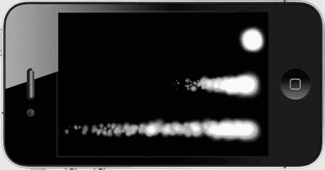

图 9-1 . 同一个粒子效果从上到下：静止、缓慢移动、快速移动

只有一种效果在启动后无法移动——像图 9-2 中所示的`CCParticleExplosion`这样的一次性效果。这种效果的特殊之处在于它会一次性发射所有粒子，并立即停止发射新粒子。所有其他粒子效果都是持续运行的，不断创建新粒子，同时移除那些超过生命周期的粒子。在这种情况下，挑战在于平衡屏幕上粒子的总数。

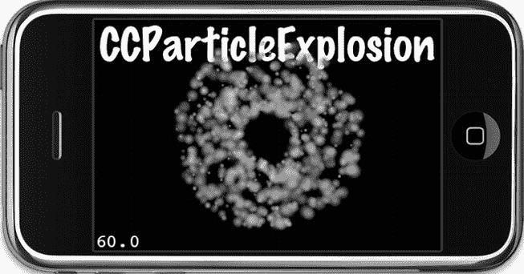

图 9-2 . `CCParticleExplosion`是 cocos2d 提供的一个示例效果

*列表 9-1*展示了`ParticleEffects01`示例项目中使用的相关方法。通过在`switch`语句中使用当前的`particleType`变量，可以创建相应的内置粒子效果。请注意，这里使用`CCParticleSystem`指针来存储粒子，因此只需在`runEffect`方法的末尾使用一次`addChild`代码即可。每个示例粒子效果都派生自`CCParticleSystem`。

***列表 9-1*.** *使用内置效果*

```
-(void) runEffect
{
    // 移除之前的粒子效果
    [self removeChildByTag:1 cleanup:YES];

    CCParticleSystem* system;

    switch (particleType)
    {
        case ParticleTypeExplosion:
           system = [CCParticleExplosion node];
            break;
        case ParticleTypeFire:
           system = [CCParticleFire node];
           break;
        case ParticleTypeFireworks:
           system = [CCParticleFireworks node];
           break;
        case ParticleTypeFlower:
           system = [CCParticleFlower node];
           break;
        case ParticleTypeGalaxy:
           system = [CCParticleGalaxy node];
           break;
        case ParticleTypeMeteor:
           system = [CCParticleMeteor node];
           break;
        case ParticleTypeRain:
           system = [CCParticleRain node];
           break;
        case ParticleTypeSmoke:
           system = [CCParticleSmoke node];
           break;
        case ParticleTypeSnow:
           system = [CCParticleSnow node];
           break;
        case ParticleTypeSpiral:
           system = [CCParticleSpiral node];
           break;
        case ParticleTypeSun:
           system = [CCParticleSun node];
           break;

        default:
           // 什么都不做
           break;
    }

    CGSize winSize = [CCDirector sharedDirector].winSize;
    system.position = CGPointMake(winSize.width / 2, winSize.height / 2);

    [self addChild: system z:1 tag:1];

    [label setString:NSStringFromClass([system class])];
}

-(void) setNextParticleType
{
    particleType++;
    if (particleType == ParticleTypes_MAX)
    {
        particleType = 0;
    }
}
```

**注意** `NSStringFromClass`方法在这个示例中非常有用，它可以直接打印出类名，而无需输入数十个匹配的字符串。这是 Objective-C 语言很酷的运行时特性之一，你可以将类名作为字符串获取。如果你尝试在 C++中这样做，会很头疼。如果你想深入了解这个高级主题，或者只是想了解 Objective-C 在底层是如何工作的，Objective-C 运行时编程指南是一个很好的起点：`http://developer.apple.com/library/mac/#documentation/Cocoa/Conceptual/ObjCRuntimeGuide/Introduction/Introduction.html.`

对于游戏逻辑代码，`NSStringFromClass`及相关方法几乎不起作用，但它们是很有用的调试和日志记录工具。你可以在苹果的基础函数参考中找到这些方法的完整列表和描述：`http://developer.apple.com/mac/library/documentation/Cocoa/Reference/Foundation/Miscellaneous/Foundation_Functions/Reference/reference.html.`

如果你在自己的项目中使用了这些示例效果之一，你可能会惊讶地看到丑陋的方形像素。图 9-3 很清楚地展示了这种效果。这是因为所有内置粒子效果都试图加载一个名为`fire.png`的特定纹理，该纹理随`cocos2d-iphone`一起发布，位于`Resources/Images`文件夹中。即使没有纹理，只要粒子尺寸保持足够小，你仍然可以创建非常好的粒子效果。但要看到内置粒子效果的原本意图，你需要将`fire.png`图像添加到你的 Xcode 项目中。

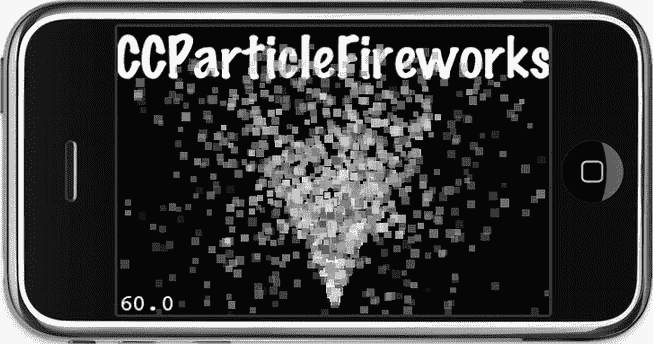

图 9-3 . 如果你的示例粒子效果（比如这个`CCParticleFireworks`）显示巨大的方形粒子，说明你忘记将`fire.png`图像添加到你的 Xcode 项目中

## 以艰难的方式创建粒子效果

你可以轻松地创建`CCParticleSystem`类的子类。但用其创建令人信服的粒子效果并不容易，更不用说接近你最初设想的效果了。以下是按功能分组、决定粒子系统外观和行为的属性列表：

*   `emitterMode` = `gravity`
    *   `sourcePosition`
    *   `gravity`
    *   `radialAccel`、`radialAccelVar`
    *   `speed`、`speedVar`
    *   `tangentialAccel`、`tangentialAccelVar`
*   `emitterMode` = `radius`
    *   `startRadius`、`startRadiusVar`、`endRadius`、`endRadiusVar`
    *   `rotatePerSecond`、`rotatePerSecondVar`
*   `duration`
*   `posVar`
*   `positionType`
*   `startSize`、`startSizeVar`、`endSize`、`endSizeVar`
*   `angle`、`angleVar`
*   `life`、`lifeVar`
*   `emissionRate`
*   `startColor`、`startColorVar`、`endColor`、`endColorVar`
*   `blendFunc`、`blendAdditive`
*   `texture`

可以想象，这里有很多需要调整的地方，这也是达成目标的主要问题：你需要重建并运行项目才能看到更改的效果。当你稍后读到粒子设计师这个部分时，你会了解它如何极大地简化了新粒子效果的创建过程。

现在，你先以艰难的方式开始，从头开始了解 cocos2d 粒子系统的工作方式。要从零开始编写一个粒子效果，首先要学习如何创建`CCParticleSystem`类的子类以及如何初始化它。接下来是对粒子系统属性的详细描述。

## 子类化`CCParticleSystem`

要在没有粒子设计师的情况下创建自己的粒子效果，你应该从`CCParticleSystemQuad`进行子类化。四元粒子系统不仅比`CCParticleSystem`更快，还可以进行批处理。使用`CCParticleBatchNode`类可以让你在屏幕上多次显示相同的效果，同时只使用一次绘制调用。


### 自定义粒子效果

在`ParticleEffects01`项目中，我创建了自定义粒子效果类`ParticleEffectSelfMade`。该类的接口见清单 9-2。

**清单 9-2.**  *继承自最优粒子系统类*

```objectivec
#import < Foundation/Foundation.h>
#import "cocos2d.h"

@interface ParticleEffectSelfMade : CCParticleSystemQuad
{
}
@end
```

现在，你将看到这个自定义粒子效果的实现，它使用了所有可用属性。我将尝试逐一解释每个属性，但更好的方式是亲自查看并实验这些参数，因此我鼓励你调整此项目中的属性。在`ParticleEffects01`项目（清单 9-3）中，你还会找到对每个参数的简要说明注释。

**清单 9-3.**  *手动设置粒子系统的属性*

```objectivec
#import "ParticleEffectSelfMade.h"

@implementation ParticleEffectSelfMade
-(id) init
{
    return [self initWithTotalParticles:250];
}

-(id) initWithTotalParticles:(int)numParticles
{
    self = [super initWithTotalParticles:numParticles];
    if (self)
    {
     self.duration = kCCParticleDurationInfinity;
     self.emitterMode = kCCParticleModeGravity;
     // 某些属性只能与特定的 emitterMode 一起使用！
     if (self.emitterMode == kCCParticleModeGravity)
     {
        self.sourcePosition = CGPointMake(−15, 0);
        self.gravity = CGPointMake(−50, -90);
        self.radialAccel = −90;
        self.radialAccelVar = 20;
        self.tangentialAccel = 120;
        self.tangentialAccelVar = 10;
        self.speed = 15;
        self.speedVar = 4;
     }
     else if (self.emitterMode == kCCParticleModeRadius)
     {
        self.startRadius = 100;
        self.startRadiusVar = 0;
        self.endRadius = 10;
        self.endRadiusVar = 0;
        self.rotatePerSecond = −180;
        self.rotatePerSecondVar = 0;
     }

self.position = CGPointZero;
     self.posVar = CGPointZero;
     self.positionType = kCCPositionTypeFree;

self.startSize = 40.0f;
     self.startSizeVar = 0.0f;
     self.endSize = kCCParticleStartSizeEqualToEndSize;
     self.endSizeVar = 0;

self.angle = 0;
     self.angleVar = 0;

self.life = 5.0f;
     self.lifeVar = 1.0f;

self.emissionRate = 30;
     self.totalParticles = 250;

startColor.r = 1.0f;
     startColor.g = 0.25f;
     startColor.b = 0.12f;
     startColor.a = 1.0f;
     startColorVar.r = 0.0f;
     startColorVar.g = 0.0f;
     startColorVar.b = 0.0f;
     startColorVar.a = 0.0f;
     endColor.r = 0.0f;
     endColor.g = 0.0f;
     endColor.b = 0.0f;
     endColor.a = 1.0f;
     endColorVar.r = 0.0f;
     endColorVar.g = 0.0f;
     endColorVar.b = 1.0f;
     endColorVar.a = 0.0f;

self.blendFunc = (ccBlendFunc){GL_SRC_ALPHA, GL_DST_ALPHA};
     // 或者使用此快捷方式将 blend func 设置为：GL_SRC_ALPHA, GL_ONE
     //self.blendAdditive = YES;

self.texture = [[CCTextureCache sharedTextureCache] addImage:@"fire.png"];
    }
    return self;
}
@end
```

## CCParticleSystem 属性

在清单 9-3 中，你会注意到代码之所以如此冗长，仅仅是因为可以初始化许多粒子系统属性。而且，大多数属性都需要设置为可接受的值，才能在屏幕上显示有意义的粒子效果。有些属性甚至是互斥的，不能同时使用。现在，我们来仔细看看这些粒子系统属性的实际作用。

### 方差属性

你会注意到许多属性都带有以`Var`为后缀的伴随属性。这些是方差属性，它们决定了对应属性允许的模糊范围。以`life` = `5`和`lifeVar` = `1`这两个属性为例。这些值意味着平均每个粒子会存活五秒。方差允许的范围是`5 – 1`到`5 + 1`。因此，每个粒子获得四到六秒之间的随机生命周期。

如果不需要任何变化，请将`Var`变量设置为`0`。方差正是粒子效果具有有机、模糊行为和外观的原因。但在设计新效果时，方差也可能造成混淆，因此除非你有一定经验，否则我建议从方差很小或没有方差的粒子效果开始。

### 粒子数量

现在，是时候从粒子效果中的粒子总数开始熟悉粒子了，这由`totalParticles`属性控制。`totalParticles`变量通常由`initWithTotalParticles`方法设置，但之后可以更改。粒子数量直接影响效果的外观和性能。

```objectivec
-(id) init
{
    return [self initWithTotalParticles:250];
}
```

使用太少的粒子，你不会得到漂亮的发光效果，但可能足以在玩家撞到墙上时，在玩家头顶撒上几颗星星。使用太多粒子也可能不是你想要的，因为许多粒子会叠加渲染并可能混合，最终你会得到一团白色。此外，使用太多粒子很容易让你的帧率下降。粒子设计器工具不允许创建超过`2000`个粒子的效果，这是有原因的。

**提示：** 通常，你应该力求用最少的粒子数达到期望效果。粒子大小也起着重要作用——单个粒子的尺寸越小，性能就越好。特别是在粒子效果中，在旧设备上测试非常重要，因为它们会对性能产生严重的负面影响。

### 发射器持续时间

`duration`属性决定了粒子将发射多长时间。如果设置为`2`，它将在两秒内创建新粒子，然后停止。就是这么简单：

```objectivec
self.duration = 2.0f;
```

如果你希望粒子系统停止发射粒子且最后一个粒子消失后，粒子效果节点自动从其父节点移除，请将`autoRemoveOnFinish`属性设置为`YES`：

```objectivec
self.autoRemoveOnFinish = YES;
```

`autoRemoveOnFinish`属性是一个便利功能，只有与不无限运行的粒子系统（如一次性爆炸效果）一起使用时才有意义。Cocos2d 定义了一个常量`kCCParticleDurationInfinity (等于: -1)`，用于无限运行的粒子效果。

```objectivec
self.duration = kCCParticleDurationInfinity;
```

大多数粒子效果是无限运行的，你只能通过将它们从节点层次结构中移除来停止它们。无限运行的粒子效果会忽略`autoRemoveOnFinish`属性。

### 发射器模式

有两种发射器模式：`gravity`和`radius`，由`emitterMode`属性控制。即使大多数参数相同，这两种模式也会产生根本不同的效果，比较图 9-4 和图 9-5 时你会看到这一点。两种模式都使用几个独占属性（参见清单 9-3），如果当前模式不支持，则不得设置这些属性；否则，你会从 cocos2d 收到如下运行时异常：

```
ParticleEffects[6332:207] *** Terminating app due to uncaught exception
     'NSInternalInconsistencyException', reason: 'Particle Mode should be Radius'
```

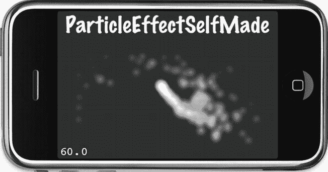


## ParticleEffectSelfMade

图 9-4——在重力模式下，来自 ParticleEffects01 项目的`ParticleEffectSelfMade`

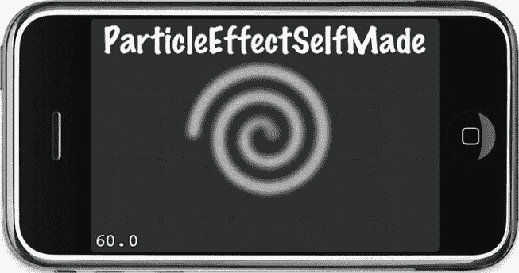

图 9-5——使用半径模式的同一个效果看起来完全不同。

### 发射器模式：重力模式

重力模式让粒子飞向或飞离一个中心点。它的优势在于能够实现非常动态、有机的效果。通过以下代码行设置重力模式：

```
self.emitterMode = kCCParticleModeGravity;
```

重力模式使用以下专属属性，这些属性只能在`emitterMode`设置为`kCCParticleModeGravity`时使用：

```
self.sourcePosition = CGPointMake(-15, 0);
self.gravity = CGPointMake(-50, -90);
self.radialAccel = -90;
self.radialAccelVar = 20;
self.tangentialAccel = 120;
self.tangentialAccelVar = 10;
self.speed = 15;
self.speedVar = 4;
```

`sourcePosition`决定了新粒子出现位置相对于节点位置的偏移量，以`CGPoint`表示。这个名称可能有些误导性，因为实际的重力中心是节点的位置，而`sourcePosition`是相对于该重力中心的偏移量。`gravity`属性则决定了粒子在`x`和`y`方向上的加速度。在此例中，负值表示重力会使粒子向左（-50）和向下（-90）加速。但这个加速度是相对于粒子节点位置的。由于粒子的初始`sourcePosition`偏移量为 -15（稍微偏左），它们会围绕粒子节点位置做逆时针运动。你可以在图 9-4 中看到这个效果，在 ParticleEffects01 项目中调整这些值有助于理解`sourcePosition`和`gravity`如何影响粒子的运动。

为了让重心发挥作用，粒子的重力不应过高，且`sourcePosition`的偏移量不宜过大。上述数值提供了一个良好的工作示例，你可以在此基础上进行调整。

`radialAccel`属性定义了粒子离开发射器越远时加速的快慢。该参数也可以为负值，使粒子在远离时减速。`tangentialAccel`属性与之类似，它让粒子绕发射器旋转，并随着远离而加速。负值使粒子顺时针旋转，正值则使其逆时针旋转。

`speed`属性应该相当直观——它只是粒子的速度。它没有特定的计量单位。图 9-4 展示了一个使用重力模式的粒子效果示例。粒子被粒子节点的位置吸引，并起始于粒子节点位置的左侧稍许，因此它们会进行逆时针的径向运动。

### 发射器模式：半径模式

半径模式使粒子沿圆周旋转。它还能让你创建螺旋效果，粒子既可以向内涌入，也可以向外旋转。通过以下代码行设置半径模式：

```
self.emitterMode = kCCParticleModeRadius;
```

与重力模式一样，半径模式也有专属属性。以下属性只能在`emitterMode`设置为`kCCParticleModeRadius`时使用：

```
self.startRadius = 100;
self.startRadiusVar = 0;
self.endRadius = 10;
self.endRadiusVar = 0;
self.rotatePerSecond = -180;
self.rotatePerSecondVar = 0;
```

`startRadius`属性决定了粒子将从距离粒子效果节点位置多远的地方发射。同样地，`endRadius`决定了粒子将旋转至距离节点位置的何处。如果你希望实现完美的圆环效果，可以使用以下常量将`endRadius`设置为与`startRadius`相同：

```
self.endRadius = kCCParticleStartRadiusEqualToEndRadius;
```

通过使用`rotatePerSecond`属性，你可以影响粒子的运动方向和速度，从而影响当`startRadius`和`endRadius`不同时，粒子绕行的圈数。

在图 9-4 中使用重力模式展示的同一个粒子效果，在图 9-5 中使用了半径模式，你会注意到它看起来有多么不同，尽管除了专属属性之外的所有其他属性都是相同的。要测试这一点，请在 ParticleEffects01 项目中取消注释以下代码行：

```
//self.emitterMode = kCCParticleModeRadius;
```

### 粒子位置

通过移动节点，你也就移动了效果。但效果还有一个`posVar`属性，它决定了新粒子产生位置的变化范围。默认情况下，两者都在节点的中心：

```
self.position = CGPointZero;
self.posVar = CGPointZero;
```

粒子位置一个非常重要的方面是：现有粒子是否应该相对于节点的移动而移动，或者根本不受节点位置的影响。例如，如果你有一个粒子效果，在你的玩家角色头部周围产生星星，你会希望星星在玩家移动时跟随玩家。你可以通过设置以下属性来实现这个效果：

```
self.positionType = kCCPositionTypeGrouped;
```

另一方面，如果你想让你的玩家着火，并希望粒子在玩家移动时产生类似尾迹的效果，你应该像这样设置`positionType`属性：

```
self.positionType = kCCPositionTypeFree;
```

自由运动最适合用于蒸汽、火焰、引擎排烟以及类似效果，这些效果会随着它们所附着的对象一起移动，并且应给人一种与发射这些粒子的对象没有连接的感觉。

### 粒子大小

粒子的大小以像素为单位，通过`startSize`和`endSize`属性设定，它们分别决定了粒子被发射时和被移除时的大小。粒子的大小会从`startSize`逐渐缩放至`endSize`。

```
self.startSize = 40.0f;
self.startSizeVar = 0.0f;
self.endSize = kCCParticleStartSizeEqualToEndSize;
self.endSizeVar = 0;
```

你可以使用常量`kCCParticleStartSizeEqualToEndSize`来确保粒子在其生命周期内大小不变。

### 粒子方向

你可以使用`angle`属性来设置粒子最初发射的方向，其单位是度，取值范围为 0 到 360。值为`0`表示粒子将向上发射，但这仅适用于重力`emitterMode`。在半径`emitterMode`中，`angle`属性决定了粒子将从`startRadius`上的哪个位置发射；值越大，发射点将沿半径逆时针移动。

```
self.angle = 0;
self.angleVar = 0;
```

### 粒子生命周期

粒子的生命周期决定了粒子从开始到结束需要多少秒，届时粒子将简单地淡出并消失。`life`属性设置了单个粒子的生命周期。请记住，粒子存活时间越长，在任何给定时刻屏幕上的粒子就越多。如果达到粒子总数上限，则不会生成新粒子，直到一些现有粒子消亡。

```
self.life = 5.0f;
self.lifeVar = 1.0f;
```

`emissionRate`属性直接影响每秒创建的粒子数量。它与`totalParticles`属性一起，对粒子效果的外观有很大影响。

```
self.emissionRate = 30;
self.totalParticles = 250;
```

通常，你需要平衡`emissionRate`，使其与粒子生命周期以及粒子效果中允许的`totalParticles`相匹配。你可以通过将`totalParticles`除以`life`，并将结果设置为`emissionRate`来实现：

```
self.emissionRate = self.totalParticles / self.life;
```


**提示** 调整粒子生命周期的时长、系统中允许的最大粒子总数以及 `emissionRate`，可以通过让粒子流因屏幕上的粒子数量限制而频繁中断，并结合相对较快的粒子发射速度，来创建爆发式效果。反之，如果观察到粒子流中出现不期望的间隙，则需要增加允许的粒子总数，或者（更推荐）减少粒子生命周期和/或发射率。在这种情况下，应使用 `emissionRate` = `totalParticles / life`。

### 粒子颜色

每个粒子都可以从起始颜色过渡到结束颜色，从而产生粒子效果闻名遐迩的鲜艳色彩。你至少需要在粒子效果中设置 `startColor`；否则，粒子可能完全不可见，因为默认颜色是黑色。颜色的类型为 `ccColor4F`，这是一个包含四个浮点成员的结构体：`r`、`g`、`b` 和 `a`，分别对应红色、绿色、蓝色以及决定颜色不透明度的 Alpha 通道。每个成员的值范围是从 0 到 1，其中 1 代表该颜色值满格。

如果你想要一个完全白色的粒子颜色，需要将所有四个成员（`r`、`g`、`b`、`a`）都设置为 `1`。如果你想要红色，只需将 `r` 和 `a` 值设置为 `1.0f`。如果你想要蓝色，则将 `b` 和 `a` 设置为 `1.0f`。请注意，`a` 值是颜色的 Alpha 透明度。如果你将其保留为默认值 `0.0f`，颜色将完全透明，因此不可见。

```
// startColor is mostly red and fully opaque
startColor.r = 1.0f;
startColor.g = 0.25f;
startColor.b = 0.12f;
startColor.a = 1.0f;
// startColor has no variance (plus/minus 0.0f)
startColorVar.r = 0.0f;
startColorVar.g = 0.0f;
startColorVar.b = 0.0f;
startColorVar.a = 0.0f;
// endColor is a fully opaque black color
endColor.r = 0.0f;
endColor.g = 0.0f;
endColor.b = 0.0f;
endColor.a = 1.0f;
// endColorVar specifies a full variance range for color blue
// the end of lifetime color of a particle will be randomly between black and blue
endColorVar.r = 0.0f;
endColorVar.g = 0.0f;
endColorVar.b = 1.0f;
endColorVar.a = 0.0f;
```

### 粒子混合模式

*混合*指的是粒子像素在显示到屏幕之前所经历的计算过程。属性 `blendFunc` 接受一个 `ccBlendFunc` 结构体作为输入，该结构体提供了源和目标混合模式：

```
self.blendFunc = (ccBlendFunc){GL_SRC_ALPHA, GL_DST_ALPHA};
```

混合的工作原理是，在渲染粒子时，将源图像（粒子）的红色、绿色、蓝色和 Alpha 值与屏幕上已有图像的相应颜色进行混合。实际上，粒子会以特定方式与其背景混合，而 `blendFunc` 决定了源图像有多少颜色以及哪些颜色，与背景的多少颜色以及哪些颜色进行混合。

屏幕最终像素颜色的计算公式如下：

```
(source color * source blend function) + (destination color * destination blend function)
```

假设示例中的源像素 RGB 值为 (0.1， 0.2， 0.3)，目标像素 RGB 值为 (0.4， 0.5， 0.6)。两个颜色值都乘以混合函数，最简单的就是 `GL_ONE`，它等于 1.0。这意味着最终像素的颜色将如下所示：

```
(0.1 * 1 + 0.4 * 1, 0.2 * 1 + 0.5 * 1, 0.3 * 1 + 0.6 * 1) = (0.5, 0.7, 0.9)
```

`blendFunc` 属性对粒子的显示效果有着深远的影响。通过组合使用下述源和目标混合模式，你可以创造出相当奇特的效果，也可能仅仅导致效果渲染为黑色方块。这为实验提供了广阔的空间。

*   `GL_ZERO`
*   `GL_ONE`
*   `GL_SRC_COLOR`
*   `GL_ONE_MINUS_SRC_COLOR`
*   `GL_SRC_ALPHA`
*   `GL_ONE_MINUS_SRC_ALPHA`
*   `GL_DST_ALPHA`
*   `GL_ONE_MINUS_DST_ALPHA`

你可以在 OpenGL ES 文档（位于 `www.khronos.org/opengles/documentation/opengles1_0/html/glBlendFunc.html`）中找到更多关于 OpenGL 混合模式以及混合计算细节的信息。

**提示** 由于很难想象哪些混合函数会与哪些图像组合产生怎样的结果，我想向你推荐一篇文章，该文章通过示例图像描述了最常见的混合操作：`www.machwerx.com/2009/02/11/glblendfunc/`。

更有趣的是 Anders Riggelsen 开发的 Visual glBlendFunc 工具：`www.andersriggelsen.dk/OpenGL/`。在任何支持 HTML5 的浏览器中，你都可以使用各种图像和混合函数进行尝试，并即时查看结果。请注意，你也可以修改其他 cocos2d 节点的 `blendFunc` 属性，即所有遵循 `CCBlendProtocol` 协议的节点，例如 `CCSprite`、`CCSpriteBatchNode`、`CCLabelTTF`、`CCLayerColor` 和 `CCLayerGradient` 等类。

源和目标混合模式 `GL_SRC_ALPHA` 与 `GL_ONE` 经常组合使用以创建加法混合，从而在多个粒子相互叠加绘制时产生非常明亮甚至白色的颜色：

```
self.blendFunc = (ccBlendFunc){GL_SRC_ALPHA, GL_ONE};
```

或者，你可以简单地将 `blendAdditive` 属性设置为 `YES`，这与将 `blendFunc` 设置为 `GL_SRC_ALPHA` 和 `GL_ONE` 效果相同：

```
self.blendAdditive = YES;
```

正常混合模式使用 `GL_SRC_ALPHA` 和 `GL_ONE_MINUS_SRC_ALPHA` 设置，这会创建透明粒子：

```
self.blendFunc = (ccBlendFunc){GL_SRC_ALPHA, GL_ONE_MINUS_SRC_ALPHA};
```

### 粒子纹理

如果没有纹理，所有粒子都将是平坦的彩色方块，如图 Figure 9-3 所示。要为粒子效果使用纹理，需通过 `CCTextureCache` 的 `addImage` 方法提供一个纹理，该方法会返回给定图像文件的 `CCTexture2D` 对象：

```
self.texture = [[CCTextureCache sharedTextureCache] addImage:@"fire.png"];
```

粒子纹理的最佳效果是它们看起来像云团且大致呈球形。如果纹理具有高对比度区域，形状或形式类似特定物体（例如射击游戏中的 `redcross.png`），这通常对粒子效果不利，因为这样更容易看出单个粒子，它们彼此无法很好地融合。某些效果可以利用这一点，例如前面提到的环绕玩家头顶的星星。此外，卡通风格的图像或渐变效果最佳，而摄影效果的图片则容易产生难以名状的像素混乱。为了说明这一点，Figure 9-6 显示了将三种不同的纹理应用于同一个粒子效果的结果。

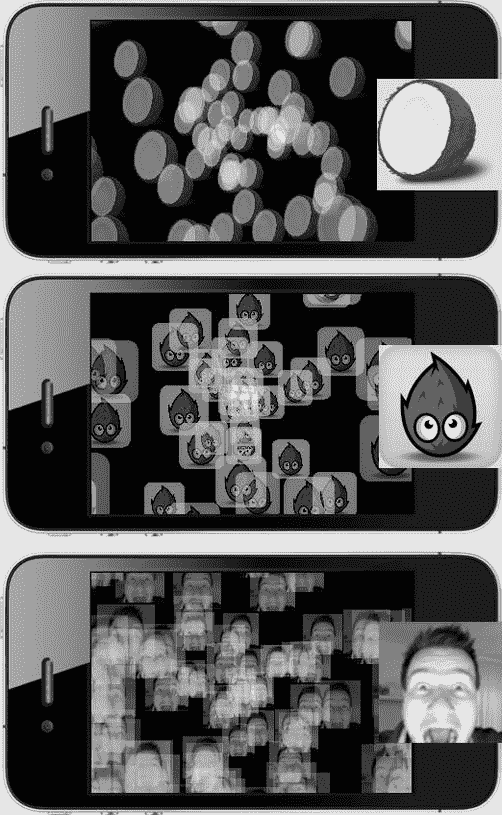

Figure 9-6 . 使用不同纹理的同一粒子效果。摄影效果的图片不理想

粒子纹理最重要的一点是，图像的尺寸必须不超过 64x64 像素。纹理尺寸越小，粒子效果的性能就越好。

## Particle Designer

Particle Designer 是一个用于为 cocos2d 和 iOS OpenGL 应用程序创建粒子效果的交互式工具。你可以从 `http://particledesigner.71squared.com` 下载试用版。

这是一个非常宝贵的工具，它将为你节省大量创建粒子效果的时间。它的强大之处在于，当你更改粒子效果的属性时，可以立即看到屏幕上发生的变化。你还可以与他人分享你的作品，并从其他开发者的粒子效果中获取灵感。

### Particle Designer 介绍

默认情况下，Particle Designer 的用户界面显示一个可视化的粒子效果列表。要编辑特定效果，请选中它，然后通过双击它或点击右上角的 "Emitter Config" 按钮切换到 "Emitter Config" 视图（Figure 9-7）。

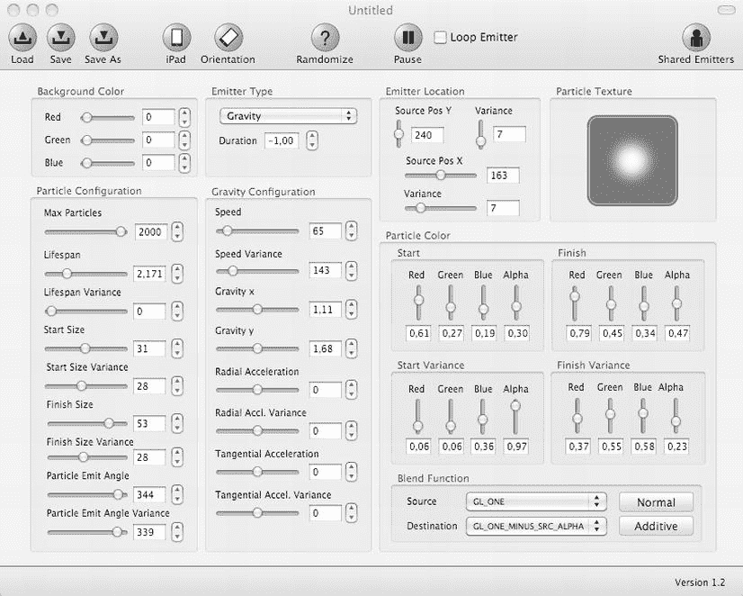


图 9-7 展示了粒子设计器，其中包含大量可供实时调整的属性。另一个窗口（图 9-8）会显示您编辑时的实时效果。

您应该能从前文介绍的自制粒子效果属性中认出这些参数。只有少数属性在粒子设计器中不可用或无法编辑，包括 `positionType` 以及径向发射模式下的 `endRadiusVar` 属性。这意味着您无法创建径向模式下向外旋转的粒子效果。不过，您始终可以先加载粒子设计器效果，然后在代码中通过覆写特定属性（例如将 `positionType` 设置为 `kCCPositionTypeFree`，如下文代码清单 9-4 所示）来调整它。与在屏幕上实时看到滑块移动带来的效果变化相比，这只是一点小小不便。

唯一不太常见的控件是粒子纹理。这里没有加载图片的按钮，双击该字段也不会有任何反应。关键在于，粒子纹理框仅接受拖放进去的图片。将任意图片从访达拖到此框上，框会变绿，表示可以接受。释放图片后，它就会被粒子效果使用。

**注意：** 如果您拖放的图片尺寸超过 `512x512` 像素，粒子设计器会给出警告。尽管如此，它仍然会使用该图片，但会将其缩放至 `512x512` 像素，而忽略其原始的宽高比。请记住，除非有特殊需求，否则大于 `64x64` 像素的纹理尺寸可能已经过大。粒子效果的性能主要受纹理尺寸和粒子数量的影响。

图 9-8 中的粒子设计器预览窗口看起来很像 iPhone 模拟器。它也可以设置为 iPad 屏幕尺寸，您可以通过点击粒子设计器菜单栏中“加载”、“保存”和“另存为”按钮右侧的 iPad/iPhone 及方向按钮来更改屏幕方向。通过在预览窗口内点击并拖动，您可以移动粒子效果，这有助于了解该效果在移动对象上看起来如何。

请注意，背景颜色设置并非实际效果的一部分。它们只会改变预览窗口的背景颜色。如果您的游戏画面颜色明亮，而您想设计一个暗色或暗淡的效果，这一功能会非常有用。

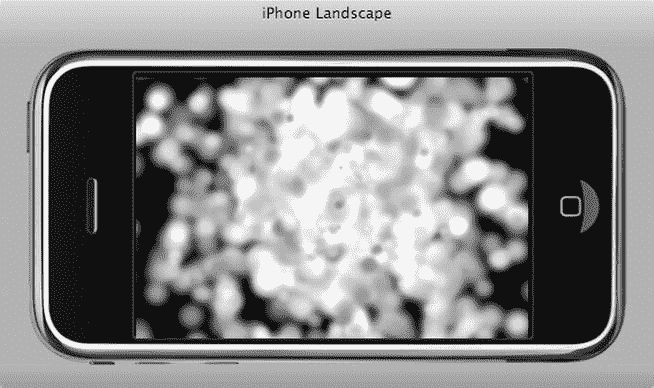

图 9-8 通过在粒子设计器的预览窗口内点击并拖动，您甚至可以移动粒子效果，看看它在移动对象上可能呈现的样子。

如果您缺乏灵感，可以随时使用 `Randomize`（随机化）按钮。您还可以思考一下 `ramdomize` 这个词的含义，它在粒子设计器中就是这样拼写的。据《城市词典》解释，`ramdom` 是 `random` 的一种更酷的写法。所以我猜开发者认为他们的随机化工具超酷。嗯，虽然它并没有随机化所有可用属性，但它确实能激发灵感。例如，`Randomize` 永远不会更改发射器类型、发射器位置以及许多特定于发射器类型的参数。

一旦找到灵感，您会希望滑动滑块并观察预览窗口中的变化。花些时间调整效果，直到您喜欢为止。不过要小心，因为这是一个非常引人入胜甚至令人着迷的活动，您很容易发现自己仅仅为了好玩就制作出新的粒子效果。

**注意：** 设计粒子效果时请务必小心！首先，请记住您的游戏还需要计算和渲染大量其他内容。如果您当前设计的效果在粒子设计器的预览窗口中能跑到 `60 FPS`，这并不意味着当您将其用于游戏时它就不会拖慢帧率。务必在游戏中测试新的粒子效果，并密切关注帧率。此外，请确保在设备上进行测试——尤其是在旧设备上！您的游戏在 iPhone/iPad 模拟器中的性能表现通常具有误导性，因此必须视为完全不可靠。粒子设计器预览窗口也是如此。

### 使用粒子设计器效果

假设在几小时后，您制作出了完美的粒子效果，并且想要在 cocos2d 中使用它。我制作了一个，第一步是保存粒子效果。当您点击粒子设计器中的“保存”或“另存为”按钮时，会弹出如图 9-9 所示的对话框。

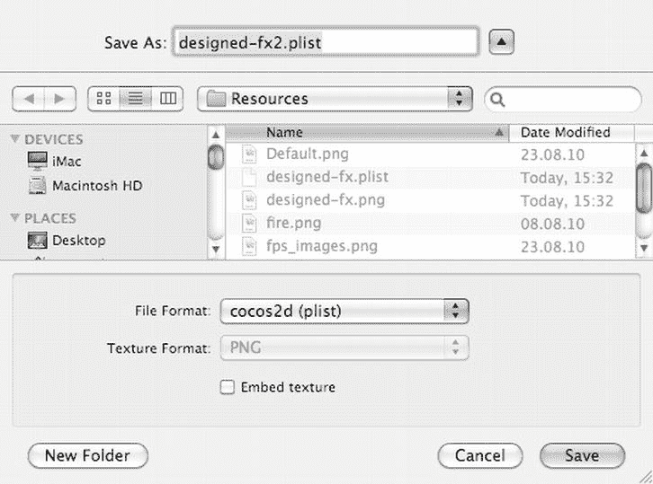

图 9-9 从粒子设计器保存粒子效果时，需要将文件格式设置为 `cocos2d`。将纹理嵌入到 `plist` 文件中是可选的。

为了使保存的粒子效果能被 cocos2d 使用，必须将“文件格式”设置为 `cocos2d (plist)`。您还可以勾选“嵌入纹理”复选框，这会将纹理保存到 `plist` 文件中。这样做的好处是，您只需将 `plist` 文件添加到您的 Xcode 项目；缺点是，如果不将粒子效果重新加载回粒子设计器，您将无法更改效果的纹理。

保存效果后，您需要将效果的 `plist` 文件，以及（如果您没有嵌入纹理的话）效果的 `PNG` 文件添加到 Xcode 项目的 `Resources` 文件夹中。在 `ParticleEffects01` 项目中，我添加了两种变体：一个带有独立 `PNG` 纹理的效果，以及另一个将纹理嵌入 `plist` 文件的效果。

代码清单 9-4 展示了我如何修改 `runEffect` 方法来加载粒子设计器效果。

**代码清单 9-4**：使用粒子设计器创建的粒子效果

```
-(void) runEffect
{
    . . .

switch (particleType)
    {
     . . .

case ParticleTypeDesignedFX:
           system = [CCParticleSystemQuad particleWithFile:@"fx1.plist"];
           break;
        case ParticleTypeDesignedFX2:
           system = [CCParticleSystemQuad particleWithFile:@"fx2.plist"];
           system.positionType = kCCPositionTypeFree;
           break;
        case ParticleTypeSelfMade:
           system = [ParticleEffectSelfMade node];
           break;

default:
     // do nothing
           break;
    }

. . .
}
```

要使用粒子设计器效果初始化 `CCParticleSystem`，需调用 `particleWithFile` 方法并将粒子效果的 `plist` 文件作为参数传入。在这个例子中，我选择了 `CCParticleSystemQuad`，因为它比 `CCParticleSystem` 更快，并且可以与 `CCParticleBatchNode` 一起批量渲染。最重要的是，粒子设计器效果要求使用四边形粒子系统，因为 `CCParticleSystem` 不兼容由粒子设计器创建的效果。

### 共享粒子效果

粒子设计器非常酷的一点是，您可以将自己的创作与其他粒子设计器用户共享。从粒子设计器的菜单栏中，选择“共享”，然后选择“共享发射器”，即可打开一个对话框，让您为您的粒子效果输入标题和描述，如图 9-10 所示。

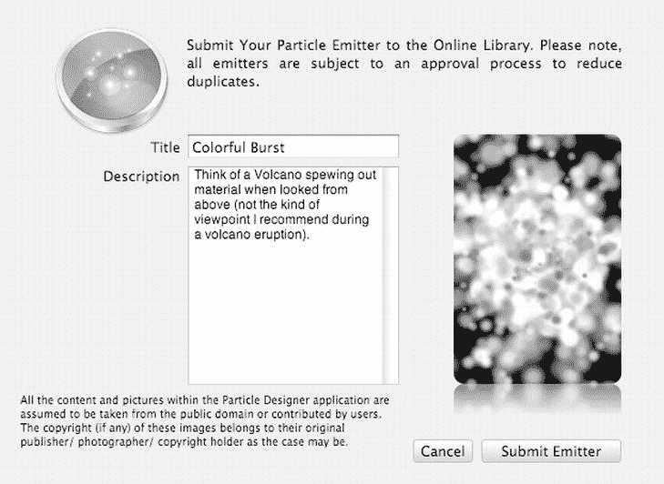

图 9-10 通过将粒子效果提交到在线图库，您可以与其他用户分享您的创作。


**注意：** 如图**9-8**中的消息所示，请务必仅上传您有权共享和分发的作品，或是您拥有版权的作品。否则，您可能面临侵犯他人版权的风险，或者如果您是合同制工作者，可能会违反保密协议或其他协议。

在图 9-11 中，您可以在右下角看到我刚刚提交的效果。

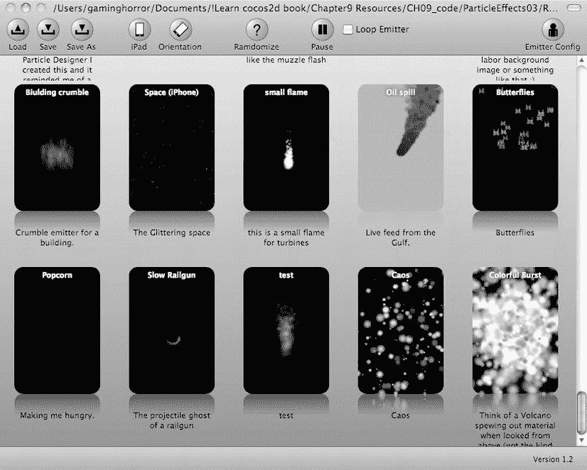

图 9-11。提交的效果会迅速出现在在线图库中。显然我的描述太长，无法完全显示在展示区域。

共享的粒子效果可能并不总是完美满足您的需求，但它们通常能为您自己的效果提供良好的起点。它们能帮助您更快地实现所需效果，至少能激发您的灵感。我鼓励您浏览效果列表，并尽可能多地尝试，以便充分了解哪些效果可行、哪些看起来不错、以及哪些根本行不通。

**用粒子效果打造射击游戏**

我很乐意看到这些效果出现在游戏中！让我们将这款射击游戏提升到一个新水平。您可以在本章的`ShootEmUp04`项目中找到成果，其中还添加了音效，也可以在图 9-12 中查看。

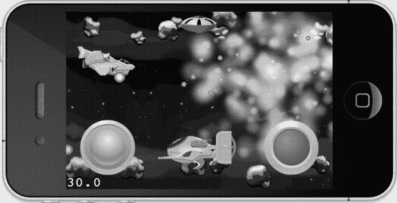

图 9-12。我击杀了 Boss，什么都看不见了，但那些粒子效果真是太美了！

在`Enemy`类中，`gotHit`方法是添加破坏性粒子爆炸效果的绝佳位置，如代码清单 9-5 所示。我决定让 Boss 怪物拥有自己的粒子效果，主要是因为它体型巨大，而且是紫色的。

**代码清单 9-5。** *为射击游戏添加爆炸效果*

```
-(void) gotHit
{
    hitPoints--;
    if (hitPoints < = 0)
    {
     self.visible = NO;

// 当敌人被摧毁时播放粒子效果
     CCParticleSystem* system;

if (type == EnemyTypeBoss)
     {
           system = [CCParticleSystemQuad particleWithFile:@"fx-explosion2.plist"];
     [[SimpleAudioEngine sharedEngine] playEffect:@"explo1.wav"
                                             pitch:1.0f
                                             pan:0.0f
                                             gain:1.0f];
     }
     else
     {
           system = [CCParticleSystemQuad particleWithFile:@"fx-explosion.plist"];
     [[SimpleAudioEngine sharedEngine] playEffect:@"explo2.wav"
                                             pitch:1.0f
                                             pan:0.0f
                                             gain:1.0f];
     }

// 设置一些无法在 Particle Designer 中设置的参数
           system.positionType = kCCPositionTypeFree;
           system.autoRemoveOnFinish = YES;
           system.position = self.position;

[[GameLayer sharedGameLayer] addChild:system];
    }
    else
    {
     [[SimpleAudioEngine sharedEngine] playEffect:@"hit1.wav"
                                             pitch:1.0f
                                             pan:0.0f
                                             gain:1.0f];
    }
}
```

您需要将粒子效果文件 `fx-explosion.plist` 和 `fx-explosion2.plist` 作为资源添加到 Xcode 项目中。粒子系统像之前一样初始化。由于粒子效果应该且必须独立于创建它的敌人，因此需要进行一些准备。首先，将 `autoRemoveOnFinish` 标志设置为 `YES`，以便效果自动移除自身。这之所以可行，是因为两种爆炸效果都只运行很短时间。效果还需要获取敌人的当前位置，以便在正确的位置显示。

我将粒子效果添加到 `GameLayer` 中，因为敌人本身无法显示粒子效果。首先，敌人本身不可见，那么添加到它上面的任何子节点也将不可见。此外，敌人可能很快会重生，这会影响粒子效果的位置。但最重要的是，所有 `Enemy` 对象都被添加到了一个 `CCSpriteBatchNode` 中，而该节点只允许添加 `CCSprite` 对象。如果将粒子效果添加到 `Enemy` 对象中，将不可避免地导致运行时异常。

对于播放音效，`SimpleAudioEngine` 类通常足以胜任。要使用它，您必须在每个使用 `SimpleAudioEngine` 类的文件中导入 `SimpleAudioEngine.h` 头文件，因为 cocos2d 并未将 CocosDenshion 音频引擎视为引擎的组成部分。

在玩带有新粒子效果的游戏时，您可能会注意到，这些效果首次显示时，游戏会短暂停顿。这是因为 cocos2d 正在加载粒子效果的纹理——这是一个相当缓慢的过程，无论纹理是像本例这样嵌入在 plist 文件中，还是作为单独的纹理提供。为了避免这种情况，我在 `GameLayer` 中预加载了粒子效果和音频文件：

```
-(id) init
{
    if ((self = [super init]))
    {
     . . .

// 要预加载纹理，先在屏幕外播放每种效果一次
     [CCParticleSystemQuad particleWithFile:@"fx-explosion.plist"];
     [CCParticleSystemQuad particleWithFile:@"fx-explosion2.plist"];

// 预加载音效
     [[SimpleAudioEngine sharedEngine] preloadEffect:@"explo1.wav"];
     [[SimpleAudioEngine sharedEngine] preloadEffect:@"explo2.wav"];
     [[SimpleAudioEngine sharedEngine] preloadEffect:@"shoot1.wav"];
     [[SimpleAudioEngine sharedEngine] preloadEffect:@"shoot2.wav"];
     [[SimpleAudioEngine sharedEngine] preloadEffect:@"hit1.wav"];
    }
    return self;
}
```

现在，`init` 方法会为每个粒子效果创建一次粒子系统，但并未将其作为子节点添加到任何位置。这会使 cocos2d 缓存纹理。如果您选择不将纹理嵌入到粒子效果 plist 文件中，则可以通过调用 `CCTextureCache addImage` 方法来预加载粒子效果纹理：

`[[CCTextureCache sharedTextureCache] addImage:particleFile];`

## 总结

本章真是一场视觉盛宴！cocos2d 提供的内置效果很好地展示了粒子系统所能实现的功能。它们使用起来快速简便。

但是，在源码中创建粒子效果也相当折磨人。需要调整的属性太多；有些属性是特定发射模式独有的；有些属性名称具有误导性，而且不容易搞清楚。不过，在了解了每个属性的解释之后，您现在应该对粒子效果是如何组合而成的，以及哪些是最重要的参数有了很好的理解。

然后，我们看到了粒子效果如何借助 Particle Designer 大放异彩。这个工具极其有用——而且使用起来乐趣十足。当您能够移动滑块并立即在屏幕上看到结果时，它瞬间改变了您对粒子效果的看法，更不用说您还可以与他人分享您的创作，并尝试其他设计师的效果。

最后，射击游戏得到了改头换面，现在当子弹发射和敌人被摧毁时，会播放粒子爆炸效果和声音。这让游戏变得更加生动。

在下一章中，我将暂时搁置射击游戏，为您介绍关于 tilemap 你需要知道的一切。

