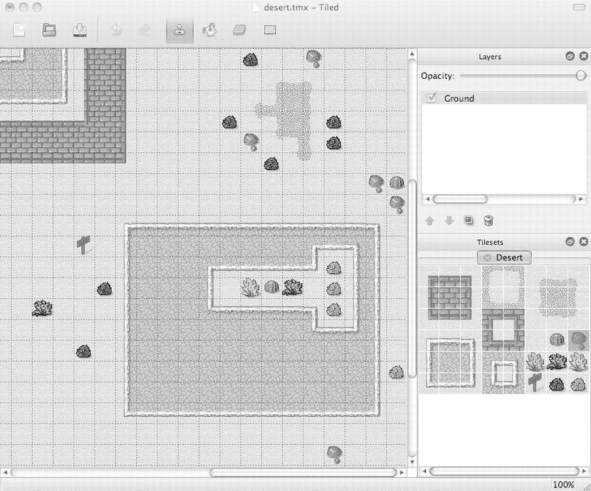
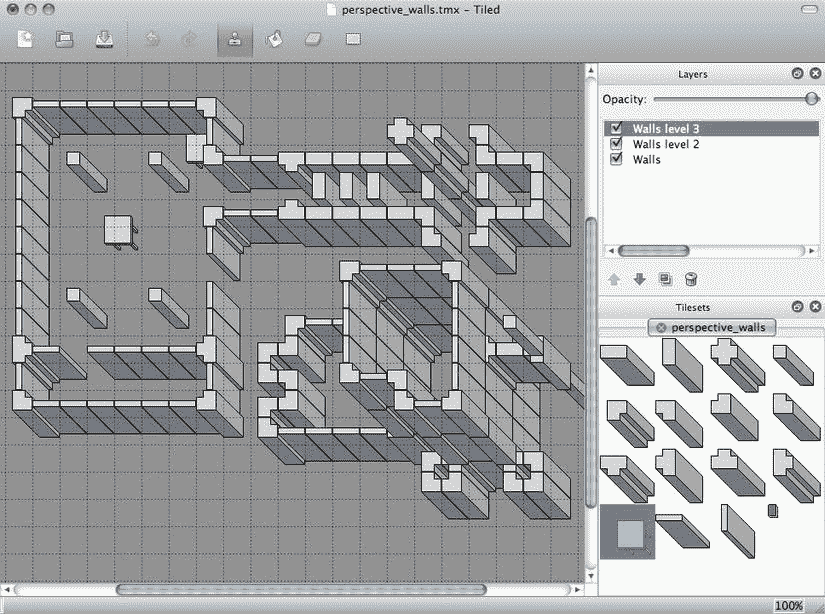
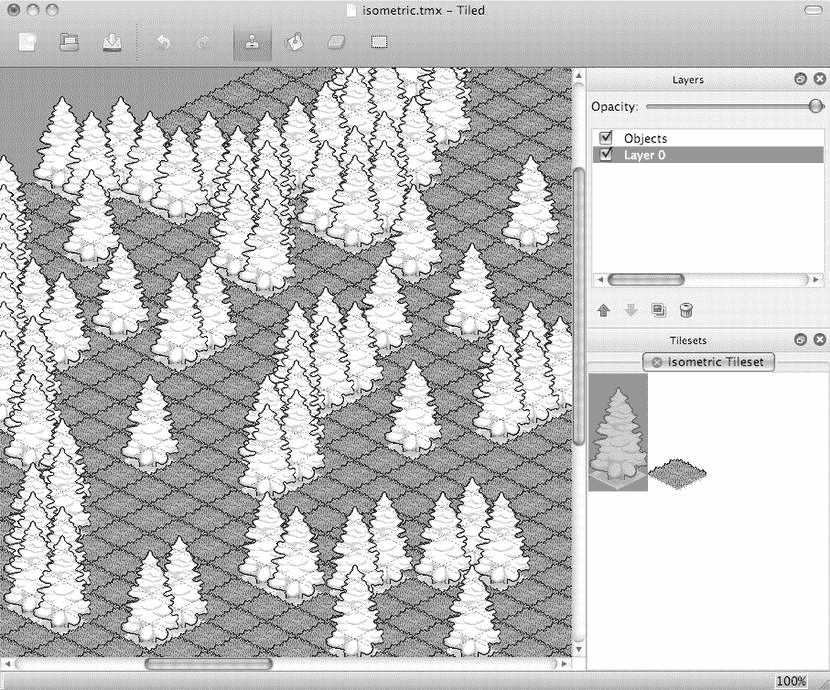
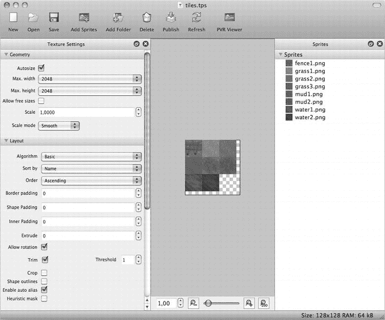
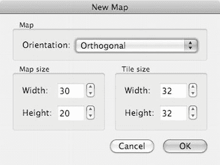
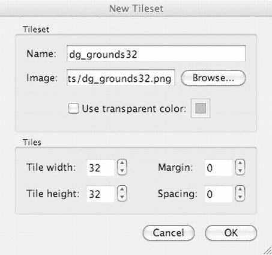
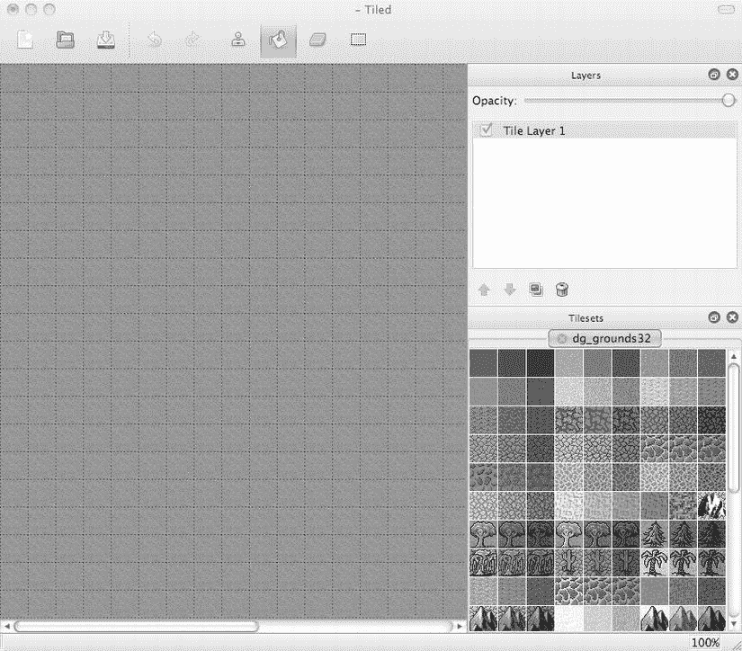
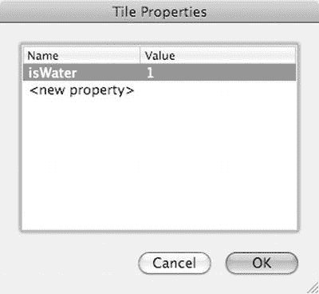
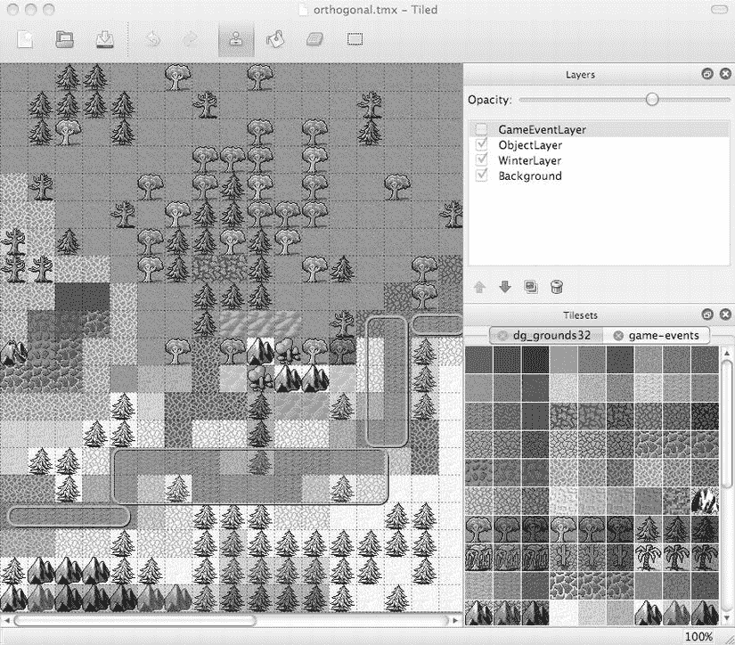

# 第 10 章：使用 Tilemap

在接下来的两章中，我将向您介绍基于瓦片的游戏世界。无论您是从《创世纪》这类经典角色扮演游戏开始玩起的，还是最近才加入 Facebook 好友在《Farmville》中的行列，我敢肯定您已经玩过使用 tilemap 概念来显示图形的游戏了。


## 在瓦片地图游戏中

在瓦片地图游戏中，图形由少量名为*瓦片*的图像组成，这些图像能够相互对齐；将它们放置在一个网格上，就能构建出相当逼真的游戏世界。与将整个世界绘制成独立纹理相比，这个概念极具吸引力，因为它节省了内存，同时还能实现丰富的多样性。

本章通过介绍最简单的瓦片地图类型——*正交瓦片地图*——来讲解瓦片地图的一般概念。它们通常由方形瓦片构建而成，很少使用非方形的矩形瓦片，并且通常以俯视图的方式展示世界。本章将讨论瓦片地图的各种显示风格，下一章将基于你在本章学到的瓦片地图编程基础，重点介绍等距瓦片地图。

## 什么是瓦片地图？

瓦片地图是由单个瓦片组成的 2D 游戏世界。你只需用少量尺寸相同的图像就能创建出大型世界地图。这意味着瓦片地图在保存大型地图（游戏世界）的内存方面非常高效。难怪它们最早出现在计算机游戏的早期时代。许多经典的角色扮演游戏都使用方形瓦片来创建奇妙的幻想世界。这些游戏看起来有点像图 10-1 中的瓦片地图，这也是正交瓦片地图的一个完美示例。它看起来像一幅俯瞰图，视线垂直向下。因此，正交瓦片地图通常看起来是平面的。



图 10-1. Tiled (Qt) 地图编辑器中的正交瓦片地图

实际上，正交瓦片地图中的瓦片不必是方形的；你也可以使用矩形图像来创建正交瓦片地图。这些矩形瓦片最常用于亚洲角色扮演游戏，例如《勇者斗恶龙》。虽然仍然使用正交视角，但它允许设计者创建看起来比宽度更高的物体。这使得设计者能够通过将房屋等物体绘制成多个瓦片，并允许游戏角色部分被瓦片遮挡，从而创造出体积的错觉。

这种方法在《创世纪 6》和特别是《创世纪 7》中真正大放异彩。通过倾斜绘制瓦片的视角，其效果接近等距瓦片地图，同时仍然是正交瓦片地图。使用这种方法，设计者能够创造出深度的错觉，如图 10-2 所示。



图 10-2. 一种带有透视瓦片的正交瓦片地图，设计为多层叠加以产生深度感。这种瓦片地图风格因《创世纪 7》而闻名

等距瓦片地图则更进一步，不仅以特定的透视角度绘制瓦片，还将其旋转了 45 度。等距瓦片地图非常有效地欺骗了我们的思维，让我们相信这个世界中真的存在第三维，尽管所有图像本质上仍然是平面的。等距瓦片地图通过使用绘制成菱形（rhombuses）形状的瓦片图像，并允许离观察者较近的瓦片覆盖住离观察者较远的瓦片，来实现这种深度感。等距瓦片地图的示例见图 10-3。我将在下一章更详细地讨论等距瓦片地图。



图 10-3. Tiled (Qt) 地图编辑器中的等距瓦片地图

图 10-2 和图 10-3 中的瓦片地图证明了瓦片地图不必看起来是平面的。在某些允许玩家与游戏世界互动的游戏中，你可以使用瓦片的层叠或堆叠，就像许多《开心农场》粉丝视频所展示的那样效果显著。一些《开心农场》用户仅通过堆叠农作物地块就建造了房屋甚至高大的摩天大楼。他们利用了等距瓦片地图所能实现的光学错觉。

你通常使用编辑器来编辑瓦片地图，而 cocos2d 直接支持的编辑器叫做 Tiled (Qt) 地图编辑器。Tiled 是免费的开源软件，允许你编辑包含多个图层的正交和等距瓦片地图。Tiled 还允许你添加触发区域（对象层），你可以在游戏中利用它在角色进入该区域时触发特定动作。它们还可用于向地图添加任意位置，以便例如定义生成点。通过编辑瓦片属性，你可以确定它是什么类型的瓦片。你还可以用它来阻止角色进入某些瓦片，或者例如让角色在移动到熔岩瓦片上时受到伤害。

**注意** Qt 指的是诺基亚的 Qt 框架，Tiled 正是基于该框架构建的。由于还存在一个已停用的 Java 版本 Tiled，因此通过写成 Tiled (Qt) 来区分这一点很重要。Java 版本已不再更新，但包含一些值得一试的额外功能。在本章和下一章中，我将使用并讨论 Tiled (Qt)。

## 使用 TexturePacker 准备图像

在开始使用 Tiled (Qt) 地图编辑器之前，你需要准备瓦片地图图形。瓦片地图的瓦片图像集合通常被称为*瓦片集*。从技术上讲，它只是一个包含瓦片图像的纹理图集，但 Tiled (Qt) 只能加载 PNG（推荐）或 JPG 格式的瓦片集。

在本章的 Tilemap01 项目中，你会在 `Assets/tiles` 文件夹中找到许多方形瓦片图像。将所有瓦片图像添加到 TexturePacker 中，然后取消选中“允许旋转”，将“算法”设置为“基本”，并将“排序方式”设置为“名称”。这些设置确保瓦片能够为 Tiled 正确排序和对齐。TexturePacker 中生成的瓦片集应类似于图 10-4。



图 10-4. 使用 TexturePacker 创建包含几个方形瓦片的纹理图集

对于 Tiled 来说，保持瓦片在相同位置至关重要——这就是按名称排序和禁止旋转如此重要的原因——因为 Tiled 仅通过位置（瓦片索引）和偏移量来引用瓦片集中的单个瓦片。这意味着，如果纹理中的瓦片变了位置，Tiled 中的瓦片地图看起来就会完全不同。瓦片地图仍然引用瓦片集中相同位置的瓦片，但那个位置上可能不再是草地瓦片，而变成了水瓦片，例如。

## Tiled (Qt) 地图编辑器

创建用于 cocos2d 瓦片地图的最流行工具是前面几节已经提到的 Tiled (Qt) 地图编辑器。它创建的 TMX 文件被 cocos2d 游戏引擎原生支持。TMX 文件本质上是 XML 文件，如果需要，你可以使用文本编辑器进行编辑。

Tiled 可免费下载，在撰写本文时，最新版本是 0.8.1。你可以从其主页 `www.mapeditor.org` 下载 Tiled。

如果你想支持 Tiled 的开发，可以考虑向项目开发者 Thorbjørn Lindeijer 捐款。你可以在网站上找到捐款按钮。

### 创建新瓦片地图


下载并启动 Tiled 后，首先进入`View`菜单，勾选`Tilesets`和`Layers`两个选项。这将在 Tiled 窗口右侧显示图层列表和当前图块集（tileset），您需要经常参考此区域。然后选择`File` -> `New`创建新的图块地图（tilemap），将弹出“新建地图”（New Map）对话框，如图 10-5 所示。



Figure 10-5 . 在 Tiled 中创建新图块地图

目前，Tiled 支持正交（矩形）图块地图和等距图块地图，不支持六边形地图。地图大小以图块（tiles）为单位，但 Tiled 也会以像素为单位显示地图尺寸。本例中，新地图为 30 × 20 个图块，图块图像尺寸为 32 × 32 像素。图块尺寸必须与图块图像尺寸匹配，否则将无法对齐。

新地图将是完全空的，并且没有加载任何可绘制的图块集。您可以通过选择`Map` -> `New Tileset`来添加图块集。此操作会打开“新建图块集”（New Tileset）对话框（如图 10-6 所示），您可以在其中浏览并选择适当的图块集图像。图块集只是一个包含多个等间距图块的图像名称，您也可以将其称为仅包含相同尺寸图像的纹理图集。



Figure 10-6 . 从图像文件创建新图块集

**注意**：`Map` -> `Add External Tileset`功能仅用于导入先前导出的图块集，以便在多个 TMX 地图之间共享同一图块集。您可以通过右键单击 Tiled 窗口右下角的图块集视图，然后选择“导出图块集为”（Export Tileset As）来导出图块集。

您将使用`dg_grounds32.png`图块集。这些图块由 David E. Gervais 绘制，并根据知识共享许可协议发布，这意味着您可以自由分享和重新演绎他的作品，但必须注明出处。您可以从以下网址下载更多他的图块集：`http://pousse.rapiere.free.fr/tome/index.htm`。

在图 10-6 中，我已经通过`Tilemap01`项目`Resources`文件夹中的“浏览”（Browse）按钮，添加了`dg_grounds32.png`图块集图像。如果您勾选“使用透明颜色”（Use transparent color）复选框，透明区域将以粉色（默认颜色）显示。由于当前使用的图块没有透明区域，您可以暂时不勾选此框。

图块宽度和高度是指图块集中单个图块的尺寸，它们应与创建新地图时设置的 32 × 32 图块大小相匹配。“边距”（Margin）和“间距”（Spacing）设置决定图块与图像边框的距离以及图块之间的像素间距。对于`dg_grounds32.png`，没有间距，因此我将这两个值都设置为 0。

如果您使用`TexturePacker`对齐图块来创建图块集纹理，则必须在“边距”和“间距”字段中输入`TexturePacker`使用的像素填充值。默认情况下，`TexturePacker`使用的填充为 0 像素。

加载新的图块集图像时，请确保图块集图像已位于项目的`Resource`文件夹中。同时，务必保存图块地图的 TMX 文件到图块集图像所在的同一个文件夹中。否则，`cocos2d`可能无法加载图块集图像；尝试加载 TMX 文件将导致运行时异常。原因是 TMX 文件引用图块集图像时使用的是相对于 TMX 文件保存位置的路径。如果它们不在同一文件夹中，`cocos2d`可能无法找到该图像，因为当应用程序安装在模拟器或设备上时，文件夹结构可能无法保留。

**提示**：TMX 文件是纯 XML 文件，如果您好奇，可以查看其内部结构。如果您看到图像文件引用包含路径部分，那么`cocos2d`很可能无法加载引用的图像文件。图像引用应该仅列出图像文件名，不包含任何路径组件，例如：`<image source = "tiles.png"/>`。

## 如何为 Retina 和 iPad 分辨率创建图块地图

Tiled 本身没有针对不同图块地图分辨率的概念。但`cocos2d`支持所有常见的扩展名，如`-hd`、`-ipad`和`-ipadhd`，用于图块地图文件。问题在于，如何将现有的图块地图转换为高清（HD）图块地图，或反之？

答案在于手动编辑由 Tiled 创建、并使用 Xcode 或文本编辑器打开的 TMX 文件。以下是本章使用的`tilemap.tmx`文件的完整内容：

```
<?xml version = "1.0" encoding = "UTF-8"?>
<map version = "1.0" orientation = "orthogonal" width = "24" height = "16" tilewidth = "40" tileheight = "40">
 <tileset firstgid = "1" name = "tiles" tilewidth = "40" tileheight = "40" spacing = "0" margin = "0">
  <image source = "tiles.png" width = "128" height = "128"/>
 </tileset>
 <layer name = "Tile Layer 1" width = "24" height = "16">
  <data encoding = "base64" compression = "zlib">
eJztlN0KgCAMRr9Km+//xBEssLU/Qe8SDuqEM2VMAGgLAc80mRH/Nojl3ycR + Q9G7mU8k0P6H0dhpDubR/OTcHt4OUnxazXI5Cn4vsXz31TmZPq1RcW7rpq/P4t8GqS45P2tPoz6Kev3erEZscz/sPL/+Yc9LqVyBq0=
  </data>
 </layer>
</map>
```

我已加粗标记了需要修改的条目。由于这是一个标准分辨率的图块地图，您需要将所有数值乘以 2，以将该图块地图转换为 Retina 分辨率。请注意不要意外更改地图的参数，特别是因为地图和图块集都有`tilewidth`和`tileheight`参数。如果您要将 Retina 图块地图转换为标准分辨率，则需要将所有数值除以 2。此时所有值都应为偶数，以确保可以被 2 整除而没有余数。

您还需要更改源图像名称，使其使用`tiles-hd.png`图像，该图像可以按照第 6 章所述使用`TexturePacker`创建。然后，将修改后的图块地图保存为`tilemap-hd.tmx`。

不幸的是，这个过程繁琐且容易出错，因为您需要在每次修改图块地图后都执行此操作，或者您可以选择同时编辑标准分辨率和 Retina 分辨率的图块地图——但这仍然是双倍的工作量，如果您还想支持标准、Retina、iPad 和 Retina iPad 分辨率，则是四倍的工作量。在这种情况下，您需要保持以下文件最新：

*   标准分辨率：`tilemap.tmx`和`tilemap.png`
*   Retina 分辨率：`tilemap-hd.tmx`和`tilemap-hd.png`
*   iPad 分辨率：`tilemap-ipad.tmx`和`tilemap-ipad.png`
*   iPad Retina 分辨率：`tilemap-ipadhd.tmx`和`tilemap-ipadhd.png`

您可以始终在一种分辨率下设计和测试您的图块地图，仅偶尔将其转换到其他分辨率。您也可以考虑编写一个脚本或小型应用程序来自动化这一过程。一个良好的起点是此处提供的图块地图 HD/SD 转换工具：`http://wasabibit.com/WasabiBit/Dev_Notes.html`。


### 使用 iOS 设备上的 iTileMaps 创建地图

另一种选择是在 iOS 设备上使用 `iTileMaps` 创建你的瓦片地图。它允许你自动创建正在创建的瓦片地图的标清/高清版本。你可以试用免费版，看看 `iTileMaps` 是否适合你。你可以在 `iTileMaps` 首页找到更多信息：`www.klemix.com/page/iTileMaps.aspx`。

## 设计瓦片地图

载入瓦片集后，你会面对一张空白地图，这是邀请你发挥创意，为瓦片地图构思绝佳创意的邀请函。更好的做法是，将消除空白瓦片地图作为第一步。用默认的地板瓦片开始瓦片地图非常有帮助。我选择了桶填充工具，并选取了一个明亮的草地瓦片，这样我的瓦片地图现在就像是一片茂盛的草地——差不多吧。你可以在图 **10-7** 中看到效果。



图 10-7 . 一张载入了 `dg_grounds32` 瓦片集的空地图，等待你的灵感

**提示** 如果你发现 Tiled 窗口中缺少了什么，请查看“视图”菜单。你可以隐藏或显示“瓦片集”、“图层”和“历史记录”视图。这一点很重要，因为这是你误点这些视图上的 X 按钮后，恢复它们的唯一方法。

Tiled 使用四种模式来编辑瓦片地图，由工具栏上最右侧的四个图标表示。它们分别是：图章画笔（快捷键 B），用于在瓦片集中绘制当前选区；桶填充（快捷键 F），用于填充相连相同瓦片的区域；橡皮擦（快捷键 E），用于擦除瓦片；矩形选择（快捷键 R），用于选择一个范围的瓦片，然后复制并粘贴选区。

你也可以缩放瓦片地图。如果你有带滚轮的鼠标，按住 Command 键并滚动滚轮可以放大和缩小。或者，你也可以通过按住 Command 键并按下加号或减号键来分别放大和缩小。

你将花费大部分时间从瓦片集中选取一个瓦片，并在选定图章画笔的情况下将其绘制到瓦片地图上。逐个放置瓦片，你将创建出基于瓦片的游戏世界。

你还可以通过在图层面板中添加更多图层，在多个图层中编辑瓦片。从菜单中选择“图层”“添加瓦片图层”来为瓦片创建一个新图层。使用多个瓦片图层可以让你在 cocos2d 中切换瓦片地图的区域。在 `TileMap01` 示例项目中，我用它在冬季和夏季之间切换地图的部分区域。

你也可以选择“图层”“添加对象图层”来添加一个用于添加对象的图层。有两种类型的对象：常规对象就是你可以放置的简单矩形；另一种类型的对象是瓦片对象，它允许你在地图上自由放置瓦片，而无需对齐到瓦片网格。你可以使用矩形对象来为地图添加自定义信息，例如生成点、传送位置或触发器区域。瓦片对象最常用于将较小的物品（如剑、花朵、蜡烛和其他物品）直接放置到瓦片世界中。

为了处理对象，Tiled 工具栏上提供了额外的按钮：“选择对象”（快捷键 S）、“插入对象”（快捷键 O）和“插入瓦片对象”（快捷键 T）。要插入一个矩形对象，点击“插入对象”图标，然后在瓦片地图世界中点击以创建点对象（宽度和高度为零的矩形），或者点击并向右下方拖动以创建一个矩形。要插入一个瓦片对象，点击“插入瓦片对象”图标，从瓦片集中选择一个瓦片，然后点击瓦片地图世界以添加一个新的瓦片对象。

Tiled 中的某些功能隐藏在上下文菜单中。例如，你可以通过右键点击刚刚提到的矩形对象，然后选择“移除对象”来删除它们。请注意，你还需要在图层面板中高亮显示对象图层，上下文菜单才会出现。

你也可以通过右键点击对象、图层和瓦片，然后点击相应的“属性”菜单项来编辑它们的属性。其中一个用途是使用“图层”“添加瓦片图层”创建一个额外的瓦片图层。这个图层将用于告诉游戏关于某些瓦片的属性。我将其命名为 `GameEventLayer`，因为它将用于定义某些游戏事件的触发区域。

选中 `GameEventLayer` 后，选择“地图”“新建瓦片集”，并从 `dg_grounds32.png` 所在的文件夹加载 `game-events.png`。它只包含三个瓦片。右键点击其中一个，选择“瓦片属性”，并添加 `isWater` 属性，如图 **10-8** 所示。



图 10-8 . 添加瓦片属性

**注意** 请记住，每个瓦片图层都会产生一些开销，尤其是在同一位置设置了多个瓦片的图层。这将导致两个图层都被绘制，并可能对游戏性能产生不利影响。我建议将瓦片图层的数量保持到最少。对于大多数游戏来说，两到四个瓦片图层就足够了。在添加了新的瓦片图层并绘制内容后，请务必在设备上检查游戏的帧率。

另外请注意，Tiled 允许你为一个图层添加多个瓦片集。然而，cocos2d 每个图层只支持一个瓦片集。

然后，你可以使用刚刚添加了 `isWater` 属性的瓦片在瓦片地图上绘制。理想情况下，将其绘制在河流上。要查看绘制内容下方的瓦片，你可以使用图层面板中 `GameEventLayer` 的不透明度滑块。或者点击图层的复选框来隐藏或取消隐藏在此特定图层上绘制的所有内容。

在保存 TMX 瓦片地图之前，请确保启用所有图层的复选框。Cocos2d 不会加载在 Tiled 中未选中的图层。

完成后，你应该得到一个类似于图 **10-9** 所示的瓦片地图。将其保存在与瓦片集图像相同的 `TileMap01 Resources` 文件夹中。



图 10-9 . 一个包含三个瓦片图层和一个对象图层的完整瓦片地图

## 在 Cocos2d 中使用正交瓦片地图

要在 cocos2d 中使用 TMX 瓦片地图，首先必须将 TMX 文件及其附带的瓦片集图像文件作为资源添加到你的 Xcode 项目中。在 `TileMap01` 项目中，我添加了 `orthogonal.tmx` 以及 `tilesets dg_grounds32.png` 和 `game-events.png`。加载和显示瓦片地图非常简单；以下代码是 `TileMapLayer` 类的接口：

```
#import "cocos2d.h"

enum
{
  TileMapNode = 0,
};

@interface TileMapLayer : CCLayer
{
}

+(id) scene;
@end
```

这是加载瓦片地图并隐藏 `GameEventLayer` 的 `TileMapLayer` 实现：

```
#import "TileMapLayer.h"
#import "SimpleAudioEngine.h"

@implementation TileMapLayer
+(id) scene
{
  CCScene *scene = [CCScene node];
  TileMapLayer *layer = [TileMapLayer node];
  [scene addChild: layer];
  return scene;
}

-(id) init
{
  if ((self = [super init]))
  {
  CCTMXTiledMap* tileMap = [CCTMXTiledMap tiledMapWithTMXFile:@"orthogonal.tmx"];
  [self addChild:tileMap z:-1 tag:TileMapNode];

CCTMXLayer* eventLayer = [tileMap layerNamed:@"GameEventLayer"];
  eventLayer.visible = NO;

self.isTouchEnabled = YES;
  }
  return self;
}
@end
```


