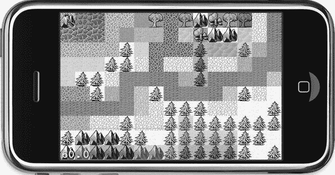
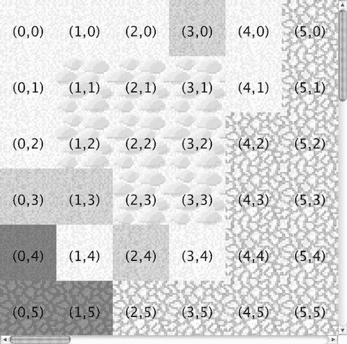
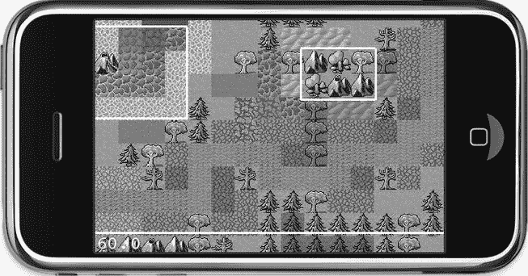

# 排版后的内容

`CCTMXTiledMap`类使用 TMX 文件的名称初始化，然后作为子节点添加并附带标签，以便后续检索。当然，使用实例变量也能达到同样的效果。下一步是通过`layerNamed`方法并传入在 Tiled 中命名的图层名称，来检索用于游戏事件的`CCTMXTiledMap`。由于游戏事件图层仅作为代码确定特定瓦片属性的提示，该图层完全不应被渲染。请注意，如果在 Tiled 中取消选中该图层，它将不会显示，但你也将无法访问其瓦片和瓦片属性。

如果你现在运行项目，你会看到一个类似图**10-10**的瓦片地图。



图 10-10 — iPhone 模拟器中的正交瓦片地图

目前你无法对瓦片地图做任何操作，但我想改变这一点。例如，我希望能够找到`isWater`瓦片。我添加了`ccTouchesBegan`方法，如清单 10-1 所示，用于确定玩家触摸的瓦片。

***清单 10-1*** — 确定瓦片的属性

```
-(void) ccTouchesBegan:(NSSet *)touches withEvent:(UIEvent *)event
{
  CCNode* node = [self getChildByTag:TileMapNode];
  NSAssert([node isKindOfClass:[CCTMXTiledMap class]], @"not a CCTMXTiledMap");
  CCTMXTiledMap* tileMap = (CCTMXTiledMap*)node;

// Get the position in tile coordinates from the touch location
  CGPoint touchLocation = [self locationFromTouch:touches.anyObject];
  CGPoint tilePos = [self tilePosFromLocation:touchLocation tileMap:tileMap];

// Check if the touch was on water (e.g., tiles with isWater property)
  BOOL isTouchOnWater = NO;
  CCTMXLayer* eventLayer = [tileMap layerNamed:@"GameEventLayer"];
  int tileGID = [eventLayer tileGIDAt:tilePos];

if (tileGID ! = 0)
  {
  NSDictionary* properties = [tileMap propertiesForGID:tileGID];
  if (properties)
  {
  NSString* isWaterProperty = [properties valueForKey:@"isWater"];
  isTouchOnWater = isWaterProperty.boolValue;
   }
  }

// Decide what to do depending on where the touch was
  if (isTouchOnWater)
  {
  [[SimpleAudioEngine sharedEngine] playEffect:@"alien-sfx.caf"];
  }
  else
  {
  // Get the winter layer and toggle its visibility
  CCTMXLayer* winterLayer = [tileMap layerNamed:@"WinterLayer"];
  winterLayer.visible = !winterLayer.visible;
  }
}
```

`CCTMXTiledMap`按常规方式检索。触摸位置首先转换为屏幕坐标，然后用于检索包含该特定屏幕位置瓦片地图索引的`tilePos`。我稍后会介绍`tilePosFromLocation`方法。目前，只需知道它返回被触摸瓦片的索引即可。

此时，我必须介绍瓦片的全局标识符（GID）概念，这些是分配给瓦片地图中每个使用的瓦片的唯一整数。地图中的瓦片从 1 开始连续编号。GID 为 0 表示空瓦片。通过`CCTMXLayer`的`tileGIDAt`方法，你可以确定给定瓦片坐标处的瓦片的 GID 编号。

接下来，从瓦片地图中获取名为`GameEventLayer`的`CCTMXLayer`。这是我定义`isWater`瓦片并将其绘制在河流瓦片上方的图层。`tileGIDAt`方法返回该瓦片的唯一标识符。如果标识符恰好为 0，则表示此图层上此位置没有瓦片——在这种情况下，已经可以确定被触摸的瓦片不可能是`isWater`瓦片。

`CCTMXTiledMap`有一个`propertiesForGID`方法，如果给定标识符（GID）的瓦片有可用属性，该方法会返回一个`NSDictionary`。这个`NSDictionary`包含在 Tiled 中编辑的属性（见图**10-8**）。该字典将任何键/值对存储为`NSString`对象。为了调试目的查看特定`NSDictionary`的内容，你可以使用如下`CCLOG`语句：

```
CCLOG(@"NSDictionary 'properties' contains:\n%@", properties);
```

这将在调试器控制台中打印出类似如下的内容：

```
2010–08-30 19:50:52.344 Tilemap[978:207] NSDictionary 'properties' contains:
{
  isWater = 1;
}
```

在处理瓦片地图时，你会遇到各种`NSDictionary`对象。记录其内容可以让你窥探任何`NSDictionary`或 iPhone SDK 集合类的内部。这通常会派上用场。

你可以通过`NSDictionary`的`valueForKey`方法按其名称检索`NSDictionary`中的每个属性，该方法返回一个`NSString`。要从`NSString`获取布尔值，你可以直接使用`NSString`的`boolValue`属性。以类似的方式，你可以分别使用`NSString`的`intValue`和`floatValue`属性检索整型和浮点数值。

在`ccTouchesBegan`的末尾，我检查触摸是否在水上，如果是，则播放声音。否则，我检索`WinterLayer`并通过取反来切换其`visible`属性。改变季节从未如此简单！这个效果应该说明如何利用 Tiled 中的多个图层来实现全局范围的更改，而无需加载完全独立的瓦片地图。

对于单个瓦片更局部的更改，你可以使用`removeTileAt`和`setTileGID`方法在游戏运行时移除或替换特定图层的瓦片：

```
[winterLayer removeTileAt:tilePos];
[winterLayer setTileGID:tileGID at:tilePos];
```

### 定位被触摸的瓦片

我之前提到了`tilePosFromLocation`方法，在实现`locationFromTouch`和`tilePosFromLocation`之前，我在此重复`ccTouchesBegan`代码中的两行相关代码：

```
// Get the position in tile coordinates from the touch location
CGPoint touchLocation = [self locationFromTouch:touches.anyObject];
CGPoint tilePos = [self tilePosFromLocation:touchLocation tileMap:tileMap];
```

首先，触摸位置被映射到屏幕坐标。我之前已经这样做过，但由于你会经常用到这段代码，我已在清单 10-2 中提供以供参考。

***清单 10-2*** — 确定触摸位置

```
-(CGPoint) locationFromTouch:(UITouch*)touch
{
  CGPoint touchLocation = [touch locationInView:touch.view];
  return [[CCDirector sharedDirector] convertToGL:touchLocation];
}
```

将触摸位置转换为屏幕坐标后，调用`tilePosFromLocation`方法。它同时接收触摸位置和指向`tileMap`的指针作为参数。清单 10-3 中的方法包含一些数学运算，我稍后会解释——请屏住呼吸：

***清单 10-3*** — 将位置转换为瓦片坐标

```
-(CGPoint) tilePosFromLocation:(CGPoint)location tileMap:(CCTMXTiledMap*)tileMap
{
  // Tilemap position must be offset, in case the tilemap is scrolling.
  CGPoint pos = ccpSub(location, tileMap.position);

// scaling tileSize to Retina display size
  float pointWidth = tileMap.tileSize.width / CC_CONTENT_SCALE_FACTOR();
  float pointHeight = tileMap.tileSize.height / CC_CONTENT_SCALE_FACTOR();

// Cast to int makes sure that result is in whole numbers
  pos.x = (int)(pos.x / pointWidth);
  pos.y = (int)((tileMap.mapSize.height * pointHeight - pos.y) / pointHeight);
```


// 确保坐标始终在瓦片地图边界内。
```
pos.x = fmaxf(0, fminf(tileMap.mapSize.width - 1, pos.x));
pos.y = fmaxf(0, fminf(tileMap.mapSize.height - 1, pos.y));

return pos;
```

没跟丢吧？如果你以前用过瓦片地图，这段代码应该很眼熟；但若没有相关经验，你可能会感到困惑。我来解释一下。这个方法做的第一件事，就是从触摸位置中减去当前的 `tileMap.position`。由于后续对 Tilemap 项目的改动会加入瓦片地图滚动功能，瓦片地图的位置很可能不再位于 `(0,0)`，因此需要通过从触摸位置中减去瓦片地图位置来考虑这一因素。

要让视点向上（北）和向右（东）滚动，实际上必须将位置改为负值。这是因为瓦片地图从 `(0,0)` 位置开始，该位置将地图的左下角定位在屏幕的最左下端。最初，瓦片地图的 `(0.0)` 点与屏幕的 `(0.0)` 点重合。如果要将瓦片地图移动到 `(100,100)` 位置，就会感觉视点在向左下移动。常见的错误是假定你在移动视点，但事实并非如此。移动的是瓦片地图层；要让地图向瓦片地图中心进一步滚动，你必须以负值偏移瓦片地图。

剩下的就是简单的数学运算：要获得相对于瓦片地图的正确偏移量（其位置你已知是负值），你必须减去触摸位置和 `tileMap.position`。具体数字揭示，减去一个负数实际上是加法：

```
location(240, 160) – tileMap.position(−100, -100) = pos(340, 260)
```

当地图层移动到距离屏幕 `(0,0)` 点 `(−100,−100)` 像素的位置，且触摸点在屏幕的 `(240,160)` 像素处时，触摸位置距当前 `tileMap.position` 的总偏移量为 `(340,260)` 像素。

考虑到滚动偏移后，你可以获得此位置在瓦片地图中的瓦片坐标。此时，你必须考虑到瓦片坐标的 `(0,0)` 瓦片位于瓦片地图的左上角。与屏幕坐标（其中 `(0,0)` 点（原点）位于左下角）相反，瓦片地图坐标从左上角开始。图 **10-11** 显示了一系列瓦片的 x、y 坐标。该截图是通过在 Tiled Java 版本中启用视图  显示坐标功能制作的，该功能在 Tiled Qt 版本中尚不可用。



图 10-11 .  正交瓦片地图的坐标系

为了不让您困惑，以下是计算瓦片坐标 x 位置的代码：

```
float pointWidth = tileMap.tileSize.width / CC_CONTENT_SCALE_FACTOR();
pos.x = (int)(pos.x / pointWidth);
```

`tileMap.tileSize` 属性是图块集中瓦片的大小，在本例中为 32×32（另请参见图 **10-6** ）。将瓦片地图的 `tileSize` 除以 `CC_CONTENT_SCALE_FACTOR()`，即可将宽度（和高度）转换为点坐标。在内部，cocos2d 将瓦片地图大小作为像素坐标处理——这是少数例外情况之一，你需要处理像素和点坐标之间的转换，以确保在标准和 Retina 分辨率设备上都能正确运行。

如果触摸在 x 坐标 340 处，计算结果如下：

```
340 / 32 = 10.625
```

但这肯定不对。你要找的是一个瓦片的 x 坐标，它永远不会是小数！原因当然是触摸点位于我们要找的瓦片内部某个位置（即在 32×32 的方形区域内）。将结果强制转换为 `int` 值这个简单技巧可以去掉小数部分，并将其赋值给 `pos.x`：

```
pos.x = (int)10.625 // pos.x == 10
```

强制转换为 `int` 将去除小数部分。你可以安全地去掉小数部分，因为它根本不重要——实际上它是有害的。如果你不进行转换以去掉小数部分，而是使用非整数坐标（在此示例中为 `10.625`）来尝试检索位于瓦片坐标 `10.625` 处的瓦片，你会收到一个运行时错误，因为只有 x 坐标为 10 和 11 的瓦片，而没有 x 坐标为 `10.625` 的瓦片。

你需要使用稍微复杂一点的计算来获取瓦片的 y 坐标：

```
float pointHeight = tileMap.tileSize.height / CC_CONTENT_SCALE_FACTOR();
pos.y = (int)((tileMap.mapSize.height * pointHeight - pos.y) / pointHeight);
```

注意，括号很重要，要确保除法是最后进行的。通过具体数字，这个计算可能更容易理解。如图 **10-5** 所示，`tileMap.mapSize` 为 30 × 20 个瓦片，正如我之前提到的，`tileMap.tileSize` 为 32 × 32 像素。因此计算如下：

```
pos.y = (int)((20 * 32 – 260) / 32)
```

将 `tileMap.mapSize.height` 乘以 `pointHeight` 可得到瓦片地图的总高度（以点为单位）。这是必要的，因为瓦片地图从上到下计算 y 坐标（顶部为 0），而屏幕 y 坐标从下到上计算（底部为 0）。通过计算瓦片地图最底部的 y 坐标，并从中减去当前 y 位置 260，就可以得到触摸点在瓦片地图中的正确 y 位置（以点为单位）。并且因为这是一个点坐标，可能包含小数部分，所以需要除以 `pointHeight`，然后强制转换为 `int` 值，才能得到瓦片的 y 坐标。

坐标在返回之前，会被裁剪到瓦片地图宽度和大小内的有效坐标。`fminf` 和 `fmaxf` 函数分别返回两个值中的较小值和较大值；结合使用时，它们将坐标裁剪在 0 和瓦片地图尺寸或宽度减 1 之间。这比使用一系列 `if` 语句要简洁得多。

### 处理对象层

我为本示例创建的 `orthogonal.tmx` 瓦片地图还包含一个对象层，恰当地命名为 `ObjectLayer`。你可以在 Tiled 中选择图层  添加对象层来创建对象层。然后你可以在瓦片地图内点击并绘制矩形。我认为*对象层*这个名称有点不幸且容易误导，因为大多数游戏会将这些矩形用作兴趣点和触发区域，而不是实际的对象。

在 Tilemap01 项目中，我在 `ccTouchesBegan` 方法中添加了一些代码来与对象层交互。代码清单 10-4 显示了相关部分，该部分紧接在 `isWater` 检查之后：

***代码清单 10-4***.  *检测触摸是否在 ObjectLayer 矩形内*

```
// 检查触摸是否在某个矩形对象内
CCTMXObjectGroup* objectLayer = [tileMap objectGroupNamed:@"ObjectLayer"];

BOOL isTouchInRectangle = NO;
int numObjects = objectLayer.objects.count;
for (int i = 0; i < numObjects; i++)
{
  NSDictionary* properties = [objectLayer.objects objectAtIndex:i];
  CGRect rect = [self getRectFromObjectProperties:properties tileMap:tileMap];

if (CGRectContainsPoint(rect, touchLocation))
  {
  isTouchInRectangle = YES;
  break;
  }
}
```


因为对象图层是一种不同类型的图层，所以无法通过瓦片地图的`layerNamed`方法获取它们。在 cocos2d 中，对象图层对应的类是`CCTMXObjectGroup`——这又是一个命名上的不幸失误，因为 Tiled 将其称为“对象图层”，而非“对象组”。不过，你可以通过瓦片地图的`objectGroupNamed`方法，并指定在 Tiled 中定义的对象图层名称，来获取名为`ObjectLayer`的对象图层对应的`CCTMXObjectGroup`。

接下来，我遍历了`objectLayer.objects NSMutableArray`，其中包含一系列`NSDictionary`项。听起来很熟悉？是的，这些与之前展示的、由瓦片地图的`propertiesForGID`方法返回的`NSDictionary`属性是相同的——区别在于这些`NSDictionary`项的内容是由 Tiled 提供的，且不可由用户编辑。它们仅包含每个矩形的坐标。方法`getRectFromObjectProperties`返回矩形：

```
-(CGRect) getRectFromObjectProperties:(NSDictionary*)dict tileMap:(CCTMXTiledMap*)tileMap
{
  float x, y, width, height;

x = [[dict valueForKey:@"x"] floatValue] + tileMap.position.x;
  y = [[dict valueForKey:@"y"] floatValue] + tileMap.position.y;
  width = [[dict valueForKey:@"width"] floatValue];
  height = [[dict valueForKey:@"height"] floatValue];

return CGRectMake(x, y, width, height);
}
```

键`x`、`y`、`width`和`height`由 Tiled 设置。我只是通过`valueForKey`从`NSDictionary`中检索它们，并使用`floatValue`方法将值从`NSString`转换为实际的浮点数。`x`和`y`值需要相对于`tileMap`的位置进行偏移，因为矩形需要随瓦片地图一起移动。最后，通过调用`CGRectMake`便捷方法返回一个`CGRect`。

在`ccTouchesBegan`中的代码随后只是通过`CGRectContainsPoint`检查触摸位置是否包含在`rect`中。如果是，则将`isTouchInRectangle`标志设置为`true`，并通过`break`语句中止`for`循环。无需再检查另一个矩形是否包含触摸位置。在`ccTouchesBegan`的末尾，`isTouchInRectangle`标志被用来决定是否在触摸位置播放粒子效果。因此，这段代码会在你触摸到矩形内部时创建一个爆炸粒子效果：

```
if (isTouchOnWater)
{
  [[SimpleAudioEngine sharedEngine] playEffect:@"alien-sfx.caf"];
}
else if (isTouchInRectangle)
{
  CCParticleSystem* system = [CCParticleSystemQuad particleWithFile:←
  @"fx-explosion.plist"];
  system.autoRemoveOnFinish = YES;
  system.position = touchLocation;
  [self addChild:system z:1];
}
```

### 绘制对象图层矩形

当你运行本书的`Tilemap01`项目时，你会注意到对象图层矩形被绘制在瓦片地图之上，如图**10-12**所示。这并非瓦片地图或对象图层的标准特性。相反，这些矩形是使用 OpenGL ES 代码绘制的。每个`CCNode`都有一个可重写的`–(void) draw`方法，用于添加自定义的 OpenGL ES 代码。我经常用它来通过绘制线条、圆形和矩形（这些可能用于碰撞检测、距离测试等）来直观地调试代码。在这种情况下，实际看到对象图层区域的位置非常有用。将此类信息可视化，比在调试器中查阅和比较坐标要好得多。我们的大脑更擅长评估视觉信息，而不是比较和计算数字。请充分利用这一点！



Figure 10-12. 使用 OpenGL ES 代码显示对象图层矩形的瓦片地图

`–(void) draw`方法只需存在于类中，它将每帧被自动调用。但是，你应该避免使用`draw`方法来修改节点的属性，因为这可能会干扰节点的绘制。Listing 10-5 展示了`TileMapLayer`类的`draw`方法。

***Listing 10-5***. 绘制对象图层矩形

```
#ifdef DEBUG
-(void) draw
{
  [super draw];

CCNode* node = [self getChildByTag:TileMapNode];
  NSAssert([node isKindOfClass:[CCTMXTiledMap class]], @"not a CCTMXTiledMap");
  CCTMXTiledMap* tileMap = (CCTMXTiledMap*)node;

// Get the object layer
  CCTMXObjectGroup* objectLayer = [tileMap objectGroupNamed:@"ObjectLayer"];

// make the lines thicker
  glLineWidth(2.0f * CC_CONTENT_SCALE_FACTOR());
  ccDrawColor4F(1, 0, 1, 1);

int numObjects = objectLayer.objects.count;
  for (int i = 0; i < numObjects; i++)
  {
  NSDictionary* properties = [objectLayer.objects objectAtIndex:i];
  CGRect rect = [self getRectFromObjectProperties:properties tileMap:tileMap];

CGPoint dest = CGPointMake(rect.origin.x + rect.size.width, ←
  rect.origin.y + rect.size.height);
  ccDrawRect(rect.origin, dest);
  ccDrawSolidRect(rect.origin, dest, ccc4f(1, 0, 1, 0.3f));
  }

// reset line width
  glLineWidth(1.0f);
}
#endif
```

首先，我通过标签获取瓦片地图，然后使用`objectGroupNamed`方法获取`CCTMXObjectGroup`。接着，我使用 OpenGL ES 方法`glLineWidth`将线宽设置为 2 像素。乘以`CC_CONTENT_SCALE_FACTOR()`可确保线宽在 Retina 设备上缩放为 4 像素，因为`CC_CONTENT_SCALE_FACTOR()`在 Retina 设备上返回`2.0f`，否则返回`1.0f`。这会影响后续所有使用 OpenGL ES 绘制的线条的粗细和颜色——不仅限于当前方法，还可能影响其他使用 OpenGL ES 代码绘制的节点（例如，在 cocos2d 的`CCDrawingPrimitives.h`头文件中定义的用于绘制线条、圆形和多边形的便捷方法）。这就是为什么我在绘制完成后重置`glLineWidth`。在 OpenGL 代码中，保持其状态与你发现时一致是一种良好风格；否则，它可能会改变其他绘制代码的输出方式。OpenGL 是一个状态机，因此你更改的每个设置都会被记住，并可能影响后续的绘制方法。为避免这种情况，你更改的任何 OpenGL 设置都应在绘制完成后恢复为安全的默认值。

**注意**  在`-(void) draw`方法内部的代码总是以 z-order 0 绘制。它也在所有 z-order 为 0 的其他节点之前绘制，这意味着如果其他节点也处于 z-order 0，任何 OpenGL ES 代码都会被它们覆盖。在对象图层`draw`代码的情况下，我必须将`tileMap`添加到 z-order 为-1 的位置，以便矩形能够绘制在瓦片地图之上。

和之前一样，我遍历所有对象图层对象，并从`NSDictionary`中获取它们的属性以得到该对象的`CGRect`，然后将其用于`ccDrawRect`和`ccDrawSolidRect`方法。不幸的是，这些方法不接受`CGRect`作为输入，而是接受一个原点`CGPoint`和一个终点`CGPoint`。因此，你必须通过将相应的大小添加到原点坐标来手动创建终点点。

请注意，`draw`方法被包含在`#ifdef DEBUG`和`#endif`语句中。这意味着对象图层矩形不会在发布版本中绘制，因为它们仅用于调试和说明目的——最终用户永远不应该看到它们。

### 滚动瓦片地图

最好的部分留到最后：滚动。实际上这很简单，因为你只需要移动`CCTMXTiledMap`。在`Tilemap01`项目中，我在`ccTouchesBegan`方法中获取触摸的瓦片坐标之后，立即添加了对`centerTileMapOnTileCoord`方法的调用。


`-(void) ccTouchesBegan:(NSSet *)touches withEvent:(UIEvent *)event`
```
{
  ...
  // 从触摸位置获取以瓦片坐标为单位的坐标
  CGPoint touchLocation = [self locationFromTouches:touches];
  CGPoint tilePos = [self tilePosFromLocation:touchLocation tileMap:tileMap];

  // 移动瓦片地图，使触摸到的瓦片位于屏幕中心
  [self centerTileMapOnTileCoord:tilePos tileMap:tileMap];
  ...
}
```

代码清单 10-6 展示了 `centerTileMapOnTileCoord` 方法，该方法用于移动瓦片地图，使触摸到的瓦片位于屏幕中心。同时，如果瓦片地图的任意边界已与屏幕边缘对齐，它还会阻止瓦片地图继续滚动。

**代码清单 10-6**. *将瓦片地图居中于某瓦片坐标上*

```
-(void) centerTileMapOnTileCoord:(CGPoint)tilePos tileMap:(CCTMXTiledMap*)tileMap
{
  // 将瓦片地图居中于给定的瓦片坐标
  CGSize screenSize = [CCDirector sharedDirector].winSize;
  CGPoint screenCenter = CGPointMake(screenSize.width * 0.5f, ←
  screenSize.height * 0.5f);

  // 瓦片坐标从左上角开始计数，此处将坐标映射至左下角
  tilePos.y = (tileMap.mapSize.height - 1) - tilePos.y;

  // 将 tileSize 缩放至 Retina 显示屏尺寸
  float pointWidth = tileMap.tileSize.width / CC_CONTENT_SCALE_FACTOR();
  float pointHeight = tileMap.tileSize.height / CC_CONTENT_SCALE_FACTOR();

  // 该点现在位于屏幕左下角
  CGPoint scrollPosition = CGPointMake(−(tilePos.x * pointWidth), ←
  -(tilePos.y * pointHeight));

  // 将点偏移至屏幕中心及瓦片中心
  scrollPosition.x += screenCenter.x - pointWidth * 0.5f;
  scrollPosition.y += screenCenter.y - pointHeight * 0.5f;

  // 确保瓦片地图滚动在边界处停止
  scrollPosition.x = MIN(scrollPosition.x, 0);
  scrollPosition.x = MAX(scrollPosition.x, -screenSize.width);
  scrollPosition.y = MIN(scrollPosition.y, 0);
  scrollPosition.y = MAX(scrollPosition.y, -screenSize.height);

  CCLOG(@"tilePos: (%i, %i) moveTo: (%.0f, %.0f)",
  (int)tilePos.x, (int)tilePos.y, scrollPosition.x, scrollPosition.y);

  CCAction* move = [CCMoveTo actionWithDuration:0.2f position:scrollPosition];
  [tileMap stopAllActions];
  [tileMap runAction:move];
}
```

获取屏幕中心位置后，我修改了 `tilePos` 的 y 坐标，因为瓦片地图坐标是从上到下计数的（参见图 **10-11**），而屏幕坐标是从下往上递增的。实际上，我将 `tilePos` 的 y 坐标转换成了从下往上计数的形式。此外，我从地图高度中减去了 1，以考虑瓦片坐标从 0 开始计数的事实。换句话说，如果地图高度为 10，则只有瓦片坐标 0 到 9 是有效的。

瓦片地图尺寸（以像素坐标为单位）被转换为点，正如之前在代码清单 10-3 中所展示的那样。这确保了滚动在标准分辨率设备和 Retina 分辨率设备上都能正常工作。

接下来，创建 `scrollPosition CGPoint`，它将作为瓦片地图移动到的目标位置。第一步是将瓦片坐标分别乘以 `pointWidth` 和 `pointHeight`。你可能想知道为什么我要对 `tilePosInPixels` 坐标取反。原因很简单：如果我想让瓦片从右上角移动到左下角，就必须通过减小坐标值来将瓦片地图向下和向左移动。

下一个大代码块修改了 `scrollPosition` 的坐标，以将瓦片居中于屏幕中心点。你还需要考虑瓦片本身的中心，这就是为什么从 `screenCenter` 偏移量中减去一半 `tileSize` 的原因。

使用 Objective-C 语言的 `MIN` 和 `MAX` 宏可以确保 `scrollPosition` 保持在瓦片地图的边界内，从而不会显示任何超出瓦片地图边界的内容。`MIN` 和 `MAX` 返回它们两个参数中的最小值和最大值，相比使用 `if` 和 `else` 语句的条件赋值，这是一种更紧凑、更易读的解决方案。

最后，使用一个 `CCMoveTo` 动作来滚动瓦片地图节点，使得被触摸的瓦片居中于屏幕。结果是瓦片地图会滚动到你点击的瓦片处。你可以使用相同的方法滚动到你感兴趣的瓦片——例如，玩家的位置。

**提示** 至于玩家角色本身，下一章将实现等距瓦片地图。你可以将同样的原理应用于正交瓦片地图。此外，这个 cocos2D 论坛讨论帖将帮助你入门正交瓦片地图上的寻路，其中包含源代码：`www.cocos2d-iphone.org/forum/topic/19463`。

如果你对适用于正交瓦片地图的、完整且开箱即用的砍杀类游戏解决方案感兴趣（包括一个很棒的教程），我推荐查看 Nate Weiss 的动作角色扮演游戏引擎：`www.iphonegamekit.com`。

## 总结

现在你应该对什么是瓦片地图有了相当的理解，并且知道如何与 Tiled（Qt）地图编辑器协作，创建包含多个图层和属性的瓦片地图以供游戏使用。

使用 cocos2d 加载和显示瓦片地图是一项简单的任务，但在获取瓦片层和对象层、修改它们以及读取它们的属性时，其复杂性会迅速增加。你还学习了如何确定触摸位置的瓦片坐标，以及如何使用瓦片坐标来滚动瓦片地图，使被触摸的瓦片居中于屏幕。

我甚至让你熟悉了自定义绘制和一些 OpenGL ES 代码，用于在调试时在瓦片地图上渲染对象层矩形。

在下一章中，你将学习如何使用等距瓦片地图，以及实现一个在等距世界中移动的玩家角色所需的步骤。

## 第 11 章

