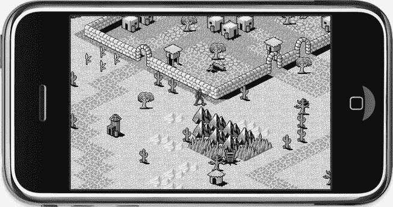
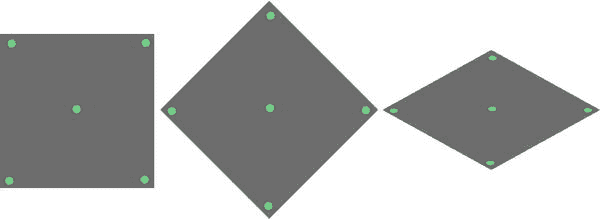
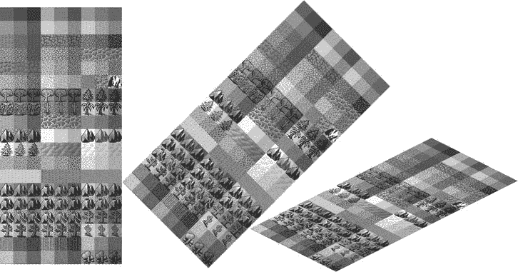
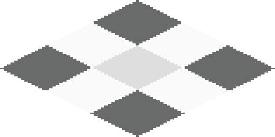
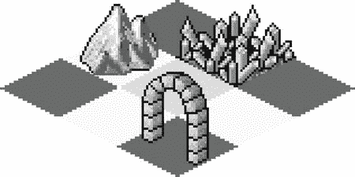
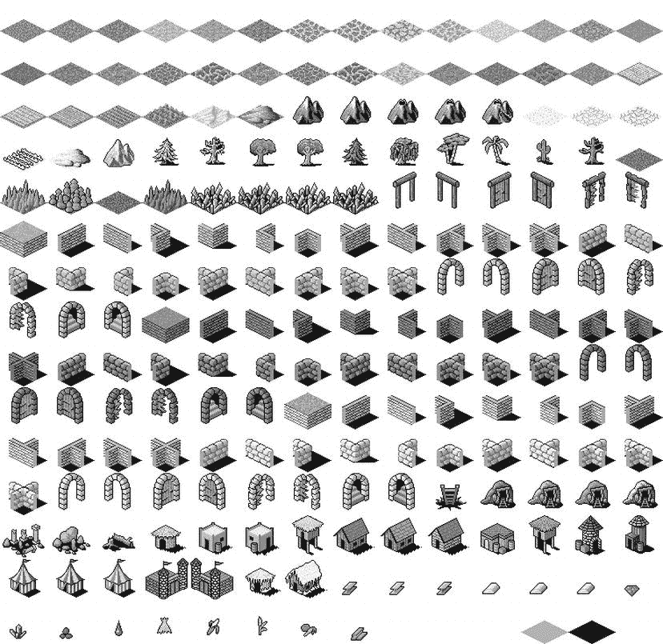
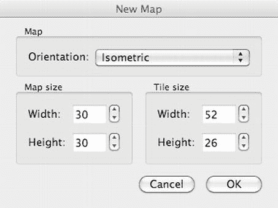

# 等距瓦片地图

通过等距瓦片地图，你可以两全其美——使用二维图形实现三维效果。这就是等距瓦片地图游戏如此受欢迎的原因。等距瓦片地图游戏在 20 世纪 90 年代末开始崭露头角，但随着台式电脑和游戏机 3D 渲染性能的提升而逐渐消失。近年来，它们在移动游戏和网页游戏中强势回归，因为在这些场景下，3D 渲染成本高昂或不可用。例子包括从《创世纪 VII》和《暗黑破坏神》等经典电脑角色扮演游戏，到当前 Facebook 上火热的《农场小镇》及其众多官方和非官方衍生游戏。

等距游戏允许你使用相对简单的图形和工具，创建看似具有空间深度的可信游戏世界。此外，与真正的 3D 计算机图形相比，2D 图形对设备性能的要求要低得多。

图 11-1 展示了本章将要构建的等距瓦片地图游戏示例。你将控制一个忍者角色在这个世界中潜行，避开与墙壁和山脉的碰撞。忍者还能够隐藏在树木和仙人掌等特定物体后面。

图 11-1. 一个等距瓦片地图游戏

**注意** 本章使用的所有瓦片集均由 David E. Gervais 创建，并依据知识共享许可协议发布。你可以在 `http://pousse.rapiere.free.fr/tome/index.htm` 下载他的更多作品。

## 设计等距瓦片图形

为了帮助您理解如何设计等距图形，我首先会介绍投影的概念。在 3D 世界中，您可以从各个角度观察物体，因为 3D 世界可以自由地将 3D 世界从任何角度和位置投射到您的二维屏幕上。这种从三维世界到二维屏幕的转换被称为*透视投影*。拍照也是现实世界到二维图像的透视投影的一种形式。这两种投影都保留了观察者视角的透视关系。

在等距瓦片地图世界中，每个独立的瓦片地图图像已经是看似三维的物体到平面上的投影。这种投影通常使用一种称为*等距投影*的特殊平行投影形式来执行。图像会或多或少地发生倾斜，但我们的大脑仍然能将其识别为三维物体。

**提示**：要了解更多关于各种投影技术及其技术细节的信息，我建议访问维基百科上关于平行投影的部分：`http://en.wikipedia.org/wiki/Parallel_projection`。

就瓦片地图而言，图 11-2 展示了从正交图像创建等距投影的具体步骤。首先将正方形旋转 45 度，然后沿其`y`轴进行缩放，使其呈现出典型的等距菱形形状。

图 11-2。 通过将正交图形旋转 45 度然后垂直压缩，将其转为等距图形

然而，图 11-2 只是说明等距形状投影的理论方法。您不能简单地通过旋转和压缩来将正交图像转换为等距图像，因为旋转会影响图像内容。这样只会看起来平坦且非常错误，就像图 11-3 那样。

图 11-3。 将正交瓦片集转换为等距瓦片集——事情没那么简单！

相反，请将图 11-2 中的菱形形状视为您的地面绘图画布。您可以设计的最简单的等距瓦片是平坦的地面瓦片。只需用特定图案填充菱形，即可获得可用的等距瓦片。图 11-4 展示了许多纯色的等距瓦片并排放置在一起，形成了一种地面图案。地面瓦片并不引人注目，看起来非常平坦。但它们作为游戏世界的背景层是必不可少的。

图 11-4。 地面等距瓦片没有深度。它们被用作坚实的表面区域

要为等距瓦片地图增加实际的视觉深度，您需要拥有超出菱形形状范围的物体瓦片。最常用的方法是绘制三维物体，就好像从 45 度角观看它们，然后将其向上并越过菱形形状绘制，通常延伸不超过一个瓦片的高度。在图 11-5 的示例中，通过观察门口可以很清楚地看到这一点。门拱主要绘制在门的框架所在瓦片之上（即上方的等距瓦片）上。这赋予了门拱视觉深度。

图 11-5。 通过绘制高度可达菱形形状两倍的物体来增加深度

等距瓦片地图允许物体瓦片相互重叠，因为瓦片是从后向前绘制的，这意味着离观察者更近的物体瓦片总是绘制在它们后面的瓦片之上，从而增加了深度感。但这种方法需要精心设计每个瓦片和瓦片地图本身，因为过多的重叠或重叠错误的瓦片会迅速破坏深度的错觉。

作为一个良好实践，尽量避免重叠形状差异很大但使用相同或相似颜色板的物体瓦片。例如，在图 11-5 的例子中，您不会想将水晶瓦片直接放在门拱后面。这些瓦片对比度的损失和轮廓的融合很容易破坏对深度的感知。

同样，尽管您可以创建高度远超两倍瓦片高度的等距物体瓦片，但如果物体显得非常高，很难创造出令人信服的 3D 效果，因为玩家只能看到瓦片地图的一部分。如果您正在建造一座巨大的城堡，其墙壁有十几个瓦片高，并且玩家从下方接近它，这些墙壁很容易被误认为是一大块地面。您甚至可能创造出像 M. C. 埃舍尔作品那样的视错觉，因为等距瓦片不会因为距离屏幕更远而变小。因此，在设计等距瓦片和瓦片地图时，在可行与不可行之间总有一条细微的界限。

图 11-6 展示了一个精心制作的等距瓦片集`dg_iso32.png`，其中包含了多样的地面瓦片；物体瓦片如墙壁、树木和房屋；以及可以放置在任何地面瓦片上的装饰物或物品。该集中的瓦片每个大小为`54x49`像素。高度可以任意选择；可以高于或低于`49`像素，这取决于您希望在瓦片地图中瓦片之间的重叠程度。菱形形状的实际高度是`27`像素。这在您随后使用 Tiled (Qt) 地图编辑器创建瓦片地图时变得重要。

图 11-6。 David Gervais 精心制作的等距瓦片集

## 使用 Tiled 编辑等距瓦片地图

您将再次使用 Tiled 地图编辑器来创建等距瓦片地图。基本的瓦片地图编辑与正交地图相同，但您必须遵循某些关键步骤来正确设置一个新的等距瓦片地图并加载一个等距瓦片集。

### 创建新的等距瓦片地图

打开 Tiled 并选择 File  New 以打开图 11-7 中的新建地图对话框。将方向设置为等距（Isometric），地图大小设置为宽和高均为 30 个瓦片，这对于我们的示例项目来说正合适。这里奇怪的是瓦片尺寸的宽和高，看起来有些偏差。

图 11-7。 在 Tiled 中创建新的等距瓦片地图

我之前提到过，`dg_iso32.png`中的单个瓦片是`54x49`像素。在铺设瓦片时必须考虑的菱形形状的尺寸是`54x27`像素。然而，新建地图对话框中的瓦片尺寸是`52x26`。这是因为 David Gervais 设计他的瓦片时，需要在水平方向重叠`2`像素，垂直方向重叠`1`像素，以闭合瓦片之间的所有间隙。

这种偏移是有意为之，因为等距瓦片通常被设计成彼此稍有重叠。在这种情况下，Tiled 等距地图中瓦片的尺寸必须比瓦片集中菱形形状的实际尺寸少`2`像素宽和`1`像素高。其他等距瓦片集可能需要不同的偏移量，甚至可能完全不需要偏移。

