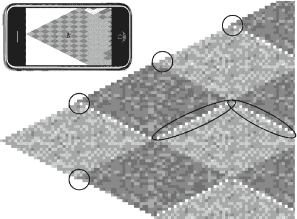
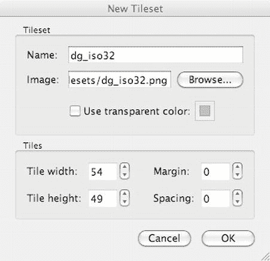
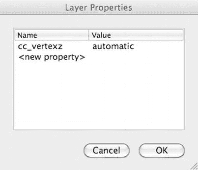
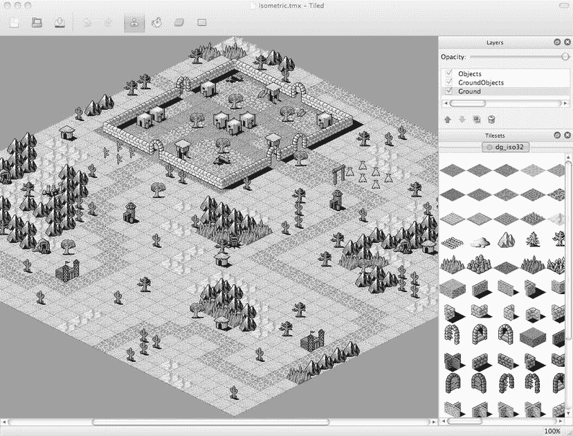
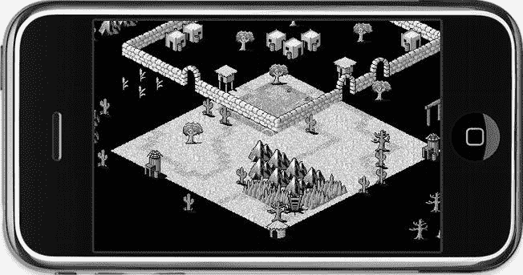
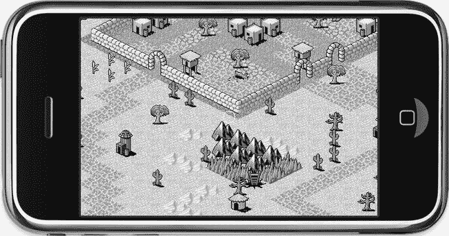
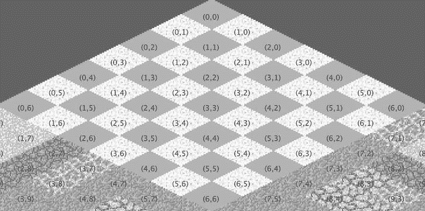

# 排版后的文本

如果你看到了像图 11-8 中那样的异常显示，说明你在使用 David Gervais 的图块集创建新的等距地图时，设置了错误的图块尺寸。你可以在项目的`Resources`文件夹中找到这个错误的地图文件 `isometric-no-offset.tmx`，以供演示参考。



图 11-8.  此类异常显示表明存在图块尺寸偏移的问题

如果你确实犯了错误，选错了偏移量，并且不想放弃已经花费数小时设计好的地图，或者你出于其他原因想要调整地图尺寸或图块集尺寸，有一种简单的方法可以实现，但这需要直接操作 TMX 文件，因为 Tiled 本身没有提供这样的选项。

下面的技巧可以让你轻松尝试各种偏移量，直到调整到正确的效果。如果 Tiled 正在运行，请先关闭它，然后在你的 Xcode 项目中选择 TMX 文件；你会看到它以纯文本 XML 文件的形式显示。你也可以使用任何其他文本编辑器编辑该文件。在文件开头，你会找到地图区域：

```
<map version = "1.0" orientation = "isometric" width = "30" height = "30" tilewidth = "54"←
    tileheight = "27">
```

你可以编辑 `tilewidth` 和 `tileheight` 参数，直到找到地图正确的偏移量。同样，如果你在确定所使用的等距图块集的图块大小时遇到问题，也可以修改图块集的 `tilewidth` 和 `tileheight` 参数：

```
<tileset firstgid = "1" name = "dg_iso32" tilewidth = "54" tileheight = "49">
    <image source = "dg_iso32.png"/>
</tileset>
```

在对 TMX 文件进行任何手动修改后，请确保关闭并在 Tiled 中重新加载该文件，因为 Tiled 不会自动重新加载文件。

### 创建新的等距图块集

接下来，你需要加载一个包含等距图块的图块集。本章将使用 Iso`Tilemap01` 项目的 `Resources` 文件夹中的 `dg_iso32.png` 图块集图像。在 Tiled 中，选择 地图  新建图块集... 并浏览到 `dg_iso32.png` 文件。

请注意，Tiled 会根据“新建地图”对话框中的设置设置默认的图块宽度和高度，如图 11-7 所示。对于等距地图，由于等距图块的重叠，始终需要修正这些默认值。正如我之前提到的，`dg_iso32.png` 图块集的图块宽度为 54 像素，图块高度为 49 像素。请注意，你必须使用等距图块的完整画布高度，而不是菱形的高度（27 像素）。图 11-9 显示了该图块集的正确设置。



图 11-9.  添加宽度为 54 像素、高度为 49 像素的图块集

### 制定基本原则

设计等距地图最重要的规则是，你至少需要两个图层，以便游戏角色可以走在某些图块后面。一个图层用于平坦的地面对象和地板图块，另一个图层用于所有其他对象，这些对象要么与其他图块重叠，要么不是完全不透明的，例如物品。在图 11-6 的图块集中，前两行是地面图块，需要放在地面层上，而第 3 行的山脉以及第 4 行及之后的几乎所有图块都需要放在对象层上。

在 Tiled 中，通过 图层  添加图块图层... 添加两个新图层，并将它们命名为 Ground 和 Objects。确保对象层绘制在地面层之上。在设计地图时，应格外小心，只在地面层上放置完全不透明的平面地板图块。所有其他图块都必须放在对象层上。

除非你执行以下步骤，否则 Cocos2d 在正确显示游戏角色以及部分遮挡图块后面的其他精灵方面会存在问题。作为解决方案的一部分，你需要向 Tiled 图层添加一个名为 `cc_vertexz` 的特殊属性。我稍后会更详细地解释该解决方案；现在，请选择 Ground 图层，然后点击 图层  图层属性... 添加一个名为 `cc_vertexz` 的新属性，并将其值设置为 −1000。对 Objects 图层执行相同操作，但不是输入 −1000，而是输入字符串 *automatic*，如图 11-10 所示。



图 11-10.  对象层需要将 `cc_vertexz` 属性设置为 automatic

现在，你可以花些时间设计一个好看的地图，或者直接加载我在 IsoTilemap01 项目中设计好的地图。请务必只将地板图块放在 Ground 图层上，并将所有重叠和透明的图块放在 Objects 图层上。完成后，你应该会得到一个像图 11-11 中那样漂亮的地图。



图 11-11.  使用 David Gervais 的图块集在 Tiled 中完成的等距地图

## 等距游戏编程

让我们在 cocos2d 游戏中使用这个等距地图。正如你所料，与正交地图相比，一些地方需要改变。特别是，你需要正确设置 cocos2d，以允许等距图块部分遮挡游戏角色。确定触摸到的图块也需要与正交地图不同的代码，并且在滚动时，你不能再在地图边界处停止滚动，因为地图本身是菱形形状的。

### 在 Cocos2d 中加载等距地图

这很简单。与正交地图相比，你无需更改任何内容，只需加载 `isometric.tmx` 文件而不是 `orthogonal.tmx` 即可。

```
CCTMXTiledMap* tileMap = [CCTMXTiledMap tiledMapWithTMXFile:@"isometric.tmx"];
[self addChild:tileMap z:-1 tag:TileMapNode];
tileMap.position = CGPointMake(−500, -300);
```

我立即将等距地图的位置设置为 −500, −300，假设地图大小为 30x30 图块。这大致将屏幕中心定位在图 11-11 中地图北部小村庄的下角。我这样做是为了说明下面关于为等距地图正确设置 Cocos2D 的要点，在图 11-12 中，你可以看到地图明显存在问题。



图 11-12.  没有 2D 投影，地面层将无法正确渲染

### 为等距地图设置 Cocos2d

如果你按照上述步骤创建了地图，并在 Tiled 中为地面层和对象层设置了 `cc_vertexz` 属性，那么生成的地图可能会像图 11-12 中那样。不知何故，地面层看起来被放大了很多，而对象层的图块似乎悬浮在半空中。看起来是个可怕的地方。

解决此问题并启用重叠精灵正确渲染的方法是，以不同于 Xcode 中 cocos2d 应用程序模板设置的方式初始化 cocos2d。它以一种标准方式初始化 cocos2d，这对大多数游戏来说没问题，但无法与等距地图游戏正常配合使用。在 IsoTilemap01 项目中，cocos2d 启动代码被修改为代码清单 11-1 中的代码，更改和添加的部分以粗体突出显示。

***代码清单 11-1.***  手动初始化 cocos2d 的 EAGLView


```objc
- (BOOL)application:(UIApplication *)application didFinishLaunchingWithOptions:(NSDictionary *)launchOptions
{
    // 创建主窗口
    window_ = [[UIWindow alloc] initWithFrame:[[UIScreen mainScreen] bounds]];

    // 创建包含 RGB565 颜色缓冲区和 24 位深度缓冲区的 CCGLView
    CCGLView *glView = [CCGLView viewWithFrame:[window_ bounds]
                            pixelFormat:kEAGLColorFormatRGB565
                            depthFormat:GL_DEPTH_COMPONENT24_OES
                       preserveBackbuffer:NO
                              sharegroup:nil
                         multiSampling:NO
                       numberOfSamples:0];

    director_ = (CCDirectorIOS*)[CCDirector sharedDirector];
    [director_setProjection:kCCDirectorProjection2D];
    ...
```

对于等距瓦片地图，您需要修改两个地方。首先，需要启用 OpenGL 深度缓冲区，以便更精细地控制对象的 z 轴排序。其次，`CCDirector` 必须使用 2D 投影才能与深度缓冲区协同工作。

**提示** 如果您是 Kobold2D 用户，可以在 `config.lua` 文件中进行这些修改。找到 `GLViewDepthFormat` 和 `Enable2DProjection` 设置，并将其修改为以下值：
`GLViewDepthFormat` = `GLViewDepthFormat.Depth24Bit,`
`Enable2DProjection` = `YES,`

您需要先创建一个 `UIWindow`，然后决定使用哪种 `CCDirector` 类型，并将动画间隔设置为每秒 60 帧。这是默认行为。

`EAGLView` 这行代码很重要，因为为了使重叠的瓦片正确渲染，您必须通过 `depthFormat` 参数指定一个深度缓冲区。本例中使用了 `GL_DEPTH_COMPONENT24_OES`，它会创建一个 24 位的深度缓冲区。为了节省内存，您也可以使用可能已足够的 16 位深度缓冲区。

深度缓冲使得 OpenGL 能够判断某个像素是在另一个像素的前面还是后面，从而决定是实际绘制新像素还是丢弃它。这会带来额外的内存开销——在 Retina 设备上，一个 24 位深度缓冲区需要接近 2 MB 的内存——但它能使精灵和瓦片正确地相互重叠。

初始化代码中另一个非常重要的行是 `setProjection`，它将 cocos2d 设置为 2D 投影模式。这会改变几个影响 cocos2d 渲染节点的 OpenGL 参数。在这种情况下，它修复了图 11-12 中地面层未能按预期渲染的问题，最终结果如图 11-13 所示。同时，它也允许您通过使用精灵的 `vertexZ` 属性而非 `zOrder` 属性来精细调整精灵的 z 轴顺序。



图 11-13 使用 2D 投影后，地面层按预期显示

默认情况下，当您通过 `addChild` 方法添加节点时，cocos2d 会基于 z 值进行节点排序。z 值较低的节点会在 z 值较高的节点之前绘制。具有相同 z 值的节点将按照它们被添加到节点层级结构的顺序绘制，这意味着后添加的节点会覆盖先添加的节点。这使 cocos2d 能够在不需要深度缓冲区的情况下对节点进行排序。

如果启用了深度缓冲，您还可以使用 `vertexZ` 属性自由更改每个节点的绘制顺序。为了让 `cc_vertexz` 瓦片地图属性发挥其神奇作用，cocos2d 需要这种自由。稍后，您将操作玩家角色的 `vertexZ` 属性，以正确地在其他等距瓦片的前方或后方绘制玩家精灵。

### 定位等距瓦片

接下来要做的是根据触摸位置确定被触摸瓦片的坐标。您可以在 IsoTilemap01 项目中找到这段代码。在讨论之前，我们先来看看 `TileMapLayer` 类目前的接口和实现是什么样的。这都是您之前见过的内容：

```
// TileMapLayer.h
#import "cocos2d.h"

enum
{
    TileMapNode = 0,
};

@interface TileMapLayer : CCLayer
{
}
+(CCScene *) scene;
@end

// TileMapLayer.m
#import "TileMapLayer.h"

@implementation TileMapLayer
+(CCScene *) scene
{
    CCScene *scene = [CCScene node];
    TileMapLayer *layer = [TileMapLayer node];
    [scene addChild: layer];
    return scene;
}

-(id) init
{
    self = [super init];
    if (self)
    {
     CCTMXTiledMap* tileMap = [CCTMXTiledMap tiledMapWithTMXFile:@"isometric.tmx"];
     [self addChild:tileMap z:-1 tag:TileMapNode];

// 偏移瓦片地图的起始位置以使其移入视图
     tileMap.position = CGPointMake(−500, -500);

self.isTouchEnabled = YES;
    }
    return self;
}
@end
```

如果您参考上一章的图 10-11，会记得正交瓦片地图的瓦片索引起始点 (0, 0) 位于左上角。现在，对于等距瓦片地图，不再有左上角这个概念。瓦片地图本身旋转了 45 度，这使得最顶部的瓦片成为原点。图 11-14 很好地说明了这一点。朝向右下方的瓦片 X 坐标递增，而朝向左下方的瓦片 Y 坐标递增。在一个由 30x30 瓦片组成的地图中，最底部的瓦片坐标为 29, 29。



图 11-14 等距瓦片地图的坐标系统

乍一看这可能有些奇怪，但如果您把头稍微向右倾斜，可能会注意到瓦片坐标的顺序与正交瓦片地图完全相同，只是整个地图旋转了 45 度。

现在您可以摆正头了，因为我需要您专注于修改后的 `tilePosFromLocation` 方法，该方法根据屏幕上的触摸位置计算被触摸瓦片的坐标。如代码清单 11-2 所示，它比正交瓦片地图的对应方法稍微复杂一些。

***代码清单 11-2.*** 根据触摸位置计算瓦片坐标

```
-(CGPoint) tilePosFromLocation:(CGPoint)location tileMap:(CCTMXTiledMap*)tileMap
{
    // 必须减去瓦片地图的位置，以防瓦片地图发生滚动
    CGPoint pos = ccpSub(location, tileMap.position);

    float halfMapWidth = tileMap.mapSize.width * 0.5f;
    float mapHeight = tileMap.mapSize.height;
    float pointWidth = tileMap.tileSize.width / CC_CONTENT_SCALE_FACTOR();
    float pointHeight = tileMap.tileSize.height / CC_CONTENT_SCALE_FACTOR();

    CGPoint tilePosDiv = CGPointMake(pos.x / pointWidth, pos.y / pointHeight);
    float inverseTileY = mapHeight - tilePosDiv.y;

    // 强制转换为整数确保结果是整数
    float posX = (int)(inverseTileY + tilePosDiv.x - halfMapWidth);
    float posY = (int)(inverseTileY - tilePosDiv.x + halfMapWidth);

    // 确保坐标在等距地图边界内
    posX = MAX(0, posX);
    posX = MIN(tileMap.mapSize.width - 1, posX);
    posY = MAX(0, posY);
    posY = MIN(tileMap.mapSize.height - 1, posY);

    return CGPointMake(posX, posY);
}
```


