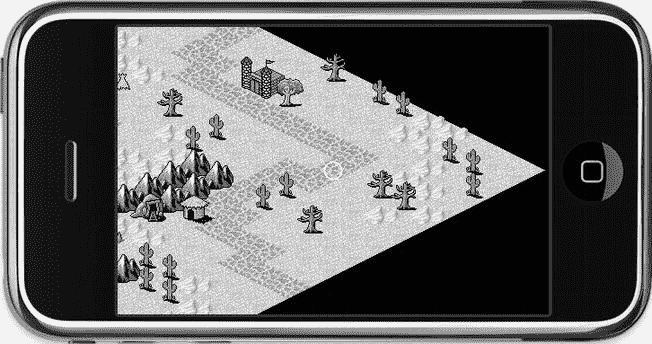
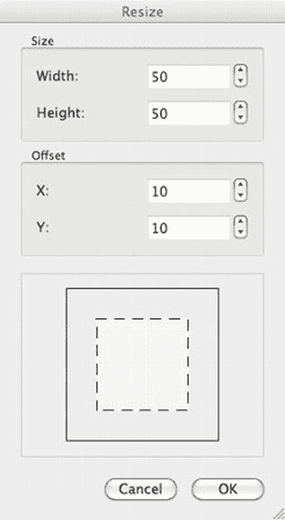
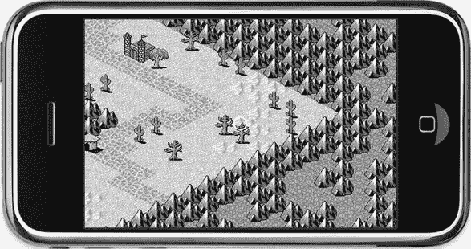
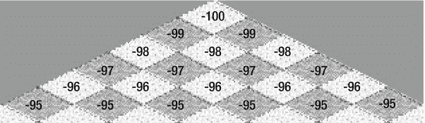
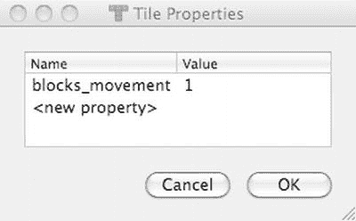

# Tilemap 位置减法与滚动处理

减去 tilemap 的位置以考虑其滚动，这与本方法的正交版本相同。接下来我创建了一些变量，只是为了代码更易读并减少打字量，然后将地图大小宽度除以一半。我创建了一个`CGPoint tilePosDiv`，它是 tilemap 内的像素位置除以 tilemap 的宽度和高度（以点为单位，而非像素），以及一个`inverseTileY`变量，它仅仅是 tilemap 的 y 坐标的倒数。这种反转是必要的，因为 tilemap 的 y 坐标从上往下计数，而屏幕的 y 坐标从下往上计数。

现在你可以开始实际计算触摸的瓦片的 x、y 坐标。计算从反转的 y 坐标开始，对于一个高度为 30 个瓦片的 tilemap，该坐标的范围在 0 到 29 之间。它定义了 tilemap 中的垂直位置，你将从这个位置开始水平查找 x 和 y 瓦片坐标。

如果你查看图 11-4 并定位瓦片坐标 (3,3)，这一点就变得更清楚了。你会注意到，当你在瓦片坐标 (3,3) 左侧沿水平线移动时，x 坐标减小，y 坐标增加：(2,4)、(1,5)、(0,6)。类似地，如果你向右移动，x 坐标增加，y 坐标减小：(4,2)、(5,1)、(6,0)。

这意味着你可以从`inverseTileY`位置获取 x 和 y 瓦片坐标。对于 x 瓦片坐标，你加上`tilePosDiv.x`坐标，然后减去`halfMapWidth`。对于 y 瓦片坐标，你从`inverseTileY`中减去`tilePosDiv.x`与`halfMapWidth`的和。

**提示** 我就不详细解释这个计算背后的数学概念了，因为你可以直接应用代码，无需做任何更改。如果你有兴趣了解等距投影及其背后数学的复杂细节，我推荐阅读 Herbert Glarner 在`www.gandraxa.com/isometric_projection.aspx`上精彩插图的文章。

通过应用 Objective-C 的`MIN`和`MAX`宏，我确保返回的瓦片坐标在 tilemap 的边界内。换句话说，对于等距 tilemap 项目使用的 30x30 的 tilemap，它将返回从 (0,0) 到 (29,29) 的坐标。

### 滚动等距 Tilemap

通过更新`tilePosFromLocation`方法以支持等距 tilemap，`IsoTilemap01`项目继续实现等距 tilemap 的滚动，使用`tilePosFromLocation`方法返回的瓦片坐标。与正交 tilemap 项目一样，你使用`centerTileMapOnTileCoord`方法来实现这一点，如代码清单 11-3 所示。

**代码清单 11-3.**  滚动屏幕以居中于特定瓦片坐标

```
-(void) centerTileMapOnTileCoord:(CGPoint)tilePos tileMap:(CCTMXTiledMap*)tileMap
{
    // 将 tilemap 居中于给定的瓦片位置
    CGSize screenSize = [CCDirector sharedDirector].winSize;
    CGPoint screenCenter = CGPointMake(screenSize.width * 0.5f,←
     screenSize.height * 0.5f);

    // 获取地面图层
    CCTMXLayer* layer = [tileMap layerNamed:@"Ground"];
    NSAssert(layer ! = nil, @"Ground layer not found!");

    // 内部瓦片 y 坐标偏移了 1
    tilePos.y - = 1;

    // 获取这些坐标处瓦片的像素坐标
    CGPoint scrollPosition = [layer positionAt:tilePos];

    // 对位置取反以考虑滚动
    scrollPosition = ccpMult(scrollPosition, -1);

    // 添加屏幕中心的偏移量
    scrollPosition = ccpAdd(scrollPosition, screenCenter);

    // 移动 tilemap
    CCAction* move = [CCMoveTo actionWithDuration:0.2f position:scrollPosition];
    [tileMap stopAllActions];
    [tileMap runAction:move];
}
```

首先，像之前一样确定屏幕中心位置。然后你想使用图层的便捷方法`positionAt`，它返回给定瓦片坐标的屏幕位置。为此，获取 Ground 图层并断言它存在。只要你所用的图层都使用相同大小的瓦片，具体使用哪个图层并不重要。

在调用`positionAt`方法之前，我必须从瓦片 y 坐标中减去 1，以修复一个持续的偏移问题。经验丰富的程序员可能会担心使用 0 的瓦片 y 坐标并减去 1 会导致无效索引并引发灾难性崩溃。但在这个例子中，`positionAt`方法并不将瓦片坐标用作索引，它可以处理任何瓦片坐标，甚至负数。

`positionAt`方法返回给定瓦片坐标在 tilemap 内的像素位置，并将其存储在`scrollPosition`变量中。这个方法并非等距 tilemap 专属；它对所有 tilemap 类型都有效：正交、等距和六边形。在内部，cocos2d 会检查当前使用的 tilemap 类型，然后使用相应的计算，因为它们的计算方式差异很大。如果你对这些计算的具体实现感兴趣，请查看 cocos2d 实现文件`CCTMXLayer.m`中的`positionForOrthoAt`、`positionForIsoAt`和`positionForHexAt`方法。

因为 tilemap 可能正在滚动，此时它会有一个负的位置，所以`scrollPosition`乘以 −1 以取反。之后，我将`screenCenter`位置加到它上面，就知道要滚动到哪里了。`move`动作与之前相同，将 tilemap 移动以使触摸的瓦片居中于屏幕上。

### 这个世界需要更好的结局

由于等距 tilemap 的菱形特性，滚动的 tilemap 不可避免地会显示出 tilemap 外部的部分，如图图 11-15 所示。确实，`tilePosFromLocation`方法确保返回的瓦片坐标始终在边界内，所以即使玩家触摸到 tilemap 外部，你也可以安全地使用该坐标。但如果你不想让玩家看到等距 tilemap 世界的尽头，你就必须使用一个技巧。



图 11-15. 我们知道的世界末日（而且它感觉不对劲）

打开 Tiled 并从 `IsoTilemap01` 项目的 `Resources` 文件夹加载 `isometric.tmx` 文件。你要做的是在现有地图周围添加一个边框，并用瓦片填充它，给人一种无法穿越区域的感觉。在 Tiled 中，使用 地图  调整地图大小…… 来调出图 11-16 所示的调整大小对话框。你需要在这个 tilemap 的每一边添加 10 个瓦片来完全填充边框。根据瓦片大小，你需要测试找出需要追加的最小瓦片数量。在这个例子中，输入 **50** 作为新的宽度和高度，并在偏移框中输入 **10**。这将使 tilemap 增大 20x20 个瓦片，并将之前编辑的所有内容移到中心，这样你就在每一边得到一个 10 个瓦片的边框。



图 11-16. 在 Tiled 中调整地图大小以添加边框


好的，作为一名高级文档工程师和翻译员，我将严格遵循您提供的注意事项和示例，将给定的英文文本翻译成中文。


您现在已经可以填充这个边界区域，以营造出地图中一片完全不可通行的区域的印象。选择较暗的地面砖块有助于向玩家提示此区域无法进入，当然，您还应该在`Objects`层上以及可玩区域的边界周围添加不可穿越的对象。最终效果应类似于图 11-17。我将我的版本保存在项目的`Resources`文件夹中，并命名为`isometric-with-border.tmx`。因此，如果您不想自行编辑，只需加载`isometric-with-border.tmx`文件来替代`isometric.tmx`文件。



图 11-17. 一个令人信服的不可通行地图边界区域

**注意**：图 11-17 中的不可通行区域看起来确实相当重复且乏味。您可能会想为此区域添加更多细节，但这是一把双刃剑。一方面，不可通行区域内更多的细节和变化会使其看起来更好。另一方面，这也可能误导玩家，让他们思考甚至更糟的是花费时间去尝试到达不可通行区域中那些看似可以造访的地点。例如，房屋或洞穴入口是玩家想要探索的地方，因此请避免在边界区域使用这些元素。玩家可能会假设那是一个秘密区域，他只需要弄清楚如何到达那里。如果玩家产生这种想法，对您的游戏是不利的。您不希望引诱玩家尝试那些完全不可能做到的事情。这只会浪费他们的时间，并最终导致挫败感。

`IsoTilemap02`项目通过定义可玩区域的内部瓦片坐标来实现防止滚动超出该区域的代码。我在`TileMapLayer`类中添加了两个`CGPoint`变量：`playableAreaMin`和`playableAreaMax`：

```objectivec
@interface TileMapLayer : CCLayer
{
    CGPoint playableAreaMin, playableAreaMax;
}
```

可玩区域变量在该类的`init`方法中被初始化，边界大小为 10 个瓦片：

```objectivec
-(id) init
{
    self = [super init];
    if (self)
    {
        ...

const int borderSize = 10;
        playableAreaMin = CGPointMake(borderSize, borderSize);
        playableAreaMax = CGPointMake(tileMap.mapSize.width - 1 - borderSize, ←
                                      tileMap.mapSize.height - 1 - borderSize);
    }
    return self;
}
```

可玩区域被定义为位于瓦片坐标`(10, 10)`到`(39, 39)`范围内的所有区域。此范围外的所有瓦片应被视为不属于游戏区域。剩下的工作就是更新`tilePosFromLocation`方法，替换`MIN`/`MAX`行以实现此可玩区域规则。您不再需要将瓦片坐标限制在整个瓦片地图的边界内，而是将其限制在可玩区域的边界内，如下所示：

```objectivec
posX = MAX(playableAreaMin.x, posX);
posX = MIN(playableAreaMax.x, posX);
posY = MAX(playableAreaMin.y, posY);
posY = MIN(playableAreaMax.y, posY);
```

如果您尝试此操作，就会发现只有可玩区域内的瓦片才能被居中显示在屏幕上。更重要的是，在可玩区域之外的点击不会被忽略；而是瓦片地图会尽可能滚动到您点击的瓦片附近。这样，您就不会破坏玩家对世界的印象——这个世界似乎远远超出了他们所能看到的范围。

## 添加可移动的玩家角色

通过添加一个在瓦片地图世界中移动的玩家角色，您会离一个实际的等距游戏更近一步。在此例中，我选择`ninja.png`作为玩家角色，并将其添加到`IsoTilemap02`项目中。玩家是一个派生自`CCSprite`的类，恰当地命名为`Player`。清单 11-4 展示了头文件。

***清单 11-4.***  `Player`类接口

```objectivec
#import < Foundation/Foundation.h>
#import "cocos2d.h"

@interface Player : CCSprite
{
}
+(id) player;
@end
```

清单 11-5 中的`+(id) player`方法使用`ninja.png`文件分配并初始化该精灵。

***清单 11-5.***  `Player`类实现

```objectivec
#import "Player.h"

@implementation Player
+(id) player
{
    return [[self alloc] initWithFile:@"ninja.png"];
}
@end
```

然后在`TileMapLayer`类的`init`方法中创建玩家：

```objectivec
#import "Player.h"

...

-(id) init
{
    self = [super init];
    if (self)
    {
        ...

CGSize screenSize = [CCDirector sharedDirector].winSize;

// 创建玩家并添加
        player = [Player player];
        player.position = CGPointMake(screenSize.width / 2, screenSize.height / 2);
        // 偏移玩家纹理以最佳匹配瓦片中心位置
        player.anchorPoint = CGPointMake(0.3f, 0.1f);
        [self addChild:player];
    }
    return self;
}
```

您还需要更新`TileMapLayer`接口以添加`player`实例变量，并向前声明`Player`类：

```objectivec
@class Player;

@interface TileMapLayer : CCLayer
{
    CGPoint playableAreaMin, playableAreaMax;
    Player* player;
}
```

玩家位置被故意设置为屏幕中心。因为您已经有了一个能将特定瓦片居中显示在屏幕上的方法，将玩家精灵也居中显示在屏幕上，使其表现得仿佛正在瓦片地图上移动，而实际上它始终保持在相同位置。您完全不需要移动玩家精灵！

玩家的`anchorPoint`从其默认值`(0.5f, 0.5f)`偏移了一点，变为`(0.3f, 0.1f)`，目的是大致将精灵的脚部对准瓦片的中心位置。否则，它看起来可能不正确，因为所有其他游戏对象（如树木和仙人掌）的根部，严格来说，都位于瓦片的中心。因此，尝试将玩家的脚也放置在该位置是很自然的。

如果现在尝试运行，尽管玩家精灵从未移动，但看起来就像玩家正在瓦片地图世界中行走。完美！

嗯，还不完全是。如果您移动经过山脉、墙壁、树木和建筑物，玩家精灵总是绘制在它们前面。

### 使玩家能移动到瓦片后方

为了允许玩家被其前方的对象瓦片（如建筑物、墙壁、树木等）部分遮挡，您需要在玩家在地图上移动时更改其`vertexZ`值。在本章开头，当您在 Tiled 中创建`Objects`层时，您为其赋予了一个名为`cc_vertexz`的属性并将其设置为`automatic`。这指示 cocos2d 为该层中的瓦片分配连续的`vertexZ`值。图 11-18 显示了在一个大小为 50x50 瓦片的瓦片地图中，瓦片被分配了哪些`vertexZ`值。这与图 11-14 中显示的瓦片索引不同，因为`vertexZ`值在 X 和 Y 方向上都会增加。可以说，`vertexZ`值随着瓦片地图的每一水平行而递减。



图 11-18. 50x50 瓦片地图中各瓦片的`vertexZ`值

这在代码中通过添加到`Player`类中的`updateVertexZ`方法体现：

```objectivec
-(void) updateVertexZ:(CGPoint)tilePos tileMap:(CCTMXTiledMap*)tileMap
{
    float lowestZ = −(tileMap.mapSize.width + tileMap.mapSize.height);
    float currentZ = tilePos.x + tilePos.y;
    self.vertexZ = lowestZ + currentZ – 1.5f;
}
```


好的，作为高级文档工程师和翻译员，我将严格遵循您提供的注意事项和示例格式，对给定的英文文本进行翻译。


最低的`vertexZ`值是地图宽度和高度的负数和。同样，你可以获取图块地图中任意图块坐标与最低`vertexZ`值的差值，即坐标`(0, 0)`处的图块。这是该位置`X`坐标和`Z`坐标之和。例如，`(2, 2)`位置的图块比最低`vertexZ`值小`2 + 2 = 4`。如果两者相加，得到`−100 + 4 = −96`。由于玩家精灵是在图块地图之后添加到`TileMapLayer`中的，它将渲染在具有相同`vertexZ`值的图块之上。因此，我还减去`1.5`，这样如果玩家站在图块坐标`(2, 2)`上，最终的`vertexZ`值为`−96.5`。这也会将玩家置于同一图块上任何对象的后面。如果你希望玩家在同一图块上位于任何对象的前面，则应减去`1.0f`或更小值。

为了使此代码生效，还需要在`Player`类的接口中定义`updateVertexZ`方法：

```objectivec
@interface Player : CCSprite
{
}
+(id) player;
-(void) updateVertexZ:(CGPoint)tilePos tileMap:(CCTMXTiledMap*)tileMap;
@end
```

然后，每次移动图块地图时都应调用`updateVertexZ`方法，这在`TileMapLayer`类的`ccTouchesBegan`方法中完成：

```objectivec
-(void) ccTouchesBegan:(NSSet *)touches withEvent:(UIEvent *)event
{
    CCNode* node = [self getChildByTag:TileMapNode];
    NSAssert([node isKindOfClass:[CCTMXTiledMap class]], @"not a CCTMXTiledMap");
    CCTMXTiledMap* tileMap = (CCTMXTiledMap*)node;

    CGPoint touchLocation = [self locationFromTouches:touches];
    CGPoint tilePos = [self tilePosFromLocation:touchLocation tileMap:tileMap];

    [self centerTileMapOnTileCoord:tilePos tileMap:tileMap];

    // update the player's vertexZ
    [player updateVertexZ:tilePos tileMap:tileMap];
}
```

如果现在尝试，你会看到忍者玩家会像优秀的忍者那样隐藏在墙壁、树木和其他大型物体后面。

### 逐图块移动玩家

到目前为止，玩家（实际上是屏幕）移动的速度取决于触摸点离屏幕中心的距离。玩家也可以在图块间自由移动，但他实际上应该只沿四个方向逐图块移动。`IsoTilemap03`项目将控制机制改为：只要手指停留在屏幕上，就可以让玩家沿四个允许的方向之一移动。移动方向取决于你相对于玩家触摸屏幕的位置。

这需要对`TileMapLayer`接口进行一些补充，如清单 11-6 所示。

***清单 11-6.***  `TileMapLayer`类接口

```objectivec
typedef enum
{
    MoveDirectionNone = 0,
    MoveDirectionUpperLeft,
    MoveDirectionLowerLeft,
    MoveDirectionUpperRight,
    MoveDirectionLowerRight,

    MAX_MoveDirections,
} EMoveDirection;

@class Player;
@interface TileMapLayer : CCLayer
{
    CGPoint playableAreaMin, playableAreaMax;
    Player* player;
    CGPoint screenCenter;
    CGRect upperLeft, lowerLeft, upperRight, lowerRight;
    CGPoint moveOffsets[MAX_MoveDirections];
    EMoveDirection currentMoveDirection;
}
```

`EMoveDirection enum`稍后用于确定玩家意图行走的方向，其中`MoveDirectionNone`表示不移动。让我们看看清单 11-7 中`TileMapLayer`类的`init`方法实现的变化。

***清单 11-7.***  初始化玩家的移动方向

```objectivec
// divide the screen into 4 areas
screenCenter = CGPointMake(screenSize.width / 2, screenSize.height / 2);
upperLeft = CGRectMake(0, screenCenter.y, screenCenter.x, screenCenter.y);
lowerLeft = CGRectMake(0, 0, screenCenter.x, screenCenter.y);
upperRight = CGRectMake(screenCenter.x, screenCenter.y, screenCenter.x,←
    screenCenter.y);
lowerRight = CGRectMake(screenCenter.x, 0, screenCenter.x, screenCenter.y);

moveOffsets[MoveDirectionNone] = CGPointZero;
moveOffsets[MoveDirectionUpperLeft] = CGPointMake(−1, 0);
moveOffsets[MoveDirectionLowerLeft] = CGPointMake(0, 1);
moveOffsets[MoveDirectionUpperRight] = CGPointMake(0, -1);
moveOffsets[MoveDirectionLowerRight] = CGPointMake(1, 0);

currentMoveDirection = MoveDirectionNone;

// continuously check for walking
[self scheduleUpdate];
```

四个`CGRect`变量`upperLeft`、`lowerLeft`、`upperRight`和`lowerRight`将屏幕划分为四个象限，每个象限都是一个触摸区域，用于按所需方向移动玩家。因此，触摸屏幕的右下区域将沿着图块地图向右和向下移动玩家。

`moveOffsets`数组为每个移动方向包含一个`CGPoint`，当将其添加到当前图块坐标时，将返回该方向上的下一个图块坐标。`currentMoveDirection`变量仅保存玩家当前的移动方向，并且需要`scheduleUpdate`来持续检查玩家是否仍想移动。

`ccTouchesBegan`方法（清单 11-8）已更改为仅检查屏幕的哪个象限接收了触摸，然后设置`currentMoveDirection`。新添加的`ccTouchesEnded`方法将`currentMoveDirection`重置为`MoveDirectionNone`。

***清单 11-8.***  根据触摸位置移动玩家

```objectivec
-(void) ccTouchesBegan:(NSSet *)touches withEvent:(UIEvent *)event
{
    // get the position in tile coordinates from the touch location
    CGPoint touchLocation = [self locationFromTouches:touches];

    // check where the touch was and set the move direction accordingly
    if (CGRectContainsPoint(upperLeft, touchLocation))
    {
        currentMoveDirection = MoveDirectionUpperLeft;
    }
    else if (CGRectContainsPoint(lowerLeft, touchLocation))
    {
        currentMoveDirection = MoveDirectionLowerLeft;
    }
    else if (CGRectContainsPoint(upperRight, touchLocation))
    {
        currentMoveDirection = MoveDirectionUpperRight;
    }
    else if (CGRectContainsPoint(lowerRight, touchLocation))
    {
        currentMoveDirection = MoveDirectionLowerRight;
    }
}

-(void) ccTouchesEnded:(NSSet *)touches withEvent:(UIEvent *)event
{
        currentMoveDirection = MoveDirectionNone;
}
```

主要工作现已转移到`update`方法，该方法被调度为每帧调用：

```objectivec
-(void) update:(ccTime)delta
{
    CCNode* node = [self getChildByTag:TileMapNode];
    NSAssert([node isKindOfClass:[CCTMXTiledMap class]], @"not a CCTMXTiledMap");
    CCTMXTiledMap* tileMap = (CCTMXTiledMap*)node;

    // if the tilemap is currently being moved, wait until it's done moving
    if (tileMap.numberOfRunningActions == 0)
    {
        if (currentMoveDirection != MoveDirectionNone)
        {
            CGPoint tilePos = [self tilePosFromLocation:screenCenter tileMap:tileMap];

            CGPoint offset = moveOffsets[currentMoveDirection];
            tilePos = CGPointMake(tilePos.x + offset.x, tilePos.y + offset.y);
            tilePos = [self ensureTilePosIsWithinBounds:tilePos];

            [self centerTileMapOnTileCoord:tilePos tileMap:tileMap];
        }
    }

    // continuously fix the player's Z position
    CGPoint tilePos = [self floatTilePosFromLocation:screenCenter tileMap:tileMap];
    [player updateVertexZ:tilePos tileMap:tileMap];
}
```

图块地图只有在移动时才有正在运行的动作，因此我仅当其当前没有正在运行的动作并且`currentMoveDirection`不是`MoveDirectionNone`时，才为其分配新的移动动作。`tilePosFromLocation`不再从屏幕触摸位置获取，而是使用`screenCenter`位置。由于玩家始终在屏幕上居中，这可以方便地获取屏幕中心处的图块坐标。


`moveOffsets`数组返回一个`CGPoint`，该点被加到`tilePos`上，以得到我们打算移动到的目标瓦片坐标。由于这可能在可玩区域之外，新的瓦片坐标会通过`ensureTilePosIsWithinBounds`方法进行处理。这段代码与我们之前用来将瓦片坐标保持在可玩区域内的代码相同，但被重构到了一个单独的方法中，以避免重复代码。最后，调用`centerTileMapOnTileCoord`方法来移动屏幕并将其居中到目标瓦片坐标，同时还会添加移动动作。

方法`ensureTilePosIsWithinBounds`和`floatTilePosFromLocation`已被重构为可复用。以前，它们被合并到了`tilePosFromLocation`方法中。重构后的方法仍然执行相同的功能，但现在可以供其他代码单独使用，例如将瓦片位置调整到可玩区域内。以下是重构后的方法：

```
-(CGPoint) ensureTilePosIsWithinBounds:(CGPoint)tilePos
{
    tilePos.x = MAX(playableAreaMin.x, tilePos.x);
    tilePos.x = MIN(playableAreaMax.x, tilePos.x);
    tilePos.y = MAX(playableAreaMin.y, tilePos.y);
    tilePos.y = MIN(playableAreaMax.y, tilePos.y);
    return tilePos;
}

-(CGPoint) floatTilePosFromLocation:(CGPoint)location tileMap:(CCTMXTiledMap*)tileMap
{
    CGPoint pos = ccpSub(location, tileMap.position);
    float halfMapWidth = tileMap.mapSize.width * 0.5f;
    float mapHeight = tileMap.mapSize.height;
    float tileWidth = tileMap.tileSize.width / CC_CONTENT_SCALE_FACTOR();
    float tileHeight = tileMap.tileSize.height / CC_CONTENT_SCALE_FACTOR();

CGPoint tilePosDiv = CGPointMake(pos.x / tileWidth, pos.y / tileHeight);
    float mapHeightDiff = mapHeight - tilePosDiv.y;

// Cast to int makes sure that result is in whole numbers
    float posX = (mapHeightDiff + tilePosDiv.x - halfMapWidth);
    float posY = (mapHeightDiff - tilePosDiv.x + halfMapWidth);
    return CGPointMake(posX, posY);
}

-(CGPoint) tilePosFromLocation:(CGPoint)location tileMap:(CCTMXTiledMap*)tileMap
{
    CGPoint pos = [self floatTilePosFromLocation:location tileMap:tileMap];
    pos = [self ensureTilePosIsWithinBounds:CGPointMake((int)pos.x, (int)pos.y)];
    return pos;
}
```

随着玩家现在在瓦片地图上逐格移动，我们可以不断更新玩家的`vertexZ`值。以前，`vertexZ`值会被立即设置为目标瓦片坐标，这导致玩家在移动时会绘制在所有他正在经过的对象瓦片之下。通过随着玩家在瓦片地图上移动而持续更新`vertexZ`值，他的 Z 轴位置现在更加准确，并消除了之前`IsoTilemap02`项目中的任何重叠视觉异常。

**注意** 当你在拱门下移动玩家时，你会注意到他经过拱门时会突然出现在拱门前面或消失在拱门后面，具体取决于他移动的方向。这是 2D 等距瓦片地图无法避免的副作用。你只能通过将拱门绘制得比游戏中的任何角色都高来减少这种效果。你也可以将拱门分割成三个瓦片，这样只有中间部分是可通行的，而拱门的两侧则被视为阻挡瓦片。

### 阻止玩家碰撞

最后，你不希望玩家穿墙或翻山。他可能是个忍者，但没那么厉害。为了解决这个问题，在 Tiled 中通过 Layer -> 添加 Tile Layer... 添加一个新图层，将其命名为`Collisions`；然后将“不透明度”滑块（位于图层列表上方）移动到大约中间位置。现在，从瓦片集中选择一个与瓦片地图颜色对比强烈的瓦片，你将用它来在瓦片地图上绘制碰撞区域，尽管不透明度较低，但这些区域应该易于识别。

我选择了其中一个紫色瓦片。右键单击你选择的瓦片，然后从上下文菜单中选择“Tile Properties...”。请注意，此命令在 Tiled 菜单中没有对应的项；只能通过右键单击瓦片来访问瓦片属性。在图 11-19 所示的“Tile Properties”对话框中，添加一个名为`blocks_movement`的属性，并将其值设置为 1。实际上，我会在代码中忽略这个值；重要的是存在`blocks_movement`这个值。



图 11-19. 添加一个`blocks_movement`瓦片属性

选中`Collisions`图层后，使用设置了`blocks_movement`属性的瓦片在瓦片地图上绘制。在你不想让玩家移动到的任何地方（例如，墙壁、山脉、房屋等）放置一个瓦片。

`IsoTilemap03`项目中的瓦片地图`isometric-with-border.tmx`已经预先准备好了`Collisions`图层。`Collisions`图层仅用于检查一个瓦片是否可以移动，不应在游戏中显示，因此在`TileMapLayer`类的`init`方法中，你做的第一件事就是将这个图层设为不可见（参见清单 11-9）。

***清单 11-9.*** 隐藏碰撞图层

```
CCTMXTiledMap* tileMap = [CCTMXTiledMap tiledMapWithTMXFile:←
    @"isometric-with-border.tmx"];
[self addChild:tileMap z:-1 tag:TileMapNode];

CCTMXLayer* collisionsLayer = [tileMap layerNamed:@"Collisions"];
collisionsLayer.visible = NO;
```

为了检查某个瓦片坐标是否被阻挡，我在`IsoTilemap03`项目中添加了`isTilePosBlocked`方法，如清单 11-10 所示。

***清单 11-10.*** 确定一个瓦片是否被阻挡

```
-(BOOL) isTilePosBlocked:(CGPoint)tilePos tileMap:(CCTMXTiledMap*)tileMap
{
    CCTMXLayer* layer = [tileMap layerNamed:@"Collisions"];
    NSAssert(layer ! = nil, @"Collisions layer not found!");

BOOL isBlocked = NO;
    unsigned int tileGID = [layer tileGIDAt:tilePos];
    if (tileGID > 0)
    {
     NSDictionary* tileProperties = [tileMap propertiesForGID:tileGID];
     id blocks_movement = [tileProperties objectForKey:@"blocks_movement"];
     isBlocked = (blocks_movement ! = nil);
    }

return isBlocked;
}
```

该代码首先尝试从`Collisions`图层获取给定瓦片坐标处的瓦片。如果那里没有瓦片，`tileGID`将为 0，你可以安全地假设这个瓦片未被阻挡。但如果`tilePos`坐标处存在有效的`tileGID`，则会查询`tileMap`以获取该瓦片的属性，这会返回一个`NSDictionary`对象。如果该字典的`objectForKey`方法为键名为`blocks_movement`返回了一个有效的对象，则该瓦片被阻挡。

检查碰撞的位置在`update`方法中，如清单 11-11 所示。

***清单 11-11.*** 在 update 方法中检查碰撞

```
-(void) update:(ccTime)delta
{
    ...

// if the tilemap is currently being moved, wait until it's done moving
    if ([tileMap numberOfRunningActions] == 0)
    {
     if (currentMoveDirection ! = MoveDirectionNone)
     {
     CGPoint tilePos = [self tilePosFromLocation:screenCenter tileMap:tileMap];

CGPoint offset = moveOffsets[currentMoveDirection];
     tilePos = CGPointMake(tilePos.x + offset.x, tilePos.y + offset.y);
     tilePos = [self ensureTilePosIsWithinBounds:tilePos];

if ([self isTilePosBlocked:tilePos tileMap:tileMap] == NO)
     {
     [self centerTileMapOnTileCoord:tilePos tileMap:tileMap];
     }
     }
    }

...
}
```

在移动瓦片地图之前，会调用`isTilePosBlocked`方法来查看玩家是否真的可以移动到那里。如果目标瓦片坐标未被阻挡，他将会移动；否则，他不会移动。

## 向游戏中添加更多内容


到目前为止，我们已经实现了一个游戏，其中你引导一个角色穿过等距瓦片地图世界。隐藏在树木后面以及避免碰撞只是在这个世界中构建游戏的基础。如果你想在世界中添加更多角色，无论是敌人还是非玩家角色（NPC），该怎么办？

原则上，你让它们动起来的方式与移动玩家一样，区别在于玩家居中显示在屏幕上，而 NPC 可以位于瓦片地图上的任何位置。尽管如此，你只需确定 NPC 应该朝哪个方向行走，然后像在`centerTileMapOnTileCoord`方法中移动图层一样移动它。唯一的区别是，动作在 NPC 上执行，并且方向需要反转，因为你移动的不是图层，而是 NPC 在图层上移动。

一旦你有了四处游荡的 NPC，下一步就是思考如何让它们从 A 点移动到 B 点，同时避开障碍物并找到最短路径。答案是 A*寻路算法，这是一种行业标准，并已针对许多情况进行过调整和优化。基于瓦片的游戏是这种特定寻路算法的理想候选，因为角色的位置通常被限制在瓦片坐标上。要深入了解 A*寻路算法，并且坦率地说，要了解许多通用的游戏编程主题，你必须访问 Amit 的 A*页面：`http://theory.stanford.edu/∼amitp/GameProgramming/`。

而且你通常也会想访问 Amit 的游戏编程信息页面。他链接了有关人工智能和基于瓦片游戏的文章，包括程序化世界生成。许多文章可能看起来过时了，但实际上，它们大多数是永恒的，仍然是宝贵的信息来源。请访问`www-cs-students.stanford.edu/∼amitp/gameprog.html`查看它们。

## 总结

在本章中，你了解了等距瓦片地图的特殊之处，等距瓦片是如何设计的，以及如何创建一个具有感知深度的瓦片地图。你学会了如何使用`Tiled`创建并改进这样一个等距瓦片地图，包括添加不可通行的边界和防止碰撞。

你还学习了为在`cocos2d`中使用而设置瓦片地图所需的必要技术，以及如何设置`cocos2d`本身，包括 2D 投影和用于正确渲染重叠瓦片和精灵的深度缓冲区。

最后，你添加了一个玩家，其精灵会根据其位于瓦片前方还是后方进行正确的裁剪。你还可以通过点击并按住屏幕（相对于玩家精灵）来逐瓦片移动玩家，使其朝该方向移动。除非该方向被你在`Tiled`中设置的山脉、墙壁或任何其他阻挡移动的瓦片阻挡，否则玩家就会移动。

到目前为止，你处理的是需要以离散步骤进行控制和动画的游戏。你负责实现所有角色的移动和旋转，以及检查碰撞。在接下来的两章中，我将向你介绍物理引擎，它们能让你放松下来，观看游戏中的物体自行弹跳并相互碰撞。如果这是你第一次接触物理引擎，那将是一次神奇的体验。请做好准备！

