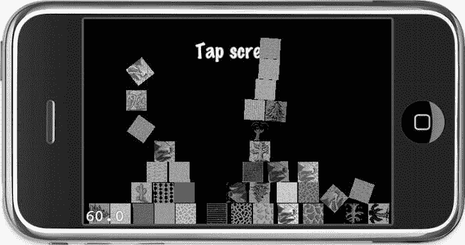

# 排版后内容

当然，游戏玩法上也可能会出现一些问题。对于刚体而言，你永远无法预知当足够多的玩家与它们互动时会发生什么。最终，一些玩家可能会把自己困在死胡同里，或者他们可能找到利用物理模拟的方法，从而移动到本不应该到达的区域。

## 对决：Box2D vs. Chipmunk

正如我提到的，`cocos2d` 附带两个物理引擎：`Box2D` 和 `Chipmunk`。你该如何选择呢？

在很多情况下，这归根结底是个人口味问题。大多数开发者根据物理引擎实现的编程语言来争论：`Box2D` 完全用 C++ 编写，而 `Chipmunk` 是用 C 语言编写的。

您可能仅仅因为其 C++ 接口就偏爱 `Box2D` 而不是 `Chipmunk`。用 C++ 编写的额外优势在于它能更好地与同样是面向对象的 Objective-C 语言集成。您可能还会欣赏 `Box2D` 通篇使用详细的变量名，而不是 `Chipmunk` 中常见的单字母变量名。此外，`Box2D` 使用运算符重载，因此您只需编写以下代码即可将两个向量相加：

```
b2Vec2 newVec = vec1 + vec2;
```

但是，如果您对 C++ 不太熟悉，可能会觉得其陡峭的学习曲线令人生畏。就此而言，如果您更熟悉 C 语言语法，或者更喜欢一个易于上手和学习的轻量级物理引擎实现，那么 `Chipmunk` 物理引擎可能更适合您。`Chipmunk` 被包含在 `cocos2d` 发行版中的时间比 `Box2D` 长好几个月，这也催生了更多关于 `Chipmunk` 的教程和论坛帖子，尽管 `Box2D` 的教程正在迎头赶上。`Chipmunk` 还提供从 Indie 版到 Enterprise 版的多种商业版本；高端版本包含额外的性能优化和 Objective-C API。在此处了解有关商业版本的更多信息：`http://chipmunk-physics.net/chipmunkPro.php`。

提前提醒一点：`Chipmunk` 使用 C 结构体，它们暴露了内部字段。如果您在进行实验时，不知道某些字段的用途，并且它们没有文档记录，这意味着您不应该更改它们——因为它们仅在内部使用。

还有一个流行的 `Chipmunk SpaceManager`，它为 `Chipmunk` 添加了一个易于使用的 Objective-C 接口。`SpaceManager` 还使得将 `cocos2d` 精灵附加到刚体上、添加调试绘制等功能变得容易。您可以在此处下载 `Chipmunk SpaceManager`：`http://code.google.com/p/chipmunk-spacemanager`。不幸的是，在撰写本文时，最新版本 0.1.3 的 `SpaceManager` 与 `cocos2d 2.0` 不兼容。我相信最终会有兼容性更新。

在功能方面，您可以放心地选择任何一个引擎。除非您的游戏依赖于一个物理引擎拥有而另一个没有的特定功能，否则使用任何一个引擎都能取得很好的效果。特别是如果您对两者都不熟悉，请随意根据语言和编码风格选择更适合您的那一个。

本章的其余部分将向您介绍两个物理引擎的基础知识，以便您可以自行决定哪个更吸引您。在第 13 章中，您将学习如何使用 `Box2D` 和 `VertexHelper` 工具构建一个包含缓冲器、挡板和轨道的可玩弹球游戏。

## Box2D

`Box2D` 物理引擎用 C++ 编写，由 Erin Catto 开发，他自 2005 年以来在每一届游戏开发者大会（GDC）上都做过关于物理模拟的演讲。正是他在 GDC 2006 上的演讲最终促成了 `Box2D` 于 2007 年 9 月公开发布。此后，它一直在积极开发中。

由于其受欢迎程度，`Box2D` 物理引擎随 `cocos2d` 一起分发。您可以通过从 Xcode 的 文件  新建项目对话框中选择 `cocos2d Box2D` 应用程序模板来创建一个使用 `Box2D` 的新项目。此项目模板会将必要的 `Box2D` 源文件添加到项目中，并提供一个测试项目，您可以在其中添加相互弹开的方块，如图 Figure 12-1 所示。方块还会根据您握持设备的方式，按照重力下落。



Figure 12-1 . PhysicsBox2D 示例项目

**注意** 由于 `Box2D` 物理引擎是用 C++ 编写的，您必须为项目的所有实现文件使用文件扩展名 `.mm` 而不是 `.m`。这会告诉 Xcode 将实现文件的源代码视为 Objective-C++ 或 C++ 代码。使用 `.m` 文件扩展名时，Xcode 将把代码编译为 Objective-C 和 C 代码，并且无法理解 `Box2D` 的 C++ 代码，这将对每一行使用或引用 `Box2D` 的代码导致大量编译错误。因此，如果您遇到许多与 `Box2D` 相关的错误，请检查您的实现文件是否都以 `.mm` 结尾，如果没有，请重命名它们。

`Box2D` 的文档在几个地方可用。首先，您可以在 `www.box2d.org/manual.html` 在线阅读 `Box2D` 手册，它向您介绍常见概念并展示示例代码。`Box2D` API 参考随 `Box2D` 本身一起分发，您可以在 `http://code.google.com/p/box2d` 下载。您也可以在随本书源代码分发的 `Box2D` 版本中找到 `Box2D` API 参考。API 参考位于文件夹 `/Physics Engine Libraries/Box2D_v2.1.2/Box2D/Documentation/API` 中——要查看它，请找到并打开该文件夹中的 `index.html` 文件。您还可以通过访问此 URL：`www.learn-cocos2d.com/api-ref` 来浏览 `Kobold2D` 中包含的 `Box2D` API 参考（和其他库）。

如果您喜欢 `Box2D`，您还应该考虑向该项目捐款；您可以通过其主页 `www.box2d.org` 上的捐赠按钮进行捐赠。

## Box2D 眼中的世界

由于 `cocos2d` 提供的 `Box2D` 示例项目相当复杂，我决定将其分解为更小的部分，并逐步重新创建示例项目，但并非没有添加一些额外内容和变体。

Listing 12-1 显示了来自 `PhysicsBox2D01` 项目的 `HelloWorldLayer` 头文件。

**Listing 12-1.** Box2D HelloWorldLayer 接口

```
#import "cocos2d.h"
#import "Box2D.h"
#import "GLES-Render.h"

#define PTM_RATIO 32
#define TILESIZE 32
#define TILESET_COLUMNS 9
#define TILESET_ROWS 19

enum
{
  kTagBatchNode,
};

@interface HelloWorldLayer : CCLayer
{
  CCTexture2D* spriteTexture;
  b2World* world;
  GLESDebugDraw* debugDraw;
}

+(CCScene*) scene;
@end
```

这相当标准，除了它包含了 `Box2D.h` 头文件并添加了一个类型为 `b2World` 的成员变量。这就是物理世界——可以将其视为一个容器类，它将存储和更新所有物理刚体。

Listing 12-2 中的 `init` 方法调用 `initPhysics` 来设置物理世界。我接下来会讲到这个。`init` 代码的其余部分创建了一个 `CCSpriteBatchNode`，保留了对精灵批次纹理的引用，并向屏幕添加了一个标签。请注意，`dealloc` 方法对 `world` 和 `debugDraw` 实例变量调用了 `delete`。因为这些是 C++ 类实例，您必须手动释放（`delete`）它们。ARC 不管理 C 或 C++ 对象的内存。

**Listing 12-2.** HelloWorldLayer 初始化

```
#import "HelloWorldLayer.h"
#import "PhysicsSprite.h"

@implementation HelloWorldLayer
```


