# Box2D World 初始化与用法

`+(CCScene*) scene`
```
{
     CCScene* scene = [CCScene node];
     HelloWorldLayer* layer = [HelloWorldLayer node];
     [scene addChild: layer];
     return scene;
}

-(id) init
{
     self = [super init];
     if (self)
     {
         self.isTouchEnabled = YES;

CCSpriteBatchNode* batchNode = [CCSpriteBatchNode ←
                                       batchNodeWithFile:@"dg_grounds32.png"];
         spriteTexture = batchNode.texture;
         [self addChild:batchNode z:0 tag:kTagBatchNode];

[self initPhysics];

CGSize screenSize = [CCDirector sharedDirector].winSize;
         [self addNewSpriteAtPosition:ccp(screenSize.width / 2, screenSize.height / 2)];

CCLabelTTF* label = [CCLabelTTF labelWithString:@"Tap screen"
                           fontName:@"Marker Felt"
         fontSize:32];
         [self addChild:label z:0];
         label.color = ccc3(0, 0, 255);
         label.position = ccp(screenSize.width / 2, screenSize.height - 50);

[self scheduleUpdate];
     }
         return self;
}

-(void) dealloc
{
    delete world;
    world = NULL;
    delete debugDraw;
    debugDraw = NULL;
}
```

Box2D 世界在`initPhysics`方法中初始化，通过创建一个带有重力向量的新`b2World`对象，如清单 12-3 所示。这还在屏幕边界添加了碰撞，并启用了调试绘制。

***清单 12-3.***  初始化 Box2D 世界

```
-(void) initPhysics
{
  b2Vec2 gravity;
  gravity.Set(0.0f, -10.0f);
  world = new b2World(gravity);

world-> SetAllowSleeping(true);
  world-> SetContinuousPhysics(false);

debugDraw = new GLESDebugDraw(PTM_RATIO);
  world-> SetDebugDraw(debugDraw);

uint32 flags = 0;
  flags + = b2Draw::e_shapeBit;
  //         flags + = b2Draw::e_jointBit;
  //         flags + = b2Draw::e_aabbBit;
  //         flags + = b2Draw::e_pairBit;
  //         flags + = b2Draw::e_centerOfMassBit;
  debugDraw-> SetFlags(flags);

// Define the ground body.
  b2BodyDef groundBodyDef;
  b2Body* groundBody = world-> CreateBody(&groundBodyDef);

// Define the ground box shape.
  CGSize screenSize = [CCDirector sharedDirector].winSize;
  float boxWidth = screenSize.width / PTM_RATIO;
  float boxHeight = screenSize.height / PTM_RATIO;
  b2EdgeShape groundBox;
  int density = 0;

// bottom
  groundBox.Set(b2Vec2(0, 0), b2Vec2(boxWidth, 0));
  groundBody-> CreateFixture(&groundBox, density);
  // top
  groundBox.Set(b2Vec2(0, boxHeight), b2Vec2(boxWidth, boxHeight));
  groundBody-> CreateFixture(&groundBox, density);
  // left
  groundBox.Set(b2Vec2(0, boxHeight), b2Vec2(0, 0));
  groundBody-> CreateFixture(&groundBox, density);
  // right
  groundBox.Set(b2Vec2(boxWidth, boxHeight), b2Vec2(boxWidth, 0));
  groundBody-> CreateFixture(&groundBox, density);
}
```

记住 Box2D 是用 C++ 编写的。要实例化 Box2D 的类，必须在类名前面加上`new`关键字。如果 Box2D 是用 Objective-C 编写的，等效的行可能如下所示：

```
world = [[b2World alloc] initWithGravity:gravity allowSleep:allowBodiesToSleep];
```

换句话说，C++ 中的`new`关键字等同于向 Objective-C 类发送`alloc`消息，后跟`init`消息。这当然意味着你还需要释放 Box2D 世界，如清单 12-2 所示。在 C++ 中，使用`delete`关键字来实现：

```
-(void) dealloc
{
  delete world;
  world = NULL;
  delete debugDraw;
  debugDraw = NULL;
}
```

清单 12-3 中的 Box2D 世界使用初始重力向量进行初始化，并允许物体进入休眠状态。

休眠的物体？这是一种技巧，允许物理模拟快速跳过不需要处理的对象。当施加在动态物体上的力在一定时间内低于某个阈值时，该物体会进入休眠状态。换句话说，如果动态物体移动和旋转非常缓慢或根本不移动，物理引擎会将其标记为休眠状态，并且不再对其施加力——除非施加在物体上的冲量或力足够强，使物体再次移动或旋转。这种技巧允许物理引擎通过不处理处于静止状态的物体来节省时间。除非你游戏中的所有动态物体都在持续运动，否则你应该启用此功能，如清单 12-3 所示。

连续物理设置使 Box2D 更准确地追踪快速移动物体的碰撞。它能有效防止快速移动的物体穿透或穿过其他物体，但这是以牺牲速度为代价的。实际上，你可能应该保持此设置禁用，直到你实际遇到因快速移动物体未相互碰撞而导致的错误。

传递给 Box2D 的重力是`b2Vec2 struct`类型。它本质上等同于`CGPoint`，因为它存储了 x 和 y 浮点值。在这种情况下，并且幸运的是在现实世界中也是如此，重力是一个恒定的力。`(0, -10)`向量会持续应用于所有动态物体，使它们下落，在此例中是指向屏幕底部。

调试绘制在开发过程中可能很有帮助，但也会对性能产生负面影响。除非你需要它，否则最好保持禁用。`HelloWorldLayer`类在`draw`方法中执行调试绘制，但将其包含在`#if DEBUG`语句中，以确保在发布版本中禁用调试绘制：

```
#if DEBUG
-(void) draw
{
  [super draw];

ccGLEnableVertexAttribs(kCCVertexAttribFlag_Position);
  kmGLPushMatrix();
  world-> DrawDebugData();
  kmGLPopMatrix();
}
#endif
```

## 限制移动范围到屏幕内

世界设置完毕，检查。接下来呢？你应该将 Box2D 物体的移动限制在可见屏幕区域内。为此，你需要一个静态物体。创建静态物体的最简单方法是使用世界的`CreateBody`方法，然后向其添加夹具（碰撞信息）。我将在这里重复清单 12-3 中的相关代码：

```
  // Define the ground body.
  b2BodyDef groundBodyDef;
  b2Body* groundBody = world-> CreateBody(&groundBodyDef);
```

物体总是通过世界的`CreateBody`方法创建的。这确保了物体的内存被正确分配和释放。`b2BodyDef`是一个结构体，包含创建物体所需的所有数据，例如位置和物体类型。默认情况下，空的物体定义会在位置`(0, 0)`创建一个静态物体。

**注意** `&groundBodyDef`变量在传递给`CreateBody`方法时带有前导`&`（与符号）字符。这是 C++ 中“给我`groundBodyDef`的内存地址”的写法。如果你查看`CreateBody`方法的定义，它需要一个指针传递给它：`b2World::CreateBody(const b2BodyDef *def);`。因为指针存储内存地址，你可以通过在非指针变量前加上与符号字符来获取其地址。

物体本身不做任何事情。为了使其包围屏幕区域，你必须创建一个带有四条边的形状：

```
  // Define the ground box shape.
  CGSize screenSize = [CCDirector sharedDirector].winSize;
  float boxWidth = screenSize.width / PTM_RATIO;
  float boxHeight = screenSize.height / PTM_RATIO;
  b2EdgeShape groundBox;
  int density = 0;
```


```cpp
// 底部
groundBox.Set(b2Vec2(0, 0), b2Vec2(boxWidth, 0));
groundBody-> CreateFixture(&groundBox, density);
// 顶部
groundBox.Set(b2Vec2(0, boxHeight), b2Vec2(boxWidth, boxHeight));
groundBody-> CreateFixture(&groundBox, density);
// 左侧
groundBox.Set(b2Vec2(0, boxHeight), b2Vec2(0, 0));
groundBody-> CreateFixture(&groundBox, density);
// 右侧
groundBox.Set(b2Vec2(boxWidth, boxHeight), b2Vec2(boxWidth, 0));
groundBody-> CreateFixture(&groundBox, density);
```

观察 `b2EdgeShape groundBox` 变量是如何被重复使用的。每次调用 `Set` 方法后，紧跟着调用 `groundBody-> CreateFixture()`，其中使用 `->` 运算符表示 `groundBody` 是一个 C 风格指针，并传入 `&groundBox`。由于 Box2D 会复制 `groundBox` 的数据，你可以安全地重复使用同一个形状来创建包围屏幕区域的所有四条边，而无需修改或覆盖之前的代码行。由于该刚体是静态刚体（Box2D 刚体的默认设置），因此 `density` 不会产生任何影响，通常将其设为 `0`。

请注意，屏幕宽度和高度通过 `PTM_RATIO` 常量进行除法运算，将其从像素转换为米。为什么要用米？`PTM_RATIO` 又是什么？Box2D 针对 0.1 到 10 米范围内的尺寸进行了优化（1 米约等于 3.28 英尺）。它基于公制系统进行调优，因此所有距离都以米为单位，所有质量以千克为单位，时间则（颇为奇怪地）以秒为单位。如果你不熟悉米-千克-秒（MKS）单位制，不必担心——你无需费心将英尺精确转换为米、将磅转换为千克。转换为米只是一种方法，目的是将 Box2D 的距离值保持在 0.1 到 10 的理想范围内，而且刚体使用的质量本身也与现实世界中的质量无关。刚体的质量通常需要根据感觉进行调整，而非使用真实重量。

你应该尽量让世界中物体的尺寸尽可能接近 1 米。这并不是说不能有小于 0.1 米或大于 10 米的物体，但如果创建相对太小或太大的刚体，可能会遇到异常或奇怪的行为。

`PTM_RATIO` 的定义如下：

```cpp
#define PTM_RATIO 32
```

它用于定义屏幕上的 32 个像素等于 Box2D 中的 1 米。一个宽高均为 32 像素的盒状刚体，在 Box2D 中就相当于 1 米宽、1 米高。一个尺寸为 4×4 像素的刚体在 Box2D 中为 0.125×0.125 米，而一个相对巨大的 256×256 像素物体在 Box2D 中则为 8×8 米，仍完全处于 Box2D 的可接受范围内。`PTM_RATIO` 让你能够将 Box2D 物体的尺寸缩放到其最佳工作范围，对于屏幕区域可能高达 1024×768 点的 iPad 而言，`PTM_RATIO` 设为 32 是一个很好的折中方案。

### 转换点

请注意，`b2Vec2` 结构体与 `CGPoint` 不同，这意味着在需要 `b2Vec2` 的地方不能使用 `CGPoint`，反之亦然。此外，Box2D 的点需要进行米与像素之间的相互转换。为避免出错（例如忘记进行米与像素的转换，或者仅仅是拼写错误导致重复使用了 x 坐标），强烈建议将这些重复性代码封装成如下便捷方法：

```objc
-(b2Vec2) toMeters:(CGPoint)point
{
  return b2Vec2(point.x / PTM_RATIO, point.y / PTM_RATIO);
}

-(CGPoint) toPixels:(b2Vec2)vec
{
  return ccpMult(CGPointMake(vec.x, vec.y), PTM_RATIO);
}
```

这样，你就可以编写以下代码，轻松地在 `CGPoint`（像素）和 `b2Vec2`（米）之间进行转换：

```objc
// Box2D 坐标转 Cocos2D 点坐标
b2Vec2 vec = b2Vec2(200, 200);
CGPoint pointFromVec = [self toPixels:vec];

// Cocos2D 点坐标转 Box2D 坐标
CGPoint point = CGPointMake(100, 100);
b2Vec2 vecFromPoint = [self toMeters:point];
```

### 向 Box2D 世界添加盒子

既然已经有了包含屏幕边界内物体的静态刚体，那么缺少的就是要被限制在屏幕边界内的东西了。用一些小盒子怎么样？

我将 David Gervais 的正交瓦片集图片 `dg_grounds32.png` 添加到了 `PhysicsBox2D01` 项目的 `Resources` 文件夹中。这些瓦片的尺寸是 32×32 像素，因此它们非常适合作为 1×1 米的盒子。

如列表 12-4 所示的 `addNewSpriteAt` 方法是 cocos2d Box2D 应用模板项目的一部分，但经过轻微修改，以便利用瓦片集中的所有瓦片。

**列表 12-4.**  使用精灵添加一个新的动态刚体

```objc
-(void) addNewSpriteAtPosition:(CGPoint)pos
{
  int idx = CCRANDOM_0_1() * TILESET_COLUMNS;
  int idy = CCRANDOM_0_1() * TILESET_ROWS;
  CGRect tileRect = CGRectMake(TILESIZE * idx, TILESIZE * idy, TILESIZE, TILESIZE);

PhysicsSprite* sprite = [PhysicsSprite spriteWithTexture:spriteTexture
  rect:tileRect];
  CCNode* batchNode = [self getChildByTag:kTagBatchNode];
  [batchNode addChild:sprite];
  sprite.position = pos;

// 定义动态刚体。
  b2BodyDef bodyDef;
  bodyDef.type = b2_dynamicBody;
  bodyDef.position = [self toMeters:pos];
  b2Body* body = world-> CreateBody(&bodyDef);
  body-> SetUserData((__bridge void*)sprite);

// 为动态刚体定义盒子形状。
  b2PolygonShape dynamicBox;
  dynamicBox.SetAsBox(0.5f, 0.5f);

// 定义动态刚体的固定装置。
  b2FixtureDef fixtureDef;
  fixtureDef.shape = &dynamicBox;
  fixtureDef.density = 1.0f;
  fixtureDef.friction = 0.3f;
  body-> CreateFixture(&fixtureDef);

[sprite setPhysicsBody:body];
}
```

首先，通过 `CCSpriteBatchNode` 使用 `PhysicSprite` 的 `spriteWithTexture` 初始化器，并提供一个尺寸为 32×32 像素的 `CGRect`，从而随机选择瓦片集中的一个瓦片作为精灵图像，来创建一个精灵。

Cocos2d 提供了 `PhysicsSprite` 类。它本质上是一个常规的 `CCSprite`，但额外拥有一个物理刚体实例变量。每次渲染精灵时，它都会使用该物理刚体来设置精灵的位置和旋转。这样做的一个额外好处是，你无需手动更新精灵的 `position` 和 `rotation` 属性，并且它与 ARC 配合良好，因为你无需使用刚体的 `SetUserData(void* data)` 函数来存储精灵。

但我确实将精灵存储在刚体的 `userdata` 中，因为在后续的碰撞检测中，我需要该精灵来改变其颜色以可视化碰撞。由于 `userdata` 是一个 `void*` 指针，在启用了 ARC 的情况下将 Objective-C 对象赋值给 `void*` 需要特殊的桥接转换，如下所示：

```objc
body-> SetUserData((__bridge void*)sprite);
```

要从刚体的 `userdata` 中获取物理精灵，也需要桥接转换：

```objc
PhysicsSprite* sprite = (__bridge PhysicsSprite*)body-> GetUserData();
```

在创建精灵之后，创建一个刚体，但这次将 `b2BodyDef` 的 `type` 属性设置为 `b2_dynamicBody`，使其成为一个可以移动并与其他动态刚体碰撞的动态刚体。稍后，当您遍历世界中的刚体时，这允许您快速访问刚体的精灵。

该刚体的形状是一个设置为半米大小盒子形状的 `b2PolygonShape`。`SetAsBox` 方法创建一个宽度和高度是给定参数两倍的盒子形状，因此坐标需要除以 2——或者像本例中那样，设置为 `0.5f` 来创建一个边长为 1 米宽和高的盒子形状。

动态刚体还需要一个包含其基本参数的固定装置——首先也是最重要的是形状，此外还有密度、摩擦力和恢复系数，这些参数会影响刚体在世界中移动和弹跳的方式。可以将固定装置视为刚体使用的一组物理参数。

### 更新 Box2D 世界
```


物理体在未定期调用 Box2D 世界的`Step`方法时将不会有任何动作。你应在`update`方法中执行此操作，如代码清单 12-5 所示。

***代码清单 12-5.*** 更新每个精灵体的位置和旋转

```
-(void) update:(ccTime)delta
{
  int32 velocityIterations = 8;
  int32 positionIterations = 1;
  world-> Step(delta, velocityIterations, positionIterations);
}
```

通过定期调用`Step`方法来驱动 Box2D 世界的动画。该方法接受三个参数：第一个参数`timeStep`告诉 Box2D 自上次步进以来经过的时间，它直接影响物体在该步中的移动距离。虽然此处使用了时间`delta`，但不建议将增量时间作为`timeStep`传递，因为增量时间会波动，导致物理体速度不稳定。当设备可能需要十分之一秒的时间进行后台处理（如在后台发送或接收电子邮件）时，这种影响会尤为明显，导致所有物理对象在下一帧移动很大距离。在游戏中，你更希望游戏在十分之一秒内减速甚至暂停，然后从断点处继续运行。若未使用固定时间步长，物理引擎会尝试通过基于时间差移动所有对象来应对短暂中断。如果时间差较大，对象将在一帧内移动更多距离，这可能导致它们突然移动很长距离。

`Step`方法的第二和第三个参数是迭代次数。它们决定了物理模拟的精度以及计算物体运动所需的时间，这是在速度与精度之间的权衡。对于位置迭代，可以安全地偏向速度一侧，仅需一次迭代——在游戏中通常不需要更高的位置精度，除非遇到物体无法静止、以非自然方式碰撞或完全错过碰撞的情况。然而速度更为重要；速度迭代的良好起点是八次。超过十次速度迭代在游戏中不会有明显效果，而仅仅一到四次迭代则不足以获得稳定的模拟。速度迭代次数越少，物体的行为会越颠簸和不安定。建议您尝试调整这些值。

碰撞检测

Box2D 提供了一个`b2ContactListener`类，如果您希望接收碰撞回调，应继承此类。以下碰撞检测代码位于`PhysicsBox2D01`项目中，而非常规的 cocos2d Box2D 项目模板中。

在 Xcode 中创建一个新类并命名为`ContactListener`。然后将实现文件重命名为`ContactListener.mm`，使其扩展名为`.mm`。这样您就可以在同一文件中同时使用 C++和 Objective-C 代码。代码清单 12-6 展示了`ContactListener`的头文件。

***代码清单 12-6.*** `ContactListener`类的接口

```
#import "Box2D.h"

class ContactListener : public b2ContactListener
{
private:
     void BeginContact(b2Contact* contact);
     void EndContact(b2Contact* contact);
};
```

这是一个 C++类，因此类定义略有不同。注意最后一个大括号后的尾部分号，忘记分号是常见错误。`BeginContact`和`EndContact`方法由 Box2D 定义，当两个物体发生碰撞时会被调用。

在实现中，我仅将精灵的颜色改为洋红色（当两个物体接触时），并在它们不再接触时设回白色，如代码清单 12-7 所示。

***代码清单 12-7.*** 检查碰撞的开始与结束

```
#import "ContactListener.h"
#import "cocos2d.h"
#import "PhysicsSprite.h"

void ContactListener::BeginContact(b2Contact* contact)
{
  b2Body* bodyA = contact-> GetFixtureA()-> GetBody();
  b2Body* bodyB = contact-> GetFixtureB()-> GetBody();
  PhysicsSprite* spriteA = (__bridge PhysicsSprite*)bodyA-> GetUserData();
  PhysicsSprite* spriteB = (__bridge PhysicsSprite*)bodyB-> GetUserData();

if (spriteA != NULL && spriteB != NULL)
  {
     spriteA.color = ccMAGENTA;
     spriteB.color = ccMAGENTA;
  }
}

void ContactListener::EndContact(b2Contact* contact)
{
  b2Body* bodyA = contact-> GetFixtureA()-> GetBody();
  b2Body* bodyB = contact-> GetFixtureB()-> GetBody();
  PhysicsSprite* spriteA = (__bridge PhysicsSprite*)bodyA-> GetUserData();
  PhysicsSprite* spriteB = (__bridge PhysicsSprite*)bodyB-> GetUserData();

if (spriteA ! =  NULL && spriteB ! =  NULL)
  {
     spriteA.color = ccWHITE;
     spriteB.color = ccWHITE;
  }
}
```

`b2Contact`包含所有接触信息，包括后缀为`A`和`B`的两组数据。这是两个接触的物体；不区分哪个与哪个碰撞——它们只是在彼此碰撞。例如，如果敌人与玩家的子弹碰撞，您会希望伤害敌人而非子弹。具体区分由您决定。还需注意，接触方法可能每帧被多次调用，每个接触对调用一次。

从接触对象通过夹具到物体，再从中获取用户数据的过程略显复杂。Box2D API 参考手册无疑能帮助您理清层次结构，稍加经验后便会得心应手。

要将`ContactListener`与 Box2D 实际关联，您需要将其添加到世界中。在`HelloWorldLayer`中，导入`ContactListener.h`头文件，并将`ContactListener* contactListener`作为成员变量添加到类中：

```
#import "cocos2d.h"
#import "Box2D.h"
#import "GLES-Render.h"
#import "ContactListener.h"

...

@interface HelloWorldLayer : CCLayer
{
     CCTexture2D* spriteTexture;
     b2World* world;
     ContactListener* contactListener;
     GLESDebugDraw* debugDraw;
}
...
@end
```

在`HelloWorldLayer`的`initPhysics`方法中，您可以创建新的`ContactListener`实例，并将其设置为世界的接触监听器：

```
-(void) initPhysics
{
  b2Vec2 gravity;
  gravity.Set(0.0f, -10.0f);
  world = new b2World(gravity);
  world-> SetAllowSleeping(true);
  world-> SetContinuousPhysics(false);

contactListener = new ContactListener();
  world-> SetContactListener(contactListener);
  ...
```

最后，在`dealloc`方法中删除`contactListener`以释放其内存，因为它是一个 C++类对象：

```
-(void) dealloc
{
  delete world;
  world = NULL;
  delete debugDraw;
  debugDraw = NULL;
  delete contactListener;
  contactListener = NULL;
}
```

现在，`PhysicsBox2D01`项目中的方块在相互接触时将变成紫色。实现并非完美，您会注意到有些方块明显碰撞却未变色。问题在于`EndContact`可能被一个仍存在其他接触的物体调用。但就演示而言，这已经足够。

关节连接

通过关节，您可以将物体连接在一起。关节的类型决定了连接物体的方式。在以下示例方法中，您将总共创建四个物体。其中三个是动态物体，通过*旋转关节*相互连接，该关节保持物体间距离不变，但允许它们围绕彼此旋转 360 度。如果您难以想象这些物体的行为，可以在`PhysicsBox2D01`项目中尝试。在此情况下，实际代码比文字或静态图像更能解释清楚。第四个物体是静态物体，其中一个动态物体也通过旋转关节与之相连。


为了清晰和简洁，我将创建`PhysicsSprite`的代码提取到了`createPhysicsSpriteAt`方法中，`createBodyFixture`方法负责创建刚体的形状和夹具。

```objective-c
-(void) addSomeJointedBodies:(CGPoint)pos
{
  // 创建一个刚体定义，并将其设置为动态刚体
  b2BodyDef bodyDef;
  bodyDef.type = b2_dynamicBody;

  bodyDef.position = [self toMeters:pos];
  bodyDef.position = bodyDef.position + b2Vec2(-1, -1);
  b2Body* bodyA = world->CreateBody(&bodyDef);
  [self createBodyFixture:bodyA];

  PhysicsSprite* spriteA = [self createPhysicsSpriteAt:pos];
  [spriteA setPhysicsBody:bodyA];
  bodyA->SetUserData((__bridge void*)spriteA);

  bodyDef.position = [self toMeters:pos];
  b2Body* bodyB = world->CreateBody(&bodyDef);
  [self createBodyFixture:bodyB];
  PhysicsSprite* spriteB = [self createPhysicsSpriteAt:pos];
  [spriteB setPhysicsBody:bodyB];
  bodyB->SetUserData((__bridge void*)spriteB);

  bodyDef.position = [self toMeters:pos];
  bodyDef.position = bodyDef.position + b2Vec2(1, 1);

  b2Body* bodyC = world->CreateBody(&bodyDef);
  [self createBodyFixture:bodyC];
  PhysicsSprite* spriteC = [self createPhysicsSpriteAt:pos];
  [spriteC setPhysicsBody:bodyC];
  bodyC->SetUserData((__bridge void*)spriteC);
  
  b2RevoluteJointDef jointDef;

  jointDef.Initialize(bodyA, bodyB, bodyB->GetWorldCenter());
  bodyA->GetWorld()->CreateJoint(&jointDef);
  jointDef.Initialize(bodyB, bodyC, bodyC->GetWorldCenter());
  bodyA->GetWorld()->CreateJoint(&jointDef);

  // 创建一个不可见的静态刚体来连接
  bodyDef.type = b2_staticBody;
  bodyDef.position = [self toMeters:pos];
  b2Body* staticBody = world->CreateBody(&bodyDef);
  jointDef.Initialize(staticBody, bodyA, bodyA->GetWorldCenter());
  bodyA->GetWorld()->CreateJoint(&jointDef);
}
```

`b2BodyDef`被所有刚体重用；只修改了每个刚体的位置，并为每个刚体创建了一个`PhysicsSprite`并作为用户数据赋值给它。

`b2RevoluteJointDef`通过使用`Initialize`方法填充数据，该需要提供两个要相互连接的刚体以及关节所在的坐标。通过使用一个刚体的`GetWorldCenter`坐标，该刚体将以关节为中心，并且只允许围绕自身旋转。

关节是通过`b2World`类的`CreateJoint`方法创建的。尽管`PhysicsBox2D01`项目中的`HelloWorldLayer`类有一个`b2World`成员变量，但我想说明你也可以通过任何刚体获取世界——无论哪个都可以——使用刚体的`GetWorld`方法。这一点很有用，因为之前讨论的`ContactListener`中没有`b2World`成员变量，所以你需要通过一个接触的刚体来获取`b2World`指针。

## Chipmunk

Chipmunk 物理引擎由 Howling Moon Software 的 Scott Lembcke 开发。Chipmunk 实际上受到早期版本 Box2D 的启发，当时 Box2D 还未成为一个成熟的物理引擎。关于 Chipmunk 的更多信息及其文档，请访问 Scott 的个人主页：`http://chipmunk-physics.net`。如果你需要帮助，可以在 Chipmunk 论坛中找到：`http://chipmunk-physics.net/forum`。

#### 太空中的 Chipmunks

对于 Chipmunk 教程，你将构建与之前相同的项目。你可以在`PhysicsChipmunk01`项目中找到结果代码。清单 12-8 展示了 Chipmunk 版本的`HelloWorldLayer`头文件。

***清单 12-8.*** Chipmunk HelloWorld 接口

```objective-c
#import "cocos2d.h"
#import "chipmunk.h"

#define TILESIZE 32
#define TILESET_COLUMNS 9
#define TILESET_ROWS 19

enum
{
  kTagBatchNode,
};

@interface HelloWorldLayer : CCLayer
{
  CCTexture2D* spriteTexture;
  cpSpace* space;
  cpShape* walls[4];
}

+(CCScene*) scene;
@end
```

这里没有什么特别之处，除了`cpSpace`和`cpShape`实例变量。Chipmunk 不称其为"world"，而是称之为"space"。这只是同一事物的不同术语。Chipmunk 空间包含了所有刚体。而墙体形状定义了屏幕边界碰撞。`walls`数组仅用于当场景被释放时，将墙体从 Chipmunk 空间中移除。Chipmunk 不会像 Box2D 那样自动管理其物理对象的内存。由于 Chipmunk 是一个 C 语言库，ARC 也无法管理 Chipmunk 的内存。

`HelloWorldLayer`的初始化和释放部分与 Box2D 版本差别不大，如下所示：

```objective-c
#import "HelloWorldLayer.h"
#import "PhysicsSprite.h"

@implementation HelloWorldLayer

+(CCScene*) scene
{
  CCScene* scene = [CCScene node];
  HelloWorldLayer* layer = [HelloWorldLayer node];
  [scene addChild:layer];
  return scene;
}

-(id) init
{
  self = [super init];
  if (self)
  {
     self.isTouchEnabled = YES;

     CGSize screenSize = [CCDirector sharedDirector].winSize;

     CCLabelTTF* label = [CCLabelTTF labelWithString:@"Tap screen"
                                        fontName:@"Marker Felt"
                                        fontSize:36];
     label.position = ccp(screenSize.width / 2, screenSize.height - 30);
     [self addChild:label z:-1];

     CCSpriteBatchNode* batchNode = [CCSpriteBatchNode batchNodeWithFile:@"dg_grounds32.png"];
     spriteTexture = batchNode.texture;
     [self addChild:batchNode z:0 tag:kTagBatchNode];

     [self initPhysics];
     [self addNewSpriteAtPosition:ccp(200,200)];

     [self scheduleUpdate];
  }

  return self;
}

-(void) dealloc
{
  for (int i = 0; i < 4; i++)
  {
     cpShapeFree(walls[i]);
  }
  cpSpaceFree(space);
}
...
```

你可以在`dealloc`方法中看到如何通过`cpShapeFree`释放四个墙体段，随后通过`cpSpaceFree`释放空间。那么，让我们看看这些东西最初是如何创建的。与之前一样，你在`initPhysics`方法中进行 Chipmunk 初始化：

```objective-c
-(void) initPhysics
{
  cpInitChipmunk();
  space = cpSpaceNew();
  space->gravity = CGPointMake(0, -100);
  ...
}
```

在使用任何 Chipmunk 方法之前，第一件必须做的事情就是调用`cpInitChipmunk`。之后，你可以通过`cpSpaceNew`创建空间。

注意 Chipmunk 如何使用与 iPhone SDK 中相同的`CGPoint`结构。Chipmunk 内部使用一个名为`cpVect`的结构，但在 cocos2d 中，你可以互换使用它们。我使用`CGPoint`将重力设置为-100，这意味着向下的加速度，与 Box2D 项目中使用的大致相同。你还会经常看到`ccp`方法，它与`CGPointMake`相同。

#### 将盒子框起来

为了将所有盒子保持在屏幕边界内，你需要创建一个静态刚体，其形状定义了屏幕区域。你在`initPhysics`方法的第二部分执行此操作，如清单 12-9 所示。

***清单 12-9.*** 创建屏幕边界碰撞

```objective-c
-(void) initPhysics
{
  ...

  CGSize screenSize = [CCDirector sharedDirector].winSize;
  float boxWidth = screenSize.width;
  float boxHeight = screenSize.height;
  // 底部
  walls[0] = cpSegmentShapeNew(space->staticBody, ccp(0, 0), ccp(boxWidth, 0), 0.0f);
  // 顶部
  walls[1] = cpSegmentShapeNew(space->staticBody, ccp(0, boxHeight), ccp(boxWidth, boxHeight), 0.0f);
  // 左侧
  walls[2] = cpSegmentShapeNew(space->staticBody, ccp(0, 0), ccp(0, boxHeight), 0.0f);
  // 右侧
  walls[3] = cpSegmentShapeNew(space->staticBody, ccp(boxWidth, 0), ccp(boxWidth, boxHeight), 0.0f);

  for (int i = 0; i < 4; i++)
  {
     walls[i]->e = 1.0f;
     walls[i]->u = 1.0f;
     cpSpaceAddStaticShape(space, walls[i]);
  }
}
```


与 Box2D 不同，使用 Chipmunk 时无需考虑像素与米之间的比例。您可以直接使用屏幕像素大小来定义角点，并以此与 Chipmunk 的 body 进行交互。

四段墙体被添加到`walls`数组中。每一段都是一个线段形状（segment shape），本质上是从 A 点到 B 点的一条线段，用于阻挡物理对象。您需要使用`cpSpaceAddStaticShape`方法将这些墙体创建为静态形状，但在创建之前，需要先设置墙体的一些参数。就我个人而言，Chipmunk 在此处的做法有些过于随意。我们需要习惯记住：`e`代表弹性（弹力），而`u`则代表摩擦。这两个值都是系数，意味着如果将它们设置为 1，则物体将没有弹性且不产生摩擦。

### 添加小方块

要向世界中添加方块，您可以在`HelloWorldLayer`的`init`方法中使用与 Box2D 示例相同的代码。请参考列表 12-4 来回顾相关内容。

我将直接介绍创建新方块动态 body 的过程，这正是`addNewSpriteAtPosition`方法所完成的工作（列表 12-10）。

***列表 12-10.***  使用精灵添加 Body（Chipmunk 风格）

```
-(void) addNewSpriteAtPosition:(CGPoint)pos
{
  int idx = CCRANDOM_0_1() * TILESET_COLUMNS;
  int idy = CCRANDOM_0_1() * TILESET_ROWS;
  CGRect tileRect = CGRectMake(TILESIZE * idx, TILESIZE * idy, TILESIZE, TILESIZE);
  PhysicsSprite* sprite = [PhysicsSprite spriteWithTexture:spriteTexture
                                                      rect:tileRect];
  sprite.position = pos;

CCNode* batchNode = [self getChildByTag:kTagBatchNode];
  [batchNode addChild:sprite];

const int numVertices = 4;
  float halfTileSize = TILESIZE * 0.5f;
  CGPoint verts[] =
  {
       ccp(−halfTileSize, -halfTileSize),
       ccp(−halfTileSize, halfTileSize),
       ccp(halfTileSize, halfTileSize),
       ccp(halfTileSize, -halfTileSize),
  };

float mass = 1.0f;
  cpBody* body = cpBodyNew(mass, ←
  cpMomentForPoly(mass, numVertices, verts, CGPointZero));

body-> p = pos;
  cpSpaceAddBody(space, body);

cpShape* shape = cpPolyShapeNew(body, numVertices, verts, CGPointZero);
  shape-> e = 0.4f;
  shape-> u = 0.4f;
  cpSpaceAddShape(space, shape);

[sprite setPhysicsBody:body];
  body-> data = (__bridge void*)sprite;
}
```

您使用`cpBodyNew`方法为方块创建动态 body，该方法需要传入给定的质量和*转动惯量（moment of inertia）*。转动惯量决定了物体运动的阻力，它由辅助方法`cpMomentForPoly`计算得出，该方法接收 body 的质量以及其 32x32 像素方块形状的顶点数据。

更新 body 的位置`p`后，通过`cpSpaceAddBody`方法将 body 添加到空间中。请注意，与 Box2D 相反，您无需进行像素到米的转换，可以直接使用像素坐标进行操作。

顶点数组定义了方块形状的角点。由于角点位置是相对于您所创建方块的中心来定位的，因此它们距离中心均为半个瓦片（tile）的大小。否则，方块形状的大小将会是瓦片的两倍。

接着，`cpPolyShapeNew`方法接收 body、`verts`数组、数组中的顶点数量以及一个可选的偏移量（本例中设置为`CGPointZero`）作为输入，并返回一个指向方块形状的`cpShape`指针。该形状的弹性和摩擦系数被设置为与 Box2D 方块行为相似的数值。在将精灵作为用户数据设置到`data`字段后，通过`cpSpaceAddShape`方法将此形状添加到空间中。最后，还有一个 Chipmunk 版本的`PhysicsSprite`类，它被分配了 body，以便根据 Chipmunk body 更新其位置和旋转。

Chipmunk 的 body 也会将精灵分配给它自己的`data`字段。这同样需要桥接转换（bridge cast），以免 ARC 报错。

### 更新 Chipmunk 空间

您必须每帧更新 Chipmunk 空间，以推进物理模拟。在列表 12-11 的`update`方法中完成此操作。

***列表 12-11.***  更新 Chipmunk 空间

```
-(void) update:(ccTime)delta
{
  const int iterations = 10;
  for (int i = 0; i < iterations; i++)
  {
     cpSpaceStep(space, 0.005f);
  }
}
```

与 Box2D 一样，您必须使用步进方法来推进物理模拟。此处使用的是`cpSpaceStep`，它接收空间和时间步长作为输入。固定时间步长效果最佳，如同在 Box2D 中一样，强烈建议使用固定时间步长而非传递增量时间（delta time）。对于 Chipmunk 来说，这一点可能更为重要，因为我注意到使用增量时间时会出现非常奇怪的效果。只要帧率没有剧烈波动（实际上也不应该），使用固定时间步长的方法效果就非常好。

`PhysicsSprite`类会为您处理所有的位置和旋转更新。

### Chipmunk 碰撞处理

Chipmunk 使用 C 语言回调方法处理碰撞。在`PhysicsChipmunk01`项目中，我添加了`contactBegin`和`contactEnd`静态方法（列表 12-12），它们的功能与 Box2D 中的对应方法完全相同——将发生碰撞的方块颜色更改为洋红色。

***列表 12-12.***   Cmunk 风格的碰撞回调

```
static int contactBegin(cpArbiter* arbiter, struct cpSpace* space, void* data)
{
  BOOL processCollision = YES;

cpBody* bodyA;
  cpBody* bodyB;
  cpArbiterGetBodies(arbiter, &bodyA, &bodyB);

PhysicsSprite* spriteA = (__bridge PhysicsSprite*)bodyA-> data;
  PhysicsSprite* spriteB = (__bridge PhysicsSprite*)bodyB-> data;
  if (spriteA ! = nil && spriteB ! = nil)
  {
     spriteA.color = ccMAGENTA;
     spriteB.color = ccMAGENTA;
  }

return processCollision;
}

static void contactEnd(cpArbiter* arbiter, cpSpace* space, void* data)
{
  cpBody* bodyA;
  cpBody* bodyB;
  cpArbiterGetBodies(arbiter, &bodyA, &bodyB);

PhysicsSprite* spriteA = (__bridge PhysicsSprite*)bodyA-> data;
  PhysicsSprite* spriteB = (__bridge PhysicsSprite*)bodyB-> data;
  if (spriteA ! = nil && spriteB ! = nil)
  {
     spriteA.color = ccWHITE;
     spriteB.color = ccWHITE;
  }
}
```

如果碰撞应当被正常处理，`contactBegin`方法应返回`YES`。通过从此方法返回`NO`或`0`，您也可以忽略碰撞。要获取精灵，首先需要从`cpArbiter`中获取形状（shapes），`cpArbiter`与`b2Contact`类似，保存了接触信息。通过`cpArbiterGetShapes`方法，并将两个形状作为输出（`out`）参数传入，您可以获取到发生碰撞的形状，并从中检索出各自的`PhysicsSprite`指针。如果两者都有效，则可以更改它们的颜色。

与 Box2D 类似，这些回调不会自动被调用。在`HelloWorldLayer`的`initPhysics`方法中，创建空间后，必须立即使用`cpSpaceAddCollisionHandler`方法添加碰撞处理器：

```
-(void) initPhysics
{
  cpInitChipmunk();
  space = cpSpaceNew();
  space-> gravity = CGPointMake(0, -100);

unsigned int defaultCollisionType = 0;
  cpSpaceAddCollisionHandler(space, defaultCollisionType, defaultCollisionType,
                            &contactBegin, NULL, NULL, &contactEnd, NULL);
```

形状的默认碰撞类型为 0，因为我无需过滤碰撞，所以两个碰撞类型参数都设置为`0`。您可以为每个 body 的形状分配一个整数值给其`collision_type`属性，然后添加仅在具有匹配碰撞类型的 body 发生碰撞时才会被调用的碰撞处理器。这被称为*碰撞过滤*，在 Chipmunk 手册中有详细描述，参见`http://files.slembcke.net/chipmunk/release/ChipmunkLatest-Docs/#cpShape`。


# 接下来的四个参数

接下来的四个参数是指向四个碰撞阶段 C 语言回调函数的指针：*开始*、*预求解*、*后求解*和*分离*（与 Box2D 中的`EndContact`事件相同）。这些参数的作用与 Box2D 中对应的回调函数相同。大多数时候，你只对`开始`和`分离`事件感兴趣。

我将`预求解`和`后求解`参数设为`NULL`，因为我不需要处理这些。你可以使用这些方法来影响碰撞，或者在`后求解`阶段获取碰撞力。最后一个参数是一个任意的数据指针，如果需要，你可以将其传递给回调方法。我不需要，所以也将其设为`NULL`。

有了这些，你就拥有了一个可用的碰撞回调机制。

# 花栗鼠的关节

Chipmunk 示例项目也需要自己实现`addSomeJointedBodies`。其设置过程比 Box2D 更冗长，如代码清单 12-13 所示。你会发现大部分代码都是在设置静态和动态物体——如果你觉得这部分代码很熟悉，可以随意跳到末尾关节创建的部分。

***代码清单 12-13.*** 创建三个通过关节连接的物体

```
-(void) addSomeJointedBodies:(CGPoint)pos
{
  float mass = 1.0f;
  float moment = cpMomentForBox(mass, TILESIZE, TILESIZE);

  float halfTileSize = TILESIZE * 0.5f;
  int numVertices = 4;
  CGPoint vertices[] =
  {
       ccp(−halfTileSize, -halfTileSize),
       ccp(−halfTileSize, halfTileSize),
       ccp(halfTileSize, halfTileSize),
       ccp(halfTileSize, -halfTileSize),
  };

  // 创建一个静态物体
  cpBody* staticBody = cpBodyNew(INFINITY, INFINITY);
  staticBody-> p = pos;

  CGPoint offset = CGPointZero;
  cpShape* shape = cpPolyShapeNew(staticBody, numVertices, vertices, offset);
  cpSpaceAddStaticShape(space, shape);

  // 创建三个新的动态物体
  float posOffset = 1.4f;
  pos.x + = TILESIZE * posOffset;
  cpBody* bodyA = cpBodyNew(mass, moment);
  bodyA-> p = pos;
  cpSpaceAddBody(space, bodyA);

  shape = cpPolyShapeNew(bodyA, numVertices, vertices, offset);
  cpSpaceAddShape(space, shape);

  PhysicsSprite* spriteA = [self createPhysicsSpriteAt:pos];
  [spriteA setPhysicsBody:bodyA];
  bodyA-> data = (__bridge void*)spriteA;

  pos.x + = TILESIZE * posOffset;
  cpBody* bodyB = cpBodyNew(mass, moment);
  bodyB-> p = pos;
  cpSpaceAddBody(space, bodyB);

  shape = cpPolyShapeNew(bodyB, numVertices, vertices, offset);
  cpSpaceAddShape(space, shape);

  PhysicsSprite* spriteB = [self createPhysicsSpriteAt:pos];
  [spriteB setPhysicsBody:bodyB];
  bodyB-> data = (__bridge void*)spriteB;

  pos.x + = TILESIZE * posOffset;
  cpBody* bodyC = cpBodyNew(mass, moment);
  bodyC-> p = pos;
  cpSpaceAddBody(space, bodyC);

  shape = cpPolyShapeNew(bodyC, numVertices, vertices, offset);
  cpSpaceAddShape(space, shape);

  PhysicsSprite* spriteC = [self createPhysicsSpriteAt:pos];
  [spriteC setPhysicsBody:bodyC];
  bodyC-> data = (__bridge void*)spriteC;

  // 创建关节并将约束添加到空间
  cpConstraint* constraint1 = cpPivotJointNew(staticBody, bodyA, staticBody-> p);
  cpConstraint* constraint2 = cpPivotJointNew(bodyA, bodyB, bodyA-> p);
  cpConstraint* constraint3 = cpPivotJointNew(bodyB, bodyC, bodyB-> p);

  cpSpaceAddConstraint(space, constraint1);
  cpSpaceAddConstraint(space, constraint2);
  cpSpaceAddConstraint(space, constraint3);
}
```

在这个例子中，你使用`cpPivotJointNew`创建了一个枢轴关节，这与 Box2D 示例中使用的`b2RevoluteJoint`相同。每个关节都由两个需要相互连接的物体以及其中一个物体的中心位置作为锚点创建而成。`cpPivotJointNew`方法返回一个`cpConstraint`指针，你需要使用`cpSpaceAddConstraint`方法将其添加到空间中。

## 总结

在本章中，你学习了 cocos2d 附带的两个物理引擎的基础知识：Box2D 和 Chipmunk。现在你手头有了这两个物理引擎的可工作示例，这应该能帮助你决定使用哪一个。

你学会了如何设置一个屏幕区域，该区域包含从瓦片地图创建的所有小方块，并将其作为动态物体。现在你也掌握了检测碰撞的基本知识，以及如何在这两个物理引擎中创建关节来连接物体。

在下一章中，你将制作一个使用 Box2D 物理引擎的游戏。

# 第 13 章：弹球游戏

我想好好地利用 Box2D 物理引擎，因此在本章中，你将制作一个真正的弹球游戏。弹球桌的精髓在于利用我们的物理世界，并将其转化为有趣的体验。然而，有了物理引擎，你不必局限于现实世界的物理规则。

你可以通过简单地选择合适的摩擦力、恢复力和密度组合，来创建弹球桌的某些元素，例如缓冲器和球。其他元素则需要关节来运作——用于挡板的旋转关节和用于 plunger 的棱柱关节。当然，你还需要大量的静态形状来定义弹球桌的碰撞多边形。

因为在源代码中定义碰撞多边形是不切实际的，至少对于构建一个可信的弹球桌所需的细节程度而言，我将介绍另一个有用的工具：**PhysicsEditor**。使用它，你可以通过简单地绘制顶点来创建碰撞多边形——甚至更快捷，只需单击鼠标左键，即可让 PhysicsEditor 自动描出形状的轮廓。

在本章结束时，你将拥有一个完全可玩的弹球游戏，如图 13-1 所示。

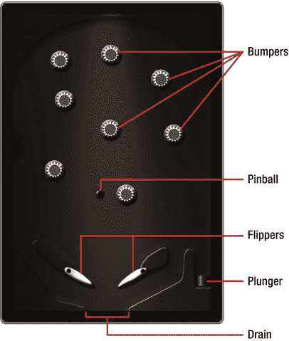

图 13-1 . 本章构建的弹球桌

## 形状：凸形与逆时针

我们先从碰撞多边形的需求开始。在为 Box2D 和 Chipmunk 定义碰撞多边形时，首先需要注意，这些引擎期望碰撞多边形具有以下属性：

*   顶点按逆时针顺序定义
*   多边形为凸形

*凸形*是一种你可以在任意两点之间画一条直线，且该直线始终位于形状内部的形状。在*凹形*中，可以在两点之间画一条直线，但该直线不完全包含在形状内部。图 13-2 展示了凸形与凹形的区别。

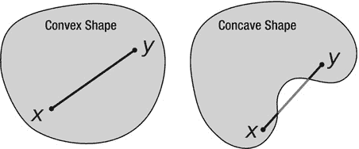

图 13-2 . 凸形与凹形

以逆时针顺序定义凸形顶点，可以通过在脑海中绘制一个凸形来理解。你在任意位置放置一个顶点，然后向左放置另一个顶点。接着向下向右，你就以逆时针方向画出了一个矩形。或者放置另一个顶点，然后向右、向上、再向左，你就画出了一个逆时针形状。从哪个顶点开始并不重要，但遵循顶点的逆时针方向非常关键。

幸运的是，如果你使用 PhysicsEditor，你无需关心多边形的顶点顺序（方向）或多边形是凸形还是凹形。PhysicsEditor 会自动为你透明地处理这些问题。PhysicsEditor 会将凹形分割成一个或多个凸形。PhysicsEditor 附带的物理对象加载器随后会将所有形状分配给一个 Box2D 物体。为了获得最佳性能，尽量让每个物体拥有尽可能少的碰撞形状，**避免**形状被分割仍然是一个好的实践。


**提示** 如何判断你是否犯了错误，意外创建了顺时针方向或凹形的碰撞形状？每个物理引擎的反应都不同。有些引擎会直接抛出错误来告知你。但就`Box2D`而言，如果一个移动的物体撞到了一个未正确成型的碰撞形状，那么当它靠近该形状时，移动的物体会直接停止运动。如果你在`Box2D`游戏中看到这种效果，请检查附近的碰撞多边形。

**使用`PhysicsEditor`**

掌握了正确定义碰撞多边形的知识后，是时候看看`PhysicsEditor`工具了，你可以从`www.physicseditor.de`下载它。打开下载的`PhysicsEditor`磁盘映像，并将`PhysicsEditor.app`拖到你的应用程序文件夹后，就可以运行`PhysicsEditor`了（见图 13-3）。在`PhysicsEditor`磁盘映像中，你还会找到一个名为`Loaders`的文件夹，里面包含了用于加载由`PhysicsEditor`创建的`Box2D`和`Chipmunk` plist 文件的加载器代码（形状缓存）。在本章的示例项目中，你将使用位于`Loaders/generic-box2d-plist`文件夹中的`GB2ShapeCache`类来加载由`PhysicsEditor`创建的形状。

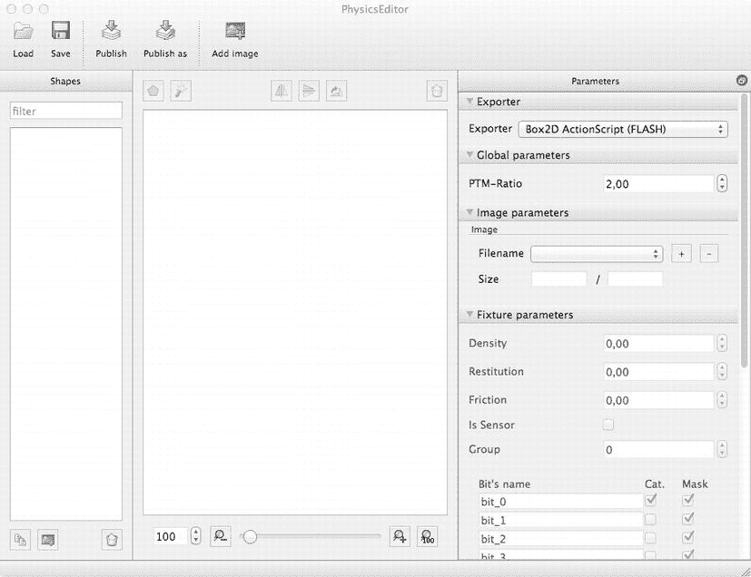

图 13-3 。`PhysicsEditor`应用程序

如果你之前下载过`PhysicsEditor`磁盘映像，请重新下载最新版本，因为`GB2ShapeCache`类可能已经更新——例如，为了兼容`Box2D v2.2`。

将`GB2ShapeCache`文件添加到你的项目后，你会注意到项目将无法编译并报错。问题在于`GB2ShapeCache`并未考虑`ARC`。但这很容易修复：只需再次执行“编辑  重构  转换为 Objective-C ARC…”流程，并允许`Xcode`对`GB2ShapeCache`文件进行必要的修改。

现在，你应该将位于`PhysicsBox2DPinball01`项目中`Assets/pinball`文件夹下的`PNG`文件拖放到`PhysicsEditor`最左侧标记为“Shapes”的窗格中。

**注意** 你将只使用高清（HD）分辨率图像来创建`PhysicsEditor`的物理形状。你不需要分别为高清和标清（SD）分辨率创建物理形状。物理模拟世界独立于对象的图形表示，因此也独立于屏幕分辨率。

在`PhysicsEditor`中，你首先应该修改的是导出器的设置。`PhysicsEditor`可以导出到多个游戏引擎，同时支持`Box2D`和`Chipmunk`物理引擎，甚至允许你创建自己的自定义导出格式。要编写与`cocos2d`兼容的文件，你必须在最右侧的窗格中将“Exporter”设置设为“Box2D generic (PLIST)”。首先设置导出器很重要，因为根据目标物理引擎的能力，它会启用或禁用`PhysicsEditor`图形界面的一些功能。

接下来，你应该将“PTM-Ratio”设置设为`240`。此值的单位是像素/米，意味着`240`像素在`Box2D`物理模拟世界中将等于`1`米。`Box2D`物理世界的尺寸很重要，因为`Box2D`针对尺寸在`1`到`10`米的对象进行了优化。虽然你也可以运行包含更大或更小对象的模拟，但当你有非常大的对象（数十米甚至数百米）或非常小的对象（一米的小部分或极小部分）时，`Box2D`会失去精度并可能出现异常行为。

因为你在`PhysicsEditor`中使用的是高分辨率图像，所以`240`的`PTM-Ratio`将创建一个高`4`米（960 Retina 分辨率像素除以`240`）、宽`2.6`米（640 Retina 分辨率像素除以`240`）的弹球台。在`cocos2d`中，实际的像素与米比例将是`PhysicsEditor`中`PTM-Ratio`设置的一半——在这种情况下，是每米`120`像素。这是因为`cocos2d`坐标系统使用点（points），这意味着标准分辨率显示器和 Retina 显示器具有相同的尺寸：`320x480`点。一个点在标准显示器上等于`1`个像素，在 Retina 显示器上等于`2`个像素。`Box2D`物理世界中桌子的尺寸不受实际屏幕分辨率的影响。如果你只使用标准分辨率图像并在应用中禁用了 Retina 支持，那么`PhysicsEditor`中的`PTM-Ratio`设置将等于`Cocos2D`中的值。

**定义弹射器形状**

让我们从弹射器开始，这是将球弹入游戏区域的弹簧。选择最左侧窗格中的弹射器图像，然后点击中央视图工具栏上的“Add polygon”按钮。这将在中央工作区创建一个新的三角形形状并高亮显示它。因为你需要一个矩形形状，双击其中一条边以添加第四个顶点。如果你添加了太多顶点，可以右键单击或按住 Option 键单击一个顶点，然后选择“Delete point”来删除它。

通过点击并拖动四个顶点，将它们移动到弹射器的四个角。创建一个包含整个弹射器（包括弹簧）的矩形形状。这样做可以避免当球意外掉到弹射器头部下方时出现问题。

你可能已经注意到那个带有“+”的小蓝圈。这是形状的锚点，它与该形状精灵的锚点重合。稍后，当你在`cocos2d`中定位形状时，形状的锚点将位于你提供的坐标中心。

将锚点移动到弹射器图像的底部中心，以便更容易定位弹射器。你可以拖动蓝色圆圈，但在许多情况下，你可能希望非常精确地放置它。在这些情况下，你可以在“Parameters”窗格下的“Image Parameters”中修改锚点的绝对像素位置或相对位置。

图 13-4 显示了正在编辑的弹射器形状。

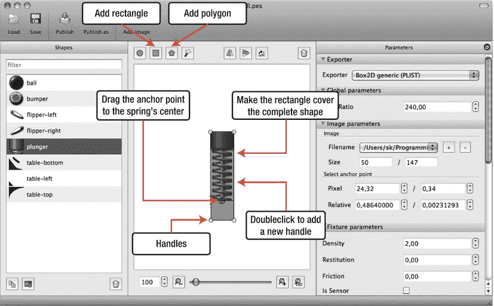

图 13-4 。在`PhysicsEditor`中手动定义一个形状

除了从多边形创建形状，你也可以使用“Add Rectangle”按钮（但如果那样的话，我就没法教你如何添加或删除顶点，以及如何拖动它们了）。

你可以并且应该设置弹射器的碰撞位（collision bits）。这在“Parameters”窗格的“Fixture parameters”部分下进行。碰撞位允许你定义哪些形状会碰撞，哪些不会。你将使用碰撞位设置来防止弹射器与除球以外的任何形状发生碰撞。

为了让碰撞位的使用更方便，你可以更改碰撞位的名称。碰撞位名称不会被导出；它们仅用于提醒你每个位的用途。默认情况下，这些位被命名为`bit_0`到`bit_15`。你需要将前五个位的名称分别更改为`Ball`、`Bumper`、`Flipper`、`Plunger`和`Wall`。


# Box2D 碰撞设置与弹球桌形状定义

Box2D 的图形之间发生碰撞的唯一条件是：两者的分类位（Cat. 列对应的复选框）和掩码位（Mask 列对应的复选框）都进行了设置。通常，您希望将每个图形分配到某一个特定的分类。对于弹球杆（`plunger`），请确保只设置了 `Plunger` 分类的分类位。换句话说，您将弹球杆的图形分配到了 `Plunger` 碰撞位分类中。然后，通过 Mask 复选框，您可以设置该图形允许与哪些其他分类发生碰撞。对于弹球杆，您应该只设置 `Ball` 分类的 Mask 复选框，从而允许弹球杆与球发生碰撞。Figure 13-5 展示了弹球杆碰撞分类和掩码标志的正确设置。

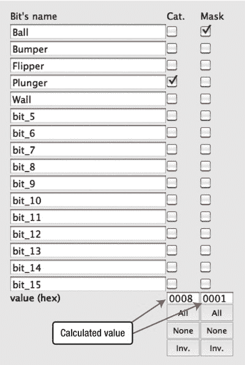

Figure 13-5.  弹球杆的碰撞参数

**注意**：到目前为止，弹球杆会与球发生碰撞，但球不会与弹球杆发生碰撞。请记住，定义碰撞是一个双向的过程，在这种情况下，您还需要将球放入 `Ball` 分类，并勾选球掩码位中与 `Plunger` 分类对应的选项，才能使球和弹球杆相互碰撞。

您也可以设置同一分类的掩码位，从而允许同一分类的多个对象相互碰撞。对于球的图形，设置 `Ball` 分类的掩码位以允许球与球之间的碰撞是有意义的。如果您想扩展弹球游戏以支持同时有多个球在桌面上，这将非常有用。

在 Cat. 和 Mask 列下方是 `All`、`None` 和 `Inv.` 按钮，它们允许您全选、全部取消或反转复选框的选中状态。它们有助于避免逐个点击几十个复选框。

### 定义桌面形状

弹球桌由三个独立的图形组成，分别命名为 `table-bottom`、`table-left` 和 `table-top`。将桌面背景图像拆分，可以更轻松地编辑其形状，并且可以更轻松地创建不同的弹球布局，而无需替换整个图像。

在`形状`(Shapes)面板中选择 `table-top` 图像，开始编辑弹球桌最顶部部分的形状。如 Figure 13-6 所示，这是一个凹形。使用定义弹球杆的手动方法来手动创建这个圆形图形的所有顶点将是困难且容易出错的，更不用说确保生成的图形是凸形的了。`PhysicsEditor` 为您简化了这一过程：它追踪形状的轮廓，只需单击一次鼠标即可创建合适的图形！

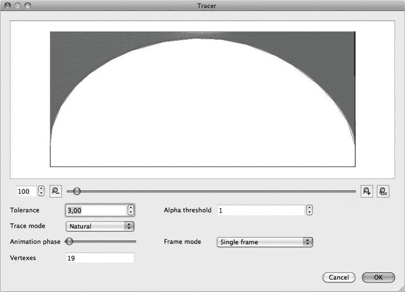

Figure 13-6.  形状追踪器（Shape Tracer）自动创建图形

单击工具栏中名为`形状追踪器`(Shape Tracer)的魔术棒图标，打开如 Figure 13-6 所示的`形状追踪器`(Shape Tracer)对话框。

`形状追踪器`(Shape Tracer)会显示图形的图像以及您单击 `OK` 按钮后将要创建的形状的叠加层。图像下方是一个滑块及其左右两侧用于控制图像缩放级别的按钮。图像缩放设置不会影响形状的创建方式。

在`形状追踪器`(Shape Tracer)中，您需要调整的最重要的设置是`容差`(Tolerance)设置。`容差`(Tolerance)决定了追踪图像以创建形状的精确程度，这直接影响形状使用的顶点数量，而形状的顶点数量又会影响物理模拟的性能。通常，您应始终力求以最少的顶点来实现足够的碰撞响应。对于您的游戏来说，碰撞的准确性越重要，您就应该为某些对象允许越多的顶点。同时，如果您使用相同的形状添加了许多对象，那么使用顶点较少的形状将会带来更好的性能。

通过尝试不同的`容差`(Tolerance)设置，我发现本例中的一个良好折衷方案是容差值为 `4,0`。这样会创建一个包含 18 个顶点的形状，并且这是能够相当准确地追踪图像形状的最高容差值。默认的容差值 `1,0` 会创建一个包含 31 个顶点的形状，因此我节省了 13 个顶点。但是，如果您遍历不同的容差值，您会注意到即使容差值仅为 `1,5`，也足以将顶点数量减少到 20 个。

**提示**：您可以使用`形状追踪器`(Shape Tracer)中的`帧模式`(Frame Mode)设置为动画（图像序列）创建形状。要在 `PhysicsEditor` 中创建动画，您需要在默认的 `PhysicsEditor` 窗口中的`参数`(Parameters)面板下的`图像参数`(Image Parameters)中，为一个形状添加更多图像文件。通过单击`文件名`(Filename)设置旁边的 `+` 按钮，您可以为单个形状添加额外的图像；然后，您可以让形状追踪创建一个形状，该形状是每个动画帧形状的交集或并集。

当您对追踪的形状感到满意时，单击 `OK` 按钮关闭`形状追踪器`(Shape Tracer)对话框。这将创建新的形状。为了让弹球桌的碰撞平滑运行，您仍然需要执行一个快速的手动调整。由于屏幕区域定义了弹球桌侧面的碰撞，您应该将左下角和右下角的顶点略向外拖出屏幕区域并向下移动，同时将左上角和右上角的顶点略向外拖出屏幕区域并向上移动，使它们明显位于 `table-top` 图像周围绘制的黑色边框之外。请参见 Figure 13-7 以获得视觉提示。

通过拉伸这两个顶点，形状将形成到屏幕边框侧面的平滑过渡。如果不拉伸它们，由于物理模拟中总是存在微小的不准确性，球可能会从这些顶点尖角处被反弹。

现在，将锚点（带有 `+` 的蓝色圆圈）移动到左上角，最好使用`参数`(Parameters)面板中`图像参数`(Image Parameters)下的锚点设置。将`相对`(Relative)值分别设置为 `0,0` 和 `1,0`，以将锚点移动到左上角。这个锚点位置将允许您稍后通过简单地将其定位到点坐标 `0,480`，将图像与屏幕边框精确对齐。

**注意**：如果您没有看到锚点圆圈，并且在`图像参数`(Image Parameters)下没有锚点设置，则说明您在`参数`(Parameters)面板中的`导出器`(Exporter)设置没有设置为 `Box2D generic (PLIST)` 格式。

最后一步是调整 `table-top` 图形的碰撞位。勾选 `Wall` 行的分类（Cat.）复选框，然后设置 `Ball` 行的 Mask 复选框。这将启用弹球桌与球的碰撞。相应地，您还需要为 `table-left` 和 `table-bottom` 图形设置相同的碰撞位，因为它们都属于 `Wall` 分类，并且应该与 `Ball` 分类发生碰撞。

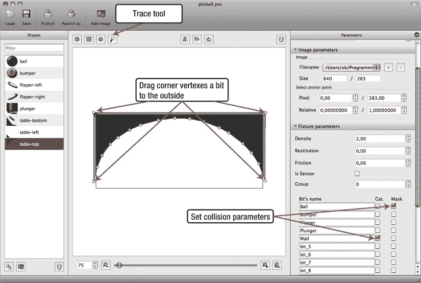

Figure 13-7.  完成桌面的顶部形状


使用`Shape Tracer`以相同的方式为`table-left`图像创建形状。在“Image Parameters”下，将锚点移动到像素坐标`0,0`和`50,0`。别忘了像之前为`table-top`设置碰撞位一样设置碰撞位。

现在您将为`table-bottom`图像描摹形状。这需要几个额外的步骤，因为`table-bottom`图像实际上由四个独立的、不相连的元素组成，每个元素都需要有自己的形状。`PhysicsEditor`的 1.0.4 版本只能描摹连续的形状，因此您需要总共打开`Shape Tracer`四次。每次打开`Shape Tracer`时，点击您想要描摹的图像部分，然后点击`OK`来创建形状。所有四个形状的`Tolerance`设置设为`4,0`效果都很好。您最终应得到四个形状，覆盖`table-bottom`图像的所有四个元素。别忘了像为`table-top`设置的那样精确地设置碰撞位，如图 Figure 13-7 所示。

### 定义挡板

选择`flipper-left`图像并打开`Shape Tracer`。请注意，`Shape Tracer`最初建议的形状没什么意义——该形状比图像所暗示的要大得多。

这是因为图像带有发光和阴影效果，会在形状本身周围产生光晕，这在浅色背景上几乎看不见。为了让`Shape Tracer`创建出更好的形状，请调整`Alpha threshold`设置。默认值为`0`，这意味着所有不完全透明的像素在描摹形状时都会被考虑。在这种情况下，您只想让完全不透明的像素参与形状的创建。如果您将`Alpha threshold`设置为`254`，如图 Figure 13-8 所示，您将得到更好的结果。

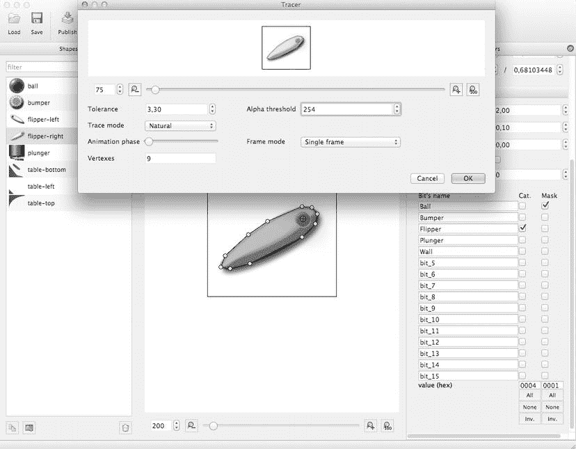

Figure 13-8 。使用 Alpha 阈值描摹挡板的形状，以忽略图像阴影

**提示** 如果出于任何原因`Shape Tracer`的结果不是您想要的，并且`Tolerance`或`Alpha threshold`设置都无法让您修正形状，您仍然可以在关闭`Shape Tracer`后手动编辑形状。只需点击任意顶点并拖动它。您也可以双击一个顶点来删除它，或者双击两个顶点之间的线段来添加一个新顶点。

对`flipper-right`图像重复相同的过程。别忘了为两个挡板设置碰撞位。您需要勾选`Flipper`类别和`Ball`行中的`Mask`复选框。Figure 13-8 显示了正确的碰撞位设置。

您应将左挡板的锚点设置为像素坐标`27,78`，右挡板设置为`97,79`。

### 定义缓冲器和球

球和缓冲器图像都是圆形，因此您可以使用工具栏中的`Add Circle`命令来创建圆形形状。圆形形状只有一个“顶点”，它充当调整圆形大小的手柄。

从缓冲器开始，更改圆形形状的大小和位置，使其覆盖缓冲器的实体部分，同时忽略缓冲器的阴影。将缓冲器的锚点设置为像素坐标`33, 42`，使锚点位于缓冲器的中心。设置碰撞位类别复选框为`Bumper`，并勾选`Ball`行中的`Mask`复选框。

为了模拟缓冲器的弹跳效果，修改`Parameters`窗格中标签为`Restitution`的`Fixture`参数。*Restitution* 是一个物体排斥其他碰撞物体的弹性量。`0`的恢复系数意味着碰撞完全没有弹性，会使来袭物体停止。`1`的恢复系数模拟完美的弹性碰撞，允许碰撞物体在碰撞后以相同速度继续运动。

因为在这种情况下您想模拟来自缓冲器的额外排斥力，您可以使用`1,5`或更高的值，使碰撞物体在碰撞后以比碰撞时更高的速度远离。

最后，为球图像创建圆形形状。调整圆形形状的大小和位置，使其完全覆盖整个球图像。将锚点的相对值设置为`0,5`和`0,5`。

至于球的碰撞位，设置类别复选框为`Ball`，并勾选其他所有类别的`Mask`复选框：`Ball`、`Bumper`、`Flipper`、`Plunger`和`Wall`。您也可以直接点击`Mask`列底部的`All`按钮。因为您不使用其他位，它们是否被勾选并不重要。

球的一些`Fixture`参数会影响球在桌面上的行为。我将`Density`设置为`8,0`，`Restitution`设置为`0,3`，`Friction`设置为`0,7`。这些设置给球带来了一点弹性。请随意调整这些设置，并观察球的行为如何变化。

### 保存并发布

最后，您应该保存当前的`PhysicsEditor `.pes`文件。您以后可以打开`.pes`文件继续编辑形状。您不应将`.pes`文件添加到您的`Xcode`项目中；它仅供`PhysicsEditor`使用。

要在`cocos2d`中使用这些形状，请使用`Publish`按钮。这将创建一个`.plist`文件，该文件可以被`PhysicsEditor`附带的`GB2ShapeCache`类读取。对于`PhysicsBox2DPinball01`项目，我将形状发布为项目`Resources`文件夹中的`pinball-shapes.plist`。将此文件添加到`Xcode`的`Resources`组中。

## 编程实现弹球游戏

现在您可以进入实现阶段，实际编写弹球游戏的代码。您将学习如何在进入球、弹射器、缓冲器和挡板等交互元素之前布局桌面。但在那之前，我想向您介绍基本的`BodySprite`类，它同步`cocos2d`精灵与`Box2D`物体，这与`cocos2d`的`Box2D`项目模板提供的`PhysicsSprite`类类似。主要区别在于`BodySprite`使用`GB2ShapeCache`类来创建其`b2Body`对象，并且当`BodySprite`对象从内存中释放时，它也会销毁其物体。

**注意** 请记住，弹球项目使用的是用`C++`编写的`Box2D`。这要求您对所有类实现文件使用`.mm`文件扩展名而不是`.m`，以便编译器正确切换为编译`C++`代码而不是 C 代码。每当您创建一个新的`Objective-C`类时，您必须重命名实现文件，使其使用`.mm`文件扩展名。否则，您会看到许多看似由`Box2D`源代码引起的编译错误。

### 强制竖屏方向

弹球桌面设计为竖屏方向游玩，但`cocos2d`将其项目模板设置为仅使用横屏方向。您可以通过打开`AppDelegate.m`并找到`shouldAutorotateToInterfaceOrientation`方法轻松解决此问题。此方法应为所有支持的方向返回`YES`，否则应返回`NO`。您可以使用`UIInterfaceOrientationIsPortrait`宏来测试给定的界面方向是否为竖屏模式。如果是，它将返回`YES`。

```objc
-(BOOL) shouldAutorotateToInterfaceOrientation: ←
    (UIInterfaceOrientation)interfaceOrientation
{
    return UIInterfaceOrientationIsPortrait(interfaceOrientation);
}
```

`Kobold2D`用户也可以使用应用程序目标属性“Summary”选项卡上的“Supported Device Orientation”按钮来更改支持哪些方向以及不支持哪些方向。

### BodySprite 类


# `BodySprite` 类

`BodySprite` 类背后的理念是，您希望为所有动态类使用一个自包含的对象。到目前为止，您只是将 body 添加到 `PhysicSprite` 的 `physicsBody` 属性中，并且很容易忘记将 sprite 本身作为 `userdata` 添加到 body。`BodySprite` 类旨在使 `PhysicsSprite` 类更加自包含。

`BodySprite` 派生自 `PhysicsSprite`，因此包含 Box2D 的 `physicsBody` 属性和实例变量。由于弹球游戏元素的所有类都派生自 `BodySprite` 类，因此您拥有一个通用的类来进行操作，然后可以进一步探测其类型。例如，您可以使用 `isKindOfClass` 方法在运行时从任何 `BodySprite*` 指针确定您正在使用哪个类。`isKindOfClass` 方法受所有派生自 `NSObject` 的类支持。

此外，`BodySprite` 类头文件包含常用的头文件，例如 `Box2d.h` 和 `Helper.h`（参见清单 13-1）。`Helper` 类包含您之前使用过的有用函数，例如 `toPixels` 和 `toMeters`，以及 `locationFromTouch` 和 `screenCenter`。`Constants.h` 文件包含 `PTM_RATIO`，因为它将被多个类需要。

***清单 13-1.**  `BodySprite` 头文件*

```
#import "cocos2d.h"
#import "Constants.h"
#import "Helper.h"
#import "PhysicsSprite.h"
#import "GB2ShapeCache.h"

@interface BodySprite : CCSprite
{
}

/**
 * 创建一个新的形状
 * @param shapeName: 形状和 sprite 的名称
 * @param inWorld: 指向要添加 sprite 的世界对象的指针
 * @return BodySprite 对象
 */
-(id) initWithShape:(NSString*)shapeName inWorld:(b2World*)world;

/**
 * 更改 body 的形状
 * 移除 body 的 fixtures 并用新的替换它们
 * @param shapeName 要设置的形状名称
 */
-(void) setBodyShape:(NSString*)shapeName;

@end
```

您使用初始化方法 `initWithShape` 通过使用在 PhysicsEditor 中定义的提供的形状名称来初始化 body 和 sprite。它假设图像名称和形状名称是相同的。

**Caution**  默认情况下，TexturePacker 会保留图像的文件扩展名，因此您的形状可能被命名为 “plunger”，但 sprite 帧名称可能是 “plunger.png”。要解决此问题，您必须在 TexturePacker 的输出窗格中选中“Trim sprite names”复选框。本章使用的 `pinball.tps` 文件已设置此复选框；它会从 sprite 帧名称中移除 `.png` 扩展名。这样，TexturePacker sprite 帧和 PhysicsEditor 形状名称将保持相同。

对于纹理图集，您使用 TexturePacker 并将 `pinball` 文件夹添加为智能文件夹引用，这意味着 TexturePacker 将根据 `pinball` 文件夹中图像的所有更改使纹理图集内容保持最新。有关如何设置智能文件夹引用的说明，请参阅第 6 章。

您还需要设置一个尚未使用的额外选项：修剪 sprite 名称。此功能从 sprite 名称中移除 `.png` 后缀。其优点是您可以为物理形状和 sprite 使用相同的名称。唯一的告诫是，您必须引用不带 `.png` 扩展名的 sprite 帧名称，诚然，出于习惯，这有时很容易忘记。

清单 13-2 显示了 `BodySprite` 类实现文件。

***清单 13-2.**  `BodySprite` 类实现*

```
#import "BodySprite.h"

@implementation BodySprite

@synthesize body;

-(id) initWithShape:(NSString*)shapeName inWorld:(b2World*)world
{
    // 使用给定的形状名称初始化 sprite 本身
    self = [super initWithSpriteFrameName:shapeName];
    if (self)
    {
        // 创建 body
        b2BodyDef bodyDef;
        physicsBody = world->CreateBody(&bodyDef);
        physicsBody->SetUserData((__bridge void*)self);

        // 设置形状
        [self setBodyShape:shapeName];
    }
    return self;
}

-(void) setBodyShape:(NSString*)shapeName
{
    // 从 body 中移除任何现有的 fixtures
    b2Fixture* fixture;
    while ((fixture = physicsBody->GetFixtureList()))
    {
        physicsBody->DestroyFixture(fixture);
    }

    // 从形状缓存中附加一个新形状
    if (shapeName)
    {
        GB2ShapeCache* shapeCache = [GB2ShapeCache sharedShapeCache];
        [shapeCache addFixturesToBody:physicsBody forShapeName:shapeName];

        // 分配形状的 anchorPoint（PhysicsEditor 中圆圈内的蓝色 +）
        // 作为 BodySprite 的 anchorPoint。否则图像和形状会发生偏移。
        self.anchorPoint = [shapeCache anchorPointForShape:shapeName];
    }
}

-(void) dealloc
{
    // 从世界中移除 body
    physicsBody->GetWorld()->DestroyBody(physicsBody);
}

@end
```

`BodySprite` 实现使用 `initWithSpriteFrameName` 方法初始化 sprite。然后它调用世界的 `CreateBody` 方法，并将 `self` 设置为 body 的用户数据指针，允许您稍后在 Box2D 碰撞回调方法中访问 `BodySprite` 类。由于您使用 ARC，因此需要将 `self` 进行 `__bridge` 转换为 `void*`，以告诉编译器 `self` 作为弱引用传递给 C++ 方法 `SetUserData`。换句话说，您告诉 ARC，Box2D 不会释放 `self` 对象的内存，并且您接受如果 `self` 被 ARC 从内存中释放，则 body 的 `userdata` 将是一个无效指针。由于 `BodySprite` 在释放时会释放 Box2D body，并且在 `self` 对象之前从内存中释放 body，因此这不会引起任何问题。

**Tip**  `CCNode` 类也有一个 `userData` 属性，您可以以与 `b2Body` 的 `userData` 字段相同的方式使用它，包括需要使用 `(__bridge void*)` 转换。但 `CCNode` 还有一个 `userObject` 属性，其类型为 `id`，其目的与 `userData` 相同。如果您需要将任意 Objective-C 类对象存储在 `CCNode` 对象中，请使用 `userObject` 属性以避免执行 `__bridge` 转换。

使用 PhysicsEditor 的 `GB2ShapeCache` 类，通过提供的 `shapeName` 将 fixtures 添加到 body。`PhysicsBox2DPinball01` 项目已包含必要的文件。要在一个新项目中使用 `GB2ShapeCache` 类，只需记住将 `PhysicEditor.dmg` 磁盘映像文件夹 `/Loaders/generic-box2d-plist` 中的 `GB2ShapeCache.h` 和 `GB2ShapeCache.mm` 文件添加到您的 Xcode 项目，然后重新运行前面描述的“转换为 Objective-C ARC”过程。

这里要理解的关键点是，`BodySprite` 是一个 `CCSprite`，它为您管理 Box2D body 的分配、释放和配置。它还确保您可以访问 `BodySprite` 类，从而访问 cocos2d sprite，而通常您只能访问 Box2D body 对象。因此，`BodySprite` 类成为将物理体与 cocos2d sprite 结合在一起的粘合剂。

如果一个派生自 `BodySprite` 的 sprite 超出作用域（例如，如果您将其作为子节点从其 cocos2d 父节点中移除），那么 `BodySprite` 将为您负责销毁 Box2D body。这是与 cocos2d 的 `PhysicSprite` 类最重要的区别，后者只能让您完成一半的工作。


## 排版后的文本

此外，你可以通过调用 `setBodyShape` 来改变精灵的身体形状。这会移除身体上所有现有的固定装置，然后从 `GB2ShapeCache` 中添加与给定 `shapeName` 关联的固定装置。这只会改变身体的碰撞形状，并保留身体当前的运动状态，例如其速度、位置和旋转角度。请记住，调用此方法非常耗时，应仅在必要时执行。每一帧都改变身体形状显然不是一个好主意。

所有继承自 `BodySprite` 的类现在只需关注设置正确的形状名称以及该类特有的代码。

## 创建弹球桌

弹球桌由三个独立的图像和关联的形状组成，分别命名为 `table-top`、`table-left` 和 `table-bottom`。你将使用继承自 `BodySprite` 的 `TablePart` 类来创建桌面。`TablePart` 的头文件仅添加了静态初始化方法 `tablePartInWorld`，如代码清单 13-3 所示。

***代码清单 13-3.**  TablePart 类接口*

```
#import "BodySprite.h"

@interface TablePart : BodySprite
{
}

+(id) tablePartInWorld:(b2World*)world position:(CGPoint)pos name:(NSString*)name;
@end
```

代码清单 13-4 中的 `TablePart` 实现也同样平淡无奇，因为其唯一目的是初始化 `BodySprite`，然后将身体的位置设置到所需坐标。这也会在下一次执行 `PinballTableLayer` 类的 update 方法时自动更新精灵的位置（请参考代码清单 13-3）。

`TablePart` 类还将身体类型设置为 `b2_staticBody`，这使得每个 `TablePart` 成为一个静止物体。这有两个优点：一是 Box2D 无需对静态物体执行某些计算；二是与静态身体碰撞的物体根本不会影响静态身体的位置或旋转。

***代码清单 13-4.**  TablePart 类实现*

```
#import "TablePart.h"
#import "Helper.h"

@implementation TablePart
-(id) initWithWorld:(b2World*)world position:(CGPoint)pos name:(NSString*)name
{
    if ((self = [super initWithShape:name inWorld:world]))
    {
        // 设置身体位置
        physicsBody->SetTransform([Helper toMeters:pos], 0.0f);

        // 使身体变为静态
        physicsBody->SetType(b2_staticBody);
    }
    return self;
}

+(id) tablePartInWorld:(b2World*)world position:(CGPoint)pos name:(NSString*)name
{
    return [[self alloc] initWithWorld:world position:pos name:name];
}
@end
```

为了创建所需的三个 `TablePart` 实例（以及稍后的其他弹球元素），我创建了 `TableSetup` 类，该类负责创建构成弹球桌身体的各种 `BodySprite` 实例。`TableSetup` 继承自 `CCSpriteBatchNode`，以提高弹球桌元素的渲染性能。

这是 `TableSetup` 类的头文件：

```
#import "cocos2d.h"
#import "Box2D.h"

@interface TableSetup : CCSpriteBatchNode
{
}

+(id) setupTableWithWorld:(b2World*)world;
@end
```

因为这并不引人注目，让我们将注意力转向项目中 `TableSetup` 类的实现，如代码清单 13-5 所示。

***代码清单 13-5.**  TableSetup 类实现*

```
#import "TableSetup.h"
#import "Constants.h"
#import "TablePart.h"

@implementation TableSetup
-(id) initTableWithWorld:(b2World*)world
{
    if ((self = [super initWithFile:@"pinball.pvr.ccz" capacity:5]))
    {
        // 添加桌面板块
        [self addChild:[TablePart tablePartInWorld:world
                       position:ccp(0, 480)
                                      name:@"table-top"]];
        [self addChild:[TablePart tablePartInWorld:world
                       position:ccp(0, 0)
                                      name:@"table-bottom"]];
        [self addChild:[TablePart tablePartInWorld:world
                       position:ccp(0, 263)
                                      name:@"table-left"]];
    }

    return self;
}

+(id) setupTableWithWorld:(b2World*)world
{
    return [[self alloc] initTableWithWorld:world];
}
@end
```

目前，`TableSetup` 类的作用是创建构成弹球桌静态背景元素的三个 `TablePart` 类。它还会设置每个 `TablePart` 实例的正确位置，该位置受其形状的 `anchorPoint` 影响。例如，`table-top` 图像的形状 `anchorPoint` 设置在图像的左上角，这样将其定位在 (0, 480) 就能使图像和形状在屏幕顶部边界处正确对齐。由于 `TablePart` 继承自 `BodySprite`，而 `BodySprite` 又继承自 `CCSprite`，因此将这些类直接添加到继承自 `CCSpriteBatchNode` 的 `TableSetup` 类中，是合法且非常方便的。

稍后你将扩展 `TableSetup` 类，以添加其他弹球桌元素——弹射器、球、缓冲器和挡板。

**提示**  你是否注意到使用了 `ccp` 方法？它与 `CGPointMake` 方法完全相同，但一些 cocos2d 开发者更喜欢使用 `ccp` 而不是 `CGPointMake`，仅仅是因为它输入起来更简短。你可以在 `CGPointExtension.h` 中找到一整套有用的 `ccp` 数学函数。特别是在开发物理游戏时，它们往往非常有用。Box2D 也带来了自己的数学函数，定义在 `b2Math.h` 中。原因是 Box2D 的向量类（如 `b2Vec2`）是 C++ 类，而不是像 `CGPoint` 这样的 C 结构体，这意味着 Box2D 数据结构通常不能与 `ccp` 方法一起使用。

`TableSetup` 类本身由 `PinballTableLayer` 类初始化，该类基于第 12 章中 Box2D 项目的 `HelloWorldLayer` 类。代码清单 13-6 展示了 `PinballTableLayer` 类的接口。

***代码清单 13-6.**  PinballTableLayer 类头文件*

```
#import "cocos2d.h"
#import "Box2D.h"
#import "GLES-Render.h"
#import "ContactListener.h"

@interface PinballTableLayer : CCLayer
{
    b2World* world;
    ContactListener* contactListener;
    GLESDebugDraw* debugDraw;
}

+(id) scene;
@end
```

它包含对 `ContactListener` 和 `GLESDebugDraw` 类的引用。后者我稍后会介绍；而 `ContactListener` 类将在你添加弹球游戏的弹射器时发挥作用。现在，我们先看看代码清单 13-7 中 `PinballTableLayer` 类的初始化过程。

***代码清单 13-7.**  `PinballTableLayer` 类的初始化*

```
#import "PinballTableLayer.h"
#import "BodySprite.h"
#import "Constants.h"
#import "Helper.h"
#import "GB2ShapeCache.h"
#import "TableSetup.h"

@implementation PinballTableLayer
-(id) init
{
    if ((self = [super init]))
    {
        // 从纹理图集中预加载精灵帧
        [[CCSpriteFrameCache sharedSpriteFrameCache]←
        addSpriteFramesWithFile:@"pinball.plist"];

        // 加载物理定义
        [[GB2ShapeCache sharedShapeCache] addShapesWithFile:@"pinball-shapes.plist"];

        // 初始化 box2d 世界
        [self initPhysics];
```


```objc
// 从纹理图集加载背景
        CCSprite* background = [CCSprite spriteWithSpriteFrameName:@"background"];
        background.anchorPoint = ccp(0,0);
        background.position = ccp(0,0);
        [self addChild:background z:-3];

// 设置桌面元素
        TableSetup* tableSetup = [TableSetup setupTableWithWorld:world];
        [self addChild:tableSetup z:-1];

[self scheduleUpdate];
    }
    return self;
}

. . .

@end
```

`CCSpriteFrameCache` 通过加载 `pinball.plist` 文件，从 TexturePacker 创建的纹理图集中加载精灵帧。

更重要的是，紧接着需要将 `pinball-shapes.plist` 文件加载到 `GB2ShapeCache` 类中。**务必在调用任何其他 Box2D 方法之前完成此操作**，这样才能使形状缓存的 `ptmRatio` 正确设置为 PhysicsEditor 中设置的 PTM-Ratio 值。回顾一下，PTM-Ratio 是你在本章开头最先修改的 PhysicsEditor 设置之一。

在第 12 章中使用的像素到米宏 `PTM_RATIO` 已从简单的常数值更改为以下定义，你可以在 `Constants.h` 头文件中找到：

```
#import "GB2ShapeCache.h"
#define PTM_RATIO ([GB2ShapeCache sharedShapeCache].ptmRatio * 0.5f)
```

这个改进后的 `PTM_RATIO` 宏现在从 `GB2ShapeCache` 类获取点与米的比率。这就是为什么你必须确保在使用 `PTM_RATIO` 宏之前初始化形状缓存。

形状缓存的 `ptmRatio` 被除以 2（乘以 `0.5f`），因为 PhysicsEditor 中创建的形状基于 Retina 分辨率图像，而 cocos2d 用于定位节点的与分辨率无关的点坐标始终假设 iPhone 的屏幕分辨率为 480x320 点。

`initPhysics` 方法仍然执行 Box2D 物理引擎的初始化。Box2D 的 `init` 代码与上一章基本相同，有两个例外：用于保持动态对象在屏幕区域内的静态屏幕边界形状没有定义顶部或底部形状，允许动态体通过底部掉出屏幕。我们需要这个功能，以便球能够滚入桌面的排水口。你不需要顶部形状，因为会有一个弹球桌形状阻挡屏幕的整个上部区域。

除此之外，左右边界的碰撞参数在 `init` 代码中设置，因为这些形状不是借助 PhysicsEditor 定义的。`categoryBits` 必须设置为 `Wall` 位（PhysicsEditor 中的碰撞位 4），`maskBits` 必须设置为 `Ball` 位（PhysicsEditor 中的碰撞位 0）。位值以十六进制格式指定，由前缀 `0x` 表示。你会发现 PhysicsEditor 在“夹具参数”下的“Cat.”和“Mask”列中显示这些十六进制值。

以下是 `initBox2dWorld` 方法，与第 12 章中的 Box2D 初始化代码相比，更改和新增部分已高亮显示：

```objc
-(void) initPhysics
{
    b2Vec2 gravity;
    gravity.Set(0.0f, -10.0f);
    world = new b2World(gravity);
    world->SetAllowSleeping(true);
    world->SetContinuousPhysics(true);

    contactListener = new ContactListener();
    world->SetContactListener(contactListener);

    debugDraw = new GLESDebugDraw(PTM_RATIO);
    world->SetDebugDraw(debugDraw);

    uint32 flags = 0;
    flags += b2Draw::e_shapeBit;
    flags += b2Draw::e_jointBit;
    // flags += b2Draw::e_aabbBit;
    // flags += b2Draw::e_pairBit;
    // flags += b2Draw::e_centerOfMassBit;
    debugDraw->SetFlags(flags);
    // 定义地面刚体。
    b2BodyDef groundBodyDef;

    // 调用刚体工厂，从池中为地面刚体分配内存
    // 并创建地面盒形形状（同样从池中分配）。
    // 该刚体也会被添加到世界中。
    b2Body* groundBody = world->CreateBody(&groundBodyDef);

    // 定义地面盒形形状。
    CGSize screenSize = [CCDirector sharedDirector].winSize;
    float boxWidth = screenSize.width / PTM_RATIO;
    float boxHeight = screenSize.height / PTM_RATIO;
    b2EdgeShape groundBox;
    int density = 0;

    // 左侧
    groundBox.Set(b2Vec2(0, boxHeight), b2Vec2(0, 0));
    b2Fixture* left = groundBody->CreateFixture(&groundBox, density);
    // 右侧
    groundBox.Set(b2Vec2(boxWidth, boxHeight), b2Vec2(boxWidth, 0));
    b2Fixture* right = groundBody->CreateFixture(&groundBox, density);

    // 设置碰撞标志：类别和掩码
    b2Filter collisonFilter;
    collisonFilter.groupIndex = 0;
    collisonFilter.categoryBits = 0x0010; // 类别 = Wall
    collisonFilter.maskBits = 0x0001; // 掩码 = Ball

    left->SetFilterData(collisonFilter);
    right->SetFilterData(collisonFilter);
}
```

你在这个项目中启用了连续物理，因为球可能高速移动。如果没有连续物理，球可能会穿透或穿过其他物体，甚至完全飞出桌面。

如果现在运行项目，你会看到……一个弹球桌。很好。但你怎么知道碰撞形状是否正确放置并处于活动状态呢？

### Box2D 调试绘制

这就是在 GLES-Render 文件中定义的 `GLESDebugDraw` 类派上用场的地方。这也是为什么在列表 13-7 中你使用负的 z 顺序添加了所有子对象。请记住，由 OpenGL ES 代码在节点的 `draw` 方法中执行的任何绘制都将在 z 顺序为 0 的位置绘制。如果你希望 OpenGL ES 绘制实际覆盖在其他节点之上，你需要为这些节点赋予负的 z 顺序。

再来看一下 `PinballTableLayer` 类的 `initPhysics` 方法中初始化 Box2D 调试绘制的部分：

```objc
    debugDraw = new GLESDebugDraw(PTM_RATIO);
    world->SetDebugDraw(debugDraw);

    uint32 flags = 0;
    flags += b2Draw::e_shapeBit;
    flags += b2Draw::e_jointBit;
    // flags += b2Draw::e_aabbBit;
    // flags += b2Draw::e_pairBit;
    // flags += b2Draw::e_centerOfMassBit;
    debugDraw->SetFlags(flags);
```

创建了一个 `GLESDebugDraw` 类的实例，使用 `PTM_RATIO` 宏提供的像素到米比率，然后存储在 `PinballTableLayer` 的实例变量 `debugDraw` 中。接着，通过 `SetDebugDraw` 方法将 `debugDraw` 实例传递给 Box2D 世界。你可以通过设置 `b2DebugDraw` 中定义的位来定义要绘制的内容，其中 `e_shapeBit` 是最重要的，因为它绘制所有刚体的碰撞形状。你也可以尝试其他位，但信息过多确实是调试绘制的一个实际问题。这会让你更难看到真正想看到的，而且绘制的内容越多，性能就会越低。

你还必须重写 `PinballTableLayer` 类的 `draw` 方法，并调用 `debugDraw->DrawDebugData()` 方法来实际绘制调试信息。因为你不想让最终用户看到调试信息，所以 `draw` 方法被包裹在 `#ifdef DEBUG ... #endif` 语句中，这样它只在调试构建中可见：

```objc
#if DEBUG
-(void) draw
{
    [super draw];

    ccGLEnableVertexAttribs(kCCVertexAttribFlag_Position);
    kmGLPushMatrix();
    world->DrawDebugData();
    kmGLPopMatrix();
}
#endif
```

### 添加球

你能想象一个没有弹球的弹球游戏吗？我不能，所以让我们在 `PhysicsBox2DPinball01` 项目中添加一个球，并看看它的实现。这个恰如其分的 `Ball` 类派生自 `BodySprite`，并且为了实验目的还实现了 `CCTargetedTouchDelegate` 协议（见列表 13-8）。


***清单 13-8**. 球体类的接口*

```
#import "BodySprite.h"
#import "Box2D.h"

@interface Ball : BodySprite < CCTargetedTouchDelegate>
{
    BOOL moveToFinger;
    CGPoint fingerLocation;
}

+(id) ballWithWorld:(b2World*)world;
@end
```

这里有一个常用的静态初始化器 `ballWithWorld`，它接收一个 `b2World` 指针作为输入。随后定义了一个成员变量 `moveToFinger`，用于判断球体是否应向触摸位置移动，以及 `fingerLocation CGPoint` 变量，用于指定手指的实际位置。在弹球游戏尚未添加其他可移动球体的交互元素之前，我们可以利用这些变量与球体进行一些小互动。请查看清单 13-9 中的 `Ball` 初始化及 `cleanup` 方法。

***清单 13-9**. 球体类的 init 与 cleanup 方法*

```
#import "Ball.h"

@implementation Ball
-(id) initWithWorld:(b2World*)world
{
    if ((self = [super initWithShape:@"ball" inWorld:world]))
    {
     // 设置参数
     physicsBody- > SetType(b2_dynamicBody);
     physicsBody- > SetAngularDamping(0.9f);

// 设置随机起始点
     [self setBallStartPosition];

// 启用触摸处理
     [[CCDirector sharedDirector].touchDispatcher addTargetedDelegate:self
     priority:0
     swallowsTouches:NO];

// 调度更新
     [self scheduleUpdate];
    }
    return self;
}

+(id) ballWithWorld:(b2World*)world
{
    return [[self alloc] initWithWorld:world];
}

-(void) cleanup
{
    [super cleanup];
    [[CCDirector sharedDirector].touchDispatcher removeDelegate:self];
}
```

与 `TablePart` 类一样，初始化过程首先调用 `BodySprite` 的初始化方法 `initWithShape`，该方法负责设置刚体和精灵。嗯，可以说基本完成了——因为您确实需要将刚体类型设置为 `b2_dynamicBody`，以便让 `Box2D` 知道该刚体应被视为可移动对象。

此外，刚体的角阻尼值被设为 `0.9f`，这使得球体的角运动更不易发生变化。这能让球体在表面上滑动而不至于过度滚动，这是由金属制成的重型弹球的典型表现。

**提示**  调整物理参数通常非常耗费精力，并且需要仔细考虑每一次改动。同时，设计师和程序员也常常低估这一工作的复杂度。这是因为所有物理属性都是相互关联或相互依赖的。例如，如果更改一个物体的密度（质量）、摩擦力或恢复系数，必然会改变任何碰撞物体的行为。请注意，这个弹球游戏示例虽然已经较好地模拟了弹球游戏的效果，但仍需对球体的行为和碰撞响应进行大量调整和微调，才能使一切感觉恰到好处，从而打造一个公平且有趣的弹球台。`PhysicsEditor` 可以为您提供统一便捷的界面来编辑任意形状的物理参数，从而帮助您调整数值。

`setBallStartPosition` 方法会将球体重新定位到稍后添加弹射器的区域附近。通过略微随机化球体的位置，弹射器后续发射球体进入游戏时会更逼真，即在某种程度上更具不可预测性。每当球体掉入球道底部的漏球口时，就会再次调用 `setBallStartPosition` 方法，将球体放回起始位置。

```
-(void) setBallStartPosition
{
    // 设置球体的位置
    float randomOffset = CCRANDOM_0_1() * 10.0f - 5.0f;
    CGPoint startPos = CGPointMake(305 + randomOffset, 80);

physicsBody- > SetTransform([Helper toMeters:startPos], 0.0f);
    physicsBody- > SetLinearVelocity(b2Vec2_zero);
    physicsBody- > SetAngularVelocity(0.0f);
}
```

`physicsBody- > SetTransform` 方法用于定位球体的刚体，与本示例游戏中所有刚体一样，`PhysicsSprite` 类负责同步刚体精灵与刚体的位置。像素坐标当然必须转换为 `Box2D` 的米制单位，这通过使用 `Helper` 类的 `toMeters` 方法实现。`SetTransform` 方法的第二个参数是刚体的旋转角度。

仅仅改变刚体的位置是不够的。刚体会保持其当前速度（角速度和线速度）并继续运动。因此，`setBallStartPosition` 方法的最后两行将刚体的线速度和角速度重置为 0。线速度决定刚体的运动速度和方向，而角速度则决定刚体旋转的速度和方向。

要让球体实际出现在弹球台上，还需要将其添加到场景中。在 `TableSetup` 类的 `init` 方法中，在 `TablePart` 对象的初始化代码之后添加以下代码行：

```
#import "TableSetup.h"
#import "Constants.h"
#import "TablePart.h"
#import "Ball.h"

@implementation TableSetup
-(id) initTableWithWorld:(b2World*)world
{
    if ((self = [super initWithFile:@"pinball.pvr.ccz" capacity:5]))
    {
        . . .

Ball* ball = [Ball ballWithWorld:world];
        [self addChild:ball z:-1];
    }
    return self;
}
```

如果现在运行游戏，您会看到球体从左下角掉落至地面，仅此而已。您暂时还没有任何移动它的方法，因此在添加弹射器之前，需要添加一些简单的球体移动代码来测试缓冲器。

## 强制球体移动

到目前为止，球体只是向下掉落，如此而已。您需要一种（至少是临时的）方法来控制球体。`Ball` 类实现了 `CCTargetedTouchDelegate` 协议，并已注册接收触摸事件。让我们看看触摸代理方法的具体内容：

```
-(BOOL) ccTouchBegan:(UITouch *)touch withEvent:(UIEvent *)event
{
    moveToFinger = YES;
    fingerLocation = [Helper locationFromTouch:touch];
    return YES;
}

-(void) ccTouchMoved:(UITouch *)touch withEvent:(UIEvent *)event
{
    fingerLocation = [Helper locationFromTouch:touch];
}

-(void) ccTouchEnded:(UITouch *)touch withEvent:(UIEvent *)event
{
    moveToFinger = NO;
}
```

这些方法指定：当手指触摸屏幕时，球体会向手指位置移动；当手指移动时，`fingerLocation` 会持续更新。

接下来，快速浏览一下 `Ball` 类的 `update` 方法：

```
-(void) update:(ccTime)delta
{
    if (moveToFinger == YES)
    {
        [self applyForceTowardsFinger];
    }

if (sprite.position.y < -(sprite.contentSize.height * 10))
    {
        [self setBallStartPosition];
    }

// 限制球体的速度
    const float32 maxSpeed = 6.0f;
    b2Vec2 velocity = physicsBody- > GetLinearVelocity();
    float32 speed = velocity.Length();
    if (speed > maxSpeed)
    {
        velocity.Normalize();
        physicsBody- > SetLinearVelocity(maxSpeed * velocity);
    }

// 重置球体的旋转
    physicsBody- > SetTransform(physicsBody- > GetWorldCenter(), 0.0f);
}
```

接下来我会介绍 `applyForceTowardsFinger` 方法。但在此处，请注意您是如何检查球体是否掉入漏球口的。这里将精灵的 y 坐标与精灵图像的高度乘以 10 进行比较。为什么要乘以 10？这只是为了营造一种球体在重新出现之前会短暂滚回的效果。如果球体下落到屏幕区域外足够远的位置，`setBallStartPosition` 会重置球体的位置，乐趣便重新开始。

问题在于，这最初似乎不起作用。不幸的是，`PhysicsSprite` 类完全没有更新精灵的位置属性。但这很容易修复。您只需在 `PhysicsSprite` 类的 `nodeToParentTransform` 方法末尾附近添加一行代码：


```objective-c
-(CGAffineTransform) nodeToParentTransform
{
    b2Vec2 pos = physicsBody->GetPosition();
    float x = pos.x * PTM_RATIO;
    float y = pos.y * PTM_RATIO;

    . . .
    self.position = CGPointMake(x, y);

    // Rot, Translate Matrix
    transform_ = CGAffineTransformMake(c, s, -s, c, x, y);
    return transform_;
}
```

`Ball`类的`update`方法还确保球体具有一个永不会超过的最大速度。我通过反复试验将`maxSpeed`值设为 6.0。球体物理线性速度向量的长度即为球的当前速度。如果球体的速度超过了`maxSpeed`，则需要在不改变方向的前提下，将其减速至`maxSpeed`。要实现这一点，首先对速度向量进行归一化，这会得到一个方向相同但长度恰好为 1 个单位的向量，这被称为*单位向量*。有了长度为 1 的向量后，只需将这个单位向量乘以`maxSpeed`，即可将球体的速度限制在`maxSpeed`。

最后一行只是重置了球体的旋转；换句话说，球体永远不会旋转。这是为了防止球体的精灵图发生旋转。由于球体的图像具有高光和阴影，只有保持高光和阴影的位置不变，才能营造出光源照射在球体上的错觉。

因为球体的世界中心被设定为位置，球体的位置会保持不变，只有其旋转会被更新。这样做并不会停止旋转的球体与坚硬表面碰撞或滑动的物理效果，因为该效果是根据球体的角速度计算的，而角速度并未受到影响。你可以安全地重置球体的旋转，因为从物理引擎的角度来看，球体的形状是圆形，这意味着球体表面特征在任何方向上都是一样的。圆形是完全对称的。

现在来看一下 `applyForceTowardsFinger` 方法，它使球体朝向手指方向加速，如代码清单 13-10 所示。

***代码清单 13-10.**  使球体朝向触摸位置加速*

```objective-c
-(void) applyForceTowardsFinger
{
    b2Vec2 bodyPos = physicsBody->GetWorldCenter();
    b2Vec2 fingerPos = [Helper toMeters:fingerLocation];

    b2Vec2 bodyToFingerDirection = fingerPos - bodyPos;
    bodyToFingerDirection.Normalize();

    b2Vec2 force = 2.0f * bodyToFingerDirection;
    physicsBody->ApplyForce(force, physicsBody->GetWorldCenter());
}
```

你得到了球体和手指的两个位置，然后从手指位置减去球体位置。例如，假设球体位置位于屏幕中心 (160, 240)，手指触摸在屏幕的右上角附近 (300, 450)，那么将手指位置减去球体位置，即各自`x`和`y`坐标相减，得到 (300 - 160, 450 - 240) = (140, 210)。向量 `bodyToFingerDirection` 现在为 (140, 210)。这就是从 `bodyPos` 到 `fingerPos` 的方向，因为如果将 `bodyToFingerDirection` 加到 `bodyPos` 上，就会得到 `fingerPos` 的坐标。

**注意** `b2Vec2` 结构体利用了一种称为运算符重载的技术，该技术使得两个或多个 `b2Vec2` 结构体之间可以进行减法、加法或乘法运算。运算符重载是 C++ 语言的一个特性；Objective-C 中不具备此特性——因此你无法像这样对 `CGPoint` 变量进行减法、加法或乘法运算。

所以，`bodyToFingerDirection` 向量现在指向从球体到手指的方向。当对 `bodyToFingerDirection` 向量调用 `Normalize` 时，它会像前面提到的那样变成一个*单位向量*。单位向量是长度为 1（或一个单位）的向量。这使得你可以将其乘以一个固定因子（在本例中是将长度加倍），从而创建一个指向手指方向的恒定力向量。然后，你可以使用球体的 `ApplyForce` 方法，将其作为外力施加到球体的中心。你也可以使用中心以外的位置，但那样球体会开始旋转。

最终结果是，球体会朝你手指触摸的屏幕点加速。球体通常会冲过头，然后减速并返回。这有点像太阳施加在我们星球上的引力，虽然要戏剧化得多。

然而，作为一个对天文学感兴趣的人，我必须纠正一下自己。引力是一种随着两个相互吸引物体之间距离的平方而衰减的力。如果你想在游戏中获得更逼真的引力模拟，只需将 `applyForceTowardsFinger` 代码替换为代码清单 13-11 中的代码即可。

***代码清单 13-11.**  模拟引力吸引*

```objective-c
-(void) applyForceTowardsFinger
{
    b2Vec2 bodyPos = physicsBody->GetWorldCenter();
    b2Vec2 fingerPos = [Helper toMeters:fingerLocation];
    float distance = bodyToFingerDirection.Length();
    bodyToFingerDirection.Normalize();

    // "真实"引力的强度随距离的平方衰减
    float distanceSquared = distance * distance;
    b2Vec2 force = ((1.0f / distanceSquared) * 20.0f) * bodyToFingerDirection;
    physicsBody->ApplyForce(force, physicsBody->GetWorldCenter());
}
```

这里的乘以 20.0f 是一个魔法数字。它只是为了让引力吸引效果足够明显。现在，球体离你的手指越近，加速就越快；如果你触摸屏幕的位置离球体相对较远，球体几乎不会移动。

尽管 `applyForceTowardsFinger` 代码仅用作临时的控制机制，但你可以使用代码清单 13-11 中的引力代码，在你的弹球台上创建磁性物体。

### 添加缓冲器

现在，你已经拥有一个可以用手指移动的球体了，让我们通过向游戏中引入缓冲器来让它变得更有趣一些。什么是缓冲器？它们是那些圆形的、蘑菇状的物体，当球触碰到它们时，它们会将球弹开。

**注意**  有时人们会将缓冲器与玩家控制的挡板，或挡板上方通常呈三角形的弹射器混淆。如果你想重温一下弹球术语，维基百科上关于弹球的文章可以帮助你厘清：`en.wikipedia.org/wiki/Pinball`。

代码清单 13-12 展示了 `Bumper` 类相当简单的头文件。

***代码清单 13-12.**  缓冲器类的接口*

```objective-c
#import "BodySprite.h"

@interface Bumper : BodySprite
{
}

+(id) bumperWithWorld:(b2World*)world position:(CGPoint)pos;
@end
```

再一次，`Bumper` 类继承自 `BodySprite`。其初始化过程与球体初始化的代码清单 13-9 非常相似，因此我将重点放在代码清单 13-13 中的关键部分。

***代码清单 13-13.**  初始化缓冲器*

```objective-c
#import "Bumper.h"

@implementation Bumper
-(id) initWithWorld:(b2World*)world position:(CGPoint)pos
{
    if ((self = [super initWithShape:@"bumper" inWorld:world]))
    {
        // 设置球体的位置
        physicsBody->SetTransform([Helper toMeters:pos], 0.0f);
    }
    return self;
}
```


`+(id) bumperWithWorld:(b2World*)world position:(CGPoint)pos`
{
    return [[self alloc] initWithWorld:world position:pos];
}
@end

`Bumper` 类唯一的关键要素是将其恢复系数设置为高于 1.0f——在本例中，你已经在 `PhysicsEditor` 中将其设置为 1.5f。这样，任何接触到缓冲器表面的刚体都会获得一个比撞击缓冲器的力高出 50% 的冲量。其结果在现实世界中是无法实现的（现实弹球游戏除外）：撞击物在击中缓冲器表面后速度反而会增加。这就是物理引擎的魔力所在，而且在这种情况下非常理想，因为你在实现缓冲器逻辑时可以省去很多头疼的问题。`Box2D` 会替你完成这一切。

剩下的工作就是通过在 `TableSetup` 类的 `init` 方法中添加以下几行来增加一些缓冲器，并且别忘了导入 `Bumper.h` 文件。你可以根据需要自由调整缓冲器的位置：

```
// 添加一些缓冲器
[self addBumperAt:ccp( 76, 405) inWorld:world];
[self addBumperAt:ccp(158, 415) inWorld:world];
[self addBumperAt:ccp(239, 375) inWorld:world];
[self addBumperAt:ccp( 83, 341) inWorld:world];
[self addBumperAt:ccp(157, 294) inWorld:world];
[self addBumperAt:ccp(260, 286) inWorld:world];
[self addBumperAt:ccp( 67, 228) inWorld:world];
[self addBumperAt:ccp(183, 189) inWorld:world];
```

为了方便添加缓冲器，我在 `TableSetup` 类中添加了 `addBumperAt` 方法：

```
-(void) addBumperAt:(CGPoint)pos inWorld:(b2World*)world
{
    Bumper* bumper = [Bumper bumperWithWorld:world position:pos];
    [self addChild:bumper];
}
```

现在，你可以打开 `PhysicsBox2DPinball01` 项目看看这些缓冲器的效果如何——我认为已经非常接近真实的弹球缓冲器了。

## 弹射器（Plunger）

我很不想剥夺你对游戏的控制权，但目前我必须这样做。你现在要添加弹射器，而用手指控制球可能会造成干扰。所以，请进入 `Ball` 类的 `update` 方法，注释掉对 `applyForceTowardsFinger` 的调用：

```
if (moveToFinger == YES)
{
    // 已禁用：不再需要
    // [self applyForceTowardsFinger];
}
```

现在你可以添加 `Plunger` 类了，我已经在 `PhysicsBox2DPinball01` 项目中完成了这项工作。列表 13-14 展示了 `Plunger` 类的接口，它同样继承自 `BodySprite`。

**列表 13-14.**  弹射器的头文件

```
#import "BodySprite.h"

@interface Plunger : BodySprite
{
    b2PrismaticJoint* joint;
}

+(id) plungerWithWorld:(b2World*)world;
@end
```

`Plunger` 类有一个 `b2PrismaticJoint` 成员变量，它将用于推动自身向上移动。棱柱关节只允许在一个轴向上运动——伸缩杆就是现实世界中棱柱关节的一个很好的例子。你只能在较粗的管道内移动较细的管道，这使得伸缩杆可以伸出和缩回，但仅限于一个方向。

初始化弹射器也很直接，如列表 13-15 所示。我在 `PhysicsEditor` 中编辑了弹射器的物理设置。具体来说，我将摩擦系数设置得非常高，并将恢复系数设置为 0。这确保了当弹射器向上推进时，球能与其保持紧密接触，从而平滑地发射出去。

**列表 13-15.**  初始化弹射器

```
#import "Plunger.h"

@implementation Plunger
-(id) initWithWorld:(b2World*)world
{
    if ((self = [super initWithShape:@"plunger" inWorld:world]))
    {
        CGSize screenSize = [CCDirector sharedDirector].winSize;
        CGPoint plungerPos = CGPointMake(screenSize.width - 13, -32);

physicsBody- > SetTransform([Helper toMeters:plungerPos], 0);
        physicsBody- > SetType(b2_dynamicBody);

[self attachPlunger];
    }
    return self;
}
+(id) plungerWithWorld:(b2World*)world
{
    return [[self alloc] initWithWorld:world];
}
```

最有趣的是对 `attachPlunger` 的调用，以及在这个方法中实际创建棱柱关节的过程，如列表 13-16 所示。

**列表 13-16.**  创建弹射器的棱柱关节

```
-(void) attachPlunger
{
    // 创建一个不可见的静态物体来连接关节
    b2BodyDef bodyDef;
    bodyDef.position = physicsBody- > GetWorldCenter();
    b2Body* staticBody = physicsBody- > GetWorld()- > CreateBody(&bodyDef);

// 创建一个棱柱关节，使弹射器能够上下移动
    b2PrismaticJointDef jointDef;
    b2Vec2 worldAxis(0.0f, 1.0f);
    jointDef.Initialize(staticBody, physicsBody, physicsBody- > GetWorldCenter(),←
        worldAxis);
    jointDef.lowerTranslation = 0.0f;
    jointDef.upperTranslation = 0.35f;
    jointDef.enableLimit = true;
    jointDef.maxMotorForce = 80.0f;
    jointDef.motorSpeed = 40.0f;
    jointDef.enableMotor = false;

joint = (b2PrismaticJoint*)physicsBody- > GetWorld()- > CreateJoint(&jointDef);
}
```

首先，在弹射器动态物体的相同位置创建一个静态物体。它充当了伸缩杆中固定不动的较粗管道，使得内部的管道在释放时只能向上弹出。请记住物理定律（或者《流言终结者》中的内容）：每一个作用力都有一个大小相等、方向相反的反作用力。为了避免这种反作用力——即棱柱关节中另一个物体向下运动的趋势——它被转换成一个固定的、不可移动的物体，从而将弹射器固定在原位。

`worldAxis` 将棱柱关节的运动限制在 y 轴方向上（也就是上下运动）。`worldAxis` 以一个法向量表示，其取值范围为 0.0f 到 1.0f；当 y 轴设为 1.0f 时，`worldAxis` 与 y 轴平行。如果你将 x 和 y 轴都设为 0.5f，则 `worldAxis` 会呈现 45 度角。`b2PrismaticJointDef` 使用 `staticBody` 和弹射器动态物体的世界中心位置进行初始化。`worldAxis` 作为关节的锚点，用于限制棱柱关节沿 y 轴的运动。

接下来是一系列参数。`lowerTranslation` 和 `upperTranslation` 定义了弹射器允许沿轴移动的距离。在这个案例中，它允许向上移动 0.35f 米，这在 Retina 显示设备上正好是 42 点或 84 像素，在非 Retina 设备上是 42 像素。`enableLimit` 字段设置为 `true`，以确保连接的物体确实遵守这个运动限制。由于静态物体不移动，弹射器将移动全部距离。如果两个物体都是动态的，那么两者都可以移动，如前所述，这在本例中是不可取的。

接下来，将 `maxMotorForce` 设置为 `80.0f`（这里的单位是牛顿米，即扭矩单位）。在 Chipmunk 中，这被称为物体的“力矩”。`maxMotorForce` 值限制了关节运动的扭矩或能量。然后 `motorSpeed` 决定了达到这个 `maxMotorForce` 值的速度。我仅仅通过反复试验确定了这两个值，直到感觉合适为止。现在，球会以恰到好处的速度被弹射出去并向上绕行。电机最初是禁用的，因为我只希望当有球接触弹射器时才触发它。

随后，使用世界的 `CreateJoint` 方法创建关节，并存储在 `joint` 成员变量中。由于 `CreateJoint` 返回一个 `b2Joint` 指针，因此在赋值前必须将其转换为 `b2PrismaticJoint` 指针。

请注意，无需销毁 `Plunger` 类作为成员变量保存的关节。当它所连接的任何一个物体被销毁时，关节会自动销毁，在本例中，`BodySprite` 的 `dealloc` 方法会销毁物体。


还必须将柱塞添加到表格中。照常，在导入 `Plunger.h` 头文件后，你可以在 `TableSetup` 类的 `initTableWithWorld` 方法中进行此操作。只需追加以下代码：

```
// 添加柱塞
Plunger *plunger = [Plunger plungerWithWorld:world];
[self addChild:plunger z:-1];
```

## 创建通用碰撞监听器

为了在接触时自动发射球，你需要某种方式来响应碰撞。Box2D 物理引擎包含了 `b2ContactListener` 类。要处理碰撞，你必须创建一个继承自 `b2ContactListener` 的自定义类，并至少重写一个碰撞回调方法：`BeginContact`、`EndContact`、`PreSolve` 和 `PostSolve`。你已经在第 12 章中创建了一个 `ContactListener` C++ 类。现在是时候将 Objective-C 应用到碰撞回调中了。

在 C++ 端，你最终得到的代码通常类似于代码清单 13-17。原则上，你要从 `b2Contact` 类中检索两个碰撞体。在这种特定情况下，每个体的用户数据指针都持有一个指向 `BodySprite` 对象的指针，这让你可以比较类来决定如何进一步处理碰撞。代码的冗长程度进一步增加，因为接触的两个体可能是任意顺序，即使相同的对象频繁碰撞也是如此。这意味着在任何接触期间，柱塞可能是 `bodyA` 或 `bodyB`，而球则是对应的另一个体。因此，你总是需要测试两种情况。

**代码清单 13-17.**  处理 Box2D 碰撞的非常常见但繁琐的方式

```
void ContactListener::BeginContact(b2Contact* contact)
{
    b2Body* bodyA = contact->GetFixtureA()->GetBody();
    b2Body* bodyB = contact->GetFixtureB()->GetBody();
    BodySprite* bodySpriteA = (BodySprite*)bodyA->GetUserData();
    BodySprite* bodySpriteB = (BodySprite*)bodyB->GetUserData();

if ([bodySpriteA isKindOfClass:[Plunger class]] &&←
        [bodySpriteB isKindOfClass:[Ball class]])
    {
        Plunger* plunger = (Plunger*)bodySpriteA;
        // . . . 执行碰撞处理的自定义代码
    }
    else if ([bodySpriteB isKindOfClass:[Plunger class]] &&←
             [bodySpriteA isKindOfClass:[Ball class]])
    {
     Plunger* plunger = (Plunger*)bodySpriteB;
     // . . . 执行碰撞处理的自定义代码
    }
}
```

前一种方法还需要你为每个碰撞的 `BodySprite` 类导入头文件。随着时间的推移，碰撞处理类会了解大多数游戏对象，并可能变得相当复杂且难以阅读。相反，你希望每个 `BodySprite` 类处理它参与的碰撞事件。这保持了代码的清晰分离，更易于维护，并将碰撞处理类的职责转变为将碰撞事件委托给碰撞对象。

`PhysicsBox2DPinball01` 项目中的 `ContactListener` 类（代码清单 13-18）在常规的 Box2D 碰撞回调方法之外定义了两个额外的方法，用于执行碰撞事件的委托。

**代码清单 13-18.**  `ContactListener` 类定义

```
class ContactListener : public b2ContactListener
{
private:
    void BeginContact(b2Contact* contact);
    void PreSolve(b2Contact* contact, const b2Manifold* oldManifold);
    void PostSolve(b2Contact* contact, const b2ContactImpulse* impulse);
    void EndContact(b2Contact* contact);

void notifyObjects(b2Contact* contact, NSString* contactType);
    void notifyAB(b2Contact* contact,
                 NSString* contactType,
                 b2Fixture* fixtureA,
                 NSObject* objA,
                 b2Fixture* fixtureB,
                 NSObject* objB);
};
```

常规的 Box2D 接触方法在代码清单 13-19 中实现。`BeginContact` 和 `EndContact` 方法简单地将接触信息委托给 `notifyObjects` 方法，但也通过传递一个合适的 `NSString` 对象来提供关于这是开始还是结束接触事件的信息。它使用字符串而不是标志或枚举的原因很快就会清楚。因为你不需要关心 `PreSolve` 和 `PostSolve` 事件，它们保持为空存根，但可以通过调用带接触和合适字符串的 `notifyObjects` 来扩展。

**代码清单 13-19.**  Box2D 接触方法的实现

```
/// 当两个夹具开始接触时调用。
void ContactListener::BeginContact(b2Contact* contact)
{
    notifyObjects(contact, @"begin");
}
/// 当两个夹具停止接触时调用。
void ContactListener::EndContact(b2Contact* contact)
{
    notifyObjects(contact, @"end");
}

void ContactListener::PreSolve(b2Contact* contact, const b2Manifold* oldManifold)
{
    // 不做任何操作
}

void ContactListener::PostSolve(b2Contact* contact, const b2ContactImpulse* impulse)
{
    // 不做任何操作
}
```

`notifyObjects` 方法做了什么？提取两个碰撞体并获取它们的用户数据指针类似于代码清单 13-17。但请注意区别：

```
void ContactListener::notifyObjects(b2Contact* contact, NSString* contactType)
{
    b2Fixture* fixtureA = contact->GetFixtureA();
    b2Fixture* fixtureB = contact->GetFixtureB();

b2Body* bodyA = fixtureA->GetBody();
    b2Body* bodyB = fixtureB->GetBody();

NSObject* objA = (NSObject*)bodyA->GetUserData();
    NSObject* objB = (NSObject*)bodyB->GetUserData();

if ((objA != nil) && (objB != nil))
    {
     notifyAB(contact, contactType, fixtureA, objA, fixtureB, objB);
     notifyAB(contact, contactType, fixtureB, objB, fixtureA, objA);
    }
}
```

在这种情况下，你简单地假设用户数据指针是一个指向派生自 `NSObject` 的 Objective-C 类的指针。这提供了灵活性，使得任何对象都可以响应碰撞事件，而不仅仅是 `BodySprite` 对象。如果两个用户数据指针都不为 `nil`，那么 `notifyAB` 方法被调用两次，第二次调用时 A 和 B 变量互换。这确保了 `objA` 和 `objB` 都收到碰撞通知，并且 `notifyAB` 方法只需要处理一种情况。

`notifyAB` 方法的任务是构造应该被调用的选择器，并且如果可能的话，用接收对象为了处理碰撞可能需要的任何接触信息来调用该选择器。代码清单 13-20 展示了 `notifyAB` 方法的实现。

**代码清单 13-20.**  Box2D 接触方法的实现

```
void ContactListener::notifyAB(b2Contact* contact,
                             NSString* contactType,
                             b2Fixture* fixture,
                             NSObject* obj,
                             b2Fixture* otherFixture,
                             NSObject* otherObj)
{
    NSString* format = @"%@ContactWith%@:";
    NSString* otherClassName = NSStringFromClass([otherObj class]);
    NSString* selectorString = [NSString stringWithFormat:format, contactType,←
                       otherClassName];
    SEL contactSelector = NSSelectorFromString(selectorString);

if ([obj respondsToSelector:contactSelector])
    {
        Contact* contactInfo = [[Contact alloc] initWithObject:otherObj
                                   otherFixture:otherFixture
                                   ownFixture:fixture
                                   b2Contact:contact];
        [obj performSelector:contactSelector withObject:contactInfo];
        contactInfo = nil;
    }
}
```


格式字符串定义了将被调用的选择器的通用命名格式。`notifyAB`调用的选择器语法如下：

```
<contactType > ContactWith < otherClassName>:(Contact*)contactInfo
```

`contactType`是你传递给`notifyObjects`方法的字符串，在当前实现中，它将是"begin"或"end"。`otherClassName`字符串是从`NSStringFromClass`方法获取的，该方法接收`otherObj`的类作为参数。对于球和柱塞的碰撞事件，根据`contactType`和`otherObj`的类名，`selectorString`将是以下之一：

```
beginContactWithBall
endContactWithBall
beginContactWithPlunger
endContactWithPlunger
// and so on . . .
```

在执行选择器之前，`notifyAB`首先检查`obj`是否实际响应该选择器。在当前实现中，只有`Plunger`类实现了其中一个选择器：`beginContactWithBall`。所有其他选择器永远不会被执行，因为它们尚不存在。

`Contact`类也定义在`ContactListener.h`中，它仅作为一个容器对象，持有你可能希望传递给接收类的任何碰撞信息。通过使用容器类，当你决定传递更多或更少信息时，选择器格式无需更改，这仅仅是因为唯一参数是指向`Contact`对象的指针，并且信息被封装在`Contact`类内部。

**提示**  使用容器类还有一个技术原因。`NSObject`类的`performSelector`方法只知道三种变体：带零个、一个或两个参数。因为你肯定希望向接收对象传递两个以上的参数，所以别无选择，只能使用容器类。每当你觉得`performSelector`方法受限时，请记住，你始终可以创建一个容器类，其中包含任何你希望传递给实现选择器的类的信息。

由于`Contact`是一个非常简单的类，列表 13-21 在一个列表中同时展示了接口和实现。

***列表 13-21.  `Contact`类的接口和实现*

```
@interface Contact : NSObject
{
@private
    NSObject* otherObject;
    b2Fixture* ownFixture;
    b2Fixture* otherFixture;
    b2Contact* b2contact;
}
-(id) initWithObject:(NSObject*)otherObject_
     otherFixture:(b2Fixture*)otherFixture_
     ownFixture:(b2Fixture*)ownFixture_
     b2Contact:(b2Contact*)b2contact_;
@end

@implementation Contact
-(id) initWithObject:(NSObject*)otherObject_
     otherFixture:(b2Fixture*)otherFixture_
     ownFixture:(b2Fixture*)ownFixture_
     b2Contact:(b2Contact*)b2contact_
{
    self = [super init];
    if (self)
    {
     otherObject = otherObject_;
     otherFixture = otherFixture_;
     ownFixture = ownFixture_;
     b2contact = b2contact_;
    }
    return self;
}
@end
```

关于`Contact`类唯一值得注意的是，你不能保留该副本以供以后使用。`notifyAB`方法在`contactSelector`消息发送后立即将对象设置为`nil`，以表明它只是一个临时对象。在调用 Box2D 接触方法之后，`b2Contact`对象会立即被 Box2D 释放，因此`otherFixture`、`ownFicture`和`b2contact`指针将变为无效，访问它们会导致崩溃。

**响应接触事件**

现在，每当球和柱塞接触时，就会调用`Plunger`类中的`beginContactWithBall`方法：

```
-(void) endPlunge:(ccTime)delta
{
    // 停止电机
    joint- > EnableMotor(NO);
}

-(void) beginContactWithBall:(Contact*)contact
{
    // 启动电机
    joint- > EnableMotor(YES);

// 调度电机回归，取消调度以防柱塞被重复撞击
    [self scheduleOnce:@selector(endPlunge:) delay:0.5f];
}
```

球一碰到柱塞，柱塞的电机就会被启用，这将推动柱塞，从而将球推向上方。`endPlunge`方法被调度以在短时间内停止电机。我特别注意正确地取消调度选择器。例如，`beginContactWithBall`方法很有可能在短时间内被重复调用，因为可能存在多个接触点（Box2D 会单独报告每个接触点）；或者简单来说，球可能会弹跳一下并失去接触，但柱塞的电机确保了柱塞会在短暂时间后再次触到球。

类似地，你会在`Ball`类中找到实现的`beginContactWithPlunger`和`beginContactWithBumper`两个方法。这两种类型的接触都只会播放一个音效：

```
-(void) playSound
{
    float pitch = 0.9f + CCRANDOM_0_1() * 0.2f;
    float gain = 1.0f + CCRANDOM_0_1() * 0.3f;
    [[SimpleAudioEngine sharedEngine] playEffect:@"bumper.wav"
     pitch:pitch
     pan:0.0f
     gain:gain];
}

-(void) endContactWithBumper:(Contact*)contact
{
    [self playSound];
}

-(void) endContactWithPlunger:(Contact*)contact
{
    [self playSound];
}
```

**提示**  请记住，Box2D 会报告两个碰撞物体的每一次单独接触，这会导致对同一对物体多次调用接触方法。在某些情况下，你可能希望将一个`Bool`变量设置为`YES`，以记录已经发生过一次接触。相应的接触方法应首先检查该变量是否已设置，如果已设置，则跳过代码。之后，你应该在计划的更新方法中将该变量重置为`NO`，以重新启用接触事件。通过这样做，你可以避免接触代码多次运行，并避免不良副作用，例如同时播放过多声音。

**挡板**

最后的组成部分是挡板，你可以通过它们控制操作。两个挡板将通过触摸屏幕的左侧或右侧来控制，如列表 13-22 所示。

***列表 13-22.**  `Flipper`接口*

```
#import "BodySprite.h"

typedef enum
{
    kFlipperLeft,
    kFlipperRight,
} EFlipperType;

@interface Flipper : BodySprite < CCTargetedTouchDelegate>
{
    EFlipperType type;
    b2RevoluteJoint* joint;
    float totalTime;
}

+(id) flipperWithWorld:(b2World*)world flipperType:(EFlipperType)flipperType;
@end
```

每个挡板都使用`b2RevoluteJoint`进行锚定。查看列表 13-23 中的`initWithWorld`方法，了解挡板是如何创建的。

***列表 13-23.**  创建挡板*

```
-(id) initWithWorld:(b2World*)world flipperType:(EFlipperType)flipperType
{
    NSString* name = (flipperType == kFlipperLeft) ? @"flipper-left" : @"flipper-right";
    self = [super initWithShape:name inWorld:world];

if (self)
    {
        type = flipperType;

// 根据左侧或右侧设置位置
        CGPoint flipperPos = (type == kFlipperRight) ? ccp(210, 65) : ccp(90, 65);

// 使用旋转关节将挡板附着到一个静态物体上
        [self attachFlipperAt:[Helper toMeters:flipperPos]];

// 接收触摸事件
        [[CCDirector sharedDirector].touchDispatcher addTargetedDelegate:self
        priority:0
        swallowsTouches:NO];
    }
    return self;
}
+(id) flipperWithWorld:(b2World*)world flipperType:(EFlipperType)flipperType
{
    return [[self alloc] initWithWorld:world flipperType:flipperType];
}
-(void) cleanup
{
    [super cleanup];

// 停止监听触摸
    [[CCDirector sharedDirector].touchDispatcher removeDelegate:self];
}
```


`Flipper`类通过向`CCTouchDispatcher`注册自身来接收触摸输入事件。一个常见的误解是只有`CCLayer`类能接收输入，但实际上`CCLayer`只是被便捷地预配置为接收触摸。任何类都可以作为委托向`CCTouchDispatcher`类注册自己，前提是该类同时也会移除自身的触摸委托，通常是在`cleanup`方法中完成。

与其他弹球元件类似，挡板在导入`Flipper.h`文件后被添加到`TableSetup`类中，并通过使用清单 13-22 中的`EFlipperType`枚举初始化为左右挡板。

```
// Add flippers
Flipper *left = [Flipper flipperWithWorld:world flipperType:kFlipperLeft];
[self addChild:left];

Flipper *right = [Flipper flipperWithWorld:world flipperType:kFlipperRight];
[self addChild:right];
```

**注意：** 本可以使用挡板的形状名称，但目的隐藏此实现细节。除了`Flipper`类，其他类都不应关心挡板的帧和形状名称是什么。

`attachFlipperAt`方法创建了旋转关节（参见清单 13-24），并对右挡板进行了一些修改，以改变旋转的方向和上限。挡板旋转的点将是其形状的锚点，该锚点可以在`PhysicsEditor`中编辑。

***清单 13-24**  创建挡板旋转关节*

```
-(void) attachFlipperAt:(b2Vec2)pos
{
    physicsBody- > SetTransform(pos, 0);
    physicsBody- > SetType(b2_dynamicBody);

// turn on continuous collision detection to prevent tunneling
    physicsBody- > SetBullet(true);

// create an invisible static body to attach to'
    b2BodyDef bodyDef;
    bodyDef.position = pos;
    b2Body* staticBody = physicsBody- > GetWorld()- > CreateBody(&bodyDef);

// setup joint parameters
    b2RevoluteJointDef jointDef;
    jointDef.Initialize(staticBody, physicsBody, staticBody- > GetWorldCenter());
    jointDef.lowerAngle = 0.0f;
    jointDef.upperAngle = CC_DEGREES_TO_RADIANS(70);
    jointDef.enableLimit = true;
    jointDef.maxMotorTorque = 100.0f;
    jointDef.motorSpeed = -40.0f;
    jointDef.enableMotor = true;

if (type == kFlipperRight)
    {
        // mirror speed and angle for the right flipper
        jointDef.motorSpeed * = -1;
        jointDef.lowerAngle = -jointDef.upperAngle;
        jointDef.upperAngle = 0.0f;
    }

// create the joint
    joint = (b2RevoluteJoint*)physicsBody- > GetWorld()- > CreateJoint(&jointDef);
}
```

你可能想知道为什么挡板的物体被设置为子弹。请相信我，我不会用挡板来射击你！物理引擎传统上难以检测高速移动物体的碰撞，因为这样的物体在两次碰撞检测之间可能会移动很远的距离，看似“穿透”了其他可碰撞的物体。这对于亚原子粒子来说可能没问题，但对于我们的挡板和球来说则不然。

`SetBullet`方法为高速移动物体启用了一种特殊的连续碰撞检测方法，该方法考虑了物体在两次碰撞检测之间可能经过的路径。因此，子弹模式能够检测到原本会被遗漏的碰撞，但这以性能为代价。应当审慎使用子弹模式，仅在有绝对必要时启用。在弹球游戏中，注意到挡板和球有时会“错过”彼此，因此将它们都视为高速移动物体，以获得更准确的碰撞检测。

创建静态物体是为了将挡板连接到一个不可移动的物体上，使挡板固定到位。`b2RevoluteJointDef`使用`lowerAngle`和`upperAngle`作为旋转限制（以弧度为单位）。将`upperAngle`设置为 70 度，并使用`cocos2d`提供的`CC_DEGREES_TO_RADIANS`宏将其转换为弧度。

旋转关节还有`maxMotorTorque`和`motorSpeed`字段，用于定义挡板移动的速度和即时性。然而，与发射器不同，电动机始终处于启用状态，并且每次`motorSpeed`变量符号改变时，其方向都会改变。当挡板放下时，电动机将强制它们保持向下，这样当球击中它们时就不会弹起。

在`ccTouchBegan`方法中，获取了触摸的位置，并在实际反转电动机之前，使用`isTouchForMe`方法对该位置进行验证。

```
-(BOOL) ccTouchBegan:(UITouch*)touch withEvent:(UIEvent*)event
{

BOOL touchHandled = NO;
    CGPoint location = [Helper locationFromTouch:touch];
    if ([self isTouchForMe:location])
    {
     touchHandled = YES;
     [self reverseMotor];
    }

return touchHandled;
}
-(void) ccTouchEnded:(UITouch*)touch withEvent:(UIEvent*)event
{
    CGPoint location = [Helper locationFromTouch:touch];
    if ([self isTouchForMe:location])
    {
     [self reverseMotor];
    }
}
```

`isTouchForMe`方法实现了检查逻辑，以判断触摸发生在屏幕的哪一侧，以及当前类实例是否是响应此次触摸的正确挡板。

```
-(bool) isTouchForMe:(CGPoint)location
{
    if (type == kFlipperLeft && location.x < [Helper screenCenter].x)
    {
     return YES;
    }
    else if (type == kFlipperRight && location.x > [Helper screenCenter].x)
    {
     return YES;
    }

return NO;
}
```

反转电动机速度后，挡板便会弹起，当触摸结束时，电动机速度再次反转，挡板又会弹回原位。

```
-(void) reverseMotor
{
    joint- > SetMotorSpeed(joint- > GetMotorSpeed() * -1);
}
```

剩下的就只是物理了。如果球在挡板上，并且你在正确的一侧触摸屏幕，挡板将向上加速，将球一起推起。根据球落在挡板上的位置，它会被或多或少地垂直向上弹射。

**总结**

在本章中，你学习了如何使用`PhysicsEditor`工具来定义弹球游戏中使用的物体的碰撞形状。仅通过放置球，就演示了如何模拟向某点的加速，包括如何或多或少逼真地模拟重力或磁力的效果。

希望本章让你感受到物理是多么有趣，无论你在物理课上经历过什么。不过话说回来，你在物理课上并没有制造弹球机——对吧？

如果你希望超越这个例子——例如，使用更多关节或更深入地控制碰撞过程——建议参考`Box2D`手册，地址为`www.box2d.org/manual.html`。

另一方面，如果你需要关于单个类或结构体的更多信息，应该查阅`Box2D` API 参考。它位于`Box2D`下载包的`Documentation`文件夹中，你可以在`http://code.google.com/p/box2d`获取该下载包。由于`Box2D` API 参考没有在线版本，它在我的网站上托管，地址为`www.learn-cocos2d.com/api-ref/latest/docs.html`。

要获取有关`Box2D`的帮助，可以访问官方`Box2D`论坛 `www.box2d.org/forum/index.php`，并查看`cocos2d`论坛的物理子版块 `www.cocos2d-iphone.org/forum/forum/7`。

如果你有兴趣了解更多关于`PhysicsEditor`的信息，推荐`PhysicsEditor`博客（`www.physicseditor.de/blog`），`Andreas Löw`在该博客中展示了一些很棒的`PhysicsEditor`技巧和窍门。如果你向`Andreas`提交支持请求，只需发送电子邮件至`support@code-and-web.de`。

# 第 14 章 Game Center


# Game Center 集成

`Game Center`是苹果的社交网络解决方案。它允许你验证玩家身份、存储他们的分数并显示排行榜、跟踪并显示他们的成就进度。玩家可以邀请朋友一起游戏，或快速匹配并与任意玩家进行游戏。

本章不仅会向你介绍`Game Center`和`Game Kit` API，还会介绍在线多人游戏编程的基础知识，以及如何将`Game Center`与`cocos2d`结合使用。

由于苹果的许多示例有意不完整，你将在本章中开发一个`GameKitHelper`类。这个类将为你消除`Game Center`编程中的一些复杂性，使你能更轻松地使用`Game Kit`和`Game Center`功能，并让你能在其他游戏中轻松复用相同的代码。

为了配置你的应用程序以使用`Game Center`，你需要使用`iTunes Connect`。`iTunes Connect`网站上的信息被视为苹果的机密信息，因此我无法在本书中讨论。不过，我会在每个步骤中为你指明苹果出色的文档——坦白说，在`iTunes Connect`上设置排行榜和成就可能是`Game Center`中最简单的部分。

## 启用 Game Center

`Game Center`是管理和存储玩家账户、每个玩家的好友列表、排行榜和成就的服务。这些信息存储在苹果的在线服务器上，可通过你的游戏或所有运行`iOS 4.1`或更新版本的设备上安装的`Game Center`应用进行访问。

**注意**：用户检查设备是否支持`Game Center`最简单的方法是找到设备上的`Game Center`应用。如果存在，该设备已准备好使用`Game Center`；否则不支持。如果`Game Center`应用不可用，但设备可以升级到`iOS 4.1`，则在通过`iTunes`升级设备操作系统后，`Game Center`支持将可用。

如果你没有支持`Game Center`的设备，你仍然可以使用`iPhone/iPad`模拟器来编程和测试`Game Center`功能。除匹配功能外，所有`Game Center`功能都可以在模拟器中测试。

另一方面，`Game Kit` API 是用于编程`Game Center`功能的工具。`Game Kit`提供对存储在`Game Center`服务器上的数据的编程访问，并能显示内置的排行榜、成就和匹配界面。但`Game Kit`还提供`Game Center`之外的功能——例如，通过蓝牙的点对点网络和语音聊天。这是运行`iOS 3.0`或更新版本的设备上已经可用的仅有的两个`Game Kit`功能。

这个组合中的最后一个要素是`iTunes Connect`。你通过`iTunes Connect`网站设置游戏的排行榜和成就。但最重要的是，`iTunes Connect`首先允许你为游戏启用`Game Center`。你应该首先执行此步骤，甚至在你为游戏创建`Xcode`项目之前。

了解更多关于`Game Center`以及创建使用`Game Center`的游戏所涉及步骤的起点，请访问苹果的“`Game Center`入门”网站：`http://developer.apple.com/devcenter/ios/gamecenter`。

## 在 iTunes Connect 中创建应用

第一步是使用你的苹果`ID`登录`iTunes Connect`网站：`http://itunesconnect.apple.com`。

然后你需要添加一个新应用，即使它还不存在。对于`iTunes Connect`要求填写的大多数字段，你可以输入虚假信息。只有两个设置必须正确。第一个显然是在`iTunes Connect`询问新应用是否应支持`Game Center`时启用`Game Center`。

另一个是输入一个与`Xcode`项目中使用的`Bundle ID`（也称为`Bundle Identifier`）相匹配的`Bundle ID`。由于你还没有`Xcode`项目，你可以自由选择任何你想要的`Bundle ID`。苹果建议为`Bundle ID`使用反向域名，并在末尾附加应用名称。问题是`Bundle ID`需要在所有`App Store`应用中保持唯一，而应用数量有成千上万。

对于本书的示例，我选择了`com.learn-cocos2d`作为应用的`Bundle ID`。因为这个`Bundle ID`现在已被我占用，你必须使用你自己的`Bundle ID`。如果你愿意，可以简单地在后面加上你选择的字符串，或者选择一个全新的字符串。

**注意**：记住，当我提到`com.learn-cocos2d`这个`Bundle ID`时，请使用你自己的`Bundle ID`。

关于如何创建新应用以及如何在`iTunes Connect`上为应用设置`Game Center`的详细描述，请参考苹果的`iTunes Connect`开发者指南：`http://itunesconnect.apple.com/docs/iTunesConnect_DeveloperGuide.pdf`。

具体来说，“`Game Center`”部分详细解释了如何在`iTunes Connect`上管理`Game Center`功能。

## 设置排行榜和成就

在大部分情况下，为应用启用`Game Center`后，你在`iTunes Connect`上要做的就是设置一个或多个排行榜来保存玩家的分数或时间，并设置一些玩家在游戏过程中可以解锁的成就。

要访问`Game Center`排行榜和成就，你需要通过它们的`ID`来引用它们。为了能够查询和更新正确的排行榜和成就，你应该记下排行榜类别`ID`字符串和成就`ID`字符串。

我设置了一个分数格式为“已用时间”的排行榜，其排行榜类别`ID`为`Playtime`。对于成就，我输入了一个成就，其成就`ID`为`PlayedForTenSeconds`，授予玩家五个成就点数。

你可以随意设置更多的排行榜和成就，但请记住，本章中的示例代码至少需要一个类别`ID`为`Playtime`的排行榜和一个成就`ID`为`PlayedForTenSeconds`的成就才能运行。

## AppController 和 NavigationController

现在是时候创建实际的`Xcode`项目了。你可以从任何一个`cocos2d`项目模板开始。`cocos2d 2.0`模板实际上包含了基础的`Game Center`功能。你也可以使用一个已经存在但没有`Game Center`支持的项目。

从版本`2.0`开始，`cocos2d`移除了`RootViewController`类，转而使用`UINavigationController`类。这个类在`AppDelegate`文件中创建，这些文件声明了`AppController`类。请注意，`AppController`只是`cocos2d`项目中应用委托类的名称。你可以通过`UIApplication`类的`delegate`属性从任何地方获取对`AppController`的引用：

```
AppController* app = (AppController*)[UIApplication sharedApplication].delegate;
```

然后你可以通过`navController`属性访问导航控制器：

```
[app.navController presentModalViewController:viewController animated:YES];
```

你可能想知道导航控制器的用途。`Game Center`需要一个像`UINavigationController`这样的视图控制器来显示其内置的`UIKit`用户界面。`cocos2d`提供的`navController`使`Game Center`集成变得更加容易。

## 配置 Xcode 项目

输入你在`iTunes Connect`中为应用输入的`Bundle ID`。记住，我在示例项目中使用了`com.learn-cocos2d`作为`Bundle ID`，但你现在不能使用它，因为它已经被占用了，而且`Bundle ID`必须唯一。


在项目`Resources`文件夹中找到`Info.plist`文件并选中它。然后，您可以在属性列表编辑器中对其进行编辑，如图 Figure 14-1 所示。将`Bundle identifier`键设置为与您应用的 Bundle ID 相同的值。在我的示例中，该值为`com.learn-cocos2d`，而您则需要设置为应用 Bundle ID 对应的字符串。

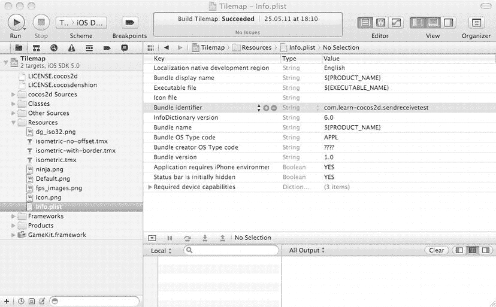

Figure 14-1 .  `Bundle identifier`键必须与您应用的 Bundle ID 匹配

实际上，您可以通过两种方式使用 Game Kit（以及 Game Center）。一种是将 Game Center 设为必需，就像 cocos2d 项目模板所做的那样，这意味着您的应用只能在支持 Game Center 且运行 iOS 4.1 或更高版本的设备上运行。但是，对于我编写的示例，我并没有将 Game Center 设为必需，因为检查 Game Center 是否可用并在不可用时禁用它相对容易。这样，您的游戏就可以在运行 iOS 4.0 的设备上运行，只是没有 Game Center 的全部功能。Kobold2D 项目会链接 Game Center，但并不要求必须使用。

如果您确实要求必须存在 Game Kit 和 Game Center，可以在应用的`Info.plist`的`UIRequiredDeviceCapabilities`列表中设置。通过添加一个名为`gamekit`的布尔值键并勾选复选框，如图 Figure 14-2 所示，您可以告知 iTunes 和潜在用户，您的应用需要 Game Kit，因此需要 iOS 4.1 或更高版本。

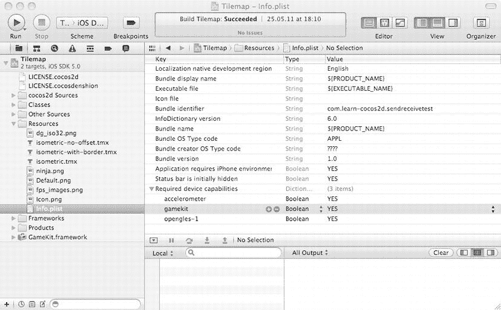

Figure 14-2 .  将 Game Kit 设为严格必需

您可以在 Apple 的 *Information Property List Key Reference* 中了解更多关于 iTunes 要求和`UIRequiredDeviceCapabilities`键的信息：`http://developer.apple.com/library/ios/#documentation/General/Reference/InfoPlistKeyReference/Introduction/Introduction.html`。

**注意**：如果您添加了`gamekit`键，但后来决定不将 Game Kit 设为必需，请务必删除`gamekit`条目。如果您只是取消勾选`gamekit`复选框，实际上会告诉 iTunes 您的应用在支持 Game Center 的设备上不可用——这与您预期的效果完全相反。要真正将 Game Kit 设为可选，您必须完全删除`gamekit`条目。

要验证您的项目是否链接了 Game Kit 框架，请在项目中选择应用目标。在项目导航器中选择根条目（即项目本身，在图 Figure 14-2 中标记为“Tilemap”）。然后选择相应的目标（不是名为`cocos2d-library`的那个），并切换到 Build Phases 标签页。展开“Link Binary With Libraries”部分，查看该目标当前链接的库列表。列表中应该有一个`GameKit.framework`。

如果没有，列表下方有两个 + 和 - 按钮，可用于添加或移除库。要添加另一个库，请点击 + 按钮。您会看到另一个列表弹出，如图 Figure 14-3 所示。找到`GameKit.framework`条目并点击“Add”按钮。由于您有很多库可供选择，并且它们并非总是按字母顺序排序，因此在列表上方的文本框中输入“GameKit”进行过滤会很有帮助。

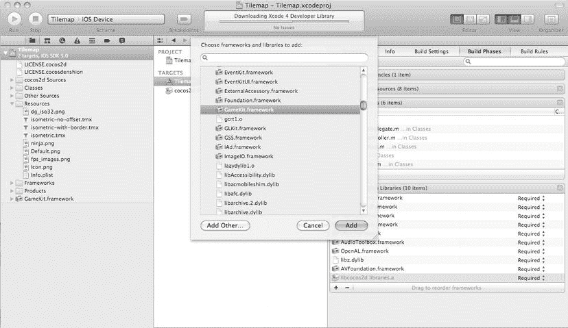

Figure 14-3 .  添加`GameKit.framework`

点击“Add”按钮后，`GameKit.framework`将被添加到“Linked Libraries”列表中。默认情况下，新库以“Required”类型添加，该类型显示在每个库的右侧。“Required”设置意味着您的应用只能在提供`GameKit.framework`库的设备上运行。如果这正是您想要的，并且您已经在`Info.plist`中添加了`gamekit`键，那么您可以保持该设置。否则，请将设置更改为“Optional”，以便即使在没有 Game Center 的设备上也能运行应用。您可以通过代码中相对简单的检查来处理这种情况（稍后将在 Listing 14-3 中讨论），然后在设备不支持 Game Kit 时禁用所有 Game Kit 功能。Cocos2d 项目默认将 Game Kit 设为必需，而 Kobold2D 项目则将其设为可选。

最后，您希望`GameKit.h`头文件在项目的所有源文件中都可用。与其将它添加到每个源文件中，不如将其添加到项目的`Prefix.pch`文件中。这是一个预编译头文件，其中包含来自外部框架的头文件，以使项目编译更快。但它还有一个额外的好处：添加到前缀头文件中的每个头文件，都会使其定义对当前项目中的所有源代码文件可见。

您可以在“Supporting Files”组中找到`Prefix.pch`文件。打开您项目中的那个文件，并将 GameKit 头文件添加到其中，如 Listing 14-1 所示。

***Listing 14-1.**  将 GameKit 头文件添加到项目的前缀头文件中*

```objc
#ifdef __OBJC__
    #import <Foundation/Foundation.h>
    #import <UIKit/UIKit.h>
    #import <GameKit/GameKit.h>
#endif
```

就这样——您的应用已为使用 Game Center 设置完毕。

**Game Center 设置总结**

总结一下，为您的应用启用 Game Center 需要以下步骤：

1.  在 iTunes Connect 中创建一个新应用：
    a.  为新应用指定一个 Bundle ID。
    b.  为此应用启用 Game Center。

2.  在 iTunes Connect 中设置您的初始排行榜和成就：
    a.  记录排行榜类别 ID 和成就 ID。（另请注意，在游戏开发过程中，您可能会继续编辑和添加排行榜和成就。）

3.  编辑`Info.plist`：
    a.  在“Bundle identifier”字段中输入应用的 Bundle ID。
    b.  （可选）通过在`UIRequiredDeviceCapabilities`列表中添加一个布尔值键`gamekit`来要求 Game Kit。

4.  添加必要的 Game Kit 引用：
    a.  如果需要，将`GameKit.framework`添加到应用目标的“Linked Binary with Libraries”构建阶段。如果您的应用不严格要求 Game Kit，请将其“Type”设置从“Required”更改为“Optional”。
    b.  将`#import <GameKit/GameKit.h>`添加到项目的前缀头文件中。

在继续之前，请确保您已遵循每个步骤。您随时可以返回并进行必要的更改。但是，如果您没有在开始时完成所有步骤，很可能会遇到错误或某些功能无法正常工作，并且相关的错误消息不一定会直接指出您在某一步骤中的错误或疏忽。

Game Center 无法正常工作的常见原因是项目`Info.plist`文件中的 Bundle ID 与您在 iTunes Connect 中为应用设置的 Bundle ID 不匹配。

**Game Kit 编程**

在开始使用 Game Kit API 进行 Game Center 编程之前，我想提一下 Apple 开发者网站上的两个重要资源。

有 Game Kit 编程指南，它提供了关于 Game Kit 和 Game Center 概念的高级、基于任务的概述：`http://developer.apple.com/library/ios/#documentation/NetworkingInternet/Conceptual/GameKit_Guide/Introduction/Introduction.html`。


### Game Kit 框架参考

有关 Game Center 类和协议的详细深入信息，请参阅 Game Kit 框架参考：`http://developer.apple.com/library/ios/#documentation/GameKit/Reference/GameKit_Collection/_index.html`。

## GameKitHelper 委托

我在本章前面提到过，你将使用 `GameKitHelper` 类来提供对 Game Kit 和 Game Center 功能的更简单访问。由于连接到在线服务器会导致响应延迟几毫秒甚至几秒，因此使用一个中央类来管理所有与 Game Center 相关的功能是个好主意。所有 Game Center 示例都基于第 11 章中开发的等距游戏。你可以在 `IsoTilemap04` 项目中找到以下示例代码。

游戏中的某个类可以使用此功能，并将自身注册为 `GameKitHelper` 委托，以便在事件发生时收到通知。为此，委托必须实现在 `GameKitHelper.h` 头文件（列表 14-2）中定义的 `GameKitHelper @protocol`。只有实现此协议的类才能被分配到 `GameKitHelper delegate` 属性以接收协议消息。该协议只是一个方法定义列表，使用该协议的类必须实现这些方法。如果协议中的任何方法未实现，编译器会通知你。

***列表 14-2。** GameKitHelper 头文件*

```objectivec
#import "cocos2d.h"
#import < GameKit/GameKit.h>

@protocol GameKitHelperProtocol < NSObject>
@optional
-(void) onLocalPlayerAuthenticationChanged;
-(void) onFriendListReceived:(NSArray*)friends;
-(void) onPlayerInfoReceived:(NSArray*)players;
@end

@interface GameKitHelper : NSObject < GKLeaderboardViewControllerDelegate, ←
    GKAchievementViewControllerDelegate>
{
    id < GameKitHelperProtocol > delegate;
    BOOL isGameCenterAvailable;
    NSError* lastError;
}

@property (nonatomic, retain) id < GameKitHelperProtocol > delegate;
@property (nonatomic, readonly) BOOL isGameCenterAvailable;
@property (nonatomic, readonly) NSError* lastError;

+(GameKitHelper*) sharedGameKitHelper;

// Player authentication, info
-(void) authenticateLocalPlayer;
-(void) getLocalPlayerFriends;
-(void) getPlayerInfo:(NSArray*)players;
@end
```

为了方便起见，`GameKitHelper` 类还会在 `lastError` 属性中存储上一次的错误。这使你可以检查是否发生了错误以及错误类型，而无需直接接收 Game Center 消息。`GameKitHelper` 类是一个单例，这在第 3 章中介绍过，因此我将省略单例特定的代码。

我将很快讨论其余的属性和方法。现在，来看一下 `TileMapLayer` 类是如何扩展的，以便它能够作为 `GameKitHelper` 的委托。头文件的主要更改是导入 `GameKitHelper.h` 并指定 `TileMapLayer` 实现 `GameKitHelperProtocol`：

```objectivec
#import "GameKitHelper.h"

...

@interface TileMapLayer : CCLayer < GameKitHelperProtocol>
{
    ...
}
```

然后，你可以在 `init` 方法中将 `TileMapLayer` 类设置为 `GameKitHelper` 类的委托：

```objectivec
-(id) init
{
    self = [super init];
    if (self)
    {
        GameKitHelper* gkHelper = [GameKitHelper sharedGameKitHelper];
        gkHelper.delegate = self;
        [gkHelper authenticateLocalPlayer];

...
```

请注意，你负责在适当的时候将 `GameKitHelper` 委托设回 `nil`——例如，在切换场景之前。因为 `GameKitHelper` 持有对委托的引用，ARC 不会从内存中释放委托对象。这不仅会将委托本身保留在内存中，还会保留它的所有成员变量，包括它如果是 `CCNode` 类时的所有子节点。

### 检查 Game Center 可用性


`GameKitHelper`类在其`init`方法中首先检查 Game Center 的可用性（清单 14-3）。由于应用运行时条件不会改变，因此只需要检查一次。

**清单 14-3. 测试 Game Center 可用性**

```
-(id) init
{
    if ((self = [super init]))
    {
        // Test for Game Center availability
        Class gameKitLocalPlayerClass = NSClassFromString(@"GKLocalPlayer");
        BOOL isLocalPlayerAvailable = (gameKitLocalPlayerClass != nil);

// Test if device is running iOS 4.1 or higher
        NSString* reqSysVer = @"4.1";
        NSString* currSysVer = [UIDevice currentDevice].systemVersion;
        BOOL isOSVer41 = ([currSysVer compare:reqSysVer
                                      options:NSNumericSearch] != NSOrderedAscending);

isGameCenterAvailable = (isLocalPlayerAvailable && isOSVer41);
        NSLog(@"GameCenter available = %@", isGameCenterAvailable ? @"YES" : @"NO");

[self registerForLocalPlayerAuthChange];
    }

return self;
}
```

第一个测试是检查特定的 Game Center 类是否可用。此处使用 Objective-C 运行时方法`NSClassFromString`按名称获取一个 Game Center 类。如果该调用返回`nil`，则可以确定 Game Center 不可用。

但情况并非如此简单。由于 Game Center 在 iOS 4.1 之前的测试版中已经部分可用，因此还需要检查设备是否至少运行 iOS 4.1。通过比较`reqSysVer`字符串与`systemVersion`字符串来实现。

完成两项检查后，使用`&&`（与）运算符组合结果，因此必须两者都为真，`isGameCenterAvailable`才为真。`isGameCenterAvailable`变量用于保护`GameKitHelper`类中对 Game Center 功能的所有调用。这避免了在 Game Center 不可用时意外调用其功能，否则会导致应用程序崩溃。

请注意，这是 Apple 推荐检查 Game Center 可用性的方式。不应使用任何其他方法，例如，确定游戏运行设备的类型。虽然某些设备被排除在 Game Center 使用之外，但上述检查已将此考虑在内。

**认证本地玩家**

本地玩家是 Game Center 编程中的一个基本概念。它指登录到设备的玩家账户。这很重要，因为只有本地玩家才能向排行榜发送分数并向 Game Center 服务报告成就进度。Game Center 应用程序需要做的第一件事就是认证本地玩家。如果认证失败，则无法使用大部分 Game Center 服务，事实上 Apple 建议在没有经过认证的本地玩家时不要使用任何 Game Center 功能。

在`GameKitHelper`的`init`方法中，调用了`registerForLocalPlayerAuthChange`方法，以便`GameKitHelper`接收有关本地玩家认证更改的事件。这是唯一通过`NSNotificationCenter`发送的 Game Center 通知。注册一个选择器来接收消息，如清单 14-4 所示。

**清单 14-4. 注册本地玩家认证更改**

```
-(void) registerForLocalPlayerAuthChange
{
    if (isGameCenterAvailable == NO)
        return;

NSNotificationCenter* nc = NSNotificationCenter.defaultCenter;
    [nc addObserver:self
        selector:@selector(onLocalPlayerAuthenticationChanged)
           name:GKPlayerAuthenticationDidChangeNotificationName
        object:nil];
}
```

如您所见，这里使用`isGameCenterAvailable`在 Game Center 不可用时跳过方法的其余部分。您会注意到其他方法也做同样的事情，我将在本书的代码中避免重复。


`NSNotificationCenter` 调用的实际方法只是将消息转发给委托，但前提是委托实现了 `onLocalPlayerAuthenticationChanged` 消息。由于 `GameKitHelper` 的委托方法被标记为 `@optional`，这种预防措施对于避免崩溃是必要的。

```
-(void) onLocalPlayerAuthenticationChanged
{
    if ([delegate respondsToSelector:@selector(onLocalPlayerAuthenticationChanged)])
    {
        [delegate onLocalPlayerAuthenticationChanged];
    }
}
```

**注意：** 本地玩家的登录状态可能会在游戏处于后台且用户运行 Game Center 应用并注销时发生变化。这是因为 iOS 4.0 引入的多任务特性。本质上，你的游戏必须准备好处理本地玩家在游戏过程中随时注销、其他玩家登录的情况。通常，你应该结束当前的游戏会话并返回到一个安全的地方——例如主菜单。但你应当考虑在每个本地玩家注销时保存当前游戏状态，这样当他们重新登录时，游戏能够从该玩家离开的地方继续。

实际的认证操作由 `authenticateLocalPlayer` 方法执行，如列表 14-5 所示。

***列表 14-5.**  认证本地玩家*

```
-(void) authenticateLocalPlayer
{
    if (isGameCenterAvailable == NO)
        return;

GKLocalPlayer* localPlayer = GKLocalPlayer.localPlayer;
    if (localPlayer.authenticated == NO)
    {
        [localPlayer authenticateWithCompletionHandler: ←
        ^(NSError* error)
        {
           [self setLastError:error];
        }];
    }
}
```

乍一看，这相对简单。获取 `localPlayer` 对象，如果它未通过认证，则调用 `authenticateWithCompletionHandler` 方法。而该方法返回的 `NSError` 对象被设置为 `lastError` 属性……等等，等一下。这些都是该方法参数的一部分吗？

是的。这些内联方法被称为*块对象（block objects）*，我在第 3 章末尾介绍过。`CCMenuItem` 类也使用了块。我将在下一节中再次解释块作为复习。现在你只需要知道，块对象是一个 C 风格的方法，它作为参数传递给 `authenticateWithCompletionHandler` 方法。它只有在认证请求从服务器返回后才会执行。

如果你调用 `authenticateLocalPlayer` 方法，你的游戏将显示 Game Center 登录对话框，如图 14-4 所示。如果你有 Apple ID，可以使用你的 Apple ID 和密码登录。或者你也可以选择创建一个新账户。

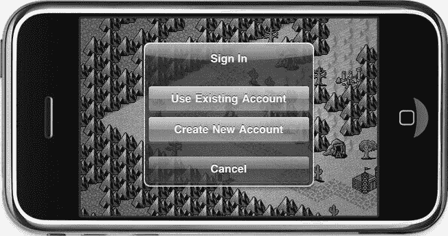

图 14-4.  Game Center 登录对话框

但还有第三种可能性——如果 Game Center 检测到这台设备上已有一个登录的玩家，它只会显示一条“欢迎回来”的消息。在这种情况下如何注销？通过 Game Center 应用，出于这个原因，该应用也存在于 iPhone/iPad 模拟器中。

如果你运行 Game Center 应用，选择第一个标签页（显示为“我”或“沙盒”），然后点击底部以“账户：”开头的标签。你将看到一个弹出对话框，允许你查看账户或注销。通过 Game Center 应用注销后，下次运行你的应用并进行玩家认证流程时，图 14-4 中的登录对话框将再次显示。

**注意：** 如果本地玩家认证后设置了 `[GKLocalPlayer localPlayer].underage` 属性，某些 Game Center 功能将被禁用。如果你的游戏需要禁用不适宜未成年玩家的可选功能，你也可以参考这个 `underage` 属性。


现在，关于错误处理，你会注意到`GameKitHelper`在任何返回错误对象的地方都会使用`setLastError`方法。这让委托类可以通过`lastError`属性检查是否发生了错误。如果该属性为`nil`，则表示没有错误。

然而，只有最后一个错误对象被保留，下一个返回`NSError`对象的方法会替换掉前一个错误，因此，如果在特定情况下错误处理很重要，那么立即检查`lastError`属性至关重要。在某些情况下，你可以安全地忽略错误。它们可能只会导致暂时性的问题，比如空的 friends 列表。无论如何，`setLastError`消息会复制新的错误，然后打印诊断信息，这样你就可以随时关注开发过程中发生的错误类型：

```
-(void) setLastError:(NSError*)error
{
    lastError = error.copy;

if (lastError != nil)
        NSLog(@"GameKitHelper ERROR: %@", [lastError userInfo].description);
}
```

如果你收到了一个错误并想了解更多信息，请参考 Apple 的 Game Kit 常量参考文档，该文档描述了定义在`GameKit/GKError.h`头文件中的错误常量：`http://developer.apple.com/library/ios/#documentation/GameKit/Reference/GameKit_ConstantsRef/Reference/reference.html`。

本地玩家成功登录后，你可以访问他的朋友列表、排行榜和成就。但在深入讨论之前，让我们先拐个弯，回顾一下块对象的重要方面。

### 块对象

在列表 14-5 中展示的内联方法被称为*块对象*，通常简称为*块*。你可能在其他语言中听说过*闭包*、*匿名函数*或*lambda*，它们本质上是相同的概念。块对象是 Apple 引入的一种 C 语言扩展，旨在使多线程和异步编程任务更容易。用通俗的话说，块对象是可以在其他函数内部创建、赋值给变量供以后使用、传递给其他函数，并在稍后异步运行的 C 语言回调函数。由于块对象可以读取其定义所在函数或作用域的局部变量，因此它通常比常规回调方法需要的参数更少。此外，使用`__block`存储类型说明符，你还可以允许块对象修改其封闭作用域中的变量。

**提示** 如果你对块对象的更多细节感兴趣，请参考 Apple 的 Blocks 编程主题文档：`http://developer.apple.com/library/mac/#documentation/Cocoa/Conceptual/Blocks/Articles/00_Introduction.html`。你还会在第 3 章末尾附近找到更多示例，我在那里解释了如何将块与菜单结合使用，特别是`CCMenuItem`类。

我将从列表 14-5 中提取实际的块对象来单独讨论：

```
^(NSError* error)
{
    [self setLastError:error];
}
```

它看起来像一个方法，只是它没有名称，并且以脱字符号（`^`）开头。`NSError`指针是唯一传递给它的变量，但逗号可以分隔多个变量，如以下示例所示：

```
^(NSArray* scores, NSError* error)
{
    [self setLastError:error];
    [delegate onScoresReceived:scores];
}
```

如果这让你想起了 C 语言方法的参数，那么你猜对了。如果你愿意，你可以将一个块视为一个名为`^`的 C 方法，并且可以将其传递给许多将块对象作为参数的 Game Kit 方法。

我想指出两个技术细节。首先，局部变量可以在块中访问。但它们通常无法被修改，除非它们以`__block`关键字作为前缀。考虑以下代码片段：

```
__block bool success = NO;
[localPlayer authenticateWithCompletionHandler:←
^(NSError* error)
{
    success = (error == nil);
    lastError = error;
}];
```

对于块，只有在变量使用`__block`关键字声明的情况下，才可以在块内部合法地修改在块作用域之外声明的局部变量。在这个例子中，`success`变量是在块外部声明的一个局部变量，但它是在块内部被修改的，因此它必须以`__block`关键字作为前缀。另一方面，`lastError`变量是该类的一个成员变量。你可以在块内部修改成员变量，而无需使用`__block`关键字。

此外，在 Game Kit 的情况下，你会频繁地将块对象传递给 Game Kit 方法，但这些块对象直到稍后才会被执行。你可能习惯于代码按顺序执行，但在 Game Kit 编程中并非如此！传递给 Game Kit 方法的块仅在调用完成与 Game Center 服务器的一次往返通信后才会被调用。这需要时间，因为数据需要传输到 Game Center 服务器并进行处理，然后结果需要返回到设备。只有到那时，块对象才会被执行。

让我们举个例子。你可能会发现自己倾向于编写这样的代码：

```
__block bool success = NO;

[localPlayer authenticateWithCompletionHandler:←
^(NSError* error)
{
    success = (error == nil);
}];

if (success)
    NSLog(@"Local player logged in!");
else
    NSLog(@"Local player NOT logged in!");
```

然而，这个例子总是会报告玩家未登录。为什么呢？嗯，执行路径是这样的：`authenticateWithCompletionHandler`会将你的块作为参数存储起来，同时它向服务器发送请求并等待响应返回。然而，执行流会在`authenticateWithCompletionHandler`方法之后立即继续，而正是在那里，`success`变量决定了要打印哪个日志语句。问题是，`success`变量仍然设置为`NO`，因为块还没有被执行。

几毫秒后，服务器响应了身份验证，这会触发完成处理器——也就是块对象——运行。如果它返回且没有错误，`success`变量会被设置为`YES`。但可惜的是，你的日志记录代码已经运行过了，所以这个赋值没有效果。

请注意，这通常不是块对象的问题；有些方法会立即、甚至重复地在返回给你之前就运行一个块。但是，对于几乎所有 Game Kit 方法来说，块对象仅被用作当 Game Center 服务器响应了特定请求时才运行的代码片段。换句话说，Game Kit 使用的块对象是在一个未指定的延迟之后异步运行的（如果连接中断，也可能根本不会运行）。

### 接收本地玩家的朋友列表

当本地玩家登录或注销时，`onLocalPlayerAuthenticationChanged`方法会被接收并转发给委托。这些示例中的委托是`TileMapLayer`类，它在列表 14-6 中实现了此方法来请求本地玩家的朋友列表。

***列表 14-6.**  请求朋友列表*

```
-(void) onLocalPlayerAuthenticationChanged
{
    GKLocalPlayer* localPlayer = GKLocalPlayer.localPlayer;
    if (localPlayer.authenticated)
    {
        GameKitHelper* gkHelper = [GameKitHelper sharedGameKitHelper];
        [gkHelper getLocalPlayerFriends];
    }
}
```

它检查本地玩家是否已通过身份验证，如果是，则立即调用`GameKitHelper`类的`getLocalPlayerFriends`方法。请查看列表 14-7 中的该方法。

***列表 14-7.**  GameKitHelper 请求朋友列表*

```
-(void) getLocalPlayerFriends
{
    if (isGameCenterAvailable == NO)
        return;
```


`GKLocalPlayer* localPlayer = GKLocalPlayer.localPlayer;`  
`if (localPlayer.authenticated)`  
`{`  
`    [localPlayer loadFriendsWithCompletionHandler:←`  
`    ^(NSArray* friends, NSError* error)`  
`    {`  
`       [self setLastError:error];`  
`       if ([delegate respondsToSelector:@selector(onFriendListReceived:)])`  
`       {`  
`          [delegate onFriendListReceived:friends];`  
`       }`  
`    }];`  
`}`  

由于`getLocalPlayerFriends`方法不知道何时被调用或由谁调用，它会通过再次检查本地玩家是否已通过认证来确保安全。然后，它调用`GKLocalPlayer`类的`loadFriendsWithCompletionHandler`方法，你需要为该方法提供另一个`block`对象，当服务器返回一个字符串形式的玩家标识符列表时，该`block`对象会被执行。不出意外的话，这个标识符列表存储在`friends`数组中。

一旦成功调用`loadFriendsWithCompletionHandler`，你就可以通过`GKLocalPlayer`类访问本地玩家好友的当前玩家标识符：

```
NSArray* friends = GKLocalPlayer.localPlayer.friends;
```

请注意，`friends`数组可能为`nil`，或者不包含所有好友。在接收`onFriendsListReceived`消息的委托中，以及所有其他`GameKitHelper`委托方法中，你都应该在处理接收到的参数之前检查它是否为`nil`。如果它为`nil`，你可以参考`GameKitHelper`类的`lastError`属性，以获取关于错误的更多信息，用于调试、记录日志，或者在适当的情况下向用户显示。

委托方法`onFriendsListReceived`只是将玩家标识符传回给`GameKitHelper`，并请求获取好友列表中玩家标识符的更多信息：

```
-(void) onFriendListReceived:(NSArray*)friends
{
    GameKitHelper* gkHelper = [GameKitHelper sharedGameKitHelper];
    [gkHelper getPlayerInfo:friends];
}
```

这很简单，所以让我们将注意力转回`GameKitHelper`类的`getPlayerInfo`方法。如果`playerList`数组包含至少一个条目，它将调用`GKPlayer`类的`loadPlayersForIdentifiers`静态方法，如**代码清单 14-8**所示。

***代码清单 14-8.** 从玩家标识符列表请求玩家信息*

```
-(void) getPlayerInfo:(NSArray*)playerList
{
    if (playerList.count > 0)
    {
        // 获取玩家列表的详细信息
        [GKPlayer loadPlayersForIdentifiers:playerList withCompletionHandler:←
        ^(NSArray* players, NSError* error)
        {
           [self setLastError:error];
           if ([delegate respondsToSelector:@selector(onPlayerInfoReceived:)])
           {
              [delegate onPlayerInfoReceived:players];
           }
        }];
    }
}
```

同样，使用一个`block`对象来处理服务器返回的结果。和往常一样，在调用委托的`onPlayerInfoReceived`方法之前，会先更新`lastError`属性。`players`数组现在应包含一个`GKPlayer`类实例的列表，在没有合适的好友列表用户界面的情况下，委托会将其打印到调试器控制台窗口中：

```
-(void) onPlayerInfoReceived:(NSArray*)players
{
    for (GKPlayer* gkPlayer in players)
    {
     CCLOG(@"PlayerID: %@, Alias: %@", gkPlayer.playerID, gkPlayer.alias); }
}
```

`GKPlayer`类只有三个属性：玩家标识符、别名和`isFriend`标志。对于这种特定情况下的所有玩家，`isFriend`标志都为`true`。别名就是玩家的昵称。

如果你创建了新的沙盒账号，你将不会有任何好友，因此列表为空是正常的。你可以通过以下方式解决：使用 Game Center 应用注销 Game Center，再次运行你的应用来创建另一个账号，然后向之前的沙盒账号发送好友请求。

## 排行榜

在 IsoTilemap04 项目中，我添加了发布和检索排行榜分数的功能。我在`TileMapLayer`类的`onPlayerInfoReceived`方法中进行了集成，以便在`Playtime`类别下向 Game Center 提交一个测试分数：

```
-(void) onPlayerInfoReceived:(NSArray*)players
{
    GameKitHelper* gkHelper = [GameKitHelper sharedGameKitHelper];
    [gkHelper submitScore:1234 category:@"Playtime"];
}
```

**代码清单 14-9** 中所示的`submitScore`方法在`GameKitHelper`中实现，并向委托回调`onScoresSubmitted`消息。由于没有需要传递的返回参数，它仅通过`success`值来报告分数是否已成功发送且无错误。

***代码清单 14-9.** 向排行榜提交分数*

```
-(void) submitScore:(int64_t)score category:(NSString*)category
{
    if (isGameCenterAvailable == NO)
        return;

GKScore* gkScore = [[GKScore alloc] initWithCategory:category];
    gkScore.value = score;

[gkScore reportScoreWithCompletionHandler:←
    ^(NSError* error)
    {
        [self setLastError:error];

BOOL success = (error == nil);
        if ([delegate respondsToSelector:@selector(onScoresSubmitted:)])
        {
           [delegate onScoresSubmitted:success];
        }
    }];
}
```

分数值的类型是`int64_t`，它等同于`long long`。没错，就是`long long`。`long`数据类型是一个 32 位整数值，而`long long`意味着它是一个 64 位整数值，因此它可以存储一个非常大的数字——一个有 19 位数字的数。这允许的值范围比常规的 32 位整数所能表示的大超过 40 亿倍！

创建一个临时的`GKScore`对象，并用你在 iTunes Connect 中定义的排行榜类别标识符对其进行初始化。在这个例子中，类别 ID 是`Playtime`。`GKScore`对象还被赋了分数值，然后调用其`reportScoreWithCompletionHandler`方法，该方法会将分数发送到 Game Center 服务器和对应的排行榜。

委托收到`onScoresSubmitted`消息，随后调用`retrieveTopTenAllTimeGlobalScores`方法来获取前十名的分数：

```
-(void) onScoresSubmitted:(bool)success
{
    if (success)
    {
        GameKitHelper* gkHelper = [GameKitHelper sharedGameKitHelper];
        [gkHelper retrieveTopTenAllTimeGlobalScores];
    }
}
```

`GameKitHelper`类的`retrieveTopTenAllTimeGlobalScores`方法只是封装了对`retrieveScoresForPlayers`的调用，并向其提供预配置的参数：

```
-(void) retrieveTopTenAllTimeGlobalScores
{
    [self retrieveScoresForPlayers:nil
        category:nil
        range:NSMakeRange(1, 10)
        playerScope:GKLeaderboardPlayerScopeGlobal
        timeScope:GKLeaderboardTimeScopeAllTime];
}
```

根据你的游戏需要，你可以随时添加更多用于检索分数的封装方法。由于有多种方式可以检索排行榜分数，并且有多个过滤器可以减少检索到的分数数量，因此使用封装方法来减少人为错误的可能性是合理的。**代码清单 14-10** 展示了完整的`retrieveScoresForPlayers`方法。

***代码清单 14-10.** 从排行榜检索分数列表*

```
-(void) retrieveScoresForPlayers:(NSArray*)players
        category:(NSString*)category
        range:(NSRange)range
        playerScope:(GKLeaderboardPlayerScope)playerScope
        timeScope:(GKLeaderboardTimeScope)timeScope
{
    if (isGameCenterAvailable == NO)
        return;

GKLeaderboard* leaderboard = nil;
    if (players.count > 0)
    {
        leaderboard = [[GKLeaderboard alloc] initWithPlayerIDs:players];
    }

else
    {
        leaderboard = [[GKLeaderboard alloc] init];
        leaderboard.playerScope = playerScope;
    }


```objc
if (leaderboard != nil)
{
    leaderboard.timeScope = timeScope;
    leaderboard.category = category;
   leaderboard.range = range;

    [leaderboard loadScoresWithCompletionHandler:^
        (NSArray* scores, NSError* error)
        {
            [self setLastError:error];
            if ([delegate respondsToSelector:@selector(onScoresReceived:)])
            {
                [delegate onScoresReceived:scores];
            }
        }];
}
```

首先，初始化一个`GKLeaderboard`对象。根据`players`数组是否包含玩家，排行榜可能会使用一个玩家标识符列表初始化，以便仅检索这些玩家的分数。否则，将使用`playerScope`变量，该变量可设置为`GKLeaderboardPlayerScopeGlobal`或`GKLeaderboardPlayerScoreFriendsOnly`，以仅检索好友的分数。

然后，通过`timeScope`参数进一步缩小排行榜范围，该参数允许您获取历史最高分（`GKLeaderboardTimeScopeAllTime`）、仅过去一周的分数（`GKLeaderboardTimeScopeWeek`）或仅今日的分数（`GKLeaderboardTimeScopeToday`）。

当然，您还必须指定排行榜的类别 ID——否则，`GKLeaderboard`将不知道从哪个排行榜检索分数。最后，一个`NSRange`参数可让您精确定位想要检索的分数排名。在本示例中，范围 1 到 10 表示应检索前十名分数。

请确保使用所有这些参数（尤其是`NSRange`参数）将分数检索限制在合理的小数据块内。虽然您可以检索排行榜的所有分数，但**不建议**这样做。如果您的游戏在线玩家众多，且提交了大量分数，您可能会从`Game Center`服务器加载成千上万——甚至数百万或数十亿——条分数。这会导致检索分数时出现显著延迟。

正确设置排行榜对象后，`loadScoresWithCompletionHandler`方法接手并向服务器请求分数。收到分数后，它会通过`onScoresReceived`调用委托方法，并传递分数数组。该数组包含按排行榜排名排序的`GKScore`类对象。`GKScore`对象提供您所需的所有信息，包括`playerID`、分数提交的`date`，以及`rank`、`value`和`formattedValue`，您应使用后者向用户显示分数。

幸运的是，Apple 提供了默认的排行榜用户界面。我不会使用刚才检索到的分数，而是忽略它们，并利用`onScoresReceived`委托方法来调出内置排行榜视图：

```objc
-(void) onScoresReceived:(NSArray*)scores
{
    GameKitHelper* gkHelper = [GameKitHelper sharedGameKitHelper];
    [gkHelper showLeaderboard];
}
```

Game Kit 拥有一个`GKLeaderboardViewController`类，用于显示 Game Center 排行榜用户界面，如代码清单 14-11 所示。

**代码清单 14-11.** 显示排行榜用户界面

```objc
-(void) showLeaderboard
{
    if (isGameCenterAvailable == NO)
        return;

    GKLeaderboardViewController* leaderboardVC =
        [[GKLeaderboardViewController alloc] init];
    if (leaderboardVC != nil)
    {
        leaderboardVC.leaderboardDelegate = self;
        [self presentViewController:leaderboardVC];
    }
}
```

`leaderboardDelegate`被设置为`self`，这意味着`GameKitHelper`类必须实现`GKLeaderboardViewControllerDelegate`协议。`GameKitHelper`类已经实现了此协议：

```objc
@interface GameKitHelper : NSObject < GKLeaderboardViewControllerDelegate,
    GKAchievementViewControllerDelegate>
{
    ...
}
```

然后，您必须实现`leaderboardViewControllerDidFinish`方法，用于简单地关闭视图并将事件转发给委托。


```  
-(void) leaderboardViewControllerDidFinish:(GKLeaderboardViewController*)viewController  
{  
    [self dismissModalViewController];  
    if ([delegate respondsToSelector:@selector(onLeaderboardViewDismissed)])  
    {  
        [delegate onLeaderboardViewDismissed];  
    }  
}  
```  

这背后有一些不为人知的魔法。我在 `GameKitHelper` 中添加了几个辅助方法，专门用于利用 cocos2d 在 `AppController` 类中设置的 `UINavigationController` 实例来展示和关闭各种 Game Kit 视图控制器。这个导航控制器将用于显示 Game Center 视图，如代码清单 14-12 所示。

***代码清单 14-12.**  使用 Cocos2d 的根视图控制器展示和关闭 Game Kit 视图*

```  
#import "AppDelegate.h"  

...  

-(UINavigationController*) appNavigationController  
{  
    AppController* app = (AppController*)[UIApplication sharedApplication].delegate;  
    return app.navController;  
}  

-(void) presentViewController:(UIViewController*)vc  
{  
    UINavigationController* navController = [self appNavigationController];  
    [navController presentModalViewController:vc animated:YES];  
}  

-(void) dismissModalViewController  
{  
    UINavigationController* navController = [self appNavigationController];  
    [navController dismissModalViewControllerAnimated:YES];  
}  
```  

`GKLeaderboardViewController` 会自动加载所需分数，并向你呈现一个视图，如图 14-5 所示。

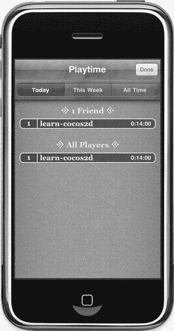  

图 14-5 .  Game Kit 排行榜视图  

默认情况下，排行榜视图（以及所有其他 Game Kit 视图）会以竖屏模式呈现，即使你的应用只使用横屏方向也是如此。对于横屏应用来说，这相当烦人，但目前似乎没有明显的方法可以通过视图本身的方法或属性来改变这一行为。

要允许 Game Kit 视图以横屏方向呈现，你需要为每个 Game Kit 视图扩展一个类别并实现（覆盖）`shouldAutorotateToInterfaceOrientation` 方法。然后，让该方法对视图允许自动旋转的所有界面方向返回 `YES`。你可以使用 `UIInterfaceOrientationIsLandscape` 方法来强制 Game Kit 视图以横屏方向呈现。以下代码是一个实现，它强制 `GKLeaderboardViewController` 视图以横屏方向显示：

```  
@interface GKLeaderboardViewController (OrientationFix)  
-(BOOL) shouldAutorotateToInterfaceOrientation:←  
    (UIInterfaceOrientation)interfaceOrientation;  
@end  

@implementation GKLeaderboardViewController (OrientationFix)  
-(BOOL) shouldAutorotateToInterfaceOrientation:←  
    (UIInterfaceOrientation)interfaceOrientation  
{  
    return UIInterfaceOrientationIsLandscape(interfaceOrientation);  
}  
@end  
```  

你可以将相同的原理应用于 `GKAchievementViewController`、`GKMatchmakerViewController`，以及通常任何自包含的、现成的视图控制器。这种方法是强制 Game Kit 视图使用特定方向的唯一方式，它并非取巧，而是推荐（且唯一）的解决方案。

## 成就

在 IsoTilemap04 项目中，当排行榜视图关闭时，你还会调用 `GameKitHelper showAchievements` 方法。这会弹出成就视图（代码清单 14-13）。

***代码清单 14-13.**  显示成就视图*

```  
-(void) showAchievements  
{  
    if (isGameCenterAvailable == NO)  
        return;  

    GKAchievementViewController* achievementsVC =   
←  
        [[GKAchievementViewController alloc] init];  
    if (achievementsVC != nil)  
    {  
        achievementsVC.achievementDelegate = self;  
        [self presentViewController:achievementsVC];  
    }  
}  
```  

这与代码清单 14-11 中显示排行榜视图非常相似。同样，`GameKitHelper` 类也必须实现相应的协议，即 `GKAchievementViewControllerDelegate`：

```  
@interface GameKitHelper : NSObject < GKLeaderboardViewControllerDelegate,←  
    GKAchievementViewControllerDelegate>  
```  

该协议要求 `GameKitHelper` 类实现 `achievementViewControllerDidFinish` 方法，该方法与排行榜视图控制器使用的方法惊人地相似：

```  
-(void) achievementViewControllerDidFinish:(GKAchievementViewController*)viewControl  
{  
    [self dismissModalViewController];  
    if ([delegate respondsToSelector:@selector(onAchievementsViewDismissed)])  
    {  
        [delegate onAchievementsViewDismissed];  
    }  
}  
```  

你可以在图 14-6 中看到一个成就视图的示例，其中有一个成就已经解锁。要以横屏模式显示成就视图，请参考我之前关于排行榜的介绍中给出的示例。

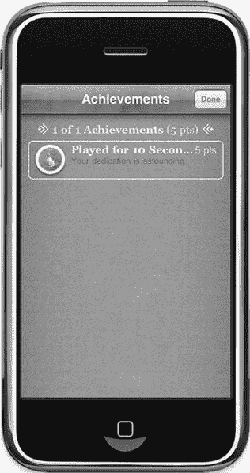  

图 14-6 .  Game Kit 成就视图  

那么，你还能用成就做些什么呢？

显然，你希望确定某个成就是否已解锁，实际上你还希望报告玩家在完成成就过程中取得的所有进展。例如，如果成就的目标是吃掉 476 根香蕉，那么每当玩家吃掉一根香蕉时，你都应向 Game Center 报告进度。在这个示例项目中，你只需检查经过的时间，然后报告 `PlayedForTenSecs` 成就的进度。你在 `TileMapLayer` 的 `update` 方法中执行此操作，如代码清单 14-14 所示。

***代码清单 14-14.**  确定成就进度*

```  
-(void) update:(ccTime)delta  
{  
    totalTime + = delta;  
    if (totalTime > 1.0f)  
    {  
        totalTime = 0.0f;  

        NSString* playedTenSeconds = @"PlayedForTenSecs";  
        GameKitHelper* gkHelper = [GameKitHelper sharedGameKitHelper];  
        GKAchievement* achievement = ←  
           [gkHelper getAchievementByID:playedTenSeconds];  
        if (achievement.completed == NO)  
        {  
           float percent = achievement.percentComplete + 10;  
           [gkHelper reportAchievementWithID:playedTenSeconds  
                          percentComplete:percent];  
        }  
    }  

    ...  
}  
```  

每当一秒过去，就会通过 `GameKitHelper` 获取标识符为 `PlayedForTenSecs` 的成就。如果该成就尚未完成，则其 `percentComplete` 属性会增加 10%，并通过 `GameKitHelper` 的 `reportAchievementWithID` 方法报告进度（代码清单 14-15）。

***代码清单 14-15.**  报告成就进度*

```  
-(void) reportAchievementWithID:(NSString*)identifier percentComplete:(float)percent  
{  
    if (isGameCenterAvailable == NO)  
        return;  

    GKAchievement* achievement = [self getAchievementByID:identifier];  
    if (achievement != nil && achievement.percentComplete < percent)  
    {  
        achievement.percentComplete = percent;  
        [achievement reportAchievementWithCompletionHandler:←  
        ^(NSError* error)  
        {  
           [self setLastError:error];  
           if ([delegate respondsToSelector:@selector(onAchievementReported:)])  
           {  
              [delegate onAchievementReported:achievement];  
           }  
        }];  
    }  
}  
```

好的，作为一名高级文档工程师和翻译员，我将遵循您提供的格式要求，将以下英文文本翻译成中文。


为了避免对 Game Center 服务器进行不必要的调用，该成就的 `percentComplete` 属性会被验证是否确实小于 `percent` 参数。Game Center 不允许降低成就进度，因此会忽略此类报告。但如果你能从一开始就避免向 Game Center 服务器报告，就能避免不必要的数据传输。考虑到移动设备的带宽有限，每一比特没有被传输的数据都是好事。

**提示** 报告成就进度可能会因多种原因失败——例如，设备可能已失去互联网连接。请准备好保存任何未能传输的成就。然后，定期或在玩家下次登录时重试提交。Kobold2D 提供的 `KKGameKitHelper` 类包含额外的代码，用于缓存传输到 Game Center 服务器失败的成就。

这仍然留下了一个未解的问题：成就最初来自哪里？它们在本地玩家登录后立即加载。为了实现这一点，扩展 `authenticateWithCompletionHandler` 中使用的 block 对象，在没有错误时调用 `loadAchievements` 方法：

```
[localPlayer authenticateWithCompletionHandler:←
^(NSError* error)
{
    [self setLastError:error];

if (error == nil)
    {
        [self loadAchievements];
    }
}];
```

`loadAchievements` 方法使用 `GKAchievement` 类的 `loadAchievementsWithCompletionHandler` 方法从 Game Center 检索本地玩家的成就（列表 14-16）。

***列表 14-16.** 加载本地玩家的成就*

```
-(void) loadAchievements
{
    [GKAchievement loadAchievementsWithCompletionHandler:←
    ^(NSArray* loadedAchievements, NSError* error)
    {
        [self setLastError:error];

if (achievements == nil)
        {
           achievements = [[NSMutableDictionary alloc] init];
        }
        else
        {
           [achievements removeAllObjects];
        }

for (GKAchievement* achievement in loadedAchievements)
        {
           [achievements setObject:achievement
           forKey:achievement.identifier];
        }

if ([delegate respondsToSelector:@selector(onAchievementsLoaded:)])
        {
           [delegate onAchievementsLoaded:achievements];
        }
    }];
}
```

在 block 对象内部，成员变量 `achievements` 要么被分配内存，要么其中的所有对象都被移除。这允许你在稍后时间调用 `loadAchievements` 方法来刷新成就列表。返回的数组 `loadedAchievements` 包含多个 `GKAchievement` 实例，然后将其转移到 `achievements NSMutableDictionary` 中，仅仅是为了便于访问。`NSDictionary` 类允许你直接通过其字符串标识符检索成就，而不必遍历数组并逐一比较每个成就的标识符。你可以在 列表 14-17 的 `getAchievementByID` 方法中看到这一点。

***列表 14-17.** 获取并可选地创建成就*

```
-(GKAchievement*) getAchievementByID:(NSString*)identifier
{
    if (isGameCenterAvailable == NO)
        return;

GKAchievement* achievement = [achievements objectForKey:identifier];

if (achievement == nil)
    {
        // 创建一个新的成就对象
        achievement = [[GKAchievement alloc] initWithIdentifier:identifier];
        [achievements setObject:achievement forKey:achievement.identifier];
    }

return achievement;
}
```

这就是你需要小心的地方。如果 `getAchievementByID` 方法找不到给定标识符的成就，它会创建一个新的成就，并假设该成就的进度之前从未向 Game Center 报告过。列表 14-16 中的 `loadAchievements` 方法仅仅获取了那些至少向 Game Center 报告过一次的成就。对于任何其他成就，你必须首先创建它。因此，`getAchievementsByID` 将始终返回一个有效的成就对象，但只有当你尝试将其进度报告给 Game Center 时，你才会注意到该成就是否真的为你的游戏设置好了。

你也可以清除本地玩家的成就进度。请谨慎执行此操作，并且必须在征得玩家许可的情况下进行。另一方面，在开发过程中，列表 14-18 中的 `resetAchievements` 方法会派上用场。

***列表 14-18.** 重置成就进度*

```
-(void) resetAchievements
{
    if (isGameCenterAvailable == NO)
        return;

[achievements removeAllObjects];

[GKAchievement resetAchievementsWithCompletionHandler:←
    ^(NSError* error)
    {
        [self setLastError:error];
        BOOL success = (error == nil);
        if ([delegate respondsToSelector:@selector(onResetAchievements:)])
        {
        [delegate onResetAchievements:success];
        }
    }];
}
```

## 匹配

现在我们进入匹配的领域——连接玩家并邀请朋友一起进行游戏比赛。为了开始托管游戏并显示相应的匹配视图，我在成就视图被关闭后添加了对 `GameKitHelper` 的 `showMatchmakerWithRequest` 方法的调用，如列表 14-19 所示。

***列表 14-19.** 准备显示托管游戏屏幕*

```
-(void) onAchievementsViewDismissed
{
    GKLocalPlayer* localPlayer = [GKLocalPlayer localPlayer];
    if (localPlayer.authenticated)
    {
        GKMatchRequest* request = [[GKMatchRequest alloc] init];
        request.minPlayers = 2;
        request.maxPlayers = 4;

GameKitHelper* gkHelper = [GameKitHelper sharedGameKitHelper];
        [gkHelper showMatchmakerWithRequest:request];
    }
}
```

创建了一个 `GKMatchRequest` 实例，并初始化了其 `minPlayers` 和 `maxPlayers` 属性，表明该比赛至少应有 2 名玩家，至多应有 4 名玩家。显然，每场比赛必须允许 2 名玩家，并且你可以创建最多 4 名玩家的点对点比赛。*点对点网络*意味着所有设备相互连接，并可以与其他所有设备发送和接收数据。这与服务器/客户端架构形成对比，在服务器/客户端架构中，所有玩家连接到一个单一服务器，并且仅与此服务器发送和接收数据。在点对点网络中，产生的流量呈指数级增长，因此大多数点对点多人游戏严格限制允许的玩家数量。

**注** Game Center 最多可以连接 16 名玩家，但前提是你有一个托管的服务器应用程序，使用客户端/服务器架构来管理所有比赛。这需要大量的工作和专业知识来正确设置和使用，因此我将把它排除在此讨论之外，只专注于点对点网络。

`showMatchmakerWithRequest` 方法的实现与显示排行榜和成就视图的代码惊人地相似，如列表 14-20 所示。

***列表 14-20.** 显示托管游戏屏幕*


好的，作为一名高级文档工程师和翻译员，我将严格遵循您的注意事项和示例，将提供的英文文本翻译成中文。


```objc
-(void) showMatchmakerWithRequest:(GKMatchRequest*)request
{
    GKMatchmakerViewController* hostVC = [[GKMatchmakerViewController alloc]←
        initWithMatchRequest:request];
    if (hostVC != nil)
    {
        hostVC.matchmakerDelegate = self;
        [self presentViewController:hostVC];
    }
}
```

图 14-7 展示了一个示例匹配视图，正在等待你邀请好友加入你的比赛。你也可以等待 Game Center 自动为你的游戏匹配一名玩家，但由于你目前正在开发游戏，除了你之外，现在玩该游戏的可能性很小。

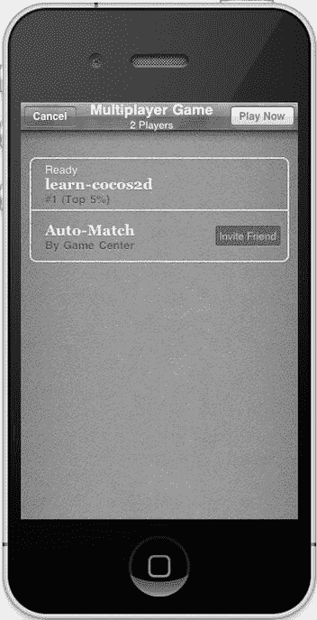

图 14-7. 主机游戏的匹配视图

根据排行榜和成就视图的示例，你知道它们都需要 `GameKitHelper` 类来实现一个协议，而匹配功能也不例外。我还添加了 `GKMatchDelegate`，因为你很快会用到它。

```objc
@interface GameKitHelper : NSObject < GKLeaderboardViewControllerDelegate,←
    GKAchievementViewControllerDelegate, GKMatchmakerViewControllerDelegate,←
    GKMatchDelegate>
```

`GKMatchmakerViewControllerDelegate` 协议要求实现三个方法：一个用于玩家按下“取消”按钮，一个用于失败并返回错误，还有一个用于找到合适的匹配。后者值得一提：

```objc
-(void) matchmakerViewController:(GKMatchmakerViewController*)viewController
        didFindMatch:(GKMatch*)match
{
    [self dismissModalViewController];
    [self setCurrentMatch:match];
    if ([delegate respondsToSelector:@selector(onMatchFound:)])
    {
        [delegate onMatchFound:match];
    }
}
```

如果找到了匹配，这个匹配就会被设置为当前匹配，并调用代理的 `onMatchFound` 方法来通知它新找到的匹配。

除了主持比赛，你也可以指示 Game Center 尝试自动为你寻找比赛，如代码清单 14-21 所示。如果成功，代理会收到同样的 `onMatchFound` 消息。

**代码清单 14-21. 搜索现有匹配**

```objc
-(void) findMatchForRequest:(GKMatchRequest*)request
{
    if (isGameCenterAvailable == NO)
        return;

GKMatchMaker* matchmaker = [GKMatchMaker sharedMatchmaker];
    [matchmaker findMatchForRequest:request withCompletionHandler:←
    ^(GKMatch* match, NSError* error)
    {
        [self setLastError:error];

if (match != nil)
        {
           [self setCurrentMatch:match];
           if ([delegate respondsToSelector:@selector(onMatchFound:)])
           {
              [delegate onMatchFound:match];
           }
        }
    }];
}
```

当 Game Center 搜索匹配时，你应该给用户提供视觉反馈，比如一个动画进度指示器，因为找到一个匹配可能需要几秒甚至几分钟。这时，`CCProgressTimer` 类就派上用场了（在第 5 章中讨论过）。你还应该给用户提供一种取消匹配过程的方法，如果用户取消，你应该调用 `cancelMatchmakingRequest` 方法：

```objc
-(void) cancelMatchmakingRequest
{
    [[GKMatchmaker sharedMatchmaker] cancel];
}
```

此时，匹配已经创建，但可能并非所有玩家都已连接到该匹配。随着玩家加入游戏，`GKMatchDelegate` 协议的 `match:didChangeState` 方法会针对每个连接或断开连接的玩家被调用。只有当时机已到，匹配的 `expectedPlayerCount` 被 Game Kit 框架递减为 0 时，你才能开始游戏。`GKMatch` 对象会自动更新 `expectedPlayerCount` 属性，如代码清单 14-22 所示。

**代码清单 14-22. 等待所有玩家加入后再开始比赛**

```objc
-(void) match:(GKMatch*)match player:(NSString*)playerID←
    didChangeState:(GKPlayerConnectionState)state
{
    switch (state)
    {
        case GKPlayerStateConnected:
        if ([delegate respondsToSelector:@selector(onPlayerConnected:)])
        {
           [delegate onPlayerConnected:playerID];
        }
        break;
        case GKPlayerStateDisconnected:
        if ([delegate respondsToSelector:@selector(onPlayerDisconnected:)])
        {
           [delegate onPlayerDisconnected:playerID];
        }
        break;
    }

if (matchStarted == NO && match.expectedPlayerCount == 0)
    {
        matchStarted = YES;
        if ([delegate respondsToSelector:@selector(onStartMatch)])
        {
           [delegate onStartMatch];
        }
    }
}
```

如果在游戏过程中的任何时候，有玩家掉线并且 `expectedPlayerCount` 属性变得大于 `0`，你可以调用 `addPlayersToMatch` 来用新玩家填补空缺，如代码清单 14-23 所示（假设你的游戏支持玩家加入正在进行的比赛）。由于无法保证一定能找到新玩家，因此在 `GKMatchmaker` 寻找新玩家时，你不应该中断游戏。

**代码清单 14-23. 向现有比赛中添加玩家**

```objc
-(void) addPlayersToMatch:(GKMatchRequest*)request
{
    if (isGameCenterAvailable == NO)
        return;
    if (currentMatch == nil)
        return;

[[GKMatchmaker sharedMatchmaker] addPlayersToMatch:currentMatch
        matchRequest:request
        completionHandler:←
    ^(NSError* error)
    {
        [self setLastError:error];

BOOL success = (error == nil);
        if ([delegate respondsToSelector:@selector(onPlayersAddedToMatch:)])
        {
           [delegate onPlayersAddedToMatch:success];
        }
    }];
}
```

## 发送和接收数据

当所有玩家都连接完毕，比赛正式开始后，你就可以开始发送并随后接收数据了。最简单的方法是将数据发送给所有玩家，如代码清单 14-24 所示。

**代码清单 14-24. 发送和接收数据**

```objc
-(void) sendDataToAllPlayers:(void*)data sizeInBytes:(NSUInteger)length
{
    if (isGameCenterAvailable == NO)
        return;

NSError* error = nil;
    NSData* packet = [NSData dataWithBytes:data length:length];
    [currentMatch sendDataToAllPlayers:packet
        withDataMode:GKMatchSendDataUnreliable
        error:&error];
    [self setLastError:error];
}

-(void) match:(GKMatch*)match didReceiveData:(NSData*)data ←
    fromPlayer:(NSString*)playerID
{
    if ([delegate respondsToSelector:@selector(onReceivedData:fromPlayer:)])
    {
           [delegate onReceivedData:data fromPlayer:playerID];
    }
}
```

`sendDataToAllPlayers` 方法接受一个 `void` 指针作为输入，并将其包装成一个 `NSData` 对象。只要你提供了该数据包的正确长度，就可以发送任何数据。通常，网络程序会发送像 `CGPoint`（或任何自定义的结构体）这样的结构体来简化这个过程，因为你可以使用 `sizeof(myPoint)` 来获取此类数据结构的长度（以字节为单位）。

此外，为了加快传输速度，大多数数据以不可靠的方式发送。特别是那些频繁发送的数据，可以以不可靠的方式发送，因为即使某个数据包丢失，客户端也只需等待下一个数据包到达。如果确实需要每个数据包都到达——例如，因为它包含只发送一次的关键信息——那么你应该将数据模式设置为 `GKMatchSendDataReliable`。这会指示 GameKit 在数据包无法送达时重新发送它。由于 GameKit 需要从客户端接收一个返回数据包以确认它们已收到该数据包，这会增加额外的流量。


发送的数据内容与频率完全取决于游戏本身。基本原则是：尽可能少地发送数据，并尽可能降低发送频率。例如，不应每帧都发送每个玩家的位置，而应在每次移动动作发生时发送一个数据包。因为在基于瓦片地图的游戏中，移动总是通过`CCMoveAction`在单一方向上移动 32 像素。因此，只需在移动开始时发送移动方向和起始位置即可——这相比每帧发送所有玩家位置的做法，能节省大量网络流量。

在`IsoTilemap04`项目中，您将学习如何通过收发数据包进行网络通信。创建网络包最关键的一点是：接收方必须能够通过查看通用的包头数据来识别收到的包类型。通常（这也是 Apple 文档推荐的作法），您需要为每个数据包定义 C 语言结构体（`struct`），并将一个共同的字段作为该结构体的第一个成员。`NetworkPackets.h`文件定义了这些结构体，如代码清单 14-25 所示。

***代码清单 14-25.** 在`NetworkPackets.h`中以 C 结构体定义网络包*

```
typedef enum
{
    kPacketTypeScore = 1,
    kPacketTypePosition,
} EPacketTypes;

typedef struct
{
    EPacketTypes type;
} SBasePacket;

// 用于传输分数变量的数据包
typedef struct
{
    EPacketTypes type;
    int score;
} SScorePacket;

// 用于传输位置的数据包
typedef struct
{
    EPacketTypes type;
    CGPoint position;
} SPositionPacket;
```

您可以看到，所有数据包结构体都具有`EPacketTypes type`字段，并且该字段位于每个结构体的开头。这使得您可以将任意数据包强制转换为`SBasePacket`类型，以便接收方检查数据包`type`字段。基于此类型，接收方可以安全地将该结构体强制转换为实际的数据包类型。

代码清单 14-26 展示了这一过程的一个示例，它是`TileMapLayer`类中的`onReceivedData`方法。

***代码清单 14-26.** 接收数据包并判断其类型*

```
-(void) onReceivedData:(NSData*)data fromPlayer:(NSString*)playerID
{
    SBasePacket* basePacket = (SBasePacket*)data.bytes;
    switch (basePacket->type)
    {
        case kPacketTypeScore:
        {
            SScorePacket* scorePacket = (SScorePacket*)basePacket;
            CCLOG(@"\tscore = %i", scorePacket->score);
            break;
        }
        case kPacketTypePosition:
        {
            SPositionPacket* positionPacket = (SPositionPacket*)basePacket;
            if (playerID != [GKLocalPlayer localPlayer].playerID)
            {
                CCTMXTiledMap* tileMap = 
                    (CCTMXTiledMap*)[self getChildByTag:TileMapNode];
                [self centerTileMapOnTileCoord:positionPacket->position
                                     tileMap:tileMap];
            }
            break;
        }
        default:
            CCLOG(@"unknown packet type %i", basePacket->type);
            break;
    }
}
```

这段代码首先将接收到的`data bytes`强制转换为指向`SBasePacket`结构体的指针。请注意，在代码清单 14-25 中，该结构体只包含`type`字段。由于您已声明所有数据包必须将此字段作为第一个条目，因此任何数据包都可以安全地强制转换为`SBasePacket`。`switch`语句检查`type`字段，然后根据网络包的类型进行后续处理——但在处理前，必须将数据包强制转换为实际的包类型。例如，如果`basePacket->type`是`kPacketTypeScore`，则将`basePacket`强制转换为`SScorePacket`，以便代码能够访问`score`字段。

**提示：** 在检查数据包时，最好添加`default`选项。您会频繁地添加新的数据包，并且有时会忘记在接收端处理这个特定的包类型。因此，建议将这种情况记录为错误，甚至抛出异常。否则，您的应用可能会出现难以追踪的错误。

实际发送数据包相对容易，且遵循相同的原则。首先，使用某个数据包结构体作为数据类型创建一个新变量。然后，填充该结构体的每个字段，并将其传递给`GameKitHelper`的`sendDataToAllPlayers`方法。

在代码清单 14-27 中，数据包是在栈上创建的。您无需分配内存，因为 Game Kit 会复制该结构体，从而接管数据包的内存管理。由于`sendDataToAllPlayers`需要一个指针，因此`packet`变量前需要加上引用运算符（取地址符`&`），即`&packet`，以表示传递的是`packet`变量的地址，而不是`packet`本身。

***代码清单 14-27.** 通过`GameKitHelper`发送数据包*

```
// 发送一个模拟分数（每次发送时自增的整数）
-(void) sendScore
{
    if ([GameKitHelper sharedGameKitHelper].currentMatch != nil)
    {
        bogusScore++;
        SScorePacket packet;
        packet.type = kPacketTypeScore;
        packet.score = bogusScore;
        [[GameKitHelper sharedGameKitHelper] sendDataToAllPlayers:&packet
                                                   sizeInBytes:sizeof(packet)];
    }
}

// 发送一个瓦片坐标
-(void) sendPosition:(CGPoint)tilePos
{
    if ([GameKitHelper sharedGameKitHelper].currentMatch != nil)
    {
        SPositionPacket packet;
        packet.type = kPacketTypePosition;
        packet.position = tilePos;
        [[GameKitHelper sharedGameKitHelper] sendDataToAllPlayers:&packet
                                                   sizeInBytes:sizeof(packet)];
    }
}
```

发送数据包最重要的部分是确保设置了正确的包类型。如果分配了错误的包类型，接收方将不知道如何处理该包。它可能会误判为另一种类型的包，导致崩溃（因为接收方可能试图访问一个不存在的字段）。或者，接收方可能简单地处理无关的数据，从而引发各种错误。想象一下，分数变成了玩家的位置，反之亦然。为了避免这类问题，特别是当您有大量不同的包类型时，创建诸如`createPositionPacket`和`createScorePacket`这样的方法会很有帮助。您可以用包所需的所有参数调用这些方法，而方法本身负责填充正确的包类型。

在图 14-8 中，您可以看到`Tilemap16`项目的运行效果。每当玩家在 iPhone 上移动时，就会通过网络发送一个位置包。iPad 连接到当前比赛，接收位置包，并相应地移动玩家角色。

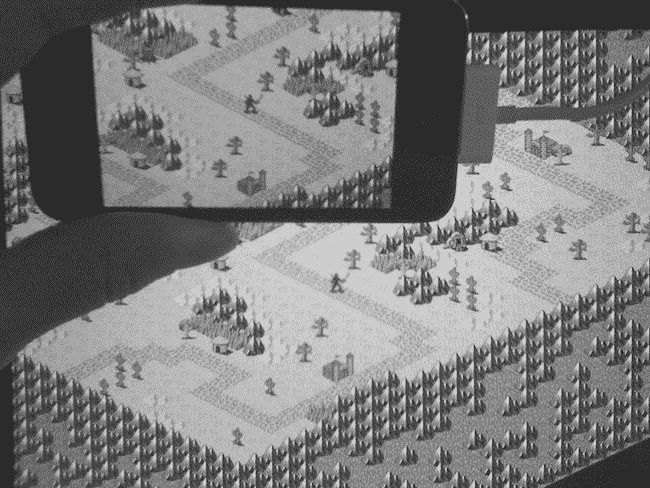

图 14-8 . 如果玩家在 iPhone 上移动，iPad 将根据接收到的位置包更新其视图

**总结**

我希望本章以及提供的`GameKitHelper`类能帮助您熟练地进行 Game Center 编程。当然，网络编程绝非易事，但我已经为您打下了很多基础，甚至 block 对象对您来说也不再陌生。特别是，针对您的游戏启用 Game Center 支持的任务清单，应该能帮助您避免开发者最初遇到的许多陷阱。

通过本章的学习，您已经能够熟练地使用 Game Center 的排行榜和成就功能。仅这些功能就能将您的游戏提升到一个新的水平。而且，借助 Game Center 提供的用户界面，您甚至无需自己编写界面来显示排行榜和成就。


我随后向你介绍了`Game Center`的配对功能，它能让你邀请好友加入游戏、在互联网上寻找随机玩家，并允许他们发送和接收数据。

通过本章内容，我稍微偏离了纯粹的 cocos2d 编程；事实上，你可以将刚刚学到的`Game Center`知识应用到任何 iOS 应用程序中。在下一章里，我将探讨另一个同样不属于纯 cocos2d 游戏编程、但却经常被提及的主题：将`UIKit`视图与 cocos2d 混合使用。

