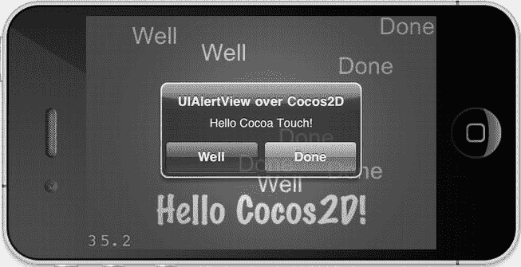
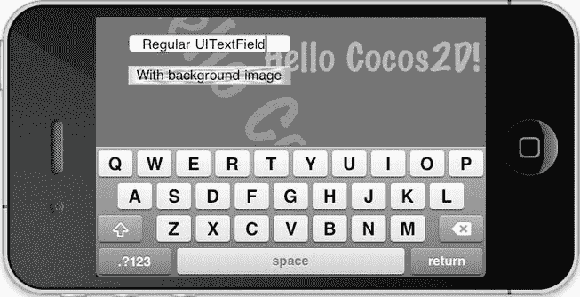
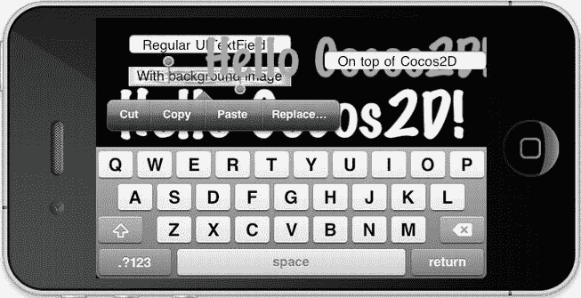
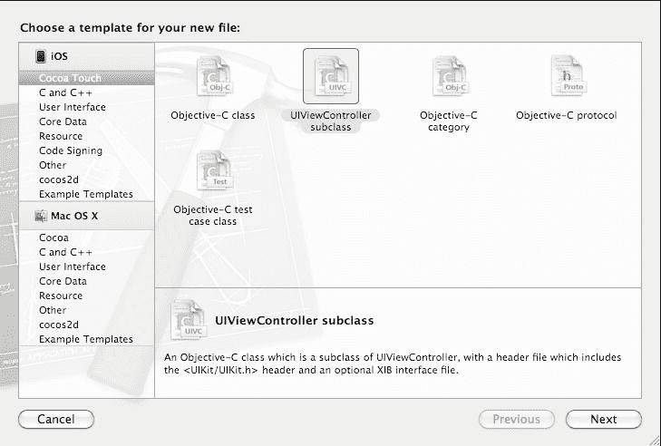
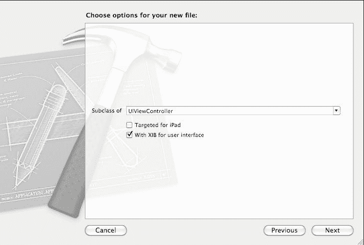
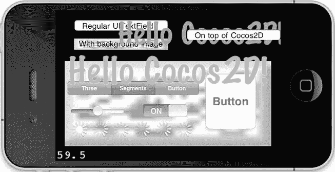
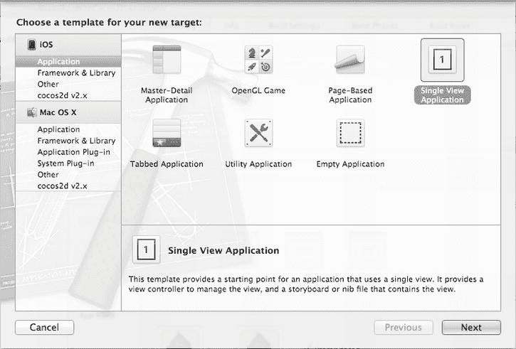
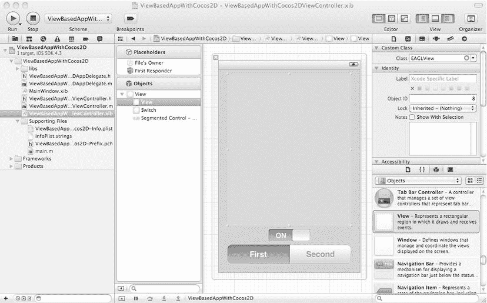
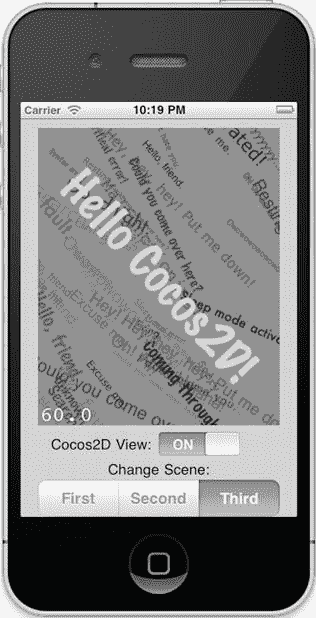

# 第 15 章：Cocos2d 与 UIKit 视图

对大多数 iOS 开发者来说，存在一条清晰的分界线：如果你想要开发没有或只有少量多媒体内容的“常规”应用，你会使用 Cocoa Touch 及其`UIKit`框架来创建 iPhone 和 iPad 的原生用户界面。

但如果你想开发 iOS 游戏和多媒体应用，你会使用 cocos2d，并且除了用`CCSprite`和`CCMenu`来创建游戏场景和用户界面之外，几乎没有什么动力去使用其他工具。

大量开发者只熟悉其中一种环境，他们常常发现在 Cocoa Touch 和 cocos2d 之间跨界会令人困惑。在几乎所有这类情况下，程序员都希望结合两者的优势，利用他们对 Cocoa Touch 或 cocos2d 的现有知识来创建混合型应用。

由于 Cocoa Touch 和 cocos2d 的工作方式根本不同，并且需要不同的思维方式，创建这种混合应用通常并不直接。本章将帮助你在这两个方向上实现过渡。你将学习如何向 cocos2d 应用添加 Cocoa Touch 视图和功能；同时，你也会了解如何将 cocos2d 嵌入到已有的 Cocoa Touch 应用中。

## 什么是 Cocoa Touch？

Cocoa Touch 是用于创建 iOS 应用的应用程序编程接口（API）的名称。它当然受到了 Cocoa（用于编写 Mac OS X 应用的 API）的启发。

Cocoa Touch 由多个框架组成，包括 Core Animation、Core Data、Map Kit、Store Kit 和 Web Kit 等，仅举几例。但严格来说，就连 cocos2d 也是一个 Cocoa Touch 库，因为它所基于的 OpenGL ES 框架，以及 Core Audio、OpenAL 和 AV Foundation（AV 代表 Audio/Video）框架都是 Cocoa Touch 的一部分。

难怪大多数程序员在询问如何将 Cocoa Touch 视图集成到 cocos2d 时，特指的就是`UIKit`。`UIKit` 是一个为程序员提供原生 iOS 控件和视图的框架，用于构建 iOS 应用的图形用户界面（GUI）。同时，其他框架如 iAd、Web Kit、Game Kit 和 Map Kit 通常包含专门的视图，而且它们大多是由`UIKit`提供的 GUI 元素构建的。

所以，从技术上讲，即使程序员在讨论`Game Center`与 cocos2d 的集成问题时，他们通常也会将这些视图视为`UIKit`的一部分，即使实际的视图是由 Game Kit 或 Web Kit 等框架提供的。供参考，以下是 cocos2d 论坛上标记了`UIKit`和 Cocoa Touch 的帖子：

```
http://www.cocos2d-iphone.org/forum/tags/uikit
http://www.cocos2d-iphone.org/forum/tags/cocoa-touch
```

## 同时使用 Cocoa Touch 和 cocos2d

在开始处理本章的代码之前，我想先退一步，讨论一下为什么有人会想要混合使用 cocos2d 和 Cocoa Touch（`UIKit`视图），这样做有什么限制，以及 Cocoa Touch 和 cocos2d 之间的区别是什么。

### 为什么要把 Cocoa Touch 与 cocos2d 混合使用？

混合使用 Cocoa Touch 和 cocos2d 有很多充分的理由。本质上，所有这些理由都归结为更好的用户体验或更快的开发速度。

首先，如果你是 cocos2d 程序员，你迟早会向应用添加一些 Cocoa Touch 视图，最常见的是为了通过 iAd 产生收入，或者是在编写一个支持`Game Center`的游戏时。但你可能还想为用户提供一个原生外观的用户界面，你可以用 Interface Builder 高效地设计它，然后使用能保持游戏视觉风格的纹理进行外观定制，这样你的用户界面看起来就不会像“设置”应用。一个很好的定制外观应用例子是《卡卡颂》（Carcassone）——你需要看两次才能发现它的用户界面实际上完全是由`UIKit`视图构成的。

虽然你可以用 cocos2d 制作出相当不错的用户界面，但`UIKit`中已有的控件种类要多得多，而 cocos2d 并未提供。Cocos2d 提供了`CCMenu`，这差不多就是它所有的用户界面控件了。偶尔在 cocos2d 中重新实现流行的`UIKit`视图，总是在手感和功能上有所欠缺。滑块、开关按钮、导航视图和标签栏在设计游戏用户界面时都非常有用，尤其是在那些对性能要求不是最高的游戏或游戏部分中。

如果你是 Cocoa Touch 程序员，并且你的游戏需要一些多媒体内容，那么依赖 cocos2d 来完成这项工作，并以高性能实现它，比起直接用 OpenGL ES 编程要容易得多。毕竟，cocos2d 为你屏蔽了 OpenGL ES，并提供了一个更易于使用的接口。

Cocoa Touch 确实提供了强大的图形框架，如 Core Graphics 和 Core Animation。但它们有一个主要缺点：对于实时游戏来说，它们通常不够快。它们是为显示和动画化用户界面元素而设计的，而不是为游戏设计的。

### 混合使用 Cocoa Touch 与 cocos2d 的限制

在设计同时使用 Cocoa Touch 视图和 cocos2d 视图的应用或游戏时，你应该意识到一些限制。最明显的是，`UIKit`视图并非为高性能而设计，因此你可能会注意到性能下降，尤其是在快节奏的游戏过程中使用`UIKit`视图时。

例如，为了性能考虑，在游戏过程中显示分数时，使用`CCLabelBMFont`比使用`UITextField`更有利。同样，你应该优先使用`CCMenu`来创建游戏内的暂停菜单按钮，而不是使用`UIButton`。不过，在菜单界面中，这些性能方面的考虑通常不是问题，并且你可以通过使用 Interface Builder 创建菜单界面来提高生产力。

你还应该注意，任何`UIKit`视图只能完全位于整个 cocos2d 视图的前面或完全位于其后。你不能让一个`UIKit`视图既位于某些 cocos2d 场景精灵、标签、效果等元素的前面，同时又位于其他 cocos2d 精灵、标签、效果或节点之后。换句话说，你不能将`UIKit`视图“夹”在两个或更多 cocos2d 节点之间。

然而，反过来做是可能的，但会有一些限制并且需要手动操作。你可以“夹入”cocos2d 视图：背景中放`UIKit`视图，然后是一个透明的 cocos2d 视图（包含一些节点），然后再在前景中放一些`UIKit`视图。这种方法需要多做一点工作来设置视图层次结构，并使 cocos2d 视图透明。想象一下，在背景中播放全动态视频，在其上绘制 cocos2d 精灵，而其余用户界面则由`UIKit`视图构成。


但触摸输入仍然是一个问题：要么只有 UIKit 视图会接收输入，而 `cocos2d` 视图不会；要么添加到 `cocos2d` 视图上的 UIKit 视图以及 `cocos2d` 视图本身会接收输入，但背景中的视图却无法接收。这之所以发生，是因为 `cocos2d` 视图占据了整个屏幕，从而捕获了屏幕上的所有触摸。因此，你需要编写额外的代码来处理 `cocos2d` 视图上的触摸，然后决定是否应该转发这些触摸——例如，如果用户没有触摸到当前屏幕上显示的任何 `cocos2d` 精灵。

让所有视图都能接收输入是可行的，我将在本章稍后为你提供一个基本的解决方案。但你需要根据自己的需求对其进行改进和适配。根据你的需求，为了完整支持位于 `cocos2d` 视图前面和后面的 UIKit 视图，并让所有视图都对触摸输入做出正确响应，必要的代码修改实际上可能相当复杂且具有挑战性。

## Cocoa Touch 与 Cocos2d 有何不同？

让我们来看看 Cocoa Touch 编程与使用 `cocos2d` 的主要区别。其中一个区别是 Cocoa Touch 应用普遍采用的模型-视图-控制器（Model-View-Controller）模式，而在 `cocos2d` 中这个模式基本上缺失了。此外，你还必须考虑由于 `cocos2d` 使用 OpenGL ES 视图而带来的差异，因为它在某些方面的行为与常规的 `UIView` 不同。

### 模型-视图-控制器模式

对于熟悉 Cocoa Touch 的程序员来说，第一个也是最大的差异可能是 `cocos2d` 并没有严格遵循 Cocoa 和 Cocoa Touch 中常见的模型-视图-控制器（MVC）模式。

MVC 模式将编程任务划分为三个子集：模型（model）、视图（view）和控制器（controller）。模型包含所有在后台运行的算法，并维护世界的状态；本质上，模型代表知识。视图是模型的视觉表现，它根据模型数据渲染世界的当前状态。而控制器主要提供一种方式，让用户通过输入与世界交互，但它也用于响应其他外部事件，例如通过网络接收数据。模型、视图和控制器各自作为独立的类，以将用户界面与业务（或游戏）逻辑解耦。

在游戏中，你可以应用 MVC 模式，并且许多人曾试图在 `cocos2d` 中这样做。如果你搜索 *cocos2d mvc*，会找到大量相关文章，我个人最喜欢的是 Bartek Wilczyński 写的这篇分为两部分的文章：

```
http://xperienced.com.pl/blog/how-to-implement-mvc-pattern-in-cocos2d-game
http://xperienced.com.pl/blog/how-to-implement-mvc-pattern-in-cocos2d-gamepart-2
```

对于 Cocoa Touch 程序员来说，`cocos2d` 没有遵循 MVC 模式可能会带来文化上的冲击。但这是一个你可以解决的问题。另一方面，作为一名 `cocos2d` 程序员，你甚至可能不会注意到你正在使用 MVC，因为整个 Cocoa Touch 框架都是为 MVC 模式设计的。你会愉快地使用提供给您的控制器和视图，并且你会发现将逻辑和算法（即模型）放入控制器或视图（或两者）中完全没有问题。这也是一种有效的模式，尽管它耦合得更紧密，在大型项目中可维护性较差。

### Cocos2d 的视图使用 OpenGL ES

`cocos2d` 并不依赖 UIKit 来显示其图形，而是创建了一个 OpenGL ES 视图。这意味着 `cocos2d` 可以更直接地访问图形资源，并且能够更快地渲染其视图。

当然，在幕后，所有 UIKit 视图也是由 OpenGL ES 渲染的；只是背景中发生了大量额外的事情，这些对于图形用户界面是必需的，但对于制作游戏来说本质上是性能浪费。你可能还记得早期那些完全使用 UIKit、Core Graphics 和 Core Animation 编写的游戏？如果不记得，那对你是好事。它们通常运行缓慢且反应迟钝。

Cocoa Touch 和 `cocos2d` 之间一个显而易见的区别是坐标系。`cocos2d` 的原点 `(0,0)` 位于屏幕的左下角，而 UIKit 视图的原点位于屏幕的左上角。在定位以及手动旋转 UIKit 视图时，你需要考虑 UIKit 和 OpenGL ES 使用的坐标系之间的差异。

并且，由于 `cocos2d` 被设计为直接与图形硬件交互，它使用自己的层次结构来显示图形元素。在 `cocos2d` 中，这是 `CCNode` 层次结构，你可以将任何基于 `CCNode` 的类添加到另一个 `CCNode` 中，其中 `CCScene` 是该层次结构中的第一个元素。另一方面，UIKit 框架使用视图层次结构操作，你将基于 `UIView` 的类添加到另一个类中，通常以 `UIWindow` 作为最顶层的元素。两种视图层次结构是不可兼容的，因此你不能将 `UIView` 添加到 `CCNode` 中，反之亦然。当你使用 `CCTransitionScene` 从一个 `CCScene` 切换到另一个时，这一点尤为明显。当 `cocos2d` 节点全部移动时，UIKit 视图会固定不动，除非你同时移动它们并与 `cocos2d` 动画保持同步。实际上，最好首先避免这种情况。

## 警报：你在 Cocos2d 中的第一个 UIKit 视图

在 `cocos2d` 中使用 UIKit 视图的最简单、最直接的例子可以在示例项目 CocosWithCocoa01 中找到。它在默认 `cocos2d` 项目模板创建的 `cocos2d` 场景之上显示了一个 `UIAlertView`。要从头开始重新创建该项目，请打开 Xcode 并转到 `File`  `New`  `New Project` 以打开新建项目对话框。在该对话框中，在 iOS 列表下选择 `cocos2d` 并创建 `cocos2d` 项目。

让我们修改 `HelloWorldLayer` 类以显示一个 `UIAlertView`。`HelloWorldLayer.h` 中的接口只需要一个小的添加；即 `HelloWorldLayer` 类需要支持 `UIAlertViewDelegate` 协议：

```
@interface HelloWorldLayer : CCLayer < UIAlertViewDelegate>
{
}
```

所有其他更改都在 `HelloWorldLayer.m` 实现文件中进行。修改了 “Hello World” 示例的 `init` 方法，使其使用颜色渐变背景，以便你看到 `UIAlertView` 使屏幕变暗的视觉效果，并调用 `showAlertView` 方法。

```
-(id) init
{
    if ((self = [super init]))
    {
        CCLayerGradient* layer = [CCLayerGradient layerWithColor:ccc4(100,150,255,255)
                                                     fadingTo:ccc4(255,200,50,100)
                                                  alongVector:ccp(0.75f, 0.25f)];
        [self addChild:layer];

        CCLabelTTF *label = [CCLabelTTF labelWithString:@"Hello World"
                                              fontName:@"Marker Felt"
                                              fontSize:64];
        CGSize size = [CCDirector sharedDirector].winSize;
        label.position = ccp(size.width / 2, size.height / 2);
        [self addChild:label];

        self.isTouchEnabled = YES;
        [self showAlertView];
    }
    return self;
}
```

`showAlertView` 方法分配了一个 `UIAlertView`，包含一个标题、两个按钮以及消息文本 “Hello Cocoa Touch!”。对于委托，你将使用 `self`，因为你已将 `UIAlertViewDelegate` 协议添加到了 `HelloWorldLayer` 类。

最后，你可以显示警报视图。列表 15-1 展示了最终的代码。


### ***清单 15-1.** 创建`UIAlertView`并显示在 cocos2d 视图（`CCGLView`类）之上*

```
-(void) showAlertView
{
    UIAlertView* alertView = [[UIAlertView alloc] initWithTitle:@"UIAlertView 示例"
                                                     message:@"你好，Cocoa Touch！"
                                                  delegate:self
                                      cancelButtonTitle:@"确定"
                                      otherButtonTitles:@"完成", nil];

[alertView show];
}
```

**提示**  无需将`UIAlertView`添加到其他视图。这使得创建`UIAlertView`消息变得非常直接。唯一的缺点是`UIAlertView`将始终绘制在所有其他元素之上，并且在显示期间会吞掉所有触摸事件。无论你如何将视图发送到底层或重新调整视图层次，都无法改变这一点。如果你需要为暂停菜单寻找一个简单的解决方案，`UIAlertView`就是你廉价而粗暴的朋友，尤其是在开发阶段。但请记住：虽然触摸被禁用，但你仍会接收到加速度事件，在`UIAlertView`显示期间，你需要关闭或忽略这些事件。

`HelloWorldLayer`类将接收来自`UIAlertView`的所有事件，并且只需实现一个或多个`UIAlertViewDelegate`方法即可响应这些事件。在本例中，我决定响应`didDismissWithButtonIndex`消息（见清单 15-2），该消息在用户点击按钮时发送（无论点击哪个按钮，都会关闭`UIAlertView`）。每次警告视图关闭时，会在 cocos2d 场景的随机位置添加另一个`CCLabelTTF`，其字符串和颜色取决于`buttonIndex`。

### ***清单 15-2.** 响应`UIAlertView`的`didDismissWithButtonIndex`消息*

```
-(void) alertView:(UIAlertView*)alertView←
    didDismissWithButtonIndex:(NSInteger)buttonIndex
{
    NSString* message = @"确定";
    ccColor3B labelColor = ccYELLOW;
    if (buttonIndex == 1)
    {
        message = @"完成";
        labelColor = ccGREEN;
    }

CCLabelTTF* label = [CCLabelTTF labelWithString:message
        fontName:@"Arial"
        fontSize:32];

CGSize size = [CCDirector sharedDirector].winSize;
    label.position = CGPointMake(CCRANDOM_0_1() * size.width,←
        CCRANDOM_0_1() * size.height);
    label.color = labelColor;
    [self addChild:label];

// 通过再次显示来保持警告视图的活动状态
    [self showAlertView];
}
```

每当警告视图被关闭时，`showAlertView`方法会再次被调用，因此警告视图会持续显示，让你能够向 cocos2d 视图添加另一个标签。你可以在图 15-1 中看到结果。



图 15-1 . 在 cocos2d 视图上显示的`UIAlertView`

## 在 cocos2d 应用中嵌入 UIKit 视图

接下来，你将把更常用的 UIKit 视图嵌入到 cocos2d 中。最简单且最常见的之一就是`UITextField`，你可以像之前一样将其添加到 cocos2d 之上。当你将其移动到 cocos2d 的背景层时，事情会变得更加复杂，这需要使 cocos2d 视图透明。

最后，我将向你展示如何将 Interface Builder 视图添加到 cocos2d 应用中，而不是通过编程方式创建视图。

### 在 cocos2d 视图前方添加视图

在`CocosWithCocoa01`项目中，我在 cocos2d 视图上方添加了`UITextField`视图。`UITextField`是一个简单的文本输入框，当你点击它时，它会自动弹出 iPhone 键盘。

```
-(void) addSomeTextFields
{
    // 带圆角的常规文本字段
    UITextField* textField = [[UITextField alloc] initWithFrame:←
        CGRectMake(40, 20, 200, 24)];
    textField.text = @"常规 UITextField";
    textField.borderStyle = UITextBorderStyleRoundedRect;

// 获取 cocos2d 视图（即继承自 UIView 的 CCGLView 类）
    UIView* glView = [CCDirector sharedDirector].view;

// 将文本字段视图添加到 cocos2d 的 CCGLView
    [glView addSubview:textField];
}
```

需要注意的是，通过编程方式创建任何`UIView`类的过程与创建`UITextField`非常相似。你选择一个从`UIView`派生出的所需类，然后调用`alloc`和`initWithFrame`。通过仅提供一个框架矩形，你就可以创建大多数`UIView`控件。不过，通常你还需要设置一些属性来配置控件；在本例中，我将`textField`设置为圆角样式并设置了初始文本。

**警告**  框架矩形是许多程序员首次注意到 cocos2d 节点与`UIView`类坐标系不同的地方。在 cocos2d 中，原点(0, 0)位于屏幕左下角，而`UIView`类的原点位于屏幕左上角。这意味着`UITextField`实际上位于屏幕顶部边界下方 20 像素处，而不是底部边界上方 20 像素。在处理`UIView`类时，你需要牢记这一点。

因为`UITextField`与大多数其他`UIView`类一样，没有`show`方法，所以你需要其他方式将其附加到视图层次中。由于 cocos2d 视图是`CCGLView`类，而该类又继承自`UIView`，你可以简单地将`UITextField`作为子视图添加到 cocos2d 视图中。`CCDirector`有一个`view`属性，允许你访问 cocos2d 视图，然后在其上调用`addSubview`方法来添加`textField`。默认情况下，这会将视图添加到 cocos2d 视图的上方。

如果你现在尝试一下，你会看到场景中有一个文本字段；点击文本字段时，iPhone 键盘会弹出，你就可以开始编辑文本了。无需额外代码。但键盘不会再消失了。

这是设计使然，因为回车键可能是开始新行的有效按键，而不是停止编辑。所以，你需要某种方式来关闭键盘。为此，打开`HelloWorldLayer`头文件并添加`UITextFieldDelegate`协议，如下所示：

```
@interface HelloWorldLayer : CCLayer < UIAlertViewDelegate, UITextFieldDelegate>
{
}
```

这样做允许`HelloWorldLayer`类响应`UITextFieldDelegate`方法，例如`textFieldShouldReturn`。要使此功能生效，你必须通过将`self`赋值给`delegate`属性，将`HelloWorldLayer`类实例分配给`UITextField`。在`UITextField`初始化块的末尾添加上面的粗体行：

```
// 带圆角的常规文本字段
UITextField* textField = [[UITextField alloc] initWithFrame:←
    CGRectMake(40, 20, 200, 24)];
textField.text = @"常规 UITextField";
textField.borderStyle = UITextBorderStyleRoundedRect;
textField.delegate = self;
```

大多数 UIKit 视图都具有这种委托方法以及相应的委托协议。因此，如果你想知道如何响应某个`UIView`的事件，通常是通过实现该类的相应委托协议并响应对应的消息来实现。当然，你可能会犯一个非常常见且反复出现的错误（我知道我会犯），那就是忘记将委托实际分配给类接口。因此，每当某个委托方法未被调用，或者你在分配委托对象的代码行收到编译器警告时，你应该检查该对象的类是否使用并实现了视图的委托协议。


在本文中，当用户点击 iPhone 键盘上的 Return 键时，会发送 `UITextFieldDelegate` 协议的 `textFieldShouldReturn` 消息：

```
-(BOOL) textFieldShouldReturn:(UITextField *)textField
{
    // 关闭键盘
    [textField resignFirstResponder];

    // 如果文本为空，则移除文本字段
    if (textField.text.length == 0)
    {
        [textField removeFromSuperview];
    }
    return YES;
}
```

通过向 `textField` 发送 `resignFirstResponder` 消息，键盘将被关闭。为了演示如何从 cocos2d 视图中移除 `UIView`，我添加了一个条件：当用户按下 Return 键时，如果 `textField` 为空，则向其发送 `removeFromSuperview` 消息。请注意，整个方法不关心是哪个 `UITextField` 发送的消息，也不关心 `textField` 在视图层次结构中的添加位置。接下来，您将通过添加另一个 `UITextField` 来利用这一特性。

如果您尝试到目前为止的代码，您会注意到按 Return 键时键盘会关闭，并且如果您删除了文本字段中的所有字符，整个文本字段将消失。

**提示** 请记住，如果用户在 `UITextField` 中编辑文本时场景可能发生变化，您需要手动向所有文本字段发送 `resignFirstResponder` 消息以关闭键盘。否则，在场景切换期间及之后，键盘可能仍然可见，用户将无法再将其关闭。为避免这种情况，最好同时响应 `textFieldDidBeginEditing` 消息，并用它来临时禁用任何可能改变当前场景的按钮或事件。然后在收到 `textFieldShouldReturn` 消息时重新启用这些按钮或事件。

## 使用 UIImage 对 UITextField 进行皮肤定制

不，我并不是要剥掉文本字段的皮肤！如果您之前没有听说过 *皮肤定制*（skinning）这个术语，它基本上意味着为用户界面控件或视图添加（或更改）纹理。本质上，您更改了控件或视图的原生外观，并用您自己的外观替换它。

在 Listing 15-3 中，您在 `addSomeTextFields` 方法的底部添加了一些代码，以创建第二个使用纹理作为背景的 `UITextField`。

***Listing 15-3.**  对 UITextField 视图进行皮肤定制*

```
-(void) addSomeTextFields
{
    ...

    // 使用图像作为背景的文本字段（即“皮肤定制”）
    UITextField* textFieldSkinned = [[UITextField alloc] initWithFrame:←
        CGRectMake(40, 60, 200, 24)];
    textFieldSkinned.text = @"带背景图像";
    textFieldSkinned.delegate = self;

    // 加载并分配 UIImage 作为文本字段的背景
    CCFileUtils* fileUtils = [CCFileUtils sharedFileUtils];
    NSString* file = [fileUtils fullPathFromRelativePath:@"background-frame.png"];
    UIImage* image = [[UIImage alloc] initWithContentsOfFile:file];
    textFieldSkinned.background = image;

    // 获取 cocos2d 视图（它属于继承自 UIView 的 CCGLView 类）
    UIView* glView = [CCDirector sharedDirector].view;

    // 将文本字段视图添加到 cocos2d CCGLView
    [glView addSubview:textField];
    [glView addSubview:textFieldSkinned];
}
```

创建 `UITextField` 的过程应该很熟悉，并且您还将 `self` 添加为文本字段的委托。用于关闭键盘以及在文本字段为空时将其移除的代码（见 Listing 15-2）现在同样适用于这个新的 `UITextField`。

下一部分对于几乎没有或没有 Cocoa Touch 编程经验的 cocos2d 用户来说可能有些奇怪。您不能直接将 `CCSprite` 或其纹理添加到 `UIView`。您需要一个 `UIImage` 类来对 Cocoa Touch 视图进行皮肤定制，而 `UIImage` 可以通过 `initWithContentsOfFile` 方便地创建。或者不能？嗯，返回的 `UIImage` 可能是 `nil`。

事实证明，cocos2d 允许您使用不带路径的文件名，因为它在内部为您添加了指向应用程序包文件的路径。这个指向包文件的完整路径在 iOS 设备上看起来像这样，并且在模拟器或其他设备上运行时路径会有所不同：

```
/var/mobile/Applications/...lots of letters.../CocosWithCocoa.app/background-frame.png
```

由于 `UIImage` 和大多数其他处理文件的 Cocoa Touch 类期望文件的完整路径，您必须使用 `CCFileUtils` 的 `fullPathFromRelativePath` 方法来创建一个 `NSString`，其中包含应用包中文件的完整路径。然后，您可以获得一个有效的 `UIImage`，并将其分配给 `background` 属性。您可以在 Figure 15-2 中看到效果。



Figure 15-2.  两个带有 iPhone 键盘的 UITextField 视图

**提示** `UIView` 的背景图像将始终被缩放和拉伸以适应 `UIView` 的框架。这通常会使纹理模糊或变形。为避免这种情况，您应该将 `UIView` 的背景图像设计为与 `UIView` 的精确尺寸一致。或者，将纹理设计为 `UIView` 可能的最大尺寸，这样即使缩放，也是缩小，与放大纹理相比，不会损失太多图像质量。

## 在 cocos2d 视图后面添加视图

如果您想在 cocos2d 视图后面添加一个 `UIView` 怎么办？例如，在后台播放视频？您需要更改一些设置以允许在后台显示 UIKit 视图。您可以在 CocosWithCocoa02 项目中找到这些代码更改。

**将 UITextFields 移至后台**

将 `UITextField` 视图添加到应用程序窗口非常简单。在本例中，您可以跳过 `addSomeTextFields` 方法中的 `UITextField` 初始化代码，因为它没有变化。唯一的变化是将 `UITextField` 视图作为 cocos2d 视图的父视图（恰好是应用程序的 `UIWindow` 对象）的子视图添加：

```
-(void) addSomeTextFields
{
    // 获取 cocos2d 视图（它属于继承自 UIView 的 CCGLView 类）
    UIView* glView = [CCDirector sharedDirector].view;
    // 窗口是 cocos2d 视图的父视图
    UIView* window = glView.superview;

    // UITextField 初始化代码已省略
    ...

    // 将文本字段添加到窗口
    [window addSubview:textField];
    [window addSubview:textFieldSkinned];
}
```

您可以简单地访问窗口，因为它恰好是 cocos2d `glView` 的父视图。*父视图*（superview）是 Cocoa 术语，相当于 cocos2d 节点层次结构中的父节点。然后，您可以将文本字段添加到 `window` 而不是 `glView`。

但是，如果您现在运行项目，将不会看到差异。因为您在 cocos2d 视图之后添加了文本字段，默认情况下，它们会在 cocos2d 视图之后渲染。这与 cocos2d 节点层次结构中的行为相同。为了实际将文本字段移至后台，您可以向它们全部发送 `sendSubviewToBack` 消息，或者更简单地向 `glView` 发送 `bringSubviewToFront` 消息，如下所示：

```
    // 将文本字段添加到窗口
    [window addSubview:textField];
    [window addSubview:textFieldSkinned];

    // 将 cocos2d 视图发送到前台，使其位于其他视图之前
    [window bringSubviewToFront:glView];
```

请注意，`sendSubviewToBack` 和 `bringSubviewToFront` 消息是发送给包含应被发送到后台或前台视图的那个视图。在本例中，该视图是 `window`。如果您现在运行项目，您会看到差异，但文本字段消失了。现在是什么问题？

**使 cocos2d 视图透明**


好的，作为一名高级文档工程师和翻译员，我将严格遵循您的注意事项和示例格式，对给定的英文文本进行翻译。


默认情况下，cocos2d 视图是完全不透明的。`glView` 背后的任何内容都会被遮挡，因为 cocos2d `CCGLView` 每帧都会用不透明的纯色填充。它还将 `opaque` 属性设置为 `YES`。你可以通过向 `addSomeTextFields` 方法中添加以下代码来轻松解决此问题：

```
// 使 cocos2d 视图透明
glClearColor(0, 0, 0, 0);
glView.opaque = NO;
```

`opaque` 标志被设置为 `NO`，并且 `glClearColor` 全部为零。然而，严格来说，并不必须使用黑色；只要降低 `glClearColor` 的 alpha 通道（第四个参数）使其至少部分透明即可。但对于此示例，并且在大多数情况下，你不希望背景被着色或仅部分不透明。你可能还想知道为什么仅将视图的 `opaque` 属性设置为 `NO` 不足以使视图透明。答案很简单：OpenGL ES 不遵守该属性，并且无论如何都会绘制其清除颜色。

这只是故事的一半。容易忘记且你必须了解的一点是，cocos2d 的 `CCGLView` 必须使用实际包含 alpha 通道的 `pixelFormat` 进行设置。没有 alpha 通道，你就无法使 `cocos2d` 视图透明。

默认情况下，cocos2d 使用 `kEAGLColorFormatRGB565` 像素格式初始化 `CCGLView`。这种像素格式每个像素使用 16 位，并且没有 alpha 通道。目前唯一支持的其他 `pixelFormat` 是 `kEAGLColorFormatRGBA8`，它为每个颜色通道设置 8 位，外加一个 8 位 alpha 通道，这使得每个像素为 32 位。显然，这会对性能和内存使用产生影响，因为帧缓冲区内存大小会加倍。这就是 `kEAGLColorFormatRGB565` 像素格式是默认格式的原因，但如果你想使 cocos2d 视图透明，除了使用 `kEAGLColorFormatRGBA8` 之外别无选择。

打开 `AppDelegate.m` 文件，在 `applicationDidFinishLaunching` 方法中查找初始化 `CCGLView` 的那一行。然后将其更改为使用 `kEAGLColorFormatRGBA8` 像素格式：

```
CCGLView *glView = [CCGLView viewWithFrame:[window bounds]
                 pixelFormat:kEAGLColorFormatRGBA8
                 depthFormat:0];
```

Kobold2D 用户可以在 `config.lua` 文件中通过相应地更改 `GLViewColorFormat` 设置来进行更改：

```
GLViewColorFormat = GLViewColorFormat.RGBA8888,
```

现在，你可以再次运行应用程序，您将看到“Hello Cocos2D!”标签绘制在文本字段之上。只剩下一个问题：cocos2d 视图下方的文本字段将不会响应你的触摸！

**通过命中测试正确传播触摸事件**

让 cocos2d 视图背后的视图响应触摸事件的最简单方法是完全禁用 cocos2d 视图上的触摸输入。如果你添加以下代码行，你将不再从 `CCTouchDispatcher` 接收到任何消息：

```
// 这将禁用 cocos2d 视图上的所有触摸事件
glView.userInteractionEnabled = NO;
```

现在，cocos2d 视图后面的文本字段将正常工作，但 cocos2d 视图的触摸输入将被禁用。位于 cocos2d 视图前面的 UIKit 视图也应该正常工作并响应触摸，除非你将它们直接添加到了 cocos2d `glView` 而不是窗口。

你可能想知道为什么禁用 cocos2d 视图上的触摸输入是最好（或者至少是最简单）的选项。为此，你必须理解 cocos2d 视图是一个覆盖整个屏幕区域的 `UIView`。尽管现在你已经将其设置为透明，可以看穿它，但它仍然会对 `UIView hitTest` 事件做出肯定响应。毕竟，任何触摸都发生在屏幕上的某个位置，并且由于 cocos2d 视图与屏幕一样大，并且不考虑其视图内部实际显示的内容，因此它会对命中测试做出肯定响应。因此，任何到达 cocos2d 视图的触摸都将由它或 `CCTouchDispatcher` 类处理。cocos2d 视图下方的任何内容都将被切断，无法接收触摸事件。

不幸的是，cocos2d 没有内置系统将 `hitTest` 事件转发给其节点，让节点决定它们是否真的需要响应触摸。我为你提供一种解决方案，该方案使用节点的边界框，并且需要用一个分类来扩展 `CCGLView` 类。

**注意** 只有当你绝对需要在项目中使用时，才应将以下命中测试代码添加到 `CCGLView` 类。它会在每次触发触摸事件时对性能产生负面影响，而基本上只要用户至少有一根手指放在触摸屏上就会触发触摸事件。场景中的节点越多，性能损失就越大。

打开 `HelloWorldLayer.h` 文件并添加此分类接口，最好是在 `HelloWorldLayer` 接口之前：

```
@interface CCGLView (hittest)
-(UIView*) hitTest:(CGPoint)point withEvent:(UIEvent*)event;
@end
```

现在，在 `HelloWorldLayer.m` 文件的开头，添加清单 15-4 中显示的 `CCGLView` 命中测试分类实现。`hitTest` 方法是 `UIView` 类的一部分，当 UIKit 框架试图确定哪个视图想要响应触摸事件时，会调用该方法。该方法要么返回一个应该接收触摸输入的 `UIView` 实例，要么返回 `nil` 以表示命中测试失败，在这种情况下，UIKit 框架会继续寻找可能想要处理触摸事件的其他视图。

***清单 15-4.** 准备对所有 cocos2d 场景子节点进行命中测试*

```
@implementation CCGLView (hittest)

...

-(UIView*) hitTest:(CGPoint)point withEvent:(UIEvent*)event
{
    UIView* hitView = [super hitTest:point withEvent:event];

if (hitView == self)
    {
        CCScene* runningScene = [CCDirector sharedDirector].runningScene;
        CCArray* sceneChildren = runningScene.children;
        CGPoint glPoint = [[CCDirector sharedDirector] convertToGL:point];

BOOL hit = [self hitTestNodeChildren:sceneChildren point:glPoint];
        return (hit ? self : nil);
    }

return hitView;
}
@end
```

在这种情况下，你首先调用父类实现来接收 `hitTest` 通常返回的视图。在绝大多数情况下，这将是 `CCGLView` 本身，但因为你可以向 `CCGLView` 添加子视图，所以它可能会返回一个子视图，在这种情况下，你希望允许该子视图处理触摸。

否则，将从 `CCDirector` 获取 `runningScene`，这使你可以通过 `children` 数组访问 `cocos2d` 节点层次结构。由于 `hitTest` 的点坐标是基于 Cocoa Touch 坐标系的，因此在将 `sceneChildren` 和 `glPoint` 传递给清单 15-5 中显示的 `hitTestNodeChildren` 方法之前，你还必须将其转换为 GL 坐标。如果该方法返回命中结果，则 `hitTest` 通过返回 `self` 进行响应。否则，它通过返回 `nil` 使 `hitTest` 失败，从而允许 `cocos2d` 视图后面的所有视图轮流进行命中测试。


`hitTestNodeChildren`方法在清单 15-5 中更为复杂且难以理解，因为它使用递归遍历`cocos2d`节点层级。换句话说，该函数可以调用自身以深入`cocos2d`节点层级。请在`hitTest`方法上方添加`hitTestNodeChildren`方法。

***清单 15-5. 递归测试所有节点，判断其`boundingBox`是否包含给定点***

```
@implementation CCGLView (hittest)
-(BOOL) hitTestNodeChildren:(CCArray*)children point:(CGPoint)point
{
    BOOL hit = NO;

if (children.count > 0)
    {
        Class sceneClass = [CCScene class];
        Class layerClass = [CCLayer class];

for (CCNode* node in children)
        {
           // check the node's children first
           hit = [self hitTestNodeChildren:node.children point:point];

// abort search on first hit
           if (hit)
           {
           break;
           }

// scenes/layers are typically full screen, so do not hitTest them
           if ([node isKindOfClass:sceneClass] || [node isKindOfClass:layerClass])
           {
           continue;
           }

// check the node itself
           hit = CGRectContainsPoint(node.boundingBox, point);

// abort search on first hit
           if (hit)
           {
           break;
           }
        }
    }

return hit;
}
...

@end
```

`for`循环的前半部分通过递归调用当前节点的子节点，简单地向`cocos2d`节点层级深处遍历。如果任何递归调用找到了命中点，循环将立即中止。

在后半部分中，实际进行迭代的节点被检查。它首先确保你没有测试`CCScene`或`CCLayer`类节点，从而执行实际的命中测试。原因是这两类节点的`boundingBox`通常设置为整个屏幕区域。如果你测试了这些类中的任何一个，总会击中它们，而这正是你想要避免的。

既然你确信测试是在一个具有合理`boundingBox`的节点上进行的，实际检查就简化为测试点是否位于`boundingBox`内部：

```
hit = CGRectContainsPoint(node.boundingBox, point);
```

同样，如果存在命中，循环将被中止，方法返回。这是一种优化策略，因为你只需要找到任何对命中测试给出肯定响应的节点。

显然，这种解决方案存在一些缺陷。首先，它假设如果触摸点在节点的`boundingBox`内，该节点应该接收触摸事件。但它无法得知是否存在某种游戏状态会阻止节点处理触摸——例如，如果节点是一个当前被禁用的`CCMenuItem`。或者，如果触摸点位于一个实际执行像素级碰撞检测的精灵上，那么`boundingBox`检查就过于宽泛了。此外，当节点旋转时，`boundingBox`会过大，因为它是一个轴对齐的边框，其大小会随着节点旋转而变化。

缓解这种情况的方法是，向`CCNode`类分类中添加一个`hitTest`方法，该方法默认仅执行`boundingBox`检查，但子类可以重写它以执行更精确或有条件的检查。

**夹层式`cocos2d`视图**

为了完成这个测试，我想添加另一个文本字段——但要放在`cocos2d`视图的前面，这样你就真正拥有一个被`UIKit`视图前后夹层的`cocos2d`视图，并且所有这些视图都能响应触摸。

改动相当简单；只需在`addSomeTextFields`方法的末尾添加以下代码，并确保将`textFieldFront`添加为`window`的子视图，而不是`glView`：

```
UITextField* textFieldFront = [[UITextField alloc] initWithFrame:←
    CGRectMake(280, 40, 200, 24)];
textFieldFront.text = @" On top of Cocos2D";
textFieldFront.borderStyle = UITextBorderStyleRoundedRect;
textFieldFront.delegate = self;

[window addSubview:textFieldFront];
```

实际上，你也可以将`textFieldFront`作为子视图添加到`glView`中，而不会出现任何立即可见的差异。但将文本字段添加到`window`允许你随时在视图层级中重新排列它；例如，你可以使用`window`的`sendSubviewToBack`方法将它移动到`cocos2d`视图的后面。如果你直接将视图添加到`cocos2d`的`glView`，则无法做到这一点。

结果请参见图 15-3。你将在`cocos2d`视图的上方和后方都放置`UIKit`视图。后方的文本视图仍然可以编辑和操作，如同“剪切、复制、粘贴、替换”按钮所显示的那样。更重要的是，尽管附属的文本字段位于`cocos2d`视图后方，但“剪切、复制、粘贴、替换”弹出按钮会自动显示在`cocos2d`视图的最上方。这正是它应有的表现！



图 15-3. 位于`cocos2d`视图上方和下方的`UIKit`视图，所有视图均启用了输入功能

### 添加使用 Interface Builder 设计的视图

此时，你可能想知道如何添加一个使用 Apple 的 Interface Builder 设计的视图。现在我们来处理这个问题。从代码层面来说，它出奇地简单，如有需要，你可以在 `CocosWithCocoa02` 项目中查看。

首要任务是创建一个 Interface Builder 资源文件。在 Xcode 4 中，你可以轻松地在项目内使用菜单中的“File” > “New” > “New File”命令创建，或者右键单击一个组并选择“New File”。

系统将提示你从文件模板对话框中选择一个模板。如图 15-4 所示，你应该使用`UIViewController`子类模板来创建 Interface Builder 文件。这也会为你创建 Interface Builder nib 文件，并将其与你的视图控制器连接起来，这对于视图正常工作至关重要。



图 15-4. 通过创建`UIViewController`子类来创建一个 Interface Builder 视图

请确保图 15-5 中的“With XIB for user interface”复选框已勾选，并确保“Subclass of”文本为`UIViewController`。我决定使用文件名`MyView.m`保存此模板。你的项目中最终会得到三个新文件：`MyView.h`、`MyView.m`和`MyView.xib`。

**注意** 开发者文档甚至 Cocoa Touch API 都将 Interface Builder 文件称为 nib 文件，尽管它们使用的扩展名是`.xib`。这些文件过去使用`.nib`扩展名，并且即使文件扩展名多年前已更改，这一称呼也作为传统被保留了下来。因此，nib 和 xib 可以互换使用，指的是同一事物。



图 15-5. 确保勾选“With XIB for user interface”

如果你点击`MyView.xib`文件，将会打开 Interface Builder，它不再是一个独立的应用程序，而是集成到了 Xcode 4 中。你会看到一个 iPhone 屏幕的视图，你可以将对象库中的视图拖放到该视图上。如果对象库当前不可见，可以通过“View” > “Utilities” > “Object Library”来访问。

使用 Interface Builder，你可以轻松地以可视化方式创建 UIKit 用户界面。由于解释 Interface Builder 工作流程超出了本书的范围，我建议你参考 Apple 的 Xcode 4 用户指南，特别是关于“设计用户界面”的部分：

```
http://developer.apple.com/library/mac/#documentation/ToolsLanguages/Conceptual/Xcode4UserGuide/InterfaceBuilder/InterfaceBuilder.html
```


趁此机会，如果你需要回顾或了解视图与窗口的基本概念，可以查阅苹果的《iOS 视图编程指南》：

```
http://developer.apple.com/library/ios/#documentation/WindowsViews/Conceptual/ViewPG_iPhoneOS/Introduction/Introduction.html
```

**注意** 遗憾的是，你无法使用界面构建器来设计 cocos2d 视图。为此，你必须使用独立的编辑器，例如 `CocoShop`、`CocoaBuilder`、`LevelHelper` 或任何其他支持 cocos2d 且符合你需求的编辑工具。有关 cocos2d 编辑工具的列表，请参阅第 17 章。

目前，只需将任何视图（如滑块、按钮、标签等）添加到界面构建器的视图中即可。但理想情况下，你至少应该执行以下操作：选择主视图，然后通过"视图"→"工具"→"属性检查器"打开属性检查器。在"模拟指标"下的第一个属性名为"方向"，你应该将其更改为"横向"，因为该应用目前只能在横向模式下运行。如果不这样做，运行应用时视图将会旋转 90 度。

`MyView` 类无需修改；默认实现完全足够。你可以通过将以下代码添加到 `addSomeTextFields` 方法末尾，直接加载 `MyView.xib` 文件：

```
// 添加一个界面构建器视图
MyView* myViewController = [[MyView alloc] initWithNibName:@"MyView" bundle:nil];
[window addSubview:myViewController.view];
[window sendSubviewToBack: myViewController.view]; // 可选
```

请注意，`initWithNibName` 接受 xib 文件名作为参数，但不包含 `.xib` 扩展名。如果添加了扩展名，你将收到一条错误消息，提示无法加载 xib 文件。bundle 参数为 `nil`，这意味着应用应在主 bundle 中查找该文件。

由于 `MyView` 类继承自 `UIViewController`，你可以通过 `myViewController.view` 属性访问实际的视图。你需要将其添加到 `window` 中，如果需要，还可以发送 `sendSubviewToBack` 消息将视图置于背景中。

现在，你可以创建并使用界面构建器设计的视图，并将其添加到 cocos2d 应用中。最终结果可能类似于图 15-6 所示。



图 15-6. 项目结果显示了使用界面构建器设计的 `MyView.xib` 文件，位于下半部分

## 在 Cocoa Touch 应用中嵌入 cocos2d 视图

许多开发者没有意识到，实际上可以将 cocos2d 视图嵌入到使用 UIKit 视图作为主要用户界面的常规应用中。cocos2d 视图甚至不需要全屏显示！

困难之处仅在于项目的设置。我将向你展示如何实现。

### 使用 cocos2d 创建基于视图的应用项目

启动你的 Xcode 4 并创建一个启用了 ARC 的 cocos2d 模板副本，或者直接按照第 2 章的步骤重新操作。关键在于你需要包含 cocos2d 库目标。

然后，通过"文件"→"新建"→"目标"向项目添加一个新目标。选择"单视图应用"模板，如图 15-7 所示，并将新目标命名为 `ViewBasedAppWithCocos2D`。确保为此新目标启用"自动引用计数"，对于本示例，我决定不使用故事板。你将得到一个包含视图控制器类、相应的 iPhone 和 iPad `.xib` 文件以及一个应用委托类的目标。如果立即运行，你将看到一个空白的 iPhone 视图，顶部仅显示状态栏。



图 15-7. 嵌入 cocos2d 视图的起点是"单视图应用"模板

下一步是将 `cocos2d-library` 链接到 `ViewBasedAppWithCocos2D` 目标。你可以按照第 2 章中的描述进行操作：选择目标，切换到"构建阶段"选项卡。在"链接二进制文件与库"部分，点击 + 按钮打开添加对话框。在这种情况下，你不仅需要添加 `libcocos2d-library.a` 文件，还需要添加 cocos2d 所需的框架。它们包括：

*   `AudioToolbox.framework`
*   `AVFoundation.framework`
*   `GameKit.framework`
*   `libz.dylib`
*   `OpenAL.framework`
*   `OpenGLES.framework`
*   `QuartzCore.framework`

请注意，你可以通过按住 Command 键同时选择列表中的项来一次性选中所有库。添加的框架和库可能会被添加到项目导航器的项目根目录中。你可以安全地将它们拖入它们所属的"框架"组中，只是为了将它们移出视线，因为你无需使用它们。

在目标的"构建设置"选项卡中，找到"头文件搜索路径"设置。你需要在此处添加指向 Kazmath 库的路径，即：

```
"cocos2d-2.x-ARC-iOS/libs/kazmath/include"
```

或者，你也可以简单地将整个项目文件夹添加到搜索路径中。你可以通过将"头文件搜索路径"设置为以下内容来实现：

```
./**
```

你可能还需要移除原始的应用程序目标和方案，因为你不再需要它们。

现在，你可以构建并运行 `ViewBasedAppWithCocos2D` 目标。它现在应该会构建 cocos2d 源代码。当然，如果没有用户界面，它仍然和之前一样是那个无聊且空白的应用。让我们来改变它！

### 设计混合应用的用户界面

在项目导航器中选择 `ViewController_iPhone.xib` 文件，以查看界面构建器视图。使用"对象库"（"视图"→"工具"→"对象库"），将以下对象拖放到视图中。你可以在设计区域中按任意方式排列这些对象：

*   视图（基本的矩形绘制区域）
*   开关（开/关控件）
*   分段控件（单个控件中的多个按钮）

现在选择新添加的视图对象，并切换到"身份检查器"（"视图"→"工具"→"身份检查器"）。你会注意到第一项显示该视图派生自 `UIView` 类。由于这应该成为 cocos2d 的 `CCGLView`，请使用下拉按钮从列表中选择一个自定义类。列表中的前几项之一应该是 `CCGLView` 类。如果没有，请滚动列表直到找到 `CCGLView`，或者直接输入类名。生成的用户界面模型应类似于图 15-8。



图 15-8. 混合应用用户界面的界面构建器视图

界面构建器将自动为你实例化 `CCGLView`。你只需要将 `CCDirector` 与此特定视图关联起来。开关控件将作为切换按钮，用于打开和关闭 cocos2d 视图。

首先，做一些准备工作。选择 `CCGLView` 视图并切换到"属性检查器"（"视图"→"工具"→"属性检查器"）。勾选"隐藏"复选框，使该视图初始时处于隐藏状态。保持"属性检查器"打开，选择开关控件并将其初始状态更改为"关闭"。你将通过编程方式隐藏和显示 `CCGLView`。


**注意** cocos2d 的 `CCDirector` 类同一时间只能管理一个 `CCGLView`，这主要是因为 `CCDirector` 类是一个单例。在不大量修改 cocos2d 的情况下，目前无法让应用同时使用多个 cocos2d 视图。对多 cocos2d 视图的支持已在开发路线图中。

接下来你需要将视图上的按钮连接到 `ViewController` 类。最简单的方法是在 Xcode 4 中通过“视图”“编辑器”“辅助编辑器”打开辅助编辑器。你可以通过“视图”“辅助编辑器”下的选项之一来定制辅助编辑器的布局。辅助编辑器会自动显示 `ViewController.h` 文件。

在 Interface Builder 视图中，选择“开/关开关”并右键点击它。无论你是从列表中选择还是点击其视图都没关系。弹出的上下文菜单会显示该控件发送的事件列表。点击“值更改”事件旁边的圆圈，并将其拖拽到辅助编辑器中。你会注意到，如果将它拖拽到类 `@interface` 括号下方和 `@end` 语句上方的某个位置，它会高亮显示一行标签为“插入操作”的线条。这就是你应该放置箭头以建立连接的位置。一个弹出视图会显示出来，询问你事件的名称。我决定将它命名为 `switchChanged`。你可以将所有其他设置保留为默认值，然后点击弹出视图中的“连接”按钮来建立连接。

Interface Builder 已经自动为你创建了必要的代码，以便接收你刚刚连接的特定事件。在 `ViewController` 类的接口和实现部分都有新代码。在查看代码更改之前，你还应该连接分段控件的同一个“值更改”事件，并将其命名为 `sceneChanged`。

至此，本项目的用户界面设计部分结束。现在让我们继续连接 cocos2d。

## 启动你的 cocos2d 引擎

如果你按照用户界面设计部分操作，你会在 `ViewController.m` 类实现文件中找到两个名为 `switchChanged` 和 `sceneChanged` 的空方法，旁边还有一些由基于视图的应用模板添加的其他样板代码。

第一步是让 cocos2d 启动并运行。使用从 cocos2d 模板之一创建的 cocos2d 项目时，有一件很方便的事情是：你很少需要向任何类添加头文件。这是因为 `cocos2d.h` 文件已导入到项目的前缀头文件中。但由于基于视图的应用模板并非如此，请打开 `Supporting Files` 组中的 `ViewBasedAppWithCocos2D-Prefix.pch` 文件，并添加 cocos2d 头文件：

```
#import <Availability.h>

#ifndef __IPHONE_4_0
#warning "This project uses features only available in iPhone SDK 4.0 and later."
#endif

#ifdef __OBJC__
    #import <UIKit/UIKit.h>
    #import <Foundation/Foundation.h>
    #import "cocos2d.h"
#endif
```

现在打开 `AppDelegate.m` 文件。由于这个应用委托类是由 Apple 的单视图项目模板创建的，cocos2d 尚未初始化。你必须手动添加必要的 cocos2d 启动代码。你需要将代码清单 15-7 中高亮显示的代码添加到 `didFinishLaunchingWithOptions` 方法中。

***代码清单 15-7.**  在 `AppDelegate.m` 中设置导演*

```
- (BOOL)application:(UIApplication *)application ←
    didFinishLaunchingWithOptions:(NSDictionary *)launchOptions
{
    self.window = [[UIWindow alloc] initWithFrame:[[UIScreen mainScreen] bounds]];
    // 应用启动后自定义的覆盖点。
    if ([[UIDevice currentDevice] userInterfaceIdiom] == UIUserInterfaceIdiomPhone) {
           self.viewController = [[ViewController alloc] ←
           initWithNibName:@"ViewController_iPhone" bundle:nil];
    } else {
           self.viewController = [[ViewController alloc] ←
           initWithNibName:@"ViewController_iPad" bundle:nil];
    }

// 初始化 cocos2d 导演
    CCDirectorIOS* director = (CCDirectorIOS*)[CCDirector sharedDirector];
    director.wantsFullScreenLayout = NO;
    director.projection = kCCDirectorProjection2D;
    director.animationInterval = 1.0 / 60.0;
    director.displayStats = YES;
    [director enableRetinaDisplay:YES];

// 在 xib 视图中找到 CCGLView
    NSArray* subviews = self.viewController.view.subviews;
    for (int i = 0; i < subviews.count; i++)
    {
           UIView* subview = [subviews objectAtIndex:i];
           if ([subview isKindOfClass:[CCGLView class]])
        {
        director.view = (CCGLView*)subview;
        break;
        }
    }

self.window.rootViewController = self.viewController;
    [self.window makeKeyAndVisible];
    return YES;
}
```

让 cocos2d 运行起来所需的代码出乎意料地少。像往常一样，你设置了动画间隔、投影、启用 Retina 模式，其余部分只需将导演与 `CCGLView` 连接起来。后半部分只是遍历视图控制器视图的子视图列表，以找到继承自 `CCGLView` 的子类。一旦找到正确的视图，它就会被分配给导演作为导演的 `view`。

要通过 `displayStats` 启用 fps 显示，你还需要通过“文件”“添加文件到…”命令，将任何 cocos2d 项目中的所有 `fps_images png` 文件添加到你的项目中。否则，帧率计数器将不会显示。

接下来你需要在项目中添加一个 cocos2d 场景类。使用“文件”“添加文件到‘ViewBasedAppWithCocos2D’…”菜单项，浏览到你之前创建的 cocos2d 项目，然后找到并选择 `HelloWorldLayer` 类的头文件和实现文件。确保勾选了“将项目复制到目标组的文件夹中（如果需要）”复选框。或者，你也可以从 cocos2d 文件模板或手动创建一个新的 cocos2d 场景类。在本例中，你将使用 `HelloWorldLayer` 类。

在 `ViewController.m` 文件中导入 `HelloWorldLayer` 类，以便将其作为你的主要 cocos2d 场景运行：

```
#import "HelloWorldLayer.h"
```

现在剩下的就是实际启动 cocos2d 并显示或隐藏其 `CCGLView`。代码清单 15-8 中的 `switchChanged` 方法包含了运行并显示或停止并隐藏 cocos2d 所需的所有代码。

***代码清单 15-8.**  启动和停止 cocos2d 场景*

```
- (IBAction)switchChanged:(id)sender
{
    UISwitch* switchButton = (UISwitch*)sender;
    CCDirectorIOS* director = (CCDirectorIOS*)[CCDirector sharedDirector];

if (switchButton.on)
    {
        // 如果还没有运行中的场景，则添加一个
        if (director.runningScene == nil)
        {
        [director runWithScene:[HelloWorldLayer scene]];
        }

[director startAnimation];
        director.view.hidden = NO;
    }
    else
    {
        [director stopAnimation];
        director.view.hidden = YES;
    }
}
```

这段代码中只有一个特殊情况，即检查当前是否有正在运行的场景。如果没有，你就知道这是用户第一次点击“开/关”开关，因此你必须运行第一个场景。你可以随时轻松地启动和停止 cocos2d 引擎。


如果你想完全关闭并重新启动 cocos2d，事情会变得复杂得多。大多数情况下，你应避免这样做。你可以通过清理所有缓存来临时减少 cocos2d 的内存使用量。所有 cocos2d 的缓存类都有用于释放未使用或所有已缓存资源的方法。在停止 cocos2d 之前，你可能还希望切换到一个空场景，以确保 cocos2d 当前没有引用任何资源。如果这样做，cocos2d 的内存占用会非常小，你就可以避免完全关闭并重启 cocos2d 的麻烦。这不仅会增加额外的加载时间，还容易引发各种问题。虽然 cocos2d 支持这种关闭和重启行为，但该行为几乎没有经过测试，也几乎得不到支持。

请注意，导演类的方法 `startAnimation` 和 `stopAnimation` 用于运行和停止 cocos2d。仅在首次没有正在运行的场景时，才需要调用 `runWithScene`。但如果你希望在每次重启 cocos2d 时运行不同的场景，则应在调用 `startAnimation` 后直接调用 `replaceScene`。`runWithScene` 方法在应用程序的生命周期内只能调用一次，且不得再次使用。

从技术上讲，`stopAnimation` 方法仅停止 cocos2d 刷新其视图。除非视图被 `隐藏` 或被另一个视图遮挡，否则 cocos2d 渲染的最后一帧将作为静态图像保留在 `CCGLView` 中。这就是隐藏 `CCGLView` 是个好主意的原因。调用 `stopAnimation` 对于确保某些 UIKit 视图（特别是所有派生自 `UIScrollView` 的视图）响应灵敏且动画流畅是必要的。每当隐藏 cocos2d 视图时，调用 `stopAnimation` 是一种良好的实践，这可以为前台视图节省性能并节省电池电量。一旦前台视图被关闭，你可以再次调用 `startAnimation` 并取消隐藏 `CCGLView`，cocos2d 视图和导演类将从它们停止的地方继续运行。

**提示** 如果你想了解此应用在自动旋转下的表现，你需要对 `ViewBasedAppWithCocos2DViewController` 类进行一个小改动。只需从 `shouldAutorotateToInterfaceOrientation` 方法返回 `YES` 即可启用对所有方向的旋转。虽然你的应用对此支持不佳（它并非为横向设计），但这足以说明 cocos2d 视图将被正确地自动旋转。

## 切换场景

完成本项目的最后一步是使用分段控件（Segmented Control）的按钮来切换 cocos2d 视图中的场景。下面的代码清单 15-9 取自 `ViewController` 类，显示了添加到 `sceneChanged` 方法中的代码。

***代码清单 15-9.**  每当按下 UIKit 按钮时切换场景*

```
- (IBAction)sceneChanged:(id)sender
{
    CCDirector* director = [CCDirector sharedDirector];
    if (director.view.hidden == NO)
    {
        UISegmentedControl* sceneChanger = (UISegmentedControl*)sender;
        int selection = sceneChanger.selectedSegmentIndex;

CCScene* newScene = [HelloWorldLayer scene];
        CCScene* trans = nil;
        if (selection == 0)
        {
           trans = [CCTransitionSlideInL transitionWithDuration:1 scene:newScene];
        }
        else if (selection == 1)
        {
           trans = [CCTransitionShrinkGrow transitionWithDuration:1 scene:newScene];
        }
        else
        {
           trans = [CCTransitionSlideInR transitionWithDuration:1 scene:newScene];
        }

[director replaceScene:trans];
    }
}
```

由于用户可以在任何时候（甚至在 cocos2d 视图初始化之前）按下分段控件的按钮，因此该方法首先检查 `director.view` 是否存在且未被隐藏。否则，剩余的代码可能会导致应用崩溃。

`sender` 参数始终是触发事件的控件。这里我正确推断它是 `UISegmentedControl`。如果你将来更改了控件，你也必须在这里更改控件的类。通过 `selectedSegmentIndex`，你可以获取当前选中按钮的索引，然后根据该索引决定为新场景使用哪种过渡动画。我只是简单地创建了同一个 `HelloWorldLayer` 类的新实例；当然，如果你愿意，你也可以为每个按钮使用不同的场景类。最后，`trans` 与导演类的 `replaceScene` 方法一起使用，以通过过渡动画实际将场景切换到新场景。

**注意** cocos2d 的过渡动画仅作用于 cocos2d 视图及其节点。UIKit 视图不会受到 cocos2d 过渡动画的影响。但你可以在 cocos2d 视图上使用 `UIView` 动画和过渡。你可以在此了解更多关于 `UIView` 动画的信息：`http://developer.apple.com/library/ios/#documentation/WindowsViews/Conceptual/ViewPG_iPhoneOS/AnimatingViews/AnimatingViews.html`。

我用一些额外的 cocos2d 标签和用于按钮的标签点缀了我的 `HelloWorldLayer` 场景。你可以在 ViewBasedAppWithCocos2D 项目中找到对 `HelloWorldLayer` 类的这些代码更改。结果看起来有点像图 15-9。



图 15-9. 基于视图的应用程序中的 cocos2d 视图

## 总结

本章为你提供了成功且无痛地将 cocos2d 与常规 UIKit 视图混合所需的一切知识。现在，你可以选择希望在 cocos2d 应用中使用多少 UIKit，以及你希望在 UIKit 应用中何时、何地以及如何放置你的 cocos2d 视图。

最棘手的方面是使 cocos2d 视图透明以允许 UIKit 视图在后台显示，以及对 cocos2d 节点执行命中测试，以尝试允许所有视图（无论是 UIKit 还是 cocos2d，无论它们在视图层次结构中的位置如何）都能接收输入。

将 cocos2d 添加到 UIKit 应用中也证明是相当简单的，即使你只需要在特定时间打开和关闭 cocos2d 视图。你可能也了解到，cocos2d 视图完全不需要是全屏的，可以是任意大小，甚至在应用运行时也可以调整大小。

但你也了解到，混合使用 cocos2d 和 UIKit 视图并非没有缺点，尤其是在性能方面。请密切关注你的应用性能，定期在设备上（特别是在第一代和第二代设备上）进行测试。只有在避免为游戏场景使用 UIKit 视图时才能获得最佳性能，但对于菜单场景，它们可以极大地帮助并提供节省时间。

