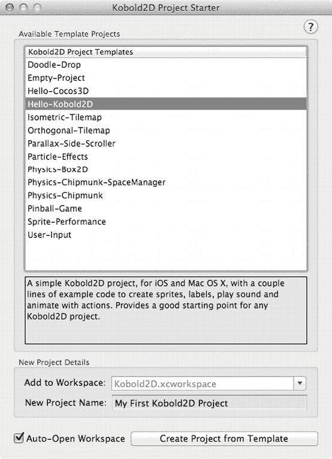
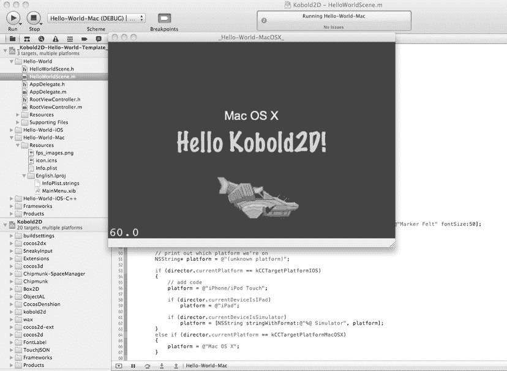
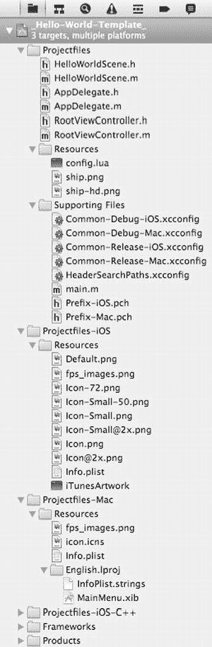

# 排版后的内容

当你读到此处时，我将为你提供可在 `www.koboldscript.com` 获取的 KoboldScript 版本。KoboldScript 是面向 cocos2d 的 Lua 脚本接口，内置状态机与游戏组件。

本章我将介绍使用 Kobold2D 的核心概念，以及它如何改变你基于 cocos2d 开发应用的方式。我将引导你完成 DoodleDrop 项目的 Kobold2D 版本，借此阐明编写一款也能在 Mac OS 计算机上运行的游戏是多么轻松——同时让你初步了解 Kobold2D 用户输入处理机制。

你可以通过 `www.kobold2d.com` 了解更多关于 Kobold2D 的信息并下载它。

## 使用 Kobold2D 的优势

我认为 Kobold2D 是一个游戏开发套件，而非游戏引擎。它更像是一个以 cocos2d-iphone 项目为"内核"的 Linux 发行版，并附加了多个其他模块，安装后即可使用。

沿用这个类比：如果 cocos2d-iphone 是仅带命令行界面的 Linux 内核，那么 Kobold2D 就相当于提供了图形用户界面和基础应用程序，使操作系统更强大、更易用，并对更广泛的用户群体开放。

与此同时，命令行依然存在；它只是成为了更大整体的一部分。

### Kobold2D 即开即用

Kobold2D 的安装方式与常规应用无异。无需在终端应用中运行脚本，也无需执行其他容易出错的操作。下载并运行安装包，按照屏幕提示操作即可完成。整个过程快速且无痛。

安装 Kobold2D 后，你可以立即构建 15 个模板项目中的任意一个；其中大部分项目基于你将在本书中接触到的项目。除了应用启动流程现在已简化为一个配置文件外，你在本书及其他资料中学到的关于 cocos2d 的所有知识仍然适用。

Kobold2D 安装程序还会将各种 API 参考文档添加到 Xcode 组织器窗口的"文档"标签页中。

### Kobold2D 免费开源

Kobold2D 免费且采用 MIT 许可证发布。所有包含的库均使用 MIT 许可证或兼容许可证。

唯一的例外是 iSimulate，它需要付费的 iSimulate 应用才能解锁全部功能。例如，免费的 iSimulate Lite 不支持将多点触控事件转发至 iOS 模拟器。

### Kobold2D 易于升级

开发 Kobold2D 的一大动因是简化并精简现有项目中 cocos2d 的升级流程。使用 cocos2d Xcode 项目模板的弊端在于，每个项目中都包含整份 cocos2d 源代码副本，这使得升级过程异常繁琐且容易出错。

Kobold2D 通过将你的代码与所有库代码分离解决了这个问题。当 Kobold2D 发布新版本，而你希望项目使用更新后的代码时，只需运行新安装版本的 Kobold2D 项目升级工具即可。该工具会扫描之前的 Kobold2D 版本，并允许你通过鼠标点击升级每个独立项目。升级代码时你唯一需要完成的，就是因 API 变更（例如，cocos2d 或其他库中可能被重命名的类，或参数发生变化的库方法）而不可避免的代码维护工作。

### Kobold2D 集成流行库

Kobold2D 的核心价值之一，是让开发者免于向 cocos2d 项目添加第三方库的痛苦。正确配置第三方库通常需要对构建系统有深入理解、具备解读编译器和链接器错误的直觉，甚至可能需要在正确位置进行微小但关键的源代码修改。要让别人的代码在所有平台（iOS（ARMv6 和 ARMv7）、iOS 模拟器、以及 32 位和 64 位变体的 Mac OS X，且所有这些平台都支持或不支持 ARC）上成功编译和链接，可能需要花费数小时甚至数天时间。

这正是 Kobold2D 提供的服务。Kobold2D 2.0 包含以下库。

适用于 iOS 和 Mac OS X 项目的库：

*   Kobold2D（游戏引擎代码，Objective-C）
*   cocos2d-iphone（2D 图形，Objective-C）
*   cocos2d-iphone-extensions（工具代码，Objective-C）
*   Box2D（物理引擎，C++）
*   GBox2D（Box2D 物理引擎，Objective-C）
*   Chipmunk（物理引擎，C）
*   Chipmunk SpaceManager（Chipmunk 物理引擎，Objective-C）
*   CocosDenshion（音频，Objective-C）
*   Lua（脚本）

仅适用于 iOS 项目的库：

*   ObjectAL（音频，Objective-C）
*   SneakyInput（摇杆，Objective-C）
*   iSimulate（iSimulate 应用库）

每当像 cocos2d 这样的核心库更新时，Kobold2D 的新版本也会在数日（甚至数小时）内随之发布。你无需在库方面主动采取行动。

**注意** 你可能会疑惑为什么我没有将 cocos3d 包含在 Kobold2D 2.0 中，尽管它是 Kobold2D 1.x 的一部分。原因是 cocos3d 的目标平台是 OpenGL ES 1.1，因此与 cocos2d 2.0 或任何其他使用 OpenGL ES 2.0 的源代码不兼容。cocos3d 的路线图将 OpenGL ES 2.0 支持列为待定事项，意味着其可用时间未知。一旦它支持，我会将其重新加入。

一些读者可能会疑惑，是否意味着 Kobold2D 应用会因为包含所有这些库而变得臃肿。你可能会惊讶地发现，早期测试表明，即使 Kobold2D 内置了 Lua，Kobold2D 应用实际上比 cocos2d-iphone 应用略小。原因是 Kobold2D 项目的设置允许链接器丢弃应用中未使用的任何代码。这意味着，例如，如果你没有引入任何 Box2D 头文件，那么你的应用就不会链接任何 Box2D 库代码。但如果你确实想开始使用 Box2D，只需将 `Box2D.h` 头文件添加到你的项目中，就可以开始编写支持 Box2D 的物理应用了。

### Kobold2D 重视双平台支持

通过在其项目模板中为每个平台（iOS 和 Mac OS X）默认设置一个目标，Kobold2D 允许你在同一个 Xcode 项目中为两个平台构建并运行代码。

Kobold2D API 同样鼓励为 iOS 和 Mac OS 平台进行开发，它在很大程度上确保了游戏引擎代码能够为两个平台编译。例如，如果你试图在 iOS 上读取鼠标按钮状态，代码仍然可以编译，并返回一个安全的默认值，在这种情况下，该默认值只是报告没有鼠标按钮被按下。

## Kobold2D 工作区

下载并安装 Kobold2D 后，你会在 `∼/Kobold2D` 下带版本号的子文件夹中找到最新版本的 Kobold2D——例如 `∼/Kobold2D/Kobold2D-2.0`。安装程序还会为你打开 `Kobold2D Project Starter.app`，允许你从提供的项目模板之一中启动新的 Kobold2D 项目（参见 图 16-1）。



图 16-1 。Kobold2D 项目启动器工具可让你轻松开始新项目

选择 `Hello-Kobold2D` 模板，在"新项目名称"文本字段中输入任意文本，然后点击"从模板创建项目"。如果你希望将新项目添加到自定义工作区（必要时会自动创建），也可以修改"添加到工作区"文本。默认情况下，Kobold2D 项目会被添加到 `Kobold2D.xcworkspace`。

现在 Xcode 应该会打开包含你新项目的 Kobold2D 工作区，如图 图 16-2 所示。



图 16-2 。Kobold2D Xcode 4 工作区视图，其中 Hello Kobold2D Mac OS X 项目正在运行


**注意** Kobold2D 采用了 Xcode 4 的新工作区概念，允许您在单个工作区窗口中组合多个项目。如果您从最近使用的列表中打开 Kobold2D 项目的 `.xcodeproj` 文件，或在 Finder 中双击它，该项目将无法成功构建。您能轻易发现此问题，因为“项目导航”窗格中将缺少 `Kobold2D-Libraries` 项目。请确保始终打开包含您要处理的 `.xcodeproj` 文件的对应 `.xcodeworkspace` 文件。

## Hello Kobold2D 模板项目

让我们仔细看看 Hello Kobold2D 项目（图 16-2），以演示 Kobold2D 的几个关键概念。

### Hello World 项目文件

在图 16-3 中，您将看到“我的第一个 Kobold2D 项目”中的组和文件，该项目是从 `Hello-Kobold2D` 模板项目创建的。



图 16-3。Kobold2D 项目的默认组结构

与普通 cocos2d 项目相比，最明显的区别在于三个组以 `Projectfiles` 开头，并且多了一个 `BuildSettings` 组。其背后的理念是拥有一个 `Projectfiles` 组和文件夹，其中包含所有平台通用的源代码和资源文件。您的绝大部分源代码和资源都将存放在此文件夹中。额外的 `Projectfiles-iOS` 和 `Projectfiles-Mac` 组应仅包含该特定平台使用的文件。这些组仅作为建议；您当然可以自由地按照自己的意愿来构建项目的组结构。

`BuildSettings` 组包含几个 `.xcconfig` 文件，它们是 Xcode 构建设置的文本格式。通常您无需修改这些文件，但在某些情况下，您可能需要这样做，例如，启用 iSimulate。`.xcconfig` 文件的一大优势在于，您可以为它们编写文档，因此您会看到针对每个构建设置的若干注释，说明其作用、影响以及何时启用或禁用。`.xcconfig` 文件的另一个巨大优势是 Kobold2D 控制着每个项目的默认设置。如果 Xcode 或 cocos2d 的更新需要不同的构建设置，那么这些更改将随 Kobold2D 一起发布，而无需您自行处理。在过去，每当某些构建设置与 cocos2d 不兼容时，都会引发诸多问题。

几乎所有 Kobold2D 项目模板都为 iOS 和 Mac OS X 提供了目标，并分别以 `-iOS` 和 `-Mac` 作为后缀。我希望现成的 Mac 目标能鼓励您和其他开发者从一开始就考虑跨平台开发，并将更多应用发布到 iOS 和 Mac App Store。显然，从一开始就考虑跨平台开发，比在应用完成后再进行移植要容易得多。

## Kobold2D 如何启动应用

Kobold2D 简化了启动过程，特别是减少了项目中所需的自定义代码量（默认情况下为零）。Kobold2D 在后台执行了 `main` 函数、应用代理和根视图控制器所需的所有初始化工作。

此外，Kobold2D 让您可以轻松修改启动设置，例如要显示的第一个场景或图层、设备方向、渲染设置、Mac 窗口大小、Retina 支持等等。所有这些设置都集中在 `config.lua` 脚本文件中。

### Main 和 AppDelegate

`main.m` 文件是每个应用程序的入口点；它包含 `main` 方法。Kobold2D 的实现简单地调用了其内部方法 `KKMain`：

```objectivec
#import "kobold2d.h"

int main(int argc, char *argv[])
{
  return KKMain(argc, argv, NULL);
}
```

`KKMain` 接受 `argc`、`argv` 参数以及第三个可选参数，该参数可用于在需要时向启动过程传递额外的参数。因为这种情况很少需要，所以您可以直接传递 `NULL`。`KKMain` 隐藏了为 iOS 或 Mac OS 平台启动应用的复杂性。它还会初始化 Lua 并解析提供应用配置设置的 `config.lua` 文件。我将在下一节讨论 `config.lua` 文件。

至此，向您展示 Kobold2D 项目的 `AppDelegate` 类（或者更确切地说，它还剩什么）是合理的。以下是其接口：

```objectivec
#import "KKAppDelegate.h"

@interface AppDelegate : KKAppDelegate
{
}
@end
```

什么也没有。应用代理的实现部分会不会有更多内容？

```objectivec
#import "AppDelegate.h"

@implementation AppDelegate
// 当 Cocos2D 完全设置好并且您可以运行第一个场景时调用
-(void) initializationComplete
{
}
@end
```

也没有。我仿佛已经听到您在说：喂，我的应用代理呢？

Kobold2D 为您处理了整个应用的启动过程，并将其隐藏在 `KKAppDelegate` 类中，而 `AppDelegate` 类正是继承自该类。特别是，`KKAppDelegate` 根据 `config.lua` 的设置正确配置 cocos2d，并封装了平台特定的应用代理代码。这使得 Kobold2D 能够集成新版 cocos2d 对应用代理类所做的更改，并将其提供给您的项目使用。

`KKAppDelegate` 类在 iOS 上是常规的 `UIApplicationDelegate`，在 Mac OS 上则是 `NSApplicationDelegate` 类；您可以在需要时自行实现（覆盖）任何应用代理协议方法。但是，您应确保调用所覆盖方法的父类实现，以保证 `KKAppDelegate` 仍能履行其职责。

您可能会觉得有用的唯一自定义方法是 `initializationComplete`，它在应用和 cocos2d 完全初始化之后、但第一个场景即将运行之前被调用。您可以在 `initializationComplete` 内部调用 `CCDirector runWithScene` 方法来运行特定场景。不过，这不是必需的，因为 `config.lua` 文件中有一个设置项 `FirstSceneClassName`，允许您仅指定 cocos2d 应作为其第一个场景运行的类名称，而无需编写任何代码。

本质上，Kobold2D 的 `KKMain` 和 `KKAppDelegate` 类提供了开发者对这些类的常见功能期望。此外，它们为任何 Kobold2D 项目提供了基础代码，使您能够使用 Lua 进行配置文件编写等操作。您需要维护的代码也更少。特别是，如果 iOS、Mac OS 或 cocos2d 对这些类进行了重大更改，Kobold2D 将为您处理这些更改或添加。

### 启动配置文件

Kobold2D 始终加载 Lua 脚本文件 `config.lua`，该文件位于每个 Kobold2D 项目的 `Resources` 组中。

`config.lua` 脚本文件返回一个包含所有游戏设置的 Lua 表。Lua 表是一种灵活的数据结构，它结合了字典（由字符串索引）和数组（由值索引）的特性。您可以创建深度嵌套的 Lua 表——其可能性相当于 XML 文件或属性列表，但语法相对简单易读，并内置了错误报告功能。

Lua 脚本是文本文件，因此自然比属性列表更易于编辑，无论您使用的是属性列表编辑器还是直接编辑属性列表的 XML 文件。而且 Lua 脚本允许您为每行添加注释，以解释您的理由、有效值的范围等等。您无法对属性列表文件进行这样的操作，因为属性列表编辑器不允许您为条目添加注释。


好的，作为高级文档工程师和翻译员，我将严格遵循您提供的注意事项和示例，将给定的英文文本翻译成中文。


**注意** Kobold2D 的 Lua 支持最初由 Corey Johnson 编写的 Wax 库提供。Wax 允许所有 Lua 脚本调用任意 Objective-C 方法并实例化 Objective-C 类，包括 cocos2d 类。然而，Kobold2D 避免了 Wax 脚本，并且最终移除了 Wax 项目的大部分内容。取而代之的是，Kobold2D 仅使用 Lua 来加载诸如 `config.lua` 的设置文件、执行 Lua 脚本以及调用 Lua 函数。这样做速度很快。对于实际的 Lua 游戏脚本编写，附加产品 KoboldScript 目前正在开发中。您可以在 `www.koboldscript.com` 上获取关于 KoboldScript 的更多信息。

`config.lua` 文件包含了几乎您在启动过程中可能想要调整的所有设置。清单 16-1 展示了一个 `config.lua` 文件的示例。

**清单 16-1**。 *Kobold2D 的所有启动设置都包含在 config.lua 脚本中*

```
local config =
{
 KKStartupConfig =
 {
  -- 从以此名称命名的 CCScene 或 CCLayer 派生类加载第一个场景
  FirstSceneClassName = "HelloWorldLayer",

MaxFrameRate = 60,
  DisplayFPS = YES,

EnableUserInteraction = YES,
  EnableMultiTouch = NO,

-- 渲染设置
  DefaultTexturePixelFormat = TexturePixelFormat.RGBA8888,
  GLViewColorFormat = GLViewColorFormat.RGB565,
  GLViewDepthFormat = GLViewDepthFormat.DepthNone,
  GLViewMultiSampling = NO,
  GLViewNumberOfSamples = 0,

Enable2DProjection = NO,
  EnableRetinaDisplaySupport = YES,
  EnableGLViewNodeHitTesting = NO,
  EnableStatusBar = NO,

-- 方向与自动旋转
  -- Kobold2D 使用目标摘要窗格中支持的方向
  -- （与 Info.plist 中的“Supported interface orientations”相同）

-- iAd 设置
  EnableAdBanner = YES,
  LoadOnlyPortraitBanners = YES,
  LoadOnlyLandscapeBanners = NO,
  PlaceBannerOnBottom = NO,
  AdProviders = "iAd, AdMob", -- 逗号分隔的列表
  AdMobRefreshRate = 15,
  AdMobFirstAdDelay = 5,
  AdMobPublisherID = "YOUR_ADMOB_PUBLISHER_ID",
  AdMobTestMode = YES,

-- Mac OS 特定设置
  AutoScale = NO,
  AcceptsMouseMovedEvents = NO,
  WindowFrame = RectMake(1024–640, 768–480, 640, 480),
  },
}

return config
```

这些设置中的大多数应该是不言自明的，并且您可能看起来很熟悉。这些设置在 Kobold2D API 参考指南的 `KKStartupConfig` 类中有文档说明，并且可以在此处找到：`www.kobold2d.com/display/KKDOC/Config.lua`+Settings+Reference。

例如，`FirstSceneClassName` 设置允许您指定一个继承自 `CCScene` 或 `CCLayer`（自动包装在 `CCScene` 内）的类名称，该类将是 `CCDirector` 运行的第一个场景。您可以启用 iAd 或 AdMob 广告横幅，或者为 Mac 版本提供默认的窗口位置和大小。

使用基于 Lua 的配置文件的一大优点是，整个启动代码是 Kobold2D 代码的一部分，如果需要，可以在新版本中进行更新。随着 Kobold2D 的成熟，会根据开发者在他们的应用中需要更改或包含最多的内容，向启动配置中添加更多设置。此外，您可以创建和使用自定义的 `config.lua` 设置。Hello World 项目提供了一个加载自定义设置的示例。我将在下一节中对此进行介绍。

**提示** 您可以从免费的 *Programming in Lua* 一书中了解更多关于 Lua 的知识，该书可在官方 Lua 主页 `www.lua.org/pil` 上在线获取。这本书是针对较旧版本的 Lua，但大部分内容仍然适用。您可能还想浏览 `www.lua.org/manual` 上的 Lua 参考手册，以快速了解该语言。在过去的十年中，Lua 已发展成为游戏开发者的首选脚本语言。它的内存占用非常小，并且速度上通常接近于用 C 语言编程所能达到的性能的 80% 到 90%。

## Hello Kobold2D 场景与图层

让我们继续实际的场景类 `HelloWorldLayer`，它通过 `config.lua` 设置 `FirstSceneClassName = "HelloWorldLayer"` 被设置为第一个场景。您会注意到，这个第一个场景实际上派生自 `CCLayer`。Kobold2D 意识到了这一点，并在幕后自动将 `HelloWorldLayer` 类包装成一个 `CCScene` 实例。

**提示** 为了避免在每个 `CCLayer` 类中编写重复的 `+(id) scene` 方法，您可以简单地调用 Kobold2D 中的 `+(id) nodeWithScene` 方法：

```
[[CCDirector sharedDirector] replaceScene:[MyGameLayer nodeWithScene]];
```

`HelloWorldLayer` 的接口声明非常普通，只提供了三个实例变量，这些变量稍后将从 `config.lua` 文件加载：

```
#import "cocos2d.h"

@interface HelloWorldLayer : CCLayer
{
  NSString* helloWorldString;
  NSString* helloWorldFontName;
  int helloWorldFontSize;
}

@property (nonatomic, copy) NSString* helloWorldString;
@property (nonatomic, copy) NSString* helloWorldFontName;
@property (nonatomic) int helloWorldFontSize;

@end
```

此时，您应该注意 `config.lua` 文件中的一个特定添加项。清单 16-2 中有一个标记为 `HelloWorldSettings` 的额外 Lua 表，它提供了三个看起来很熟悉的设置：`HelloWorldString`、`HelloWorldFontName` 和 `HelloWorldFontSize`。

**清单 16-2**。 *自定义 config.lua 设置*

```
local config =
{
  KKStartupConfig =
  {
  -- 为简洁起见，省略了启动设置
  },

HelloWorldSettings =
  {
  HelloWorldString = "Hello Kobold2D!",
  HelloWorldFontName = "Marker Felt",
  HelloWorldFontSize = 50,
  },
}
```

除了首字母大写之外，这些设置在名称和数据类型上与 `HelloWorldLayer` 类的属性匹配。我相信您能看出这里的联系。确实如此，如清单 16-3 所示，`KKConfig` 类方法 `injectPropertiesFromKeyPath` 从 `HelloWorldSettings` 子表中加载值，并将其注入到目标类（此处为 `self`）的相应命名属性中。

**清单 16-3**。 *将自定义设置注入（分配）到类属性*

```
[KKConfig injectPropertiesFromKeyPath:@"HelloWorldSettings" target:self];
```

我所说的*注入*意思是，如果存在一个名为 `HelloWorldSettings` 的 Lua 表，那么它包含的每个设置都将被分配给目标类的一个相应命名的属性，此处是 `self`。例如，如果设置 `HelloWorldString` 具有正确的数据类型（`NSString*`）且未被设置为 `readonly` 属性，它将被分配给类属性 `helloWorldString`。

**提示** 通过使用 `KKConfig`，您可以轻松地使您的应用程序数据驱动，例如，允许设计师和艺术家调整应用程序的行为而无需修改源代码。当您拥有各种具有相同或相似设置的游戏对象时，数据驱动开发也会大放异彩。您不希望这些设置分散在代码中，而是希望将它们集中在一个文件中，以便提供必要的概览。

注入之后，这三个属性将包含与 `HelloWorldSettings` Lua 表相同的值。它们已准备好被标签使用：

```
CCLabelTTF* label = [CCLabelTTF labelWithString:helloWorldString
                                          fontName:helloWorldFontName
                                          fontSize:helloWorldFontSize];
```

清单 16-4 完整展示了 `HelloWorldLayer` 的实现。除了前面提到的对 `KKConfig` 的调用以及 `CCDirector` 扩展和平台宏的使用之外，它仍然是 100% 的 cocos2d 代码。

**清单 16-4**。 *Hello Kobold2D 实现文件*

```
#import "HelloWorldLayer.h"
```


