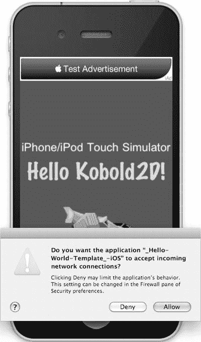

# `@implementation HelloWorldLayer`
`@synthesize helloWorldString`、`helloWorldFontName`；
`@synthesize helloWorldFontSize`；

`-(id) init`
{
  if ((self = [super init]))
  {
  `CCDirector* director = [CCDirector sharedDirector];`

`CCSprite* sprite = [CCSprite spriteWithFile:@"ship.png"]`;
  `sprite.position = director.screenCenter`;
  `[self addChild:sprite];`

// 从 config.lua 文件中获取 hello world 字符串
  `[KKConfig injectPropertiesFromKeyPath:@"HelloWorldSettings" target:self];`

`CCLabelTTF* label = [CCLabelTTF labelWithString:helloWorldString`
  `fontName:helloWorldFontName`
  `fontSize:helloWorldFontSize]`;
  `label.position = director.screenCenter`;
  `label.color = ccGREEN`;
  `[self addChild:label];`

// 打印出当前运行的平台
  `NSString* platform = @"(未知平台)"`;

`if (director.currentPlatformIsIOS)`
  {
  // 添加代码
  `platform = @"iPhone/iPod Touch"`;

`if (director.currentDeviceIsIPad)`
  `platform = @"iPad"`;

`if (director.currentDeviceIsSimulator)`
  `platform = [NSString stringWithFormat:@"%@ 模拟器", platform]`;
  }
  `else if (director.currentPlatformIsMac)`
  {
  `platform = @"Mac OS X"`;
  }

`CCLabelTTF* platformLabel = [CCLabelTTF labelWithString:platform`
  `fontName:@"Arial"`
  `fontSize:24]`;
  `platformLabel.position = director.screenCenter`;
  `platformLabel.color = ccYELLOW`;
  `[self addChild:platformLabel]`;

`glClearColor(0.2f, 0.2f, 0.4f, 1.0f)`;
  }

`return self`;
}

`@end`

请注意我如何使用导演属性（例如 `currentPlatformIsIOS` 和 `currentDeviceIsSimulator`）来判断平台（iOS、Mac OS）和设备类型（iPad、iOS 模拟器）。这些是我之前提到的 `CCDirector` 的一些扩展功能。

您可能会疑惑，为什么我没有使用像 `__IPHONE_OS_VERSION_MAX_ALLOWED` 这样的预处理器宏来判断平台和设备类型。首先，在 Kobold2D 中，我不会使用那些难以记忆且冗长的 SDK 宏。相反，Kobold2D 提供了更简单的宏 `KK_PLATFORM_IOS` 和 `KK_PLATFORM_MAC` 来区分这两个受支持的平台。如果需要，您还可以使用宏 `KK_PLATFORM_IOS_DEVICE` 和 `KK_PLATFORM_IOS_SIMULATOR` 来区分 iOS 设备和 iOS 模拟器。

不使用预处理器宏，并且仅将 `#ifdef` 条件编译作为最后手段的真正原因是：编译器是您的朋友！每次编译代码时，编译器都会告诉您一切是否正常，或者指出代码中存在技术或语法错误。这可能有时令人烦恼，但编译器只是在告诉您犯了错误或遗漏了某些东西。在跨平台开发中，每次构建代码时，让尽可能多的代码被编译器编译是至关重要的，以至于增加平台和设备运行时测试的开销完全可以忽略不计。

一旦您进行跨平台开发，您很可能会花费大量时间只为单个平台编写和编译代码。任何位于另一个平台的 `#ifdef` 块内的代码对编译器都是不可见的，它不会指出其中的错误。然而，一旦您切换目标并编译到另一个平台时，您很可能会遇到之前由于使用 `#ifdef` 而被忽略的错误。这些错误可能与您一小时前、一天前甚至一周前所做的代码更改有关。

这不仅会带来巨大的心智负担去弄清楚是哪个代码更改导致了错误以及正确的修复方法，而且还会令人沮丧，因为您经常会发现切换目标平台会导致构建失败。要么您不得不花费比必要更多的时间定期为两个目标平台构建代码，要么您干脆放弃，也许怀着项目完成后再进行移植的美好愿望。然而，移植一个已完工的项目比从一开始就为两个平台进行开发要费力得多。

能编译通过的代码就是可工作的代码。至少在技术上是正确的。直接的构建错误更有可能被立即纠正，并且也更容易修复，因为您最近所做的代码更改还清晰地留在您的短期记忆中。

## 使用 iSimulate 运行 Hello World

要启用 iSimulate，您需要打开 `BuildSettings-iOS.xcconfig` 文件，该文件位于 Kobold2D 项目的 `BuildSettings` 组中。您唯一需要做的就是取消下面这行的注释：

```
OTHER_LDFLAGS[sdk = iphonesimulator*][arch = *] = $(OTHER_LDFLAGS) $(FORCE_LOAD_ISIMULATE)
```

现在，如果您在 iPhone 或 iPad 模拟器上运行 Hello World 项目，您会注意到图 **16-4** 中显示的一个网络连接对话框，这就是 iSimulate 默认被禁用的原因。一些用户对此抱怨过；也有人困惑为什么 Kobold2D 项目想要接受传入的网络连接。您还会注意到一个 iAd 横幅的出现，因为在 `config.lua` 中启用了它。



图 16-4 。 iSimulate 引起的网络连接警告

**注意** 如果您在日志中看到 `bannerView:didFailToReceiveAdWithError` 错误，并带有消息“操作无法完成。（`ADErrorDomain` 错误 1。）”，那么这很可能是由于该应用未设置 iAd 所致。每个应用和每个开发者都需要在 iTunes Connect 中为 iAd 服务启用。有关如何为您的应用启用 iAd 的更多信息，请访问 `https://itunesconnect.apple.com/docs/iTunesConnect_DeveloperGuide.pdf`。

正如我所说，传入网络连接警告对话框是由 iSimulate 引起的。iSimulate 库需要接受来自 iSimulate 应用的传入连接，您可以在支持 WiFi 的 iOS 设备上运行该应用，以便远程控制模拟器。换句话说，iSimulate 使您能够使用您的设备来测试游戏，但游戏实际上是在模拟器中运行。所有模拟器不具备的功能（例如 GPS、加速度计或多点触控）都可以通过 iSimulate 应用进行模拟。这可以真正节省时间。

例如，如果您在设备上运行 iSimulate 并连接到您的 Mac，即使模拟器没有加速度计，您也会在应用内收到诸如 `accelerometer:didAccelerate:` 之类的消息。考虑到在模拟器中运行应用通常比部署到设备上快得多，这使得 iSimulate 成为一个非常宝贵的工具。我建议您使用 Kobold2D 的“用户输入”模板项目尝试一下。

iSimulate 在 App Store 上有售，通常售价为 15.99 美元：`http://itunes.apple.com/app/isimulate/id306908756`。

## 使用 KKInput 的 Mac 版 DoodleDrop

到目前为止，本书中的所有项目都是为 iOS 编写的。如果您安装了 Kobold2D，您会注意到不仅本书中的大部分项目都包含在 Kobold2D 中，而且几乎所有这些项目都有对应的 Mac OS 版本。

那么，要使像 第 4 章 中的 DoodleDrop 这样的项目同时在 Mac 和 iOS 上运行，需要做些什么呢？实际上并不多。事实证明，到目前为止最大的改变与处理用户输入有关。值得庆幸的是，Kobold2D 提供了一个平台无关的用户输入处理器，它允许您在任何类和方法中随时测试输入设备的状态，从而极大地简化了用户输入。

首先，`accelerometer:didAccelerate` 事件方法已被移除，因为它不再需要。取而代之的是，`KKInput` 将负责为应用提供加速度值。您可以在 DoodleDrop 的 `GameLayer` 类的 `init` 方法中告诉它激活加速度计输入并设置过滤因子：

```
// 是的，我们想要接收加速度计输入事件。
[KKInput sharedInput].accelerometerActive = YES;
[KKInput sharedInput].acceleration.filteringFactor = 0.2f;
```


### 启用加速计

启用加速计将首先测试设备是否支持 `Core Motion` 框架。如果支持，加速度值将由 `Core Motion` 提供，这能带来微小性能提升。在其他情况下，将使用标准的 `UIAccelerometer` 接口来获取加速度值。滤波因子是一个百分比，用于决定游戏角色对加速度突变的响应灵敏度。

代码清单 16-5 展示了修改后的 `DoodleDrop` 更新方法，其中包含两个平台的用户输入处理。

**代码清单 16-5.** *使用 `KKInput` 处理两个平台的用户输入*

```
-(void) update:(ccTime)delta
{
  KKInput* input = [KKInput sharedInput];
  if (isGameOver)
  {
  if (input.anyTouchEnded ||←
  [input isKeyDown:kKKKeyCode_Space] ||←
  [input isKeyDown:kKKKeyCode_Return])
  {
  [self resetGame];
  }
  }
  else
  {
      [self acceleratePlayerWithX:input.acceleration.smoothedX];

if ([input isKeyDown:kKKKeyCode_LeftArrow])
      {
      [self acceleratePlayerWithX:-keyAcceleration];
      }
      else if ([input isKeyDown:kKKKeyCode_RightArrow])
      {
      [self acceleratePlayerWithX:keyAcceleration];
      }

// 更新方法的其余部分保持不变。
      ...
  }
}
```

更新方法的处理分为两部分：处理游戏结束状态，以及游戏进行中的其余代码。如果游戏结束，你只需检查是否有任何触摸结束，或者空格键或回车键是否被按下，然后重置游戏并重新开始。

游戏运行时，玩家速度的更新要么基于 `input.acceleration.smoothedX` 值，要么在按住左或右箭头键时基于恒定值 `keyAcceleration`。`acceleratePlayerWithX` 方法如代码清单 16-6（稍后展示）所示，其中包含了原先位于 `accelerometer:didAccelerate` 方法中的代码。

`KKInput` 通过 `input.acceleration` 属性暴露的 `KKAcceleration` 类的属性，为你提供了内置的高通和低通滤波器。你可以访问原始加速度值、平滑值（低通滤波后）以及瞬时值（高通滤波后）。在大多数游戏中，建议使用平滑值，它能提供稳定的加速度并消除突发的、短促的运动。当你需要响应突然的加速度运动（如摇晃或快速翻转设备）时，瞬时加速度值会非常有用。

你会注意到，输入代码并未使用 `#ifdef` 进行条件编译。如果在 Mac 上运行此代码，`anyTouchEnded` 方法将始终返回 `NO`。同样，在 iOS 上运行时，`isKeyDown` 方法总是返回 `NO`，因为不存在键盘。而在 Mac OS 上，`input.acceleration` 的值均为 0。

如果你觉得在 iOS 上测试键盘事件、在 Mac OS 上测试触摸事件显得有些浪费，请记住，额外开销极小，而始终编译所有代码的好处是能保证其在两个平台上持续工作。如果平台特定代码较多，你始终可以使用 Kobold2D `CCDirector` 的扩展方法（如 `currentPlatformIsIOS` 和 `currentPlatformIsMac`）进行分支处理。

**代码清单 16-6.** *更新玩家速度*

```
-(void) acceleratePlayerWithX:(double)xAcceleration
{
  // 根据当前加速计加速度调整速度
  playerVelocity.x = (playerVelocity.x * deceleration) + ←
  (xAcceleration * sensitivity);

// 我必须限制玩家精灵在两个方向上的最大速度
  if (playerVelocity.x > maxVelocity)
  {
  playerVelocity.x = maxVelocity;
  }
  else if (playerVelocity.x < −maxVelocity)
  {
  playerVelocity.x = −maxVelocity;
  }
}
```

由于没有使用硬编码的位置和偏移量，因此创建 Mac OS 移植版本无需其他任何改动。尽管如此，从玩法角度考虑，在 `config.lua` 中将 Mac 窗口大小限制为 iPhone 大小是合理的：

```
WindowFrame = RectMake(300, 300, 320, 480),
```

Lua 函数 `RectMake` 创建一个矩形，其原点为 (300, 300)，大小为 (320, 480)。`RectMake` 创建的矩形根据平台与 `CGRect` 或 `NSRect` 兼容。其他 Lua 实用函数还包括 `PointMake` 和 `SizeMake`。

## 总结

我希望本章让你对使用 Kobold2D 能更轻松地制作游戏和应用程序、并拥有更多可能性有了良好的印象。在 `www.kobold2d.com` 网站上，你可以访问所有库的 API 文档、编程指南、支持论坛、反馈板块以及路线图，从而了解 Kobold2D 的开发进展。而且你绝对应该关注我在 `www.koboldscript.com` 上关于 KoboldScript 的开发进展。KoboldScript 是 Kobold2D 和 cocos2d 的 Lua 游戏脚本接口。

Kobold2D 最重要的特性之一是能够使用 Lua 表来定义设置。然后，你只需一次调用 `KKConfig` 类，就能将这些设置直接注入类实例的属性中。如果你与需要修改应用设置但不想（或不应）更改源代码的其他人员合作，这一点尤为重要。

如你在本节所见，Kobold2D 还使 iOS 和 Mac OS 的双平台开发变得更加容易，并提供了一个便捷的一站式类来处理用户输入。你还会在 Kobold2D 中找到许多模板项目，这些项目基于本书中创建并随后移植到 Mac OS 的项目。

接下来你需要做的就是访问 `www.kobold2d.com` 下载最新版本，安装它，并开始尝试提供的模板项目。

