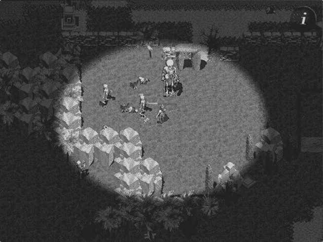
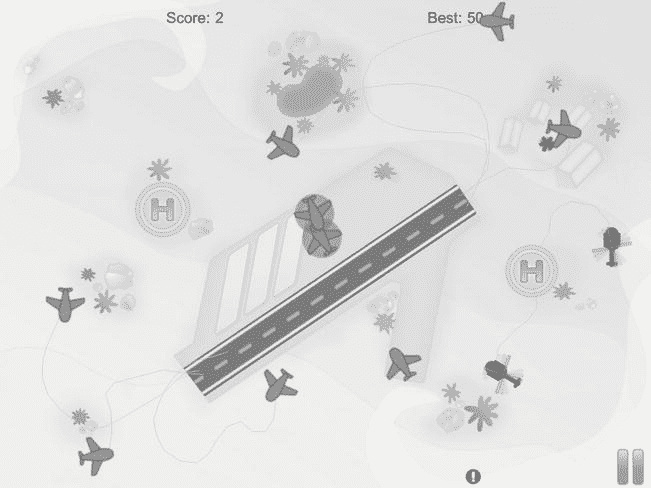
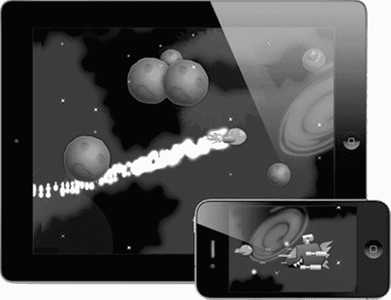
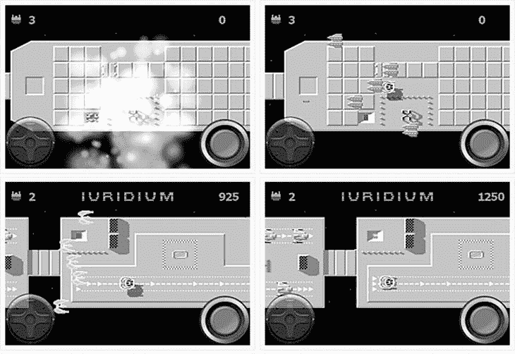
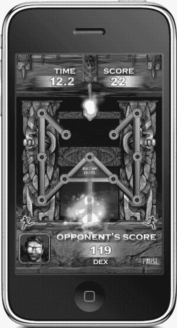
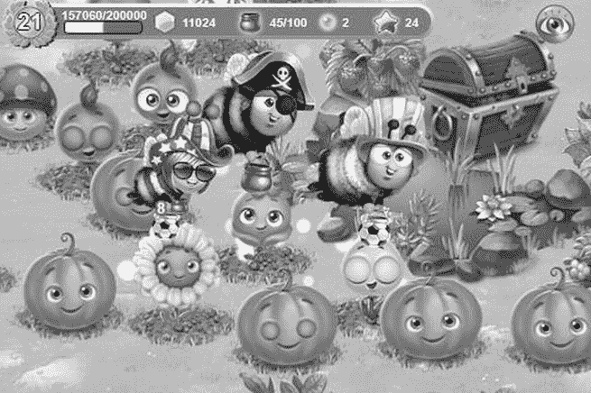
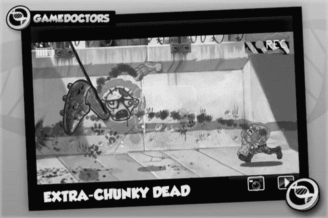
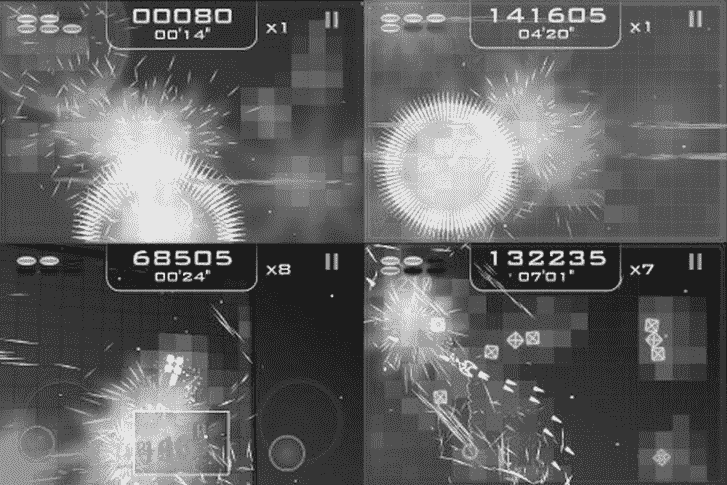

# 以下源代码项目均为商业产品。我不列出价格，因为它们可能随时变动。您也可以在我的附属产品页面浏览这些产品，那里还能找到书中未收录的较新产品：`www.learn-cocos2d.com/store/affiliate-products.`

### Quexlor 动作角色扮演游戏引擎代码与教程

该动作 RPG 引擎原名 iPhone 游戏开发套件。它是首批基于`cocos2d`的源代码游戏套件之一，由 Nathanael M. Weiss 创建。游戏《Quexlor：命运之地》（见图 17-1）是一款暗黑破坏神风格的砍杀类角色扮演游戏，拥有多层的大型瓦片地图世界、多种怪物和丰富道具。该游戏套件附带了 Reiner Prokein 创作的大量免版税图形资源、一本全面的《*打造你自己的 iPhone 游戏*》电子书，以及详细指导如何向 App Store 提交游戏的发布指南。当然，您还会获得精心编写的游戏源代码，但这反而显得次要了。

图 17-1 . 《Quexlor：命运之地》（iPad 版）是一款使用 iPhone 游戏开发套件制作的游戏

您可以在 App Store 上找到 Quexlor 游戏的链接、iPhone 游戏创作入门套件，以及该 RPG 引擎的更多信息，建议访问其网站查看：`www.iphonegamekit.com.`

### 划线游戏入门套件

我的划线游戏入门套件模仿了《飞行控制》和《港湾大师》等成功游戏的设计。如果您想制作划线游戏，该入门套件能帮助您快速掌握划线、沿路径移动物体、碰撞检测以及清晰结构化的代码库，同时包含 iPhone 和 iPad 版本。

每次购买均授予您站点许可证，这意味着您的整个团队都可以使用游戏的源代码和资源。由于这是入门套件，您自然被允许制作该游戏的克隆版本。我还提供 60 天退款保证，并乐于帮助您学习入门套件的源代码，指导您如何扩展它。

**提示** 如果您开始在 Twitter 上关注`@gaminghorror`（也就是我），您将在一天内收到我的私信。我会附上一个秘密优惠券代码，凭此您可享受划线游戏入门套件 30%的折扣！如果您已经关注了我，请告诉朋友关注我以获取优惠券代码。

划线游戏入门套件的产品页面包含功能列表、演示应用链接（见图 17-2）、代码示例以及完整文档：`www.learn-cocos2d.com/store/line-drawing-game-starterkit.`

图 17-2 . 划线游戏入门套件示例游戏（iPad 版）

### 太空游戏入门套件

太空游戏入门套件源自 Ray Wenderlich 的太空游戏教程（`www.raywenderlich.com/3611/how-to-make-a-space-shooter-iphone-game`），现已演变为一款用于制作横版射击游戏（清版射击类型）的商业入门套件。

与 iPhone RPG 游戏套件类似，购买该套件还附赠四篇史诗级教程的额外价值。这些教程详细解释了制作这款特定游戏以及通用游戏制作的诸多细节。出自 Ray Wenderlich 之手，您可以期待高质量的代码和教程。

Ray 的妻子 Vicki 为入门套件提供了美术资源。您可以根据需要自由重用和修改这些美术资源，但需注明来自 Vicki Wenderlich。她在`www.vickiwenderlich.com`运营着一个 iPhone 美术博客。

欲了解更多关于太空游戏入门套件的信息（如图 17-3 所示），请访问 Ray Wenderlich 的商店：`www.raywenderlich.com/store/space-game-starter-kit.`

图 17-3 . Ray 和 Vicki Wenderlich 的太空游戏入门套件

### iUridium 源代码

如果您在 20 世纪 80 年代或 90 年代初拥有 Commodore 64 家用电脑，那么您很可能玩过或至少听过《Uridium》这款游戏。《Uridium》是一款快节奏的太空射击游戏，其独特之处在于：您可以通过流畅动画的殷麦曼翻转来改变飞船的飞行方向，从而在地球敌舰的上下两端往返飞行，完成各种目标。可以说，它是早期开放世界类型游戏的先驱之一。

Nenad Alajbegovic 向 Uridium 致敬，将其移植到了 iPhone 上；iOS 版本恰如其分地命名为 iUridium。您将获得该游戏的完整源代码，它几乎用到了`cocos2d`游戏引擎提供的所有功能，甚至更多。例如，Nenad 实现了子弹和敌人的缓存（对象池）技术以创造流畅的游戏体验。他还集成了`UIKit`视图、Game Center 排行榜、Facebook 和 Twitter 功能。关卡完全以瓦片地图形式创建，并通过 XML 动态加载到游戏的场景和图层节点中。

许可证条款合理，仅要求您不要克隆 iUridium，但明确允许您制作自己的横版射击游戏。不过，您必须将所有美术资源、音乐和音效替换为自有内容。

您可以在以下网站找到关于 iUridium 的所有信息（如图 17-4 所示）：`www.iuridium.com/?page_id=2.`

图 17-4 . iUridium 的游戏源代码可供出售

### BATAK Duel 源代码

Dan Nelson 是 iPhone 游戏《BATAK Duel》的开发者。他此前毫无 iPhone 游戏开发经验，却用五个月时间完成了这款游戏的制作。他成功地将 OpenFeint、菜单系统以及存档功能集成到游戏中。该应用视觉效果丰富，不仅利用了`cocos2d`的粒子系统，还包含了灯光效果、平滑滚动的致谢名单以及透明弹出键盘等额外特效。

许可证条款合理，仅要求您不要使用《BATAK Duel》的任何美术资源、音乐和音效。您可以在以下网站找到关于《BATAK Duel》源代码的更多信息（如图 17-5 所示）：`www.batakduel.com/blog/78.`

图 17-5 . 适用于 iPhone 的《BATAK Duel》源代码正在出售

## Cocos2D 播客

Mohammad Azam 和我正在录制 Cocos2D 播客，旨在报道近期动态、讨论热门话题、采访游戏开发者、工具作者和博主，并为听众提供关于使用`cocos2d`进行游戏开发的内幕信息和深刻见解。

Cocos2D 播客可在 `cocos2dpodcast.wordpress.com` 上收听，新剧集会在 `www.learn-cocos2d.com/blog` 上发布通知。每集时长 30 至 60 分钟。以下是我们已涵盖的部分剧集主题：

*   利用 iAds、应用内购买（IAP）、出售源代码等方式增加额外收入
*   Michael Daley 讲解 Particle Designer 和 Glyph Designer
*   Ray Wenderlich 畅谈 Cocos2d、他的书籍、研讨会等
*   Andreas Löw 介绍 TexturePacker 和 PhysicsEditor
*   Vladu Bogdan 详述 LevelHelper 和 SpriteHelper
*   Zynga 收购 Cocos2d 贡献者
*   Cocos2d iPhone 游戏开发中的工具
*   作为 Cocos2d 替代方案的游戏引擎和框架

## 工具、工具、还是工具

在本书中，我向您介绍了我认为最适合各种用途的工具。然而，通常情况下总有替代方案。如果您也读过本书的第一版，您会发现我在第一版中使用的工具与第二版有所不同。在不到一年的时间里，有些工具加速进步，而另一些则基本停滞不前，落到了后面。

因为这种几乎自然的过程在未来不会改变，并且很难预测哪些工具会在未来几年内持续存在，哪些不会，我想分享一份按字母顺序排列的当前可用工具列表，你可以将它们用于`cocos2d`，而无需对它们进行描述，也无需考虑它们当前的状态，当然，前提是它们至少需要可用且功能正常。

你可以使用以下工具进行`cocos2d`开发。我用粗体标出了个人最爱：

*   位图字体工具
*   `BMFont`（Windows）：`www.angelcode.com/products/bmfont`
*   `Fonteditor`：`http://code.google.com/p/fonteditor`
*   **`Glyph Designer`**：`http://glyphdesigner.71squared.com`
*   `Hiero`：`http://slick.cokeandcode.com/demos/hiero.jnlp`
*   `LabelAtlasCreator`：`www.cocos2d-iphone.org/forum/topic/4357`
*   粒子编辑工具
*   `ParticleCreator`：`www.cocos2d-iphone.org/forum/topic/16363`
*   **`Particle Designer`**：`http://particledesigner.71squared.com`
*   物理编辑工具
*   `Mekanimo`：`www.mekanimo.net`
*   `PhysicsBench`：`www.cocos2d-iphone.org/forum/topic/9064`
*   **`PhysicsEditor`**：`www.physicseditor.de`
*   `VertexHelper`：`www.cocos2d-iphone.org/archives/779`
*   场景编辑工具
*   `CocosBuilder`：`http://cocosbuilder.com`
*   `Cocoshop`：`www.cocos2d-iphone.org/forum/topic/15668`
*   `LevelHelper`：`www.levelhelper.org`
*   纹理图集工具
*   `DarkFunction Editor`：`http://darkfunction.com`
*   `SpriteHelper`：`www.spritehelper.org`
*   **`TexturePacker`**：`www.texturepacker.com`
*   `Zwoptex`：`zwoptexapp.com`
*   瓦片地图编辑工具
*   `iTileMaps`（iPad）：`www.klemix.com/page/iTileMaps.aspx`
*   **`Tiled Map Editor`**：`www.mapeditor.org`

## `Cocos2d` 参考应用

以下是一个使用`cocos2d`制作的游戏和应用列表。它们应作为你使用`cocos2d`能做什么的闪耀范例，以及`cocos2d`开发者的创造力体现。

我决定在我的博客上创建一个帖子，其中包含这里提到的所有游戏的链接，而不是为书中的每个应用提供 iTunes 链接，我会更新这个列表，包括该书出版后发布的有价值的游戏。你可以在“使用`cocos2d`制作的优秀应用”页面上找到这些应用的链接列表，以及其他感兴趣的链接：`www.learn-cocos2d.com/2010/10/great-apps-made-with-cocos2d.`

*   **`The Elements`**（iPad）是元素周期表的图形化表示。其突出特点是大量的照片和流畅的 360 度动画，邀请你探索构成你、我以及宇宙其他部分（不包括虚空，我听说虚空有很多）的元素。它定价很高，但物有所值，如果你需要一个让你炫耀新 iPad 的应用，就是它了！
*   **`Bloomies`** 是一款色彩缤纷的园艺游戏，里面有很多蜜蜂（见图 17-6）。如果这还不能打动你，也许培育和照料自己花园的想法可以。花朵需要你持续的关注，游戏玩法令人上瘾，就像任何电子宠物风格的游戏一样。哦，它恰好是由我以前的两位同事制作的。它只是一款美丽的游戏，他们后续的游戏`Super Blast`也是如此。

图 17-6 .  Phantoom Entertainment 出品的 `Bloomies`

*   **`StickWars`** 是一款游戏，你需要通过将火柴人弹到空中或直接把它们晃到地下来保卫你的城堡，抵御来袭的火柴人。开发者 John Hartzog 之前从未接触过`Objective-C`或移动设备，但他成功了。`StickWars`至今仍保持在游戏排行榜前 100 名内，即使在首次发布一年后仍在持续更新。
*   **`ZombieSmash`** 也是一款城堡防御游戏，不过这次是成群结队的僵尸在进攻，你可以使用炸药、16 吨重物、霰弹枪和其他酷炫的道具来制造一场血腥混乱来击退它们（见图 17-7）。你的城堡就是你的谷仓，如果你能守住它，你将获得一段慢动作动画作为奖励，展示最后一只僵尸失去，嗯，它（的亡命）。这款游戏的突出特点无疑是其布娃娃动画系统，它允许僵尸即使失去了一些肢体，也能走路、爬行或以其他方式尝试移动。

图 17-7 .  GameDoctors 出品的 `Zombie Smash`

*   **`Super Turbo Action Pig`** 复兴了一个简单的横版关卡游戏概念，你的角色总是往下掉，除非你触摸屏幕来启动他的喷气背包。这里特别之处在于游戏的图形制作极其精良，游戏的整体呈现、预告片、网站和幽默感都树立了一个好榜样。
*   还有 **`Farmville`** —— 我还需要解释它是关于什么的吗？它是一款极其成功的 Facebook 游戏，全球有数百万玩家在等距景观中建造他们的农场。这正好说明了当一家像`Zynga`这样的公司用它将其最成功的游戏移植到`iPhone`时，`cocos2d`是多么强大。值得注意的是，在`Farmville`之前，`Zombie Farm`就已经在`iPhone`上推出了，它也是用`cocos2d`创建的。
*   **`Melvin Says There’s Monsters`**（iPad）是一个动画精美的卡通儿童故事，拥有专业质量的配音。故事构思巧妙，并有一个富有洞察力的转折点。即使对成年人来说也是一种享受，并且它非常有效地使用了`cocos2d`的翻页动画。如果你有 iPad 和小孩，这是必备品！
*   **`Trainyard`** 是一款创新的益智游戏，显然是考虑到用户而设计的。它具有色盲模式，经过优化以节省电量，可以像用户离开时那样保存和加载游戏，甚至允许用户使用用`Flash`编写的游戏引擎副本来分享谜题解决方案。除此之外，它确实是一款创新的益智游戏，你需要铺设轨道并组合火车，以匹配带有颜色的火车站。
*   **`Abstract War 2.0`** 是一款双摇杆射击游戏，具有色彩鲜艳、充满活力的几何视觉效果（见图 17-8）。它显然受到了 Xbox Live Arcade 上`Geometry Wars`的启发。这是一款激烈的太空射击游戏，拥有多种游戏模式。你甚至可以通过蓝牙连接进行多人模式游戏，并且它允许你使用自己的 iPod 音乐。

图 17-8 .  Forzefield Studios SL 出品的 `Abstract War 2.0`

*   **`Fuji Leaves`** 是一款有趣的音乐游戏，落下的球击中树叶，根据击中速度和位置，会播放一个声音。当几个球在屏幕上弹跳时，你可以动态地创作乐谱。玩这个游戏，尝试创作有趣的乐谱并找到树叶的合适位置，会让人着迷。不知不觉，一个小时就过去了。

## 游戏制作的生意经

### 与发行商合作及寻找自由职业者

本节涵盖社交游戏、广告和应用内购买——基本上是游戏制作中的商业部分。在本节中，重点不在于技术；我将谈论我作为职业和独立游戏开发者的经验，以及制作成功游戏所需的条件。

至少，本节提供的建议将提高你与合适的人一起制作更成功游戏的几率，并且你将学习如何向目标受众营销你的游戏。

### 与发行商合作

在计算机编程的早期，开发者独自将他们的游戏代码复制到软盘上，并热缩包装后在当地的软件和硬件商店出售。那些日子早已一去不复返，随着游戏复杂性的增加，发行商承担了发行和营销游戏的任务。这种模式在过去大约 20 年里一直是默认模式，但随着近年来独立游戏场景的出现（主要受可下载游戏、`Xbox Live Indie Games` 频道和 `Apple` 的 `App Store` 等新技术的推动），越来越多的游戏开发者再次转向自助出版。那么，如今你为什么还想与发行商合作呢？

首要原因是技术支持和测试。发行商希望确保他们发布的每一款游戏都不会损害自己的声誉，因此他们的目标之一是发布尽可能少 bug 且游戏体验精良的游戏。如果你不习惯这个过程（其中包括质量保证团队的严格审查），你将会感到惊讶，而且这可能并不总是令人愉快的——比如游戏的发布因另一个难以发现的晦涩 bug 而被推迟。那么，这是坏事吗？恰恰相反，它会迫使你在细节上下足功夫，而这些细节往往被业余开发者忽视和轻视。最终，你将获得一款更好的游戏作为回报。在大多数情况下，这也会转化为来自媒体和玩家的更佳评价，从而带来更多销量。

与一家成熟的发行商合作也会给你带来积极的影响，仅仅是因为该发行商已经发布过备受尊敬的游戏。我并不是说这是一种自我满足的方式。你并不会因为与知名发行商 X 合作而变得特殊——但你肯定会学到很多东西，这将使你从人群中脱颖而出。它还能提升你的行业信誉，以及在未来找到更好工作或合同的机会。

与发行商合作的经历不仅仅涉及游戏编程以及你从技术支持和质量保证过程中学到的东西。你还会签署合同，并一窥其中涉及的所有法律术语和文书工作（其实也没那么糟）。

与发行商签署标准合同更像是开银行账户。一切都是现成的，你只需填写几个空白处。预计发行商会拿走 30% 到 70% 的收入。这在很大程度上取决于他们做什么、在开发的哪个阶段介入，以及他们是否为你提供经济支持。

如果你允许自己从与发行商的合作中学习，那么了解为使财务和法律方面的一切井然有序而需要明确的细节，会非常有启发性。如果发行商与其他开发者有良好的合作记录，你可以放心他们不会坑你。但你绝对需要理解你所签署的条款，因为举例来说，如果你习惯于发布你的销售数据，那么这些数据现在可能受到你与发行商签署的保密协议的约束。

你确实需要放弃一定程度的自由，并且你需要能够接受这一点，并相信发行商会为你放弃的那些部分尽最大努力。例如，如果发行商要求你改变游戏的某些方向，你应该认真考虑。至少他们中的大多数人知道自己在说什么，也知道什么行得通、什么行不通（不过并非所有发行商都如此）。然而，由于游戏是一个非常主观的领域，发行商往往倾向于青睐经过验证的功能集，而不是其他有风险但创新的功能——但在 `iOS` 上这种情况较少，发行商更愿意并且能够在游戏设计上给予开发者创作自由，如果不是完全控制权的话。

作为放弃一些自由的回报，他们会通过营销你的游戏来回报你。他们了解渠道，并且与评论网站和媒体有直接联系。这可能是你能够学到很多的另一个专业领域。媒体有他们喜欢接收和消化撰写游戏评论所需信息的特定方式。你的发行商对此了如指掌，并且会向你索要一些你自己不会想到的东西，例如高分辨率的艺术作品或一句真正能吸引玩家对你游戏产生兴趣的单行标语。

如果你有机会与发行商合作，我的建议是无论如何至少尝试一次，无论你多么看重你的创作自由。之后，你将更好地理解你放弃了什么以及得到了什么回报，至少在那种特定情况下是如此。无论你的经历如何，仅凭这段经历和你将学到的东西，就应该值得一试（也许收获足够让你再来一次——但如果没有，你也会知道原因）。

有几家游戏发行商你可能需要考虑联系一下。你最好的选择是那些专门针对 `iOS` 或移动设备进行营销的发行商，在这个领域有两个名字脱颖而出。一个是 `ngmoco`，它发行了《Goldfinger》、《We Rule》、《We Farm》、《Epic Pet Wars》和《Rolando》。访问 `ngmoco` 的网站：`www.ngmoco.com`。另一个是 `Chillingo`，它发布了《Minigore》、《The Quest》、《Knight's Rush》，当然还有《愤怒的小鸟》。`Chillingo` 的网站是 `www.chillingo.com`。

### 寻找自由职业者

如果你相信你的游戏，并且准备投入资金，你可能希望从世界各地的专业自由职业者那里获得帮助。除了在 `cocos2d` 论坛本身寻找工作外，你也可以在更流行的外包网站上发布工作机会。同样，你也可以在这些网站上作为自由职业者向雇主提供你的专业知识。提供此类服务的网站很多；你甚至能找到一些可以让你联系到附近的人的平台。

我将向你推荐那些我知道效果最好且声誉良好的网站：`eLance`（`www.elance.com`）和 `Guru`（`www.guru.com`）。

它们的运作原理相同。你发布一个工作机会，可以是一个小任务或整个项目。然后你会收到候选人的投标，你可以从中选择一个或多个来完成这项工作。一旦你收到、审核并批准了工作成果，你就向自由职业者付款。滥用行为可以被举报，并基本上会封锁违规者离开平台，因此，尽管你需要信任从未合作过的人，双方的风险都极小。我建议从小任务开始。就像你进入股票市场一样，从小处着手，你可以很好地了解这是如何运作的以及可能发生什么。

### 寻找免费的艺术资源和音频

