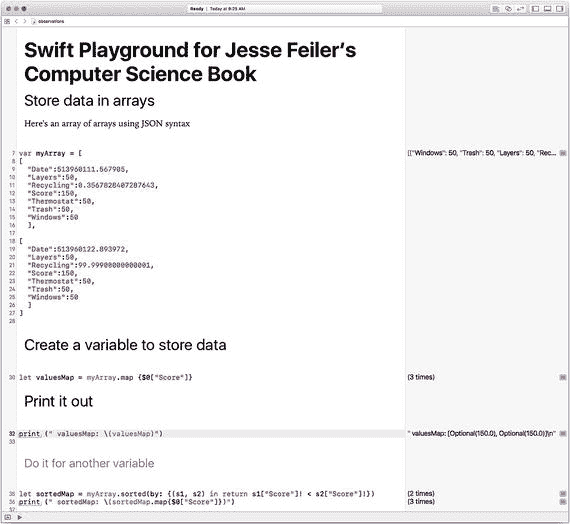
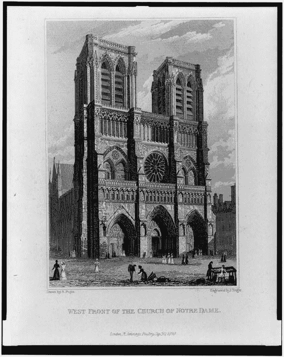

# 1. 计算思维

计算机科学是指开发计算机软件及集成该软件的系统所涉及的基本原理。它是抽象且理论性的，通常认为它超越了特定计算机语言和硬件的语法与结构。

这是本书使用的定义。如果你在网上探索其他书籍和文章（包括各级各类教育中计算机科学课程的描述），你会发现多种其他定义。

本章提供该主题的概述，并聚焦于计算机科学的关键要素。本书提供了一种实践性的计算机科学方法，因此你将看到这些要素如何融入你的工作，而不是探讨计算机科学的理论观点。重点在于你将如何使用计算机科学的概念和原理来构建真实的应用程序。

本书将计算机科学的关键要素分为两组。第一组是开发者日常工作使用的两个概念：

*   识别模式
*   使用抽象

然后，你将看到在软件开发各个方面（从最大的系统到微小系统的最小组件）都会用到的四个任务。这些任务如下：

*   制定计算问题
*   对问题或过程进行建模
*   实践分解
*   验证抽象

在后续章节中，你将看到语法元素和结构的描述，但本章的重点是你在执行超越语法和结构的基本软件开发任务时所使用的概念。

## 当今的计算机科学

计算机科学的原理和技术通过各种编程语言和设备在计算机硬件和软件中得以实现。甚至用户也参与其中，他们学习输入数据、与他人共享数据、将数据从一种格式转换为另一种格式（比如电子表格转电子邮件）以及许多其他展示计算机科学实际应用的任务。

教授和学习计算机科学的一个挑战在于，为了学习原理，你必须拥有足够的计算机硬件和软件知识与经验，才能理解它们如何与计算机科学原理相互作用。

几十年来，这一直是一个巨大的挑战。如果你想像建造师一样学习，可以从建造一个玩具屋或鸟屋开始。你的材料可能包括纸张，以及（如果你想要一个永久性结构）一些胶水甚至订书钉。房屋建造的基本原理可以简单地演示和描述。

计算机科学的挑战在于，构建一个小项目，你可能只需编写一行代码，但为了让它运行并执行某些操作——任何操作——你都需要一台计算机，并且它需要一个操作系统。（从计算机最早的时代起，情况便是如此。）今天的计算机由电子元件组成，即使是最小型计算机的操作系统也极其复杂。要实现一个“简单”的计算机科学应用程序，所需的步骤是巨大的。

## 使用 Swift Playgrounds

如果你拥有 iPad 或 Mac，你就可以使用苹果免费的 `Swift Playgrounds` 工具。结合设备本身，你就拥有了开始构建简单应用程序所需的所有组件，哪怕只使用一行代码。

`Swift Playgrounds` 提供了一个庞大的基础设施，在此之上你可以编写几行代码，开始探索计算机科学以及特定的语言和技术。你可以在 playground 中运行这段代码并观察结果。（如果你想进行实验，还可以在代码运行时修改结果和代码）。

为了自己或他人使用方便，你可以轻松地为代码添加注释。图 1-1 展示了一个带有注释的 playground。它正在运行，你可以在窗口底部看到 `print` 语句的结果。在右侧，你可以看到一个侧边栏，用于监控代码的运行情况。

图 1-1

运行中的 Swift Playgrounds

如果你查看彩色的图 1-1，你可以看到代码语法元素会自动着色，以帮助你理解代码中发生的事情。这种着色和缩进会在你输入时自动进行。

在本书中，你将看到许多通过 `Swift Playgrounds` 演示计算机科学原理的示例。你可以按照引言中的描述下载它们。

关于 `Swift Playgrounds`，一个非常重要的点是：你正在编写的代码是真实的。说它真实，是因为它是用 Swift 编程语言（目前大多数 iOS、tvOS 和 watchOS 应用程序以及许多 macOS 应用程序使用的语言）编写的实际代码。你可以从正在开发的应用程序中复制一些代码，粘贴到 playground 中进行实验。（有关如何操作的详细信息，请参阅第 7 章）。

注意

图 1-1 中展示的 playground 是一个在 playground 中使用生产代码的真实示例。这段代码是一个应用程序的一部分，该应用程序当时未能按预期运行。它被隔离到一个 playground 中，在那里我们可以调整语法，直到它正常工作。完成后，修改后的代码被粘贴回应用程序，现在它已成为 Utility Smart 的一部分，你可以在 App Store 免费下载。如果图 1-1 中的某些代码看起来很复杂，你是对的。正是第 35 行导致了混淆。你将在第 3 章了解 `map` 函数。

## 当今计算机科学的基本概念与实践

这些是开发人员在日常工作中使用的基本概念和实践，无论是设计复杂系统还是编写非常简单的应用程序。它们适用于用于游戏、会计、资产管理（房地产或数字媒体）或人们希望计算机执行的几乎所有其他事务的软件。如果你想了解计算机科学的历史细节以及迈向当今世界的重大步骤，你可以在网上和你当地的图书馆找到大量信息。本节基于实际开发者的工作。

随着你开发应用程序，你可以逐渐学会这些，并且你可以在许多书籍和文章中找到它们。这些概念和实践并非计算机科学所独有：它们是许多设计和开发学科中不可或缺的一部分。（别担心，下一节将专门讨论软件开发）。

这两个概念和实践都源于一个非常基本的事实：编写代码是一个复杂且昂贵的过程。代码不仅需要编写，还需要随时间进行测试和修改。计算机代码可以拥有很长的生命周期。（当 20 世纪 90 年代末解决千年虫问题时，在许多生产系统中发现了 20 世纪 50 年代和 60 年代的代码。这些代码的作者在许多情况下已经退休或去世，可能存在的文档也已丢失。缓解千年虫问题的很大一部分成本源于重写现有代码。）

因为编写代码成本高昂，所以明智的做法是尽量减少需要编写、重写和测试的代码量。这两个概念都有助于最小化需要编写的代码量。总体主题是，为了尽可能快地编写出最佳代码（即编写良好、测试充分、文档完善的代码），遵循一条简单的规则：不要编写代码。如果无法做到，则编写尽可能少的代码。用更传统的方式说，就是尽可能多地使用现有代码。

### 识别模式

如果你能识别出模式，就可能通过发现某种模式并意识到可以直接实现该模式本身，而不必从头为每个具体变体分别实现，从而减少工作量。

模式的一个经典例子如图 1-2 所示，即巴黎圣母院的西立面。你的第一反应可能是个人化的（也许你去过巴黎），也可能是泛泛的感受——比如这座建筑正面有多么美丽。而建筑师、设计师或软件开发者则可能超越个人与泛泛的感受，注意到这个立面由底层三个门廊和顶部两座塔楼构成。

**图 1-2** 巴黎圣母院西立面

巴黎圣母院的西立面呈现出大量略有变化的重复模式。底层三个门廊的整体宽度和高度相似，但仔细观察会发现，它们并非彼此复制。同样，两座塔楼在本质上相同，但也存在差异。建筑正面的几乎每个其他元素都属于某种重复模式的一部分。（最明显的例外是第二层中央巨大的玫瑰花窗：它是独一无二的，而这种独特性正反映了其宗教上的重要性）。

识别模式的重要性在于，一旦你做到这一点，描述或实现某个概念（无论是应用程序还是大教堂）的工作就会变得更容易。你不再需要逐一描述或构建每个细节或组件：你可以描述被复制的模式。

### 使用抽象

通常，就像巴黎圣母院西立面的情况一样，模式会带有变化地重复出现。（门廊的尺寸相同，但雕像的装饰和含义不同）。模式中重复的部分可以被视为一种抽象——即模式的本质。用计算机术语来说，这个抽象就是你需要实现以支持模式多种用途的东西。

例如，如果你需要编写代码来向应用程序用户询问地址，这就可以成为某个模式的一部分，该模式还能让你向用户询问姓名。（术语`design pattern`有时用于描述这种可重用的代码）。

### 结合模式与抽象进行开发

在实践中，开发者通常同时处理模式和抽象，因为它们实际上是同一枚硬币的两面。在设计应用程序（或应用程序的一部分）时，开发者会寻找可以用相同基础代码实现的模式。这减少了需要编写的代码量。

随着设计过程的推进，开发者还会寻找近似模式。如果项目的某些部分可以稍加修改，可能就会形成一种模式。这是一个迭代、富有创造性且需要判断力的过程。通常，过度构建模式可能会让应用程序对用户来说更加复杂。随着项目根据用户和开发者的反馈不断演进，双方（用户和开发者）都可以进行优化，以便在重复模式与为用户定制之间取得良好平衡。

作为这个过程的一部分，你常常需要审视建议的流程，不仅要看是否有可复用的模式，还要看是否能创建一种抽象，使得用户看到极致的定制化（即易用性），而开发者则专注于一个通用的抽象。

你在现代软件开发中会发现的许多编码技术，都能帮助你实现模式和抽象。

## 开发者的基本任务

基于模式和抽象的基本原则，你可以真正开始规划你的项目了。开发者有四项基本任务。一旦你熟悉了这些任务，本书的剩余部分将探讨具体的实现细节。

*   构建计算问题
*   对问题或过程进行建模
*   练习分解
*   验证抽象

### 构建计算问题

第一步是将你的项目构建成一个计算问题。这不仅仅是说“我们来开发一个应用程序”。它意味着不仅要确定你的目标是什么，还要确定为什么该目标适合用计算来解决（即为什么计算机科学能发挥作用）。计算机科学并非万能答案：如果你想粉刷餐厅，它帮不上什么大忙。

在理论计算机科学中，至少存在五种类型的计算问题。在决定某个特定项目是否适合计算机化时，经典计算机科学建议你判断它是否属于以下类别之一：

*   **选择或决策。** 针对特定问题寻找是/否答案。通常，问题会用数字和值来表述（`personX`的年龄是否大于 21 岁？，`valueX`是奇数还是偶数？）
*   **搜索。** 在此类问题中，会对一组数据进行搜索，并返回选择/决策结果为真的值。（在一所学校的所有注册学生中，有多少人有资格在下次选举中投票？）
*   **计数。** 此变体仅询问搜索会返回多少值。请注意，搜索涉及的操作可能比计数更复杂——在这种情况下，你并不关心学生是谁，因此不需要找出姓名或地址。
*   **优化。** 在所有搜索结果中，哪一个是最好的？如果搜索是针对某个特定地址附近的所有合格选民，你可以利用结果进行优化，以找到居住在特定地址附近、在上次选举中投过票并且有车（因此可能愿意提供前往投票站的乘车服务）的选民。
*   **函数。** 实际上，这是一个搜索问题（而搜索问题又建立在选择问题之上）。它进一步通过可优化的结果进行细化，这些结果可以进一步缩小范围。函数问题的一个简化描述是：它返回的答案比“是/否”或一个计数更复杂。（请记住，这是一种简化。）

如果一个问题不属于这五类之一，那么它就不是计算问题。这听起来可能有点奇怪，因为你很难看出像`Pages`、`Excel`甚至`Swift Playgrounds`这样的东西如何能归入此列表。不必担心：一个项目可以分解成多个计算片段。事实上，如果你真想深入研究一个项目，你会发现每一行代码通常都可以被认为是由多个（通常是许多）计算片段组成的。

#### 识别并描述问题

一旦你构思好问题，任务并未结束。在为一个应用构思想法的过程中，仍然有两个非常重要的方面需要考虑。事实上，这些步骤是你从一开始，并在整个开发过程的多个阶段反复进行的步骤。你可能迫不及待想要进入代码和技术层面，但你必须从想法开始：你的项目目的是什么？如果是要构建一个应用，这个应用是做什么的？

或许，描述应用功能的最佳指南可以在 Kickstarter 这类网站或其他帮助人们描述尚未建成项目的资源中找到。你可以回答任意数量的具体问题，但你必须以某种方式明确你的项目或应用将实现什么。

许多开发人员乐于将营销工作交给别人，但你必须能够用清晰且具体的术语描述项目，这不仅仅是为了营销，还有很多其他用途。就应用而言，开发过程中的一个关键步骤是为应用设计图标。图标设计是设计和图形艺术中一个非常特殊的领域。很少有开发人员能制作出最终的图标（很多人会为开发提供粗略的草图）。你很可能需要与平面设计师坐下来讨论图标的外观。这场对话通常从设计师的问题开始：这个应用是做什么的？

**提示**  
应用开发者与设计师之间的对话在开发过程中尤其有用，因为它可以澄清项目。这适用于任何与非开发人员的讨论。向朋友或亲属描述应用会非常有效：他们往往会提出一些基本问题，这有助于你完善设计。

#### 定义项目与目标

有了你想要关注的计算问题以及问题描述，你就可以着手定义项目及目标了。项目的总体目标是精炼作为项目核心的计算问题，并确保你能用合适的术语向任何需要了解它的人（朋友、亲属、同事、投资者、潜在用户等）进行清晰定义。

具体来说，你需要开始思考项目的范围。计算机科学的一部分就是学习如何定义项目，并在必要时将其拆分成组成部分。对于一个具体项目，即便你打算一次性完成，也可能需要考虑如何将其分解成可管理的组件。了解如何在必要时拆分项目，可以作为一个有用的备用方案，以防将来需要如此操作。

#### 什么不是计算问题

你遇到的最常见的非计算性问题往往涉及人和数据。（请注意，这完全是基于个人经验的主观观点，但许多开发人员都认同这一点。）

有时，一个应用被设想得近乎神奇——它能为用户提出的问题提供答案。如果你无法将问题分解成计算组件，你就无法回答这个问题。在思考和讨论问题时，你可能会提出这样一个问题：我们该如何做到这一点？此时你不需要在代码中寻找答案；相反，你需要知道正在讨论的问题该如何解决。如果它涉及一个人的判断，而该判断又无法量化，那么很难看出它如何能被计算处理。如果它涉及引用数据，但数据又不可用，那么你也面临着一个非计算性问题。你或许能将一个判断分解成计算组件，但最终，如果剩下的是无法计算的判断（有些人称之为“直觉”），你就需要计算机科学之外的工具了。

**提示**  
尽管并非所有问题都是计算性的，但你通常可以利用计算模型来处理数字和显示数据，从而留下一个需要判断的核心。用户可以使用你的应用清除所有计算问题，然后对这个非计算性的核心做出自己的判断。

### 建模问题或流程

一旦你能够清晰地阐述问题以及项目所涵盖的问题部分，你就可以开始对问题进行建模了。在这个阶段，你可以使用任何你喜欢的工具——铅笔和纸、智能白板、iPad 或其他任何东西。你可能会画一些框图，这些框图执行你想构建的任务的某些部分。暂时不用担心代码——只考虑某种（无论它最终是什么）东西，例如，计算一个人的电话号码（是的，这是一个计算问题——一个搜索）。

这个模型最终可能成为你应用的结构方式，但在这个阶段，它只是描述你的应用各个部分如何协同工作以构成整个应用。你现在要做的就是确定这组任务或操作（在此上下文中，这两个术语可以互换）是否能产生你需要的结果。一旦你有了一个粗略的模型，试着去打破它。如果电话号码查找失败或返回了错误的号码，会发生什么？其他哪些组件会受到影响？

无需担心高层次模型中的每一个未解决的细节，但许多人会保留一份这些未解决细节和假设的清单。人们很容易开始假设所有问题都会在之后得到处理，而如果没有那份假设清单，你最终可能会得到一个接近完成却缺少关键组件的应用。（任何开发人员都能举出许多这样的例子。）

### 练习分解

一旦你有了概念模型，就该深入剖析它了：将每个组件拆开并检查其组成部分。（这个过程称为分解。）当你将整个项目分解成越来越小的部分时，你通常是在指定那些最终会通过代码实现的组件。

在分解模型的过程中，你可能会开始意识到这个或那个组件是你已经知道如何实现的，或者可以使用已知资源来实现。如果你非常幸运，你这个分解后的项目几乎不需要额外的工作就能实现。

### 重新排列与重组项目模块

但“幸运”并不常发生。在现实世界中，开发人员经常发现，如果他们对模型做一些调整，分解后的模块可能会更容易实现。关于整个设计过程，或许最重要的一点是：在项目真正实现之前，一切都应被视为可更改的。

将项目拆开，然后在重新思考每个组件时再将其重新组合起来。目标是制作一个符合你要求的项目，并逐步将各个组件精炼成可管理且可实现的部分。

到目前为止，还没有谈及任何代码。所有的建模和分解都是理论性的。许多开发者（包括作者）认为，你在假设状态下工作得越久，你的实现就会越健壮。不知为何，转入代码实现有时会干扰设计和规划过程。并非所有人都同意这一点，但许多开发人员确实认同。

### 验证抽象概念

计算机科学最重要的方面之一，在于它为我们提供了一种讨论开发过程以及尚未构建的软件的方法。诸如分解（decomposition）之类的概念，就是在处理尚未构建的软件这一领域时形式化的工作方式。当然，当一个项目真正被实现时，"实践是检验真理的唯一标准"：要么成功，要么失败。

实际上还有第三种可能性：项目描述不够清晰，以至于无法确定某个具体实现是否有效。如果发生这种情况，你可以完善项目定义以包含缺失的信息，或者向项目本身添加更多组件。

你正在处理的是项目及其组件的抽象概念。除了对它们进行分解和重组之外，还要验证这些抽象概念。你可以通过逐步模拟一个组件、一组组件或整个项目模型将要执行的过程来做到这一点。

越是接近最终的项目计划，你的验证就应该越具体、越实际。在初期阶段，使用虚构的场景和数据来测试你的模型及其抽象概念是可以的。随着进程推进，要开始检验你的想法是否能经受住现实的考验。开始将模型组件推向极限。不要只使用常见情况：看看你的模型能否处理极端情况。

如果你与客户或用户合作，不要完全依赖他们。他们会乐于详细说明希望你处理的数据，但请尽量将实际数据掌握在自己手中。你可能需要开始使用电子表格或数据库工具自己进行一些数字运算和数据分析。正如许多开发者和分析师所说："数据不会说谎。"

## 代码来了

如果你已经按照这些步骤深入思考了想要解决的问题以及用来解决问题的项目，那么你应该对未来的工作感到心中有数。重新审视你的问题描述，确保你没有偏离轨道（这种情况确实会发生！）。尝试将你正在构建的模型分解为可实现的组件。检查这个草稿模型的完整性，并尝试用真实数据对其进行验证。

现在，你应该已经有了一个项目计划大纲，其中运用了计算机科学的一些工具和技术，包括建模、分解、抽象和验证。一旦进入实现阶段，你将开始使用不同的工具和技术：

*   用纸笔进行的建模将被使用代码的实现所取代。
*   随着你将已实现的组件组合在一起，分解将被组合所取代。
*   抽象概念会变成使用真实数据的具体实现。
*   验证变成了现实世界的测试。

这些工作从下一章开始。

