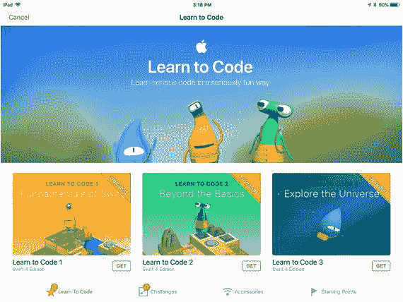
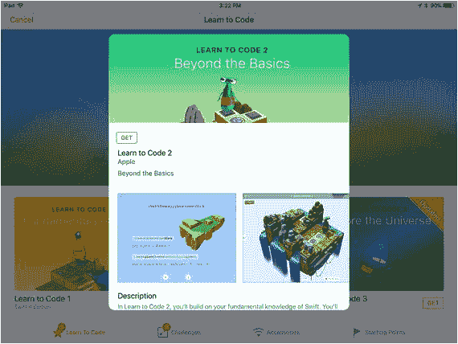
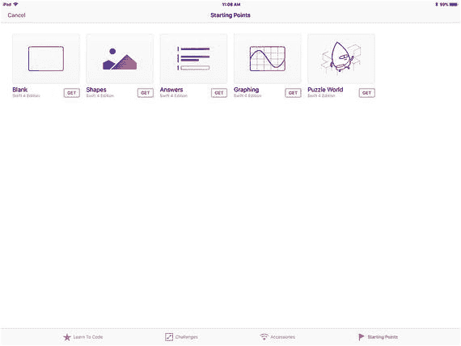
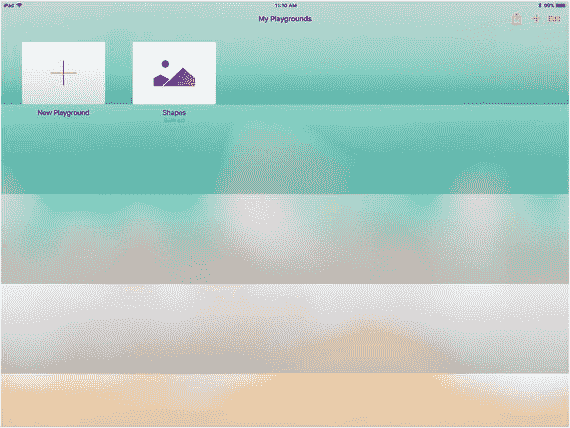
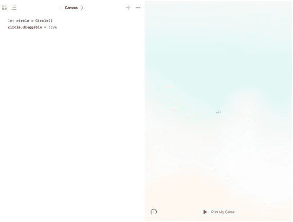
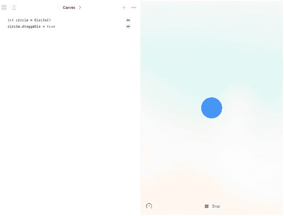
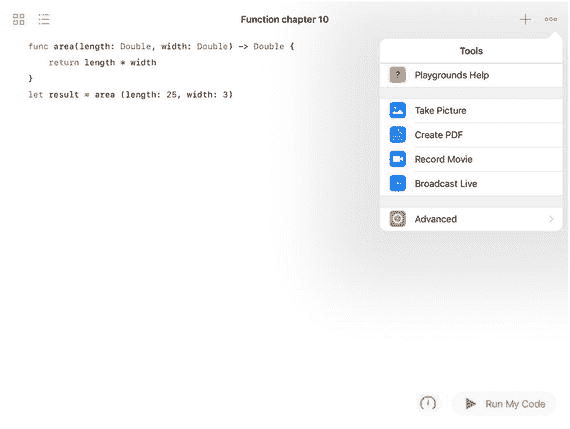
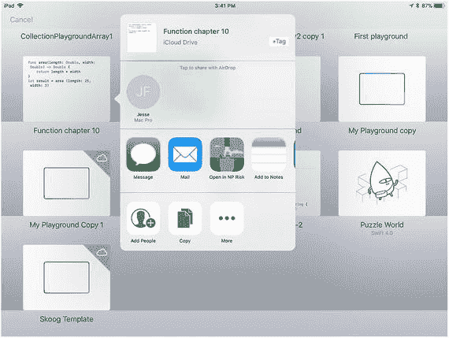
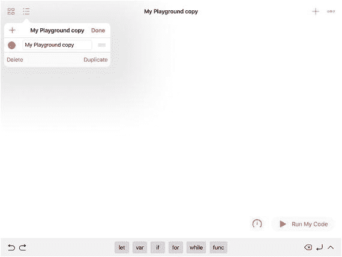

# 2. 编写代码和使用 Swift Playgrounds

在第 1 章"计算思维"中，你了解了计算机科学背后的基本思想以及创建软件所涉及的基本任务——这是一个高层次的视角。本章将跳到另一个极端——编写代码，这是你能达到的最底层、最细节的层面。本书接下来的章节将探讨具体的计算机科学概念和技术——涵盖介于高层和底层视角之间的所有内容。

## 编写代码的基础知识

最简单的计算机代码是 20 世纪 50 年代和 60 年代使用的那种代码。当时的计算机是大型机和小型机（如 PDP 和 VAX 型号）。输入是通过穿孔卡片和磁带进行的。输出包括打印报告以及穿孔卡片和磁带。（这些卡片和磁带可以成为一个程序到另一个程序的输入。）

注意：这只是对代码的一个非常粗略的概述：你会在本书后面找到更详细、更具体的术语。

### 操作和数据

计算机程序的本质就是用某些数据执行一个操作。例如，你可以编写一个程序来打印（操作）某些数据。

#### 创建操作

许多人编写的第一个程序是常见的"Hello World"程序。它由布莱恩·克尼汉和丹尼斯·里奇在《C 程序设计语言》¹一书中发表；早期的版本出现在其他出版物中，但这是它首次在重要出版物中亮相。完整的程序如代码清单 2-1 所示。

```
#include 
main( )
{
printf("hello, world\n");
}
```

代码清单 2-1：Hello World

文本"hello, world"通过`printf`语句打印出来。这个小程序中的其他所有代码都是用来创建和访问使打印成为可能的环境。这个程序极好地说明了教授和学习编程的困难之处：为了做一件事（打印一行文本），你需要一行代码和四行"额外开销"。这正是 Swift Playgrounds（本章后面会介绍）所要解决的问题。使用 playground，这些额外开销被封装在 Swift Playgrounds 本身中，因此你只需编写你关心的那一行代码。

信不信由你，这是一个颇具革命性的特性。（这个想法本身并不革命，因为多年来一直有人试图实现这一点，但 Swift Playgrounds 可能是第一个如此简单易用的编码工具的广泛实现）。

在这一行重要的代码中，你看到了两个基本编码概念之一：一个执行操作的命令。在几乎所有的编程语言中，都有你可以用来指示计算机在 Hello World 中做某事的命令。

#### 使用数据

Hello World 程序打印出了短语"hello, world"（暂时忽略那个多余的`\n`字符）。编程语言和系统允许你存储数据。如果你存储了数据，就可以打印出所存储数据的任何内容。你通常将数据存储在变量中，或存储在外部媒介（即程序外部）中，例如穿孔卡片、磁带、磁盘驱动器或其他存储设备。

来自外部存储的数据可以被导入程序，这样磁盘或穿孔卡片上的数据就会被移动到程序内部的变量中。你也可以设置一个变量来包含特定的数据。不同语言的代码有所不同，但通常会像这样：

```
x = "hello, world"
```

`x` 是一个变量：一个存储位置，你可以将数据放入其中，并从中取回数据。数据是一个带引号的字符串——"hello, world"——字符和引号被当作一个单独的数据片段处理。

这意味着你可以编写这样的代码：

```
printf (x);
```

你可以将这两种技术结合起来：

```
x = "hello, world"
printf (x)
```

代码清单 2-2：构建数据和操作的组合

虽然当你只想打印出那个短语时这看起来有点复杂，但想想如果你想做比打印更复杂的事情会怎样。如果有五个独立的命令要执行，只要你能够以某种方式将这五个独立的命令组合起来，将它们整合在一起，以便你可以将一个变量发送给这组命令，这样效率会很高。然后你可以将另一个变量发送给同一组命令。


## 组合行动与数据

你常常希望将多个行动一同执行。在多种编程语言中，你可以将它们组合成一个行动集合，并像执行单个行动一样执行该集合。术语因语言而异，但行动集合通常被称为`方法`、`函数`、`过程`、`子程序`或`块`。（这些术语的具体含义虽有差异，但均指代行动的集合）。

你也可以创建数据集合。如下例所示，`x` 是一个变量。在最基本的层面上，它是一个可以包含数据的具体存储位置。数据集合则包括数组、集合和字典（还有其他术语）。

行动集合可以包含数据，这些数据可以是单个变量，也可以是数据集合。正如你可以将数据值输入到行动中（例如 `printf("hello, world")`），或像清单 2-2 所示那样使用变量一样，你也可以使用数据集合作为行动的操作对象。

## 代码背后的运行机制

你编写的代码旨在或多或少地便于人类阅读。在后台，还存在另外两种代码。在最基本的层面上，有机器码：这些是由计算机本身（其中央处理单元或 CPU）执行的指令。每种类型的计算机可能都有自己专用的机器码语言。实际上，如今的机器码是针对计算机核心芯片类型而特定的。可能存在多个芯片，但它们通常使用相同的机器码，以便能在任何可用的芯片上随时执行。（参见第 6 章“构建组件”中的“线程”部分）。

通过使用名为`汇编器`的程序，机器语言可以转化为汇编语言。汇编语言（或汇编语言）对人类来说稍微易读一些。这里的关键组件是`汇编器`程序本身，它负责将汇编语言转换为机器码。代码被称为汇编语言或汇编程序（assembler）；而生成它的工具通常被称为`汇编器`。根据上下文，你可以区分出谈论的是工具还是代码。

比汇编语言更易读的是计算机编程语言。20 世纪 50 年代出现的首批语言，如 COBOL 和 FORTRAN，被称为高级编程语言。它们通过名为`编译器`的程序转化为汇编语言。

**提示**  
如需更多信息，请研究格雷斯·霍珀及其同事的成果。

编程语言从简单到复杂的层次结构如下：

- 机器码（最基础）
- 汇编语言
- 高级语言，如 FORTRAN 和 COBOL
- 后来的语言，如 C、Pascal，以及现在的 Swift 和 Python 等，使人类阅读和编写代码变得容易得多。

高级语言理想情况下是机器无关的，这样懂得编写 COBOL、FORTRAN 或 Swift 的人，就能让这些代码在任何计算机上先被编译成汇编语言，再汇编成机器语言。汇编器通常是机器（或芯片）相关的。因此，如果你用高级语言编写程序，它可以被编译成汇编语言，进而转换为机器码。有两点至关重要：

- 尽管高级编程语言是可移植的（指能在多种计算机架构上运行），但将它们转换为汇编语言和机器码的`编译器`是特定于某种计算机或芯片架构的。
- 通常存在交叉编译器，它们能将高级编程语言编译成适用于另一台计算机（而非其自身运行的那台）的汇编语言。

由于汇编语言和机器码是特定于计算机和芯片架构的，更重要的是，如今大多数编程和编码工作都是使用高级语言完成的，因此本书（如同当今大多数计算机科学参考资料一样）除本节这样广泛的概念性概述外，不会深入探讨汇编语言和机器语言。

在当今的编码环境中，编译后的代码通常与图形和其他许多资源相结合。这个过程被称为构建（其结果称为构建产物）。构建过程通常是机器相关的。因此，如果使用 C 等语言，代码是机器无关的，但构建过程意味着它并非可移植的。要编写能在特定计算机上运行的代码，你需要一个编译器或交叉编译器，将代码转换为汇编语言进而转换为机器码；此外，你还需要一个构建程序，为你的目标计算机（动词“target”用于确定你的代码最终将在哪台计算机上运行）构建代码。如果你愿意，一个构建程序甚至可以组合使用多种编程语言编写的多个程序。

## 编译与解释代码

如今的计算机远比编程语言早期（20 世纪 40 年代至 70 年代）的计算机强大得多。因此，机器码、汇编语言以及带有汇编器和编译器的高级语言这一清晰的模式变得更加复杂。在某些情况下，编程语言代码无需编译，而是可以被解释执行：高级语言被处理并转换为可执行代码，其速度之快，几乎与你输入代码的速度同步。

**提示**  
可执行代码是指能够在计算机上实际运行的代码。有时，人们也将可执行代码简称为可执行文件。


## 使用 Swift Playgrounds

Swift playgrounds 让你能以 Swift 语言编写代码，并在输入时立即解释执行。苹果的 Xcode 开发工具（详见第 12 章“初识 Xcode”）整合了相关编译器和构建处理器，让你能够构建应用程序。Playgrounds 则让你能够构建和探索解释型代码。你可以与他人共享 playgrounds，而且当你启动 Swift Playgrounds 时，会看到如图 2-1 所示的多个精选 Playground 作为起点。如果你没有看到这个界面，请寻找右上角的 `+` 来开始浏览 Playground。



图 2-1

探索 Swift Playgrounds

使用底部的标签页来探索内置的 Swift Playgrounds。**起点**是构建你自己 Playground 的良好开端。点击“获取”即可下载图 2-1 中看到的任何 Playground，或者点击“新建 Playground”或 `+` 来开始使用其中一个，如图 2-2 所示。


图 2-2

你可以创建自己的 Playground

你的 Playground 可以简单到只有一两行代码，例如第 1 章中展示的代码。或者，你也可以创建更复杂的 Playground，用于探索语法和测试代码。你还可以构建 Playground 与他人共享，这些 Playground 甚至可以相当复杂。开始使用 Swift Playgrounds 的一种方法是点击某个精选 Playground 进行探索。如果点击某个精选 Playground，你会看到其描述、更多信息以及至关重要的“获取”按钮，供你下载它。图 2-3 显示了“Learn to Code 2”（一个早期 Playground）的获取页面。

> **注：** 目前，许多 Playground 是为教授儿童编程而设计的。如果你探索像 GitHub 这样的共享代码资源，你会发现专业开发者正在使用 Playground 来编写代码片段、进行测试、培训用户，以及教授他人如何编程。



图 2-3

探索“Learn to Code 2”

如果你点击“起点”，则可以查看 Swift Playgrounds 中的选项，如图 2-4 所示（请注意，随着 Swift Playgrounds 功能的增强，“起点”会有所变化）。



图 2-4

起点

点击“获取”下载一个起点，例如“Shapes”。它会下载到你的 Playground 中，如图 2-5 所示。



图 2-5

下载“Shapes”Playground

点击该 Playground 将其打开，如图 2-6 所示。



图 2-6

运行该 Playground，如图 2-7 所示。



图 2-7

Playground 正在运行

蓝色圆圈是可移动的——你可以根据需要点击并拖动它。至此，你已经成功运行了第一个 Playground。你可以随时点击窗口左上角的四个方块图标返回你的 Playground。

你可以通过 `+` 按钮在“我的 Playground”中添加新的 Playground，该按钮位于视图顶部或某个架子上较大的 `+` 按钮处。

当你打开一个 Playground 时，使用其右上角的三个点（省略号）来探索其他工具，如图 2-8 所示。



图 2-8

使用“更多”查看 Playground 的其他位置

在任何 Playground 显示界面中（例如图 2-5 的视图），你可以点击右上角的“共享”按钮开始共享。选择某个 Playground 后，你将能够使用图 2-9 中显示的共享选项。



图 2-9

共享你的 Playground

当不再需要某个 Playground 时，你可以将其从 iPad 上删除。点击左上角的 Playground 列表，如图 2-10 所示，然后点击“编辑”。选择列表中的任意 Playground（可能不止一个），勾选其名称左侧的圆点，然后点击“删除”。



图 2-10

删除 Playground

## 转向编程范式

现在你已经掌握了使用 Swift Playgrounds 进行实验的基本工具。下一章将介绍当今两种最重要的编程范式，并给出每种范式的代码示例。

**脚注**

1. Kernighan, Brian W.; Ritchie, Dennis M. (1978). *The C Programming Language*（第 1 版）. Englewood Cliffs, NJ: Prentice Hall. ISBN 0-13-110163-3.

