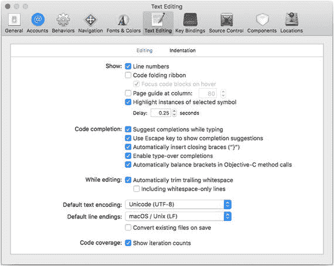
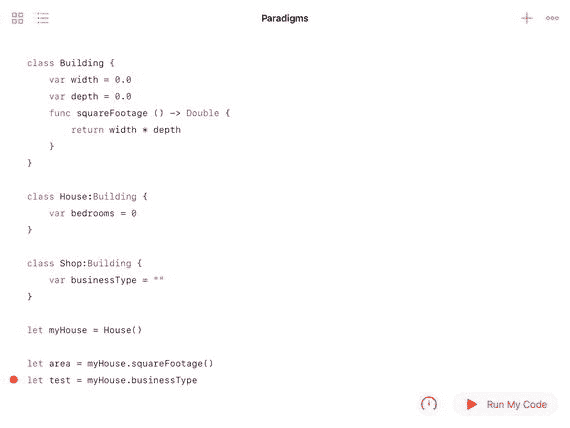
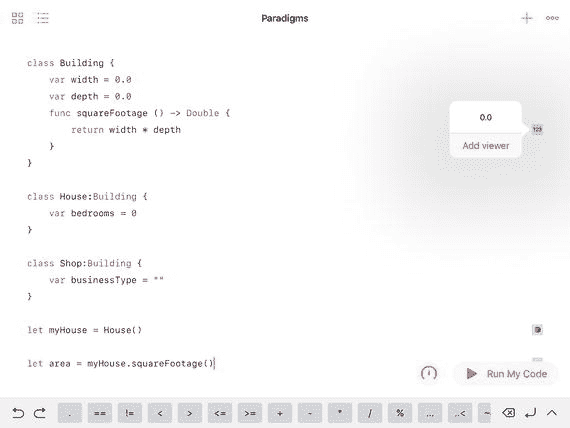
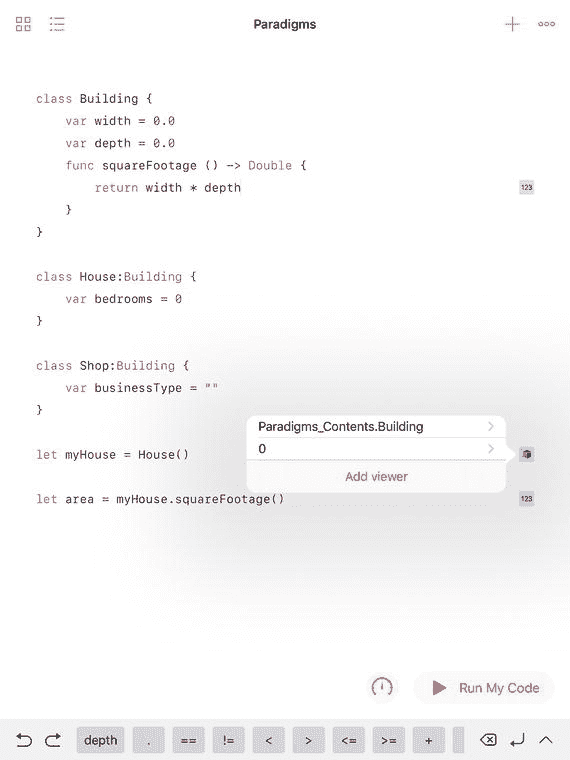
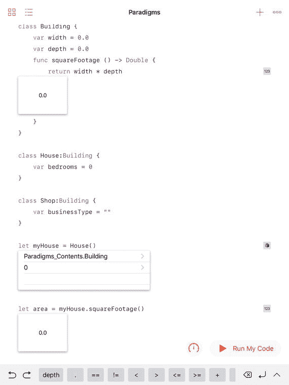

# 探索编程范式

到目前为止，你在这本书中看到的代码片段仅仅是片段。它们展示的是执行单一操作的代码行，例如设置一个变量或打印一个字符串。这就是编程最初的方式：一行接一行的代码。

不久之后，随着编程积压的增多，程序员发现自己迷失在自己和他人多年来编写的一行行代码中，这种逐行编写的代码风格的缺点变得显而易见。在不同地方、以不同方式，开发者们创建了标准、风格和其他组织结构，使得这种逐行编程的风格更容易编写、维护和理解。

本章以非常宏观的视角介绍当今一些最常用的编程范式。这些范式在此分为两组。一类是由编程语言实现的范式（也就是说，如果你使用某种特定语言，其规则会要求你遵循某种范式，即使你并未意识到）。另一类是由特定代码段或甚至整个应用的结构实现的范式。

引入这些范式的原因是，要表明不同语言的一些特定功能和特性，实际上都是常见的范式。换句话说，理解了基本范式，就能更轻松地使用应用了这些范式的语言和代码，因为需要学习的新东西更少了。

> **注：** 此处列出的范式并非详尽无遗。还有其他编写代码的范式和模式，但这些列表是当今最常用的。而且它们都适用于 Swift。


### 结构化编程

从历史来看，第一个主要的编程范式是 20 世纪 50 年代末伴随`ALGOL`语言出现的结构化编程。在编程的最早期，就可以通过`if`语句测试某些条件来中断程序逐行执行的流程。根据测试结果，程序可以跳转到某一行代码或另一行代码。由于代码行有编号，控制流可以根据测试结果转移到第 X 行或第 Y 行。由于行号用于控制程序流程，它们本身就成了代码的重要组成部分，而这开始成为一个问题。最简单的例子是，如果你想在第`22`行和第`23`行之间插入新行，就必须重新编号所有行，这意味着将控制权转移到第`3825`行的语句可能需要重新编号为`3826`。行号是结构化编程解决的首要问题之一。

除此之外，大量`go to`语句（或充当`go to`语句的`if`语句）导致了代码混乱，很快就变得难以理解和维护。这个问题在常见的名称中有所体现：意大利面条式代码。

消除意大利面条式代码和行号的一种方法是将一行或多行代码收集到一个可以通过名称识别的块中。因此，开发者可以不必编写`goto line 43`，而是编写`goto computeBalance`，或者根据语言不同，编写`perform computeBalance`或`call computeBalance`等。这样的代码更易于阅读和维护。

到了 20 世纪 70 年代，结构化编程通常被认为是编写代码的首选方式。然而，过去编写的大量代码至今仍然存在，因此你在阅读代码时遇到`goto`语句也不必惊讶。

行号在某些代码中仍在使用，但如今，行号通常被视为格式而非代码的一部分。当你在 macOS 上使用 Xcode 的 Playground 时，可以在`Xcode ➤ 偏好设置 ➤ 文本编辑`中找到显示或隐藏行号的选项，如图 3-1 所示。



图 3-1

在 Xcode 中设置行号偏好设置

注意

如今行号非常不受欢迎，以致于虽然在 Xcode 中可以显示或隐藏它们，但在 iPad 的 Swift Playgrounds 中却无法显示。同样一个能在 macOS 上显示行号的 Playground，在 iPad 上却不会显示行号。

结构化编程是一种编程风格：你可以在大多数编程语言中编写结构化代码。

### 面向对象编程

与结构化编程类似，面向对象编程也起源于 20 世纪 50 年代末。在`ALGOL`等语言中引入的代码块，本质上被精炼成了小程序。一个程序由指令和数据组成。面向对象编程中的对象基本上是相同的：指令和数据。最大的区别在于这些对象可以存在于应用程序或程序内部。在 OOP（面向对象编程的缩写）中，对象中的指令称为方法，数据则由字段组成。方法本身是结构化的代码块，而这些代码块内部又可以包含各种类型的块。

此外，对象可以继承。它们通常代表现实世界中的概念。例如，你可以创建一个代表建筑物的对象。它可以包含地址以及可能的建筑物尺寸等数据。它还可以包含方法形式的指令，例如用于计算建筑面积的方法。

通常，对象是运行时的构造。描述它的代码（即方法和字段的描述）称为类。类在运行时被实例化为实际的对象，这个运行时对象被称为实例。实例具有内存位置。一个类可以有多个实例。例如，在操作城市数据的应用程序中，可能有成千上万个建筑实例。

类可以相互继承。一个类及其方法和函数可以被继承。子类拥有基类的所有数据和功能，但它可以添加自己的数据和功能。因此，一个建筑类可能有房屋或商店子类。房屋或商店的所有实例都有尺寸（每个实例都有自己的数据值），但房屋子类可能包含表示卧室数量的数据，而商店子类可能包含有关其经营业务类型的数据。你可以编写代码，将建筑或其子类的特定实例作为基类（建筑）或子类来处理。例如，你可以询问建筑或其任何子类实例的建筑面积，但只能询问商店的经营业务类型。

图 3-2 显示了一个 Playground 中`Building`类及其两个子类（`House`和`Shop`）的声明。



图 3-2

声明一个类及其两个子类

你还可以看到使用以下代码行创建`House`类实例的过程：

```
let myHouse = House()
```

你可以使用`myHouse`的`squareFootage`函数来设置一个局部变量（`area`）。但是，如果你尝试使用`Building`的子类`House`的`businessType`函数，就会收到错误，如图 3-2 所示。事实上，在 Playground 中，你很难输入错误的代码。`businessType`是`Shop`的属性，而不是`Building`的。

请记住，当 Playground 运行时，你可以在 Playground 右侧的边栏中看到各代码行的结果。如图 3-3 所示，你可以点击任意结果来查看其值。



图 3-3

使用 Playground 查看器

Playground 右侧的按钮表示你将看到的结果类型。在图 3-4 中，第一个是数值，最后一个也是数值。打开的结果是一个对象。



图 3-4

观察一个对象

如果你决定向 Playground 添加查看器，就可以在不每次点击的情况下跟踪结果，如图 3-5 所示。



图 3-5

打开多个查看器以跟踪 Playground 的执行

这是一个高层次的概述，但在现代计算机科学中非常重要。当今最常用的编程语言都是面向对象的。OOP 是在语言级别强制执行的，而结构化编程则是一种（不理想地）在几乎所有编程语言中均可使用的编写风格。在 OOP 程序中编写非结构化代码很难，但确实可能做到，任何负责修复过此类问题的人都能告诉你这一点。

## 命令式编程（过程式编程）

命令式编程使用语句来描述应用程序或程序应该做什么（本节中“应用程序”和“程序”可互换使用）。至关重要的是，这些语句指定了程序应如何实现所需的结果。

如今的命令式编程通常基于块和过程：命令式语句被分组到这些实体中。然后，语句根据需要调用所需的块或过程来完成程序的目标。


### 声明式编程

与命令式编程相反，声明式编程关注的是结果。作为开发者，你只需指定想要达成的目标，由运行环境（操作系统及其他组件）去实现该结果。某些结构（例如 Swift 中的一些高级函数）就是声明式的。`SQL` 的基本语法也是声明式的。（`SQL` 是目前最常用的数据库语言。）

### 比较命令式编程与声明式编程

如果想找出某城市特定街道上的所有建筑物，你可以采用命令式或声明式两种方式完成。（以下为概述。更多详情请见第 4 章“使用算法”中关于循环和高级函数的描述。）

对于命令式方法，你需要遍历城市中的每栋建筑，检查它是否位于目标街道上，然后将这些建筑存入某个变量或其他存储位置。

对于声明式方法，你只需指定想要某条街道上的所有建筑。操作系统和运行环境会自行完成必要操作——可能涉及某种循环——但你无需参与。你不需要编写那段代码。

### 并发编程

并发编程和线程允许程序同时在多个处理器或芯片上运行。为此，必须对代码的执行方式施加约束，因为可用处理器通常以不同顺序运行。关于并发的更多内容，请参见第 10 章“构建组件”中关于线程的章节。

