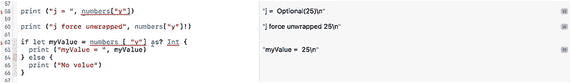
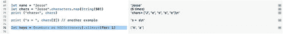
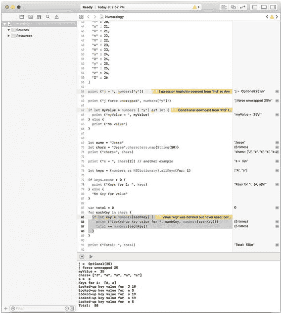
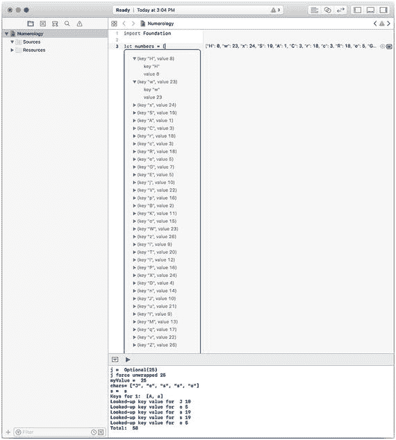

# 4. 使用算法

算法是计算机科学的关键组成部分之一，但其历史可追溯到计算机诞生前很久的时期。在《磨坊主的故事》（1391 年）中，杰弗里·乔叟提到了“算数”石子，这些石子用于计数算法，但该术语和概念甚至比乔叟的时代还要早几个世纪。简单来说，算法就是一系列（通常为数值的）操作，按照特定顺序执行时会产生特定结果。

这些操作序列可以用描述性语言写在纸上，也可以用代码编写。无论采用哪种形式——纸上还是代码中——它们都可以在构建应用程序、程序、模块和其他计算机科学组件时被反复使用。

算法在计算机科学和应用程序中如此普遍，以至于许多人甚至没有注意到它们的存在，但理解它们是什么以及如何使用它们非常重要。这种理解可以帮助你充分发挥特定算法以及基于算法的各种编写和调试代码技术的效用。

算法可以成为应用程序和系统的构建模块。“可以”是因为有些人认为数据结构才是构建模块，而另一些人则会选择其他各种构建模块。实际上，对于大多数应用程序和系统而言，取决于开发者的身份和系统的需求，多种构建模块都会发挥作用。

通常所说的算法，就是本章开头提到的一系列步骤。请注意，在这个宽泛的定义中，并没有规定必须使用特定语言：它只是一系列步骤。在大多数情况下，这些步骤可以用任何语言编码。

## 思考算法的目的

为什么要创建算法？为什么不直接编写代码？核心答案是，一个被清晰描述和定义的算法可以在许多场景中发挥作用。其逻辑和分析可以被重用。

编写代码的成本很高。从设计和分析到编码和测试，过程中的每一步都可能代价昂贵。通常，人们只关注任务中的编码部分。经验丰富的开发者（以及管理者！）可以证明，已经编写但尚未测试的代码并非成品。

第一步——设计和分析——常常被忽视，因为人们专注于编写代码，有时（但基本上）也会进行测试。设计和分析似乎不如代码和测试那样“真实”。然而，最小化编码和测试成本的关键往往就在于设计和分析。许多项目在缺乏清晰定义的情况下就匆忙推进，当缺乏清晰度的问题凸显出来时，项目就陷入了困境。

通过规范化和系统化设计与分析，你可以构建一个稳健的项目。设计和分析的成本可以分摊到多个项目中（无论是通过正式方式还是凭借你自身的知识与经验），但设计和分析必须以严谨的方式进行，以便在当前项目及其他项目中能够被使用和重用。

这就是算法发挥作用的地方。它们让你能够将分析规范化。一旦完成，你就可以将分析结果用于新的或现有的代码，而无需重复进行分析。随着你在软件开发领域积累经验，你会接触到许多算法，并为自己创建许多算法。通过对算法进行严谨的定义，其分析结果更容易被重用。

这就是算法在软件开发中如此重要的原因：它们可以帮助你重用自己（以及他人）的工作成果，这样你就不必每次开始新项目时都从头开始。

## 创建一个数字命理学算法

请记住，算法已经存在了几个世纪，其中许多算法在数字计算机出现之前就已存在。例如，许多著名的算法可以用来寻找素数。本章介绍的示例涉及一个简单的数字命理学问题。数字命理学是一种相信数字与事件或概念之间存在关联的信仰。有些人认为 7 是幸运数字；另一些人则认为 13 不吉利。这些关联背后有原因，但在许多情况下，幸运（好或坏）的概念是在这些原因和解释之前还是之后出现，并不明确。

数字命理学的一个特定应用是将字母表中的字母当作数字，并将它们相加得到一个代表该名字本身的数字。例如，如果你让字母 A 代表 1，B 代表 2，以此类推，那么名字"Dan"的数值如下为 19：

-   D = 4
-   A = 1
-   N = 14
-   总和 = 19

得到的数字本身可能被认为是幸运或不幸的，无论是单独来看，还是取决于其首位或末位数字（且存在多种解释方式）。

-   将字母转换为数字也有多种变体。最常见的一种是让数字从 1 到 10 循环（可能因为这样更便于用手指计算）。在上面给出的例子（`Dan`）中，采用 1 到 10 循环的变体结果如下：
-   D = 4
-   A = 1
-   N = 4（数到 10 后重新从 1 开始）
-   总和 = 9

这里处理的东西绝对是一个算法，尽管有变体。它是一系列步骤：

-   首先以某种方式将字母转换为数字；
-   然后将这些数字相加。

你可以基于数字命理学设计一个应用程序或系统，其中一步是“计算数字命理学数字”，然后该步骤可以通过算法来完成。

## 仔细审视算法

通过这个简单的数字命理学算法，你可以看看它如何融入你可能编写的代码中。计算机科学中有三个基本概念与算法相似，但存在关键差异。这些类算法概念如下：

-   函数
-   对象
-   设计模式

这些概念在实现中常常会用到算法。

### 函数

算法可以用英语等自然语言或数学术语来表达。如果你愿意，可以将其描述为抽象的或概念性的。将它们与函数进行比较，可以让这两个概念都变得更加清晰。

简而言之，函数是算法在特定编程语言中的实现。算法可以帮助你设计一个应用程序或应用程序的一部分，而函数则可以成为其组成部分。


### 对象

面向对象编程通常可追溯至 1967 年的 `Simula` 编程语言。如今，它在多数（即便不是大多数）开发流程中都有应用。简而言之，面向对象编程使用将数据与功能融为一体的对象，这些对象作为独立且功能完备的构建模块，用于构建应用程序。

算法可以为对象、其方法及数据的开发提供指导。通常，算法是开发过程的一部分，正如它们在完整的应用程序中那样。对象很少只由算法的实现构成：这一角色更常由函数来承担。

### 设计模式

设计模式有时会与函数和算法一同被考量。通常来说，术语“设计模式”指的是可用于实现某算法的一种结构。

算法的关键概念之一是其定义的步骤。设计模式是声明式编程的一个特征，在声明式编程中，初始状态和期望的最终状态是声明好的，但具体的步骤并不属于设计模式的一部分。这种与声明式编程相对的编程方式常被称为命令式编程。

### 在 Swift 中实现数字命理学算法

基本的数字命理学算法已在本章前面部分描述过。在本节中，你将看到将其转换为代码的其中一种方法。

**注意**

你会在本书中看到其他几种实现数字命理学算法（及其他算法）的方法。

基本上，该算法有两个步骤：

- 将姓名（或其他字符串）中的每个字母转换为数字。
- 将所有数字相加。

对该算法的讨论已经确定了一些需要在实现中解决的待定问题。这是很常见的：算法指明了要遵循的步骤，但通常不包含代码，并且可能包含对外部问题和事项的引用，这些问题和事项需要在实现该算法时加以解决。

最需要考虑的一点是，将字母转换为数字是基于其在英文字母表中的位置（1 到 26），还是仅使用 1 到 10 的数字（如果你用手指计数，这或许有用）。在第一种方法中，字母 K 对应 11，但在第二种方法中，它对应 1。

为了实现该算法，你需要知道该选择哪一种方法。在实现这个算法以及任何其他算法时，通常的做法是审视这些选择，并尽可能构建一个通用的实现，使其能适用于任何一种选择。算法实现的通用性越强，该实现就越有可能被复用。

该算法的核心必须是字母到数字的转换机制。为了建立该机制，你需要知道使用哪种编号方案（1-26 或 1-10）。此外，一旦你开始思考，你就需要考虑将要转换的字母。软件中的字符可以是大写字母或小写字母。当我们提到字母 J 时，通常既指 J（大写）也指 j（小写）。在将字母转换为数字时，我们需要知道处理的是大写字母还是小写字母。

这些就是你在开始分析算法以便实现它时会遇到的各种问题。请注意，用英语描述的算法并未区分大写和小写字母。这类细节通常在实现阶段才会出现。

**提示**

大写和小写字母是不同的。字符的样式（斜体、粗体、下划线等）应用于字符。应用程序中可使用的字母表中的每个字母和符号都有一个数字值（旧术语中常称为 ASCII 码）。这个数值与数字命理学中的值不同。例如，大写字母 A 通常的数字值是 65，而小写字母 a 是 97。无论字母应用何种样式，这些数字都是相同的。

这些都是为了实现算法而需要解决的通用且抽象的问题。有时，在开始任何实现工作之前，进行此类澄清是可能甚至必要的。在其他情况下（并且对于像本例这样只有几个步骤的简单算法来说，这种情况经常发生），你可以分别实现每个步骤。你最终可能会稍微修改算法的自然语言描述，以明确一个步骤的输出如何被用于后续步骤，这样你就不必担心单独实现每个步骤了。

只要有足够的人力和其它资源，你甚至可以按不同顺序或同时实现这些步骤。


好的，作为高级文档工程师和翻译员，我将严格遵循您提供的注意事项和示例格式，将给定的英文文本翻译成中文。


### 实现数字表

算法中经常会出现将一种数据类型转换为另一种类型的步骤。在这种情况下，需要将字母表中的特定字母转换为代表其在字母表中顺序的数字——可能仅使用数字 1-10。

有两种常见的方法进行此类转换：

*   在某些情况下，存在一种计算方法可以进行转换。
*   在其他情况下，你需要从一个存储的表中查找转换后的值。

这是一个常见的权衡。你是否在需要之前（可能作为应用代码的一部分）就存储转换表，还是即时计算它？权衡在于按需的运行时处理与为数据提供永久性数据存储之间的选择。

在这个场景中，存储方法是最简单的。首先，没有一个明确的计算方法可以用于按需转换。除此之外，需要存储的数据量非常小，即使在最小的设备上存储也不会有困难。

在决定存储数据后，实现的问题在于如何存储？Swift 可以与各种数据库交互，但是，像大多数编程语言一样，它拥有多种用于存储和管理数据的语言元素。这些包括集合、数组和字典，在第 6 章“处理数据：集合”中有更全面的描述。此数字命理数字的实现将作为 Swift 字典（本实现中使用的机制）的入门介绍。

Swift 字典是一种关联数组。数组本身是有序数据的集合，例如班级中每个学生的姓名。集合中的每个项目（学生）都由一个数字标识。这允许你根据需要访问适当的项目。它还可以让你通过引用它们的数字（称为索引号或索引）来遍历所有项目。如果你从数组中删除一个项目，其他项目会向前移动。换句话说，如果你删除项目 8，那么项目 9 就变成了项目 8。对于每个特定的项目，索引号会随时间变化。

关联数组不使用索引号：相反，它使用一个键——通常是字符串——来标识每个项目。因此，如果你使用字符串"eight"来标识关联数组中的一个项目，那么这就是该项目的键，并且将始终是它的键。在数组中，项目可能被编号为 7、8、9，如果你删除项目 8，你将剩下 7 和 8，因为 8 被删除，9 变成了 8。在关联数组中，如果你的键是"seven"、"eight"和"nine"，并且你删除了"eight"，你将剩下"seven"和"nine"。（在其他语言中，关联数组可能被称为哈希、哈希表或映射。）

**提示**

这是一个存储和处理之间的权衡。你会发现一些旧的文档和从业者认为在运行时查找每个键的计算成本会降低应用速度。逻辑上是这样，但以今天的处理器性能来说，这种“延迟”不太可能有影响。为当今的设备编写代码！

Swift 字典由键值对组成。键可以是任何类型，但通常是字符串。值可以是任何遵守 `Hashable` 协议的类型。（这在第 6 章中有描述。）值可以是您选择的任何类型，但字典中所有条目必须使用相同类型。但是，您可以使用诸如 `AnyObject` 这样的类型作为值，这为您提供了很大的自由度。

您可以从为字母表中的每个字母声明一个数字命理数字的变量开始。列表 4-1 展示了可能的样子。在 Swift 中声明字典时，键/值对用冒号分隔显示。整个列表用方括号括起来。（请注意，如您在第 6 章中所见，您可以添加或删除字典条目。）

```
let numbers = [
"a" : 1,
"b" : 2,
"c" : 3,
"d" : 4,
"e" : 5,
"f" : 6,
"g" : 7,
"h" : 8,
"i" : 9,
"j" : 10,
"k" : 11,
"l" : 12,
"m" : 13,
"n" : 14,
"o" : 15,
"p" : 16,
"q" : 17,
"r" : 18,
"s" : 19,
"t" : 20,
"u" : 21,
"v" : 22,
"w" : 23,
"x" : 24,
"y" : 25,
"z" : 26
]
列表 4-1
数字命理字典
```

要访问特定键的值，你可以使用如下代码：

```
numbers["y"]
```

在数组中，每个索引都有一个数据元素（你不能访问超出数组边界的索引，但除此之外可以访问任何元素）。在字典中，当你添加或删除数据时，键不会改变。这意味着键"y"可能没有关联的值。因此，当你在字典中访问一个键时，Swift 会返回一个可能为空的**可选值**。你可以测试它是否为空，或者使用 `?` 或 `!` 对其进行解包。（更多信息请参见第 7 章中的“处理不存在的数据（可选值）”一节。）

字典结构可以帮助你解答大小写字母的问题。尽管键必须是唯一的，但值不必是唯一的。因此，你可以创建一个字典，其键同时包含大写和小写字母，如列表 4-2 所示。

```
let numbers = [
"a" : 1,
"A" : 1,
"b" : 2,
"B" : 2,
"c" : 3,
"C" : 3,
"d" : 4,
"D" : 4,
"e" : 5,
"E" : 5,
"f" : 6,
"F" : 6,
"g" : 7,
"G" : 7,
"h" : 8,
"H" : 8,
"i" : 9,
"I" : 9,
"j" : 10,
"J" : 10,
"k" : 11,
"K" : 11,
"l" : 12,
"L" : 12,
"m" : 13,
"M" : 13,
"n" : 14,
"N" : 14,
"o" : 15,
"O" : 15,
"p" : 16,
"P" : 16,
"q" : 17,
"Q" : 17,
"r" : 18,
"R" : 18,
"s" : 19,
"S" : 19,
"t" : 20,
"T" : 20,
"u" : 21,
"U" : 21,
"v" : 22,
"V" : 22,
"w" : 23,
"W" : 23,
"x" : 24,
"X" : 24,
"y" : 25,
"Y" : 25,
"z" : 26,
"Z" : 26
]
列表 4-2
添加大写字母
```

如果你想解包元素，可以使用如下代码：

```
print ("j force unwrapped: ", numbers["j"]!)
```

如果你想使用更好更安全的方法，请使用条件转换操作符（`as?`），如下所示：

```
if let myValue = numbers ["r"] as? Int {
print ("myValue = ", myValue)
} else {
print ("no value")
}
```

结果如图 4-1 所示。



图 4-1

测试字典

请注意在侧边栏中，Swift playground 区分了可选值、强制解包值和值本身。


### 实现加法运算

加法过程需要两个步骤：

- 将姓名拆分为单个字符。
- 查找每个字符对应的数值。

这两个步骤位于一个循环内——你也可以把循环本身视为一个含有两个子步骤的步骤。

你可以先为姓名设置一个变量，然后将其拆分为单个字符。

如果你打算使用 Swift 的字符串下标语法，代码如下：

```swift
let name = "Jesse"
for character in "name" {
    print character
}
```

你需要将字符转换为对应的数值。虽然字典中的键是唯一的，但值却可以重复。因此，用于将值转换为键的代码是一个可选值（如果键没有对应值，则可能为 `nil`），并且它可能是一个数组（如果同一个值对应多个键）。

查找值对应键的代码如图 4-2 所示。



图 4-2 – 查找值对应的键

如果你想使用 Swift 4 字符串的 `map` 函数，可以利用 Swift 4 字符串是字符集合这一特性，通过闭包来分离每个字符。代码如下：

```swift
let name = "Jesse"
let x = name.map { Character in
    print (Character)
}
```

这段代码仅仅将字符串拆解并重新组合，但它是你下一步所需代码的开端。

现在你已经了解了如何将字符串拆分为字符，接下来可以依次遍历每个字符。清单 4-3 展示了遍历每个字符的代码。

```swift
if keys.count > 0 {
    print ("Keys for 1: ", keys)
} else {
    "No Key for value"
}
```
清单 4-3 – 遍历每个键

注意，谨慎的做法是先确认至少存在一个键可供查找。你可以用这几行代码进行实验，遍历字典中的所有元素。

你应该已经熟悉了字典的操作，现在可以查找每个字母对应的数值并求和。清单 4-4 展示了这个循环，以及用于累加数值的 `total` 变量的初始化。

```swift
var total = 0
for eachKey in chars {
    if let key = numbers[eachKey] {
        print ("Looked-up key value for ", eachKey, numbers[eachKey]!)
        total += numbers[eachKey]!
    }
}
print ("Total: ", total)
```
清单 4-4 – 累加查找到的数值

图 4-3 展示了 playground 及其输出结果（顶部因重复而省略）。



图 4-3 – 在 playground 中运行应用

在继续之前，还有一点需要注意。如果你查看图 4-4 所示的 playground 顶部，会发现字典中的元素是无序的。数组是有序的，但字典不是。



图 4-4 – 字典中的元素

如果你想复现图 4-4 的效果，请重复执行代码。然后点击第一行代码右侧的 `显示结果` 按钮。这时左侧会打开结果视图。向下拖动框架底部以放大结果，从而显示 `let` 语句中你想查看的内容。你可以展开或收起展开三角形来查看数据。

## 总结

本章介绍了算法的基本概念——执行操作的有序步骤。它们可以用英语或数学语言描述，但只有在用特定语言实现时才会真正发挥作用。

