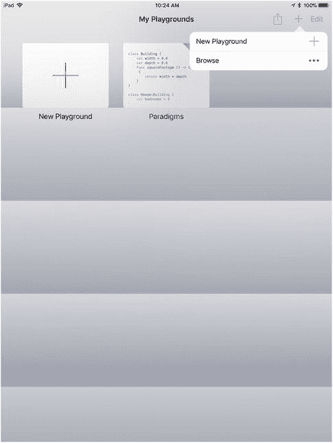
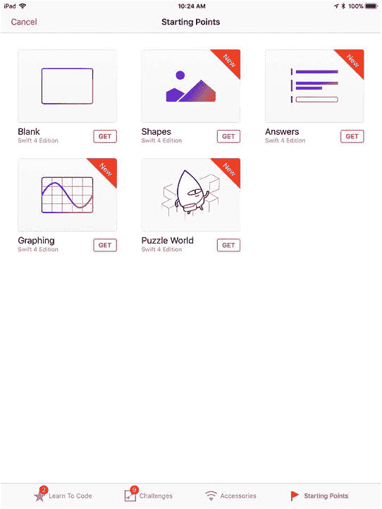
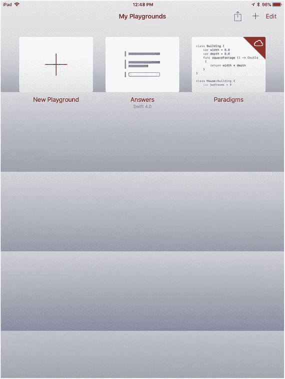
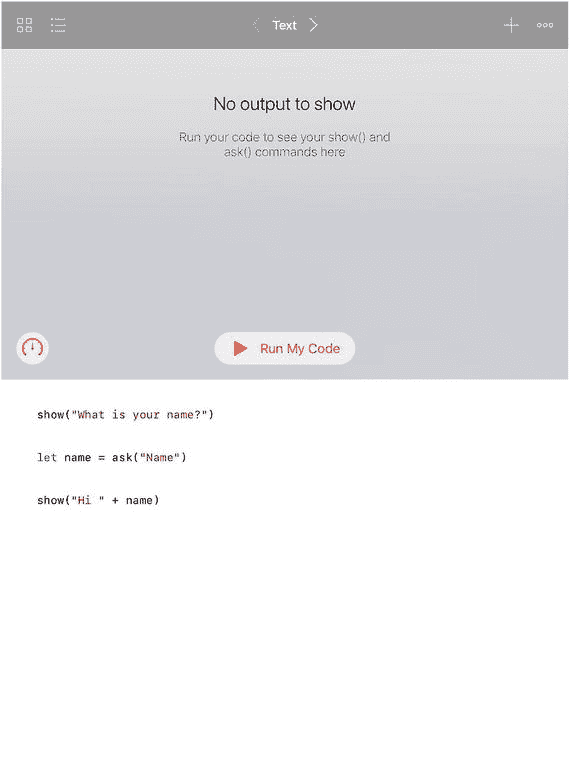
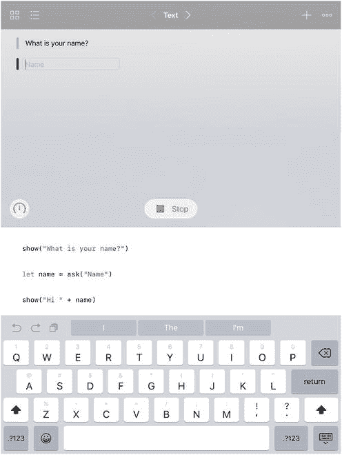
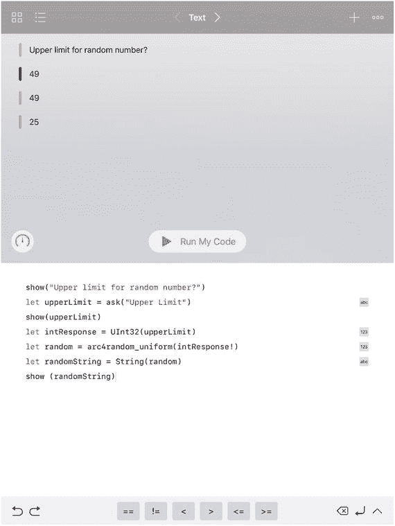
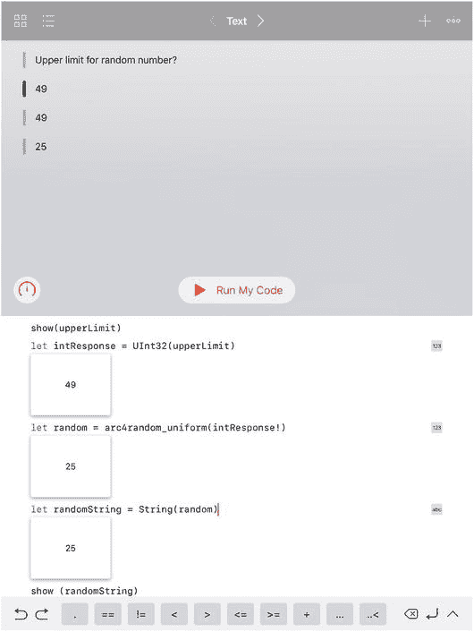
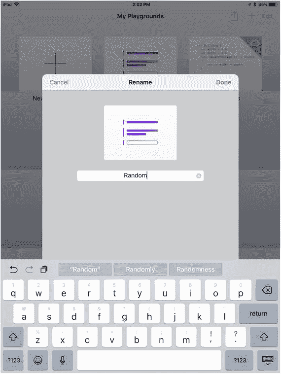
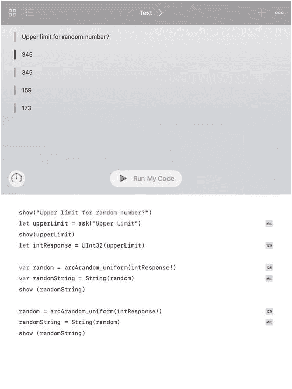
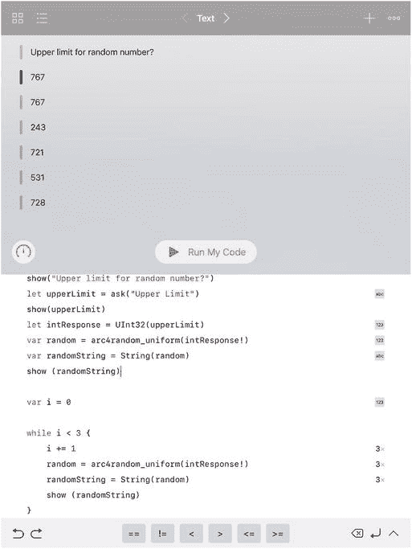

# 5. 管理控制流：重复

算法由解决问题、计算结果或完成应用（或其部分）工作的步骤构成。通常每个步骤依次执行，过程结束时任务即完成。

这种编程方式有一个名称：它被称为过程式或命令式编程（这两个词使用的是其常规含义）。（这种编程方式的术语称为*范式*，因此在许多地方你会看到命令式范式的提法。）

与之相对的范式是声明式或函数式编程。这两种范式经常共存于同一个应用或程序中。两者都源于计算机和计算机编程的早期时代，但大致来说，声明式/函数式编程植根于数学和逻辑，而过程式/命令式编程则是建造第一台计算机的工程师们偏爱的范式。

两种范式都很有用，正因为如此，加上你可能会在同一个项目中同时遇到两者，我们不会在关于哪种更好的争论中偏袒任何一方。本书的宗旨是：两者都是必要且有用的。


## 准备使用随机数进行多步控制流项目

要探索一个多步项目及其控制，你需要有可操作的内容。多步项目最常见的用途之一是管理数据集合，例如数组（关于数组的更多内容请参见第 6 章“结构化数据：Swift 问题”）。

数组就像一个列表——教室里的学生名单、购物清单上的物品、行程中的停靠站——任何列表都可以。最简单的列表是数字列表。数字几乎不携带任何含义，因此你不会因为一个把巴黎排在墨尔本和奥克兰之间的列表而分心。

为了获得一组真正无意义的数字，计算机科学家经常使用随机数。随机数正是如此——随机选取的数字。随机数在许多实际应用中被使用。例如，如果你有一个装满抽奖券的碗，你通常会随机抽取一张来确定抽奖的获胜者。

随机数被用于各种计算机科学流程，从自动选择游戏中的棋子与情境，到统计抽样，以及对药物和治疗方法进行随机测试及其他科学实验。由于随机数的用途如此广泛（包括在本章中演示计算机科学的控制结构），因此了解如何为这些目的创建随机数是很有用的。

首先需要明确的是，真正随机的数字很难生成。在实践中，它们通常通过一系列旨在消除任何模式的计算来生成，因此可以被视为随机数。正因如此，追求精确的人常常使用术语“伪随机数”。就本书（以及许多其他常见用途）而言，伪随机数完全可以满足需要；在本节中，我们在最广义上使用“随机数”这一术语。

Swift 和 Playgrounds 提供了三个内置函数来生成随机数。它们生成的随机数可供你按需使用。你无需查阅随机数列表（尽管这种列表确实存在）。它们会提供一个介于 0 到 1 之间的随机数，或者一个介于 0 到你指定的上限之间的随机数。这些数字会以整数（具体为 `UInt32`）或双精度浮点数（对于 `drand48()`）的形式返回。

生成随机数的三个内置 Swift 函数如下：

- `arc4random_uniform(_:)` 接受一个参数，该参数必须是一个整数。

  随机数将介于 0 和参数值减 1 之间。因此，调用 `arc4random_uniform(10)` 将返回一个 0 到 9 之间的值。

- `drand48()` 返回一个双精度浮点类型的随机数。你无需指定范围：该数字将介于 0 和 1 之间。

- `arc4random()` 不接受参数。生成的数字将介于 0 和 2 的 32 次方减 1 之间。

对于 `drand48()`，你可以将得到的结果乘以任意值，从而获得一个介于 0 和该值之间的随机数。而 `arc4random_uniform(_:)` 只需提供上限，因此无需进行乘法运算。

请注意，当你将数字从一种类型转换为另一种类型（浮点数或双精度浮点数与整数类型之间的相互转换）时，转换过程可能会给结果数字引入一些非随机因素。对于几乎所有常见用途而言，这并无大碍。

如果你希望保持返回数字的随机性，应避免过多的类型转换和操作。尤其是对于浮点数，这些计算可能会向混合结果中引入一些非随机元素。不过，如前所述，在大多数随机数应用中这通常不成问题。

### 创建一个随机数 playground

你可以基于 iOS 附带的 Answers playground 进行构建，以便尝试使用随机数。以下是操作方法。在显示书架的情况下，点击右上角的 +，然后点击“新建 Playground +”按钮，如图 5-1 所示。



图 5-1

复制 Answers playground

点击底部的“起始点”标签，如图 5-2 所示，然后通过点击其“获取”按钮来获取 Answers。



图 5-2

获取 Answers

系统将为你创建一份 Answers 副本，如图 5-3 所示。



图 5-3

Answers 已创建

点击 Answers 将其打开，如图 5-4 所示。



图 5-4

打开 Answers

当你下载一个 playground（或 Xcode 中的模板）时，最稳妥的做法是先检查它能否直接运行。并非所有模板和 playground 都配置为可运行，但确认你有一个可运行的 playground 是个好习惯。点击 playground 的“运行我的代码”按钮。你将看到如图 5-5 所示的结果。



图 5-5

运行 Answers

在 playground 顶部，你可以看到其运行结果——一个提示和一个数据输入字段。其下方是一个“停止”按钮。再往下则是代码本身和键盘。

你现在拥有的 Answers playground 是一个交互式 playground，它会显示一个提示并允许人们输入回应。你可以在此基础上进行扩展了。


#### 编写游乐场代码

你可以在“答案”的现有代码基础上进行构建，要求用户输入一个上限，用于 `arc4random_uniform(_:)` 生成随机数——该函数会返回一个介于 0 与给定上限之间的伪随机数（上限减 1，因此上限不在随机数范围内）。其结果为 `UInt32` 类型。

以下是修改后的代码。

首先，要求用户输入上限：

```
show ("What is your name?")
改为
show ("Upper limit for random number?")
let name = ask ("Name")
改为
let upperLimit = ask ("Upper Limit")
show ("Hi " + name)
改为
show (upperLimit)
```

现在，你拥有一个可运行的游乐场，它会请求随机数上限，然后显示结果。你可以使用 Swift 游乐场来修改代码。随着操作进行，快捷栏和提示会帮助你编写代码。

输入数据是字符串，因此你需要使用以下代码将其转换为整数：

```
let intResponse = UInt32(upperLimit)
```

生成随机数：

```
let random = arc4random_uniform(intResponse!)
```

`random` 是一个整数，因此需要将其转换为字符串以便显示：

```
let randomString = String(random)
```

最后显示结果：

```
show (randomString)
```

图 5-6 展示了正在运行的游乐场。输入的上限为 49，生成的随机数为 25。



*图 5-6 – 开始运行新的游乐场*

在游乐场运行时，你会看到每行执行的代码都有可显示的结果（在游乐场中始终如此）。你可以为其中任意一个显示结果添加查看器，如图 5-7 所示。



*图 5-7 – 显示游乐场运行时的查看器*

请记住，Swift 对类型要求严格，因此你需要将字符串转换为整数，反之亦然——除非明确可行，否则不会自动转换。这有助于保持 Swift 代码的健壮性。除了类型转换，还要注意 `intResponse` 是一个可选类型，需要使用 `!` 进行解包。（在生产代码中，使用 `?` 进行解包会更安全，这样如果出现 `nil` 则会失败，而不是崩溃。在第 7 章的“处理缺失数据”部分，你将了解更多关于可选类型的内容。）

结束本节后，你可以将“答案”游乐场重命名为“Random”。显示游乐场列表，然后长按“Answers”游乐场。你将能够重命名它，如图 5-8 所示。



*图 5-8 – 将游乐场重命名为“Random”*

### 生成多个随机数

请记住，本章中生成随机数的目的是创建一个无意义（随机）的数据集合，以便在探索代码控制管理时进行实验。很容易将“Random”游乐场修改为一次生成多个随机数。只需添加以下几行代码来生成 6 个随机数。

你已经有了生成并显示单个随机数的代码。（如果你需要，这里再次提供。）

```
var random = arc4random_uniform(intResponse!)
var randomString = String(random)
show (randomString)
```

你可以在此代码基础上添加代码来生成另一个随机数：

```
random = arc4random_uniform(intResponse!)
randomString = String(random)
show (randomString)
```

你唯一需要做的修改是，记住原始代码使用 `let` 将变量声明为常量。将声明改为 `var`，以便可以更改它们的值，并在后续调用中省略类型。图 5-9 显示了游乐场现在可以从同一个 `intResponse` 生成两个随机数（159 和 173）。



*图 5-9 – 生成多个随机数*

### 创建重复循环

这种复制粘贴的方法显然不具备良好的可扩展性。编程语言通常实现各种循环来执行重复任务。重复是计算机科学的核心原则。在大多数编程语言（包括 Swift）中，你可以选择多种重复类型。

所有重复结构都有两个主要组成部分：

- 有一段代码需要重复执行。它可以是一行代码、几行代码，或者调用一个或多个函数。
- 有重复的控制机制；基本上，这决定了过程重复的次数。它可以是特定次数，也可以是条件性的，即重复进行直到条件改变。

> **注：**  
> 本章向你展示如何生成多个随机数：这是重复的基本用法。请注意，函数式编程（在第 10 章中介绍）展示了处理重复的另一种方式。

#### 编写要重复的代码

使用这里描述的常见重复结构，你可以设置循环来生成多个随机数。起始代码如列表 5-1 所示。它会请求随机数的上限，将输入（一个字符串）转换为整数（`UInt32`），然后调用随机数生成器（`arc4random_uniform(intResponse!)`）。

代码首次执行后，需要像上一个列表那样生成第二个随机数。要重复多次，你可以复制粘贴那段代码。（请记住，第一次运行时设置了变量，因此你重复的是第二次运行的代码，如图 5-9 所示。）


#### 创建重复控制（限制）

重复机制的另一部分是控制重复的执行逻辑。在 Swift 中，这类循环的逻辑通常使用变量来记录循环执行的次数。

你可以将计数器命名为富有想象力且创意十足的名称，比如 `i`。请务必将其声明为 `var`（变量），因为每次循环时都需要更新它的值。初始值设为 `0`。

```
var i = 0
```

每次执行重复循环时，你都会生成一个新的随机数，并对 `counter` 进行递增。在 Swift 中，最简单的方法是使用复合赋值运算符 `+=`。它会将一个值加到变量上，并将结果重新赋值给该变量。若变量 `x` 的值为 `4`，以下代码会将其更新为 `5`。

```
x += 1
```

这是最常见的用法，但如果变量是 `Double`（双精度浮点数）类型，你也可以使用 `x += 4.2`。

你可以在 `while` 循环中执行此操作，该循环会在条件为 `true` 时持续运行。因此，若要循环执行三次，请将 `x` 设为 `0`，每次进入 `while` 循环时将其加 `1`，并持续直到 `x` 的值不再小于 `3`。

综合以上所有内容，你将得到一个可以运行 3 次的循环，如代码清单 5-1 所示。

```
let prompt = ask("随机数上限")
let intResponse = UInt32(prompt)
var random = arc4random_uniform(intResponse!)
var randomString = String(random)
show (randomString)
var i = 0
while i < 3 {
i += 1
random = arc4random_uniform(intResponse!)
randomString = String(random)
show (randomString)
}
代码清单 5-1
生成 3 个随机数
```

结果如图 5-10 所示。



图 5-10

在循环中生成随机数

由于无需生成打印输出，因此不会浪费纸张资源打印结果。尝试将 `3` 改为 `10000`，以生成 10,000 个随机数字。（注意：将 10000 作为代码输入时请勿使用逗号）。你会看到结果飞速闪过。

为了加快速度，可以不必每次都显示结果。将 `show` 语句注释掉，如下所示：

```
//show (randomString)
```

为了观察 10,000 次迭代循环何时结束，请在循环的花括号外添加一条最终语句，使最后三行代码如下所示：

```
show (randomString) }
show ("完成")
```

运行速度会更快！

这里有一个重要的知识点：当今移动设备处理器的速度和性能远超想象。你可能会在早期计算机科学书籍和文献中找到许多关于“最佳实践”的技巧，其中大量内容旨在节约处理器和存储资源。这些技巧虽然仍有参考价值，但硬件规模已今非昔比，你需要将它们应用于更极端的场景。

## 本章小结

本章向你介绍了重复控制流程的基础知识。你学会了如何在 Swift playground 中设置基本的重复操作，以快速生成 10,000 个随机数。重复控制流程的基本原理同样适用于许多其他类型的处理过程；你将在本书后续章节中反复见到它们。

