# 6. 数据处理：集合

在第 5 章中，你看到了如何使用重复操作来生成数据——如果跟随示例生成 10,000 个随机数，那便是海量数据。你可能会产生疑问：为什么这么做？用重复代码生成的所有数据，又该如何处理？

计算机与计算机科学常常相结合以完成实用功能。仅有数据而无计算，或仅有计算而无数据，通常都难以发挥价值。在本章中，你将学习如何将第 5 章中生成的数据放入可用的集合中。稍后在第 9 章（“数据存储与共享”）中，你还将了解如何让数据比在本章中变得更加实用。

请记住，构成计算机科学支柱的那些结构和原则，旨在让软件的开发与维护变得更加容易。成功的开发者会想方设法将现有的概念和实现融入自己的产品中。这意味着需要编写、调试和维护的代码会更少。因此，不要仅仅将集合视为实现创意的工具。相反，要思考如何调整你的创意，使其充分利用集合及其他概念，从而减少你的工作量。

## 使用数据类型

无论是作为单个元素还是集合，计算机数据都是有类型的。应用使用的每个数据元素都有一个由开发者指定的类型。从编程语言诞生之初，类型便被用来将数字存储的比特位转换为各种数字形式。最简单的转换是将计算机字中的所有比特位，利用其开/关状态生成一个二进制数。根据计算机字中比特位的数量，二进制数的范围可以从 0 到非常大的数值。

在计算机和计算机科学发展的早期，人们很快意识到仅将比特位转换为二进制数远远不够。一种常见的解决方案是，取二进制数高位的一个比特位，并将其保留用于特殊用途：表示负号。这样一来，正数和负数都可以被存储了。

进一步的优化包括，将字中的一组比特位视为两个独立的整数进行存储。这使得浮点数的表示成为可能：其中一个整数表示有效数字（有时称为尾数），另一个整数表示以 10 为底的指数——当指数与有效数相乘时，会产生合适的值。所有这些都通过软件完成——实际的存储单元仍然只是一行比特位。由于一种数字类型到另一种数字类型的转换很容易实现，因此在软件中经常进行此类转换。开发者和用户往往都对此毫无察觉。

关于使用内建类型以及 Swift 创建的类型的具体细节，将在下一章介绍。目前，你只需了解类型是一种构造，它将计算机字中的物理比特位转换为对开发者、用户及普通人具有意义的内容。

### 标量数据

最简单的数据形式是标量或变量——一个单一的数据元素，本质上与简单的代数项类似，如：

`x = 15`

你经常会看到对标量的描述和定义，将其视为单个内存地址中的内容。实际上，大多数情况下数据存储在由比特位组成的字中。硬件在存储和检索这些字的内容时，效率非常高。

当一个计算机字长度为 64 比特时，理论上它可以存储 64 个独立的是/否（布尔）值。硬件和软件允许你将字作为一个单一值（通常是数字）来访问，也可以通过单个比特位来访问。你甚至可以进一步将字中的比特位分组访问，这些分组通常对应着字母。


## 转向收集到的数据

将单个数字存储在一个由简单变量（标量）引用的计算机字中，是跟踪你计算或读入数据的好方法。然后，你可以使用本书其他章节描述的基本运算来操作这些数据，并以其他格式和样式创建新数据。

现代编程语言支持多种数据集合。其中最基础的是数组——一个按编号排列的项目列表（例如，教室里学生的姓名）。另一种常见的集合类型是集合（set）——一种非列表形式的项目集合（“集合”一词采用的是逻辑学和数学中的含义）。Swift 同时实现了数组和集合。

还有另一种集合类型，在 Swift 中称为字典，在 PHP 等语言中称为关联数组。数组中的元素构成一个编号列表，而字典中的元素则由字符串或其他类型来标识。

数组是计算机科学中最古老、最基础的集合。集合次之，而字典（关联数组）则是最新的。本章将按时间顺序逐一探讨这些集合类型。

它们都是 `Collection` 的子类，并且大多使用相同的基本方法，这些方法将在本节中先以数组为例进行介绍。请注意，这些类位于 `Foundation` 中，因此你必须在你的 Swift 代码或 Playground 中使用以下导入语句之一：

```
import Foundation
import UIKit
```

始终建议只导入尽可能少的框架。`UIKit` 会自动导入 `Foundation`，但如果你只需要 `Foundation`，就显式地导入它，而无需担心导入 `UIKit` 中那些你用不到的代码。Xcode 和构建过程会在不需要时将其剥离，但最好一开始就只导入你需要的部分。

## 使用数组

任何编程语言中的数组本质上都是有序列表。一个班级的学生名单本身是无序的，但按字母顺序排列的名单就是有序的。

尽管数组是有序列表，但有时顺序并不重要。例如，一个未排序的学生名单仍然包含了班级中的所有学生。你不必在代码中利用这个顺序。

数组中元素的编号和排序由数组结构本身处理：各个项目的编号并不存在于项目本身中，除非你人为添加。如果你添加了，就可以得到如表 6-1 所示的元素。请注意，在表 6-1 中，索引是整数，内容可以是任何类型。前两个是字符串，最后一个是整数（注意它周围没有引号）。

**表 6-1** 示例数组

| 索引 | 内容 |
| --- | --- |
| 0 | "Content 17" |
| 1 | "Data for item 32" |
| 2 | 2 |

各种形式的数组几乎存在于每一种编程语言和操作系统中。它们使你能够以基本的方式存储和检索数据；此外，它们还能让你轻松地对数组元素重复执行某些过程。

当你深入计算机科学时，你会注意到数组这类概念就是你所使用的基本构建块。与数组一样，你会发现这些构建块的一些基本特性。（就数组而言，其基本特性就是：数组是一个有序的元素列表，索引是数据数组的一部分，而非由数组内的元素提供。）

超越基础的特性已经被开发者和设计者多次实现，他们使用编程语言来扩展基本结构。随着时间的推移，许多这些增强和附加功能已逐渐融入到编程语言和操作系统中。不幸的是，很多人仍然只关注最初的构建块以及个人对其进行的定制化增强。

Swift 本身对基础数组及其功能进行了许多增强。本节将讨论你使用数组时可以做的许多事情——其中大部分功能都直接内置于 Swift 中。

经验丰富的开发者和设计者知道，在 Swift 等语言中使用这些特性是通往成功代码的途径。避免错误的最简单方法就是不自己编写代码，而 Swift 及相关框架中已有的代码已经过编写、测试，并且在某些情况下（包括 Cocoa 和 Cocoa Touch 框架）已经经过了几十年的实际验证。

在本章关于数组的各小节中，将涵盖以下主题：

-   基本术语
-   数组元素的索引
-   Swift 数组与类型
-   声明和创建数组
-   修改 `var` 数组
-   多维数组
-   查找数组元素
-   添加和删除数组元素
-   遍历数组

### 基本术语

以下是在讨论数组时常用的术语。

-   数组的内容称为项（items）或元素（elements）。
-   数组的排序由一个或多个索引（indexes）控制。
-   数组中的项通过下标（subscripts）来书写，下标根据元素在数组中的数值位置来标识该元素或项。
-   在包括 Swift 在内的许多语言中，数组下标写在方括号内，例如 `myArray`[3]，这表示 `myArray` 中的第三项。

### 数组元素的索引

正如你在表 6-1 中看到的，数组负责处理索引，而你可以对数组内容进行任何操作。请注意，默认的索引编号从 0 开始。这是数组最初实现方式的历史遗留问题。在许多情况下，数组的位置就是数组的第一个元素（通常是存储的第一个字），而索引就是距离第一个元素内存位置的偏移量。因此，第一个元素（你可能认为是第 1 个元素）距离第一个元素的偏移量为 0，因为它本身就是第一个元素。

有些语言允许你从非零的数字开始索引数组，但实际上，是语言和操作系统自身执行了转换操作，将基于 0 的索引转换为其他基数。

而且，更有意思的是，如今数组的物理存储可能不是连续的内存位置，但数组仍然从 0 开始，因为历来如此。

数组中没有空隙。因此，如果你查看表 6-1 并删除了索引为 1 的项，数组将变为表 6-2 所示。旧的索引 1 的项消失了，而之前索引为 2 的项变成了索引 1。

> **注意**：请参阅本章后面的“查找数组元素”部分，了解如何按内容而非索引来定位数组元素。

**表 6-2** 删除一行后的示例数组

| 索引 | 内容 |
| --- | --- |
| 0 | "Content 17" |
| 1 | 2 |

### Swift 数组与类型

Swift 中的数组是类型化的。这意味着数组中的元素都具有相同的类型。你可以创建整数数组、字符串数组或任何其他类型的数组。

数组中包含单一类型可以提高代码生成效率，并在运行时带来其他好处。（此外，它还能让你的代码更健壮，因为在数组中不当混合类型会被编译器标记出来，而不是在运行时产生错误。）

当然，数组中只有单一类型在某些方面也可能不方便。Swift 通过其类型层级结构来管理这个问题。正如你将在第 7 章中看到的，Swift 类型包括整数等基本类型，以及特殊的 `Any` 和 `AnyObject` 类型。因此，你可以创建一个 `Any` 类型的数组，其中可以包含整数和字符串。

在 Swift 中，最佳实践是尽可能使用限制性最强的类型。是的，你可以将所有数组都声明为 `Any?`（即任何类型的可选版本），但这会绕过所有内置的类型检查和优化。


### 声明与创建数组

在 Swift 这类语言中，变量在使用前必须先声明。（这与 PHP 等语言不同，在 PHP 中你可以随用随建变量。）

数组与 Swift 中的其他符号并无区别：使用前必须先声明。变量声明包括其名称以及一个修饰符，该修饰符决定变量是可修改的（`var`）还是不可修改的（`let`）。

由于数组是类型化的，通常你会连同其类型一起声明。有两种语法形式可供使用。

第一种方法是直接声明数组类型，如下所示：

```
Array
```

你也可以使用如下语法来声明一个包含名称和类型的数组变量：

```
var intArray:[Int]
```

这是一个普通的声明；冒号后的类型是一个 `Int` 类型的数组。

这仅仅是声明。如果你尝试使用它，将会收到一条错误信息，提示它尚未初始化。请记住，创建和使用变量或常量有两个步骤：声明之后必须进行初始化。

你可以像在 Swift 中初始化类实例或其他元素那样初始化数组。只需在名称后添加 `()` 即可。以下代码将初始化数组：

```
intArray = [Int]()
```

你可以在 Swift Playground 中声明、初始化并打印数组，如图 6-1 所示。

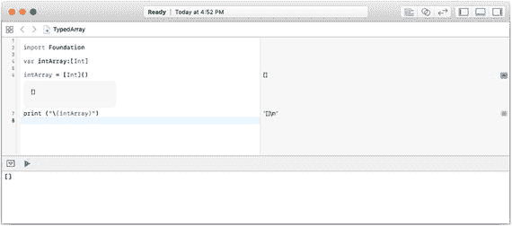

图 6-1

声明并初始化一个数组

数组的元素用方括号括起来。在图 6-1 中，你可以看到该数组为空。它是一对空方括号。加上额外空格后，数组看起来是这样的：

```
[    ]
```

你可以使用以下语法将数组的声明和初始化合并：

```
var intArray2 = [Int]()
```

图 6-2 展示了这一语法在实践中的应用。如你所见，你又创建了一个空数组。（窗口底部的调试区域是查看结果是否相同的最佳位置。）

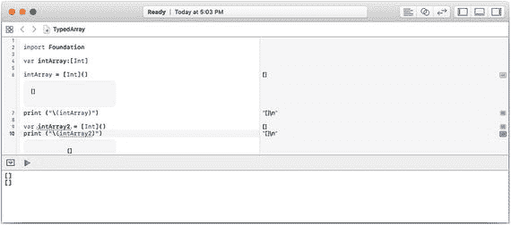

图 6-2

在一行代码中声明并初始化一个数组

这种风格称为初始化器语法。

另一种声明和创建数组的方式是使用数组字面量：即直接使用数组中的字面量元素。在这种风格中，你需要声明数组及其类型：

```
var intArray3 : [Int]
```

然后，要创建数组，只需将元素列在方括号内：

```
var intArray3 : [Int] = [2, 3, 5, 7, 11]
```

你可以在图 6-3 中看到这一点。

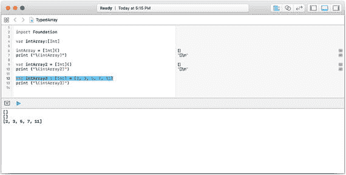

图 6-3

使用字面量声明并初始化一个数组

当你使用字面量声明数组时，Swift 可以根据你提供的字面量推断数组的类型。

### 修改 `var` 数组

有三种方式可以修改 `var` 数组：

-   你可以修改数组结构本身。也就是说，可以添加或删除数组中的元素。
-   你可以修改元素本身，使其包含不同的数据值，但元素数量保持不变。
-   你也可以同时进行这两种操作。

在某些语言中，这两种修改方式被视为不同的操作。在 iOS 的 `UITableViewController` 类以及使用它的应用中可以看到这一点。

图 6-4 展示了 `UITableViewController` 的默认行为。左侧是一个表格视图，行按分区分组；每个分区都有一个灰色背景的标题。视图顶部导航栏的右侧有一个“编辑”按钮。如果点击“编辑”按钮，视图将切换到编辑模式（具体来说，它会调用 `setEditing` 函数，你在该函数中实际处理应用及其数据进出编辑模式的转换）。在编辑模式下（如右侧所示），每行左侧都有一个红色按钮，允许你删除该行。开发者可以在右上角添加一个“+”按钮来添加行。在某些使用场景中，行可以重新排列。

> **注意**  
> 本节中的截图来自 App Store 上的 Nonprofit Risk App，网址为 [`https://itunes.apple.com/us/app/np-risk/id1262903630?ls=1&mt=8`](https://itunes.apple.com/us/app/np-risk/id1262903630?ls=1&mt=8)。

所有这些操作都会修改数组及其结构：它们不会影响数组的数据。不过，如果某一行被删除，其数据也会被删除，因此在那种情况下数据会被修改。这种界面的典型实现提供了对数组本身的编辑功能，如图 6-4 所示，左侧为表格视图，右侧为编辑模式下的表格视图。如果你点击列表中的某个项目，则会跳转到该项目的数据详情视图，如图 6-5 所示。请注意，详情视图的右上角有一个新的“编辑”按钮。这控制着详情视图的编辑——即数组元素的内容。

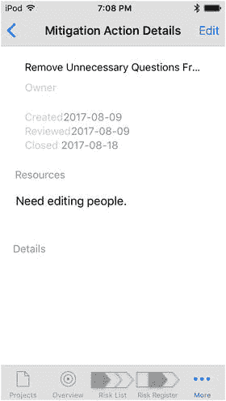

图 6-5

编辑数组元素的详细数据


图 6-4

（左）表格视图和（右）编辑模式下的表格视图

### 多维数组

数组通常具有多个维度。二维数组可以非常轻松地处理电子表格中的数据。这样的数组有两个索引——一个用于行，一个用于列。在大多数语言中，数组可以拥有多个维度。

例如，你可以有一个表示客户交易的数组。第一个维度可能是客户数据（例如姓名和地址）。下一个维度可能是个别交易（包含日期和金额）。然后可能还有付款的维度。在 Swift 中你无法做到这一点，而且当你开始思考这个问题时，可能会发现管理多个维度很困难。

在任何语言中，这种多维数组很快就会变得笨拙不堪。我们有其他数据结构可以更轻松地处理这类数据。在 Swift 中，你会找到其他类型的集合，例如集合和字典，它们可以将数据组织成特定的集合类型。Swift 数组的一维特性允许它本身包含其他数组、字典或集合；该维度也可以包含元组，元组是在单个实体中组织数据的另一种方式，并且可以存储在数组中。（元组将在下一章中讨论。）

因此，在了解 Swift 语言的其他特性之前，不要因为 Swift 数组的一维特性而感到困扰。


### 查找数组元素

数组中的每个元素都可以通过其索引来访问。数组中的第一项是 `array[0]`——请记住数组索引从零开始。然而，当你插入和删除元素时，索引会随之变化，以确保数组中没有间隙。这意味着今天索引为 52 的元素，明天可能变成索引为 35（甚至后天可能就不存在了）。

Swift（与许多其他语言一样）通过让你根据元素的内容而不是索引来定位数组元素，从而为你解决了这个问题。代码如图 6-6 所示。

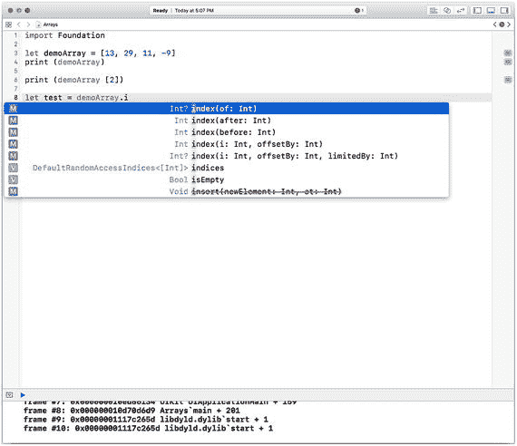

图 6-6

根据值查找数组元素

你可以使用以下代码创建一个包含值的数组：

```
let demoArray = [13, 29, 11, -9]
```

在图 6-6 中，你可以看到如何打印整个数组：

```
print (demoArray)
```

你可以通过以下方式获取第三个元素（索引为 2）：

```
print (demoArray[2])
```

你可以使用 `index(of:)` 方法来查找元素。请注意图 6-6 中的代码补全提示，它期望一个 `Int` 作为参数。你从未声明过该数组为 `Int` 类型数组；解析器是根据你输入的值推断出来的。

如果你输入图 6-7 所示的值，则会推断出 `Double` 类型。

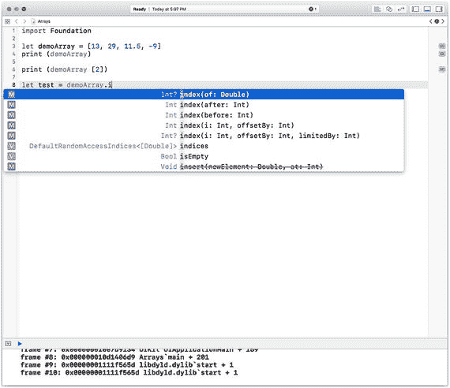

图 6-7

Swift 在适当情况下会推断出 Double 数组

当你完成代码后，Playground 的运行结果如图 6-8 所示。

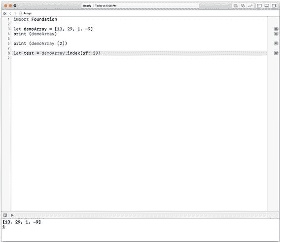

图 6-8

在 Swift Playground 中创建并打印数组 提示

`index(of:)` 方法和代码补全功能非常有用。只需像图 6-6 和 6-7 所示那样开始输入，就能看到 Swift 是如何处理类型推断的。如果你碰巧基于初始数据创建了一个 `Int` 数组，并且最终想要添加一个浮点数或 `Double` 值，可以用类型声明，例如 `let demoArray:Double = [3, 29, 1, -9]`。即使初始值是 `Int` 类型，这也会创建一个 `Double` 类型的数组。

### 添加和删除数组元素

在创建数组后添加和删除元素并不复杂。最简单的方法是使用代码补全功能。首先，请确保数组声明为 `var`，以便你可以修改它（如果你用常量声明，它可能是 `let`）。

如果你认为需要的方法是 `add`，代码补全会拒绝。正确的方法是 `append`，如果你尝试这个方法，你会发现它有效，并且，如图 6-9 所示，预期会传入一个 `Int`。

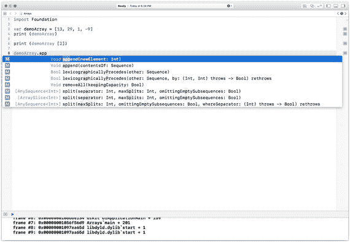

图 6-9

开始追加新的数组元素

追加新数组元素后，Playground 的运行结果如图 6-10 所示。

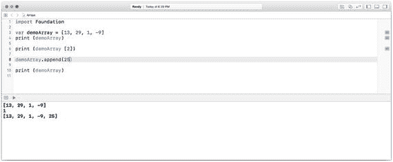

图 6-10

向 `var` 数组追加元素

你可能会注意到，追加操作是在数组的末尾添加元素。Swift 中还有多种其他方法可供使用。使用代码补全功能并向下滚动查找相关方法非常方便，如图 6-11 所示。

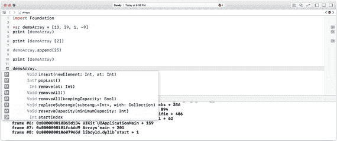

图 6-11

使用代码补全功能查看其他数组方法

当然，你也可以在 Xcode 中使用“帮助 ➤ API 参考”或访问 `developer.apple.com`。请注意，你可以看到在数组的不同位置插入新元素或删除元素的方法。这些是 Swift 和其他语言的细节，因此你可以自行查阅文档。数组的原则在各种语言和操作系统中都是相同的。唯一的主要区别在于，有些语言没有提供那么多内置的方法和函数来操作数组。（此外，有些人更喜欢自己编写数组操作代码，尽管这可能会在代码中引入更多错误。）

删除数组元素比添加更简单，因为你无需担心跟踪新元素及其在数组中的位置。要删除一个数组元素，只需通过索引或使用上一节讨论的函数之一来定位它。要移除元素，可以使用数组的以下方法之一：

```
arrayName.remove(at: Int)
arrayName.removeFirst()
arrayName.removeLast()
arrayName.removeFirst(n: Int) // 移除前几个元素
arrayName.removeLast(n:Int) // 移除后几个元素
```

你可以使用 `index(of:Int)` 来查找索引，然后使用 `remove(at: Int)`。

### 遍历数组

通常你需要依次访问数组中的每个元素。你可能想要显示班级中每个学生的姓名，想要找出 24 小时内最高和最低的温度，或者想要执行任何涉及遍历数组中每个元素的操作。

注意

对于一个包含 10,000 个随机数的数组（你可能已经创建好了），你可能想要计算前 5,000 个数的平均值，以及后 5,000 个数的另一个平均值。如果这些数是在相同的上下限（例如 0 和 1.0）之间生成的，那么这两个平均值越接近，这些数就越随机。这一点将在第 8 章“管理控制流”中讨论。

## 使用集合

集合是集合类型——就像数组一样，是 `Collection` 的子类。它们与你在线代逻辑学分支——集合论中遇到的集合是同一个概念。如果你还没有阅读上一节关于数组的内容，你可能至少需要浏览一下，因为集合的许多概念与数组相同。（实际上，如果你查看文档，你会发现许多集合和数组的方法（比如你将在本章后面看到的字典方法）实际上是 `Collection` 的方法。）

集合有一个关键特性，这也是它们在 Swift 应用程序中被广泛使用的原因。是的，你可以对集合执行各种集合论运算（如并集、交集、连接等——请参阅本节后面的“使用集合”）。但对许多开发者来说，更重要的是，集合可以在属性列表中使用（参见第 9 章“存储数据与共享数据”）。你可以将各种元素的集合（最常见的是类或结构体的实例）放入一个集合中。此时，该集合可以在属性列表中使用，并且无需你进行任何额外的编码，它就会被写入属性列表或其他 Cocoa/Cocoa Touch 结构中，或从中读取。因此，如果你想抛开集合论和集合操作，仅仅将它们用作一种快速构建数据结构以便存储和检索的方式，你并不孤单。这是集合最常用的方面之一。

本节讨论的集合其他特性包括：

*   集合基本术语
*   识别和查找集合元素
*   声明和创建 Swift 集合与类型
*   添加和删除集合元素
*   使用集合

### 集合基本术语

集合是无序的元素的集合。它们是唯一的。你不能在一个集合中拥有两个值相同的元素。在数组中，你可以拥有多个值相同的元素，因为在任何给定时刻它们都有唯一的索引（请记住，随着元素的添加或删除，这些索引可能会发生变化，但在任何给定时刻，无论值是什么，索引都是访问数组元素的方式）。


### 识别与查找集合元素

在幕后，集合的元素会经过哈希处理。也就是说，会对元素内容应用一个公式，从而生成一个该数据唯一的哈希整数。正是这个哈希值被用来标识集合元素，因此无需下标或其他标识符。由于哈希值被存储，所以集合中不会出现重复元素（即两个集合元素不可能拥有相同的哈希值）。要访问集合元素，你只需知道该元素在集合中即可。一旦确定它在集合中，就无需进一步的访问机制。

当然，你需要判断某个元素是否属于集合。为此，集合提供了以下函数：

```
contains(_:)
```

该函数返回一个 `Bool` 值，因此你可以像下面的代码那样使用它：

```
let myElement = // 某个元素
if mySet.contains(myElement) {
    // 确定该元素属于集合后，即可放心使用
}
```

#### 声明与创建 Swift 集合及类型

集合使用如下类型进行声明：

```
Set<String>
Set<Int>
```

以此类推，其他基本 Swift 类型（包括 `Double` 和 `Bool`）也可用于声明。你可以使用以下语法创建集合：

```
var mySet = Set<String>()
```

这样创建一个空集合。

与数组类似，你也可以使用数组字面量来创建集合，语法如下：

```
var mySet: Set = ["mountain", "valley"]
```

这结合了基本类型声明与包含初始数据的集合变量的创建。记住，如果集合的类型可以从初始元素中推断出来，你可以在声明中省略类型；但如果初始元素可能暗示的类型范围比你想要的更窄，则请使用类型声明。

### 添加与删除集合元素

只要新元素遵守集合的两个重要规则，你就可以非常简单地将其添加到集合中：

1.  该元素不能已经存在于集合中。记住，集合元素是唯一的。
2.  该元素必须与集合声明中的类型一致。（记住，你可以使用 `Any?` 和 `AnyObject?` 类型以获得极大的灵活性。）

要将元素添加到集合中（只要它遵守上述两条规则），最基本的语法是：

`insert(_:)`

例如：

```
mySet.insert(myNewElement)
```

对应的移除方法是：

`remove(_:)`

例如：

```
mySet.remove(myNewElement)
```

因为集合是无序的，所以你无需担心将元素插入到何处（开头、末尾等）。你只需将其插入到集合中的任意位置即可。

**提示**

调试代码时，请记住集合是无序的。但有时它们可能会显得有序，因为添加或移除元素的顺序可能会暂时造成一种顺序假象，但这只是暂时的。在应用的不同执行过程中，顺序可能会发生变化。不要依赖你在编辑和调试时可能临时产生的偶然顺序。

### 处理集合

Swift 集合方法支持两种基本的集合论运算：

```
aSet.union(anotherSet)
aSet.intersection(anotherSet)
```

其他方法支持更高级的运算，但如前所述，许多集合的创建是为了读写方便。在很多情况下，它们的集合论运算并不常用。

**注意**

关于如何遍历集合，请参阅第 8 章《管理控制流》。

## 使用字典

集合是完全无序的。数组按其中项目的顺序排序。字典则更为复杂。一种理解方式是，它们是有序的，但并非按数字排序。对于数组，你可以使用如下方式引用数组中的第五个元素（记住数组从零开始）：

```
myArray[6]
```

而对于字典，你可能使用如下语法：

```
myDictionary["six"]
```

关联数组在许多语言中都有实现，例如 PHP、JavaScript、Python、Ruby 和 Perl。在 Swift 和 Objective-C 中，它们被称为字典。

-   字典基本术语
-   声明与创建字典
-   添加与删除字典元素

### 字典基本术语

集合元素没有顺序。数组中的元素有索引，并且索引由数组本身管理。今天是第 5 个的元素，明天可能因为添加或删除而变成第 25 个。

字典是数据对的集合：键和值（键值对）。通常，键是字符串，但并非必须如此（在某些语言中，字典或关联数组的键必须是字符串）。

### 声明与创建字典

你可以在 Swift 中正式声明一个字典，使用：

```
Dictionary<Key, Value>
```

`Key` 和 `Value` 分别是字典中键和值的类型。

简写形式省略了关键字 `Dictionary`；你可以使用以下方式声明字典：

```
[Key: Value]
```

同样，`Key` 和 `Value` 是字典中键和值的类型。

你可以在声明后使用 `()` 创建一个空字典，例如：

```
Dictionary<Int, String>()
```

这个声明故意颠倒了常见字典结构（键为字符串）。这里，键是 `Int`，值是 `String`。这向你展示了可用的选项。

如果你在打算创建字典时忘记了写 `()`，Fix-It 会提醒你，如图 6-12 所示。

**提示**

如果你使用字典，必须在应用或 Playground 中导入 `Foundation`。如果你导入了 `UIKit`，则无需再导入 `Foundation`，因为它已包含在 `UIKit` 中。

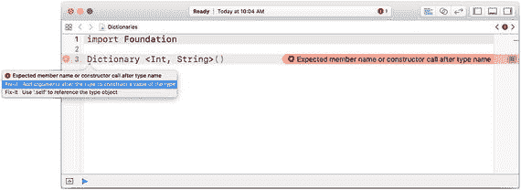

图 6-12 声明与创建字典

你可以使用如下代码将新声明并创建的字典赋值给一个变量：

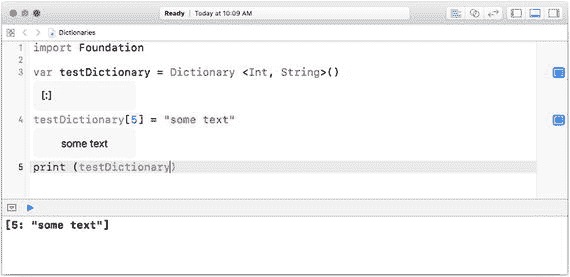

图 6-13 将字典赋值给一个 `var`

```
var testDictionary = Dictionary<Int, String>()
```

如果你点击图 6-13 第 3 行的查看器，就会看到 Swift Playgrounds 如何报告它：

```
[:]
```

字典条目用方括号括起来，键和值之间用冒号分隔。如你所见，空字典只有方括号和冒号。

你也可以通过字典字面量创建字典，其功能类似于数组字面量。它用方括号括起来，包含逗号分隔的键值对。

例如，假设你想创建如下字典：

```
"Breakfast":"Eggs"
"Lunch": "Soup"
"Dinner": "Vegetables and Rice"
```

你可以使用字典字面量创建它，如下所示：

```
var menu = ["Breakfast":"Eggs", "Lunch":"Soup", "Dinner":"Vegetables and Rice"]
```

### 添加与删除字典元素

要添加字典元素，使用其键将其插入字典，如下所示：

```
testDictionary [5] = "some text"
```

这显示在图 6-13 的第 4 行。

移除元素的方法如下：

```
testDictionary.removeValue((forKey:Int))
```

如图 6-14 所示，代码补全会根据你声明字典的方式自动插入适当的键类型。

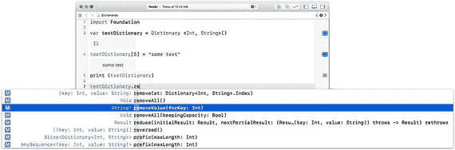

图 6-14 移除字典元素


## 总结

本章向你介绍了 Swift 乃至整个计算机科学中的基础集合。这些结构在几乎所有语言中都是基本相同的，尽管某些结构（例如关联数组、字典或集合）可能未在某些专用语言中实现。

所有集合都让你能够将数据集合作为一个单一实体来处理。例如，在 Swift 中，一行代码即可读取或写入包含多个元素的集合。此外，你还可以在需要单个变量的地方使用集合。例如，在字典中，一个给定的键只能对应一个元素。然而，如果该元素本身是一个集合（数组、集合或字典），那么整个集合就可以成为另一个集合的一部分。你将在后续章节中看到更多相关内容。

