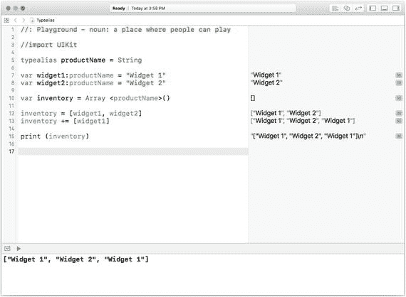
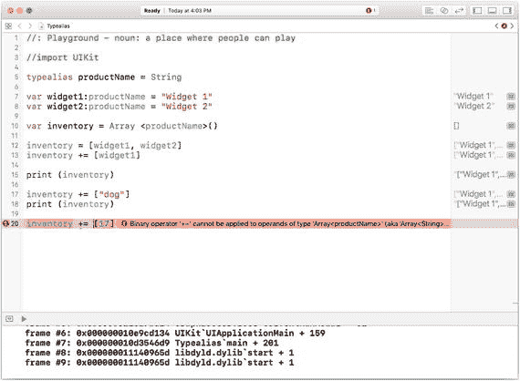
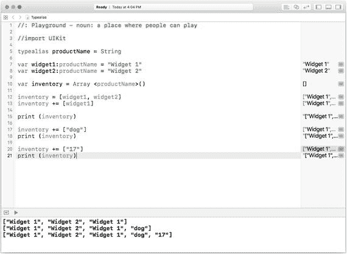
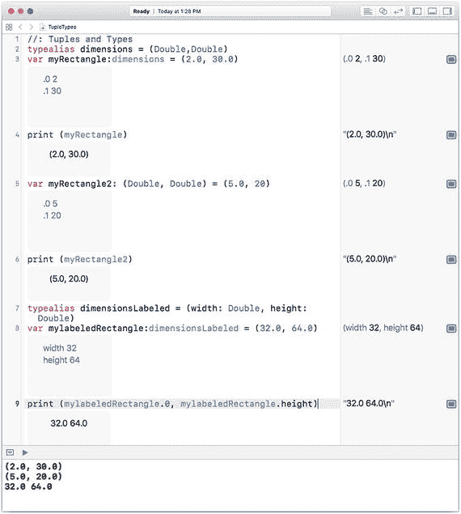

# 7. 处理数据：类型

计算机科学的基础之一就是数据类型的概念。在最简单的情况下，类型是一种解释计算机内存中或来自存储设备的数据流中的数字位（bit）的方式。位具有两种值之一（开/关），并且它们通常在逻辑上被分组为字节（byte）。字节最初是指能够表示单个字符的位的集合；最初的实现是六位，但如今字节通常为八位，以便单个字节能表示更多字符。

需要注意的是，位是物理实体，而字节是逻辑集合。它们是由硬件和软件基于底层的位来组装和解释的。

位（硬件）在物理上被集合成字（word），字通常能容纳足够多的位来构成多个字符，但请记住，将位组装成字节是逻辑上的，而非物理上的；而将位组装成字是在硬件中完成的。

字可以通过软件直接访问，程序和操作系统一直在这样做。你可以使用软件来查看字内部，以处理单独的位和字节。

本章展示了操作系统，并通过操作系统向用户展示，字（位的物理分组）和字节（位的逻辑分组）是如何被使用的。管理字的基本方法之一就是将其分组为数据类型。本章将探讨数据类型以及如何使用它们。本章涵盖的主要主题如下：

*   类型为何重要
*   基本类型
*   使用元组
*   高级 Swift 类型
*   创建新类型
*   处理不存在的数据（可选型）

## 类型为何重要

类型的基础很简单。它们是存储和数据流中的开/关位与诸如位和字节这类较高层级结构，乃至位和字节所构成的更高层级结构之间的主要中介。

如果类型的作用仅限于此，那也足够了（在最早的计算机中确实如此）。它是硬件与软件之间的关键连接。计算机科学超越了计算机如何工作的基础，它包含了让计算机和人能够执行有用的工作、相互交流的概念。从这个角度来看，类型还扮演着另一个关键角色。

类型提供了将位组装成可用字的规则。这些字可以被分配类型（即这些字被“赋予了类型”）。然后，这些有类型的字在代码中被使用。记住，类型是逻辑结构——无论它们被用作什么类型，物理字本身永远不会改变（改变的是字内的数据）。通过将字视为特定类型，编译器能够执行其最关键的角色之一。语言和编译器支持不同程度的类型安全。类型安全是一组规则，它决定了给定类型的字可以如何与其他类型结合使用。如果根据类型安全规则，类型的组合在逻辑上是不可能的，编译器会将其捕获为错误，并且代码将无法运行。这对于编译器来说是一个重要的角色，因为另一种选择是直接执行不合逻辑的操作，然后眼睁睁看着应用崩溃。

通常认为，让编码者得到错误，总好过让用户遭遇这些错误。

类型和类型安全使这成为可能。

你可以根据每种类型的规则，以多种方式混合使用类型。例如，你可以将两个整数相除（例如 `5` 除以 `2`）。你可能想要的结果是一个浮点数（`2.5`）。

根据上下文，Swift、Xcode 或运行时环境要么会拒绝执行非法操作（即产生一个错误），要么会警告你可能在执行一个不合逻辑的操作（这通常以向你（编码者）发出警告的方式实现）。

实现类型安全的一个关键部分是允许开发者将一种类型转换为另一种类型（这被称为类型强制转换）。有时，数字本身的格式就可以作为其类型的指示。例如，`2` 在日常用法和 Swift 中都是整数。`2.0` 是一个浮点数（注意小数点）。它的值与 `2`（不带小数点）相同，但属于不同的类型。

**注意：** Swift 支持两种浮点数。`Float` 的存储方式使其小数点后可能只有 6 位。`Double` 的存储精度更高。`Double` 是浮点数的首选和默认类型。

## 查看栈和堆

类型描述了字中的位应该如何被解释——无论是作为整数、浮点数、一个或多个字符或字节，甚至是作为可以单独按其开/关值访问的单个位的集合。

然而，你在应用中处理的所有东西并不都由这样的字构成。正如你在第 6 章“处理数据：集合”中所见，你还需要处理数据集合。大多数情况下，这些集合是被解释为特定类型的字的集合。正如你将在第 10 章“构建组件”中看到的，有时你还需要处理对象。集合和对象无法容纳在单个字内，因此需要另一种存储方式。对于此类项目，操作系统通常会在内存中预留一个区域，以便放置这些通常体积较大且大小可变的项。


### 运行时数据存储

数据在运行时存储的位置，成为了设计操作系统和编译器时的关键问题。在很大程度上——但并非完全——这会在幕后为你处理。由于并非完全自动处理，你需要了解运行时存储的基本概念，本节将对此进行描述。你还会看到这些概念如何整合在一起，从而让你作为开发者能够提供用户从现代软件和开发技术中所期望的功能和响应速度。

在计算机的早期时代（20 世纪 40 年代的大型机），一次只运行一个程序。整个计算机都专用于运行该程序。其所有资源（存储、通信通道和打印机）都服务于正在运行的程序。在这些专用于单个程序的资源中，还包括计算机本身及其操作员。在大多数环境下，如果你想运行一个程序，需要预约。这与拿起 iPhone 点开一个应用相去甚远；这些预约通常安排在未来某个时间段。如果你的项目优先级不高，你的时间段可能定在下周四凌晨 2:30。

这种操作模式使得许多事情比当今世界要简单得多。首先，由于整台计算机都可供单个程序使用，这意味着其所有内存都专用于该程序，只有相当小的一部分内存用于计算机的开销和维护（尽管计费可以手动记录在卡片或活页夹的页面上）。

如今，人们期望在移动设备上同时运行多个应用，因此不可能将设备的所有内存都专用于单个应用。用户不会容忍这种情况。“你说我打电话和设计海报的时候不能看电影？我可是为 256G 存储多付了钱的！内存都去哪儿了？我得把 iPhone 拿到苹果天才吧去，让他们打开看看，是不是有人在内存上骗了我。”

为了充分利用任何设备中的可用内存（这可以追溯到几十年前，即 20 世纪 60 年代分时技术的开端），可以同时运行多个程序，这样当需要打印机或数据存储设备等资源时，该程序及其所有数据可以被搁置一旁，直到设备就绪。尽管将程序和数据换入换出需要一些时间，但整体吞吐量却更快了。这就是我们今天仍然使用的基本模型（这是一个非常基础的概述）。

程序开始被构建成这样一种方式：一组离散的代码可以从头到尾地使用其所需的数据执行。当这组代码执行完毕后，它及其数据就会被直接丢弃——这与为了最大化资源利用率而进行的程序和数据的换入换出不同。相反，这是一种独立的请求、使用然后丢弃内存的方式。这两种过程对于充分利用计算机及其资源都是必要的。

### 栈与队列

`stack`（栈）这个词在计算机科学中经常被使用。它用的是其日常简单的含义，即一堆东西（通常是一叠纸，但有时是一堆砖块或其他物体）。就像日常生活中的堆叠一样，你通过将物品放在顶部来添加到栈中。从栈中取出物品最简单的方法是取走最顶部的那个。在计算机科学中，这被称为后进先出栈（有时称为`LIFO`）。

对于栈来说，无论栈中有多少个元素，实际上只需要访问最顶部的元素（即后进先出的那个）。将元素添加到栈顶和从栈顶移除元素的操作分别称为`压栈`（将一个元素压入栈顶）和`弹栈`（从栈顶移除最顶部的元素）。

栈中元素的顺序很重要。

与栈相关的一个概念是队列。队列也是一个有序的元素列表，你也可以将元素添加到队列的顶部。然而，在队列中，最先被移除的并不是顶部元素（即最后添加的那个）。相反，在队列中，你像在栈中一样将元素添加到顶部，但从底部移除元素。这是一种后进后出（`LILO`）结构。你每天在很多场景中都能看到这种队列的实际应用。例如，在物料柜中，你可能以先使用旧物品的方式来存放物品。

队列中元素的顺序与栈中的一样重要。

> **注意**  
> 以下是对内存管理的简化概述，旨在帮助你理解基本原理。现代计算机在这些基础之上有显著的增强和优化。

在应用程序运行时，计算机内部会将一段代码（通常是函数或过程，但这适用于任何代码段）所需的数据压入栈中。这意味着当函数或过程开始运行时，代码所需的每个变量的内存存储会在该代码的生命周期内被预留出来。所有这些数据都存放在一起。当这段代码执行完毕后，为变量预留的所有数据都可以释放回系统。这被称为回缩栈，它是重用计算机内存的关键方式。

这种优化内存使用的方式依赖于能够识别执行某段代码所需的内存位置。当该代码开始运行时，其变量所需的任何内存都会被预留（分配），即使这些变量尚未被使用。这确保了代码能够运行完成而不会耗尽内存。


### 堆

栈是一种组织与重用内存的简单方式，但存在一个重大问题：并非所有数据都能恰好放置在计算机字的栈中。许多数据结构远大于单个字。最简单的例子是第 6 章讨论的集合。几乎每种计算机语言都有其集合类型，而如何存储它们始终是一项挑战。一种解决方式是在栈上放置一个具有特殊含义的计算机字——它是对实际数据的引用，这些数据位于计算机内存的其他位置。（这种处理数组的方法可追溯到 20 世纪 50 年代。）通过使用此类引用，你可以继续沿用缩减栈的基本思路。只是过程稍显复杂，因为操作系统须识别到：当它从栈中移除一个数组引用字时，必须释放该数组关联的内存。

尽管处理引用需要耗费一些时间和处理能力，这一切仍能良好运行。数组在过程、方法或函数中被声明，而其元素在内存的其他位置被引用。这个“其他位置”通常被称为堆。它本质上就是一堆非结构化的数据。当数组或其他结构化条目的数据通过栈的引用存储在堆中时，管理起来相对容易。

当堆中存在与栈引用字不关联的数据时，重大问题便会出现。这种情况需采用另一种策略处理。操作系统仍使用栈上的引用字来引用堆中的非结构化数据，但在此过程中加入了一个新要素。操作系统会记录指向堆中某数据的引用字数量。对于栈上的引用字，只存在一个引用：即来自栈的引用。然而，当数据被共享时，堆上的这个非结构化数据可能被应用中多个引用所指向。当操作系统注意到指向该数据的引用数量降至零时，它便可以重用那块内存空间。

这一切要求操作系统追踪（每个正在运行应用的）栈、堆中的存储，以及（在移动设备上）位置的持续变化，还有电话、短信、推文以及设备中所有其他活动。这些操作所消耗的存储和处理能力在任何计算机上都相当可观。

> **提示**  
> 对于任何计算机，所有这些在后台进行的工作，最理想的状况是用户甚至不知道它的发生。然而，当你考虑配置一台计算机（或购买新机）时，必须将这些资源纳入你的需求考量。若只为存储一千首歌曲的库而配置足够空间，却别无冗余，你的计算机将无法正常运行。

## 基本类型

大多数计算机语言的基本类型以不同方式表示数字、字符和字符串。尽管存储形式最终是一个或多个计算机字，但这些类型之间的区别是通过软件——即操作系统和运行在计算机上的应用——来实现的。计算机字在本质上是可互换的。事实上，编译器与计算机语言发展史上的重大突破之一，便是认识到计算机中存储和处理的数据，既可以是我们通常认为的数据（例如数字），也可以是计算机指令（例如将两个数相加）。

计算机系统中还有一种用于后台的存储类型。计算机字可以包含操作系统自身运行所需的内部操作数据和指令。例如，引用字（如前所述）存储在原本可用于传统数据的相同物理字中，但操作系统会确保此类数据免受应用和用户的未授权操作。

### 数值存储

数字的存储有两种方式：可以存储为整数（整型数），或带有小数部分的数字（通常有多种称呼，例如十进制数，但此术语在某些情况下实则具有误导性）。

#### 使用整数

整数是简单的数字。你可以将计算机字中的位转换为二进制数，进而得到一个可转换为任意其他进制的数，但最常见的转换是从二进制转换为十进制。

计算机通常使用几乎整个字来存储整数。“几乎”整个字是因为其中一位常被保留作为符号位：用于指示数字是正数还是负数。在旧式计算机中，存储空间极其稀缺，在许多数字永远不可能为负数的情况下，将一位“浪费”在符号位上似乎令人惋惜。因此，你会在旧的文档和描述中看到整数和无符号整数被列为不同的类型。如今，大多数操作系统上的整数大多包含符号位。

在描述将字中的位转换为二进制数时，有两种方法可供使用。它们分别被称为大端序和小端序，这取决于位的序列应按从最高有效位到最低有效位解读，还是相反。

当你深入到体系结构的极端细节时，这很重要；但如今，这一点通常被隐藏起来，因此当通过通信信道接收位流时，两端的软件已将其转换为不依赖于端序的格式。

#### 使用浮点数

使用浮点数有多种常见方式。通常，浮点数的实现交由一个专门的处理器——**浮点运算单元**（`FPU`）来处理。存储浮点数的基本原理通常包含以下逻辑：

*   数字基本上存储为一个可能带符号的整数。这被称为尾数。
*   另外，指数作为另一个可能带符号的整数存储。

两者结合，可以表示大多数数字。例如，数字 12 可以用尾数 12（十进制）来存储，在二进制中可能表示为`1100`。

> **二进制数表示法**  
> 通常用法中，我们从小数点的位置（参见本边栏中关于小数点的后续说明）开始向左或向右讨论数字的位数。小数点左边第一位表示 0 到基数减一的值。在十进制中，这意味着该位（或任何其他位）可以取数字 0-9，但在二进制中，任何位可以取数字 0-1。  
>  
> 再向左一位表示基数本身。因此，在十进制中，12 被解读为 2x1 加上 1x10。  
>  
> 二进制中，数字 12 的表示法是：从右侧（即小数点所在位置）开始计算：  
>  
> *   0x1
> *   0x2
> *   1x4
> *   1x8
>  
> 总和为 12。  
>  
> 左边第二位表示基数的二次方。因此，在十进制中，数字 213 是 3x1 加上 1x10，再加上 2x100。  
>  
> 对于非十进制系统中的小数点如何称呼存在争议。有些人认为小数点（decimal point）是十进制系统独有的。另一些人则认为它并非十进制独有，正如“数字”（digit）一词可用于指代任何基数中有效的字符。  
>  
> 如果你想要一个无歧义的通用术语来指代小数点，可以称之为基数点。数学家（或许只有他们）会理解你。本章中，我们稍作折中，将其称为点（point），这是一种避免不必要争论的常用方式。


### 存储字符串与字符

字符串和字符在应用中用于显示文本……有时确实如此。文本可以显示在应用中的图像里，尽管你可能认为它们就是字符串和字符，但当它们成为图像的一部分时，它们就和云朵的照片一样，本质上就是图像。

字符由一系列比特位表示。根据所涉及的字符和语言，所需的比特位数会有所不同。最初，字符的长度是六位，后来扩展到了八位。如今，借助 Unicode 字符，大多数字符和世界上大部分语言都能被显示。你最常遇到的编码格式是 `UTF-8`、`UTF-16` 和 `UTF-32`（其中的数字表示单个字符所使用的比特位数）。

字符串是字符的序列。从字符可能的长度可以看出，一个字符串很容易超出单个计算机字的范围，因此字符串通常不存储在栈上，而是通过某种形式的引用字来访问。

### 创建新类型

当你声明常量或变量时，需要指定其类型。你可以通过类型注解来实现，或者为常量或变量设置一个值，以便 Swift 能推断其类型，如下例所示。

```
var myVariable:Int // 类型注解
var myVariable = 20 // 推断类型
```

当推断出的类型可能不是你想要的类型时，类型注解就变得很重要。例如，虽然 `20` 会让 Swift 推断为 `Int` 类型，但以下代码会将变量变为 `Double` 类型。

```
var myVariable: Double = 20 // 类型注解覆盖了推断出的 Int 类型
```

你还可以在 Swift 中声明新类型。其他现代语言也允许你这样做，但传统语言会将你可使用的类型限制在语言及其编译器内置的范围内。这允许使用本章前面描述的类型检查，在编码/编译过程中捕获错误，而不是在用户尝试使用你的应用时才发现问题。

你可以在 Swift 中声明新类型。一旦声明，你就可以像使用原始类型一样使用它们来声明变量和常量，并在类型注解中使用你的新类型。你的新类型是基于 Swift 中已有的类型（以及你自身代码中的类型）构建的。例如，你可以创建一个依赖 `Int` 类型的类型。你的类型可以与 `Int` 类型一起使用。（在下一节“使用元组”中，你将看到这样做的好处。）

要声明新类型，你需要使用 Swift 的 `typealias` 语法，其中一个类型被别名为另一个类型。这样做的一个原因是为了提高代码的可读性。你可以（并且应该）以清晰表明变量和常量含义的方式为其命名，但有时你希望优化命名以使其更加精确。例如，如果你使用内置的 `String` 类型来命名应用中处理的条目，那么使用 `String` 类型是没问题的。

你可能希望使用类型别名向自己和他人明确该字符串具体代表什么。因此，你可以像这样使用 `typealias`：

```
typealias productName = String
```

现在，你可以在声明中使用 `productName`，如下所示：

```
var widget1:productName = "Widget 1"
var widget2:productName = "Widget 2"
```

你可以超越简单的命名，为集合类型使用 `typealias`。例如，你可以为你的库存创建一个数组：

```
var inventory = Array ()
inventory = [widget1, widget2]
```

只要尊重类型，你可以向数组中添加其他数组。因为数组可以有重复的元素，你可以用 `widget1` 创建另一个数组，并将该数组添加到 `inventory` 中。

```
inventory += [widget1]
print (inventory)
```

你可以在图 7-1 中看到结果。



图 7-1 向数组中添加另一个元素

你可以使用相同的逻辑，将一个字符串（以其自身数组的形式）添加到 `inventory` 数组中。

```
inventory += ["dog"]
print (inventory)
```

你可以将字符串 “dog” 添加到 `inventory` 中，因为 `inventory` 是类型为 `productName` 的数组，而 `productName` 是 `String` 的 `typealias`。

如果对一个新的 `Int` 类型数组（17）应用相同的逻辑，你将会得到一个错误，如图 7-2 所示。该数组是 `typealias productName`（即 `String`）类型的数组，因此不允许 `Int` 类型。



图 7-2 你不能向数组中添加 `Int` 类型

```
inventory += [17]
print (inventory)
```

如果你将 17 放在引号中，使其成为 `String` 类型，那么一切都会正常，如图 7-3 所示。



图 7-3 以 `String` 类型添加 `Int`

使用 `typealias` 使你的代码更具可读性是一个非常有益的想法，并且它有助于防止以后出现问题，因为类型的具体用途对你和其他维护代码的人而言都变得清晰明了。


## 元组的使用

上一节中描述的数字、字符串和字符是当今大多数计算机语言的常见类型。大多数语言在发展中都有了一些变体，Swift 也包含了其中许多变体。

跳过基本数字、字符串和字符类型的众多变体，我们可以看看一种在现代类型，它在 Swift 以及其他类似 Python 和 C# 的语言中都以相似的方式实现。**元组** 是一种由多个类型组成的序列，这些类型共同构成一个单一类型。

例如，你可以声明一个元组，这是一种由其他类型创建的类型形式。你可以使用 `typealias` 为已有类型提供别名，而这个已有类型可以是你用元组创建的类型。实际上，使用 `typealias` 为元组命名可能是 `typealias` 最常见的用法。

元组基本上是用括号括起来的一系列类型。它用于类型注解或类型别名中。例如，你可以创建一个包含两个 `Double` 类型的元组来表示矩形的尺寸（长度和宽度）。你可以像下面代码这样给它一个名为 `dimensions` 的 `typealias`：

```
typealias dimensions (Double, Double)
var myRectangle:dimensions = (2.0, 3.0)
```

你不必非得使用 `typealias`。你可以像下面代码这样非常简单地创建和使用一个`元组`：

```
var myRectangle = (2.0, 3.0)
```

除非你想在其他地方引用它，否则没有必要用 `typealias` 来命名一个`元组`类型。

元组非常有用，因为它们将多个项组合到一个可寻址的符号中（如果有的话，就是 `typealias` 的名称）。大多数语言中的函数通常只能返回一个单项结果。许多人会让函数返回一个集合（数组、字典或集合），这实际上达到了返回多个结果的效果。（实际上，字典常被用来在一个单项中返回多个结果。）

元组中的项**按顺序**标识：你不能重新排列它们。默认情况下，它们从零开始编号。图 7-4 展示了如何创建和使用元组。请注意第三行之后的查看器中，元组的两个元素前面显示了它们的默认名称——`.0` 和 `.1`。

声明元组时，你可以为各项提供名称。在图 7-4 中，请注意第 7 行中的项被命名为：

```
typealias dimensionsLabeled = (width: Double, height: Double)
```

你可以通过使用变量或常量的名称，后跟点语法和每个项的名称来引用元组中的项，如第 9 行所示：

```
print (myLabeledRectangle.0, myLabeledRectangle.height)
```

即使你为元组中的项提供了名称，你仍然可以通过其默认编号来引用它。

注意：元组元素的名称不是带引号的字符串。



**图 7-4** 声明和使用元组

## 总结

本章为你概述了用于数据的类型。你看到了所有语言和操作系统通用的类型（数字、字符和字符串），以及你可以自行创建的类型，例如元组。

使用类型——甚至是动态类型——可以使你的代码在开发和维护中更安全。

在掌握了数据方面之后，是时候继续了解操作系统和应用程序如何实际处理你所声明和存储的数据了。这是下一章的主题。

