# 8. 管理控制流：条件语句、Switch 语句和枚举

在第五章中，你了解了循环的基础知识，但管理控制流不仅仅是通过循环重复代码。本章将探讨代码中其他主要的控制流方面。这些存在于大多数语言和操作系统中。

## 接下来是什么？

应用中的基本控制流是从一行代码执行到下一行代码。一行代码就是一个单独的语句，尽管它可能包含许多步骤——也许是因为这行代码会导致一个函数或方法运行。此外，在 Swift 中，多行代码可以放在一行物理代码上。与许多其他语言一样，当一行代码中放置了多条语句时，每条语句后都会加上分号。此外，为了提高可读性，一行逻辑代码可以跨越多行物理代码。尽管如此，我们提到“一行代码”时，会将其视作一个物理和逻辑实体，尽管它们并非完全等同。

无论格式如何，应用中的每一行代码都会被执行，并且大多数情况下，在它执行完毕后，下一行代码会被执行。如果没有更多代码行，应用就会终止。

这是自计算机诞生以来应用和程序的基本模式。值得注意的是，这种模式有一个重要的变体，在依赖用户交互的应用中尤其普遍。在这些情况下，应用开始运行，一旦开始运行，它就会等待一个外部事件传递给它（该事件可能是用户操作）。当接收到事件时，应用会处理它，然后等待下一个事件。像这样的程序可能只有在计算机关闭或重启时才会终止。

在 iOS 设备上，你可以专门终止等待事件的应用。你可以在控制中心看到它们，如图 8-1 所示。只需将应用向上拖到窗口顶部即可将其终止。

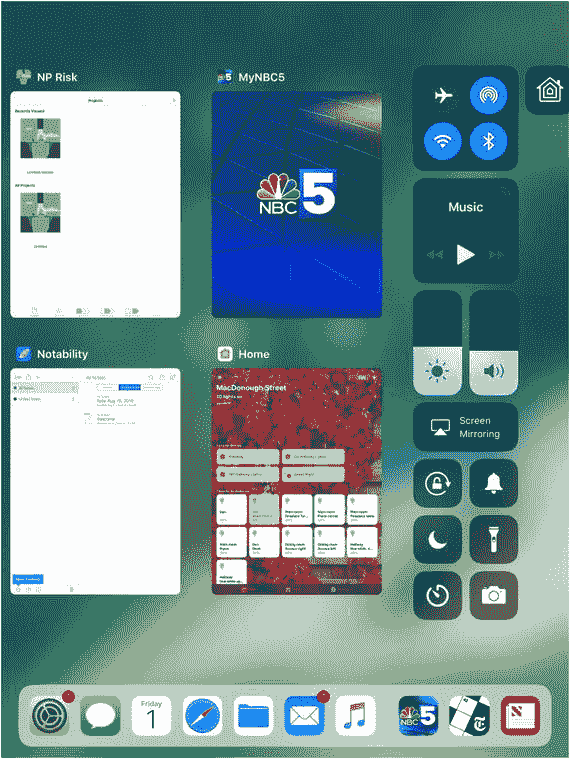

**图 8-1** 在 iOS 11 及更高版本的控制中心中查看正在运行的应用

在应用内部，对“执行下一行代码”这一序列的主要例外情况如下：

*   **跳转 (Go to)**。你可以显式跳转到下一行之外的其他代码行。正如你将看到的，这通常不推荐，但它仍然是一种常用的控制管理技术。
*   **Switch 语句**。你可以执行多行代码（或代码段）中的其中一段，而不是执行下一行。当你想要执行多个操作之一（例如显示当前温度、显示下周日历、登出或任何其他操作）时，这是一种很有用的技术。
*   **条件语句**。当某个条件为真（或不为真）时，你可以执行某行代码。
*   **循环**。你可以重复执行一行或多行代码，如你在第五章中所见。循环模式有多种变体——例如，你可以重复代码直到某个条件为真或不为真。


### 使用 `Go To` 语句……或者不使用

在许多编程语言中（尤其是较老的语言），可以直接指定当前语句之后要执行的下一条语句。为此，编程语言需要某种方式来标识语句。最初，这是通过按顺序对语句进行编号来实现的。`Swift` 中的语句可以由 `Xcode` 编号，但这些编号并非代码本身的一部分。

在某些语言中（特别是 `PL/1` 和 `COBOL`），语句可以被命名。这比编号更优，因为插入或删除语句后名称不会改变。行号则很脆弱。当使用标签时，如果它们用于某行，通常必须位于该行的首字符位置，并且标签以句点、冒号或其他特殊字符结尾。标签通常不能包含嵌入的空格。

在 `Swift` 及大多数现代语言中，即使显示了行号，它们也仅供你参考：你无法将控制权转移到特定的行号。

图 8-2 展示了 `Xcode` 中显示行号的 `Swift` playground。

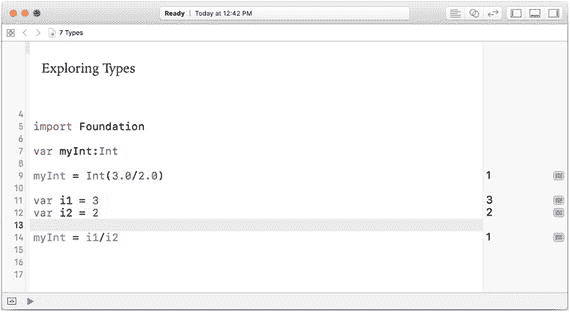

图 8-2  
显示行号的 `Swift` playground

图 8-3 展示了隐藏行号的同一段代码。

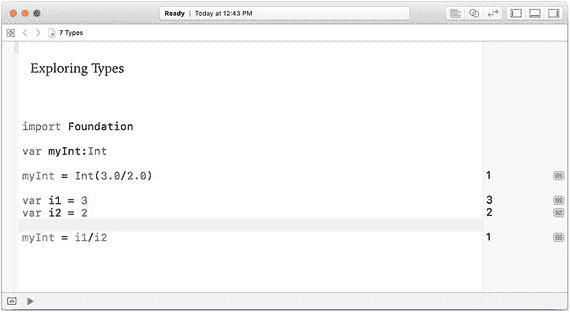

图 8-3  
隐藏行号的 `Swift` playground

你可以在 `Xcode` 偏好设置（`Xcode` ➤ `Preferences`）中开启或关闭行号，如图 8-4 所示。打开 `Preferences` 后，从顶部栏选择 `Text Editing`，然后在主窗口区域顶部选择 `Editing` 选项。你可以根据当时正在进行的操作来开启或关闭行号。如果你要参加代码审查会议，无论代码是打印在纸上，还是通过 `AirPlay` 或直接连线显示在 Apple TV 或其他设备上，人们都会讨论代码，此时你可能希望开启行号。

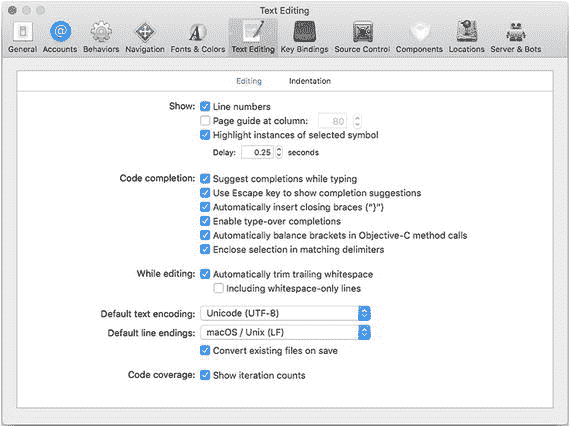

图 8-4  
`Xcode` 偏好设置中的 `Xcode` 行号选项

行号以及 `go to` 语句在编程世界中已成为过去的遗迹，但正如在现实世界中一样，过去总是与我们同在，或者如威廉·福克纳所写：“过去从未消亡，它甚至还没有过去。”[《修女安魂曲》及网络上各种误引的变体] 能够在讨论和文档中识别行号是非常有用的。（例如，本书中来自 `Xcode` 的截图就经常使用行号。）

能够指定特定行作为要执行的下一条语句已被证明是一种危险的编程技术。如果你正在编写代码，并考虑如何跳转到当前代码行之外的其他位置，请改用本节中描述的其他技术之一。

能够将控制权转移到代码的特定行会导致所谓的“意大利面条式代码”。这个名称来源于这样一个事实：如果绘制箭头来表示程序的执行方式，这些箭头（在通常称为流程图的图中）会开始看起来像一盘意大利面条。

行号和意大利面条式代码的替代方案是结构化编程或结构化代码。该术语由艾兹格·W·迪杰斯特拉在 1968 年提出。作为 Burroughs `Corporation` `ALGOL` 编程团队的主要开发人员，他在 20 世纪 50 年代末期对该项目以及整个计算机编程产生了巨大影响。

> **注意**  
> Burroughs 大型机上的 `ALGOL` 是我学习的第二门编程语言（我的第一门语言是 `CDC 6600` 大型机上的 `FORTRAN`，该机型在 20 世纪 60 年代被认为是第一台成功的超级计算机）。`ALGOL` 的许多语法至今仍有重要价值，其某些特性是大型和小型设备上良好编程风格与高效编码的标志。

结构化编程不是将控制权转移到由标签或编号标识的特定行，而是依赖于将代码结构化组织成逻辑部分（函数、过程或方法，你将在第 10 章“构建组件”中了解更多）。然后，你可以将控制权转移到这个可能包含多行代码的逻辑部分。由于这种结构，你不再需要在代码中从一个行转移到另一个行，再转移到另一个行（因此，也就有了“意大利面条式代码”这个短语的起源）。

### 使用条件语句

也许将代码结构化以避免随机跳转（从一个语句跳转到另一个，然后陷入混乱）的最简单方法是建立一个二项选择。如果某个条件为真，则执行紧随其后的代码行。这意味着，你只需决定是否执行下一行代码，而无需到处跳转。代码的结构和流程仍然相当容易理解。

你甚至可以扩展此模式，建立三项选择：如果条件为真，则执行这行代码；如果条件为假，则执行那行代码。请注意，这些不是相距甚远的代码行——它们是顺序排列的。这样，选择就很容易理解，控制流程也很简单。

你还可以通过使用复合语句来构建更复杂的结构，将一组语句视为一个整体。其逻辑稍作修改，概念上变为：

如果此条件为真，则执行随后这几行代码；如果条件为假，则执行另外那几行代码。

代码行仍然是顺序排列的，因此条件（或 `if` 语句）被求值后，要么执行紧随其后的几行代码，要么（如果条件为假）执行另外的几行代码。尽管控制权会转向一组语句而非另一组，但所有代码都聚集在一起。

此模式的起始部分就是条件表达式本身。其最简单的形式是一个 `if` 语句。在 `Swift`（以及许多其他语言）中的基本风格如下面的代码片段所示：

```
var x = 5
if x > 4
{
x = x + 1
}
```

清单 8-1  
使用 `Swift` 的 `if` 语句

在 C 语言家族中，语法略有不同，如清单 8-2 所示：

```
if (x > 4)
    x = x + 1;
```

清单 8-2  
使用 C 语言的 `if` 语句

如你所见，有必要以某种方式区分条件测试和要执行（或不执行）的代码。括号或花括号用于此目的。

以上就是相关概念。接下来是具体的 `Swift` 示例。


### 在 Swift 中使用复合语句

在许多编程语言（包括 Swift 中），你可以通过将语句括在花括号中来将它们组合在一起，如下所示：

```
{
let x = 5
let y = 6
}
```

这使你可以将这些语句视为一条复合语句——也就是说，将其视为一条语句。这在与条件测试结合使用时特别有用。这意味着之前代码清单 8-1 中展示的 Swift 示例可以得到增强。条件代码周围的花括号意味着它已经是一条复合语句。要让 `if` 语句应用于复合语句中的多条语句，你只需将第二条语句添加到花括号复合语句的内部，如代码清单 8-3 所示。

```
var x = 5
if x > 4
{
x = x + 1
print ("updated x")
}
代码清单 8-3
将 Swift if 语句与复合语句一起使用
```

你可以使用 Xcode 的偏好设置来管理缩进。选择 **Xcode** ➤ **偏好设置**，然后选择 **文本编辑** 以及窗格顶部的 **缩进** 部分，如图 8-5 所示。

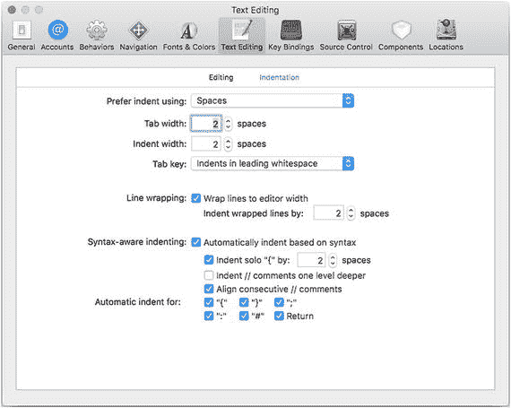

图 8-5  
设置缩进选项

通过图 8-5 中所示的设置，你可以看到在图 8-6 中缩进是如何工作的。（该报错是因为像这样一个仅用于格式演示的、脱离上下文的复合语句在语法上是无效的。）

在图 8-6 中你看不到的是，在输入起始的左花括号后，插入点会移到下一行的缩进位置，以便你可以继续输入。当你输入右花括号时，缩进会取消，并且光标会移到左侧。任意长度的内嵌语句都能正确显示。

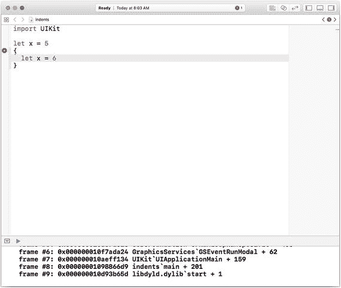

图 8-6  
在 Xcode 偏好设置中使用缩进

请注意，对于代码缩进，存在不同的风格和标准。最基本的一点之一是左花括号的放置位置。这在条件语句中尤其重要，因为在复合语句的左花括号之前存在代码。代码清单 8-4 和代码清单 8-5 展示了两种基本风格。

```
if x > 4
{
x = x + 1
print ("updated x")
}
代码清单 8-4
悬挂括号风格
```

```
if x > 4 {
x = x + 1
print ("updated x")
}
代码清单 8-5
内嵌括号风格
```

这两种风格各有其支持的理由。在悬挂风格中，左花括号和右花括号是对齐的，因此可能更容易识别出复合语句。在内嵌风格中（代码清单 8-5），左花括号和右花括号不对齐，但整个条件语句表现为一个整体（它本来就是一个整体）。

当你扩展 `if` 语句以提供 `else` 子句时，问题可能会稍微复杂一些——`else` 子句是在条件为假时要执行的一条语句或复合语句。代码清单 8-6 展示了悬挂 `else` 括号的一种版本。这种风格的常见变体不会缩进 `else`。

```
if x > 4
{
x = x + 1
print ("updated x")
}
else
{
print ("no update")
}
代码清单 8-6
悬挂 else 括号风格
```

在代码清单 8-7 中，你看到的是内嵌的 `else`。与代码清单 8-6 相比，这种方式强调了 `if` 语句的两个组成部分。你使用哪种风格属于个人偏好问题（取决于你个人以及你项目团队的偏好）。

```
if x > 4 {
x = x + 1
print ("updated x")
}  else {
print ("no update")
}
代码清单 8-7
内嵌 else 括号风格
```

### 三元运算符

到目前为止，本章的讨论集中在应用程序内语句的控制上。有一个相关运算符的使用方式与之有些类似。三元运算符不管理控制流；而是在单条语句内让你从两个可选值中选择一个作为结果。此处讨论它，是因为它经常被用来替换更复杂的 `if` 语句。

三元运算符所处理的是常见的 `if` 模式：

```
if x > 10 {
message = "greater than 10"
} else {
message = "not greater than 10"
}
```

无论条件为真还是假，`message` 都会被设置为某个值。使用三元运算符，你可以让这个过程变得简单得多。使用三元运算符的代码只有一行：

```
message = x > 10 ? "greater than 10" : "not greater than 10"
```

这是一条替代语句，它包含了条件测试以及结果为真和假两种情况下的值。图 8-7 在 playground 中展示了这一点。

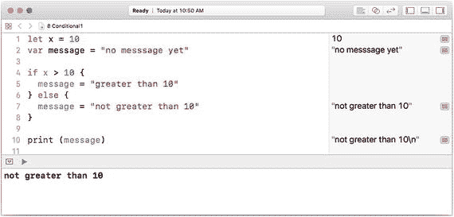

图 8-7  
探索三元运算符

你可以通过下载引言中描述的 `Conditional1` playground 来自行测试这段代码。尝试调整第一行代码中 `x` 的值以及三元运算符中 `x > 10` 的测试条件；你还可以尝试更改文本字符串。

请记住，三元运算符是单条语句内的运算符（甚至不是一条复合语句，尽管如果你试图突破这个限制，可以玩出花样并产生一些几乎无法解读的代码）。

### 切换控制

条件语句允许你分支到两个真/假条件之一；你还可以在一条或多条分支内放置条件语句，以便继续沿着各种条件的真/假路径进行分支。如果你想要实现比简单的二进制真/假分支更复杂的分支，你可能会发现自己深陷于令人困惑的嵌套分支中。你可能会意识到，你需要的不仅仅是两个选择，但 `if` 语句将你限制在一到两个选择（两个选择需要 `else` 子句作为 `if` 语句的一部分）。

switch 语句的抽象思想如下：

*   评估一个条件。
*   使用其结果来选择要执行的一条语句或一组语句。

基本思想在代码清单 8-8 的伪代码中展示如下：

```
switch  {
case : 
case : 
}
代码清单 8-8
通用 switch 语句的伪代码
```


### Swift 的 Switch 语句与其他语言的对比

请注意，整个 `switch` 语句都被包裹在定界符（在此例中为大括号）内。`switch` 语句是编写结构化代码的优秀工具，但在不同语言之间存在一些显著差异。以下列举其中几点：

*   一旦表达式被求值并与某个表达式结果匹配，该段代码就会被执行，但接下来会发生什么？在 C 语言等语言中，当 `expressionResult1` 被选中并执行后，控制权将传递给后续语句。`break` 关键字被用在 `case` 元素的末尾，使得控制权直接跳出整个 `switch` 语句。
*   `break` 语句可以出现在任何位置。如果你有五个 `case` 元素，你可以将 `break` 命令放在其中任何一个之后。你可以选择第一个 `case` 元素，执行它，然后继续执行第二个 `case` 元素，如果第二个 `case` 元素的末尾有一个 `break` 语句，则在此处终止。
*   在 ALGOL 和 Pascal 语言家族（包括 Swift）中，选择仅限于执行单个 `case` 元素。可能不需要 `break` 语句。（Swift 就是这种情况。）
*   整个语句可能被称为 `switch`、`case` 或 `select`。
*   `case` 元素通常被称为分支，并由关键字 `case` 标识。
*   某些语言（包括 Swift）允许你修改选择某个 `case` 元素的条件。
*   许多语言需要一个特殊分支（通常称为 `default`），当没有 `case` 元素匹配表达式结果时执行该分支。

这些差异很大程度上可能源于以下事实：尽管该语句功能强大，可以帮助你创建更具结构性和可读性的代码，但开发人员迅速添加了额外功能，并且这些功能并不一致。这可能与这些语句开发的时期有关——那是一个（20 世纪 60 年代）语言开发和修改频繁的时代。

### 探索 Swift Switch 语法

Swift 的 `switch` 语句具有高度结构化和强大的功能。如果你熟悉其他语言的 `switch` 语句，它对你来说可能是新颖的，因此这里提供了基本的 Swift 语法，并将在接下来的"使用枚举"部分继续介绍。

基本的 Swift 语法如代码清单 8-9 所示。它与代码清单 8-8 中的通用伪代码相同，但包含一个 `default` 语句。在 Swift 中，`default` 语句是必需的，其解释可能与你习惯的其他语言不同。

Swift 的 switch 语句必须是穷尽的。这意味着如果控制表达式是某种类型，那么 `default` 语句适用于该类型中除 `case` 语句中标识的之外的所有元素。

```
switch <#表达式#> {
case <#值 1#>: <#语句#>
case <#值 2#>: <#语句#>
default: <#语句#>
}
```

代码清单 8-9
基本的 Swift switch 语句

这意味着控制表达式必须有一个类型（所有表达式都有隐式或显式的类型）。在 Swift 中，`break` 语句不是必需的：一个 `case` 表达式执行后，会被下一个 `case` 元素或 `switch` 语句的结束终止。

在 Swift 中，你可以让单个 case 元素处理多个值。只需像这样组合 case 元素：

```
case "result1", "result2":
```

在某些其他语言中，你可能习惯于不同的写法；以下代码在 Swift 中无法工作，因为控制权不会从一个 case 元素传递到下一个。它会被下一个 `case` 元素终止。

```
case "result1":
case "result2":
```

你还可以对 case 元素使用许多其他条件。以下两节将介绍其中两种。

### 使用高级 Switch Case 元素：范围

代码清单 8-10 展示了在 Swift switch 中使用范围的示例。代码首先声明了一个可选的变量（`myUserID`），它是一个 `Int` 类型。

它被设置为 6，因此它有一个值，但请注意，如果它没有被设置（即未设置的可选值），这段代码仍然会正常运行，不会导致错误。它使用可选绑定来（如果可能）将 `userID` 设置为 `myUserID` 的解包值。

注意：关于可选值和可选绑定的更多内容，请参见第 9 章。

现在，switch 语句使用 `userID`（`myUserID` 的解包值）来选择要执行的 case 语句。在本例中，case 是使用 Swift 范围定义的：

```
5..<9
```

这个 Swift 语法表示范围介于 5 和 9 之间。请注意，该范围由三个字符组成：两个句点后跟一个 `<`。它并不是由三个字符后跟一个 `<` 组成。

```
var myUserID:Int?
myUserID = 6
if let userID = myUserID {
    switch (userID) {
    case 5..<9: print ("第一个示例:" + String(userID))
    default: print ("未知 ID")
    }
}
```

代码清单 8-10
在 Swift switch 中使用范围

你可以从图 8-8 中看到代码的实际运行效果。

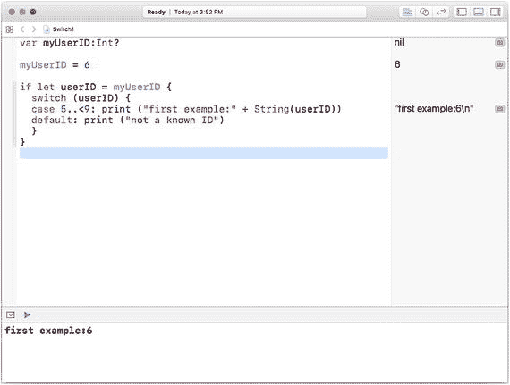

图 8-8
在 Swift switch 中使用范围

### 使用高级 Switch Case 元素：Where 子句

你还可以在 case 元素中使用 `where` 来创建复合条件，如代码清单 8-11 中的代码所示。

```
var myUserID:Int?
myUserID = 6
if let userID2 = myUserID {
    switch (userID2) {
    case 5..<9 where userID2 < 7: print ("优选用户:" + String(userID2))
    case 5..<9: print ("非优选用户:" + String(userID2))
    default: print ("未知 ID")
    }
}
```

代码清单 8-11
在 Swift switch 中使用 where 子句

此代码建立在前面代码清单 8-10 所示的代码基础上。这里，范围条件被使用了两次。第一次，添加了一个 `where` 子句来细化 case 条件。第二次则没有 `where` 子句。

请注意，这些 case 是按顺序逐一评估的。如果你颠倒它们的顺序，使得 `where` 跟在无条件 case 之后，如代码清单 8-12 所示，那么无条件 case 将被使用，而 where 子句将永远不会被用到。

```
if let userID2 = myUserID {
    switch (userID2) {
    case 5..<9: print ("非优选用户:" + String(userID2))
    case 5..<9 where userID2 < 7: print ("优选用户:" + String(userID2))
    default: print ("未知 ID")
    }
}
```

代码清单 8-12
在 switch 语句中颠倒 where 和通用 case 的顺序

此代码的执行情况如图 8-9 所示。

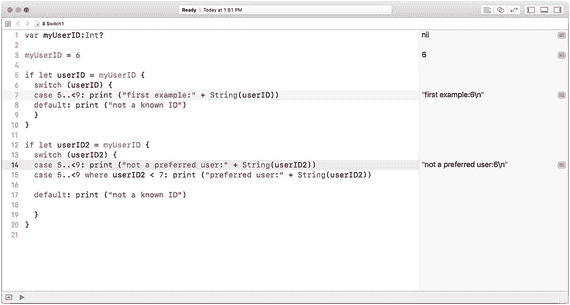

图 8-9
在 Swift switch 中使用 where 子句


## 使用枚举类型

正如 Swift 的 `switch` 语句建立在许多语言中已有的 `switch` 语句之上，Swift 的枚举（`enums`）同样也建立在其他语言的枚举基础之上。枚举类型（通常简称为 `enums`）正如其名：一种通过枚举其值来构建的类型。

枚举类型最常见的例子是 `Suit`，它具有 `Clubs`、`Spades`、`Hearts` 和 `Diamonds` 这些值。在许多编程语言（特别是 C 语言）中，枚举类型的顺序很重要，因为一个整数值可以被推断出或分配给每个类型值。因此，在 `Clubs`、`Spades`、`Hearts` 和 `Diamonds` 这个例子中，其默认值如下：

```
Clubs = 0
Spades = 1
Hearts = 2
Diamonds = 3
```

你也可以按任何你想要的顺序显式地赋值。`enum` 的选项（case）不是字符串，因此它们不需要引号。你可以使用 `enum` 选项来访问它们的整数值。这意味着你可以在上面的例子中使用 `enum` 选项 `Hearts` 作为 2。

这种方式只在一个方向上有效：你不能使用 2 来表示名为 `Suits` 的 `enum` 中的 `Hearts` 选项。不过，你可以编写一个小的函数来将整数转换为 `Suits` 的名称。这种反向转换（从整数到 `enum` 选项名称）的一个原因是：`enum` 的整数在命名空间中不唯一：`enum` 选项 `Spades` 的值可以是 1，而另一个具有 `Flowers` 选项的 `enum`，其 `Geraniums` 选项的值也可以是 1。

因此，许多人主要将 `enums` 视为使用整数来表示文本值（选项名称）的方式，以创建有时被称为自文档化的代码。（另一些人则认为这是个玩笑。这是一个存在争议的领域。）

### Swift 处理枚举类型的方法

Swift 将枚举类型提升为一等类型，而不仅仅是类型或文档的快捷方式。在 Swift 中，选项名称（与其他语言一样）不是带引号的字符串。在某些情况下会使用自动赋值的概念，但你可以为每个选项分配一个`原始值`。该原始值可以是整数（如大多数语言），但也可以是字符串、字符或数字——甚至可以是浮点数。

Swift 的 `enum` 风格是 `enum` 名称首字母大写，选项值使用小写，如下所示。

```
enum Suit {
    case club
    case spade
    case heart
    case diamond
}
```

### 将 Swift 枚举与 Switch 语句结合使用

由于 Swift 中的 `enum` 比许多其他语言结构更严谨，因此它们非常适合 Swift 的特性，例如要求 `switch` 语句的 `case` 分支必须是穷尽的。你可以使用 `enum` 来赋值，如下面的代码行所示，该行将 `Suit` 这个 `enum` 的 `club` 选项赋值给一个名为 `cardSuit` 的常量：

```
let cardSuit = Suit.club
```

然后你可以开始创建一个使用 `cardSuit` 的 `switch` 语句。如果你尝试闭合这个 `switch` 语句，将会收到一个错误，如图 8-10 所示。

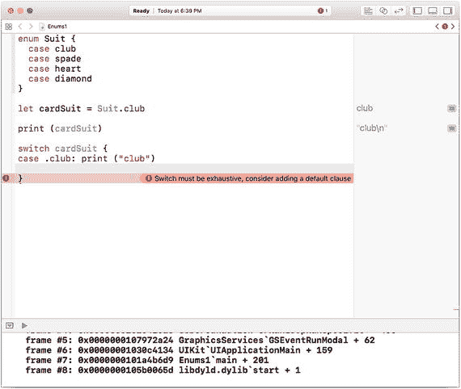
图 8-10 Swift 标记出非穷尽性的 switch 语句

这个错误信息之所以可能，是因为 Swift 会跟踪每个 `enum` 的选项。如果你遵照提示信息并输入其他选项，错误就会消失，如图 8-11 所示。

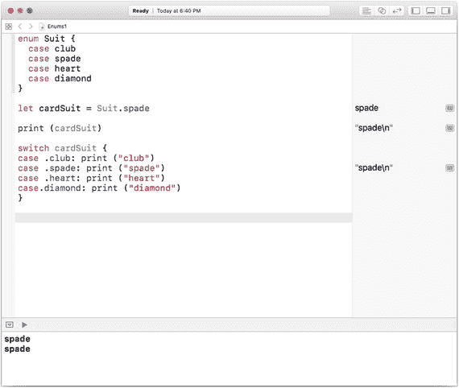
图 8-11 使用枚举创建穷尽性的 switch 语句

除了为 `switch` 语句的每个选项打印一条消息外，你可以利用 `enum` 是成熟类型这一事实，更普遍地引用它们，而不是像图 8-11 或代码清单 8-13 中那样打印出选项元素的名称。

```
switch cardSuit {
default: print(cardSuit)
}
```
代码清单 8-13 简化 switch 语句

在代码清单 8-13 中，所有控制流都经过 default 分支，你甚至根本不需要这个 `switch`。你可以用一行代码实现相同的结果：

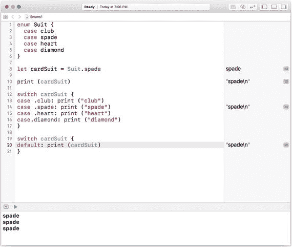
图 8-12.

```
print(cardSuit)
```

你可以设置一个 `enum` 的原始值。如前所述，原始值可以是数字（整数或浮点数）、字符、字符串或其他值。你只需在 `enum` 声明中添加它，如代码清单 8-14 所示。

如果你这样做了，那么你可以通过访问 `enum` 的 `rawValue` 属性来检索它，例如：

```
cardSuit.rawValue
```

本章前面给出的例子在图 8-13 中进行了更新，以展示如何打印原始值。你可以出于任何目的访问原始值——不一定是为了打印。你可以使用数值进行计算，也可以为选项名称添加有意义的字符串。

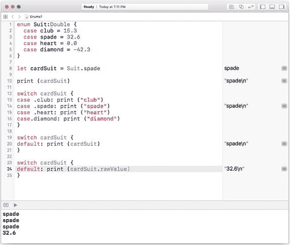
图 8-13 显示枚举的原始值

```
enum Suit: Double {
    case club = 15.3
    case spade = 32.6
    case heart = 0.0
    case diamond = -42.3
}
let cardSuit = Suit.spade
print(cardSuit)
print(cardSuit.rawValue)
```
代码清单 8-14 在枚举中使用原始值

## 探索重复和步进

大多数编程语言支持多种重复运算符。你在第 5 章“管理控制流：重复”中看到了基础知识，但这里是对常见重复变体的概述。（所有这些在 Swift 中都是可用的，并且，在偶尔修改后，在你可能使用的大多数其他语言中也是如此。）

有两种基本类型的重复循环：`while` 循环和 `for` 循环。所有这些循环都会重复执行一条语句或复合语句。`while` 循环依赖条件语句进行控制，而 `for` 循环则依赖数据结构进行控制。

> **注意：** 重复是对一条语句或复合语句的重复执行。为简化文本，本节提及语句，但请放心，你可以将单个语句替换为用花括号 `{ }` 括起来的复合语句，正如本章前面（“使用复合语句”）所讨论的那样。

### While 和 Repeat-While 循环

`while` 循环有两个部分：一个为真或假的条件，以及要重复执行的语句。`while` 循环的行为略有不同，具体取决于条件是出现在语句之前还是之后。

如果 `while` 语句开始执行时条件为假，那么差异就变得明显了。对于一个初始为假的条件，以下循环不会执行。代码的执行方式与自然语言中的方式相同。因为 `while` 的条件不为真，所以它不会执行。当条件变为假时，`while` 循环终止。

> **注意：** 如果条件永远不会变为假，循环就会变成无限循环，永不停止。如果你的应用程序逻辑使得条件不会改变，那么你需要的不是 `while` 循环，而是 `if` 语句。

```
while <condition> {
    <statements>
}
```

`while` 语句的另一个版本至少会执行一次。以下是基本代码：

```
repeat {
    <statements>
} while <condition>
```

这个循环总是至少执行一次。

### For-In 循环

这些重复依赖集合（数组、字典或集合）。主要的 `for-in` 循环依赖迭代和枚举。


#### 遍历集合

最简单的版本就是简单地循环遍历集合（这被称为迭代）。代码清单 8-15 展示了三个简单的集合（一个数组、一个字典和一个集合），以及如何使用相同的语法对它们进行循环遍历。

```
let myArray = ["dog", 4.6] as [Any]
let myDictionary = ["name": "Rover", "weight": 20.5] as [String : Any]
let mySet = ["name", "weight"]
for arrayItem in myArray {
print (arrayItem)
}
for dictionaryItem in myDictionary {
print (dictionaryItem)
}
for setElement in mySet {
print (setElement)
}
Listing 8-15
Using for-in loops for collections
```

你可以在图 8-14 所示的 Playground 中看到这一点。

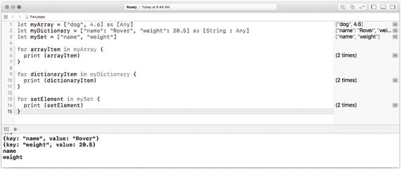

图 8-14

在 Playground 中探索循环

这种遍历方式非常常见，当你只想依次处理集合中的每个元素时，它就能派上用场。

#### 遍历索引（数组）和键（字典）

对于数组和字典，有时你不仅需要元素的值，还需要它的索引（对于数组而言）或其键（对于字典而言）。

> **注意：** 由于集合是无序的，没有键或索引可供使用，因此你只能像上一节所述那样遍历集合元素。

正如上一节所述，遍历集合元素与枚举这些元素之间是有区别的。在本节中，你将看到如何枚举一个数组。这种枚举会提供数组的每个元素及其对应的索引。（请记住，数组索引是数组结构本身的一部分，而非数据的一部分。）

内置函数 `enumerated` 会为数组的每个元素提供元组。每个元组由数组索引和值组成。如果你对数组调用 `enumerated()`，你将看到如图 8-15 所示的这些元组。请注意，之前使用的数据已更改，在数组中增加了第三个元素（`cat`）。Playground 中的数据查看器会显示包含这三个元素的数组。如果你点击展开三角形打开它，就会看到三个索引及其关联的值。

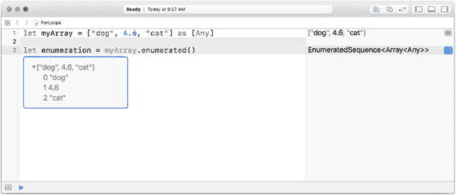

图 8-15

在数组上调用 `enumerated()` 的结果

如果你想使用这些枚举值，可以使用如下代码来显示它们。首先，在数组 `myArray` 上调用 `enumerated` 函数。然后，`for-in` 循环对 `myArray.enumerated()` 的结果进行操作。每个元组中的两个值都会被打印出来。

```
for (index, item) in myArray.enumerated() {
print ("index: " + String(index) + " item:" + String(describing: item))
}
```

你使用的元组名称无关紧要，因为重要的是元组中元素的顺序。如果你想这样修改代码，它仍然可以正常工作（只要你更新 `print` 语句以匹配你为元组值赋予的名称）。

需要注意的重要一点是，由于你处理的值不全是字符串，你可以接受 Xcode 中提供的 Fix-It 建议，将数字转换为字符串。这些建议依赖于 `String(describing:)` 函数，正如本节代码中所看到的那样。

要对字典进行类似的枚举，你不需要调用 `enumerated`，因为字典中的键值对本身既包含键也包含值。因此，你可以像这样直接为元组值命名：

```
for (key, value) in myDictionary {
print ("key:" + key + " value:" + String(describing: value))
}
```

本节中的代码显示在代码清单 8-16 中。

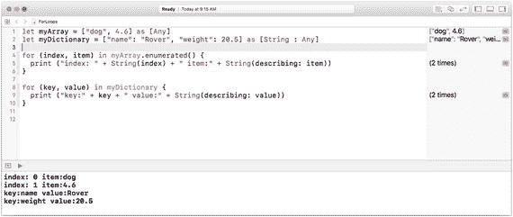

图 8-16

展示字典的键和数组的索引

```
let myArray = ["dog", 4.6] as [Any]
let myDictionary = ["name": "Rover", "weight": 20.5] as [String : Any]
for (index, item) in myArray.enumerated() {
print ("index: " + String(index) + " item:" + String(describing: item))
}
for (key, value) in myDictionary {
print ("key:" + key + " value:" + String(describing: value))
}
Listing 8-16
```

### 使用步长（Strides）

除了内置的重复结构（`for-in` 和 `while`），Swift 标准库还包含一些在这些场景中常用的函数。你已经见过了 `enumerated()` 函数，其他函数也值得探索。你可能会发现标准库中一个有用的函数是 `stride(from:to:by:)` 函数。这个函数可以被遵循了 `Strideable` 协议的类型所采用。你不必过于担心这具体意味着什么，只需记住那些遵循 `Strideable` 的类型列表：

- `CGFloat`
- `Decimal`
- `Double`
- `Float`
- `Float80`

在处理这些类型的数组时，你可以应用两个 `stride` 函数：

```
stride (from: to: by:)
stride (from: through: by:)
```

它们之间的区别在于是否将上限值包含在步长范围内（`through` 包含，`to` 不包含）。使用 `stride`，你可以实现一些你可能习惯的 C 语言风格的循环（具体来说，不仅可以指定从某个值到某个值，还可以使用步长，而不仅仅是递增 1）。

## 总结

本章深入探讨了一些许多语言通用的基础计算机科学原理。在讨论的两个主题（枚举和 switch 语句）中，你看到了 Swift 如何扩展通用功能，以及如何使通用特性得到更严格定义和使用。

在了解了数据与类型以及控制流程之后，你已经掌握了计算机科学的许多基础知识。下一步是学习如何存储和检索数据。毕竟，如果没有这些功能，用户每次运行应用时都只能从头开始。


