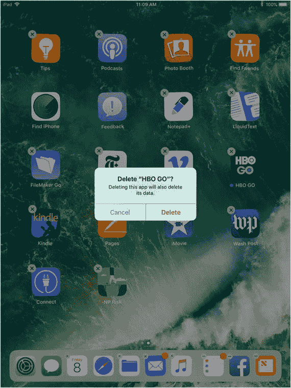
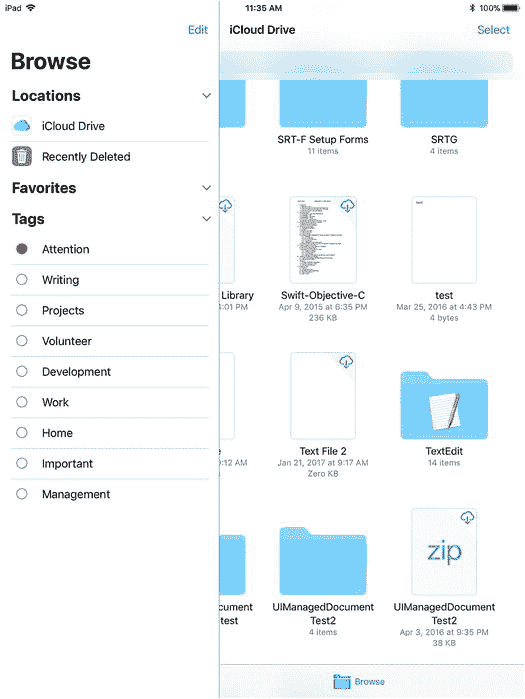
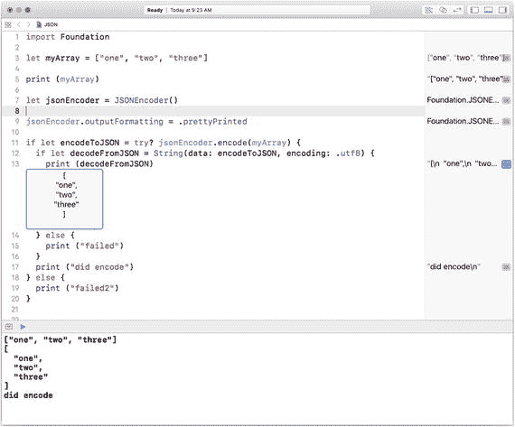
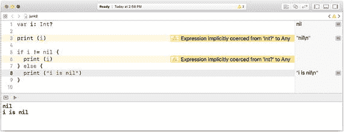
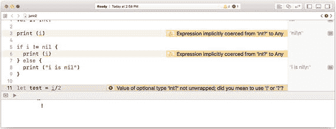
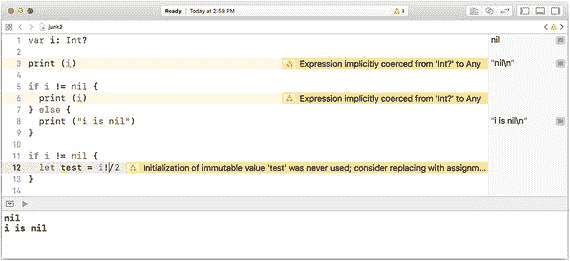
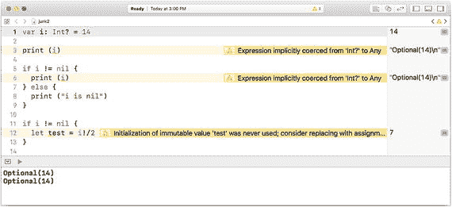
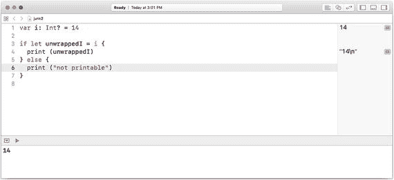
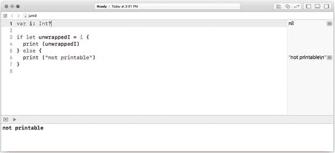

# 9. 存储数据与共享数据

计算机科学的核心在于一个标准短语：计算机的设计与应用。尽管早期已有类计算机设备的雏形（例如 19 世纪 30 年代查尔斯·巴贝奇的分析机、1804 年的雅卡尔织布机，以及 20 世纪 30 年代至二战期间因图灵的突破而发展的恩尼格玛密码机），但现代计算机时代实际上始于 20 世纪 40 年代。这一时期取得的重大飞跃是硬件领域的显著进步，而可以说，最具里程碑意义的突破是编程语言和编译器的开发——这使得计算机能够根据人类编写的类英语代码自动生成指令。（关于软件方面的更多细节，可上网查阅格蕾丝·霍珀及其同事的相关资料。）

即便在 20 世纪 70 年代末个人计算机问世、20 世纪 90 年代互联网兴起之后，随着新技术和新能力的涌现，计算机科学的基础并未发生根本改变。但有一项变化——相当戏剧性的变化——是数据的存储与共享方式。

尽管计算机硬件的进步时常在媒体上被大张旗鼓地宣扬，但许多人对数据相关的变革却兴趣寥寥。事实上，很多人将数据及数据管理视为计算机科学领域中近乎琐碎的环节。哦，没错，确实有数据需要存储在某个地方，但让我们先关注 3D 打印、社交媒体这类激动人心的事物，暂且把那些平凡的数据存储搁置一旁吧。（随便找一位数据管理专家聊聊这个话题，你很可能会引发一场关于此事的滔滔不绝的评论狂潮。）

数据的作用对计算机科学及其应用至关重要，而这种作用的演变方式直到最近才引起少数人的关注。本章将探讨计算机科学中的数据问题，分为四个部分，分别对应数据的四大核心关注点：

-   数据是什么？所有应用都会生成、消费和存储数据。你或许认为自己的应用是例外，但若审视其生成、消费和存储的所有数据，便不存在例外。
-   数据存储在哪里？除了由硬件和软件按需生成的数据外，支撑应用运行的数据需要存储在某个位置。有时应用正在创建数据，此时数据通常也需要存储，即便只是临时存储在系统或应用内置的某个暂存区域。
-   谁负责管理数据？数据是静态的，还是定期更新（如果是，由谁更新）？数据归谁所有（在很多情况下这并非易事）？有哪些流程确保更新、数据完整性和安全性？
-   数据如何管理？这个问题涵盖从电子表格数据格式到数据库管理系统，以及大数据新领域中的各项议题。

> **注意**
> 本章与本书其他章节略有不同，因为它不会向你展示要编写的代码——因为多数议题的层次高于代码层面。事实上，可以说数据管理的问题至少与创建、管理和使用数据的代码同等重要。但无论你对代码与数据相对重要性持何种观点，二者都至关重要，在 21 世纪的计算机科学方法中缺一不可。或许五十年前，当“数据”意味着成箱的穿孔卡、成卷的磁带，以及成堆等待键盘穿孔的纸质文件时，人们确实可以无视所有数据来研究计算机科学。但如今已不再可能。正如 20 世纪 40 年代计算机编程先驱们所理解的，计算机处理代表数字的代码，与处理代表程序逻辑和指令的代码一样轻松。在许多方面，数据与代码是可以互换的。这正是格蕾丝·霍珀的启示：正是这一点使得编译器成为可能。

## 数据是什么？

如果你认为这个问题的答案很简单，请三思。当你阅读、收听或观看关于数据泄露、黑客攻击或系统故障的新闻时，常常会看到一些你从未考虑过的数据被提及。当你开始思考某个应用所使用的（创建、生成或管理的）数据时，你首先会清晰地想到该数据的各个方面。

新闻报道经常揭示的是许多数据管理者早已熟知的事实：应用数据只是冰山一角。用户使用应用的时间和地点在很多情况下至关重要，这些信息也属于应用数据的一部分。（如果你不信，可以关注新闻，看看调查人员在搜索嫌疑人手机、桌面或其他设备上的数据时，究竟在寻找什么。）

发送到应用或从应用发出的数据可归入“应用数据”类别。同样属于应用数据类别的，还有应用商店中的应用描述，以及媒体（包括社交媒体）上关于该应用用途和使用方式的评论。

所有这些都构成了“应用数据”，并以不同方式对各类人群产生影响。普通用户在常规使用中接触的数据，只是应用数据的一部分。

无论你是用户、开发者，还是需要管理应用及其数据的管理者，每个人都必须意识到这些数据的存在。每个角色都需要思考应用数据。先从设计师或开发者入手。如果你开始思考这些数据，你可能会认定自己无法控制谁在记录用户何时何地使用你的应用。

这种想法是错误的。

使用记录部分由应用本身生成，作为开发者或设计师，这是你的责任。如果你的应用以“欢迎回来！”的消息迎接回头客，这或许是个友好的问候，但为了实现这一功能，作为开发者的你必须存储区分首次用户和回头用户的信息。这样一来，你就在存储可能对你的用户（以及其他人）重要或不重要的信息。这类设计决策的每一个都会影响应用数据。

在某些情况下，这显然无关紧要，而在另一些情况下则至关重要，用户也心知肚明。如果你的应用按次收费，那么记录使用次数是合理的。总的来说，许多安全与数据管理专家建议：只存储你需要的数据，不存储任何多余数据。“说不定将来有用”绝非存储数据的充分理由。记住：未存储的数据不会被盗取，不会产生混乱或被损坏，而且——或许最重要的是——不会占用设备和云端的宝贵存储空间。

许多开发者都惊讶于客户带着一长串数据清单，坐下来讨论新项目或新应用需要存储哪些数据。当开发者询问客户数据将存储在哪里时，回答往往是“在应用里”，有时是“在云端”。在项目深入之前，务必确保你确切了解数据将存储于何处。当你聚焦于数据存储的细节时，客户往往才开始明白其中涉及的内容。你可以为他们提供数据存储和维护的预估成本，而很多时候，存储大量“或许将来有用”的数据的需求就会减少或消失。

记住：只存储你需要存储的数据，其他一概不存。翻阅著名计算机科学项目的历史，你会发现不少因数据存储方案过于野心勃勃而遭遇挫折的项目，这样的例子比比皆是。

厘清数据及其存储的必要性并不意味着你就不该存储数据。在大多数情况下，你必须存储并使用数据，只是要保持谨慎。


## 数据存储在哪里？

如果从广义角度看待应用数据，你很快会发现它存储在许多地方，因为使用数据最终可能会被互联网服务提供商以及运行应用过程中的所有中间参与者所存储。即使在没有网络连接的专用个人设备上，使用数据也很有可能以某种形式存储在设备中。不过，除了这些情况，你可以关注应用自身数据的存储位置——即环境数据和使用数据之外的数据。

这类数据不同于应用运行时使用的数据（即第 7 章讨论的堆栈和堆位置）。这是应用可能存储的数据，用于记录游戏分数或移动步骤，管理从文字处理文本、电子表格数据，甚至应用录制的音乐或视频等各类数据。这些数据需要存储在某个地方，以便用户在需要继续使用时（甚至想要删除时）能够再次访问。

术语`持久化存储`常被用于描述此类数据存储。该术语源于对存储设备的描述——即使断电也能保留数据。如果关闭磁盘驱动器，再次开启后仍可使用数据，这就是持久化存储。如果数据存储在设备的堆栈和堆内存中，当应用停止运行或设备断电时，数据就会消失——这是非持久化的。

**注意**

这些都是概念。由于人们通常期望数据具有持久性——即使实际存储设备或介质不可用，硬件和软件开发人员仍有办法在物理存储不可用时保持数据可用，因此你可能会在看似非持久化的存储中观察到持久化现象。

应用数据主要可以存储在以下三个位置（即大多数用户和开发者想到应用数据时所指的数据）：

*   应用运行时在设备上的存储空间。
*   设备上属于应用的持久化存储空间。
*   设备上为所有应用提供的通用存储空间。
*   专为存储而设计的存储中心（Google Drive、Apple iCloud、Microsoft OneDrive 和 Azure、Dropbox 等）。

### 在非持久化应用存储中存储数据

应用在运行时会获得可供其使用的存储空间。这些空间是非持久化的，应用停止运行或设备关机后数据不会保留。事实上，计算机存储虽然比过去便宜，但仍是昂贵且稀缺的资源。操作系统会尽可能重复利用这些存储空间。为了能够重复利用数据存储，操作系统会跟踪不再需要的数据。当你“删除”数据时，通常会使操作系统将数据标记为可删除状态：操作系统通常不会真正擦除数据。

**注意**

有些选项可以真正删除数据，而不仅仅是将其标记为可重复使用的存储空间。实际上，安全删除通常会在待复用的存储位置上写入随机或已知模式的数据——有时会重复多次。数据一旦写入某处，真正清除它其实非常困难。

尽管某些情况下实际情况可能不同，开发者通常将应用存储视为非持久化的。要在应用结束后存储数据，或将其发送到其他设备或应用，需要采用其他技术。

### 在持久化应用存储中存储数据

iOS（包括 Swift）的存储模型具有专用的持久化应用存储。这部分存储空间分配给应用使用，应用及其开发者可以自主处理该存储空间（尽管存在大小限制）。当你从设备上删除应用时，这些存储空间会被清除，如图 9-1 所示。



图 9-1

在 iOS 上删除应用会同时删除其数据

### 在设备上应用存储之外存储持久化数据

从大型机超级计算机到最小的智能手机，所有计算机上的应用都能对持久化存储进行读写操作。这种通用能力会受到限制——并非所有应用都能使用这些功能。通常情况下，以这种方式在设备上存储数据是存储特定于设备、应用和用户数据的正确方法。例如，你可以利用可用存储空间来存储游戏分数、用于分析的数据或其他任何用途。

应用的这些存储位置常被称为`沙盒`。在限制应用读写数据的诸多措施中，最常见的是将读写操作限制在应用的沙盒范围内。

**注意**

“`沙盒`”一词有多种含义。它可以指应用和项目的测试区域，例如让你测试与 eBay、Amazon 等集成的沙盒。在这种沙盒中，你可以实际测试购买等操作，而不会真正从信用卡扣费。沙盒也常指应用的运行时非持久化数据存储，如上一节所述的堆和栈。沙盒还可以指仅特定设备上的特定应用（或使用共享用户标识符如 AppleID 的共享设备）可以访问的持久化存储。

### 在共享存储位置存储数据

一旦将视野扩展到应用运行所在的设备之外，你会有许多数据存储位置可供选择。Dropbox 和其他云服务是常见的资源。自 iOS 11 起，iOS 上的“文件”应用会向你展示各种文件位置，如图 9-2 所示。如果你有 Dropbox 或其他账户，它们会出现在“位置”中。集成的用户界面让用户无论文件在哪里都能看到文件及其位置。（请记住，这些都是持久化存储位置。）



图 9-2

使用“文件”在 iOS 设备上管理文件和位置

## 谁负责管理数据？

如果你已经确定了应用的数据及其存储位置，仍有两个问题需要解决：谁负责管理数据，以及数据如何管理和格式化。谁负责管理数据（本节讨论的内容）这个问题非常不涉及技术层面。

如果你编写了一个让用户存储某些数据的应用——例如记录野生动物目击事件及其日期、时间、照片和评论——那么谁负责管理这些数据？谁拥有它？谁可以使用它？这些问题有很多。

尽管计算机科学传统上聚焦于计算机和计算机软件的设计与实现，但从事计算机科学领域工作的人越来越多地被要求处理此类数据问题。这些问题的答案可能很复杂（在很多情况下，对于答案是什么甚至没有共识）。

在开发者、设计师、用户、管理者以及所有其他参与者的日常计算机科学实践中，本章讨论的数据问题可能尚未得到解决。部分原因在于缺乏最佳实践，甚至缺乏意识到这些问题存在的人。

在出现明确的指导方针和标准之前，本章讨论的数据问题的处理方式似乎非常随意。许多业内人士认为，除非特定项目有其他指导和标准，否则每个项目都应有某人提出此处讨论的问题，并努力确保在每个项目中对这些问题加以解决。


### 数据所有权

数据所有权涉及多个方面。最基本的是，谁拥有以法律权利发布（或不发布）数据，以及允许（或不允许）通过出版以外的方式访问数据的权利。

在当今世界，这可能没有简单的答案，但我们日益发现数据所有权的具体方面正得到解决。在具有不同法律效力的文档和协议中，人们每次在社交媒体网站上发布或查看数据时，都依赖于关于所有权的陈述。

当数据被用于新的用途时，所有权问题常常会出现。如果你使用一个应用来追踪你的野生动物 sightings，你可能会认为你的数据就是你的数据，仅此而已。然而，如果你的数据与其他人的野生动物 sightings（也许有数百万人）汇总在一起，那么这些数据就可能具有巨大价值。这种价值对科学家和市场营销人员都可能有用。在其汇总形式下，你发现的一只黑松鼠的数据可能既实用又有价值。

在构建和管理应用时，对数据所有权的意识通常需要被内置到应用中。谁才是数据所有者的问题可能无需解决，但越来越多的应用在设计时就考虑到，一旦数据的价值变得显著，应用能够支持从该价值中获利所需的功能。

实现这些结果的方式并不特别复杂。它们可能简单到确保应用中的数据访问受到某种机制保护，例如密码或其他凭证，以便能够根据身份、付款或其他标准来控制或授予（或拒绝）访问权限。

在很多情况下，应用的数据设计是，不是开启一个管理访问控制的选项，而是需要对数据存储和访问进行重大架构更改才能管理访问控制。

### 数据完整性

无论数据归谁所有，都需要有一个机制来确保数据的完整性。存储的数据本质上是不稳定的，仅仅因为数据从计算机到存储设备再返回的移动过程，是系统开发和集成中的薄弱环节之一。在最简单的情况下，计算机操作与数据存储之间的连接可能会因为连接丢失（或不稳定）而中断。任一设备都可能丢失或断电。

此外，数据移动的过程通常很脆弱。数据最终是一个比特序列，其完整性取决于每个比特的值在存储和传输过程中被准确保存，以及序列同样被保存下来。

在管理数据完整性方面，有三个关键工具：

*   **校验和** 用于帮助维护数据的表示。
*   **时间戳和其他数据标记** 用于记录对数据的更改。
*   **版本控制** 用于帮助识别数据的不同版本。

### 使用校验和

为此，开发人员和设计人员有许多可用的策略。最常见和最简单的方法之一是使用校验和这样的机制。在这种方法中，数据的二进制数字（或者更常见的是字节或字符）被视为二进制数字。通过操作（通常是累加）它们，并将结果存储起来。当需要验证数据时，重新累加字节或字符，并将该总和与存储的总和（校验和）进行比较。这种方法——通常通过进一步的运算如除以素数来增强——可以捕捉到常见错误，例如一长串数据中的错误比特。事实上，许多通信协议、设备和标准都允许进行此类检查，并自动重传可能损坏的数据。

对校验和的基本理解（可能只需本段这么详细的了解）是计算机科学从业者工具包的一部分。

### 使用时间戳和其他数据标记

除了比特和字节的物理完整性之外，还需要以某种方式保护数据及其变更的完整性。许多数据库设计者会自动存储数据及其更新的时间戳（日期和时间）。

时间戳通常表示为自某个已知日期以来的时间间隔，并进行存储。有几种常用的参考日期。（`纪元日期` 是一个类似的术语。）

常见的包括：

*   **1970 年 1 月 1 日午夜。** 这是 Unix（以及相关系统，如 Linux 和 macOS/iOS）中使用的参考日期。
*   **2001 年 1 月 1 日午夜。** 选择这个日期是为了反映 2001 年是 Mac OS X（现为 macOS）首次发布的年份。

参考日期之前的日期以负值的秒数表示。所表示的时间通常采用协调世界时（UTC），即以前所称的格林威治标准时间（GMT）。因此，这些时间在全球范围内是恒定的。

除了时间戳，通常还有其他数据标记用于标识数据及其变更。除了时间戳，还有一个或多个通用唯一标识符（UUID）。这些通常由操作系统提供。它们被保证在全世界范围内尽可能唯一。它们通常是比较长的字符串，你可以通过操作系统创建；你也可以在它们上面添加你自己的标识符，从而获得特定数据元素的通用唯一标识符。这些在调试时很有帮助。

你会发现有些评论说这些标记占用了宝贵的存储空间，并且创建和解码它们所涉及的计算消耗了宝贵的计算资源。

这些担忧绝对合理，但请记住，随着更强大设备的普及成为常态，它们的意义已经随着时间的推移而降低。

一套常见的数据标记通常作为大多数数据项的一部分进行存储。这些元素因项目而异，但值通常来自以下列表：

*   数据创建的时间戳（首次存储）
*   最后修改的时间戳
*   数据创建的标识
    1.  用户
    2.  设备
    3.  位置
*   数据修改的标识
    1.  用户
    2.  设备
    3.  位置
*   数据元素的通用唯一标识符。
*   数据版本。

### 版本控制

无论你多么熟练，经验多么丰富，你的数据存储设计未经修改就能一直用下去的情况是很少见的。可能存在错误，但即使没有，情况也会变化。你可能需要存储不同的数据，而你已经存储的一些数据可能变得无关紧要。

为了处理这类情况，通常为数据格式提供一个标识符——这意味着需要某种标识符来指明正在存储什么数据以及如何存储。一种常见的做法是在数据记录的开头以尽可能简单的形式存储版本标识符。一个简单的二进制数就足以进行版本管理。

如果你这样做，那么当你的应用读取（或写入）数据时，读取或写入的第一件事就是这个数字。一旦它被读取，应用就能知道该记录中还存储了什么，并且可以读取它们。

使用 `Swift` 时，通常的做法是存储版本号，然后跟一个字典（参见第 6 章“处理数据：集合”）。字典非常灵活，因此你可以在运行时确定键是什么，甚至使用版本号来告诉你它们是什么。如果键的含义随版本变化（有时是不可避免的情况），你将拥有解码或编码数据所需的所有数据。

## 数据如何管理

数据管理有两个方面需要考虑：

*   **外部数据**，在何处以及如何管理。
*   **数据的格式化和结构**。


### 管理外部数据

如果数据存储在外部，可能位于你的应用有权访问的联网计算机或磁盘驱动器上。更常见的情况是，应用将数据存储在专门为应用提供存储的外部数据提供商处。

这些是 Dropbox、Google Drive、Box、OneDrive 和 iCloud 等产品的特殊用途版本。它们主要面向需要基本文件存储的用户。

此外，还有按需托管服务，例如 Amazon Web Services (AWS)、Microsoft/Azure、Google Cloud Platform、阿里云和 IBM Bluemix/SoftLayer。这些服务之间的区别在于，它们面向的是希望直接访问数据存储而非处理文件的应用。（请注意，这只是基础概述。）

大多数现代开发环境都支持 REST 等以互联网为中心的协议，这些协议使得远程读写数据变得简单。

更重要的是，这些按需托管服务支持各种类型的软件即服务（SaaS）和存储即服务。如果你的应用突然流行起来，需要迅速大幅增加数据存储容量，这正是它们能自动处理的情况。

它们的数据农场和数据中心遍布全球，处理任务可以全天候在不同地点之间转移。这正是可快速扩展应用得以部署的方式。从应用的角度来看，存储位于单一位置，尽管实际上数据可能为了冗余备份和自动容错而广泛分布。

这让我们回到了应用数据存储位置这个基本问题。在这种现代架构中，包括你在内，可能没有人知道数据具体位于何处。

### 格式化与构建数据

使用按需云存储意味着你可以决定所使用的存储类型：该服务仅提供存储本身。

常见的存储协议和格式分为几类。

- **简单且可移植。** 最基本的格式最初来自电子表格。它们是基于文本的格式，专为行列式数据设计。最常见的两种是逗号分隔值（CSV）和制表符分隔文本。数据是基于字符的。

- **JSON。** JavaScript 对象表示法是一种基于字符的格式，将数据结构化为层级结构（例如学校中的班级，班级中的学生）。JSON 是一种基于文本的格式，因此可以使用任何处理文本的工具进行读写。有关在 Swift 4 中使用 JSON 的示例，请参阅清单 9-1 和图 9-3。

- **属性列表。** Apple 有一种属性列表（plist）设计模式，包含 `String`、`Number`、`Boolean` 类型的条目，以及集合类型 `Array` 和 `Dictionary`。这些类型可以组合，因此属性列表可能由一个字典组成，该字典本身包含多个数组和另一个字典。只要所有组件都是兼容的 plist 类型（`String`、`Number`、`Boolean`、`Array` 和 `Dictionary`），就没问题。有实用函数可以快速将属性列表与易于存储的格式进行相互转换。此外，你还可以添加自定义类型。

- **专有格式。** 传统上，这些格式用于专有应用中的特殊目的。如今，人们越来越警惕将其数据困在专有格式中。明智的消费者和管理者越来越多地倾向于使用通用格式，或者如果需要使用专有格式，则希望能够轻松地从标准格式导入和导出数据。

- **仪表盘与大数据。** 除了担心数据被困在专有格式之外，人们也认识到需要整合存储在不同系统和格式中的数据。为此，仪表盘和仪表盘工具正在被开发出来。它们接收任何格式的数据，并将其可视化和综合，以便形成统一视图。（Tableau 是一种流行的仪表盘工具。）

- **SQL 与其他数据库。** 传统数据库通常使用专有格式进行数据存储，但通过使用 SQL 作为管理和查询语言而实现了统一。数据库管理系统（DBMS）负责存储数据，但如今几乎所有的 DBMS 都提供 SQL 访问接口。通过这种方式，仪表盘和 SQL 发挥着相似的作用：为存储在各种格式中的数据提供通用访问。


### 在 Swift 4 中使用 JSON

JSON 正迅速成为数据共享最常用的格式之一。在 Objective-C 和 Swift 中，已有多个版本的代码用于 JSON 的相互转换（特别是 JSON 与 `plist` 类型之间的转换）。在 Swift 4 中，这些内置工具已被重写并简化。如代码清单 9-1 所示。

代码清单 9-1 展示了一个 Swift playground，它使用一种 plist 类型（本例中为一个数组）将其转换为 JSON，然后再转换回来。这是与电子表格、数据库甚至网页浏览器共享数据的常用方式（许多浏览器都能读取和格式化 JSON 文件）。

在代码清单 9-1 中，你可以看到 playground 的设置。请注意，必须导入 `Foundation`，但 JSON 工具不需要 `UIKit`。它们是更底层的工具。这里创建了一个本地数组，然后将其打印出来。

```swift
import Foundation
let myArray = ["one", "two", "three"]
print (myArray)
```

Swift 4 的标准库中有一个用于处理 JSON 转换的类。你需要创建该类的实例：

```swift
let jsonEncoder = JSONEncoder()
```

该 playground 的核心是两行使用 `jsonEncoder` 实例的代码。第一行是可选代码，在此例中指定 JSON 文本的格式应易于人类阅读：

```swift
jsonEncoder.outputFormatting = .prettyPrinted
```

接下来，使用 `jsonEncoder` 实例对 `myArray`（或任何其他与 `plist` 兼容的类型）进行编码。在此示例中，编码结果存储在 `encodeToJSON` 中。

```swift
let encodeToJSON = try? jsonEncoder.encode(myArray)
```

该选项会对 JSON 文本进行排版，使其更易读。在代码清单 9-1 的完整列表中，你会看到围绕这行代码的错误检查。

在代码清单 9-1 中，随后使用同一个 `jsonEncoder` 实例对 `encodeToJSON` 进行解码：

```swift
let decodeFromJSON = String(data: encodeToJSON, encoding: .utf8)
```

`UTF8` 编码是一种常用的标准文本编码。你可以在文档中找到其他编码值。

考虑到你可以将大型数组和字典编码和解码为文本进行读写，这为你提供了一种非常强大的数据管理方式，可以将数据存储起来，供其他设备上的其他应用读写。

```swift
import Foundation
let myArray = ["one", "two", "three"]
print (myArray)
let jsonEncoder = JSONEncoder()
jsonEncoder.outputFormatting = .prettyPrinted
if let encodeToJSON = try? jsonEncoder.encode(myArray) {
    if let decodeFromJSON = String(data: encodeToJSON, encoding: .utf8) {
        print (decodeFromJSON)
    } else {
        print ("failed")
    }
    print ("did encode")
} else {
    print ("failed2")
}
```
代码清单 9-1  
JSON 的相互转换

图 9-3 展示了添加了错误检查代码后的 playground 代码。



图 9-3  
在 Playground 中编码和解码 JSON

```swift
import Foundation
let myArray = ["one", "two", "three"]
print (myArray)
let jsonEncoder = JSONEncoder()
jsonEncoder.outputFormatting = .prettyPrinted
if let encodeToJSON = try? jsonEncoder.encode(myArray) {
    if let decodeFromJSON = String(data: encodeToJSON, encoding: .utf8) {
        print (decodeFromJSON)
    } else {
        print ("failed")
    }
    print ("did encode")
} else {
    print ("failed2")
}
```
代码清单 9-2  
编码/解码 JSON（Swift 4）

## 处理不存在的数据：Swift 可选值

计算机科学中最棘手的问题之一是如何处理不存在的数据。这指的是数据缺失或因任何原因不存在的情况。如果保留数据为空白，当字段通常是数值型时，它可能会被解释为零。将空白字段计为零会在计算平均值时产生偏差。当然，你可以直接忽略空白字段以保持平均值准确，但这样你就无法指示数据因合理原因而缺失。例如，传感器或仪表的读数缺失，可能是因为遥测或电源故障。如果零是有效读数，那么就无法区分“零表示缺失”和“零就是数值本身”。

你总是可以选择另一个特殊数字来表示缺失数据。但无论你选择哪个数字，都可能影响计算结果。（许多大型机程序使用 99 表示缺失数据，包括年份数据。）值为 99 的年份在 20 世纪 60 年代编写这些程序时是难以想象的。到了 20 世纪 60 年代，金融机构发行了 30 年期的抵押贷款和债券，这些债券将在 1999 年或之后到期，这个问题逐渐演变成了“千年虫”问题。

表示缺失数据的唯一方法是具有某种指示数据是否“真实”的值。不同的语言和系统以不同的方式处理这个问题。Swift 使用可选值。

可选值用问号表示；它表示数据属于指定的类型，但可能根本不存在。因此，声明一个可选的 `Int` 类型可以写为：

```swift
var i: Int?
```

该变量可以有任何有效的整数值；也可以没有值。这由 `nil` 表示，例如：

```swift
i = nil
```

你可以使用如下代码来测试变量是否为 `nil`：

```swift
if i != nil ...
```

在图 9-4 中，你可以看到一个声明的可选 `Int` 变量。它没有被设置为任何值，因此其值为 `nil`（你可以在图 9-4 右侧的侧边栏中看到）。



图 9-4  
测试可选值

你可以测试它是否不为 nil（第 5 行），如果是，则将其打印出来。否则，打印一条消息表明它是 nil。

如果你试图将可选值用于任何目的，将会遇到错误，如图 9-5 的第 11 行所示。大多数情况下，这是由 playground 或 Xcode 生成的：它甚至无法编译，如图 9-5 所示。



图 9-5  
尝试使用 nil 值

如果你测试后确认该值不为 nil，那么你就可以像图 9-6 中那样继续使用它。



图 9-6  
使用可选值

即使一个变量被声明为可选，你也可以设置其值。之后，如果测试它是否为 nil，它将不会是 nil，因为它已经有了一个值，如图 9-7 所示。在图 9-7 中，你可以看到调试窗格将解包的值显示为可选值。



图 9-7  
使用可选绑定

除了测试可选值是否为 `nil`，你还可以使用 Swift 的可选绑定。这允许你编写可能因部分内容为可选而失败的代码。如果因某个值为 `nil` 而失败，则失败是优雅的。如果非 nil，则代码继续执行。例如，在图 9-8 中，第 3 行的代码开始进行可选绑定：

```swift
if let unwrappedI = i {
```


这段代码将声明为整数的值`i`取出，并尝试将该值赋值给新变量`unwrappedI`。如果`i`为`nil`，则将`unwrappedI`设置为`nil`的值会失败，整个子句将为`false`。因此，如果此代码片段中的`i`为`nil`，则计算结果为`false`：

```
if let unwrappedI = i
```

执行将继续到打印“i is nil”的`else`子句。

检查可选类型内部是否有值的过程称为**解包**。解包有两种方式：

- `!` 是强制解包。可选类型被视作其底层值。如果它恰好是`nil`，你很可能会遇到错误。
- `?` 是条件解包，用于可选绑定。

图 9-8 展示了当可选类型`i`在第 1 行被设置为一个值时，这段代码的行为。



**图 9-8** 解包一个值

在图 9-9 中，你可以看到当可选类型没有值时代码是如何运行的。



**图 9-9** 保持可选类型包装状态

## 总结

管理应用程序数据是计算机科学项目中至关重要的一部分，尽管有时它被认为是理所当然的。在本章中，你了解了在计算机科学项目中必须注意和规划的基本问题。本章中的大多数问题并非基于代码：它们是数据管理和所有权的基本问题。

如果你想回到编码的具体细节，不必担心。下一章（第 10 章“构建组件”）包含了大量代码，可以帮助你理解和构建可用的项目和组件。

