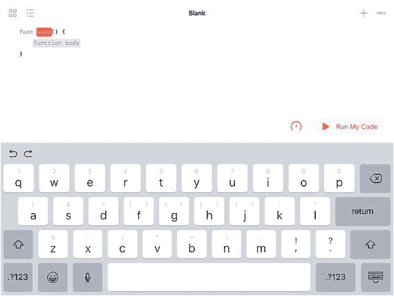
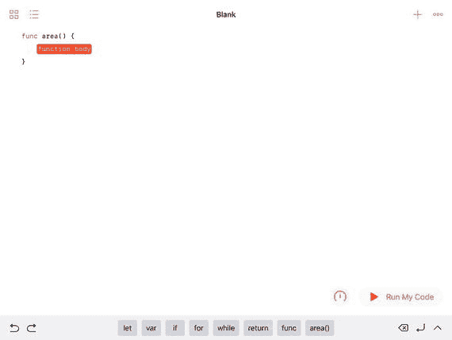
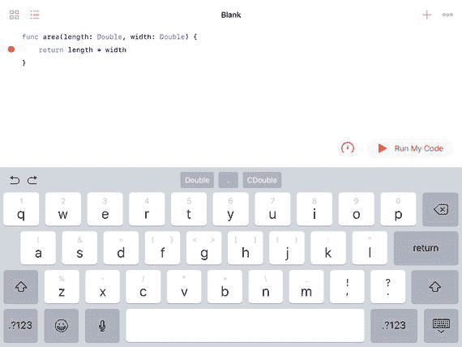
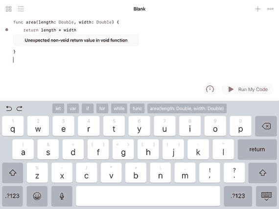
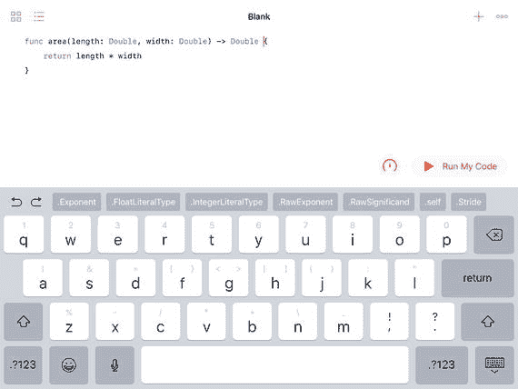
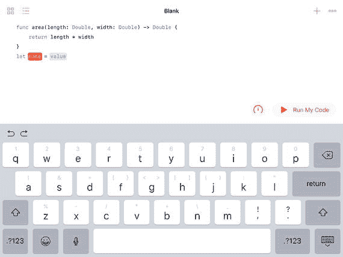
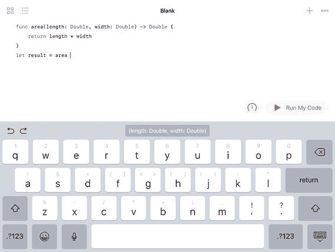
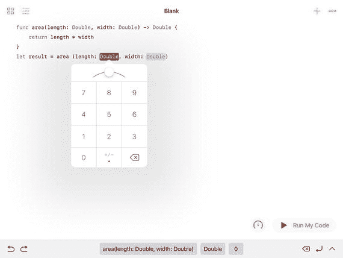
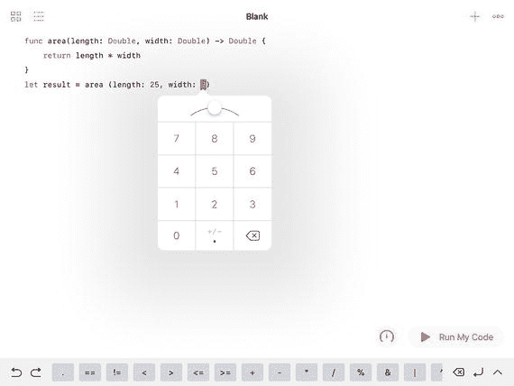
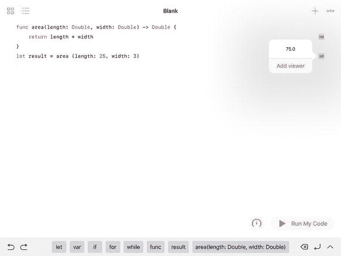

# 10. 构建组件

处理数据和流程控制的基础知识可以帮助你编写代码，但如何从那里过渡到构建有用的东西呢？（事实上，这是传统编程教学面临的挑战之一：人们在第一天就学会了如何编写一个打印出“Hello There”的程序，但从“Hello There”到构建 Facebook 之间并没有一条清晰的路径。）

本章为你提供了一些垫脚石，帮助你从单行代码走向——如果不是 Facebook，至少是在类似软件环境中开始工作所需的工具。（提醒一下，这段旅程中有很多垫脚石，本章只是为你提供一个概述。）

## 为什么要构建组件

有一个短语概括了构建组件的主要原因：“分而治之”。事实上，如果你在网上搜索“分而治之”，你会发现它是计算机科学中一种特定架构和开发过程的通用名称。该原理类似于几千年前就存在的“分而治之”（或“分而治之”）这个短语。如果你面对一个大问题（或一大群人），通常可以通过将问题或群体分解为小群体甚至个人来解决问题或鼓励人们以特定方式行动。

在应用程序开发方面，如果你的目标是编写下一个社交媒体应用（如果你正计划这样做，有一长串人在等着做这件事），那么从一张白纸或空白屏幕开始不会让你走得多远。你可以将应用的设计分解为大型组件——可能少于十几个。从那里，你可以进一步细分每个组件；更可能的是，你会让个人或团队处理特定的组件。不知不觉中，你至少会拥有如何构建一个大型复杂应用的总体框架。

在应用程序设计、实现和管理领域，有大量的理论和规则。一种流行的开发方法论（敏捷开发）鼓励尽可能早地在过程中开发出可工作的软件。它不会是完全版本，但会是可以运行的。这消除了从一开始就用大量文档和会议来描述可能开发路径的需要——某些东西会以某种方式运行起来。

这个过程会通过多次迭代持续进行，但在任何时候，某些东西都将是可运行的。（在某些环境中，迭代周期被限制为一周，这意味着前进的步骤可能很多且很小，但如果需要回退，也不会造成太大的混乱。）如果在过程中出现问题，下一个可运行的版本——即使是回退版本——也只需等待一周时间。

将组件作为分而治之的策略，以及像敏捷开发这样构建和组合小块的方法论，反映了尽可能快速高效地开发软件的需求。在这两种以及许多其他方法论中，构建大型系统的过程都涉及构建小组件。这些组件要么从整体概念中分解出来（分而治之），要么是构成系统构建块的小组件。

相比于构建单一结构的大型系统，组件还有其他优势。其中最主要的优势是**可重用性**和**可管理性**。这些特性是优秀计算机科学设计的主要特征。

### 组件的优势：可重用性

当设计者将一个大型系统分解为可以独立开发的组件时，这不仅在许多情况下简化了整体项目，而且还可能意味着某些组件将是可重用的。在为整个系统提供架构时，设计者和开发者会寻找那些既能服务于主要项目，又能独立作为次要用途的组件。

如今，我们已经进入一个人们习惯于使用计算机的世界，某些操作变得很常见。这些操作范围从界面元素到特定类型的操作，如登录安全、保存文档等等。

开发整体结构的实际过程包括在设计中寻找可以开发或使用可重用组件的地方（毕竟，如果它们是可重用的，就应该被重用）。

要使组件可重用，意味着它们需要为重用而设计。在最简单的层面上，这可能意味着在文档上要比一次性代码组件投入更多关注。可重用组件的价值与其可重用程度直接相关，因此文档和整体结构是关键。

### 组件的优势：可管理性

当一个大型系统被分解为由不同开发团队实现的组件时，明确它们的行为至关重要。这不仅仅是记录组件功能的问题，更是考虑它可能对更大系统其他部分产生什么副作用的问题。

通过能够识别组件的功能，可以轻松地在各种系统图上移动它，以便你可以尝试其重用。

通过以清晰的文档和专注于执行特定动作的方式来构建组件，可重用性和可管理性都得到了增强。最小化假设也很重要：理想情况下，一个组件应该能够被拿起并使用，而无需或只需很少的重新编程。

## 开发项目的基本组件

在阅读本章其余部分时，请牢记前面的要点。本章致力于解释你在计算机科学项目中遇到的主要组件类型。它还向你展示如何利用它们来实现系统的可重用性和可管理性——包括你将系统从一大组代码模块分解为结构化组件集合的过程。


### 子程序、函数、过程和方法

在项目中，最常见的组件是子程序、函数、过程和方法。它们的名称在不同编程语言中有所差异，结构也存在一些不同，但本质上都是同一主题的变体。它们就像微型程序或应用，接收输入，对输入进行一些操作和计算，然后生成输出。

本节将描述其通用结构，并以 Swift 为重点。这是总体视角，但也适用于大多数组件。组件的主要部分如下：

*   名称
*   数据输入
*   数据输出
*   实现 —— 代码
*   实现 —— 文档
*   副作用和依赖

#### 命名组件

您创建的每个组件都有一个名称。在大多数语言中，名称不能包含空格或特殊字符（下划线字符除外）。其他规则则适用于特定语言或特定环境（例如特定公司）中的用法。名称的选择要便于阅读和复用。它们通常由几个单词组成，描述组件将执行的操作。当使用多个单词时，通常用下划线字符连接或使用驼峰式大小写（例如，`camelCaseFormatting`，除了第一个单词外，每个单词首字母大写）。如果您使用下划线，这样的名称可能是 `camel_case_formatting`。您也可以将风格组合成类似 `camelCase_formatting` 的形式。始终建议采用一套标准来命名项目，并规范使用大小写和下划线（以及其他风格）。让人们能够理解这些项目是什么非常重要。请记住，在某些列表和交叉引用中，名称可能会按字母顺序出现，因此在制定命名约定时，您可能希望将此牢记在心。

另外，请注意，如果您正在编写用于复用的代码，并复用了他人编写的代码，那么您极有可能需要处理遵循各种命名约定的代码。尽量在单个组件内保持一致性，如果可能，在同一个组织或团队编写的相关组件中也保持一致性。但不要在这方面花费太多时间：您无法强制世界上每个开发者都遵守标准。

#### 数据输入

组件的数据可以在其运行时提供。例如，一个计算物体面积的组件可能会接收两个值：长度和宽度。其他组件则从设备（如温度计等实时传感器）或数据流（如社交媒体消息，如推文）接收数据流。

如果组件的输入能够被清晰定义，则有助于形成良好的编程风格并简化维护。长度和宽度就是非常清晰的概念。有时，需要提供给组件的数据量很大且种类繁多。管理此类输入数据的一种方法是将其格式化为集合，例如数组、集合或字典。因此，来自气象站的多个数据观测值，可以转换为一个包含这些观测值的数组 —— 这样就将多个输入项变成了一个输入项。您也可以使用更结构化的集合，例如字典，其中每个元素由一个键（观测的日期/时间）和一个值（观测值本身）组成。

输入越清晰，代码就越容易被复用。

#### 数据输出

数据输出与数据输入面临相同的问题，特别是要使输出的含义和结构清晰。有一种特殊类型的输出值得强调。有些输出专门设计用作其他组件的输入。在这种情况下，对输出的任何更改都需要与相关输入的更改同步。

这不是一个小问题，因为存在这种依赖关系可能会限制甚至阻碍输入或输出两侧代码的复用性。避免此类问题的一种常见方法是假设所有输出都将以某种方式用作输入。因此，输出的格式和布局可能最好使用已知的方法进行设计，这样在必要时，来自一个组件的输出可以发送到翻译组件，然后再发送到目标接收方。中间的组件则负责同步输入和输出数据。

> **注意**  
> 这种设计模式体现在模型-视图-控制器（MVC）设计模式中，该模式在 Swift 和 Cocoa 中被广泛使用。模型基本上是数据，视图是数据的用户界面。中间组件——控制器——在模型和视图之间进行协调。这种结构允许模型和视图根据需要进行更改：只有控制器需要因模型或视图的更改而修改。

#### 实现 —— 代码

组件的核心是代码本身。代码负责执行实际工作。

#### 实现 —— 文档

仅有代码本身不足以构成完整的实现。代码需要文档化。复用依赖于良好的文档。

#### 副作用和依赖

在构建成功的组件时，大多数开发者都力求最小化甚至消除组件外部的任何依赖。如果需要数据，最好将其作为输入提供。依赖组件所需的其他数据或资源的存在，意味着组件的复用性将仅限于该数据可用的场景。另一方面，如果必需的数据是通过输入提供的，那么它就是组件不可分割的一部分。


## 类

像子例程、函数、过程和方法这类组件，让你可以编写出实质上是带有输入、输出以及中间计算和运算的小程序。而类则是一种不同类型的组件。通过使用 20 世纪 60 年代及之后开发的面向对象技术，类为可复用组件提供了一种不同类型的结构。

面向对象编程范式允许你构建包含数据以及以代码形式存在的功能的对象。其区别在于，组件的范式可以追溯到计算机和计算机编程的早期，当时程序的运行方式是读入输入、进行计算、然后输出结果。（这通常被称为批处理。）在过程结束时，程序会终止。有时，会创建一个包含程序，以便在一个过程结束时读取下一组输入并生成下一组输出（可以想象一下账单系统）。

类和面向对象编程非常适合这个不再以批处理为中心的世界。在当今的许多情况下，一个类包含数据或接收数据的能力，它执行计算，然后导出数据。到目前为止，这与批处理是相同的，但在许多面向对象系统中，这些对象会持续存在。接收一些数据，进行计算，再接收一些不同类型的数据，进行计算，然后可能还会进行其他操作。在很多情况下，这并非简单的读取/计算/写入模式。相反，一个对象可能能够在不同时间进行读取、写入和计算。请注意，这只是对批处理式组件和许多类之间常见差异的一种观察结果：并非必要的区分。

类是对象的描述；当它们被创建（实例化）成为实例时，这些对象可能会持续存在一段时间。基本组件中输入、计算和输出之间的明确区分对于许多对象来说并不相关。

从可复用性的角度来看，类与其他组件一样具有可复用性。类本身通常包含组件。通常，这些组件是函数；它们也可能是方法。两者在技术上有所区别，但在实践中，这两个术语经常互换使用。（请参阅本章后面的对象构建示例。）

在 Swift 中，结构体和枚举在许多方面都被视为类似于类。关于结构体和枚举的更多内容，请参见第[8]章(#A441106_1_En_8_Chapter.html)。

## 更大的构建块

在审视包括函数、方法、过程和类在内的可复用组件时，像 Swift 这样的现代语言允许你创建更大的构建块。就像类可以包含数据和功能一样，框架可以包含类（及其组件）。在计算机科学中，“框架”一词有多种用法。最基本的用法与其在英语中的用法相同。在 Swift 和 Xcode 中，它还有一种特定用法，即允许你创建可复用的框架，供你或他人用于各种项目。Cocoa 和 Cocoa Touch 本身就是框架。还有用于用户界面、音频、文档管理以及许多其他常用应用程序部分的框架。在框架内部，你会找到类；而在类内部，你会发现更多的类和函数，以此类推。

## 关于代码块和递归

代码组件需要以某种方式进行封装才能被使用和复用。有两种特殊的代码复用情况值得审视：代码块和递归。

### 术语：代码块和闭包

在 Swift 文档中，你会找到关于闭包的定义：

- “闭包是自包含的功能代码块，可以在代码中被传递和使用。”

子例程、函数、过程和*方法*都是代码块。复合语句（如第[9]章(#A441106_1_En_9_Chapter.html)所述）也通常是代码块。代码块是一段代码，它可以带有或不带有过程、函数、方法或类的正式结构。如果它不是正式结构的一部分，它可能会用括号（或者在有些语言中，用圆括号）封装起来。

Swift 定义中至关重要的是“自包含”这一点。当一个代码块被用作闭包时，如果该代码块中的代码引用了代码块外部的变量，那么这些变量对现在被称为闭包的这个代码块是可用的（因为它已经*封闭*了执行该代码块所需的变量）。

在 Swift 中，所有闭包都是代码块，许多代码块也是闭包。在实践中，许多人会互换使用这两个术语。

代码块最常见的用途是在你想要执行一段代码，但又不知道何时执行它的时候。通常，这指的是你想要在某个事件或另一个事件发生之后执行的代码。如果那个事件不在你的控制之内，你就不知道何时需要执行这段代码块。

### 使用闭包

以下是使用闭包的一个常见示例。这是一段常用于`UIDocumentBrowserViewController`的代码，用于在 iOS 11 及更高版本的“文件”应用中打开文档。

```
let document = UIDocument (fileURL: documentURL) // 实例化 UIDocument 的子类
document.open (completionHandler: { (success) in
if success {
// 显示文档
} else {
print ("打开文档失败")
} // else
} // 代码块结束
) // document.open 参数结束
```

以下是这段代码的作用：

-   通常情况下，如注释所示，你创建一个`UIDocument`的实例。在此代码中通常会使用一个名为`document`（或你想要的任何名称）的局部变量。
-   然后，你使用`UIDocument open (completionhandler:)`方法打开文档。
-   名为`completionHandler`的方法参数是一段代码块，当`open`方法完成时，这段代码块会被调用。（这是一种常见的命名约定。）
-   充当完成处理器的代码块被括在花括号中。去掉完成处理代码块后，对`open`的调用结构会更加清晰：

```
document.open (completionHandler: {...})
```

-   代码块的内容如下所示。当代码块被调用时，会传入一个参数。为了方便，这里将其命名为`success`；与所有参数一样，它被括在圆括号中。一旦传入`success`，就可以在 if 条件中测试它，以判断打开是否成功。因此，在这种结构中，代码块被编写出来，并作为`completionHandler`参数传递给`open`。当`open`函数完成时，它手头就有了可以在`completionHandler`参数中运行的代码。这段代码需要多长时间运行取决于系统的工作负载。

```
{
(success) in
if success {
// 显示文档
} else {
print ("打开文档失败")
} // else
} // 代码块结束
```

这种类型的结构使得多线程成为可能。也就是说，处理过程会在处理器的一个或多个内核中继续进行，直到完成处理器开始发挥作用。

在较旧的软件中，你经常会发现这种类型的代码是通过信号量实现的。不是等待`open`完成，较旧应用中的代码可能会有一个小循环，定期检查`open`是否已经运行。

在 Cocoa 和 Cocoa Touch 的架构中，这种依赖消息传递和通知的结构使得编写应用代码要简单得多，并且使得操作系统本身的代码也更简单、更快。

你会在许多地方发现代码块的使用。


### 递归

递归是组件中另一个你需要了解的方面。如果你拥有可复用的组件，它们可以调用自身。这让你能够编写结构清晰且高效的代码。请注意，如果使用不当，可能会导致问题。在处理递归代码时，除非你能找到停止递归的方法，否则可能会生成一种理论上永不结束的无限循环。在实践中，当应用耗尽内存时，循环才会结束。

> **注意**  
> `Infinite Loop` 是苹果公司库比蒂诺总部多年所在地的那条街道的名字。它并非一个无限循环（如果你站在那条街上，可以看到它的全貌），但它确实是一个循环。2017 年，苹果公司在靠近 `Infinite Loop` 的地方完成了其新主总部的建设。这个新总部就是众所周知的 Apple Park。

## 在 Swift 中构建函数

在讨论组件时，Swift 中的术语使用 `function` 而不是 `method`。在常见的用法中，当这些条目作为类的一部分时，许多人仍会称其为 `methods`（这是多年使用习惯的遗留问题，过去这种区别比现在更重要）。替代术语（`subroutine` 和 `procedure`）如今在 Swift 中已不再使用。

一个 `function` 由名称、输入、输出以及代码本身组成。以下是在 Swift playground 中创建一个简单函数的方法。这个函数将基于两个参数（`length` 和 `width`）来计算面积。

首先，在你的 iPad 上创建一个新的 playground，如图 10-1 所示。（你可以在 Xcode 的 playground 中执行相同步骤，但界面不同且交互性较差。）空白的 playground 在屏幕底部的工具栏中为你提供了一些建议。其中顶层的建议之一是用于创建函数的 `func`。


**图 10-1** 创建一个新的 playground

点击 `func`，playground 会为你创建一个函数框架，如图 10-2 所示。



**图 10-2** 开始创建一个函数

`Name` 会被红色高亮显示，提示你应首先输入该项。函数体则被灰色高亮显示，提示你接下来处理这个部分。输入函数名称——`area`——如图 10-3 所示。点击函数体，它现在会被红色高亮显示，等待你处理。



**图 10-3** 输入函数名称

下一步是输入函数体。有几种方法可以做到这一点。无论你选择哪种方式，都有可能暂时产生一个错误。（这在开发中很常见。）

图 10-4 中展示的这单行代码将返回 `length` 乘以 `width` 的值。迄今为止这两个变量都没有值，因此你将产生一个错误（左侧的红点）。


**图 10-4** 开始构建函数体

设置 `length` 和 `width` 值的一种方法是将它们作为参数传递给函数，如图 10-5 所示。（通过参数传递数据，而不是在函数体内硬编码，能使你的代码更具可复用性。）

正如你在本书的几个代码片段中看到的那样，声明变量的方法是使用名称和类型。因此，你可以声明一个类型为 `Double` 的 `length` 变量（名称），方法如下：

```
length: Double
```

`Double` 是 Swift 中首选的浮点类型（相比 `Float` 而言）。



**图 10-5** 将参数传入函数

尽管参数解决了数据来源的问题，但函数需要在其声明中表明将返回一个值。这就是你在图 10-6 中看到的错误。



**图 10-6** 你必须声明函数将返回一个值

你可以像图 10-7 所示那样完成函数声明，使其现在打算返回一个值。



**图 10-7** 完整的函数

返回值的语法是：

```
-> Double
```

这表明返回值的类型是 `Double`。

如果你愿意，可以运行这段代码。虽然什么也不会发生，但实际上这已经相当不错了：没有出现任何错误。

现在回顾一下构建这个小函数的步骤：

- 点击 `func` 创建框架
- 为函数命名
- 命名传入的参数并设置其类型
- 指定返回值
- 提供计算返回值的函数体

除了第一步创建函数框架外，其余步骤都可以按任意顺序进行。在此过程中，你可能会遇到错误，原因可能是你在使用变量之前尚未声明它，或者你声明了变量却没有使用它。过一段时间，你就会习惯这个流程。

你可以添加一行代码来调用这个函数。你需要声明一个变量，并将其设置为函数的结果。查看快捷键栏，你会找到 `let`（在图 10-8 中它正好在屏幕之外）。你通常需要滚动快捷键栏。点击 `let`，你会得到所需代码的轮廓，如图 10-8 所示。



**图 10-8** 创建一个变量来使用该函数

将变量命名为 `result`（或任何你想要的名称），然后输入函数名称，如图 10-9 所示。在快捷键栏中，Swift playground 会显示参数（名称和类型）。



**图 10-9** 开始使用该函数

点击快捷键栏中的参数，它们会被填充到你的代码中，如图 10-10 所示。第一个参数 (`length`) 被红色高亮显示，所以你需要从这里开始。你会看到一个数字弹出框，因为 playground 知道你打算输入一个数字。



**图 10-10** 开始输入参数

当你输入每个参数时，系统会使用相应的数据输入工具引导你，如图 10-11 所示。



**图 10-11** 输入所有参数

现在你可以点击“运行我的代码”，并在查看器中看到结果，如图 10-12 所示。



**图 10-12** 运行你的代码并在查看器中检查结果

## 总结

本章描述了使用软件组件的原因，并向你展示了如何在 Swift 中构建它们。你了解了 Swift playground 如何引导你完成构建函数的过程。你也可以直接将代码键入 Xcode，但有时在 Swift playground 和 Xcode 之间切换会更方便。

所有组件都拥有相同的基本部分。以下是你在 playground 中看到的名称。

- `name`
- `inputs`（参数）
- `outputs`（返回值）
- `body`（代码）


