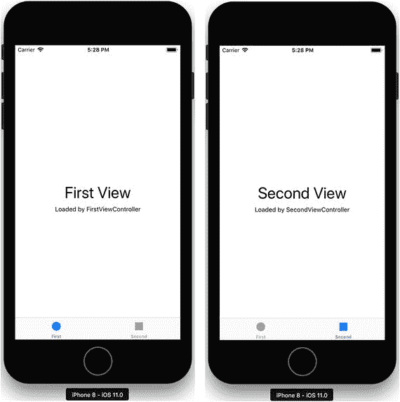
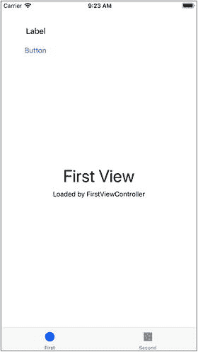
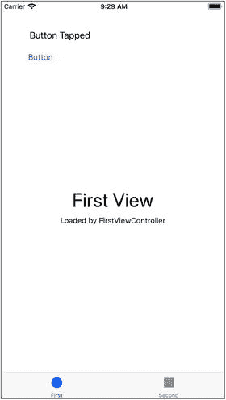
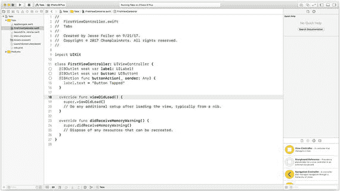
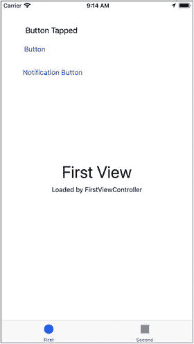
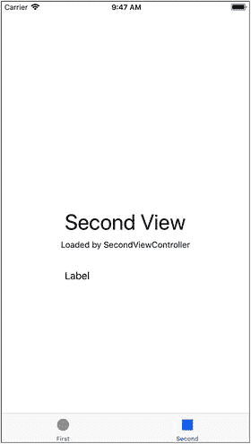
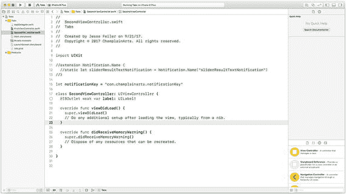

# 11. 使用事件引导操作

计算机的尺寸多年来一直在缩小。其组件不仅从真空管缩小到晶体管，如今单个计算机芯片上甚至可以集成整个系统。

用户控制着应用程序。我们启动它们，与界面交互，用完后再关闭它们。有时，就像在 iOS 中一样，当我们一段时间不使用它们时，它们的数据会自动移到一个安全的空间，准备在我们再次需要时使用。它们可能永远（或极少）终止，只是等待下一次用户输入。

现实并非如此，几十年来也并非完全如此，但思维定势需要很长时间才能消退。应用程序越来越多地受到其他应用程序甚至其他计算机的控制。当我们在计算机上设置闹钟时，另一个应用程序会跟踪时间，然后在计算机上触发某些操作。

你可能会说这仅仅是延迟了人的交互，但当你开始思考当今应用程序是如何被控制时，你会发现越来越多的控制已经远离了人的干预。一般来说，当你使用“在……时提醒我”这样的短语（也许是通过 Siri）来安排某件事时，你描述的是一个计算机可以启动的动作。无论你的“在……”是基于时间还是位置，计算机很容易判断“在……”的条件是否为真。

当你对 Siri 的请求是“当……时提醒我”时，判断“当……”的条件是否为真可能涉及一个更复杂的过程。（排除像“当时间是 3:15 时”这种特殊情况，这基本上是一个“在……”的请求。）

这些“当……”事件的重要之处在于，它们对发起该事件的人来说是出乎意料的。如果你请求在 3:15 被提醒，你可能会预料到那个提醒（甚至可能是在 3:00 的预提醒）。但“当……”事件可能完全出乎用户的预料。你将在本章后面研究 Swift 和 Cocoa 中的通知时看到其工作原理。

## 代码块的作用

如第 10 章“构建组件”所示，你可以通过使用代码块来修改正常的命令处理顺序。这里的代码片段总结了代码块的一种常见用法。如本章所述，这是 `UIDocumentBrowserViewController` 和许多其他地方常见的代码用法。代码的核心是 `document.open(completionHandler:)` 函数调用。它打开文档，当文档打开后，完成处理程序会被调用并执行，这样你就可以通知用户文档是否成功打开，并执行任何其他必要的操作（例如，用文档内容更新用户界面）。

```
let document = UIDocument (fileURL: documentURL)
// 实例化 UIDocument
document.open (completionHandler: { (success) in
if success {
// 显示文档
} else {
print ("打开文档失败")
} // else
} // 代码块结束
) // document.open 参数结束
```

重要的是要记住，尽管在调用 `open` 和执行闭包（无论是 `success` 分支还是 `else` 分支）之间存在暂停，但该序列是在初始代码中设置代码块时就已确定的。除非代码块中的代码执行了一些异常操作，否则该代码块就是 `open` 在尝试打开文档后要调用的代码。

## 使用操作和消息传递管理流程控制：总结

通常情况下，你希望实现一种不同类型的管理控制流的方式，而不仅仅是等待然后执行预定义序列中的下一步。这就是消息传递发挥作用的地方。消息传递允许你动态地改变将要执行的内容——而不仅仅是像使用完成处理程序和闭包那样改变其执行时机。

消息传递允许你向接收者发送某种消息，然后接收者根据该消息采取行动。回顾一下使用闭包的 `open` 代码，考虑一种情况，即你不想指定文档打开或未打开时会发生什么。消息传递结构允许你向接收者发送一条消息，由接收者决定如何处理它。现代应用程序中广泛使用消息传递，原因有多种，其中之一是它有助于构建可维护的应用程序，因为应用程序无需保留所有的逻辑联系。在 `open` 示例中，如果你想强制限制一次最多只能打开三个文档，你需要确保每个 `open` 语句在原始编码和维护过程中都遵守该限制。（当你实现打开一种新类型文档的代码时，很容易忘记检查这个限制。）这些问题可以通过实现一个通用的打开代码部分来避免，但通常在改造或维护代码时，你无法控制每个部分已经如何工作。能够发布一个通知，告知某事已发生，并让编写时未知的应用程序的另一部分来处理它，会更简单。这就是通知发挥作用的地方。这里有一个具体的例子。

> **注意**
> 
> 消息传递如今被广泛使用。它是操作系统微内核架构的核心，也是 Cocoa 和 Cocoa Touch 框架的关键。其他一些框架和开发工具使用了不同的方法和术语，但你在 Cocoa 和 Swift 中会遇到的就是这种方式。

## 将按钮按下/轻触/点击传递给……某个地方

在这个例子中，你将看到如何实现一个按钮，该按钮执行的操作在你编写按钮管理代码时是未知的。这是通知架构的概述。它向你介绍了 Xcode 中的一些工具，Xcode 是用于所有 Apple 工具的集成开发环境（IDE），但使用 Xcode 的细节将在下一章中描述，因此请将本节视为一个侧重于通知的预览。


### 实现一个已知操作的按钮

首先，常见的情况是实现一个按钮，该按钮执行你已知并能与其一同实现的操作。这个示例从 Xcode 内置的“标签页应用”启动模板开始。如果你基于该模板创建应用，将会得到一个包含两个视图的应用，如图 11-1 所示。



图 11-1 （左）标签页应用第一个视图，（右）标签页应用第二个视图

基础模板实现了两个视图控制器以及底部的标签栏控制器，后者允许你在两个视图之间切换。

你可以像图 11-2 那样，向其中一个视图控制器添加按钮和标签。



图 11-2 添加按钮和标签

接下来你会发现，很容易就能为按钮编写代码，使其改变标签中的文本，如图 11-3 所示，文本已变为“按钮已点击”。



图 11-3 实现按钮

实现按钮的代码并不特别复杂，尤其是在 Xcode 的协助下——你在第 12 章中会看到。按钮和标签的代码如代码清单 11-1 和图 11-4 所示。



图 11-4 第一个视图控制器的代码

```
import UIKit
class FirstViewController: UIViewController {
@IBOutlet weak var label: UILabel!
@IBOutlet weak var button: UIButton!
@IBAction func buttonAction(_ sender: Any) {
label.text = "Button Tapped"
}
override func viewDidLoad() {
super.viewDidLoad()
// Do any additional setup after loading the view, typically from a nib.
}
override func didReceiveMemoryWarning() {
super.didReceiveMemoryWarning()
// Dispose of any resources that can be recreated.
}
}
```

代码清单 11-1 实现按钮和标签

代码首先将界面中的对象（使用第 12 章描述的 Storyboard）与代码关联起来。`label` 和 `button` 都是 `@IBOutlet` 项目——这意味着它们位于界面中，但可以从代码中访问。可以看到，一个是 `label`，另一个是 `button`。

类似的方式也适用于 `@IBAction`。这是实现按钮操作的代码。你会在实现用户界面的代码中到处看到 `@IBOutlet` 和 `@IBAction`。

`@IBAction` 代码行可以重新格式化，以便更清晰：

```
@IBAction func buttonAction(_ sender: Any) {
label.text = "Button Tapped"
}
```

当按钮被点击时，`buttonAction` 被调用，`label` 的文本变为 `Button Tapped`。

这就是实现按钮及其操作所需的全部内容。

### 实现一个带通知的按钮

如果要添加一个按钮来更新第二个视图控制器上的标签，事情就会变得稍微复杂一些。向第一个视图控制器添加一个新按钮来启动这个进程并不难。图 11-5 展示了其外观。



图 11-5 添加一个使用通知的按钮

你还可以像图 11-6 那样向第二个视图控制器添加一个标签。这个标签将由第一个视图控制器上的通知按钮更新。



图 11-6 向第二个视图控制器添加标签

你可以开始向按钮添加更新第二个视图控制器中标签的功能，但会立即遇到一个问题，如代码清单 11-2 和图 11-7 所示。



图 11-7 第二个视图控制器的代码（Xcode）

```
import UIKit
class SecondViewController: UIViewController {
@IBOutlet weak var label: UILabel!
override func viewDidLoad() {
super.viewDidLoad()
// Do any additional setup after loading the view, typically from a nib.
}
override func didReceiveMemoryWarning() {
super.didReceiveMemoryWarning()
// Dispose of any resources that can be recreated.
}
}
```

代码清单 11-2 通知按钮的代码

问题在于导航按钮的声明位于第一个视图控制器中，而需要更新的标签的声明位于第二个导航控制器中。如何从第一个视图控制器访问第二个视图控制器？

在这种情况下，有多种方法可以绕开这个问题。最明显的是将代码放入一个同时连接两个视图控制器的对象中。这意味着管理按钮和标签的工作将转移到应用委托或管理两个可见视图控制器的标签栏控制器中。这些策略都可以奏效，但代价是应用委托或标签栏控制器会变得更加复杂。（对于标签栏控制器而言，区别在于使用模板中的基础 `UITabBarController` 与实现子类，以便可以从子类修改一个或两个按钮或标签。）

总的来说，增加的复杂性是为混合数据和界面元素所付出的代价。解决方案是使用通知。

通知由两个组件组成。第一个组件广播一个事件已发生的通知。第二个组件是一个观察者，等待发现通知。重要的是，它们之间不需要相互了解。在第一个视图控制器的按钮和标签的情况下，通信发生在该视图控制器内部。使用通知时，它可以由第一个视图控制器（通知按钮所在处）生成，并由第二个视图控制器（标签所在处）观察。

通知在整个应用内广播；一个对象可以请求被通知特定的通知，但不像单个视图控制器内的对象之间存在直接链接。

正是这种缺乏直接链接的特性使通知如此有用。这也暴露了一个问题，你将在下面的代码（以及解决方案）中看到。

#### 通知基础

关于通知，有两个关键点需要记住。

- 每个通知都有一个名称。这不是一个字符串，而是一个 `Notification.Name` 类型。你将看到如何指定它。
- 通知可能不会被送达。由于通知和观察者之间没有直接链接，如果通知未被观察，不会产生错误。通知者发布一个通知，它可能会被观察，也可能不会被观察。


### 发布通知

实现通知按钮的第一步是发布通知。以下是发布通知的标准代码。它将作为第一个视图控制器中通知按钮的操作。

```
@IBAction func notificationButtonAction(_ sender: Any) {
    NotificationCenter.default.post(
        name: Notification.Name(rawValue:notificationKey),
        object: nil,
        userInfo: nil)
}
```

在这个简单案例中，你只需要为通知设定一个名称。这在以下代码行中完成：

```
name: Notification.Name(rawValue:notificationKey),
```

该行代码引用了在你应用的任何区域（可能在一个`globals.swift`文件中）声明的一个变量，其代码如下：

```
let notificationKey = "com.champlainarts.notificationKey"
```

这两行代码共同将一个字符串转换为`Notification.Name`类型。

以上就是从按钮操作（或任何其他事件）发布通知所需的所有步骤。

### 监听通知

要监听通知，想要监听的对象需要注册，然后执行某些操作。以下是监听通知的代码行（位于第二个视图控制器中）。

```
NotificationCenter.default.addObserver(
    self,
    selector: #selector(SecondViewController.didReceiveNotificationResultText),
    name: NSNotification.Name(rawValue: notificationKey),
    object: nil)
}
```

这行代码指定，如果接收到具有给定名称的通知，则应调用一个特定的函数（该函数定义为`#selector`）。

```
@objc func didReceiveNotificationResultText () {
    label.text = "Received Notification"
}
```

完成此设置后，第一个视图控制器中的导航按钮可以改变第二个视图控制器中标签的文本。两个控制器互不知晓，按钮也不知道标签的存在。这意味着，如果观察者响应按钮点击的操作是完全不同的内容（即，不设置标签文本），那么一切仍应正常工作。

添加观察者应由能够针对通知采取行动的对象来完成，因此该代码应放在该对象所在的位置。你可能会首先想到将其放入第二个视图控制器的`viewDidLoad`方法中。

如果你这样做并运行应用，会发现一个问题。第二个视图控制器中的`viewDidLoad`只有在第二个视图控制器显示时才会被调用。因此，如果你运行应用，看到（默认的）第一个视图控制器及其导航按钮，点击该按钮会发送通知，但由于第二个视图控制器尚未显示，`viewDidLoad`未被调用，观察者尚未准备好。

你可以通过点击第二个视图控制器的标签来验证这一点，这将强制调用`viewDidLoad`并设置观察者。之后，导航按钮将按预期工作。

## 总结

这是一个常见问题，将在第 12 章中，在探索 Xcode 时进一步探讨。

