# 12. 进入 Xcode

前面的章节涵盖了计算机科学的许多基础知识。你已经找到了一些 Swift 游乐场和代码片段，它们说明了许多概念和问题。本书的重点是 Swift 以及 iOS 和 macOS 的基本框架——Cocoa 和 Cocoa Touch。

要实际在这些环境中进行开发，你需要使用 Xcode，即苹果的集成开发环境（IDE）。本章将概述应用和其他软件通常是如何构建的（即，不仅限于这些平台和 Xcode）。然后，你会重点关注如何使用 Xcode 开始应用开发——这将提供第 11 章中讨论的概述的更多细节。

关于 Xcode 和各种苹果框架有很多内容要说，但本章后续部分的重点将是一个真实的案例研究：分析第 11 章代码中的一个问题。你已经占得先机，因为该问题在第 11 章中已描述过，但本章将带你逐步了解如何发现并识别问题以及如何修复它。许多开发者认为，与你在实际诊断和修复错误时所学习到的东西相比，任何书本或课堂学习都无法比拟。


```markdown
## 如何编写软件

许多人认为编写软件就是坐在空白屏幕或白纸前，然后开始敲代码。当你敲够代码，就有了一个应用。这在打孔卡片的大型机时代或许如此，但现在已不适用。

如今的一个应用通常包含代码、图形元素、其他形式的媒体（视频、音频等），以及成为应用组成部分的多个框架中的大量代码。框架代码处理常规功能，比如读写数据、管理屏幕和鼠标或触控板，以及许多让现代应用成为现代应用的功能。

这意味着“编写”一个应用现在开始意味着从各种组件和片段中组合出一个应用。虽然构建应用的机制是与计算机科学不同的主题，但简要了解它是值得的，这样你就能理解各个部分如何组合在一起。

首先，在 `developer.apple.com` 注册一个苹果开发者 ID。你将完成注册流程。注意，如果你在你的地区未满法定年龄（成年），你需要一位成年人为你担保。如果你在学校就读或为公司工作，他们可能有一个你可以使用的苹果开发者账户。

以下是在 `Xcode` 上进行应用开发的通用步骤序列。你将在下一节“使用 `Xcode` 开发应用”中看到如何开始这个过程。这些是你必须回答的问题，所以请在开始之前就思考它们。

1. 确定应用的功能。坐下来就“写一个应用”却不知道这个应用要做什么是徒劳的。无论你是作为独立开发者、公司团队的一员，还是处于任何其他配置中，拥有一个所谓的“电梯演讲”来在几秒钟内总结你的项目是一个好主意（许多人会说它至关重要）。你的目的或目标可能会随时间改变，但这很正常。只需确保你清楚当前版本是什么。（另请注意，在开发过程中你可能需要定期考虑版本。）像敏捷开发这样的现代开发技术建议，任何时候都应该有可运行的内容，这是一个值得遵循的良好实践。这可能意味着你需要定期——甚至可能每周一次——进行评估，并要么删除某些功能，要么将其推迟到未来版本，以便让下周的应用版本按时完成。

2. 开始应用描述。除了你的 10 秒版本的应用目的外，许多人（包括作者）建议你开始构建应用在 App Store 中的展示。这包括结构化的文本和图像，比你的电梯演讲版本更详尽。如果你将自行营销你的应用，你迟早需要这些内容。如果由其他人负责营销，你可以与他们一起制定这个描述。在开始时就开始这个描述的主要原因是，它为你在构建应用时提供了更多细节。请访问 `developer.apple.com` 获取关于构建应用在线展示的更多信息。

3. 命名应用。这可以是一个代号，或者一个你计划以后更改的名字（当你想出一个更好的名字时）。更改将在营销材料和 App Store 中显示的名称很容易。（这与 App Store 初期不同。）图 12-1 显示了 `Xcode` 中应用的通用（General）标签页，你将在其中提供这些信息。

   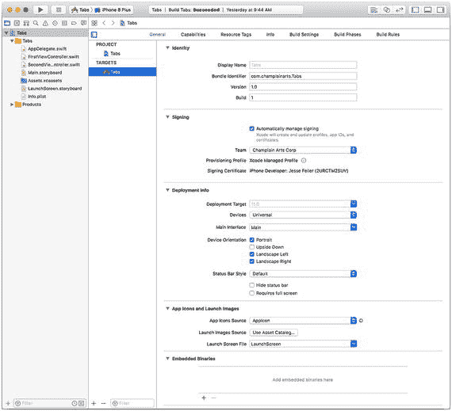

   图 12-1

   设置应用的通用设置。`显示名称（Display name）` 是用户看到的应用名称。（在这个示例中，它是 `Tabs`。）`捆绑包标识符（bundle identifier）` 是应用的内部名称。它可以不同于 `显示名称`。`捆绑包标识符` 必须是一个唯一名称。它通常由你的开发者账户名称构成。每个应用版本（一个构建）都有其自己的版本和构建标识符。你通常从版本 `1.0`（你可能更喜欢 `0.1` 这样的版本号）和构建 `1` 开始。每次你向 App Store 提交一个应用构建时，你都需要增加构建计数器，使其始终保持唯一且递增。你可以跳过构建编号，但不能倒退。版本号将显示给用户，因此由你和你的管理者及营销人员决定何时让下一个构建成为 `2.0` 而不是 `1.16`。在与 App Store 打交道之前，使用 `Xcode` 中的默认值没有问题。

4. 选择应用环境。你将在 iPhone、iPad、Apple Watch、`tvOS` Mac 还是其他设备上运行应用？你将支持 iPhone 和 iPad 的哪些方向？这些是你需要在开始时做出的选择（并且它们是应用描述所必需的）。这些选择是可修改的，但你需要一个起点。在 `部署信息（Deployment Info）` 中进行这些选择，如图 12-1 所示。

5. 选择你支持的最早应用环境版本。`Xcode` 中的默认版本通常遵循苹果支持当前版本和上一个版本的政策。因此，随着 2017 年 iOS 11 的发布，iOS 10 通常得到支持。有些应用支持更早的版本。这也在 `部署信息` 中使用 `部署目标（Deployment Target）` 下拉列表进行设置。你可以在图 12-1 的其余设置中使用默认值。

6. 选择应用开发环境。对于苹果框架，`Xcode` 是给定的，而 `Swift` 如今通常也是给定的。如果你为了开发而集成第三方框架，你可能无法使用 `Swift`，但截至撰写本文时，遗留的 `Objective-C` 框架正变得越来越少。你还需要选择要支持的 `Xcode` 开发版本。这将在你设置项目时确定。它将在本节接下来的“使用 `Xcode` 开发应用”中讨论。

7. 决定图形设计。你可能会与设计师合作来开发应用的外观。同时开始考虑应用图标。

8. 在“功能（Capabilities）”标签页中选择你将支持的功能，如图 12-2 所示。这些可以在以后更改，但这能让你了解你可以构建哪些功能。（请注意，在大多数情况下，现在选择功能即使不使用，也比以后再进行逆向添加要容易。）

   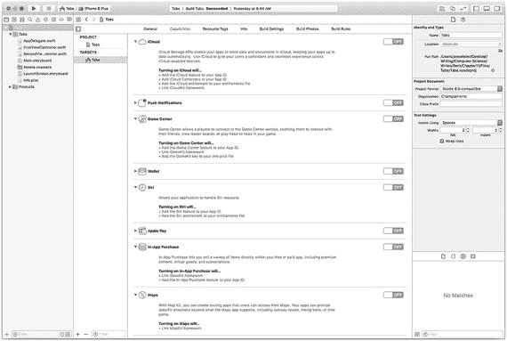

   图 12-2

   设置功能。

### 使用 Xcode 开发应用

有了你的应用计划，你就可以开始实际使用 `Xcode` 开发应用了。
```


#### 设置项目

以下是开始的步骤。

首先启动 `Xcode`。你可以从 App Store 免费下载。如图 12-3 所示，使用“关于 Xcode”来检查你安装的 Xcode 版本。请注意，Xcode 的构建标识符往往比大多数开发者使用的简单数字样式（如 1, 2, 3 等）更为复杂。

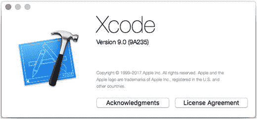

图 12-3

Xcode 版本 9.0，构建版本 9A235

从 Xcode 菜单选择“新建 ➤ 项目”来开始你的项目，如图 12-4 所示。

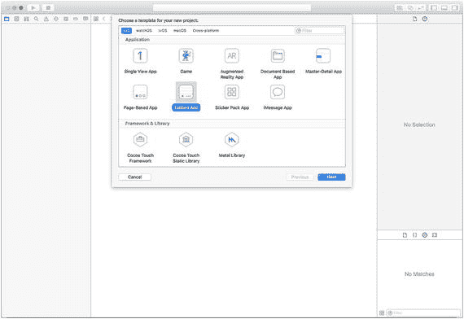

图 12-4

创建一个新项目

你将能够选择一个模板来开始。在本章中，我们使用“标签页应用”。当你有时间时，可以通过创建项目来探索其他模板。在实验完毕后，你可以随时删除它们。

系统会提示你为项目选择一个磁盘位置。然后项目将在 Xcode 中打开。你会在一个类似于图 12-1 的窗口中看到它。你可以使用右上角的设置来显示或隐藏窗口的各个部分。（更多关于使用 Xcode 导航的信息，请参阅 `developer.apple.com` 和应用内帮助。）

图 12-5 展示了此时的应用程序。请注意，在图 12-1 中，右侧的“工具区”并未显示，但在图 12-5 的右侧显示了。大多数开发者在工作时会显示或隐藏 Xcode 窗口的各个面板。

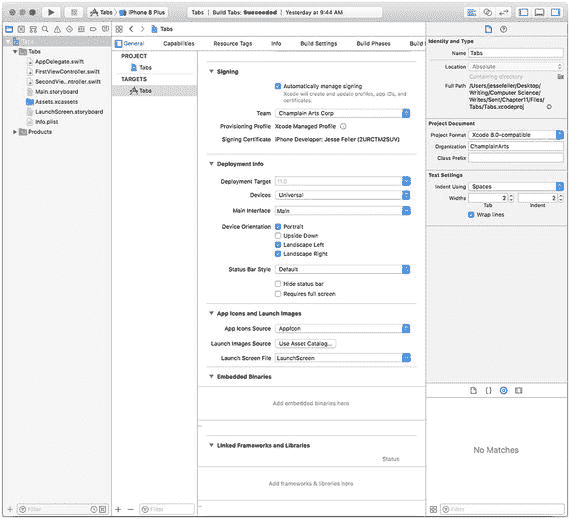

图 12-5

查看应用

只需点击几下，你就能在 Xcode 中创建一个新项目，但请查看图 12-6，了解你所创建的文件和文件夹数量。除非你对 Xcode 非常熟悉，否则不要移动或重命名项目文件：将它们保留在 Xcode 放置它们的位置。两个最重要的组件是 `xcodeproj` 文件（如图 12-6 列表底部所示）和项目文件夹（本例中为 Tabs）。如果你折叠文件夹，你会看到项目由 `xcodeproj` 文件和项目文件夹组成。这两个项可以一起移动到其他位置，但它们必须在一个文件夹（或桌面上）彼此相邻。

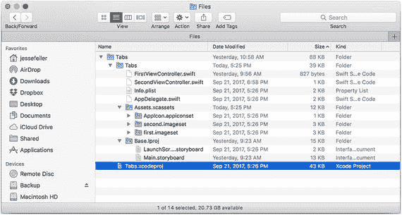

图 12-6

浏览应用的文件夹

#### 测试项目（不进行修改）

如果项目尚未打开，请通过双击 `Tabs.xcodeproj` 在 Xcode 中启动它。这应该会打开你之前见过的窗口。请记住，你可能需要使用右上角的控件来显示或隐藏主窗口的各个部分。图 12-7 向你展示了可以代替右上角控件使用的“视图”菜单。

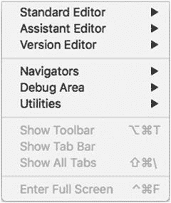

图 12-7

探索“视图”菜单

显示或隐藏主窗口的各个部分。如果你想探索它们，请使用此“视图”菜单来显示或隐藏它们，这样你就能将术语与你正在查看的 Xcode 窗口的各部分对应起来。

使用主窗口左上角的箭头（如图 12-5 所示）来构建并运行应用。你应该会看到如图 12-8（左侧和右侧）所示的结果。

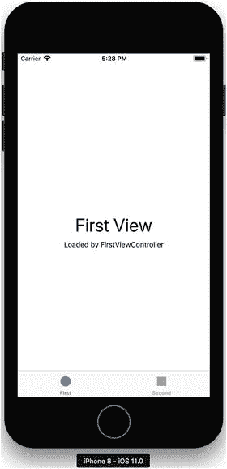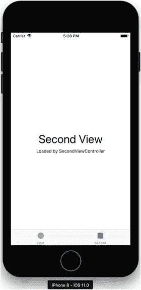

图 12-8

构建并运行应用

#### 添加代码和界面

当你确信模板能正常工作后，就可以添加你的修改了。正如你在第 11 章中看到的，你可以将界面元素添加到作为项目一部分创建的文件和文件夹中，而不是添加到名为 `base.lproj` 的文件夹中。这个文件夹将出现在你的大多数项目中。它包含界面元素。如今，这些元素是使用故事板构建的。（过去是使用 `xib` 和 `nib` 文件构建的。）

`base.lproj` 文件夹将所有界面元素集中在一个地方，以便你可以轻松地进行本地化。

故事板为你提供了一个图形化工具来绘制界面并将其连接到你的代码。本节提供了一个非常简要的概述：更多内容请参考 Xcode 文档和 `developer.apple.com`。网上也有大量信息，但请确保这些信息是近期的：网上有很多过时的代码。

如果你在 Xcode 中点击一个故事板，它就会打开，你就可以编辑你的界面。这里已经有一个现成的界面（这就是你在运行模板时看到的内容，如图 12-8 所示）。在主故事板中，你会看到一个界面的示意图，如图 12-9 所示。（此视图包含了一些已添加的元素——这些元素是在第 11 章中添加的，你将在本章后面了解更多关于如何添加它们的内容。）

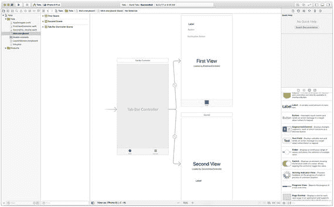

图 12-9

`main.storyboard`

在窗口右侧工具区的底部，你会看到一个对象列表，你可以将这些对象拖到故事板上。你无需绘制任何东西——只需拖动即可。

界面中的元素被称为场景，它们通过视图控制器在代码中实现。大多数视图控制器都是可见的，本例也是如此。在 Tabs 模板中，有三个视图控制器：第一个视图、第二个视图，以及一个标签栏控制器，在你点击按钮时，标签栏控制器控制着它们。标签栏控制器出现在两个视图控制器的底部。

当你使用工具区的对象构建界面时，你可以切换到助理编辑器，如图 12-10 所示。（你使用主窗口右上角的两个相交圆环图标来完成此操作。）助理编辑器将故事板保留在窗口左侧，并在窗口右侧显示相关代码。你从界面元素按住 Control 键拖向代码。系统会提示你为代码中的元素命名。一个填充的圆圈表示代码已连接到界面。当连接成功后，将鼠标悬停在界面上会显示已连接代码元素的名称，如图 12-10 所示。

这是将代码连接到界面的关键部分。

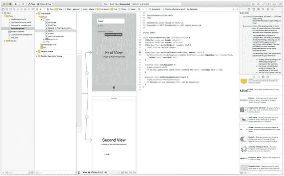

图 12-10

将界面连接到代码

如果你想排查连接问题，一种简单的方法是按住 Control 键点击故事板中相关的视图控制器，以调出如图 12-11 所示的视图控制器连接。

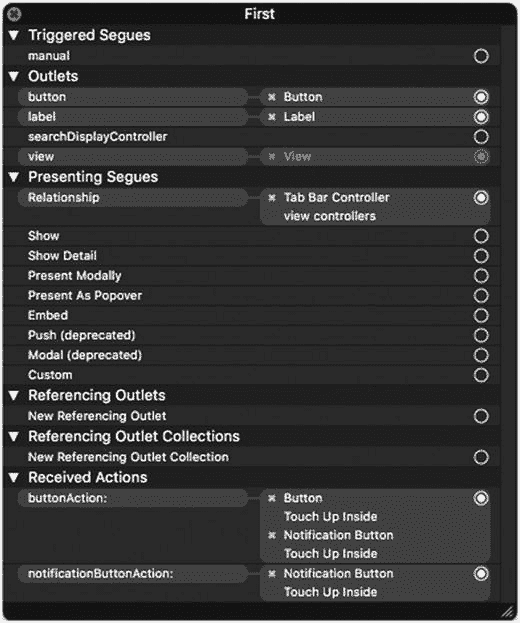

图 12-11

视图控制器连接

探索界面及其元素，以熟悉构建 iOS 或 macOS 应用的这个关键部分。

在第 11 章中介绍的代码是建立在用户界面之上的。此处为方便起见再次列出。清单 12-1 是发布通知的代码。


```swift
import UIKit
class FirstViewController: UIViewController {
@IBOutlet weak var label: UILabel!
@IBOutlet weak var button: UIButton!
@IBAction func buttonAction(_ sender: Any) {
label.text = "Button Tapped"
}
// 发布通知
@IBAction func notificationButtonAction(_ sender: Any) {
NotificationCenter.default.post(
name: Notification.Name(rawValue:notificationKey),
object: nil,
userInfo: nil)
}
override func viewDidLoad() {
super.viewDidLoad()
// 加载视图后的其他设置，通常来自 nib 文件
}
override func didReceiveMemoryWarning() {
super.didReceiveMemoryWarning()
// 处理可重新创建的资源
}
}
```

代码清单 12-1 发布通知

代码清单 12-2 展示了观察通知的代码。

```swift
import UIKit
let notificationKey = "com.champlainarts.notificationKey"
class SecondViewController: UIViewController {
@IBOutlet weak var label: UILabel!
override func viewDidLoad() {
super.viewDidLoad()
// 加载视图后的其他设置，通常来自 nib 文件
// 观察通知
NotificationCenter.default.addObserver(
self,
selector: #selector(SecondViewController.didReceiveNotificationResultText),
name: NSNotification.Name(rawValue: notificationKey),
object: nil)
}
override func didReceiveMemoryWarning() {
super.didReceiveMemoryWarning()
// 处理可重新创建的资源
}
@objc func didReceiveNotificationResultText () {
label.text = "Received Notification"
}
}
```

代码清单 12-2 观察通知

### 测试项目（进行修改后）

再次开始测试应用，你会时不时遇到一个问题。这个问题可能很棘手，因为它看起来毫无规律。下一节中的调试技巧将告诉你如何继续。

### 使用 Xcode 调试应用

当按钮和代码就位后，你会发现如果点击第一个视图控制器中的导航按钮，似乎什么都不会发生。调试的第一步是使用断点。这会使应用在指定位置停止。如果你发现本应发生的情况没有发生，最简单的处理方式就是在导致问题的代码行上设置断点（本例中，是因为代码没有运行）。设置断点的方法是点击代码行左侧的装订线区域，如图 12-12 所示。

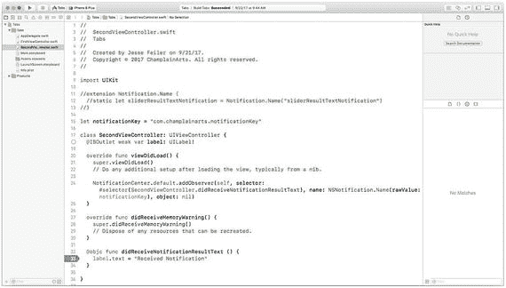

图 12-12 设置断点

再次运行应用，点击导航按钮，等待断点被触发。

但断点不会被触发。

这一切让你确认了之前看到的状况，但现在你发现了一个事实：不仅是通知没有被处理，它甚至从未被接收过。

在这种情况下，常见的做法是回溯。`didReceiveNotificationResultText` 函数本应由谁来调用？

由于这是一小段代码，答案就在你眼前的第 24 行：那里设置了通知观察者。在该行设置断点，再次运行应用，看看会发生什么。

结果是一样的：这行代码没有被调用，因此观察者没有被设置。

此时，你需要动点脑筋来弄清楚为什么会发生这种情况。如果你思考、研究或向同事请教这个问题，很可能会得到相同的答案：如果代码没有被调用，那么它所在的函数（`viewDidLoad`）也就没有被调用。这可能让你觉得不合理，因为你可以看到第二个视图控制器。

两个断点仍处于设置状态，你可以进一步实验。你会发现第二个视图控制器的 `viewDidLoad` 函数是在它即将显示之前被调用的。如果你运行应用并点击第一个视图控制器中的导航按钮，观察者此时尚未设置。使用视图底部的选项卡切换到第二个视图控制器以强制加载视图，然后返回到第一个视图控制器并再次尝试。你会看到现在通知正常工作。

这是一个非常常见的问题（也是一类非常常见的问题）。它不仅仅局限于 iOS 或 Cocoa：这类问题和调试技术是普遍存在的。

解决方案是需要在生成通知之前就设置好观察者。这意味着观察者必须放置在应用一开始就存在的部分中。你可以考虑将 `AppDelegate` 作为放置观察者的位置（正是因为这个原因，它常用于接收通知）。

## 总结

本章向你展示了 Xcode 的基础知识，以便你能够开始将计算机科学的思想和概念应用到应用中。Swift playground 是一种宝贵的实验方式，但某些功能需要更复杂的特性，你需要开始构建自己的应用。

如前所述，本章描述的调试概念并非 iOS 或 Cocoa 所独有。你可以在大多数语言和环境中使用它们。

