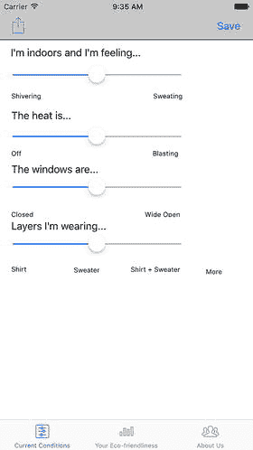
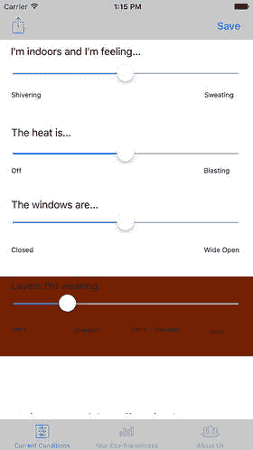
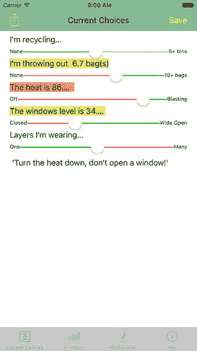
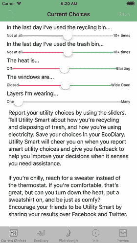
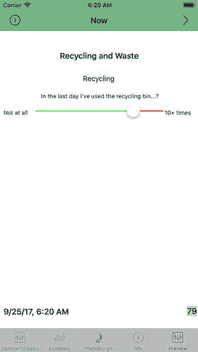
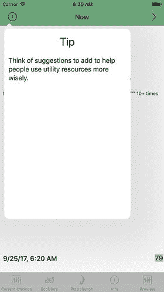
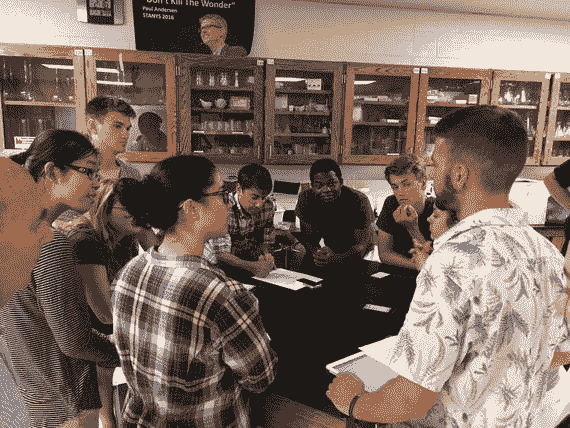
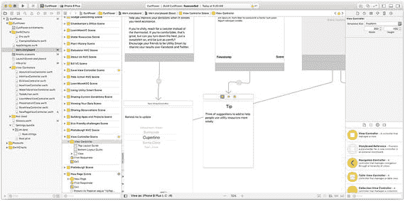
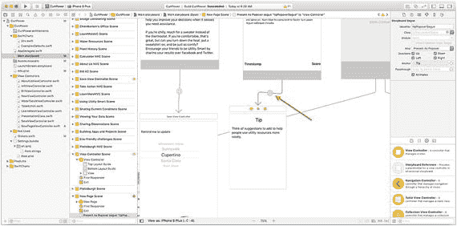

# 14. 图形与可视化技术及问题

你在第 11 章和第 12 章中看到了代码、`Xcode` 和故事板的示例。在这些例子以及本书其他章节的 Swift Playground 中，你可以看到代码、设计原则和实现原理。本章的不同之处在于，它并非专注于如何做某件事，而是逐步讲解一个真实的实施问题与解决方案的序列。你可以看到一个界面的演变过程，以及如何不仅将其视为一幅美观的图片，而是视作一种用于传达信息、帮助人们使用并从中受益的实用工具。

## 介绍 Utility Smart

本章的案例研究是真实的。它追溯了 Utility Smart 界面的演变过程，这是一款旨在帮助人们认识其使用的自然资源并适度使用这些资源的应用程序。

这个应用源于一个简单的想法：向用户提出关于他们近期资源使用情况的问题，并让他们通过滑块来回答。应用内包含一些可供用户浏览的背景信息以获取更多知识，但应用的核心是那些滑块。

数据保存在设备上，可以绘制成图表。数据可以通过电子邮件和 `AirDrop` 等多种技术进行共享。该应用由 Jesse Feiler 使用 `Swift` 和 `Cocoa Touch` 构建。Utility Smart 项目由纽约州立大学普拉茨堡分校地球与环境科学中心的 Curt Gervich 教授领导。（如果你想看到它的实际效果，可以从 App Store 免费下载，地址为 [`http://bit.ly/UtilitySmart`](http://bit.ly/UtilitySmart)。）


## 开始开发应用（Utility Smart 1）

利用第 13 章中的基础问题，我们首先思考了想要实现的功能。滑块的作用是提供一个简洁的界面，让用户在一分钟内输入他们的观察数据和行为数据。图 14-1 展示了应用的第一个版本。（请注意，这是 Utility Smart 的 1.0 版本；该版本已不再在 App Store 中提供，已被本章后面展示的更新版本取代。）



*图 14-1 滑块，版本 1*

为了提供灵活性，请注意界面使用了导航控制器和导航项，在窗口顶部提供了带有“分享”按钮（左侧）和“保存”按钮（右侧）的工具栏。该界面嵌入在一个标签栏控制器中（请注意底部的标签页）。

> **注意：** 导航控制器提供了窗口顶部的工具栏；导航项作为导航控制器的下层部分，是按钮和标题所在的位置。

这种类型的用户界面非常灵活，因为很容易在底部添加最多五个标签页，并且通过在顶部导航控制器中添加更多按钮，你可以在应用的任何视图中轻松访问各种目的地。

`Utility Smart` 从一开始就支持所有 iOS 设备（包括 iPad）运行，但许多开发者发现从小屏幕设备入手再向上适配，比反向操作更容易。这里的情况也是如此：基本开发工作是在 iPhone 上完成的；细节优化则使用了 Auto Layout。

滑块是 Cocoa Touch 框架中一个非常实用的组件，通过调整背景颜色来反映滑块的值，可以强化设置的含义，这并不困难。相关代码将在本章后面展示，结果如图 14-2 所示。



*图 14-2 基于滑块值设置背景颜色*

你在图 14-2 中看到的界面效果非常引人注目：来回滑动滑块时，背景颜色会随之变化（从红色到绿色再到红色），从而反映环境影响。这非常令人印象深刻。

但这种效果略显粗糙。尽管我们使用的是小型设备，但其屏幕性能强大，且以当今的分辨率而言，你并不需要如此直白的工具来吸引人们的注意。图 14-3 展示了下一个迭代版本。它实际上使用了基于滑块值的相同代码；但这一次，不再更改滑块视图的背景颜色，而是改变了文本的背景颜色。此外，导航栏的颜色也被修改为应用所有屏幕统一的颜色。



*图 14-3 文本背景变化*

视图中留有空间来显示评论，以鼓励积极的行为。（这是对文本背景颜色的补充。）

在处理界面时，你很快会学到一条基本原则：空间永远不够用。（哪怕你是在为固特异飞艇设计标志，空间也总是不够用。）

图 14-4 展示了 `Utility Smart 1.0` 的引导屏幕，其中包含超出窗口范围的滚动文本。除了没有足够的空间容纳所有文本之外，项目团队的讨论还指出，实际上应该包含两种类型的信息：

-   如图 14-4 所示的有关资源的信息是第一种信息。
-   第二种信息——提示或建议——可以帮助人们了解如何在利用资源方面做出更明智的选择。

如果能拥有更多空间，并且能够区分这两种类型的信息，那就太好了。通过在此例和其他情况下强调不同类型的信息，你可以让界面更易于用户使用。



*图 14-4 空间不足……*

## 完善应用（Utility Smart 2）

在像这样的应用演进过程中，通常你必须停止抱怨空间不足，并采取实际行动解决问题。`Utility Smart 2` 的解决方案是打破界面原有的一种布局。与其将所有滑块放在一个屏幕上，不如将它们分开，每个屏幕放置一个滑块，这样你就有了更多可用的空间。你无法再同时看到所有内容，但可以为信息提供更多空间。

这正是 `Utility Smart 2` 所采用的方法。图 14-5 展示了一个单独的滑块。



*图 14-5 每页一个滑块*

现在有更多空间用于显示背景信息。由于滑块不再位于同一个屏幕上，共享单个滑块的数据意义不大，因此导航项左侧的空间可以释放出来。它可以替换为一个“信息”按钮，如图 14-5 所示。该按钮可以在故事板中连接到提示的弹出视图，如图 14-6 所示。



*图 14-6 提示弹出框*

这是对空间更高效的利用。它更加优雅，并且对于容纳更多信息来说扩展性更强。因为弹出视图是功能完整的视图，如果你想返回并在提示弹出框中嵌入视频，操作起来也很简单。

在计算机科学中需要学习的重要一课是，要时刻牢记如何实现那些具备扩展和拓展空间的功能。

另一个重要的教训是，你无法坐在办公桌前就能设计出优秀的界面。事实上，作为开发者，你可能对应用的功能了解得太多，以至于无法为从未见过该应用的人（或者见过但以不同视角使用它的人）构建一个有用的界面。

图 14-7 展示了 `Utility Smart` 团队成员 Curt Gervich、Maeve Sherry 和 Michael Otton，在由 Sonal Patel-Dame 教授执教的普拉茨堡高中一个科学课堂上，分享界面想法和反馈的场景。与广泛的用户和潜在用户一起尝试想法和建议，可以帮助你完善界面。



*图 14-7 Utility Smart 2 界面头脑风暴会议*

### 代码片段

实现此界面部分功能的代码很简单，因为它使用了一些非常基础的 Cocoa Touch 工具。

### 创建弹出视图：代码

弹出视图将由一个视图控制器呈现。通常的做法是创建一个 `UIViewController` 的子类。重要的代码如代码清单 14-1 所示。

以下是在视图控制器中实现弹出视图的步骤：

-   在类声明中，使视图控制器遵循 `UIPopoverPresentationControllerDelegate` 协议。
-   在故事板中创建弹出视图（在下一节中展示）。
-   为弹出视图实现 `prepare(for segue:)` 方法。
-   添加 `adaptivePresentationStyle(for controller:)` 方法来管理弹出视图的大小。

```swift
import UIKit
class NowPageViewController: UIViewController, UIPopoverPresentationControllerDelegate {
    ... 代码省略
    override func prepare(for segue: UIStoryboardSegue, sender: Any?) {
        switch segue.identifier! {
        case "tipPopoverSegue":
            segue.destination.popoverPresentationController!.delegate = self
        default: break
        }
    }
    func adaptivePresentationStyle(for controller: UIPresentationController, traitCollection: UITraitCollection) -> UIModalPresentationStyle
    {
        return .none
    }
    ... 代码省略
}
```

*代码清单 14-1 创建弹出视图*


### 创建弹出框：故事板

在故事板中，添加一个新的视图控制器，如图 14-8 所示。在图 14-8 中，它包含一个标题（标签）和一个文本视图。选中它，然后选择实用工具区域中的“尺寸检查器”。将其设置为自由形态。对于弹出框来说，300x400 的尺寸是一个不错的起点。

从视图控制器按住 Control 拖拽到弹出框，以创建一个转场。



图 14-8

设置弹出框尺寸

接下来，高亮显示你创建好的转场，如图 14-9 所示。



图 14-9

为转场命名

高亮选中转场后，点击“属性检查器”并为其命名。该名称必须与 `prepareForSegue` 代码中的名称一致——在此示例中为 `tipPopoverSegue`。

这样即可为你创建好弹出框。

## 总结

可视化和界面创建的最佳解决方案是通过迭代过程，并尽可能多地收集各方意见。有一点需要注意：不要直接询问界面建议，因为人们会根据他们见过的其他东西来回答你。观察他们的实际操作和尝试，留意他们感到困惑的地方。如果你与他们交流，请围绕操作和意义展开讨论：你的职责是弄清楚界面应该呈现成什么样。


