# 第 7 章：3D 工具

### 图层面板

### 创建注册/登录页面

### 创建选择和编辑行程页面

### 使用图层复合进行屏幕布局

### Adobe Fireworks 呢？

### 总结

  
## 第 8 章：创建应用图标及 App Store 所需的附加图形

### 应用发现

### App Store

##### 应用图标

### 启动图像

### 报刊亭封面图标

### 推广截图

### 推广插图

### 应用的页面

### 总结

  
## 第 9 章：为应用开发最终确定素材资源

### 为开发人员创建设计规范文档

### 设计规范文档概述

### 提供颜色信息

### 指定字体与类型

### 解释用户交互

### 将设计切片为素材资源

### 针对不同设备缩放并保存素材资源

### 其他素材准备工具

### 命名素材资源

### 将素材资源打包用于开发

### 沟通是关键

### 总结

  
## 第 10 章：设计最佳实践与应避免的错误

### 创建应用设计声明

### 《人机界面指南》是你的设计圣经，请善加利用

### 线框图很重要

### UI 与 UX：两者有区别

### 简化！

### 善用留白

### 留意 iOS 7 的变化

### 问“为什么？”

### 考虑小屏幕

### iPad 不仅仅是放大版的 iPhone

### 字体很重要

### 提供视觉反馈

### 用户是王者（或女王）

### 设计模式是你的朋友

### 拇指规则

### 从高分辨率到低分辨率

### 快速上手

### 测试、测试、再测试

### 软件会有所帮助

### 图标和截图也很重要

### 交接与沟通

### 总结

### 索引

## 关于作者

**西安·莫森**是一位科技企业家、移动布道者及战略家。

2010 年，西安创立了 Kollective Mobile，旨在帮助企业和初创公司进行移动开发和战略规划。作为一名经验丰富的数字专业人士，她曾与众多知名客户合作，为流行品牌打造大型网站和宣传活动。她多元化的技能涵盖市场营销、广告、移动战略、商业管理和思想领导力。她与合作伙伴和客户紧密协作，帮助他们实现整体业务目标。

西安就移动战略话题为多家出版物撰稿并发表演讲，同时与多家致力于弥合数字鸿沟的非营利组织合作。

作为一位在国际上举办过展览的艺术家，西安热衷于将创造力与技术相融合。她的视频艺术作品曾在西班牙著名的 Optica 艺术节、柏林导演休息室、印度孟买的 Aakriti 画廊以及纽约布鲁克林的 MoCADA 博物馆展出。

## 关于技术审校

**丹尼·斯沃兹曼**是一位软件工程师，自 Apple II 时代起就为苹果产品开发软件。他曾为专业程序员和初学者撰写过多篇关于各种计算机系统的杂志文章。他是一名电子爱好者，曾为 Arduino 开发过草图和接口。在其职业生涯中，他编写过控制传送带系统、医疗设备、铣床及其他各种定制设备的软件。不开发软件时，他喜欢偶尔下盘围棋。他的邮箱是 danny at stowlake dot com。他的网站是 `http://stowlake.com`。

## 致谢

致 Apress 的所有人：凯文和詹姆斯，感谢你们的耐心。也许下一本书会更容易！多米尼克和史蒂夫，感谢你们与我一同构思这本书最初的框架。致所有才华横溢的编辑（丹尼和安妮·玛丽），感谢你们帮助将我的漫谈整理成连贯的文字，我感激你们在整个过程中的帮助。这是我做过的最艰难的事情之一，没有你们，这绝对不可能实现。

致 Kollective Mobile 所有才华横溢的设计师和开发人员，感谢你们让我的工作变得无比轻松。还要感谢我的设计师朋友和同事们，他们的作品激励了我：德鲁、瑞兰、亨利和迈克。

最后，致那些在我认为自己无法做到时支持我的人：妈妈、艾莉森、凯姆和丽莎——感谢你们所有人的支持。

## 引言

iOS 是当今最流行的移动操作系统之一。如果你认真对待移动设计，那么 iOS 7 是必选项。作为一家移动开发机构的负责人，我可以告诉你，我们收到的应用开发请求中超过 50%是针对 iOS 的。随着 iOS 7 和新设备的发布，iOS 已成为移动生态系统中的全球领导者。任何认真对待移动设计或开发的人都不能忽略 iOS。

## 本书读者对象

本书适合那些已从开发角度熟悉 iOS，但现已准备尝试设计的人。本书假设你熟悉该操作系统的一些细节，并有意设计一个由你或他人开发的简单应用。本书将引导你经历整个过程：将你的想法打磨成清晰可行的陈述，详细讲解如何创建第一个线框图，并最终完成应用设计。书中重点介绍了辅助设计过程的工具和技巧，甚至强调了流行的移动设计模式，以减轻设计中的一些挑战。如果你已准备好为全球最流行的移动操作系统进行设计，那么《学习 iOS 设计》就是为你准备的。

## 如何使用本书

本书的结构旨在让你能够将 iOS 应用的概念从初始想法一直推进到开发准备阶段。本书将逐步指导你完成创意验证、构思、设计以及为开发准备素材的过程。内容涵盖屏幕的创建以及设计师应从苹果《人机界面指南》中注意的规范。本书是一本通用的高层次指南，适合那些希望了解更多关于 iPhone 操作系统以及为 iPhone、iPod Touch 或 iPad 设计应用所需事项的读者。

## 网站上有什么

### `apress.com` 网站

`apress.com` 网站包含一份关于书中虚构应用“轻装旅行”（Travel Light）的设计规范文档示例。它为开发人员在开发应用期间提供了关于字体、颜色及其他必要信息的指南。

## 第 1 章：你有了一个 iPhone 应用的点子，然后呢？

恭喜你！你有了一个应用的点子，并且做出了一个重要的决定——自己来设计它！你已经加入了成千上万人的行列，他们决心学习如何将一个想法从脑海中微小的火花，转化为一个设计完备、可供开发的应用。

你可能已经知道，应用是移动生态系统中不可或缺的一部分。所有移动设备都运行着应用。然而，你决定为 iOS 设计应用，这本身就是一个独特的选择。在所有应用商店中，苹果应用商店是“老大哥”，其应用数量远超其他任何应用商店。不过，既然你已经选择为 iOS 设计应用，想必你早已明白这一点。

应用无处不在。自 2008 年 7 月苹果应用商店最初上线并拥有 500 个应用以来，应用数量便持续稳步增长。截至 2013 年 6 月，这一数字已增至近 90 万，苹果 CEO 蒂姆·库克估计，迄今为止已向开发者支付了 100 亿美元。因此，如果你有一个应用的点子，那便意味着你拥有赚钱和触达大量用户的绝佳机会。这些都是你愿意为 iOS 进行设计的绝佳理由。

如今，应用的点子并不难找。很多人都能想到。那么，你该如何将你的想法从“一个点子”转变为实际存在于应用商店中、能在设备上运行的真正应用呢？这不可能一蹴而就，但只要稍加努力，就绝对有可能实现。

将应用上架苹果应用商店并非难事。但创造一款具有原创想法、出色视觉效果和卓越执行力的应用却非易事；这需要大量的规划、一点调研和相当的投入。

如果你想让你的想法从仅仅是一个点子，最终变成设计完善并开发完成、可在移动设备上运行的 iOS 应用，你需要遵循一些步骤——非常具体的步骤。

虽然这个过程看似艰巨，但却是必要的，尤其是当你第一次尝试设计应用时。

一个简单的事实是，大多数提交到应用商店的应用最终都“夭折”了，并在发布后不久便无人问津。如果没有恰当的规划，面对应用商店中海量应用的激烈竞争，如果你的应用不具备独特的创意和执行方式，那么它很可能不会被很多人注意到。无论是出于商业目的还是仅仅作为个人项目，你在考虑创建应用时的最终目标都是尽可能触达更多用户。如果你有一个很棒的应用程序想法，并且你坚信它，那就去做吧。有很多人想到了点子却从未付诸行动，所以仅仅因为拥有这个想法，你就已经属于少数人了。为之庆贺吧，因为真正的工作现在才开始。

### 假设

本书基于一些假设作出，最主要的假设是：你至少从开发角度对 iOS 有所熟悉，但同时希望有机会通过了解一些设计知识来拓展你的开发技能。然而，本书并非关于开发本身。如果你对学习如何*构建*一个 iPhone 应用感到好奇，那么这本书并不适合你。但如果你希望专门增强与 iPhone 操作系统相关的设计知识，那么你来对地方了。

为了简洁起见，在本章中，我将构思过程分解为六个易于遵循的步骤。每一步都会让你更接近设计出你的 iOS 应用的最终目标。

1.  定义你的想法。
2.  与同行分享你的想法。
3.  将你的应用与其他应用进行比较。
4.  分析你的发现。
5.  保存同类应用以供将来参考。
6.  必要时修改你的想法。

### 第一步：定义你的想法

首先，用一两句话写下你的想法。三句话也许也可以，但请尽量用两句简短的话说清楚。如果需要更多句子，那也没问题；然而，目标是能够在 30 秒或更短的时间内描述并解释你应用背后的想法及其功能。这通常被称为“电梯演讲”，也是整个流程的第一步。花些时间，尽可能让这些句子简洁的同时，仍能准确表达你的应用功能。这一点很重要，它将对你和你的应用大有裨益，因为在设计和最终构建应用的过程中，你会反复回到这些描述上。当你推进接下来的几个步骤时，你会发现，随着你审视其他应用和类别，你对应用的描述可能会发生变化。这是流程中很自然的一部分。保持灵活，乐于改变。

例如：“‘轻装旅行’应用将通过提供清单来帮助频繁旅行的人，确保他们只打包即将到来的旅行所需的物品。”

写完你的陈述后，反复背诵直到记住。你应该能够在不参考笔记的情况下说出它。问问自己它听起来如何。语法是否正确？你关于应用的构思是否合时宜？它是否解决了人们当下正面临的问题？它是否以人们需要的方式处理了问题？它是否独特？如果是，它独特在哪里？如果不是，那么你需要继续完善你的描述。不要急于求成。如果你在第一步就卡住了，那很可能说明你的想法还需要打磨。给它应有的时间。

一旦你能够跨过这第一道坎，并且对自己的应用描述感到满意，就把它先放到一边，几天后再回来看。当你再次阅读你的想法及其描述时，它是否还像第一次那样让你兴奋？这个句子是否让你想进一步探索这个应用？有什么变化？更重要的是，它听起来是否仍然是个好主意？它是否仍然让你充满最初对这个项目的热情？

如果不是，那么或许值得对你的描述以及催生它的想法再下功夫。根据你对此感受的强烈程度，你可能想完全放弃这个想法，转而开始构思另一个不同的应用。一切由你决定。

重要的是要记住，很多人每天都会产生想法。但是，拥有一个想法和将之变为现实之间存在着巨大差异。这个流程的第一步，就是让你的想法超越最初的构思阶段。

但是，如果你和刚开始时一样坚信，并且仍然对你的想法充满热情，那么是时候进入下一步了。

### 第二步：与同行分享你的想法

与他人分享你的想法！这对某些人来说可能听起来有违直觉，甚至非常可怕，但事实并非如此。为了验证你的想法，你绝对需要与他人分享。如果想法只是停留在你脑子里，那又有什么用呢？问问你的朋友和你身边信任的人，让他们针对你的想法坦诚地说出看法。尝试与那些敢于给你真实反馈的人分享你的想法和描述。寻求建设性的批评，但同时也要确保你已准备好接受它。

提出有助于推动想法前进并最终指导其设计和功能的问题。如果你有时间，可以创建一个简短的问卷，请人们填写。

沿用上面“轻装旅行”应用的初始想法，以下问题是你可能会问的示例：

1.  `你是否理解这个应用试图解决的问题是什么？`
2.  `如果不理解，缺失了哪些信息？`
3.  `是否清楚这个应用的目标用户是谁？`
4.  `你会使用这个应用吗？为什么？`
5.  `你会改变什么？`

简要说明关于该应用的想法：它做什么，以及它将如何工作。然后提出几个关键问题，这些问题将帮助你获取能进一步深化这个想法的信息。这些问题应具有引导性，旨在引出尽可能具体的回答。在构思阶段的这一节点，回答越具体，对你而言价值就越大，并且有助于为你的应用设计提供参考。

在这个阶段，你们中的一些人可能不愿与他人分享自己的想法。在这个专利流氓和版权侵权盛行的时代，你很容易认为分享想法是不妥当的。请记住，想法无法被版权保护，因此在流程的初期就获得关键反馈至关重要。如果你担心向更广泛的群体分享想法，那么就坚持找一个你信任的核心团队。只要朋友、同事，甚至家庭成员符合你应用的目标人群定位，都可以。

这个过程也不必是一场漫长而曲折的事情。你对应用的描述、它做什么，再加上几个能引出最佳反馈的简短问题，就足够了。

完成这一步并收到口头或问卷形式的答复后，仔细审阅所有答复。答案是否清晰？是否需要提出后续问题以澄清？如果需要，那就去做。待这一切完成后，坐下来，带着你的想法和收到的反馈，一边回顾反馈，一边审视你的想法描述。你该如何修改你的想法，以解决反馈中概括出的问题？

需要注意，并非所有反馈都是好反馈。有些反馈，你需要持保留态度。一条好的经验法则是，考虑那些能让你的想法更接近应用核心的反馈和建议。如果收到的反馈有助于你解决应用所针对的问题，那就加以考虑。你是否收到了意料之外、可能让你重新思考想法的反馈？这完全没问题。

如果你需要重写你的想法陈述和描述，那就去做，并再次对照你所收到的反馈进行检查。保存所有你收到的反馈，即使你在项目的这个阶段并未使用它们。随着你进入设计流程的后续阶段，它们也会派上用场。

### 第三步：将你的应用与其他应用进行比较

在这一步，我们将真正开始扩展你在第一步中为应用创建的初始想法。既然你已经通过一个小型潜在用户对照组验证了该想法，现在我们需要看看你的想法与苹果应用商店中现有应用相比如何。

自 2008 年应用商店携 500 个应用上线以来，iOS 设备可用的应用数量每年都在呈指数级增长。如前所述，截至 2013 年 6 月，苹果应用商店中约有 90 万个应用。竞争可谓非常激烈！幸运的是，苹果在应用分类方面做得相当出色，而且你可以直接从 iPhone、iPad 或 iPod Touch 上轻松访问和浏览应用商店。

一个好的起点是应用商店的“精选”栏目或标签页。在这里，你会看到商店的“新款佳作”和“热门应用”板块。这些是由苹果编辑团队挑选出来，展现一流可用性、设计和功能的应用。正因如此，它们被苹果推荐，并且在人气和销量方面表现极为出色。通常，这些应用在提交到应用商店时会被标记为独特应用。苹果的编辑团队试图挑选那些在某些方面具有创新性的应用，在应用商店中进行推荐。很有可能，你已经拥有其中一些应用，但由于每天发布的应用数量庞大，你可能会看到一些之前从未见过的新应用。“新款佳作”和“热门应用”板块中的应用来自各种类别。浏览不在你的应用特定类别中的应用，以及那些与你的应用同类的应用，以便能够看到各种风格和功能，这是一个好主意。

同时，也看看“排行榜”中的应用，以了解当前哪些应用最受欢迎。导航到每个应用的页面，特别注意每个应用的描述和截图。是否有任何线索能说明是什么让这个应用在其特定类别中脱颖而出？请注意，你会发现在一个类别中有多个功能相同的应用。例如，“游戏”是苹果应用商店中最受欢迎的类别，遥遥领先于“教育”、“娱乐”和“生活”等类别。这些类别中塞满了应用，而且每天都有更多的应用在设计、开发、审核和发布。如果你的应用目标是这些类别之一，那么它确实需要做到脱颖而出。

当你浏览热门应用列表时，务必导航到应用商店中每个应用的页面。注意应用的图标、名称、描述、截图，以及最后但同样重要的评论数量和平均评分。应用商店“新款佳作”板块中列出的大多数应用都有令人印象深刻的下载量、评论和高评分。评论和评分对任何应用来说都是重要的统计数据。它们会醒目地显示在你的应用在应用商店的页面上，因此你自然希望你的应用受欢迎且设计精良，以便从用户那里获得高评分。

在查看应用页面时，你会发现所有应用都需要提供截图。看看那些更受欢迎应用的截图。注意那些让你眼前一亮的截图。请注意，基于截图，你也许能大致了解其功能。但这不是此项练习的目的。利用截图来感受每个应用的设计美学。该应用的用户界面有何独特之处？注意配色方案，以及根据你在页面上能看到的内容来判断哪些是有效的。这些因素中的任何一个是否会让你更倾向于或不太愿意下载该应用？记下原因。

特别关注那些与你想要创建的应用属于同一类别的应用。它们之间有相似之处吗？你能从应用商店的应用页面中，就功能和设计获取到什么线索？

### App Store 竞品分析指南

#### 第一步：浏览用户评论

应用商店中的每个应用都会有用户评论。每位顾客都可以在应用的商店页面上发布公开评论和评分，所有人都能看到这些内容。请务必阅读你所在类别中排名靠前的应用以及那些吸引你的应用的前 10 条左右的评论。试着了解每位评论者的主要关注点。他们是在称赞这款应用吗？还是在贬低它？评论者有时可能非常直言不讳，但最严厉的评论中也往往隐藏着真相的碎片。因此，如果用户愿意花精力撰写评论，那么其中一定有某些值得参考的要点。

如果你已经下载了这些应用（当然要根据你的预算来），请确保亲自使用它们，并阅读一些最好的和最差的评论，从而平衡地了解应用中存在的问题。将这些与你自己的应用进行比较。试着确定你的应用能否填补这些应用（特别是你所在类别的应用）留下的市场空白。同时记录下这些发现。

#### 第二步：关注应用评测网站

你也可以尝试访问应用评测网站。这些网站会在应用商店系统之外对应用进行审查和评级。你在这里找到的内容质量可能参差不齐，但你也可能发现一些在应用商店中找不到的应用。关于苹果应用商店搜索难度的讨论一直存在，但了解苹果认为哪些是应用设计的最佳范例仍然很有帮助。

#### 第三步：分析你的发现

这是项目的一部分，我们在此汇总从应用商店以及我们自身收集到的所有数据。

制作两个列表。第一个列表将包含你最近在应用商店探索中最喜欢的应用。你为什么会被这些特定应用吸引？描述这些应用的突出之处。它们有什么独特之处？是因为它们的名称、标志设计还是截图？是否有任何应用与你的想法相似？是否有应用属于与你应用相同的类别？请特别关注这些应用。你的应用与其他热门应用之间是否存在大量相似之处？如果是，你如何将自己的应用与它们的区分开？如果需要，请重新审视描述你应用的那句话，思考你的应用将如何与众不同，以及如何避免重复造轮子。

**列表一：**

*   应用#1 – 优秀的设计
*   应用#2 – 名字奇怪，与功能无关
*   应用#3 – 喜欢它的配色方案

第二个列表将包含那些与你的想法应用属于同一类别的应用。该类别中排名靠前的应用是哪些？在你看来，这些应用做对了什么，又做错了什么？密切关注那些评分高、下载量大的应用。用户在说什么？记录下这些应用中任何独特、正面或负面的亮点。此外，注意关于你所在类别的其他信息。你类别中的大多数应用是付费应用还是免费应用？在评分最高、评论最好、下载量最大的应用中是否存在一致性？当你查看截图时，是否发现这些应用的界面（`UI`）有任何相似之处？它们在哪里做得很好？

**列表二：**

*   应用#1 – 与我的应用非常相似。评论抱怨价格太高。
*   应用#2 – 易于使用，非常受欢迎，是该类别排名第一的应用。
*   应用#3 – 受到苹果推荐，设计精美，界面友好，易于使用。

以`Utilities`（实用工具）类别为例。这个类别包含许多具有相似功能的应用。`To-Do`（待办事项）应用就是一个完美的例子。应用商店中有不少这类应用，它们都有一个共同的目标：通过允许用户分类任务、创建列表，来帮助用户管理时间或项目。然而，每个应用处理问题的方式都不同，虽然核心任务可能相同，但每个应用都与其他应用有明显区别。它们在用户界面（`UI`）、功能和配色方案上各不相同。仅凭这些因素，就能让两个执行类似任务的应用看起来截然不同。请思考这与你的应用的关系，以及在一个可能已经饱和的领域中，什么能让你的应用脱颖而出。

一个已经饱和的领域并不是放弃你创意的理由。毕竟，应用商店里有近百万个应用，你很难找到一个尚未饱和的领域。因此，不要将可能饱和的类别视为成功的障碍，而应将其视为推动你找到独特方法来解决一个普遍问题的动力。它将迫使你跳出思维定势，为现有问题创造一个真正原创的解决方案。

#### 第四步：为将来参考保存竞品应用

如果可能，请尽量下载你列表中的应用。希望大多数是免费的，其他的也不会太贵。通常，应用商店中的应用价格从免费到 3.99 美元不等，但也有一些可能更贵。根据你的预算下载。价格超过 3.00 美元左右的应用被认为是高级应用，你需要自行决定能负担哪些。

如果你选择不购买应用，可以尝试在互联网上寻找这些应用的评测。如果一款应用在应用商店中被推荐，那么它很可能也出现在`Mashable`、`Tech Crunch`或`Venture Beat`等热门科技期刊中。有时，这些文章会比应用商店中的描述更详细地介绍应用的用户界面和功能。快速谷歌搜索应该能帮你找到一些顶级应用的不错评测。如果你对下载一个可能不会使用的应用犹豫不决，或者它超出了你的预算，这可以为你省下一些钱。

应用下载完成后，将它们放在一个名为“`Research`”（调研）或其他能提醒你其用途的文件夹中。如果需要，你可以进一步将应用分类到标有“付费”、“免费”等文件夹中。将这个文件夹放在手机上方便获取的位置，以便需要时轻松访问。在整个过程中，你将反复参考这些应用，以帮助你的创意构思过程。

#### 第五步：根据需要修正你的创意

一旦你下载了应用并进行了分类，真正的乐趣就开始了。将你对应用的“一句话描述”放在手边（或者你现在应该已经记住了所有不同的版本），更深入地探索你下载的应用。最初，计划在每个应用上至少花费半小时。你会发现，根据应用做得好的方面，在每个应用上花费的时间可能会少于或多于半小时。也请记录这一点。你可能需要考虑的其他问题包括：

*   这些应用在哪些方面做得好？
*   它们在哪些方面失败了？
*   它们的用户界面有哪些独特元素？
*   它们易于使用吗？

更重要的是，它们与你想要创建的应用有何关联？

请特别关注那些与你创意应用属于同一类别的应用。它们与你应用试图解决的核心问题相比如何？

如果你的应用在我们看来能与这些应用相提并论，那真是太棒了。你或许真的有所发现！如果你对自己的应用充满信心，那就大胆去做吧。然而，考虑到每天提交到应用商店的应用数量，光凭数字就可能让你处于劣势。因此，尽可能以任何方式脱颖而出至关重要。当你有了一个真正相信的想法后，艰苦的工作才真正开始。请扪心自问以下问题：

*   我的应用试图解决什么问题？
*   我的应用的目标受众是谁？
*   这个应用的最终目标是什么？
*   这个应用会同时支持 iPhone 和 iPad 吗？

一旦你回答了这些问题，并且没有哪个答案是致命障碍，那么你就可以继续开发你的应用了。这意味着你的想法是可靠的，你已经完成了基本的验证和市场调研，并且准备进入为 iOS 设计应用的下一阶段。

### 总结

所有应用都始于一个想法。但研究对你的设计也至关重要。明确应用的功能描述，并与他人验证，这将帮助你完善你的想法，使其不仅仅是一个想法。将你的应用想法与应用商店中的其他应用进行比较，是了解你将面临何种竞争、获取灵感以及理解用户真正需求的好方法。经历必要的定义和完善过程，是创建应用的重要一步，它将为后续步骤奠定基础。接下来，我们将讨论你需要了解的有关苹果新操作系统 iOS7 的内容。

## 第 2 章：iOS：你需要了解什么

`iOS` 代表 iPhone 操作系统，是所有苹果移动设备和平板电脑所基于的软件。这包括 iPhone、所有版本的 iPad，甚至包括 iPod Touch。`iOS` 允许所有应用在这些设备上运行。`iOS` 于 2007 年伴随初代 iPhone 发布，直到最近 iOS 7 的宣布和发布，期间经历了多次小规模更新。

它是一个用于多点触控设备的操作系统。因此，用户旨在直接与运行该操作系统的设备屏幕进行交互。这为设计师带来了一些独特的机遇和挑战。因此，了解哪些元素是标准的，并且在多年与 `iOS` 的交互中已为用户所熟悉，这一点非常重要。

在整个 `iOS` 中，有一些通用的 UI 元素，无论设备如何，它们都是标准的，并且无论在哪个应用中使用，都能帮助用户执行常见的操作。我们将回顾其中的一些元素，因为它们在您设计应用时会很有用。

2013 年 6 月，在旧金山举行的年度开发者大会上，苹果公司发布了 iOS 7。在本章中，我们将讨论 iOS 的标准 UI 元素，以及它们如何随着 iOS 7 演进和变化。

### iOS 7 的新特性

iOS 7 之所以重要，是因为它代表了该操作系统自六年前发布以来最重大的变化。如果你正在从头设计一个应用，你需要了解苹果希望你如何遵循其新的设计语言；如果你已经设计了一个应用，那么你需要重新设计，以符合 iOS 7 中提出的新的、改进的设计范式。

虽然工具栏、标签栏、导航栏和其他用户界面元素的整体功能保持不变，但整个操作系统的外观和感觉已经完全改变。

作为一家以设计为中心的公司，苹果一直以其软件和硬件的简洁美观设计美学而闻名。这种设计美学已成为公司传统的一部分。iOS 7 是这种设计美学的延伸。虽然它本身并不代表一种新的设计范式（它在设计上大方地借鉴了目前市场上一些更受欢迎的应用的提示和线索），但它确实代表了该操作系统的一个全新方向，并将改变设计师未来设计其应用的方式。可以这么说，体现 pre-iOS 7 标准的应用在新操作系统上运行时会显得过时。

#### iOS 7 的指导原则

乔纳森·艾维，有时被称为苹果的创意沙皇，一直以允许形式与功能以美丽无缝的方式共存而闻名，无论是硬件还是软件，iOS 7 也不例外。因此，新界面以不引人注目而自豪。在整个更新的《人机界面指南》（HIG）中，苹果强烈要求设计师让设计服务于内容。iOS 7 试图以身作则。遵循这一理念的设计师会发现，他们的应用在 iOS 7 框架内能够完美无缝地呈现和运行。

为 iOS 7 设计的关键是保持简洁。这一点在 `HIG` 中一直有所提及，但伴随着这个新的设计方向，简洁性被推到了前台和中心位置。那些在旧版操作系统上运行良好的老式应用设计，在 iOS 7 上会显得臃肿复杂。因此，你必须考虑如何在保持内容优先的同时适应这种新的色彩搭配。虽然以前对 iOS 的升级侧重于开发，但是这次也有很多开发方面的更新。设计师将被迫在未来的应用设计方式上做出重大改变。所有应用现在都必须针对视网膜屏幕进行优化，图标也有了新的外观和感觉。

有三个指导原则和主题应该指导 iOS 7 应用的设计：

-   ** deference（顺从）** – 指的是用户界面能够理解并与应用内容互动，而不是与之竞争。事实上，`HIG` 指出 UI *永远* 不应与内容竞争。这意味着你在 UI 中选择的元素绝不能压倒内容，也不能让用户必须在两者之间做出选择。如果存在任何疑问，内容优先。每一次都是如此。

-   **清晰** – 指的是所有新设计都必须在视网膜屏幕上清晰易读这一新要求。以前，如果你的设计没有针对视网膜屏幕优化，在新设备上会显得略微模糊。但现在不行了。随着 iOS 7 的推出，苹果现在要求文本和图标在所有设备上都清晰、锐利、明了。这也意味着不再使用斜面效果和投影效果。

-   **深度** – 新的注意力被放在了图层、透明度、半透明度和动效上，以在应用中创造深度感。iOS 7 充满了优美的过渡和逼真的动画，为环境增添了新的响应性和纵深感。

如果你正在为 iOS 7 改造一个旧应用，你需要重新审视每一个页面，去除沉重的阴影、斜面以及其他容易使设计显得沉重的特征。请记住，功能性和内容必须占据前台和中心位置。iOS 7 将以一种全新的方式向用户展示你的应用，所以请思考你将如何以优雅时尚的方式，在保留缩小版应用外观的同时，进一步提升其功能。所有这些元素必须相互平衡，才能与 iOS 7 协同工作。

现在，让我们看看在 iOS 7 中你可以期待的一些具体变化。从开发的角度来看有很多更新，但就本书而言，我们将主要关注那些会影响未来应用设计的变化：主屏幕、字体排印、图标、栏、表视图和表视图元素。

### 主屏幕

#### iOS 7 中的主屏幕

主屏幕是 iPhone 或 iPad 上应用图标所在的地方。所有内容都位于主屏幕上。你可以将它想象成电脑的桌面。启动 iOS 后，你首先看到的会是主屏幕，并且会不断返回这里。你会立刻注意到 iOS 7 主屏幕的变化。之前位于屏幕底部闪亮、带有斜面托架上的常用应用图标（如图 2-1 所示），现在则位于一个半透明的背景之上，该背景仅部分遮挡了墙纸图像，如图 2-2 所示。打开应用时的过渡动画比以前更流畅，新的设置允许用户将全景图像设置为墙纸。左右移动手机也会产生“平移运动效果”。iOS 7 让用户以新的方式与 UI 交互，这也延伸到了应用上。用户现在可以从主屏幕访问某些设置，从主屏幕进行聚焦搜索，以及从主菜单向下滑动以查看新的通知中心。本章稍后我将详细介绍内置应用如何为 iOS 7 进行升级。

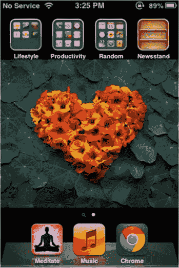

图 2-1. iOS 6 主屏幕与应用图标。常用应用位于闪亮的托架上

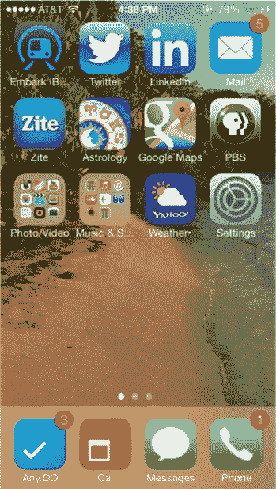

图 2-2. 在 iOS 7 中，“信息”和“电话”图标现在位于屏幕底部的半透明条中

### 字体排印

iOS 7 的初始版本以及后续版本都采用了非常细的 Helvetica Neue Ultra Light 字体。这代表了一种完全不同的方法，为操作系统带来了更新、更轻量、更现代的外观。然而，在某些情况下，这种字体难以查看和阅读。最近的版本已移除了超细字体，转而使用更粗、更易读的字重。在底层，新的字体渲染引擎允许开发者精确地选择字体在其应用中的显示方式。这为设计师在字体排印方面提供了大量的自定义选项。

**注意** 对于包含大量文字的应用，设计师需要为 iOS 7 重新设计。

像为你的应用选择文本或字体这样简单的事情，在 iOS 7 中将变得更加重要，因为新的 API 将允许用户使用动态类型来调整每个应用中的文本大小。这为设计师在思考其应用如何呈现给用户时，增加了额外的责任。

#### 图标

所有标准应用的图标都已重新设计。操作系统早期版本中老式图标的斜面、阴影和光泽的拟物化外观已不复存在。眼尖的用户可能还记得，按照标准，旧的应用图标可以带或不带程序化添加的光泽和渐变效果。这些效果已被完全移除，取而代之的是采用新色调和新扁平化外观的图标，这也是许多较新的热门应用所采用的特征。参见图 2-3，了解所有内置应用的图标如何为 iOS 7 重新构想。

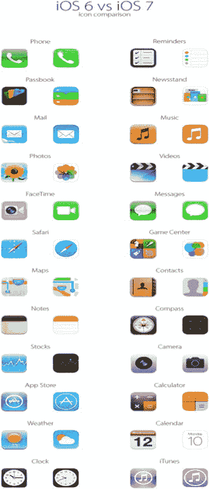

图 2-3. iOS 6 与 iOS 7 图标并排对比

**注意** 你的创意部门能否重新制作上图？iOS 7 中 Safari 的新图标是一个位于白色正方形上的圆形。在上图中难以看清。制作部门能否复现这个图标？

不仅是内置应用的图标被重新设计。快速查看新的控制中心（从主屏幕的任何页面轻扫即可访问）会发现，其中的图标也已按照 iOS 7 的扁平风格重新设计。这些图标不可自定义，也不应该与你的应用相关，但需要快速研究一下，才能充分了解 iOS 7 为 iPhone 和 iPad 带来的变化范围。

然而，图标只是苹果为 iPhone 和 iPad 修改所有标准应用外观的开始。

图 2-4 显示了 iOS 6 上的锁定屏幕视图。请注意状态栏如何与屏幕其余部分分离，以及密码键盘上带有阴影和斜面的按钮。iOS 7 摒弃了所有这些设计。

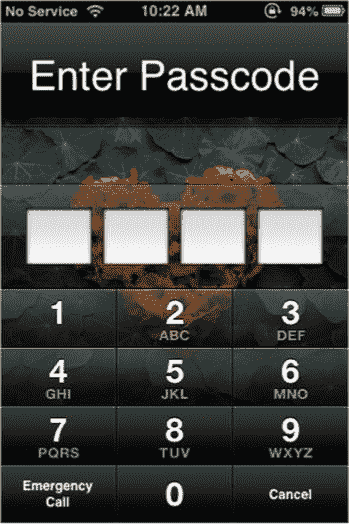

图 2-4. 带有密码输入的 iOS 6 锁定屏幕

图 2-5 显示了 iOS 7 上的锁定屏幕视图。这里需要特别注意的具体项目是键盘上按钮的新外观。它们现在符合苹果新的“扁平”设计，并且是圆形的，而不是 iOS 6 及更早版本中使用的方形键盘按钮。注意空间的利用，以及键盘如何成为此屏幕的焦点。功能——输入密码是主要焦点，没有任何东西分散这一体验。旧版本的体验是碎片化的，各个数字窗口占据了屏幕上相当大的空间。在 iOS 7 中，我们习惯用作页面指示符的圆圈被提升到了新的高度。它们现在出现在状态栏中作为信号强度指示符，以及在锁定屏幕上用户输入密码以访问设备时出现。

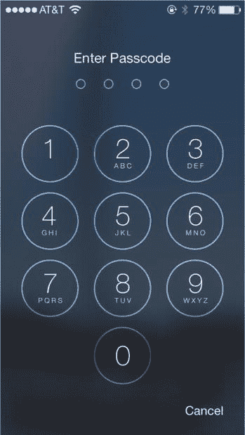

图 2-5. 带有密码输入的 iOS 7 锁定屏幕

### 栏

iOS 中常见的 UI 元素是栏。它们用于多种用途，例如显示设备信息、为用户提供额外选项或控件，以及显示按钮。

栏的大小因设备而异，但在 iOS 中大多是恒定功能，有助于向用户显示关键信息。在 iOS 中，所有 iOS 应用中的栏都具有专门设计的外观和行为。我在下面列出了 iOS 中最常见的栏，以及它们在 iOS 7 中的变化。

### 状态栏

状态栏为用户提供关于设备的信息，例如时间、电池电量信息和网络连接详情，以及应用是否正在访问用户的位置信息（图 2-6）。无论设备处于竖屏还是横屏模式，它都位于屏幕的最顶部。设计你的应用时，根据应用的外观和色调，有一些关于如何使用状态栏的指南，并且你可以选择几个选项。苹果允许你在用户查看关键信息或玩游戏时隐藏状态栏。但还有其他限制，例如，当应用正在使用大量网络资源时，应使用网络指示器来显示。

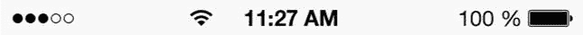

图 2-6. iOS 7 中的状态栏

在视觉上，允许对状态栏进行一些自定义，但仅限于颜色和动画。尽管状态栏的高度是固定的，但它包含的信息至关重要，因此，如果你决定隐藏状态栏，应确保用户无需退出应用即可再次查看它。

#### iOS 7 UI 元素指南

### 状态栏

在 iOS 7 中，状态栏采用了全新的设计，变得半透明、透明且无边框。设计师们会发现状态栏和导航栏之间不再有分隔线。实际上，在 iOS 7 中，它们看起来融为一体。当在 iOS 7 中查看旧版应用时，分隔线仍然存在，但在所有预装于 iOS 设备上的重新设计的原生应用中，这条分隔线已被移除，取而代之的是苹果更简洁的新 UI。如果您的应用有彩色背景，您需要牢记这一点，并考虑状态栏在其上的显示效果。

状态栏上显示的标准信息包括：

- **屏幕方向** – 指示设备是否已锁定为竖屏或横屏模式。如果屏幕未锁定在特定方向，则不会显示此图标。
- **蜂窝网络信号强度** – 此前，此信息使用条形格显示。在 iOS 7 中，条形格已被圆形指示器取代。
- **运营商名称** – 包括 AT&T、Sprint、Verizon 或其他任何运营商。
- **连接类型** – 常见的包括`3G`、`4G`或`LTE`。
- **WiFi 指示器** – 告知设备已连接到可用的 WiFi 源以及信号强度，通常显示为一到三个条形格。
- **蓝牙** – 正在连接使用蓝牙的设备。
- **时间** – 显示当前时间，通常位于中间位置。
- **电池指示器** – 显示设备的剩余电池电量。

### 导航栏

导航栏允许用户在 iOS 中进行导航。它始终位于状态栏下方，并包含几个关键元素，包括当前屏幕的标题以及给定时间屏幕上信息层级中的任何导航按钮。当用户在 iPad 或 iPhone 上将设备从竖屏切换到横屏时，导航栏的高度和宽度会发生变化。

导航栏的外观以及其上的元素都可以自定义。像返回按钮、标题和背景等元素都可以自定义，以便在视觉上更好地与应用的整体风格保持一致。

苹果明确要求**不要**在导航栏中创建多段返回按钮或面包屑导航。原因如下：首先，这会使必需的返回按钮区域过大，从而侵占当前屏幕标题的尺寸；其次，在多段返回按钮中列出多个分段会减少每个分段可用的空间，从而导致用户可点击的区域越来越小；最后，层级越多，决定显示哪些层级就越困难。这些是需要牢记的重要事项，因为在 iPhone 和 iPod touch 上，屏幕空间非常有限。

与状态栏类似，导航栏在 iOS 7 中也有了新的外观（图 2-7）。它同样是半透明的，并且采用了无边框按钮。也就是说，在改进后的导航栏中完全没有按钮。设计师还应考虑到这一点在 iOS 7 全新排版引擎下的含义。如有必要，请与开发者紧密合作，确保字体在导航栏中清晰显示且符合您的预期，因为这决定了用户如何在您的应用中移动和交互。

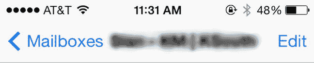

图 2-7 iOS 7 邮件应用的导航栏

### 工具栏

工具栏允许用户根据当前视图或屏幕上的内容执行特定操作（图 2-8）。在 iPhone 上，它位于屏幕底部；但在 iPad 上，它可能位于其他位置，例如页面顶部边缘。对于您的工具栏，苹果建议在应用中使用系统提供的按钮和图标。但是，如果您的应用具有自定义任务，则需要为工具栏提供自定义按钮和图标。请记住，工具栏上的图标应保持与上下文相关，仅包含与当前屏幕操作相关的操作。

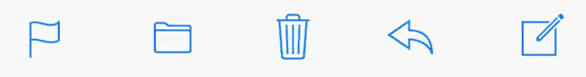

图 2-8 iOS 7 邮件应用中常用的工具栏图标

在 iPhone 上，工具栏在从竖屏旋转到横屏时高度会发生变化，因此任何自定义图标也需要设计为能够适应这种调整。

工具栏和导航栏中也推荐使用标准图标。工具栏的标准图标包括：旗帜、文件夹、垃圾箱/回收、转发/分享以及撰写。

#### 标签栏

在每个应用中，用户需要在各种自定义视图和模式之间进行切换导航。标签栏促进了这些操作。它位于屏幕底部并保持一致，并且应该可以从应用中的任何位置访问。标签栏的默认背景色此前是黑色，但可以根据应用的设计进行自定义。现在在 iOS 7 中，标签栏的默认颜色是白色，并且与导航栏共享许多相同的属性。不过，也可以通过编程方式更改标签栏的背景。标签栏也存在限制。例如，在 iPhone 上，任何标签栏中一次最多只能显示五个标签。如果要显示更多，iOS 会自动添加一个“更多”标签，并在列表中显示剩余的标签。而在 iPad 上，则允许显示超过五个标签。在任何设备上，无论方向如何，标签栏都保持一致。

您可以使用标签栏通过添加徽章、数字和符号向用户传达信息。这些元素会以一种不打扰用户的方式吸引对标签栏的注意，并允许用户在方便时轻松访问。

### 表视图与表视图元素

表视图是 iOS 以清晰高效的方式显示信息的独特方式。它们是 iOS 的 UI 工具包中最常用的组件之一，传统上以包含多行的单列列表形式出现。这些行可以根据个人喜好和提供给用户的信息进行分组和分隔。表视图有两种类型：**普通表视图**是延伸屏幕整个宽度的表视图；**分组表视图**则从背景、侧面和屏幕边缘向内缩进。

在 iOS 7 中，所有表视图都延伸至屏幕边缘。这也适用于分组表，它们不再从背景向内缩进。请参见下面的示例（图 2-9 和 2-10）。

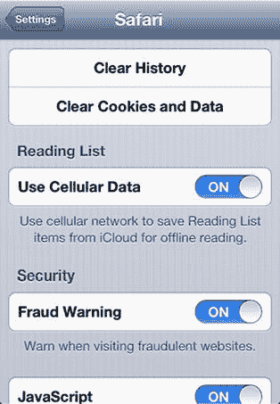

图 2-9 iOS 6 中的设置屏幕显示分组表视图

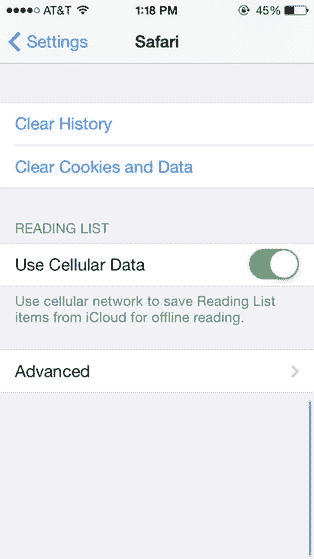

图 2-10 iOS 7 中设置屏幕和分组表视图的新外观

上述图 2-9 展示了浏览器应用 Safari 中旧版表视图的设置界面。请注意，在旧版本中，分组表视图用于将信息与背景区分开，并将相关任务组合在一起。现在看看该视图在 iOS 7 中发生了怎样的变化。

在上图图 2-10 中，展示了运行在 iPhone 5 上的 iOS 7 系统，请注意屏幕尺寸有所不同，分组表格视图的新外观也发生了变化。

#### 表格视图元素

在 iOS 交互中，有一些特定元素用于在不同视图和场景下向用户传达信息。这些元素的创建是为了扩展表格视图的功能，并帮助最大化利用屏幕空间。这些元素包括：勾选标记、展开指示器、详情展开按钮、行重排、行插入、删除按钮控件以及删除按钮。在设计应用时，毫无疑问你会使用表格视图来展示信息。虽然这些元素在特殊情况下也可以用在表格视图之外，但一个好的经验法则是仅在表格视图内部使用它们。

建议在表格视图中使用的元素如图 2-11 所示。虽然与这些元素相关的任务保持不变，但这些元素在 iOS 7 中也经过了重新设计。

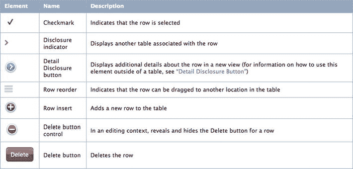

图 2-11。此图表来自 HIG，展示了表格视图中常用的元素

**注意** 我想制作一张图表来展示这些元素的变化。左侧是旧样式，右侧是新样式。这个图表源自 Apple 的 HIG 文档，希望图形团队能重新制作一张。

#### 预装应用

在尝试为 iOS 进行设计之前，建议先研究一下 iOS 应用生态中的预装应用。在大多数情况下，这些是你首先接触的应用，并且存在于每一台运行 iOS 的设备上。它们是：`Mail`、`Messages`、`Calendar`、`Photos`、`Camera`、`Weather`、`Clock`、`Maps`、`Videos`、`Notes`、`Reminders`、`Stocks`、`Game Center`、`Newsstand`、`iTunes`、`App Store`、`Passbook`、`Compass`和`Settings`。这些应用（也如图 2-12 所示）将帮助你了解为 iOS 设计应用时的基本设计和 UI 原则。通过研究这些应用，你将找到在 iOS 中针对常见操作使用 UI 元素的最佳实践，这些实践同样可以应用到你自己的应用中。

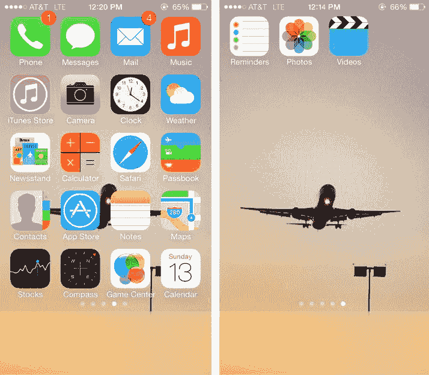

图 2-12。iOS 7 中的预装应用

我们来具体看几个应用，并指出你需要熟悉的特定 UI 元素，以便设计你的第一个 iOS 应用。iOS 预装应用的伟大之处在于，这些应用中所使用的 UI 元素代表了公认的最佳实践，其他所有平台的用户也都能识别。

##### 邮件

`Mail`是 iPhone 和 iPad 的电子邮件应用程序。它允许你在移动设备上发送和接收电子邮件。`Mail`应用采用了 iOS 的一些标准 UI 元素，这些元素也可以用于你自己的应用。如果你的应用允许用户发送电子邮件，你可以通过`Mail`从应用内发送邮件。`Mail`的应用图标在主屏幕上表现为一个带有白色信封的蓝色方框。

###### 标准邮件图标

撰写工具用于在`Mail`应用中撰写电子邮件。该应用的图标是一个带有白色信封的蓝色方框。你会看到其他第三方电子邮件应用也在其图标上采用了这一主题的某种变体。如果你的应用是一个电子邮件应用，最好不要试图重新发明轮子。在你的应用设计中使用既定的设计范式和图标。

撰写图标是一个常用图标，表示能够创建新文档。一旦用户点击该图标，一个新窗口将出现，允许用户创建新文档或电子邮件，其中包含一个已清空的字段，供用户输入新内容。这是一个被广泛接受的 UI 范式。如果你的应用允许用户撰写新文档或电子邮件，请使用这个图标。

##### 计算器

图 2-13 中的`Calculator`应用也采用了新的扁平风格进行了重新设计。之前带有斜角的按钮已被扁平按钮取代，旧的光亮输入框也不复存在。现在，该应用使用不同的色调来区分键盘上不同按钮的功能。现在，你可以从控制中心以及闹钟处轻松访问新的计算器，这省去了之前需要进入设置菜单访问的步骤。

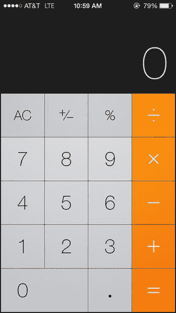

图 2-13。iOS 7 中重新设计的`Calculator`应用

##### 日历

在 iOS 7 中，日历应用在纯白色背景上呈现出更简洁、干净的外观。它让你能够完成许多在旧版 iOS 中可执行的任务。然而，iOS 7 现在引入了可以一览整年视图的功能，如图 2-14 所示。导航方式也略有不同。在 iOS 6 中，日历应用有列表、日和月的选择器；而在 iOS 7 中，从月视图中点击某个日期会进入日视图，若要查看所有过去和未来事件的列表视图，你需要点击 iPhone 屏幕右上角的搜索图标。这并非最直观的设计，需要一些时间来适应。

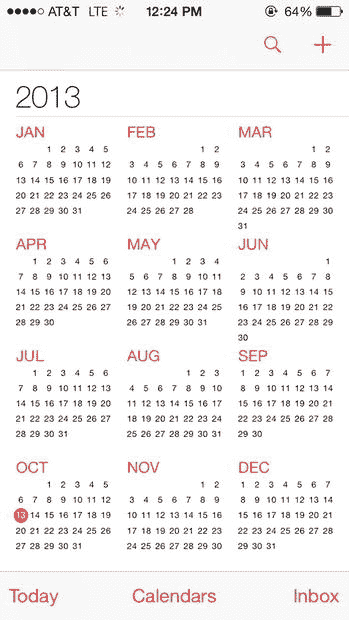

图 2-14。iOS 7 中日历应用的新外观

##### 天气

虽然所有 iOS 预装应用都经历了重大转变，但我最喜欢的当属`Weather`应用。这款应用不仅从头到尾进行了重新设计，还增加了精彩的新动画，极大地增强了应用的体验感。在这里，Apple 很好地展示了如何充分利用全屏进行设计，这也是他们如今鼓励设计师们去做的。动画不仅反映了当前天气，还反映了所选城市的当前时间。屏幕最显眼的位置是当前城市、天气状况和温度。下方则是在行和列中均匀分布的逐小时天气与温度详细信息，便于阅读和查看（参见图 2-15）。再往下是包含未来五天温度的每日天气预报。屏幕空间的运用非常均衡，微妙的背景动画更是画龙点睛之笔，尤其是它们仿佛在屏幕顶部和两侧自然飘散的效果。

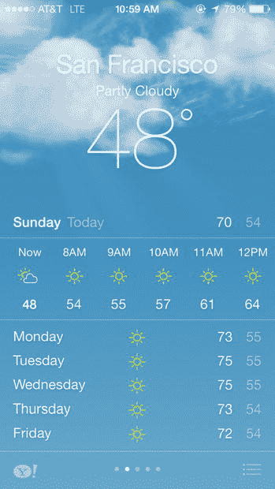

图 2-15。重新设计的`Weather`应用

需要注意的是，`Weather`应用主要功能是展示信息，功能本身非常简洁。它有两种视图：多城市列表视图和单城市视图。用户可以通过左右滑动来浏览列表中的城市，也可以添加或删除城市。天气应用的界面在内容和功能上都很简单，但效果却非常好。

关于`Weather`应用与雅虎自家天气应用的相似性也存在不少讨论。的确，`Weather`应用中的数据来源于雅虎和天气频道。两者的图标和链接都出现在该应用中。对这两款应用进行比较是合情合理的，绝对值得一看。

**提示** 天气应用已成为苹果应用商店中最受欢迎的应用之一。如果你的应用将向用户提供查看天气信息的功能，研究这些应用的设计将有助于你形成自己的设计方案。

### 色彩、透明度与图层

#### iOS 7 设计原则

近来，一些较新且更流行的应用已摒弃了深色、厚重的色彩，转而采用更浅、更柔和的配色方案。苹果也顺应了这一趋势，这种方式为 iOS 7 带来了更轻盈、更简洁的感觉。明亮的白色背景取代了此前在`设置`等原生应用中的灰色和细条纹背景。如今，在`设置`中，图标在干净的背景上显得格外突出。设计师应特别关注苹果如何使用色彩、对比度和透明度来增强层次感，并引导用户不仅关注内容，也关注其语境。你可以参考图 2-9 和图 2-10 来了解相关示例。

### 运用色彩

在设计应用时，请思考色彩将如何在用户界面中发挥作用，并帮助你讲述应用的故事。每个应用都必须有一个故事，而你的用户界面将助你讲述这个故事。色彩之间应相互补充。在 iOS 7 中，苹果坚持使用一套非常清晰且特定的调色板。你会反复在所有原生应用中看到相同的颜色。请特别留意它们的使用方式和位置。例如，`信息`应用中那种近乎荧光的绿色，被用于状态栏的电池电量指示器和电话应用图标中。同样的绿色也作为强调色出现在`钱包`和`通讯录`的图标中。要思考在特定区域使用色彩，以及将色彩与特定任务关联起来。

随着 iOS 7 的到来，用户将比以往任何时候都更理解色彩的重要性。例如，用户的背景图像或壁纸将影响整个用户界面的渲染效果。如果你的壁纸或背景以黄色为主色调，那么这种颜色会出现在锁屏键盘上，而主屏幕文件夹的透明度会让主色调渗透出来，从而赋予设备该颜色的特性，并使其笼罩在这种色调中。这是一种巧妙而精致的处理方式，增加了额外的个性化定制层级，使得两台设备在运行 iOS 7 时，外观也不会完全相同。

### 运用透明度

透明度和半透明效果是 iOS 7 中大量使用却又十分巧妙的另一工具。除了前面提到的主屏幕文件夹外，从任何页面向下滑动即可打开新的控制中心。这是一种访问一些最常用应用的便捷方式，并为控制选项提供了快捷途径，无需再导航到`设置`应用——这是有些人（包括我自己）倾向于隐藏或收进文件夹的应用。首先，控制中心面板是半透明的，真正展现了操作系统的三维质感，这是以往版本所欠缺的。它不仅揭示了下面还有一层应用和其他功能，还让这些元素的颜色透射出来。该面板就像一块覆盖在主屏幕上的薄玻璃。请参见图 2-16，查看控制中心面板在主屏幕上的示例。其次，控制中心面板并未延伸到屏幕顶部。在 iPhone 上，它会露出主屏幕上一行半的应用和文件夹。这为用户提供了他们在操作系统中所处位置的上下文。他们可以通过两种方式自由操作：在面板上向下滑动，或者只需点击另一个图标，面板便会自行收起。这种方法简单，但却非常高效。

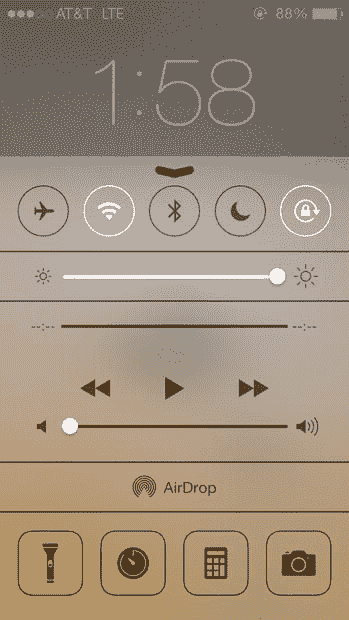

图 2-16. 控制中心的半透明条。控制中心会显示下方页面的颜色：在此示例中，即壁纸的颜色。

设计师在设计应用以及决定用户应如何与应用内容交互时，应参考这些微妙的线索。这个版本的操作系统推动设计师去除那些非绝对必要的元素，聚焦于那些用户与应用交互时真正需要的元素。

### 运用图层

图层是 iOS 7 的关键组成部分。之前的版本侧重于添加如斜面与阴影等效果来暗示和体现深度，而 iOS 7 则将所有内容组织成图层，并使用运动传感器为用户在使用设备时提供三维感受。因此，当用户移动时，图层也随之移动，并补充用户的视角。这样，当前正在使用的元素总是位于最前方的图层。这意味着其后的内容会相应地移动和后退，以营造出你面前所有元素之间存在深度和空间的错觉。甚至仅仅是打开应用这一操作也体现了深度。旧版操作系统在打开应用时只是一个快速缩放；而在 iOS 7 中，应用的打开画面虽然仍然向内缩放，但背景似乎也在向后移动，从而在新应用中创造出一种完全沉浸的感觉。

#### 按钮

旧版 iOS 中常见的边框大多已被移除。这可能会带来一个问题，因为用户现在需要重新从空间上感知一个词周围可点击的区域所在。用户已经习惯了“返回”和“取消”这类按钮的边框。由于对 iOS 的熟悉，用户会本能地知道这些按钮的功能（其名称也暗示了用途）。iOS 7 的不同版本在曾经是按钮的位置，只有扁平的彩色条。电话应用中的`结束通话`和`通话`按钮在 iOS 7 近期的测试版中，已从无边框的彩色条演变成了带轮廓的正式按钮。

### 总结

随着 iOS 发生翻天覆地的变化，在新设备上推行彻底的革新，iOS 应用设计的未来一片光明。作为设计领域的领导者，苹果既建立了一些长期的设计标准，也借鉴了其他设计理念。如今，他们已准备好再次改变格局。通过设立新标准，设计师们将被迫寻求更新颖、更激动人心的方式，通过他们的应用与用户进行视觉沟通。

有趣之处在于 iOS 7 将推动设计走向何方。诚然，苹果对 iOS 所做的这些改变可以追溯到其他平台（仅举两例，如 Android 和 Windows Phone）。但设计爱好者一直将苹果视为该领域的领导者。在设计你的应用时，不仅要考虑这个新版本，还要思考它的由来和演进过程。问问自己下一个重大突破是什么，然后去实现它。

