# iOS 7 与扁平化设计

在你准备设计应用，并开始熟悉人机界面指南和 iOS 7 的所有原则时，你无疑已经听说了“扁平化设计”这个被大肆讨论的术语。这个词正被用来定义苹果对操作系统用户界面的新方向。因此，有必要定义一下扁平化设计，并解释它是什么、从何而来，以及你如何用它来创建自己的应用。在你着手创建应用时，请思考内容，并将其置于核心位置。需要记住的一点是，用户与多点触控以及苹果移动设备套件交互已经有一段时间了。

我们已审阅了专门为 iOS 7 更新提供指导的《人机界面指南》相关章节。现在你应该已经熟悉这些内容了。该指南对 UI 中特定元素的放置位置提出了非常明确的要求。幸运的是，iOS 7 并未改变这些元素的位置，但其外观和视觉风格发生了显著变化。一旦 iOS 7 广泛发布（本书出版时它应该已经发布了），用户将重新适应这些元素的呈现方式。

在本章中，我们将深入探讨扁平化设计，了解它的起源以及在设计 iOS 应用时需要掌握的关键要点。

### 扁平化设计的原则

扁平化设计代表了一种从拟物化写实主义转向极简主义的风格。虽然视觉效果更简洁，但它被认为比其写实风格的“近亲”拟物化更具精致感和多功能性。扁平化设计还提供了更清晰的线条，以及更轻盈、更醒目、更丰富的配色方案，以吸引观众并激发情感。

一些设计纯粹主义者认为，运用扁平化设计原则是一种提升内容优先级、让功能占据中心地位的方式。这对我来说意味着，设计师要么需要与 UI 和 UX 设计师更紧密地合作，要么需要更深入地理解这些原则，这一点变得更为关键。过去，设计师是那些让线框图变得美观的人。现在，随着扁平化设计的普及，设计师和用户体验设计师很可能由同一个人担任。由于缺乏过去那些引导用户的视觉线索，按钮和其他 UI 元素需要更加直观。除了视觉反馈之外，唯一能引导用户的就是他们自己的知识和理解力，即判断什么感觉自然、合理。这种新的设计方式将整体用户体验推到了整个设计过程的最前沿。事实上，随着许多多余的元素和效果（如斜角和阴影）被剥离，用户得以直面体验和内容本身。作为设计师，你的工作就是确保这些体验和内容经得起考验。

### 扁平化设计的起源及其他应用

除了 iOS 7，你还会发现许多扁平化设计的其他例子。苹果并未发明扁平化设计，即使我们以 iOS 为背景来讨论它，它也并非移动端专属的范式。你会在 Web 上、其他移动操作系统（如 Windows Phone 和 Android）中，以及无数早在苹果注意到之前就已采用扁平化设计原则的应用中找到大量案例。

将扁平化设计推向台前的幕后英雄非微软莫属。而它的载体是一款如今已消失、鲜为人知的音乐播放器——Zune。虽然 Zune 从未真正撼动 iTunes 在音乐软件行业的虚拟垄断地位，但它确实为微软及其他软件公司未来采用的新设计理念奠定了基础。很快，其他公司纷纷效仿扁平化设计潮流。

软件巨头谷歌也在苹果之前加入了扁平化设计潮流，用以呈现其所有的产品、标识和图标。官方的《谷歌视觉资产指南》在整本指南中都大量运用了扁平化设计原则。

甚至一些大众消费品牌也接受了扁平化设计潮流。例如 eBay、前面提到的微软，以及 Twitter，这些知名品牌近期都在重新构想其标识和品牌形象时采用了扁平化设计原则。

eBay 在 2012 年对其标识进行了 17 年历史上的首次重大更改，推出了一款更新、而且更扁平的设计。尽管该公司在宣布这一变更的声明中并未正式提及扁平化设计，但对于任何敢于比较新旧两个标识的人来说，其原则显而易见。品牌色调和颜色得以保留；然而，最不容忽视的是使用了更纤细的字体，并去除了公司名称中字母的重叠部分。有人可能会认为，这些颜色本身就对扁平化设计很友好，而纤细的字体则进一步强化了扁平效果。

同样追随扁平化设计潮流的还有 Twitter。这家微博客公司在其六年的历史中首次重新设计了广受欢迎的“Twitter 小鸟”标识。在该网站的官方博客文章中，创意总监道格·鲍曼谈到这种新的设计方向源于对“在创造性约束和简单几何图形中进行设计”的热爱。他接着指出，这只小鸟“完全由三组重叠的圆形构成”。那些熟悉用于设计苹果新图标的魔法网格系统的人，会发现两者之间有许多相似之处。

**提示** 研究并回顾大品牌是如何适应扁平化设计潮流的。在设计你的应用时，将它们作为参考范例。

### 扁平化设计的未来

设计界关于扁平化设计潮流的讨论已经持续了一段时间。有些人认为它只是一种潮流，而另一些人则认为它会持续下去。然而，网站可用性工具公司 Usabilla 于 2013 年 6 月对众多不同领域的设计专业人士进行的一项调查，得出了以下结论。

人们将扁平化设计与以下描述关联起来：

- 简洁
- 干净
- 多彩
- 现代
- 乏味

扁平化设计的五大优势如下：

- 清晰性
- 易用性
- 现代外观
- 高效的响应式设计
- 快速加载时间

扁平化设计的五大缺点列举如下：

- 与人们习惯的方式不同
- 难以执行到位
- 不清楚哪些是可点击的
- 设计乏味
- 缺乏个性

基于这些列表，扁平化设计并非昙花一现。它有持续存在的生命力。68%的受访者认为扁平化设计不只是一时狂热，它将在未来数年真正影响我们为 Web 和移动设备设计的方式。

### 将扁平化设计融入你的应用

那么，这些调查结果对你和你的应用设计意味着什么呢？由于扁平化设计原则将持续存在，你需要将它们融入你的应用设计中。我们来深入探讨以下每一条原则。

- 选择配色方案
- 设计图标
- 利用空间和模板
- 定义按钮
- 简化表单
- 确定字体排印
- 评估可用性

#### 选择配色方案

要理解明亮、醒目的颜色是扁平化设计的标志，但这并不意味着在颜色方面你可以完全不顾逻辑。你必须明智地选择颜色。

颜色对你的应用至关重要，因此定义配色方案是设计应用时最重要的任务之一。你首先需要了解的是，对于你或你的客户来说，是否存在必须遵循的重要品牌指南。无论你是为自己还是为客户设计应用，你都必须了解某些颜色会引发用户怎样的情绪。有许多在线资源可以帮助设计师理解使用特定颜色背后的心理学原理；因此在为你的应用选择配色方案之前，先做一些研究。请注意，扁平化设计倾向于使用明亮、醒目、鲜艳的颜色来向用户传达特定信息。请回顾你的应用文档以及用户在应用中将执行的主要任务，从而找到适合你的正确颜色组合。同时也要确保进行实验，因为可能性是无穷无尽的。

以下是选择配色方案时需要考虑的一些问题：

- 哪些颜色最能突出应用程序中的主要任务？
- 你是否在使用特定颜色的不同深浅？例如，你的主配色方案是否包括某种特定的红色以及多种其他偏红的色调？
- 中性色（如灰色、黑色和白色）在你的设计中扮演什么角色？
- 你选择的颜色是否互补？它们在页面上相邻放置时是否协调？

无论你怎么做，你的应用都必须保持一致。如果应用以明亮、大胆的色彩开场，那么你就应该在整个应用中都坚持这种风格。不要后来突然转变为柔和、低调的调色板。

对于设计师来说，在选择扁平化设计的调色板时，有许多很棒的在线资源。我最喜欢的一个是 [Flatuicolors.com](http://Flatuicolors.com) ([`www.flatuicolors.com`](http://www.flatuicolors.com))。它是一个简单的网页应用，列出了一些流行的扁平化 UI 颜色，并允许你以多种不同格式（`hex`、`rgb` 等）复制颜色。你可以用它来尝试应用中的不同颜色组合。

另一个有用的工具是 Color Scheme Designer ([`www.colorschemedesigner.com`](http://www.colorschemedesigner.com))。这是设计师的天堂，允许你查看和测试各种颜色的调色板。它会并排显示这些颜色，帮助设计师理解颜色如何并排呈现，以及它们如何相互作用和互补。你还可以通过三色、四色甚至单色方案自定义视图——组合方式似乎无穷无尽。

如果你不喜欢鲜艳、大胆的颜色，那么柔和、单调的颜色也同样可行。许多流行的应用程序都在尝试使用更柔和的原色和二次色色调。无论如何，尝试通过你的配色方案来突破传统的颜色界限。

**提示** 尽量避免使用颜色概括，例如用粉色代表女性，用蓝色代表男性。

### 设计图标

由于扁平化设计缺乏真实感且强调内容本身，图标和插图变得越来越重要。图标在设计中用于向用户传达特定的信息。它们是你在应用程序中使用的视觉捷径，帮助用户导航。

虽然网上有大量的设计资源可以协助设计师处理图标，但有些设计师选择自己创作。图标可以为你的应用带来个性，并有助于用户理解应用中的 UI 元素。想一想苹果公司的图标，以及它们如何随着扁平化设计而演变。如果你自己设计图标，请记住用户已经将某些操作与操作系统中的特定图标关联起来，所以不必重新发明轮子。

当你决定创建自己的图标时，请记住以下一些指导原则：

- 图标应该简洁明了。
- 去掉那些会混淆用户的无关元素，只保留绝对必要的元素。
- 图标应该直观：也就是说，用户只需看一眼就能理解图标背后的含义。如果用户必须与图标互动才能理解其意图，那么你的设计就未能完成其最重要的任务。
- 考虑应用的整体用途和目的。你的图标是否适合其主题？确保你的图标既适合它们想要传达的任务，也符合应用的整体目的。
- 图标应始终绘制得尽可能清晰和简洁。人机界面指南 (HIG) 提供了关于图标如何缩放，以便在 Retina 屏幕上显示时不显得模糊的指导。
- 图标应在具有不同屏幕分辨率的多种设备上保持一致。
- 扁平化设计通常为图标使用简单的形状。它们要么是圆形、正方形或矩形；因此，如果你选择为图标采用一种形状，就应该坚持使用那种形状以保持一致。混合搭配图标形状肯定会让用户感到困惑和迷茫。参考 iOS 图标作为创建自己图标的一般指南总是一个好主意。

**提示** 互联网上也有许多扁平化设计图标的资源。有可下载的图标包，其中一些是免费的，一些则需要支付少量费用。

### 利用空间和模板

在设计 iOS 7 并考虑扁平化设计元素时，空间的使用是一个重要因素。在网页上，扁平化设计原则通常会留出大量空白空间，以遵循指导扁平化设计的“少即是多”原则。同样，在 iOS 7 中，空间的使用也很重要。尽管移动设备上的空间比桌面设备少，但你应该考虑空间的使用将如何在你应用运行的不同设备之间进行转换。

为了开始设计扁平化风格的 iOS 7 应用，网上有许多免费下载的扁平化设计模板。搜索“iOS 7 GUI PSD 模板”以找到适合你需求的模板。iPhone 和 iPad 的模板都可用。这些模板包含了你入门所需的一切，至少可以用来尝试 UI 元素以及它们如何在你的应用中使用和定位。你也可以使用这些模板来创建线框图。

你还可以在 Pinterest 等视觉网站找到设计灵感，看看其他设计师在做什么，或者你可以亲自投身于扁平化设计的世界。为了完全实现扁平化设计，每个应用程序中都需要改变一些基本元素。我们已经谈到了颜色空间和图标，现在让我们具体了解一下。

### 定义按钮

按钮是每个应用界面中重要的组成部分。用户习惯于通过点击按钮来执行特定功能——通常就是按钮标签上写的功能。例如，图 3-1 中的按钮展示了左侧的传统设计按钮和右侧的扁平化设计按钮的示例。请注意左侧按钮去掉了投影和斜面效果，而右侧按钮强调了简洁性。

图 3-1。带投影的旧式按钮与新的扁平风格按钮对比

旧式按钮明显呈现出拟物化设计中常见的三维质感。新式按钮则去掉了这种效果，用明显的二维效果取而代之。这是按钮在扁平化设计面前如何演变的典型例子。同时请注意，传统设计的按钮颜色和阴影通常更深，给人一种更厚重的外观和感觉。

### 在 iOS 7 中，按钮与表单设计的演变

在 iOS 7 中，虽然按钮保持了扁平外观，但其视觉效果已做了微妙的改进以提升可用性。请注意 图 3-2 和 图 3-3 中两个不同版本 iOS 7 的“电话”应用界面的变化：

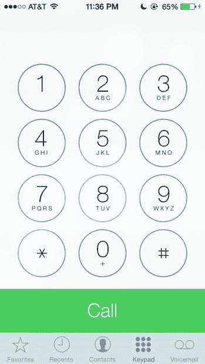

图 3-2. iOS 7 测试版 4。该版本的呼叫按钮延伸至屏幕边缘

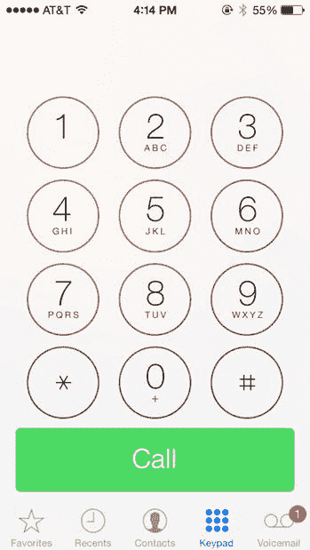

图 3-3. iOS 7 测试版 7。该版本的呼叫按钮采用了圆角设计

尽管两种按钮处理方式都遵循了扁平设计原则，但测试版 4 的老版本并未提供任何轮廓或分界线来标示按钮的边界。而新方法则绘制了实际的按钮轮廓并添加了圆角。我见过使用这两种方法且效果出色的应用。但请记住，诸如此类的细微变化，可以为用户带来天壤之别的体验。

#### 简化表单

另一个常被遗忘、且随扁平设计一同演进的 UI 元素是表单。移动应用中的表单常用于注册和登录。虽然用户通常只需登录一次，但过去的表单往往使用内阴影来表现深度和空间感。然而，现今的搜索字段已不再采用这类增强效果。在设计登录和注册字段的表单时，请保持窗口简洁，避免使用任何特效。通常，一条细边框线就能解决问题，但也可以尝试使用不同深浅的灰色或纯白色作为表单背景。图 3-4 展示了 iTunes Store 的输入表单。请注意用户密码输入框的简洁设计。

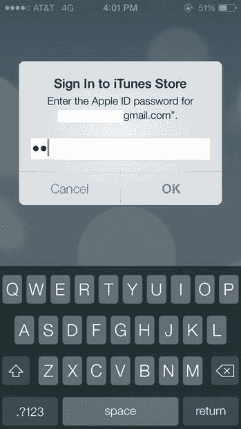

图 3-4. iOS 7 中的弹窗、通知和表单焕然一新

#### 确定字体排印

扁平设计中最重要的元素之一莫过于将在应用中使用的字体排印。由于扁平设计聚焦于字体排印，你需要找到一种能唤起你想要应用传达的整体感受和信息的字体。因为扁平设计简约而极简，你的字体也应如此，因此为你的应用最多选择两种字体系列。确保这些字体能互相补充。如果存在冲突，在整个应用中使用一种字体，并通过不同字重来传达不同含义也是可以的。线条和笔画清晰的字体在扁平设计风格中通常效果更好。为此，在移动应用和 Web 应用中使用扁平设计技术的设计师们，对无衬线字体情有独钟。我在图 3-5 中列出了一些流行的无衬线字体。

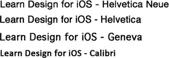

图 3-5. 无衬线字体在扁平设计中很常见

字体的颜色和字重也很重要，因此请考虑选择一种拥有多种字重的字体，以便能在整个应用中使用。你可能想为按钮和图标选择一种特定的字重，为行为召唤元素使用另一种，而正文文本则可能使用更轻的字重。

#### 评估可用性

界面中的某些元素经历了细微的变化。虽然用户界面元素仍保持扁平外观，但这些元素已为可用性进行了精细调整。毫无疑问：可用性是从扁平设计转型的重要原因。设计界对于扁平设计究竟有多用户友好一直存在争议。一些批评者认为，尽管扁平设计美观且性能优越，但它有时会让用户感到困惑。诚然，剥离那些让按钮看起来像真正按钮的元素和效果，*确实可能*使用户感到些许迷茫。iOS 7 在移除这些元素方面做得相当彻底。以标签栏中细微分隔线的移除为例。现在，屏幕底部的这些元素，过去是清晰分隔的，如今却仿佛悬浮在空中。（请参见上文中的图 4-6 和图 4-7。）这正是设计师需要运用自身判断力，从可用性角度理解何谓合理之处。这些元素如何被解读，取决于你和你的用户。因此，如果你真心认为一个小小的阴影能帮助用户更好地与应用中的某个元素互动，那么请一定在扁平设计与拟物主义之间找到平衡，并添加那个阴影。没有必要过度使用。扁平设计讲究“少即是多”，你会发现，在一个原本可能因扁平设计而显得过度的应用中，添加微妙的拟物化暗示，反而能为用户找到完美的平衡点。

扁平设计之所以具有挑战性，是因为它本质上移除了所有帮助用户将屏幕上的内容与真实世界中的事物联系起来的元素。那些我们用来将虚拟世界翻译成物理世界的隐喻，正随着扁平设计而被移除。因此，原本是按钮的东西，现在只是背景上的一个扁平方块。我们作为设计师为影射光线和阴影等现实世界属性而创建的视觉线索已经被去除了。那么，还剩下什么？你的内容和用户。问题随之而来：我们如何还能向那些生活在三维世界却在一个二维结构内交互的用户提供这些线索？如果你选择全心拥抱完全的扁平设计方法来开发应用，那么当你思考用户将如何在你的应用内操作时，就必须考虑到这些现实情况。

Apple 允许通过其他方式融合这个新的二维世界，例如添加视差效果和使用透明度等三维效果。这些功能，作为操作系统的核心原则之一，是设计师可用的工具库的一部分，用以增强其应用的整体体验和可用性。这些效果有助于为用户提供视觉线索。

### 总结

在考虑应用的整体用户体验时，你必须进行战略性思考。因此，你关于设计方法以及需要深入探讨多远的每一个决策，都变成了战略性的决策。作为设计师，你的任务是在用户所见与其所感之间找到微妙的平衡。所有这一切都包含在你通过设计在应用中创造的世界里。扁平设计能帮助你实现这一目标吗？到了这一步，你应用的目的和你试图触及的受众应该已经非常清晰。毫无疑问，你将不得不在应用中使用扁平设计技术；问题只在于使用多少。

## 第 4 章：了解 iPhone 和 iPad 用户界面设计考量

### 为 iPhone 和 iPad 进行设计

为 iPhone 和 iPad 进行设计需要清晰了解这两款设备的用户界面。两者之间存在相似之处，并且有明确的指南和文档遵循这些准则，以确保你的应用符合 Apple 制定的标准。然而，即便如此，你的设计中仍有足够的空间来发挥创意和独特性。虽然 Apple 在执行其设计指南和规则时可能显得严格，但总有实验的余地，并且他们鼓励在设计中（尤其是那些清晰体现出对 iOS 底层构建原则深刻理解的设计）进行尝试。

我们在上一章中介绍了标准 UI 元素，因此现在我们将进入如何熟悉设备用户界面的部分。开始熟悉 UI 的一个好方法是下载一个免费提供的 iOS GUI 工具包。GUI 工具包适用于 iPhone 和 iPad，而且大部分都是免费的。Teehan & Lax 和 Applidium 都制作了适用于 iOS 6 和 7 的 PSD 格式 GUI 工具包。

一旦你下载了所选格式的 GUI，你将能够更详细地探索各种元素。将文件导入你选择的图形软件中；这样你就可以开始与它们交互。其中大部分工具包由设计师和设计工作室创建，旨在帮助设计社区，这样你在开始设计应用程序时就不必重复造轮子。

打开 GUI 后，仔细观察它们与实际设备上的显示效果相比如何。大多数元素都会包含一系列栏（如状态栏、标题栏、标签栏等），以及按钮、操作列表（图 4-1）、键盘和图标。你应该能够查看它们，甚至如果需要更仔细地检查，可以将其从 GUI 中移除。

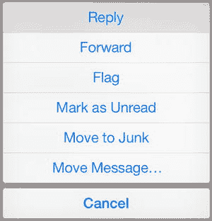

图 4-1. iOS 7 自带邮件应用中的操作列表

**注意：** 操作列表是 iOS 中的一个菜单，为用户显示一组选项。这些选项通常与用户发起的某个任务相关。邮件应用中的操作列表如 图 4-1 所示。

熟悉每个用户界面元素，并开始思考每个元素将如何在你的应用中使用。

-   你会使用哪些栏？
-   你是否需要为菜单中的状态栏创建自定义图标？
-   你的应用会有独特的配色方案吗？
-   你将如何向用户呈现关键信息？
-   每个元素如何帮助用户在应用中的使用历程？

花必要的时间熟悉 UI；之后，你就可以开始思考如何为用户定制体验。你不必按原样使用所有元素。对于应用的 UI，你有相当大的灵活性和创造力。但在迈出这一步之前，首先理解基础非常重要。这正是本章的目的。

#### UI 中手势的使用

iOS 界面针对独特的多点触控体验进行了优化。因此，屏幕上的元素响应触摸或手势，而不是点击。因此，务必始终牢记，用户必须感觉仿佛在与内容直接互动。你的设计必须让用户体验沉浸式的应用互动。哪些元素能让他们做到这一点？用户通过使用特定的手势与 iOS 进行交互。这些手势不仅已成为 iOS 中的常见操作，也在其他多点触控平台和操作系统中普及；然而，其中一些手势是由 Apple 首创的。

在讨论 iOS 的手势时，有两个重要概念需要考虑：前面提到的一致性和直接操纵。

##### 手势的一致性

在为应用考虑用户界面元素和适当的手势时，一致性是关键。请使用那些与既定最佳实践和用户期望一致的操作手势。如果用户向左滑动，期望面板或内容随之向左移动，但它却向右移动，那么你就在用户和界面之间造成了严重的脱节。用户将不得不花时间去理解你的应用中每个手势的含义，这会带来令人困惑的体验，尤其是在他们离开你的应用，与原生 iOS 应用或其他遵循既定规则的交互时。

如果你的应用界面元素与 iOS 标准不一致，或者错误或不同地使用了系统级的控件、视图和图标，你应该考虑更改它们。否则，你的应用可能会被应用商店拒绝。

##### 手势的直接操纵

直接操纵是手势控制的一个概念，指的是像对待真实物体一样与屏幕上的对象进行交互。因此，点击按钮就像在现实生活中按下按钮。拉动控制杆就像拉动真实的控制杆或滑块。iOS 正是基于这一手势控制原则。它让用户感觉仿佛真的在操纵控件。这些直接操纵控件遍布 iOS 系统，现在用户应该已经熟悉了。例如主屏幕上的“滑动解锁”和邮件应用中的“下拉刷新”等操作，现在在其他应用中也已流行。用户会凭直觉执行这些操作，无需指示，并且在许多情况下，他们期望你的应用也能支持这些操作。这类手势之所以受用户欢迎，是因为操作和结果之间存在直接而即时的关联。用户会感觉仿佛真的在生活中执行了该操作。设计师和开发者应在用户明显会期望这些手势的应用场景中使用它们。不使用它们可能会让用户群体感到沮丧。

##### 抽象手势与反馈

抽象命令和手势是指那些在操作与屏幕显示内容之间几乎没有或完全没有关联的手势。由于这些手势对用户来说并非立即可理解，因此它们需要用户进行一定程度的记忆。如果你必须使用抽象手势，请确保已在目标群体中进行过测试，以避免引入用户不熟悉的手势而疏远你的受众。用户需要记住你通过应用引入的新抽象手势，并学会将它们与特定操作关联起来，才能成功浏览和与你的应用互动。

iOS 总体上很好地避免了抽象手势，但有些应用虽然本身并非抽象，却要求用户为新的操作记住新的手势，即使这些手势与屏幕显示的内容有直接关联。流行的邮件应用 Mailbox 就是这样一个例子。使用过原生邮件应用的用户会发现，他们需要学习各种操作的新手势。例如，在 Mailbox 中，向右滑动可以归档一条消息，但向右长滑则会将消息放入废纸篓。向左滑动可以让用户稍后提醒一条消息，而向左长滑则会将消息添加到多个列表中。该应用使用彩色指示器作为视觉反馈，让用户知道他们正在执行什么操作，但这些手势需要一些时间适应——尤其是如果用户一直在使用标准邮件应用的话。幸运的是，应用的制作者提供了一个有帮助的教程，可以从应用的“帮助”部分轻松访问。Mailbox 应用和 iOS 邮件应用的视图如 图 4-2 所示。

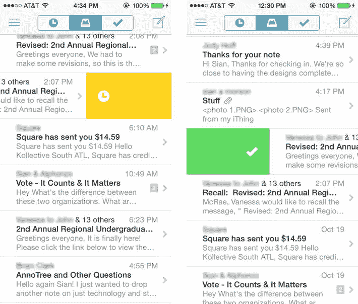

#### 图 4-2. Mailbox 应用针对旧手势的操作

反馈是另一个在 iOS 用户界面设计中非常重要的交互原则。反馈是一种机制，通过它用户的操作得到确认，并且用户能感知到该操作所对应的流程或结果正在实际发生（图 4-3）。iOS 原生应用都包含一定的反馈元素。例如，在 Mail 应用中下拉刷新列表中的消息时，当应用连接服务器下载新消息时，会显示一个旋转的加载指示器。同样，启动应用更新过程时，会显示一个进度条，以便用户了解下载进度。如果操作不成功，应用通常会通过显示某种类型的消息来告知用户。对于任何给定的已启动操作，声音也可以作为强大的反馈指示器。再以 Mail 应用为例，“叮”的一声是服务器下载新邮件时的默认声音。虽然这些声音可以在设置中更改，但其中一些已成为 iOS 用户公认的标准。

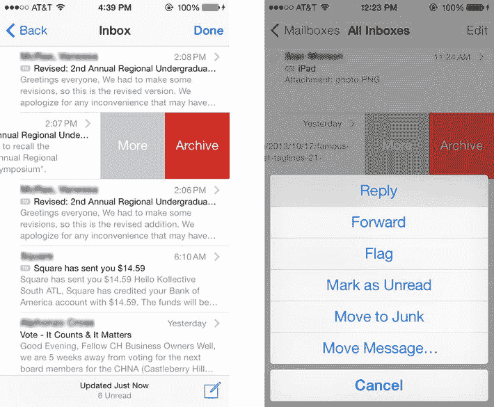

图 4-3. iOS7 中的 Mail 应用使用颜色作为特定任务的提示器

#### iOS 中的手势

所有 iOS 设备用户都会发现自己在不同时候会用到几种不同类型的手势。它们在所有 iOS 应用中都很常见，并且已成为多点触控术语中熟悉的一部分。这些手势对用户来说感觉“自然”，易于发现，并给人一种他们正在直接与屏幕上看到的内容进行交互的印象。它们包括：轻点、双击、轻扫和捏合等。此处列出的手势在 iOS 中很常见，代表了跨平台的多点触控设备和应用中公认的交互范式。

##### 轻点

轻点是等同于用户使用键盘或鼠标进行点击的多点触控操作。它允许用户选择屏幕上看到的控件或项目。

##### 双击

双击允许用户放大并居中显示图像或内容。如果用户已经放大，则执行相反操作，结果将是缩小。

##### 拖移或平移

拖移是指使用一根或多根手指从一侧移动到另一侧。产生的效果是水平平移。

##### 轻拂

轻拂是拖移的更快版本。当用户的手指在屏幕上快速向上或向下移动时，就会发生轻拂操作。

##### 轻扫

轻扫通常是在表格视图中显示删除按钮的操作。根据应用不同，它也用于将面板向左或向右移动。

#### 捏合

捏合使用两根手指来创建缩放视图，用于使屏幕视图内的图像或内容变小或变大。用户可以捏合以放大，或反向操作以缩小。

##### 触摸并按住

在可编辑的文本（例如消息或浏览器窗口的内容）中，触摸并按住会显示一个放大视图，并允许用户在文本中的任何位置定位光标以便于编辑。

##### 摇晃

虽然这不是标准的手势或操作，但摇晃可以撤销或重做之前的某个操作。然而，创新的应用开发者最近以多种方式使用了摇晃手势，这些方式与重做或撤销操作关系不大。

#### 新的 iOS 手势

新版本的 iOS 有时会引入新的手势，并且有传言称 iOS7 中也引入了新手势。如果你决定在应用中尝试使用更新的手势，你需要对潜在用户进行彻底测试，以确保新手势直观，并且用户通过使用它们能看到期望和预期的结果。苹果在引入新手势方面做得非常出色。在关于 iOS7 新手势的传闻中，我已确认了以下内容：

##### 向上轻扫

在任何屏幕上执行此操作都会显示控制中心。在与控制中心屏幕上的控件交互后，用户可以向下轻扫以显示其下方的页面。向上轻扫也用于从多任务切换器视图中退出或关闭一个活动的或打开的应用。在旧版本的 iOS 中，此操作以前并未与这种结果相关联。

##### 向下轻扫

在任何屏幕的顶部边缘执行此操作会显示通知中心，其中显示当天所有未清除的通知以及你可能错过的通知。向上轻扫会关闭通知面板。在主屏幕内从顶部向下轻扫会显示“聚焦搜索”。此前，“聚焦搜索”是通过在主屏幕的第一页向右轻扫来找到的。图 4-4 展示了这一示例。

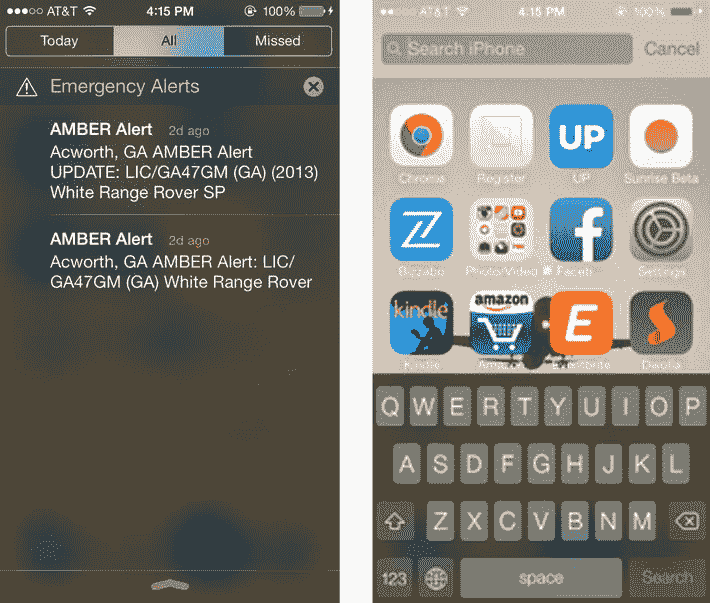

图 4-4. 通过向下轻扫操作可访问通知栏和“聚焦搜索”

##### 向右轻扫（在 Mail 应用中）

在 Mail 应用中，当以完整视图（而非预览）查看消息时，向右轻扫会将用户带回到可滚动的表格视图，其中显示所有消息的列表视图和预览。

### iPad；有何不同？

iPad 于 2010 年 4 月 3 日发布，因其名称而获得了褒贬不一的评价以及一些嘲笑和玩笑。它标志着苹果进入了当时还算新颖的平板电脑领域。如今，市场上有几种不同类型的 iPad。第一代 iPad 已不再受支持，也无法运行 iOS7。出于本书的目的，我们将只关注仍受苹果支持且可在苹果商店购买的当前 iPad 型号。

人们很容易认为 iPad 只是 iPhone 的放大版。这种假设是不正确的。iPad 更像是一台电脑而非手机，并且人们与 iPad 交互的方式与 iPhone 非常不同。设计师必须牢记这一点。然而，很容易理解为什么 iPad 被认为只是一个超大号的 iPhone；它的外观几乎与 iPhone 一模一样。但是，iPhone 是完全不同于 iPad 的设备。使用 iPad 的用户通常也有一部 iPhone，但他们对使用 iPad 的期望是不同的。作为有史以来最畅销的平板电脑，iPad 拥有广泛且多样化的用户群体。根据分析公司 Flurry 最近的一项研究，其用户群体涵盖了儿童、母亲、家居设计爱好者和小企业主等。因此，与其他任何应用一样，你的 iPad 应用必须针对特定的用户群体进行设计。

电子商务也是 iPad 市场的重要组成部分。在在线购物和流量产生方面，iPad 主导着平板电脑市场。考虑到这一点，不仅了解人们用 iPad 做什么很重要，了解他们*如何*做同样重要。

就其设备类别而言，iPad 介于手机和电脑之间；它也介于 iPhone 和 Mac 之间，旨在让用户能够做比仅使用 iPhone 更多的事情。人们对 iPad 能力的期望随着每次新版本的发布而增长。目前，市场上有三种不同的 iPad。它们分别是：

### iPad 系列概览

- **iPad Mini**：`iPad Mini` 是 iPad 家族的最新成员，于 2012 年 11 月发布。它是 iPad 的缩小版，旨在吸引更倾向于使用 Kindle 和 Nook 等阅读器的用户。
- **iPad 2**：`iPad 2` 于 2011 年 3 月发布。该版本比第一代原始 iPad 更轻、更薄。与 `iPad Mini` 和 Retina 版本不同，`iPad 2` 仍使用旧的 30 针连接器。它也是首款配备双面摄像头的 iPad。
- **iPad Retina**：该版本分别于 2012 年 3 月和 10 月发布；第三代和第四代 iPad 非常相似。`iPad 4 Retina` 使用了新的 Lightning 连接器。它还引入了更新、更快的处理器，用于从互联网下载内容和处理图形。`iPad 3` 已停产。

目前，当设计师提交 iPad 应用时，必须经过测试并在所有 iPad 上表现出最佳性能。配备 Retina 屏幕的 iPad 像素密度高，能使设计精良的应用看起来惊艳。不幸的是，它也会凸显低质量或低分辨率设计的瑕疵。据信，未来*所有* iOS 应用提交都必须包含针对 Retina 以及低分辨率支持设备的资源。

### iPad 与 iPhone 的设计差异

那么，iPad 到底有何不同？首先，它比 iPhone 更大，为多点触控交互提供了更多空间，也为额外的设计元素留出了余地。此外，用户与 iPad 的交互方式也与 iPhone 不同。iPhone 用户是移动的，他们需要借助设备来应对繁忙的生活方式。而 iPad 用户通常是在教室、沙发或“后仰式”场景中使用设备。在设计 iPad 应用时，请考虑以下几点：

- 用户与你的应用交互时，会如何持握设备？
- 你的应用在竖屏和横屏模式下都能正常工作吗？
- 哪种屏幕方向更适合与应用相关的任务？
- 用户在使用你的应用时，可能正在做什么？
- 他们处于怎样的环境中？这又如何影响他们对设备的使用？

这些因素在你开始设计 iPad 应用时都很重要。iPad 提供给设计师的额外空间应被明智地利用。不要用不必要的、无价值的元素填充它，这些元素不会给用户或应用的整体体验增加价值。应添加能够增强用户对你所创建空间和环境理解的 UI 元素。

Apple 为 iPad 设计制定的指南与 iPhone 类似；关于内容、可用性和上下文的相同原则仍然适用。确定哪些功能是绝对必要的，并为你用户提供这些功能。使用用户画像来思考你的用户是谁，以及每个画像将如何与应用交互。每个画像可能有不同的需求。确保用户所需的功能在任何时候都易于访问。如果用户必须费力寻找他们觉得应该显而易见的东西，就会导致糟糕的用户体验，甚至可能带来差评。

> **注意**：用户画像是一个虚构角色，代表着具有特定特征和行为子集的用户群体。用户画有助于验证设计和用户体验。

### iPad 特有的 UI 元素

尽管大多数导航项相同，但 iPad 确实拥有一些 iPhone 不可用的 UI 元素，例如弹出视图和分屏视图。

#### 弹出视图

弹出视图是一种呈现在现有屏幕内容之上的视图。它通常有一个指向或箭头来指示用户它从何处出现，并且应覆盖其背后的内容，使用户能够专注于其内部的内容。弹出视图中可以放置多种不同类型的信息和 UI 元素。它可以包含带有列表的表格视图、以操作列表形式显示给用户的额外选项，或者分屏视图中左侧面板的内容。Apple 对如何使用弹出视图有具体说明，因此请务必阅读《人机界面指南》以获取使用说明。

虽然允许在弹出视图中使用标准 UI 控件，但绝*不能*添加“关闭”或“退出”按钮。关闭弹出视图应遵循现有的 iOS 范式，即当用户点击其外部或屏幕上的任意其他地方时消失。关闭或退出按钮是常见的 Web 范式，在 iOS 中不存在。此外，虽然没有高度限制，但有 320–600 点的宽度限制。这取决于你在设计中显示的信息。图 4-5 显示了两种不同长度的弹出视图。

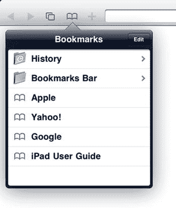 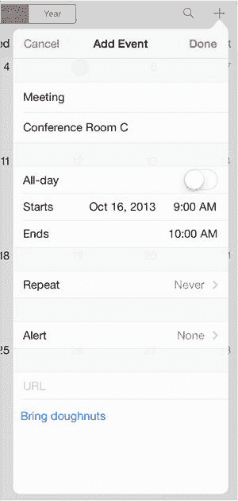

*图 4-5. 来自 iOS 6 和 iOS 7 的 iPad 弹出视图*

寻找巧妙新颖的方式来展示弹出视图是允许的。要跳出框框思考，但始终将用户体验放在首位。

#### 分屏视图

分屏视图是指屏幕被分成两个并排的独立面板。在空间上，左侧面板始终比右侧面板窄。Apple 将右侧面板的宽度留给设计师决定，但建议最小宽度为 320 点。从视觉上看，右侧面板较大而左侧面板较小更为平衡。思考两个面板之间的关系，以及你希望在每个面板中呈现什么信息。通常两者之间存在关联，需要仔细思考和规划，来决定你希望用户如何从上下文关联信息，以及你将如何呈现这些信息。

左侧面板通常被称为主面板，右侧面板被称为详细面板。这应为你如何呈现 UI 元素和信息提供一些思路。然而，这种关系并非严格强制，更多地是指向一种用户可能已习惯的惯例，而非 Apple 强制执行的规范。在 iOS 7 中，分屏视图屏幕可以在竖屏或横屏模式下访问。图 4-6 显示了竖屏模式下的分屏视图。

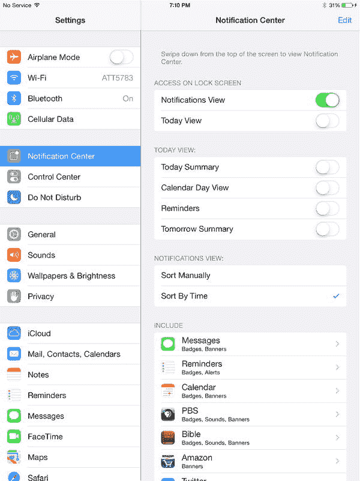

*图 4-6. iOS 7 中竖屏方向的分屏视图屏幕*

### 视觉上下文

由于 iPad 拥有额外的屏幕空间，人们可能会忍不住简单地拉伸和拉长 iPhone 设计来创建 iPad 应用。这样做将是一个错误。iPad 的增加的空间意味着设计师确实有更多空间来……设计。菜单应该是上下文相关的。也就是说，它们应靠近其所关联的内容。让用户到右侧去编辑左侧的内容会让人迷失方向。诸如弹出视图之类的工具应在需要时使用，并在它们帮助用户完成特定任务时使用。

尽量不要在屏幕底部或标签栏中堆叠过多项目。iPad 的尺寸使得屏幕底部根据用户持握设备的方式成为一个容易被忽视的区域。使用弹出视图和分屏视图等额外元素来为内容提供上下文。

### iPad 应用设计指南

`iPad` 的尺寸使其相比 `iPhone` 有一个显著优势：用户可以用双手与内容进行交互。其键盘几乎与普通电脑键盘大小相当，对于那些仍觉得它太小或不够舒适的用户，制造商们已迅速推出大量可轻松连接 `iPad` 的外设。这意味着用户与应用程序中的内容进行交互的方式和机会都增加了。请利用这一机会，将用户吸引到你的应用中，以获得更沉浸式的体验。

在设计应用时，请考虑屏幕方向以及用户将如何与你的应用和屏幕内容进行交互。例如，你的应用是否仅在横屏模式下能更好地呈现信息？或者用户能否在竖屏和横屏之间自由切换而不迷失方向？创建仅支持竖屏或仅支持横屏的应用是完全可行的。

#### 屏幕触控目标

由于使用 `iPad` 的用户年龄和体型各不相同，建议将触控目标设计得足够大，以适应甚至最大的手指和拇指。没有什么比在大屏幕上试图点击一个微小的目标更糟糕的了。同时，请确保触控目标清晰可见。得益于其尺寸，`iPad` 鼓励用户充分拥抱多点触控的各个方面，他们更倾向于探索界面。因此，让触控目标既明显又足够大，有助于用户在应用中导航。

#### 屏幕分辨率

由于第一代 `iPad` 已停产且不再受支持，在设计 `iPad` 应用时，需牢记一些重要的分辨率差异。目前消费者可用的 `iPad` 包括 `iPad 2` 和 `iPad Retina`。`iPad 2` 和 `iPad Retina` 拥有相同的屏幕尺寸（`9.5in. x 7.31in.`），但分辨率不同。`iPad 2` 的分辨率为 `1024 x 768`，每英寸像素（`ppi`）为 `132`；而 `iPad Retina` 的分辨率为 `2048 x 1536`，每英寸像素（`ppi`）为 `2048 x 1536`。这相当于 `iPad 2` 分辨率的两倍。

- `iPad Retina` 显示屏的分辨率为 `2048x1496px`（横屏方向）
- 非 `Retina` 显示屏的分辨率为 `1024x748px`（横屏方向）

如果你计划为 `iOS`（`iPad` 或 `iPhone`）进行设计，`72 DPI` 即可，因为 `DPI` 更多是一个印刷术语。请记住，最佳实践始终是为 `Retina` 设计，然后将其缩放至 `50%` 用于非 `Retina` 设备。

Figure 4-7 中的图表列出了所有设备的各种分辨率，并已针对 `iOS 7` 进行了优化。

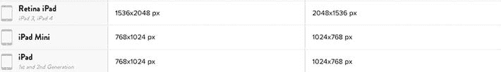

Figure 4-7. 图表显示了 `iPad` 设备的分辨率列表

`iPad mini` 的屏幕较小，尺寸为 `7.87in. x 5.3in.`，分辨率为 `1024x768 ppi`。然而，设计师不应认为为 `iPad mini` 设计与为常规尺寸 `iPad` 设计完全相同。`iPad mini` 不仅尺寸更小，重量也更轻。这意味着用户与设备的交互方式将与大型 `iPad` 有很大不同。由于其尺寸，用户可能会倾向于单手使用设备。请思考这对应用的用户界面意味着什么。以下是一些需要自我审视的问题：

- 设备的尺寸将如何影响应用的整体体验？
- 应用的用户界面是否需要针对不同设备而不同？还是单一布局就足够了？
- 与 `iPad mini` 同类的设备包括 `Nook` 和 `Kindle` 等，这些设备主要用作阅读设备，而非生产力工具。知道你的应用将面向 `iPad mini` 用户后，这将如何改变应用的行为？

#### 通用应用

通用应用是指同时针对 `iPad` 和 `iPod` 进行优化的应用。它就像一个应用包含了两个应用。两个平台的资源都包含在同一个应用包中。编程上，应用会检测当前激活的是哪个平台，并相应地提供合适的资源。苹果建议开发者创建通用应用，这样便于在 `App Store` 中进行管理。但从设计角度来看，仍然需要两套设计和资源，本质上这相当于创建两个独立的应用。

#### 图标

`iPad` 上所有元素都更大的原则同样适用于图标。`iOS` 有多种不同的图标，它们的使用方式各不相同，以便用户在 `App Store` 和不同设备上识别你的应用。`Retina` 显示屏的图标会显示更多细节，因此请确保为 `Retina` 正确调整图标大小。

##### 应用图标

应用图标是用户在设备上和 `App Store` 中识别你应用的视觉标识。用户不仅会通过图标视觉上识别你的应用，还会与之交互，因为他们必须点击它才能启动应用。应用图标是重要的品牌元素。如果你正在创建通用应用，则需要创建多个版本的应用图标，并将其包含在应用包中。`iPad` 的图标尺寸如下：

- `72 x 72 px`
- `144 x 144`（高分辨率）

请记住，所有应用图标都必须具有 `90` 度直角，无圆角，无投影或特效，无光泽或高光，且无 `alpha` 透明通道。随着 `iOS7` 的即将发布，这一点尤为重要。我将在第 8 章中更详细地讨论图标。Figure 4-8 中的图表显示了苹果人机界面指南中推荐的所有 `iOS` 图标尺寸。

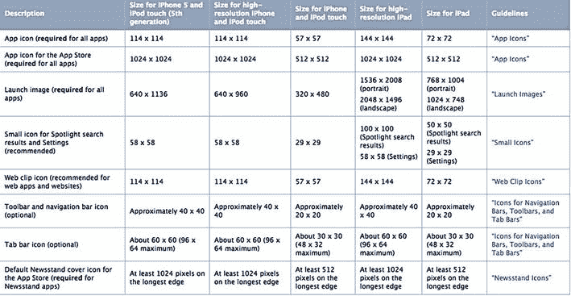

Figure 4-8. 图表显示了所有 `iOS` 图标的推荐尺寸

### 启动图像

`iPad` 的启动图像不应包含每个地区的状态栏，但应为每个方向提供一个启动图像。因此：

- 竖屏：
  - `768 x 1004 px`（非 `Retina`）
  - `1536 x 2008 px`（`Retina`）
- 横屏：
  - `1024 x 748 px`（非 `Retina`）
  - `2048 x 1496 px`（`Retina`）

请记住，在高分辨率 `PNG` 文件名后添加 `@2x`。我们将在第 9 章中更详细地讨论文件命名规范。

#### iPad 专属手势

部分由于其尺寸，`iPad` 拥有一套专属的多点触控手势。花些时间理解这些设备专属手势，将大大有助于理解用户与 `iPad` 的交互方式与 `iPhone` 有何不同，以及 `iPad` 的额外屏幕空间如何让用户在交互和多点触控、多指操作方面有更多作为。这些手势也突显了 `iPad` 是一款真正的生产力工具，用户期望用它做更多事情。因此，这些手势主要围绕使用户能够同时导航和切换多个应用。

要使用这些手势，用户必须在“设置”“通用”菜单中启用`“多任务手势”`模式。这里启用的手势是独特的，因为它们需要多个手指才能触发。

如果你仍在使用 `iPad` 上的 `iOS6`，下面提到的手势仍然有效，但有些会产生不同的结果。例如，四指或五指向上滑动会显示多任务栏，显示当前打开的应用。然而，`iOS6` 中的多任务栏与 `iOS7` 中的不同。

##### 滑动

从左向右或从右向左的四指滑动将允许用户循环浏览 `iPad` 上当前打开的不同应用。要使此操作生效，你必须至少打开两个应用。

四指垂直滑动

#### 排版后的文本

从 iPad 的任意主屏幕，用四指快速向上滑动即可显示多任务栏，其中列出了所有当前打开的应用程序。您可以在 iOS7 的图 4-9 中看到四指滑动的效果。

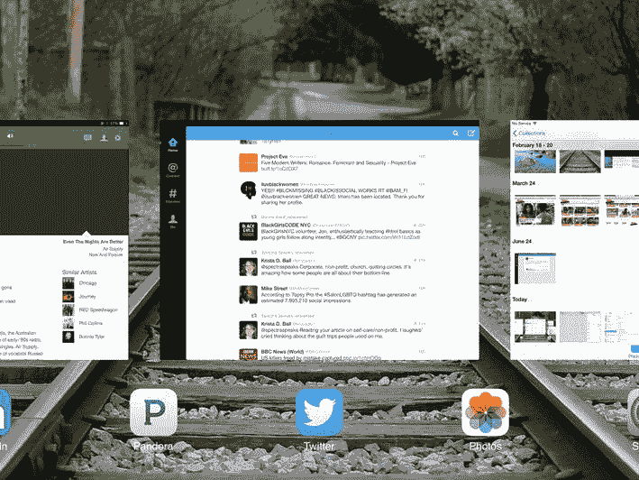

图 4-9. iOS7 中通过四指滑动显示的 iPad 多任务栏

#### 捏合

用四指捏合屏幕将立即将用户带回主屏幕。

### 总结

虽然 iOS 设备的界面相似，但 iPad 和 iPhone 有不同的要求。如果您正在设计一个能够在所有 iOS 设备上运行的通用应用程序，您还需要考虑每个新设备。在设计应用程序时，必须考虑方向、交互和视觉上下文，以确保用户获得最佳体验。由于手势是用户与 iOS 交互的方式，了解可以使用哪些手势至关重要。您的设计需要充分利用 iOS 用户已经熟悉的手势；如果您引入新手势，请确保对其进行说明，因为用户需要将它们与应用程序中的新任务关联起来。

